# 🧩 Полная энциклопедия паттернов разработки

Паттерны из ключевых книг: GoF, PoEAA (Fowler), POSA, EIP, DDD, Microservices Patterns (Richardson), Release It! (Nygard), Patterns of Distributed Systems, Game Programming Patterns, Functional Programming и др.

---

## 🎯 Обновлённая визуальная схема всех паттернов

```mermaid
mindmap
  root((Все паттерны<br/>разработки))
    GoF Creational
      Singleton
      Factory Method
      Abstract Factory
      Builder
      Prototype
      Object Pool
      Multiton
      Type Object
      Delegation
    GoF Structural
      Adapter
      Bridge
      Composite
      Decorator
      Facade
      Flyweight
      Proxy
      Private Class Data
      Marker Interface
      Extension Object
    GoF Behavioral
      Chain of Responsibility
      Command
      Interpreter
      Iterator
      Mediator
      Memento
      Observer
      State
      Strategy
      Template Method
      Visitor
      Specification
      Null Object
      Servant
      Execute Around
    PoEAA Architectural
      Layered Architecture
      Domain Model
      Transaction Script
      Service Layer
      Table Module
      Record Set
    PoEAA Web Presentation
      MVC
      MVP
      MVVM
      Front Controller
      Page Controller
      Template View
      Transform View
      Two Step View
      Application Controller
      Passive View
      Supervising Controller
      Humble Dialog
      Presentation Model
    PoEAA Domain Logic
      Transaction Script
      Domain Model
      Service Layer
      Table Module
    PoEAA Data Source
      Data Mapper
      Active Record
      Unit of Work
      Identity Map
      Lazy Load
      Optimistic Offline Lock
      Pessimistic Offline Lock
      Coarse Grained Lock
      Implicit Lock
    PoEAA Object-Relational
      Identity Field
      Serialized LOB
      Single Table Inheritance
      Class Table Inheritance
      Concrete Table Inheritance
      Inheritance Mappers
    PoEAA Distribution
      Remote Facade
      Data Transfer Object
      Service Layer
    DDD Patterns
      Entity
      Value Object
      Aggregate
      Aggregate Root
      Repository
      Factory
      Domain Service
      Domain Event
      Bounded Context
      Context Map
      Anti-Corruption Layer
      Shared Kernel
      Customer-Supplier
      Conformist
      Partnership
      Open Host Service
      Published Language
      Separate Ways
    EIP Patterns
      Message
      Message Channel
      Point-to-Point Channel
      Publish-Subscribe Channel
      Datatype Channel
      Invalid Message Channel
      Dead Letter Channel
      Guaranteed Delivery
      Message Bus
      Command Message
      Document Message
      Event Message
      Request-Reply
      Return Address
      Correlation Identifier
      Message Sequence
      Message Expiration
      Message Format
      Content Enricher
      Content Filter
      Composed Message Processor
      Scatter-Gather
      Aggregator
      Resequencer
      Routing Slip
      Recipient List
      Filter
      Splitter
      Joiner
      Message Router
      Content-Based Router
      Message Filter
      Dynamic Router
      Recipient List Router
      Distribution List
      Selective Consumer
      Event-Driven Consumer
      Polling Consumer
      Competing Consumers
      Message Dispatcher
      Detour
      Wire Tap
      Message Store
      Claim Check
      Channel Adapter
      Messaging Bridge
      Message Translator
      Envelope Wrapper
      Content Enricher
      Normalizer
      Canonical Data Model
    Microservices Patterns
      API Gateway
      Backend for Frontends
      Strangler Fig
      Anti-Corruption Layer
      Externalized Configuration
      Service Discovery
      Circuit Breaker
      Saga Orchestration
      Saga Choreography
      Transactional Outbox
      Transaction Log Tailing
      Polling Publisher
      Asynchronous Messaging
      Command Handler
      Aggregate
      Event Sourcing
      CQRS
      Serverless Deployment
      Service per Team
      Sidecar
      Ambassador
      Service Mesh
    Distributed Systems
      Leader Election
      Fencing Token
      Quorum
      Gossip Protocol
      Vector Clock
      Lamport Timestamp
      CRDT
      Eventual Consistency
      Single-Leader Replication
      Multi-Leader Replication
      Leaderless Replication
      Partitioning
      Two-Phase Commit
      Three-Phase Commit
      Paxos
      Raft
      Write-Ahead Log
      Replicated Log
      Exactly-Once Semantics
      Idempotent Receiver
      Split Brain
      Witness
      Heartbeat
    Resilience Patterns
      Retry
      Retry with Jitter
      Circuit Breaker
      Bulkhead
      Timeout
      Fallback
      Cache-Aside
      Write-Through
      Write-Behind
      Refresh-Ahead
      Rate Limiting
      Throttling
      Load Shedding
      Leader Election
      Health Endpoint
      Graceful Degradation
      Fail Fast
      Fail Safe
      Watchdog
      Handshaking
      Decoupler
      Middleware
      Scheduler
      Stateful Filter
      Idempotent Processor
      Fencing
      Failsafe
    Cloud-Native
      Sidecar
      Ambassador
      Service Mesh
      Strangler Fig
      Anti-Corruption Layer
      Backends for Frontends
      Static Content Hosting
      Queue-Based Load Leveling
      Priority Queue
      Competing Consumers
      Pipes and Filters
      Edge Computing
      Multi-Region Active-Active
      Immutable Infrastructure
      Pet vs Cattle
      12-Factor App
      GitOps
      Platform Engineering
    Security
      Zero Trust
      RBAC
      ABAC
      ReBAC
      API Key
      OAuth 2.0 / OIDC
      JWT
      mTLS
      Secret Management
      Defense in Depth
      Least Privilege
      Intercepting Filter
      Access Controller
      Authenticator
      Security Proxy
      View Helper
      Secure Logger
      Privileged User
      Fencing Token
    UI / Frontend
      MVC
      MVP
      MVVM
      Passive View
      Supervising Controller
      Application Controller
      Presentation Model
      Humble Dialog
      Dialog Model
      Document/View
      Flux
      Redux
      Signals
      Component-Based
      Atomic Design
      Server Components
      Islands Architecture
      Partial Hydration
      Progressive Enhancement
      Container/Presentational
      Custom Hooks / Composables
      Command Processor
      Undo/Redo
      Wizard
      Window Driver
      Plugin
      Microkernel
    Functional Programming
      Functor
      Monad
      Applicative
      Lens
      Traversable
      Foldable
      Pipe
      Combinator
      Thunk
      Memoization
      Currying
      Partial Application
      Higher-Order Function
      Immutability
      Pure Function
      Referential Transparency
      Tail Recursion
      Lazy Evaluation
    Reactive Programming
      Observable
      Observer
      Subject
      Scheduler
      Backpressure
      Hot Observable
      Cold Observable
      Marble
      Operator
      Reactive Streams
    Game Programming
      Game Loop
      Update Method
      Bytecode
      Subclass Sandbox
      Type Object
      Component
      Event Queue
      Command
      State
      Sequence
      Behavioral Tree
      Flyweight
      Spatial Partition
      Service Locator
      Data Locality
      Dirty Flag
      Object Pool
      Containment Hierarchy
    Parallelism & Concurrency
      Producer-Consumer
      Readers-Writers
      Dining Philosophers
      Monitor Object
      Half-Sync/Half-Async
      Leader-Followers
      Thread-Safe Interface
      Guarded Suspension
      Balking
      Active Object
      Actor Model
      Reactive Streams
      Async/Await
      Futures/Promises
      Virtual Threads
      Dataflow
      Map-Reduce
      Pipeline
      Barrier
    Testing
      AAA (Arrange-Act-Assert)
      Given-When-Then (BDD)
      Test Pyramid
      Contract Testing
      Property-Based Testing
      Mutation Testing
      Testcontainers
      Snapshot Testing
      Fuzzing
      Mocking/Stubbing
      Test Double
      Fake
      Stub
      Spy
      Mock
      Dummy
    Refactoring
      Extract Method
      Extract Class
      Move Method
      Replace Conditional with Polymorphism
      Replace Type Code with Subclasses
      Introduce Parameter Object
      Replace Data Value with Object
      Self Encapsulate Field
      Replace Magic Number with Symbolic Constant
      Introduce Assertion
      Replace Error Code with Exception
      Replace Exception with Test
      Encapsulate Field
      Encapsulate Collection
      Replace Constructor with Factory Method
      Hide Delegate
      Remove Middle Man
      Introduce Foreign Method
      Introduce Local Extension
    Anti-Patterns
      God Object
      God Class
      Blob
      Lava Flow
      Golden Hammer
      Dead End
      Spaghetti Code
      Big Ball of Mud
      Copy-Paste Programming
      Magic Numbers
      Hard Code
      Boat Anchor
      Ambiguous Viewpoint
      Interface Bloat
      Stovepipe System
      Cut-and-Paste Programming
      Race Hazard
      Mushroom Management
      Silver Bullet
      Design by Committee
      Reinventing the Wheel
      Premature Optimization
      Not Invented Here
    Architectural Styles
      Client-Server
      Peer-to-Peer
      Three-Tier
      N-Tier
      Layered
      Pipes and Filters
      Blackboard
      Broker
      Microkernel
      Reflection
      Interceptor
      PAC (Presentation-Abstraction-Control)
      Forwarder-Receiver
      Client-Dispatcher-Server
      Shared Repository
      Event-Driven
      Publish-Subscribe
      Space-Based
      Data-Centric
```

---

## 📊 Таблица 1: Порождающие паттерны (Creational) — расширенная

| № | Наименование | Краткое описание | Где применяется | Источник |
|:-:|--------------|------------------|-----------------|----------|
| 1 | **Singleton** | Гарантирует единственный экземпляр класса с глобальной точкой доступа | Логгеры, конфигурации, connection pools, DI-контейнеры | GoF |
| 2 | **Factory Method** | Определяет интерфейс создания объекта, но позволяет подклассам изменять тип создаваемых объектов | Создание документов, парсеров, UI-элементов | GoF |
| 3 | **Abstract Factory** | Предоставляет интерфейс для создания семейств связанных объектов | Кросс-платформенные UI, БД-провайдеры | GoF |
| 4 | **Builder** | Разделяет конструирование сложного объекта и его представление | Построение HTTP-запросов, SQL, конфигураций | GoF |
| 5 | **Prototype** | Создаёт объекты путём клонирования прототипа | Копирование сложных объектов, игровые юниты | GoF |
| 6 | **Object Pool** | Управляет пулом переиспользуемых объектов | Connection pools, thread pools, игровые пули | GoF (расширение) |
| 7 | **Multiton** | Гарантирует не более одного экземпляра класса на каждый ключ | Реестры, фабрики по типу | GoF (расширение) |
| 8 | **Type Object** | Позволяет создавать новые "классы" путём создания одного экземпляра специального класса | Игровые юниты, типы врагов, конфигурации | Game Programming Patterns |
| 9 | **Delegation** | Объект передаёт ответственность другому объекту (helper) | Composition over inheritance, делегирование поведения | GoF (расширение) |
| 10 | **Lazy Initialization** | Откладывает создание объекта до момента первого использования | Тяжёлые объекты, кэши, connection pools | PoEAA |
| 11 | **Register** | Хранит все экземпляры класса в глобальном реестре | Реестры сервисов, фабрики | PoEAA |
| 12 | **Factory Object** | Отдельный объект, отвечающий за создание других объектов | Spring `@Bean`, DI-контейнеры | PoEAA |
| 13 | **Service Locator** | Предоставляет глобальную точку доступа к сервисам | DI-контейнеры, JNDI | PoEAA |
| 14 | **Dependency Injection** | Передача зависимостей извне, а не создание внутри | Spring, .NET DI, Angular DI | Martin Fowler |
| 15 | **Concrete Factory** | Конкретная реализация Factory Method | Конкретные создатели продуктов | GoF |

---

## 📊 Таблица 2: Структурные паттерны (Structural) — расширенная

| № | Наименование | Краткое описание | Где применяется | Источник |
|:-:|--------------|------------------|-----------------|----------|
| 1 | **Adapter** | Преобразует интерфейс одного класса в интерфейс, ожидаемый клиентом | Обёртки над legacy-кодом, интеграция API | GoF |
| 2 | **Bridge** | Разделяет абстракцию и реализацию | Драйверы БД (JDBC, ODBC), графические API | GoF |
| 3 | **Composite** | Компонует объекты в древовидные структуры | UI-компоненты, файловые системы | GoF |
| 4 | **Decorator** | Динамически добавляет новую ответственность объекту | I/O streams, middleware, логирование | GoF |
| 5 | **Facade** | Предоставляет унифицированный интерфейс к подсистеме | SDK, библиотеки, упрощение API | GoF |
| 6 | **Flyweight** | Позволяет переиспользовать объекты с общим состоянием | Символы в редакторах, игровые тайлы | GoF |
| 7 | **Proxy** | Предоставляет заместителя для контроля доступа | Lazy loading, RPC, кэширующие прокси | GoF |
| 8 | **Private Class Data** | Ограничивает изменение атрибутов объекта | Иммутабельные объекты, настройки | GoF (расширение) |
| 9 | **Marker Interface** | Пустой интерфейс для пометки классов | `Serializable`, `Cloneable`, `Entity` | PoEAA |
| 10 | **Extension Object** | Позволяет расширять объект новыми функциями без изменения класса | Плагины, расширяемые системы | POSA |
| 11 | **Role Object** | Позволяет одному объекту играть разные роли в разных контекстах | Клиент как "Покупатель" и "Поставщик" | POSA |
| 12 | **Class Decorator** | Декоратор на уровне класса (наследование) | Расширение классов | GoF (расширение) |
| 13 | **Service Stub** | Заглушка для внешнего сервиса в тестах | Тестирование, разработка | PoEAA |
| 14 | **Module** | Группирует связанные элементы в единое целое | Модульная архитектура | PoEAA |
| 15 | **Layer Supertype** | Базовый класс для всех объектов в слое | Базовые контроллеры, сервисы, репозитории | PoEAA |
| 16 | **Separated Interface** | Интерфейс в одном слое, реализация в другом | Dependency inversion, чистая архитектура | PoEAA |

---

## 📊 Таблица 3: Поведенческие паттерны (Behavioral) — расширенная

| № | Наименование | Краткое описание | Где применяется | Источник |
|:-:|--------------|------------------|-----------------|----------|
| 1 | **Chain of Responsibility** | Передаёт запрос по цепочке обработчиков | Middleware pipeline, event handlers | GoF |
| 2 | **Command** | Инкапсулирует запрос как объект | Undo/Redo, очереди команд, CQRS | GoF |
| 3 | **Interpreter** | Определяет грамматику языка и интерпретирует предложения | SQL-парсеры, регулярные выражения, DSL | GoF |
| 4 | **Iterator** | Предоставляет способ последовательного перебора | `IEnumerable`, cursor в БД | GoF |
| 5 | **Mediator** | Определяет объект, инкапсулирующий взаимодействие | Чат-комнаты, `MediatR`, диспетчеры | GoF |
| 6 | **Memento** | Фиксирует и восстанавливает внутреннее состояние | Undo/Redo, сохранения в играх | GoF |
| 7 | **Observer** | Определяет зависимость "один ко многим" | Event-driven, Pub/Sub, Rx.NET | GoF |
| 8 | **State** | Позволяет объекту изменять поведение при изменении состояния | Конечные автоматы, workflow, Actors | GoF |
| 9 | **Strategy** | Определяет семейство алгоритмов и делает их взаимозаменяемыми | Стратегии сортировки, оплаты, валидации | GoF |
| 10 | **Template Method** | Определяет скелет алгоритма, делегируя шаги подклассам | Фреймворки, хуки жизненного цикла | GoF |
| 11 | **Visitor** | Описывает операцию над элементами структуры без изменения классов | Обход AST, компиляторы, сериализация | GoF |
| 12 | **Specification** | Инкапсулирует бизнес-правило как объект | Критерии поиска, валидация, фильтрация | DDD (Evans) |
| 13 | **Null Object** | Предоставляет объект-"заглушку" вместо `null` | Пустые коллекции, дефолтные стратегии | PoEAA |
| 14 | **Servant** | Предоставляет общее поведение для группы классов (helper) | Утилитные классы, общие операции | GoF (расширение) |
| 15 | **Execute Around** | Выполняет действие до и после основного кода | `try-with-resources`, `using`, транзакции | GoF (расширение) |
| 16 | **Double Dispatch** | Позволяет выбрать метод на основе типов двух объектов | Коллизии в играх, visitor | GoF (расширение) |
| 17 | **Multiple Dispatch** | Обобщение double dispatch на N объектов | Сложные системы типов | GoF (расширение) |
| 18 | **Hierarchical State Machine** | Состояния с вложенными подсостояниями | Сложные UI-состояния, игровые AI | Game Programming Patterns |
| 19 | **Table Driven Methods** | Использование таблиц вместо сложной логики | Конфигурации, правила валидации | Code Complete |
| 20 | **Transaction Script** | Организация бизнес-логики как одной транзакции | Простые CRUD-операции | PoEAA |

---

## 📊 Таблица 4: Архитектурные стили

| № | Наименование | Краткое описание | Где применяется | Источник |
|:-:|--------------|------------------|-----------------|----------|
| 1 | **Layered Architecture** | Разделение на слои: Presentation → Business → Data | Классические enterprise-приложения | POSA |
| 2 | **Pipes and Filters** | Последовательная обработка данных через фильтры | ETL-пайплайны, компиляторы, shell | POSA |
| 3 | **Blackboard** | Централизованное хранилище данных с компонентами-экспертами | Распознавание речи, AI, сложные задачи | POSA |
| 4 | **Broker** | Посредник между клиентами и серверами (декомпозиция) | CORBA, RMI, RPC-фреймворки | POSA |
| 5 | **Microkernel** | Минимальное ядро с плагинами | IDE (VSCode), браузеры, OSGi | POSA |
| 6 | **Reflection** | Механизм самоанализа и модификации структуры | DI-контейнеры, AOP, аннотации | POSA |
| 7 | **Interceptor** | Перехват вызовов для добавления поведения | AOP, прокси, middleware | POSA |
| 8 | **PAC (Presentation-Abstraction-Control)** | Трёхкомпонентная архитектура UI | Сложные UI-системы | POSA |
| 9 | **Forwarder-Receiver** | Пара компонентов для обмена сообщениями | Распределённые системы, акторы | POSA |
| 10 | **Client-Dispatcher-Server** | Клиент → диспетчер → сервер | Service discovery, load balancing | POSA |
| 11 | **Shared Repository** | Централизованное хранилище данных | Базы данных, файловые системы | POSA |
| 12 | **Event-Driven** | Компоненты реагируют на события | Real-time системы, IoT, микросервисы | POSA |
| 13 | **Publish-Subscribe** | Издатель не знает о подписчиках | Event-driven системы, уведомления | POSA |
| 14 | **Space-Based** | Распределённая архитектура с processing units | High-scalability, биржевые платформы | POSA |
| 15 | **Data-Centric** | Фокус на данных, а не на логике | Базы данных, файловые системы | POSA |
| 16 | **Client-Server** | Разделение на клиента и сервер | Web, desktop, mobile | Классика |
| 17 | **Peer-to-Peer** | Равноправные узлы | BitTorrent, blockchain, P2P-сети | Классика |
| 18 | **Three-Tier / N-Tier** | Разделение на presentation, business, data | Enterprise-приложения | Классика |
| 19 | **Clean Architecture** | Зависимости направлены внутрь, к бизнес-логике | Современные .NET/Java-приложения | Robert Martin |
| 20 | **Hexagonal / Ports & Adapters** | Бизнес-логика в центре, окружена портами | Микросервисы, сложные домены | Alistair Cockburn |
| 21 | **Onion Architecture** | Слои зависят от центра (домена) | DDD-проекты | Jeffrey Palermo |
| 22 | **Microservices** | Система как набор небольших независимых сервисов | Крупные платформы | Sam Newman |
| 23 | **Modular Monolith** | Монолит с чётко разделёнными модулями | Стартапы, mid-size проекты | .NET Aspire |
| 24 | **CQRS** | Разделение операций чтения и записи | Высоконагруженные системы | Greg Young |
| 25 | **Event Sourcing** | Хранение состояния как последовательности событий | Финтех, аудит | Greg Young |
| 26 | **Domain-Driven Design** | Организация кода вокруг бизнес-домена | Сложные enterprise-системы | Eric Evans |
| 27 | **Vertical Slice** | Организация кода по фичам, а не по слоям | Медиа-проекты, быстрые итерации | Jimmy Bogard |
| 28 | **Serverless** | Выполнение кода без управления серверами | Event-driven задачи, API | AWS Lambda |
| 29 | **Cell-Based Architecture** | Система из изолированных "ячеек" | SaaS-платформы, глобальные системы | Cloud Architecture |
| 30 | **MVC / MVP / MVVM** | Разделение UI, логики и данных | Web, Desktop, Mobile | Классика UI |

---

## 📊 Таблица 5: Паттерны PoEAA (Martin Fowler) — Web Presentation

| № | Наименование | Краткое описание | Где применяется |
|:-:|--------------|------------------|-----------------|
| 1 | **Model-View-Controller (MVC)** | Разделение модели, представления и контроллера | ASP.NET MVC, Spring MVC, Ruby on Rails |
| 2 | **Model-View-Presenter (MVP)** | Presenter получает данные и форматирует для View | Windows Forms, старые Android-приложения |
| 3 | **Model-View-ViewModel (MVVM)** | ViewModel связывает Model и View через data binding | WPF, Avalonia, Angular, Vue.js |
| 4 | **Front Controller** | Единая точка входа для всех запросов | ASP.NET MVC, Spring DispatcherServlet |
| 5 | **Page Controller** | Отдельный контроллер для каждой страницы | ASP.NET WebForms, старые MVC |
| 6 | **Template View** | Шаблон для генерации HTML | Razor, Thymeleaf, Jinja2 |
| 7 | **Transform View** | Преобразование данных в представление через XSLT | XSLT, XML-трансформации |
| 8 | **Two Step View** | Двухэтапное формирование представления | Сложные UI с общей структурой |
| 9 | **Application Controller** | Централизованное управление навигацией | Сложные UI-потоки |
| 10 | **Passive View** | View полностью пассивна, Presenter управляет всем | Тестируемые UI |
| 11 | **Supervising Controller** | View частично активна, Controller контролирует сложные операции | Баланс между Passive View и MVC |
| 12 | **Humble Dialog** | Минимальная логика в UI-классе | Тестируемые desktop-приложения |
| 13 | **Dialog Model** | Модель для диалога | Сложные диалоги |
| 14 | **Presentation Model** | Модель представления без зависимости от UI | WPF, Avalonia |
| 15 | **Window Driver** | Драйвер для управления окнами | Desktop-приложения |
| 16 | **View Helper** | Помощник для View | Razor helpers, Thymeleaf fragments |

---

## 📊 Таблица 6: Паттерны PoEAA — Domain Logic

| № | Наименование | Краткое описание | Где применяется |
|:-:|--------------|------------------|-----------------|
| 1 | **Transaction Script** | Организация бизнес-логики как одной транзакции | Простые CRUD-операции |
| 2 | **Domain Model** | Модель предметной области с поведением | Сложные бизнес-правила, DDD |
| 3 | **Service Layer** | Слой сервисов для бизнес-операций | Spring `@Service`, ASP.NET Services |
| 4 | **Table Module** | Один класс на таблицу с бизнес-логикой | Spring JdbcTemplate, ADO.NET |
| 5 | **Record Set** | Набор записей из БД | ADO.NET DataSet, JDBC ResultSet |

---

## 📊 Таблица 7: Паттерны PoEAA — Data Source

| № | Наименование | Краткое описание | Где применяется |
|:-:|--------------|------------------|-----------------|
| 1 | **Data Mapper** | Преобразование между объектами и БД без зависимости | Hibernate, Entity Framework |
| 2 | **Active Record** | Объект содержит и данные, и поведение доступа | Django ORM, Ruby on Rails |
| 3 | **Unit of Work** | Группировка изменений в одну транзакцию | `DbContext` в EF Core, Spring `@Transactional` |
| 4 | **Identity Map** | Гарантия загрузки объекта только один раз | Hibernate Session, EF Core Change Tracker |
| 5 | **Lazy Load** | Загрузка данных только при обращении | Virtual properties, `Lazy<T>`, прокси |
| 6 | **Optimistic Offline Lock** | Проверка версии при сохранении | `RowVersion`, `@Version`, `ETag` |
| 7 | **Pessimistic Offline Lock** | Блокировка записи на время работы | `SELECT FOR UPDATE`, транзакционные блокировки |
| 8 | **Coarse Grained Lock** | Блокировка группы связанных объектов | Блокировка агрегата целиком |
| 9 | **Implicit Lock** | Автоматическая блокировка на уровне фреймворка | Hibernate optimistic locking |

---

## 📊 Таблица 8: Паттерны PoEAA — Object-Relational

| № | Наименование | Краткое описание | Где применяется |
|:-:|--------------|------------------|-----------------|
| 1 | **Identity Field** | Уникальный идентификатор для каждой записи | Primary key, GUID |
| 2 | **Serialized LOB** | Хранение объекта как XML/JSON в одной колонке | JSONB в PostgreSQL, NVARCHAR(MAX) в SQL Server |
| 3 | **Single Table Inheritance** | Все классы иерархии в одной таблице | `discriminator` в EF Core, Django |
| 4 | **Class Table Inheritance** | Каждая таблица для каждого класса | Наследование с отдельными таблицами |
| 5 | **Concrete Table Inheritance** | Отдельная таблица для каждого конкретного класса | Денормализованное наследование |
| 6 | **Inheritance Mappers** | Стратегии маппинга наследования | EF Core, Hibernate, NHibernate |
| 7 | **Binary-Relational Mapping** | Маппинг бинарных данных | BLOB, BYTEA |
| 8 | **Primary Metadata Mapping** | Маппинг метаданных | Аннотации, fluent API |

---

## 📊 Таблица 9: Паттерны PoEAA — Distribution

| № | Наименование | Краткое описание | Где применяется |
|:-:|--------------|------------------|-----------------|
| 1 | **Remote Facade** | Упрощённый интерфейс для удалённых вызовов | REST API, gRPC |
| 2 | **Data Transfer Object (DTO)** | Объект для передачи данных между слоями | API-ответы, межсервисное взаимодействие |
| 3 | **Service Layer** | Слой сервисов для бизнес-операций | Spring `@Service`, ASP.NET Services |

---

## 📊 Таблица 10: Паттерны Domain-Driven Design (Eric Evans, Vaughn Vernon)

| № | Наименование | Краткое описание | Где применяется |
|:-:|--------------|------------------|-----------------|
| 1 | **Entity** | Объект с идентичностью, не определяемой атрибутами | Пользователи, заказы, продукты |
| 2 | **Value Object** | Объект без идентичности, определяется атрибутами | Адрес, деньги, координаты |
| 3 | **Aggregate** | Кластер связанных объектов как единица изменения | Заказ + товары заказа |
| 4 | **Aggregate Root** | Корневой объект агрегата, точка входа | Order в OrderAggregate |
| 5 | **Repository** | Абстракция доступа к агрегатам | `IOrderRepository` |
| 6 | **Factory** | Создание сложных объектов | `OrderFactory`, `UserFactory` |
| 7 | **Domain Service** | Бизнес-логика, не принадлежащая ни одному объекту | `PaymentService`, `ShippingService` |
| 8 | **Domain Event** | Событие, произошедшее в домене | `OrderCreated`, `PaymentReceived` |
| 9 | **Bounded Context** | Граница контекста с единой моделью | Контекст "Заказы", "Платежи" |
| 10 | **Context Map** | Карта взаимосвязей между контекстами | Документация интеграций |
| 11 | **Anti-Corruption Layer** | Слой перевода между разными доменными моделями | Интеграция legacy-систем |
| 12 | **Shared Kernel** | Общая часть модели между контекстами | Общие Value Objects |
| 13 | **Customer-Supplier** | Отношения клиент-поставщик между контекстами | Upstream/downstream |
| 14 | **Conformist** | Подчинение одному контексту | Миграция на новую систему |
| 15 | **Partnership** | Равноправное сотрудничество контекстов | Совместная разработка |
| 16 | **Open Host Service** | Открытый API для контекста | REST API, gRPC |
| 17 | **Published Language** | Общий язык для обмена | Protobuf, JSON Schema |
| 18 | **Separate Ways** | Независимые контексты без интеграции | Разные домены |

---

## 📊 Таблица 11: Enterprise Integration Patterns (Hohpe & Woolf)

| № | Наименование | Краткое описание | Где применяется |
|:-:|--------------|------------------|-----------------|
| 1 | **Message** | Единица данных для передачи | JSON, XML, Protobuf |
| 2 | **Message Channel** | Канал передачи сообщений | Queue, Topic |
| 3 | **Point-to-Point Channel** | Канал "один к одному" | RabbitMQ queue |
| 4 | **Publish-Subscribe Channel** | Канал "один ко многим" | Kafka topic, RabbitMQ exchange |
| 5 | **Datatype Channel** | Канал для определённого типа данных | Отдельные очереди для типов событий |
| 6 | **Invalid Message Channel** | Канал для невалидных сообщений | Очередь ошибок |
| 7 | **Dead Letter Channel** | Канал для необработанных сообщений | Dead letter queue |
| 8 | **Guaranteed Delivery** | Гарантия доставки сообщений | Acknowledgements, persistence |
| 9 | **Message Bus** | Шина сообщений | Apache Camel, MassTransit |
| 10 | **Command Message** | Сообщение-команда | `CreateOrderCommand` |
| 11 | **Document Message** | Сообщение-документ | `OrderDocument` |
| 12 | **Event Message** | Сообщение-событие | `OrderCreatedEvent` |
| 13 | **Request-Reply** | Запрос с ожиданием ответа | REST API, gRPC |
| 14 | **Return Address** | Адрес для ответа | `ReplyTo` header |
| 15 | **Correlation Identifier** | Идентификатор для связывания сообщений | `CorrelationId` header |
| 16 | **Message Sequence** | Последовательность сообщений | Нумерация сообщений |
| 17 | **Message Expiration** | Время жизни сообщения | TTL в очередях |
| 18 | **Message Format** | Формат сообщения | JSON, XML, Avro |
| 19 | **Content Enricher** | Обогащение сообщения данными | Добавление данных из БД |
| 20 | **Content Filter** | Фильтрация содержимого сообщения | Удаление лишних полей |
| 21 | **Composed Message Processor** | Обработка составного сообщения | Разбиение и сборка |
| 22 | **Scatter-Gather** | Рассылка и сбор ответов | Параллельные вызовы |
| 23 | **Aggregator** | Объединение нескольких сообщений | Корзины покупок |
| 24 | **Resequencer** | Переупорядочивание сообщений | Восстановление порядка |
| 25 | **Routing Slip** | Маршрутная квитанция | Путь сообщения |
| 26 | **Recipient List** | Список получателей | Мультикаст |
| 27 | **Filter** | Фильтрация сообщений | Условная обработка |
| 28 | **Splitter** | Разбиение сообщения на части | Обработка больших данных |
| 29 | **Joiner** | Объединение частей сообщения | Сборка результата |
| 30 | **Message Router** | Маршрутизация сообщений | Content-Based Router |
| 31 | **Content-Based Router** | Маршрутизация по содержимому | Обработка разных типов событий |
| 32 | **Message Filter** | Фильтрация сообщений | Условная обработка |
| 33 | **Dynamic Router** | Динамическая маршрутизация | Runtime-конфигурация |
| 34 | **Recipient List Router** | Маршрутизация по списку получателей | Мультикаст |
| 35 | **Distribution List** | Список рассылки | Email-рассылки |
| 36 | **Selective Consumer** | Выборочный потребитель | Фильтрация на стороне потребителя |
| 37 | **Event-Driven Consumer** | Потребитель, управляемый событиями | Подписчики |
| 38 | **Polling Consumer** | Потребитель, опрашивающий очередь | Periodic polling |
| 39 | **Competing Consumers** | Конкурирующие потребители | Worker services |
| 40 | **Message Dispatcher** | Диспетчер сообщений | Load balancer |
| 41 | **Detour** | Обходной путь | Fallback |
| 42 | **Wire Tap** | Ответвление для мониторинга | Логирование, аудит |
| 43 | **Message Store** | Хранилище сообщений | Event Store |
| 44 | **Claim Check** | Передача ссылки вместо данных | Большие сообщения |
| 45 | **Channel Adapter** | Адаптер канала | Интеграция с внешними системами |
| 46 | **Messaging Bridge** | Мост между каналами | Интеграция разных брокеров |
| 47 | **Message Translator** | Переводчик сообщений | Конвертация форматов |
| 48 | **Envelope Wrapper** | Обёртка сообщения | Добавление метаданных |
| 49 | **Normalizer** | Нормализация сообщений | Унификация форматов |
| 50 | **Canonical Data Model** | Каноническая модель данных | Единая модель для интеграции |

---

## 📊 Таблица 12: Паттерны микросервисов (Chris Richardson)

| № | Наименование | Краткое описание | Где применяется |
|:-:|--------------|------------------|-----------------|
| 1 | **API Gateway** | Единая точка входа для группы микросервисов | Ocelot, YARP, Kong |
| 2 | **Backend for Frontends (BFF)** | Отдельный backend для каждого типа клиента | Mobile BFF, Web BFF |
| 3 | **Strangler Fig** | Постепенная замена legacy-системы | Миграции, YARP |
| 4 | **Anti-Corruption Layer** | Слой перевода между разными доменными моделями | Интеграция legacy |
| 5 | **Externalized Configuration** | Внешняя конфигурация | Consul, etcd, Spring Cloud Config |
| 6 | **Service Discovery** | Обнаружение сервисов | Consul, Eureka, Kubernetes |
| 7 | **Circuit Breaker** | Прекращение вызовов при сбоях | Polly, Resilience4j |
| 8 | **Saga Orchestration** | Координатор управляет распределённой транзакцией | MassTransit, Temporal |
| 9 | **Saga Choreography** | Сервисы координируются через события | Event-driven |
| 10 | **Transactional Outbox** | Атомарная запись в БД и очередь | Debezium, MassTransit |
| 11 | **Transaction Log Tailing** | Чтение лога транзакций | Debezium CDC |
| 12 | **Polling Publisher** | Периодический опрос БД на изменения | Polling CDC |
| 13 | **Asynchronous Messaging** | Асинхронный обмен сообщениями | Kafka, RabbitMQ |
| 14 | **Command Handler** | Обработчик команд | CQRS handlers |
| 15 | **Aggregate** | Кластер связанных объектов | DDD Aggregates |
| 16 | **Event Sourcing** | Хранение состояния как событий | EventStoreDB, Marten |
| 17 | **CQRS** | Разделение чтения и записи | MediatR, Wolverine |
| 18 | **Serverless Deployment** | Развёртывание без серверов | AWS Lambda, Azure Functions |
| 19 | **Service per Team** | Один сервис на команду | Conway's Law |
| 20 | **Sidecar** | Дополнительный контейнер рядом с основным | Istio proxy |
| 21 | **Ambassador** | Прокси для внешних зависимостей | Аутентификация, retry |
| 22 | **Service Mesh** | Инфраструктурный слой для межсервисного взаимодействия | Istio, Linkerd |

---

## 📊 Таблица 13: Паттерны распределённых систем (Kleppmann, Nygard)

| № | Наименование | Краткое описание | Где применяется |
|:-:|--------------|------------------|-----------------|
| 1 | **Leader Election** | Выбор одного лидера в распределённой системе | Distributed locks, планировщики |
| 2 | **Fencing Token** | Токен для предотвращения конфликтов | Distributed locks |
| 3 | **Quorum** | Кворум для принятия решений | Cassandra, DynamoDB |
| 4 | **Gossip Protocol** | Протокол распространения информации | Cluster membership |
| 5 | **Vector Clock** | Векторные часы для определения порядка | Dynamo, Riak |
| 6 | **Lamport Timestamp** | Логические часы | Ordering events |
| 7 | **CRDT** | Conflict-free Replicated Data Types | Collaborative editing |
| 8 | **Eventual Consistency** | Согласованность в конечном счёте | Cassandra, DynamoDB |
| 9 | **Single-Leader Replication** | Репликация с одним лидером | PostgreSQL streaming replication |
| 10 | **Multi-Leader Replication** | Репликация с несколькими лидерами | BDR, CouchDB |
| 11 | **Leaderless Replication** | Репликация без лидера | Cassandra, Dynamo |
| 12 | **Partitioning** | Разделение данных на партиции | Шардирование |
| 13 | **Two-Phase Commit (2PC)** | Двухфазный коммит | XA transactions |
| 14 | **Three-Phase Commit (3PC)** | Трёхфазный коммит | Улучшенный 2PC |
| 15 | **Paxos** | Алгоритм консенсуса | Google Chubby |
| 16 | **Raft** | Понятный алгоритм консенсуса | etcd, Consul |
| 17 | **Write-Ahead Log (WAL)** | Журнал предварительной записи | PostgreSQL, MySQL |
| 18 | **Replicated Log** | Реплицируемый журнал | Kafka, Raft |
| 19 | **Exactly-Once Semantics** | Семантика "ровно один раз" | Kafka transactions |
| 20 | **Idempotent Receiver** | Многократная обработка безопасна | Платежные системы |
| 21 | **Split Brain** | Разделение кластера | Fencing, quorum |
| 22 | **Witness** | Свидетель для разрешения split brain | Quorum-based systems |
| 23 | **Heartbeat** | Сигналы жизни | Cluster health |
| 24 | **Snapshot Isolation** | Изоляция снимков | PostgreSQL, Oracle |
| 25 | **Serializable** | Сериализуемость транзакций | Strict consistency |
| 26 | **Two-Phase Locking** | Двухфазная блокировка | Database locks |
| 27 | **Distributed Transactions** | Распределённые транзакции | XA, Saga |

---

## 📊 Таблица 14: Паттерны отказоустойчивости (Resilience) — расширенная

| № | Наименование | Краткое описание | Где применяется |
|:-:|--------------|------------------|-----------------|
| 1 | **Retry** | Повторные попытки при временных сбоях | Polly, Tenacity |
| 2 | **Retry with Jitter** | Retry со случайной задержкой | Избежание thundering herd |
| 3 | **Circuit Breaker** | Прекращение вызовов при множественных сбоях | Polly, Resilience4j |
| 4 | **Bulkhead** | Изоляция ресурсов для предотвращения каскадных сбоев | Отдельные thread pools |
| 5 | **Timeout** | Ограничение времени ожидания ответа | HTTP-клиенты, БД-запросы |
| 6 | **Fallback** | Альтернативный сценарий при сбое | Кэш как fallback |
| 7 | **Cache-Aside** | Приложение само управляет кэшем | Redis, MemoryCache |
| 8 | **Write-Through** | Запись в кэш и БД одновременно | Strong consistency |
| 9 | **Write-Behind (Write-Back)** | Запись в кэш, асинхронно в БД | High write throughput |
| 10 | **Refresh-Ahead** | Асинхронное обновление кэша до истечения | Prediction-based caching |
| 11 | **Rate Limiting** | Ограничение частоты запросов | API Gateway |
| 12 | **Throttling** | Контроль потребления ресурсов | Очереди, фоновые задачи |
| 13 | **Load Shedding** | Сброс нагрузки при перегрузке | Priority queues |
| 14 | **Leader Election** | Выбор одного лидера | Distributed locks |
| 15 | **Health Endpoint** | Эндпоинт для проверки работоспособности | Kubernetes probes |
| 16 | **Graceful Degradation** | Ухудшение функциональности вместо отказа | Отключение некритичных фич |
| 17 | **Fail Fast** | Быстрый отказ при ошибке | Валидация на входе |
| 18 | **Fail Safe** | Безопасный отказ | Fallback values |
| 19 | **Watchdog** | Сторожевой таймер | Мониторинг процессов |
| 20 | **Handshaking** | Рукопожатие при установлении связи | TCP handshake |
| 21 | **Decoupler** | Разделитель компонентов | Message queues |
| 22 | **Middleware** | Промежуточный слой | ASP.NET middleware |
| 23 | **Scheduler** | Планировщик задач | Quartz, Hangfire |
| 24 | **Stateful Filter** | Фильтр с состоянием | Rate limiters |
| 25 | **Idempotent Processor** | Идемпотентный обработчик | Повторные обработки |
| 26 | **Fencing** | Ограждение ресурсов | Distributed locks |
| 27 | **Failsafe** | Аварийный режим | Fallback systems |

---

## 📊 Таблица 15: Паттерны Cloud-Native

| № | Наименование | Краткое описание | Где применяется |
|:-:|--------------|------------------|-----------------|
| 1 | **Sidecar** | Дополнительный контейнер рядом с основным | Istio proxy, logging agents |
| 2 | **Ambassador** | Прокси для внешних зависимостей | Аутентификация, retry |
| 3 | **Service Mesh** | Инфраструктурный слой для межсервисного взаимодействия | Istio, Linkerd |
| 4 | **Strangler Fig** | Постепенная замена legacy-системы | Миграции, YARP |
| 5 | **Anti-Corruption Layer** | Слой перевода между разными доменными моделями | Интеграция legacy |
| 6 | **Backends for Frontends (BFF)** | Отдельный backend для каждого типа клиента | Mobile BFF, Web BFF |
| 7 | **Static Content Hosting** | Раздача статики из CDN | S3 + CloudFront |
| 8 | **Queue-Based Load Leveling** | Очередь как буфер для пиковых нагрузок | RabbitMQ, Kafka |
| 9 | **Priority Queue** | Обработка сообщений по приоритету | Критичные vs фоновые задачи |
| 10 | **Competing Consumers** | Несколько обработчиков одной очереди | Worker services |
| 11 | **Pipes and Filters** | Последовательная обработка через фильтры | ETL-пайплайны |
| 12 | **Edge Computing** | Выполнение кода ближе к пользователю | Cloudflare Workers |
| 13 | **Multi-Region Active-Active** | Активные реплики в нескольких регионах | Глобальные системы |
| 14 | **Immutable Infrastructure** | Серверы не меняются, а заменяются | Containers, AMI |
| 15 | **Pet vs Cattle** | Серверы как скот, а не питомцы | Auto-scaling |
| 16 | **12-Factor App** | Принципы cloud-native приложений | Heroku, microservices |
| 17 | **GitOps** | Инфраструктура как Git-репозиторий | Argo CD, Flux |
| 18 | **Platform Engineering** | Внутренняя платформа для разработчиков | Backstage, Port |
| 19 | **FinOps** | Управление cloud-затратами | Kubecost, Infracost |
| 20 | **Shift-Left Security** | Безопасность на ранних этапах | SAST, DAST |
| 21 | **Chaos Engineering** | Намеренное внесение сбоев | Chaos Monkey, Litmus |
| 22 | **Observability (3 Pillars)** | Metrics + Logs + Traces | OpenTelemetry |
| 23 | **Continuous Profiling** | Постоянный profiling | Parca, Pyroscope |
| 24 | **Policy as Code** | Политики как код | OPA, Kyverno |

---

## 📊 Таблица 16: Паттерны безопасности

| № | Наименование | Краткое описание | Где применяется |
|:-:|--------------|------------------|-----------------|
| 1 | **Zero Trust** | "Никому не доверяй, проверяй всё" | mTLS, SPIFFE, OPA |
| 2 | **RBAC (Role-Based)** | Доступ на основе ролей | Enterprise-системы |
| 3 | **ABAC (Attribute-Based)** | Доступ на основе атрибутов | Сложные политики |
| 4 | **ReBAC (Relationship-Based)** | Доступ на основе отношений | SpiceDB, OpenFGA |
| 5 | **API Key** | Простой ключ для доступа к API | Публичные API |
| 6 | **OAuth 2.0 / OIDC** | Делегирование авторизации и аутентификации | SSO, сторонние login |
| 7 | **JWT (JSON Web Token)** | Компактный токен с claims | Stateless аутентификация |
| 8 | **mTLS** | Взаимная аутентификация TLS | Service mesh |
| 9 | **Secret Management** | Централизованное хранение секретов | HashiCorp Vault |
| 10 | **Defense in Depth** | Многоуровневая защита | Firewall + WAF + RLS |
| 11 | **Least Privilege** | Минимальные необходимые права | IAM-роли |
| 12 | **Intercepting Filter** | Перехват запросов для проверки | Web filters |
| 13 | **Access Controller** | Контроллер доступа | Authorization middleware |
| 14 | **Authenticator** | Аутентификатор | Login services |
| 15 | **Security Proxy** | Прокси для безопасности | Security decorators |
| 16 | **View Helper** | Помощник для безопасного отображения | HTML encoding |
| 17 | **Secure Logger** | Безопасное логирование | Masking sensitive data |
| 18 | **Privileged User** | Привилегированный пользователь | Admin accounts |
| 19 | **Fencing Token** | Токен для предотвращения конфликтов | Distributed locks |
| 20 | **Passkeys / WebAuthn** | Беспарольная аутентификация | FIDO2 |
| 21 | **Token Binding** | Привязка токенов к клиенту | Enhanced security |
| 22 | **Certificate Pinning** | Привязка сертификатов | Mobile apps |

---

## 📊 Таблица 17: Паттерны UI / Frontend

| № | Наименование | Краткое описание | Где применяется |
|:-:|--------------|------------------|-----------------|
| 1 | **MVC** | Model-View-Controller | ASP.NET MVC, Spring MVC |
| 2 | **MVP** | Model-View-Presenter | Windows Forms |
| 3 | **MVVM** | Model-View-ViewModel | WPF, Angular, Vue.js |
| 4 | **Passive View** | View полностью пассивна | Тестируемые UI |
| 5 | **Supervising Controller** | View частично активна | Баланс MVC/MVP |
| 6 | **Application Controller** | Централизованное управление навигацией | Сложные UI-потоки |
| 7 | **Presentation Model** | Модель представления без зависимости от UI | WPF, Avalonia |
| 8 | **Humble Dialog** | Минимальная логика в UI-классе | Тестируемые desktop-приложения |
| 9 | **Dialog Model** | Модель для диалога | Сложные диалоги |
| 10 | **Document/View** | Разделение документа и его представления | Desktop-приложения |
| 11 | **Flux** | Однонаправленный поток данных | Facebook Flux |
| 12 | **Redux** | Централизованное хранилище состояния | React + Redux Toolkit |
| 13 | **Signals** | Fine-grained реактивность | Angular, Solid.js, Preact |
| 14 | **Component-Based** | UI из независимых компонентов | React, Vue, Svelte |
| 15 | **Atomic Design** | Иерархия: Atoms → Molecules → Organisms | Design systems |
| 16 | **Server Components** | Рендеринг компонентов на сервере | React Server Components |
| 17 | **Islands Architecture** | Гидратация только интерактивных частей | Astro, Qwik |
| 18 | **Partial Hydration** | Частичная гидратация SPA | Next.js, Astro |
| 19 | **Progressive Enhancement** | Базовая функциональность без JS | HTMX, server-rendered |
| 20 | **Container/Presentational** | Разделение логики и представления | React, Vue |
| 21 | **Custom Hooks / Composables** | Переиспользуемая логика | React Hooks, Vue Composables |
| 22 | **Command Processor** | Обработчик команд UI | Undo/Redo |
| 23 | **Undo/Redo** | Отмена и повтор действий | Текстовые редакторы |
| 24 | **Wizard** | Пошаговый мастер | Формы регистрации |
| 25 | **Window Driver** | Драйвер для управления окнами | Desktop-приложения |
| 26 | **Plugin** | Расширение функциональности через плагины | IDE, браузеры |
| 27 | **Microkernel** | Минимальное ядро с плагинами | VSCode, OSGi |
| 28 | **Lazy Load** | Загрузка данных только при необходимости | Infinite scroll |
| 29 | **Virtual Scroll** | Виртуализация больших списков | UI performance |
| 30 | **Skeleton Screen** | Заглушка при загрузке | UX loading states |

---

## 📊 Таблица 18: Паттерны функционального программирования

| № | Наименование | Краткое описание | Где применяется |
|:-:|--------------|------------------|-----------------|
| 1 | **Functor** | Контейнер с функцией `map` | `Optional<T>`, `IEnumerable<T>` |
| 2 | **Monad** | Контейнер с `flatMap` (bind) | `Task<T>`, `IO<T>`, `Maybe<T>` |
| 3 | **Applicative** | Контейнер с `apply` | Валидация, парсинг |
| 4 | **Lens** | Функциональный доступ к полям | Immutable updates |
| 5 | **Traversable** | Обход структуры с эффектом | Async operations |
| 6 | **Foldable** | Свёртка структуры | `reduce`, `fold` |
| 7 | **Pipe** | Композиция функций | F# `|>`, Unix pipes |
| 8 | **Combinator** | Функция, возвращающая функцию | LINQ operators |
| 9 | **Thunk** | Отложенное вычисление | Lazy evaluation |
| 10 | **Memoization** | Кэширование результатов функций | Recursive functions |
| 11 | **Currying** | Преобразование функции с N аргументов | Partial application |
| 12 | **Partial Application** | Частичное применение функции | LINQ, F# |
| 13 | **Higher-Order Function** | Функция, принимающая/возвращающая функции | LINQ, map/filter/reduce |
| 14 | **Immutability** | Неизменяемость данных | Functional state management |
| 15 | **Pure Function** | Функция без побочных эффектов | Testable code |
| 16 | **Referential Transparency** | Ссылочная прозрачность | Equational reasoning |
| 17 | **Tail Recursion** | Хвостовая рекурсия | Optimized recursion |
| 18 | **Lazy Evaluation** | Ленивые вычисления | Haskell, LINQ |
| 19 | **Pattern Matching** | Сопоставление с образцом | F# match, C# switch |
| 20 | **Discriminated Union** | Алгебраический тип данных | F# DU, Rust enum |
| 21 | **Option/Maybe** | Тип для отсутствующих значений | `Option<T>`, `Maybe<T>` |
| 22 | **Result/Either** | Тип для ошибок | `Result<T, E>`, `Either<L, R>` |
| 23 | **Railway Oriented Programming** | Композиция операций с ошибками | F# ROP |
| 24 | **Actor Model** | Модель акторов (функциональная) | Akka, Orleans |

---

## 📊 Таблица 19: Паттерны Reactive Programming

| № | Наименование | Краткое описание | Где применяется |
|:-:|--------------|------------------|-----------------|
| 1 | **Observable** | Источник событий | Rx.NET, Reactor |
| 2 | **Observer** | Подписчик на события | Subscribers |
| 3 | **Subject** | И Observable, и Observer | Event buses |
| 4 | **Scheduler** | Планировщик выполнения | Threading control |
| 5 | **Backpressure** | Контроль потока данных | Reactive Streams |
| 6 | **Hot Observable** | "Горячий" источник (не ждёт подписчиков) | UI events |
| 7 | **Cold Observable** | "Холодный" источник (ждёт подписчиков) | HTTP requests |
| 8 | **Marble** | Визуализация потоков | Marble diagrams |
| 9 | **Operator** | Оператор для трансформации | map, filter, reduce |
| 10 | **Reactive Streams** | Стандарт для реактивных потоков | Reactive Streams spec |
| 11 | **Publisher** | Издатель | Reactive Streams |
| 12 | **Subscriber** | Подписчик | Reactive Streams |
| 13 | **Subscription** | Подписка | Reactive Streams |
| 14 | **Processor** | Обработчик (Publisher + Subscriber) | Reactive Streams |
| 15 | **Flowable** | Поток с backpressure (Reactor) | Reactor |
| 16 | **Mono** | Поток с 0 или 1 элементом (Reactor) | Reactor |
| 17 | **Flux** | Поток с 0..N элементами (Reactor) | Reactor |

---

## 📊 Таблица 20: Паттерны игрового программирования (Robert Nystrom)

| № | Наименование | Краткое описание | Где применяется |
|:-:|--------------|------------------|-----------------|
| 1 | **Game Loop** | Основной цикл игры | Все игры |
| 2 | **Update Method** | Метод обновления состояния | GameObjects |
| 3 | **Bytecode** | Интерпретация кода | Scripting engines |
| 4 | **Subclass Sandbox** | Базовый класс с абстрактными методами | Character abilities |
| 5 | **Type Object** | Объект типа вместо класса | Unit types |
| 6 | **Component** | Компонентный подход | ECS (Entity Component System) |
| 7 | **Event Queue** | Очередь событий | Game events |
| 8 | **Command** | Команды для действий | Input handling |
| 9 | **State** | Состояния объекта | FSM для AI |
| 10 | **Sequence** | Последовательность действий | Animations |
| 11 | **Behavioral Tree** | Дерево поведений | AI |
| 12 | **Flyweight** | Переиспользование объектов | Particles, tiles |
| 13 | **Spatial Partition** | Пространственное разбиение | Collision detection |
| 14 | **Service Locator** | Локатор сервисов | Game services |
| 15 | **Data Locality** | Локальность данных | Cache optimization |
| 16 | **Dirty Flag** | Флаг изменений | Optimization |
| 17 | **Object Pool** | Пул объектов | Bullets, enemies |
| 18 | **Containment Hierarchy** | Иерархия вложенности | Scene graph |
| 19 | **Double Buffer** | Двойная буферизация | Rendering |
| 20 | **Observer** | Наблюдатель | Game events |

---

## 📊 Таблица 21: Паттерны параллелизма и асинхронности

| № | Наименование | Краткое описание | Где применяется |
|:-:|--------------|------------------|-----------------|
| 1 | **Producer-Consumer** | Производители и потребители через очередь | `Channel<T>`, Kafka |
| 2 | **Readers-Writers** | Множество читателей, один писатель | Read-heavy workloads |
| 3 | **Dining Philosophers** | Проблема взаимных блокировок | Resource allocation |
| 4 | **Monitor Object** | Объект с синхронизированными методами | Thread-safe objects |
| 5 | **Half-Sync/Half-Async** | Разделение синхронной и асинхронной частей | Network servers |
| 6 | **Leader-Followers** | Лидер распределяет работу | Thread pools |
| 7 | **Thread-Safe Interface** | Потокобезопасный интерфейс | Concurrent collections |
| 8 | **Guarded Suspension** | Приостановка до выполнения условия | Condition variables |
| 9 | **Balking** | Отказ от действия при невыполнении условия | Optimistic concurrency |
| 10 | **Active Object** | Объект с собственным потоком | Asynchronous methods |
| 11 | **Actor Model** | Акторы обмениваются сообщениями | Akka.NET, Orleans |
| 12 | **Reactive Streams** | Потоковая обработка с backpressure | Rx.NET, Reactor |
| 13 | **Async/Await** | Асинхронное программирование без callbacks | C#, Python, JS |
| 14 | **Futures / Promises** | Объект-представление будущего результата | `Task<T>`, Promise |
| 15 | **Virtual Threads** | Миллионы легковесных потоков | Java 21+ Loom |
| 16 | **Dataflow** | Потоковая обработка через блоки | TPL Dataflow |
| 17 | **Map-Reduce** | Параллельная обработка больших данных | Hadoop, Spark |
| 18 | **Pipeline** | Последовательная обработка этапов | CI/CD, ETL |
| 19 | **Barrier** | Синхронизация нескольких потоков | `Barrier`, `CountDownLatch` |
| 20 | **Semaphore** | Счётчик для ограничения доступа | Rate limiters |
| 21 | **Mutex** | Взаимное исключение | Critical sections |
| 22 | **ReadWriteLock** | Разделение читателей и писателей | Concurrent data structures |
| 23 | **Condition Variable** | Условная переменная | Thread coordination |
| 24 | **Thread Pool** | Пул потоков | Task parallelism |
| 25 | **Work Stealing** | Кража работы у других потоков | Fork-join pools |
| 26 | **Fork-Join** | Разделение и объединение задач | Parallel collections |
| 27 | **Continuation** | Продолжение вычисления | Async/await |
| 28 | **Coroutine** | Кооперативная многозадачность | Python, C#, Kotlin |

---

## 📊 Таблица 22: Паттерны тестирования

| № | Наименование | Краткое описание | Где применяется |
|:-:|--------------|------------------|-----------------|
| 1 | **AAA (Arrange-Act-Assert)** | Структура теста | Unit-тесты |
| 2 | **Given-When-Then (BDD)** | Формат сценариев | SpecFlow, Cucumber |
| 3 | **Test Pyramid** | Много unit, меньше integration, ещё меньше E2E | Стратегия тестирования |
| 4 | **Contract Testing** | Проверка контрактов между сервисами | Pact, Spring Cloud Contract |
| 5 | **Property-Based Testing** | Тестирование свойств | Hypothesis, FsCheck |
| 6 | **Mutation Testing** | Измерение качества тестов | Stryker, PIT |
| 7 | **Testcontainers** | Реальные зависимости в тестах | Docker-контейнеры |
| 8 | **Snapshot Testing** | Сравнение с эталонным снапшотом | Jest, Vitest |
| 9 | **Fuzzing** | Случайные входные данные | AFL, libFuzzer |
| 10 | **Mocking / Stubbing** | Замена зависимостей | Moq, NSubstitute |
| 11 | **Test Double** | Общий термин для замен | xUnit terminology |
| 12 | **Fake** | Упрощённая рабочая реализация | In-memory database |
| 13 | **Stub** | Заглушка с заранее заданными ответами | Fixed responses |
| 14 | **Spy** | Шпион, записывающий вызовы | Verifying interactions |
| 15 | **Mock** | Объект с ожиданиями | Moq, Mockito |
| 16 | **Dummy** | Пустой объект, не используется | Filling parameters |
| 17 | **Fixture** | Фикстура для тестов | Test setup |
| 18 | **Parameterized Test** | Параметризованные тесты | Multiple inputs |
| 19 | **Data-Driven Test** | Тесты на данных | CSV, JSON inputs |
| 20 | **Golden Master Test** | Сравнение с эталоном | Legacy code |

---

## 📊 Таблица 23: Паттерны рефакторинга (Martin Fowler)

| № | Наименование | Краткое описание | Где применяется |
|:-:|--------------|------------------|-----------------|
| 1 | **Extract Method** | Выделение метода из фрагмента кода | Long methods |
| 2 | **Extract Class** | Выделение класса | Large classes |
| 3 | **Move Method** | Перемещение метода | Feature envy |
| 4 | **Replace Conditional with Polymorphism** | Замена условия полиморфизмом | Switch statements |
| 5 | **Replace Type Code with Subclasses** | Замена кода типа подклассами | Type codes |
| 6 | **Introduce Parameter Object** | Введение объекта-параметра | Long parameter lists |
| 7 | **Replace Data Value with Object** | Замена значения объектом | Primitive obsession |
| 8 | **Self Encapsulate Field** | Инкапсуляция поля | Direct field access |
| 9 | **Replace Magic Number with Symbolic Constant** | Замена магических чисел константами | Magic numbers |
| 10 | **Introduce Assertion** | Введение утверждения | Assumptions |
| 11 | **Replace Error Code with Exception** | Замена кода ошибки исключением | Error codes |
| 12 | **Replace Exception with Test** | Замена исключения проверкой | Exceptions for control flow |
| 13 | **Encapsulate Field** | Инкапсуляция поля | Public fields |
| 14 | **Encapsulate Collection** | Инкапсуляция коллекции | Exposed collections |
| 15 | **Replace Constructor with Factory Method** | Замена конструктора фабричным методом | Complex construction |
| 16 | **Hide Delegate** | Скрытие делегата | Exposed delegates |
| 17 | **Remove Middle Man** | Удаление посредника | Excessive delegation |
| 18 | **Introduce Foreign Method** | Введение чужого метода | Missing methods |
| 19 | **Introduce Local Extension** | Введение локального расширения | Extending classes |
| 20 | **Extract Subclass** | Выделение подкласса | Variations in behavior |
| 21 | **Extract Superclass** | Выделение суперкласса | Duplicated code |
| 22 | **Extract Interface** | Выделение интерфейса | Common interface |
| 23 | **Collapse Hierarchy** | Сворачивание иерархии | Unnecessary inheritance |
| 24 | **Form Template Method** | Формирование шаблонного метода | Duplicated steps |
| 25 | **Replace Inheritance with Delegation** | Замена наследования делегированием | Inappropriate inheritance |
| 26 | **Replace Delegation with Inheritance** | Замена делегирования наследованием | Simple delegation |
| 27 | **Introduce Null Object** | Введение Null-объекта | Null checks |
| 28 | **Add Parameter** | Добавление параметра | Missing information |
| 29 | **Remove Parameter** | Удаление параметра | Unused parameters |
| 30 | **Separate Query from Modifier** | Разделение запроса и модификатора | Query-modifier methods |
| 31 | **Parameterize Method** | Параметризация метода | Duplicated methods |
| 32 | **Replace Parameter with Explicit Methods** | Замена параметра явными методами | Type-based behavior |
| 33 | **Preserve Whole Object** | Сохранение целого объекта | Passing parts |
| 34 | **Replace Parameter with Method** | Замена параметра методом | Getting from object |
| 35 | **Remove Setting Method** | Удаление метода установки | Immutable fields |
| 36 | **Duplicate Observed Data** | Дублирование наблюдаемых данных | Domain data in UI |
| 37 | **Change Unidirectional to Bidirectional** | Изменение однонаправленной на двунаправленную | Missing references |
| 38 | **Change Bidirectional to Unidirectional** | Изменение двунаправленной на однонаправленную | Unused references |

---

## 📊 Таблица 24: Антипаттерны

| № | Наименование | Краткое описание | Как избежать |
|:-:|--------------|------------------|--------------|
| 1 | **God Object / God Class** | Класс, знающий/делающий слишком много | Разделение ответственности |
| 2 | **Blob** | Класс с большим количеством данных и методов | Extract Class |
| 3 | **Lava Flow** | Мёртвый код, который никто не понимает | Регулярный рефакторинг |
| 4 | **Golden Hammer** | Использование одного решения для всех проблем | Выбор подходящего инструмента |
| 5 | **Dead End** | Тупиковое развитие | Раннее прототипирование |
| 6 | **Spaghetti Code** | Запутанный код | Структурирование, рефакторинг |
| 7 | **Big Ball of Mud** | Бесструктурная система | Архитектурные паттерны |
| 8 | **Copy-Paste Programming** | Копирование кода | DRY, извлечение методов |
| 9 | **Magic Numbers** | Магические числа в коде | Именованные константы |
| 10 | **Hard Code** | Жёсткое кодирование | Конфигурация |
| 11 | **Boat Anchor** | Тяжёлый, ненужный код | Удаление мёртвого кода |
| 12 | **Ambiguous Viewpoint** | Неясная точка зрения | Чёткая архитектура |
| 13 | **Interface Bloat** | Раздутый интерфейс | Разделение интерфейсов |
| 14 | **Stovepipe System** | Система с жёстко связанными компонентами | Модульность |
| 15 | **Race Hazard** | Состояние гонки | Синхронизация |
| 16 | **Mushroom Management** | Управление "в темноте" | Прозрачность |
| 17 | **Silver Bullet** | Вера в "серебряную пулю" | Комплексный подход |
| 18 | **Design by Committee** | Проектирование комитетом | Чёткое лидерство |
| 19 | **Reinventing the Wheel** | Изобретение велосипеда | Использование готовых решений |
| 20 | **Premature Optimization** | Преждевременная оптимизация | Профилирование |
| 21 | **Not Invented Here** | Синдром "не изобретено здесь" | Открытость к решениям |
| 22 | **Cargo Cult Programming** | Программирование "по вере" | Понимание кода |
| 23 | **Cut-and-Paste Programming** | Копирование кода | DRY |
| 24 | **Object Orgy** | Чрезмерное использование объектов | Простота |
| 25 | **Polymorphism Abuse** | Злоупотребление полиморфизмом | Умеренность |
| 26 | **Inner-Platform Effect** | Создание платформы внутри платформы | Использование существующих |
| 27 | **Magic Pushbutton** | Кнопка, делающая всё | Разделение ответственности |
| 28 | **Accidental Complexity** | Случайная сложность | Упрощение |
| 29 | **Golden Hammer** | Золотой молоток | Разнообразие инструментов |
| 30 | **Input Kludge** | Костыль для ввода | Правильная валидация |

---

## 📊 Таблица 25: Сводная карта применения паттернов

| Задача | Рекомендуемые паттерны |
|--------|------------------------|
| **Создание одного экземпляра** | Singleton, Multiton |
| **Создание семейства объектов** | Abstract Factory |
| **Создание сложного объекта** | Builder |
| **Несовместимые интерфейсы** | Adapter |
| **Дерево объектов** | Composite |
| **Дополнительное поведение** | Decorator |
| **Упрощение API** | Facade |
| **Контроль доступа** | Proxy |
| **Цепочка обработчиков** | Chain of Responsibility |
| **Запрос как объект** | Command |
| **Подписки на события** | Observer |
| **Семейство алгоритмов** | Strategy |
| **Координация объектов** | Mediator |
| **Микросервисы** | Microservices, API Gateway, Service Discovery |
| **Быстрый старт** | Modular Monolith |
| **Сложный домен** | DDD + Clean Architecture |
| **Высокая нагрузка** | CQRS + Event Sourcing |
| **Event-driven** | Event-Driven Architecture |
| **Временные сбои** | Retry, Retry with Jitter |
| **Каскадные отказы** | Circuit Breaker |
| **Изоляция** | Bulkhead |
| **Пиковая нагрузка** | Queue-Based Load Leveling |
| **RAG для AI** | RAG, Vector Search |
| **AI-агенты** | Agent, Function Calling, ReAct |
| **UI-архитектура** | MVVM, Component-Based |
| **Тестирование** | AAA, Test Pyramid, Testcontainers |
| **Распределённые транзакции** | Saga, Outbox |
| **Безопасность** | Zero Trust, OAuth 2.0, mTLS |
| **Конфигурация** | Externalized Configuration, 12-Factor |

---

## 🔑 Ключевые выводы

### 📚 Источники паттернов:

1. **GoF (Gang of Four)** — 23 классических паттерна (1994)
2. **PoEAA (Martin Fowler)** — паттерны enterprise-приложений (2002)
3. **POSA (Buschmann et al.)** — архитектурные паттерны (1996)
4. **EIP (Hohpe & Woolf)** — интеграционные паттерны (2003)
5. **DDD (Eric Evans)** — предметно-ориентированное проектирование (2003)
6. **Microservices Patterns (Chris Richardson)** — паттерны микросервисов (2018)
7. **Release It! (Michael Nygard)** — паттерны отказоустойчивости (2007)
8. **Patterns of Distributed Systems (Unmesh Joshi)** — паттерны распределённых систем (2022)
9. **Game Programming Patterns (Robert Nystrom)** — игровые паттерны (2014)
10. **Building Microservices (Sam Newman)** — микросервисы (2015)
11. **Designing Data-Intensive Applications (Martin Kleppmann)** — распределённые данные (2017)

### 🎯 Золотые правила:

1. **Не применяй паттерны "на всякий случай"** — только когда есть реальная проблема
2. **YAGNI** (You Aren't Gonna Need It) — не усложняй заранее
3. **Паттерны эволюционируют** — то, что было модно 10 лет назад, может быть антипаттерном сегодня
4. **Контекст решает** — один паттерн в микросервисах ≠ тот же паттерн в монолите
5. **Комбинируй** — CQRS + Event Sourcing + Saga часто идут вместе
6. **Знай антипаттерны** — чтобы не наступать на грабли
7. **Паттерны — это словарь** — для общения разработчиков, а не догма

> 💡 **Главный принцип:** Паттерны — это **накопленная мудрость** сообщества разработчиков. Знание паттернов позволяет не изобретать велосипед и общаться с коллегами на одном языке. Но слепое следование паттернам без понимания контекста — путь к переусложнению.