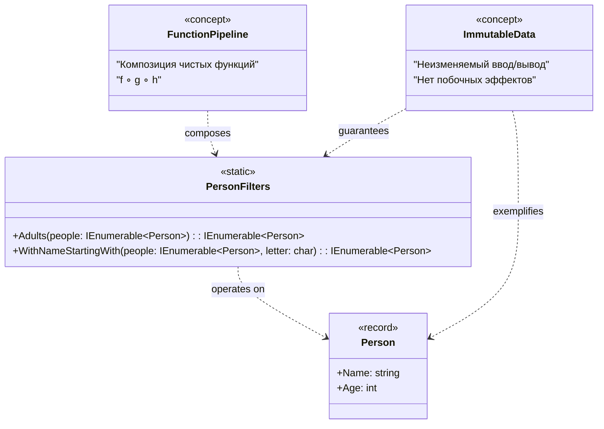

**Цель:**  
Functional Design — это подход к проектированию программного обеспечения, при котором логика строится вокруг **чистых функций**, **неизменяемых данных** и **отсутствия побочных эффектов**. Он заимствован из функционального программирования и может применяться даже в императивных языках (включая C#) для повышения предсказуемости, тестируемости и параллелизма.

**Пример (C#):**

```csharp
// Неизменяемый тип данных
public record Person(string Name, int Age);

// Чистая функция: не изменяет входные данные, не имеет побочных эффектов
public static class PersonFilters
{
    public static IEnumerable<Person> Adults(IEnumerable<Person> people) =>
        people.Where(p => p.Age >= 18);

    public static IEnumerable<Person> WithNameStartingWith(
        IEnumerable<Person> people, char letter) =>
        people.Where(p => p.Name.StartsWith(letter));
}

// Композиция функций
var people = new[]
{
    new Person("Alice", 25),
    new Person("Bob", 17),
    new Person("Anna", 30)
};

var result = PersonFilters
    .Adults(people)
    .Where(p => PersonFilters.WithNameStartingWith(new[] { p }, 'A').Any());

// Или через композицию через делегаты:
Func<IEnumerable<Person>, IEnumerable<Person>> pipeline =
    people => PersonFilters.WithNameStartingWith(PersonFilters.Adults(people), 'A');

var finalResult = pipeline(people).ToList();
```

> 💡 В C# также можно использовать `System.Linq`, `record`-типы, `Option<T>` (через библиотеки вроде LanguageExt) и `ValueTuple` для более функционального стиля.

**Антипаттерн:**  
Мутабельное состояние, побочные эффекты внутри логики (например, изменение глобального списка, запись в файл или базу данных прямо в функции фильтрации), что делает код непредсказуемым, трудно тестируемым и небезопасным для многопоточности.

**Схема (Mermaid):**


```text
    note right of PersonFilters
        Все методы — чистые функции:
        - одинаковый ввод → одинаковый вывод
        - не изменяют состояние
        - не зависят от внешнего контекста
    end note
```

### Пояснение:
- `Person` — неизменяемый тип данных (`record`).
- `PersonFilters` — набор чистых функций (статических, без состояния).
- `FunctionPipeline` и `ImmutableData` — концептуальные узлы, отражающие суть Functional Design.
- Связи показывают, что функции работают с неизменяемыми данными и могут компоноваться.

> ⚠️ Обратите внимание: Functional Design — это **парадигма проектирования**, а не классический шаблон GoF. Поэтому он описывает общий стиль организации кода, а не конкретную структуру классов.