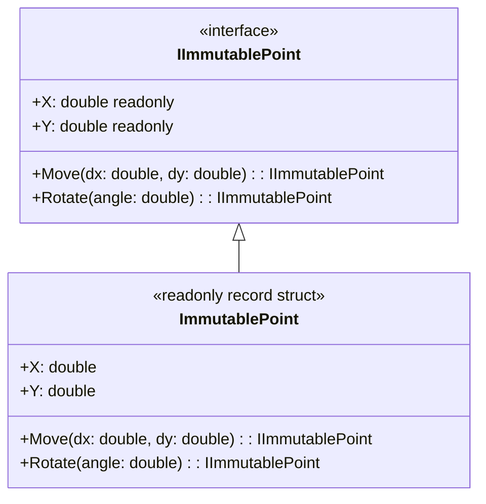

**Цель:**  
Immutable Interface — это проектировочный приём, при котором интерфейс явно выражает **неизменяемость** объекта: все его методы и свойства гарантируют отсутствие побочных эффектов и возвращают либо значения, либо новые экземпляры, но никогда не изменяют внутреннее состояние. Это способствует потокобезопасности, предсказуемости и упрощает тестирование.

> ⚠️ В C# нет встроенной поддержки «immutable interface» как языковой конструкции, но можно проектировать интерфейсы так, чтобы они семантически выражали неизменяемость.

---

**Пример (C#):**

```csharp
// Интерфейс, выражающий неизменяемость
public interface IImmutablePoint
{
    double X { get; }
    double Y { get; }

    // Все операции возвращают НОВЫЙ объект
    IImmutablePoint Move(double dx, double dy);
    IImmutablePoint Rotate(double angleRadians);
}

// Реализация
public readonly record struct ImmutablePoint(double X, double Y) : IImmutablePoint
{
    public IImmutablePoint Move(double dx, double dy) =>
        new ImmutablePoint(X + dx, Y + dy);

    public IImmutablePoint Rotate(double angleRadians)
    {
        var cos = Math.Cos(angleRadians);
        var sin = Math.Sin(angleRadians);
        return new ImmutablePoint(
            X * cos - Y * sin,
            X * sin + Y * cos
        );
    }
}

// Использование
var p1 = new ImmutablePoint(1, 0);
var p2 = p1.Move(2, 3); // p1 остаётся (1, 0), p2 = (3, 3)
```

> 💡 Использование `record`, `readonly struct` или `get-only` свойств помогает реализовать неизменяемость на практике.

---

**Антипаттерн:**  
Интерфейс, содержащий методы, которые **модифицируют состояние** (например, `void SetX(double x)`), но при этом используется в контексте, где ожидается неизменяемость. Это вводит разработчиков в заблуждение и нарушает принцип "говорящего имени" (interface should tell the truth).

Пример антипаттерна:
```csharp
public interface IPoint
{
    double X { get; set; } // ← изменяемое свойство!
    void Move(double dx, double dy); // ← меняет this!
}
```
Такой интерфейс нельзя безопасно использовать в многопоточной среде или в функциональных цепочках.

---

**Схема (Mermaid):**



```
    note right of IImmutablePoint
        Все методы возвращают
        новый экземпляр.
        Состояние никогда
        не изменяется.
    end note

    note right of ImmutablePoint
        Реализация через
        readonly record struct —
        гарантирует неизменяемость
        на уровне языка.
    end note
```

Эта схема подчёркивает ключевую идею: **интерфейс декларирует контракт неизменяемости**, а реализация его соблюдает.