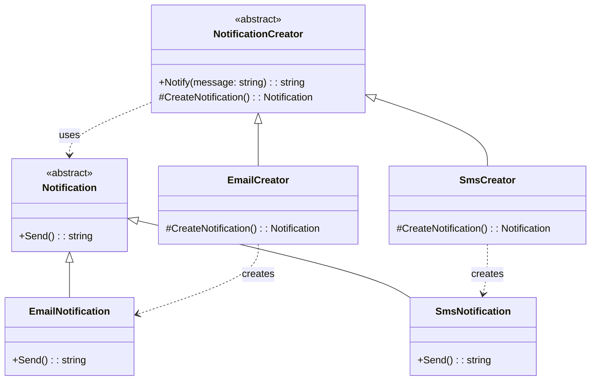

**Цель:**  
Factory Method — это порождающий паттерн проектирования, который **определяет интерфейс для создания объекта**, но оставляет подклассам решение о том, **какой класс инстанцировать**. Он позволяет делегировать логику создания экземпляров наследникам, обеспечивая расширяемость без изменения клиентского кода.

---

**Пример (C#):**

```csharp
// Продукт
public abstract class Notification
{
    public abstract string Send();
}

public class EmailNotification : Notification
{
    public override string Send() => "Sending email notification";
}

public class SmsNotification : Notification
{
    public override string Send() => "Sending SMS notification";
}

// Создатель с фабричным методом
public abstract class NotificationCreator
{
    // Основная логика
    public string Notify(string message)
    {
        var notification = CreateNotification(); // ← фабричный метод
        return notification.Send();
    }

    // Фабричный метод (подлежит переопределению)
    protected abstract Notification CreateNotification();
}

// Конкретные создатели
public class EmailCreator : NotificationCreator
{
    protected override Notification CreateNotification() => new EmailNotification();
}

public class SmsCreator : NotificationCreator
{
    protected override Notification CreateNotification() => new SmsNotification();
}

// Использование
var creator = useSms ? (NotificationCreator)new SmsCreator() : new EmailCreator();
Console.WriteLine(creator.Notify("Hello!"));
```

> 💡 Клиентский код работает с абстракцией (`NotificationCreator`), не зная конкретных типов уведомлений.

---

**Антипаттерн:**  
Условная логика создания объектов прямо в клиентском коде:
```csharp
if (type == "email") 
    notification = new EmailNotification();
else if (type == "sms") 
    notification = new SmsNotification();
```
Это нарушает принцип открытости/закрытости (OCP): добавление нового типа требует изменения существующего кода и приводит к дублированию.

---

**Схема (Mermaid):**



```
    note right of NotificationCreator::CreateNotification
        Абстрактный фабричный метод,
        реализуется в подклассах.
    end note
```