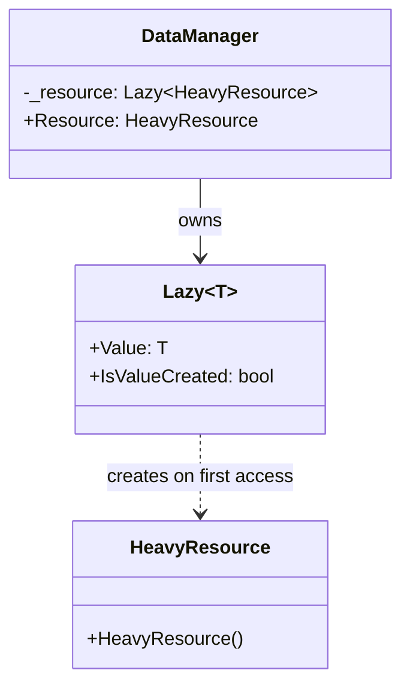
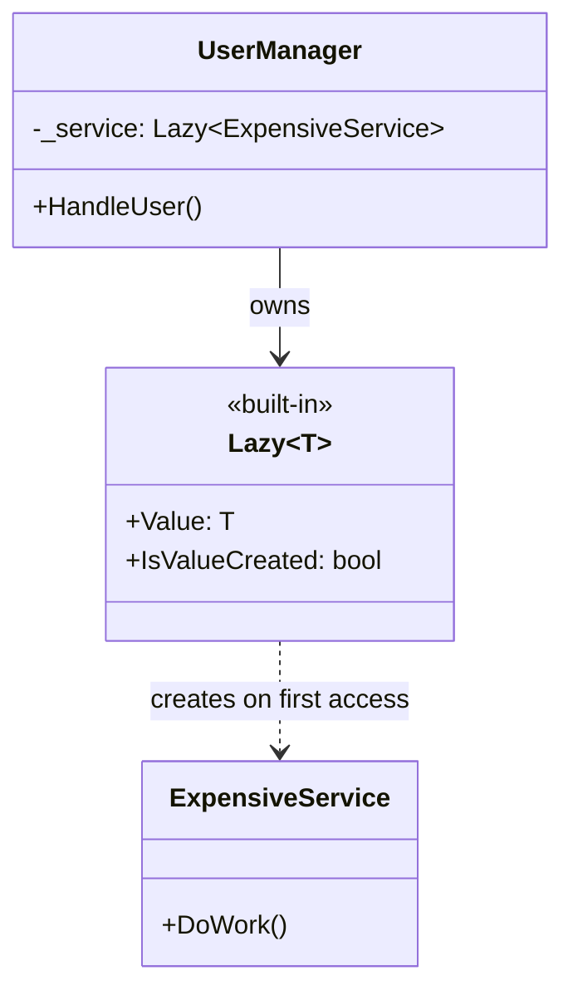

**Цель:**  
Lazy Initialization — это идиома (иногда называемая паттерном), при которой **создание объекта или вычисление значения откладывается до момента первого обращения к нему**. Это позволяет сэкономить ресурсы (память, процессорное время, сетевые вызовы), особенно если объект может не понадобиться вовсе.

---

**Пример (C#):**

```csharp
// Пример 1: Использование встроенного класса Lazy<T>
public class DataManager
{
    private readonly Lazy<HeavyResource> _resource;

    public DataManager()
    {
        _resource = new Lazy<HeavyResource>(() => new HeavyResource());
    }

    public HeavyResource Resource => _resource.Value; // создаётся только при первом доступе
}

public class HeavyResource
{
    public HeavyResource()
    {
        Console.WriteLine("HeavyResource initialized!");
        // Имитация дорогостоящей инициализации
        Thread.Sleep(1000);
    }
}

// Пример 2: Ручная реализация (thread-safe через double-checked locking)
public class ManualLazyService
{
    private volatile ExpensiveObject _instance;
    private readonly object _lock = new();

    public ExpensiveObject Instance
    {
        get
        {
            if (_instance == null)
            {
                lock (_lock)
                {
                    if (_instance == null)
                        _instance = new ExpensiveObject();
                }
            }
            return _instance;
        }
    }
}
```

> 💡 В C# рекомендуется использовать `System.Lazy<T>` — он потокобезопасен, лаконичен и протестирован.

---

**Антипаттерн:**  
**Энергичная (eager) инициализация тяжёлых зависимостей** в конструкторе или при старте приложения, даже если они могут никогда не использоваться:

```csharp
public class BadService
{
    public BadService()
    {
        // Создаётся сразу, даже если никогда не будет использован
        _expensive = new ExpensiveObject(); 
    }
}
```
Это приводит к ненужной трате ресурсов, увеличению времени запуска и снижению отзывчивости системы.

---

**Схема (Mermaid):**



```
    note right of DataManager::Resource
        При первом обращении
        вызывается фабрика,
        переданная в Lazy~T~.
    end note

    note right of Lazy~T~
        Потокобезопасный по умолчанию
        (можно настроить режим).
    end note
```

```c#
// Пример 1: Использование System.Lazy<T> (рекомендуемый способ)
public class ExpensiveService
{
    public ExpensiveService()
    {
        Console.WriteLine("ExpensiveService created!");
    }

    public void DoWork() => Console.WriteLine("Working...");
}

public class UserManager
{
    private readonly Lazy<ExpensiveService> _service =
        new Lazy<ExpensiveService>(() => new ExpensiveService());

    public void HandleUser()
    {
        // Объект создаётся только при первом обращении к Value
        _service.Value.DoWork();
    }
}

// Пример 2: Ручная реализация с блокировкой (thread-safe)
public class LazyCache
{
    private readonly object _lock = new object();
    private Dictionary<string, string>? _cache;

    public Dictionary<string, string> Cache
    {
        get
        {
            if (_cache == null)
            {
                lock (_lock)
                {
                    _cache ??= LoadFromDatabase();
                }
            }
            return _cache;
        }
    }

    private Dictionary<string, string> LoadFromDatabase()
    {
        Console.WriteLine("Loading cache from DB...");
        return new Dictionary<string, string> { ["key"] = "value" };
    }
}
```
