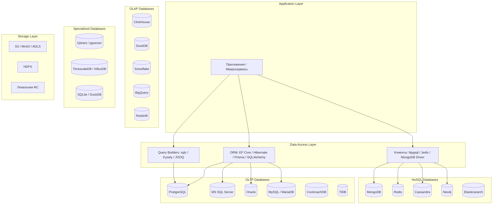
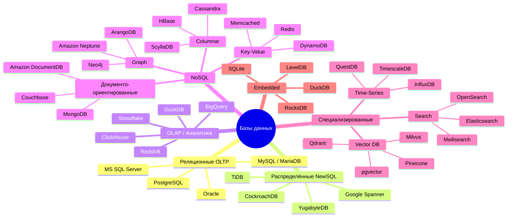
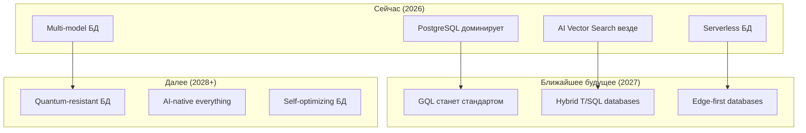

# 🗄️ Database Encyclopedia: Полный справочник СУБД, SQL-диалектов и инструментов

## 📖 Введение

Этот справочник охватывает **более 150 инструментов** для работы с данными: от классических реляционных СУБД до векторных и колоночных хранилищ. Особое внимание уделено SQL-диалектам (PostgreSQL, MS SQL Server, Oracle, MySQL), их процедурным расширениям и экосистеме инструментов.

---

## 🗺️ Архитектура современных хранилищ данных



---

## 📊 Классификация СУБД



---

## 🐘 PostgreSQL Экосистема

### 📋 Основные сведения

| Параметр | Значение |
|----------|----------|
| **Тип** | Объектно-реляционная СУБД |
| **Язык** | SQL (PostgreSQL dialect), PL/pgSQL, PL/Python, PL/V8, PL/Rust |
| **Лицензия** | PostgreSQL License (MIT-подобная) |
| **Текущая версия** | 17 (2025) |
| **Сайт** | [postgresql.org](https://www.postgresql.org/) |
| **Репозиторий** | [github.com/postgres/postgres](https://github.com/postgres/postgres) |
| **Особенности** | ACID, расширяемость, JSONB, оконные функции, CTE, FDW |

### 🧩 Расширения и модули

| Категория | Расширение | Назначение | Установка | Ссылка |
|-----------|-----------|------------|-----------|--------|
| **AI / Vector** | pgvector | Векторные эмбеддинги для LLM/RAG | `CREATE EXTENSION vector;` | [github.com/pgvector/pgvector](https://github.com/pgvector/pgvector) |
| | pgvectorscale | Ускорение поиска по векторам | `CREATE EXTENSION vectorscale;` | [github.com/timescale/pgvectorscale](https://github.com/timescale/pgvectorscale) |
| | pg_embedding | Альтернатива pgvector от Neon | `CREATE EXTENSION pg_embedding;` | [github.com/neondatabase/pg_embedding](https://github.com/neondatabase/pg_embedding) |
| | pgai | Интеграция LLM прямо в PostgreSQL | `CREATE EXTENSION ai;` | [github.com/timescale/pgai](https://github.com/timescale/pgai) |
| | pg_vectorize | Векторизация данных | `CREATE EXTENSION vectorize;` | [github.com/timescale/pg_vectorize](https://github.com/timescale/pg_vectorize) |
| **Geospatial** | PostGIS | Работа с геопространственными данными | `CREATE EXTENSION postgis;` | [postgis.net](https://postgis.net/) |
| | PostGIS Topology | Топологические данные | `CREATE EXTENSION postgis_topology;` | (часть PostGIS) |
| **Time-Series** | TimescaleDB | Расширение для временных рядов | `CREATE EXTENSION timescaledb;` | [timescale.com](https://www.timescale.com/) |
| **Full-Text Search** | pg_trgm | Триграммный поиск | `CREATE EXTENSION pg_trgm;` | (встроен в PostgreSQL) |
| | zhparser | Китайский язык | `CREATE EXTENSION zhparser;` | [github.com/amutu/zhparser](https://github.com/amutu/zhparser) |
| **JSON / Documents** | jsonb (встроен) | JSON-хранилище | `CREATE TABLE ... (data jsonb)` | (встроен) |
| | postgresql-xml | XML-документы | `CREATE EXTENSION xml2;` | (встроен) |
| **Foreign Data Wrappers** | postgres_fdw | PostgreSQL → PostgreSQL | `CREATE EXTENSION postgres_fdw;` | (встроен) |
| | mysql_fdw | PostgreSQL → MySQL | `CREATE EXTENSION mysql_fdw;` | [github.com/EnterpriseDB/mysql_fdw](https://github.com/EnterpriseDB/mysql_fdw) |
| | mongodb_fdw | PostgreSQL → MongoDB | `CREATE EXTENSION mongo_fdw;` | [github.com/EnterpriseDB/mongo_fdw](https://github.com/EnterpriseDB/mongo_fdw) |
| | redis_fdw | PostgreSQL → Redis | `CREATE EXTENSION redis_fdw;` | [github.com/pg-redis-fdw/redis_fdw](https://github.com/pg-redis-fdw/redis_fdw) |
| | s3_fdw | PostgreSQL → S3/MinIO | `CREATE EXTENSION aws_s3;` | [github.com/chimpler/postgres-aws-s3](https://github.com/chimpler/postgres-aws-s3) |
| | file_fdw | PostgreSQL → файлы | `CREATE EXTENSION file_fdw;` | (встроен) |
| | parquet_fdw | PostgreSQL → Parquet | `CREATE EXTENSION parquet_fdw;` | [github.com/kibae/pg_parquet_fdw](https://github.com/kibae/pg_parquet_fdw) |
| **Caching** | pg_prewarm | Предзагрузка данных в кэш | `CREATE EXTENSION pg_prewarm;` | (встроен) |
| | pg_stat_statements | Статистика запросов | `CREATE EXTENSION pg_stat_statements;` | (встроен) |
| **Security** | pgcrypto | Криптографические функции | `CREATE EXTENSION pgcrypto;` | (встроен) |
| | pgaudit | Аудит действий | `CREATE EXTENSION pgaudit;` | [github.com/pgaudit/pgaudit](https://github.com/pgaudit/pgaudit) |
| | pg_permission | Управление правами | `CREATE EXTENSION pg_permissions;` | (сообщество) |
| **Performance** | pg_buffercache | Анализ буферного кэша | `CREATE EXTENSION pg_buffercache;` | (встроен) |
| | pg_visibility | MVCC видимость | `CREATE EXTENSION pg_visibility;` | (встроен) |
| | pg_qualstats | Статистика WHERE-условий | `CREATE EXTENSION pg_qualstats;` | [github.com/powa-team/pg_qualstats](https://github.com/powa-team/pg_qualstats) |
| | hypopg | Гипотетические индексы | `CREATE EXTENSION hypopg;` | [github.com/HypoPG/hypopg](https://github.com/HypoPG/hypopg) |
| **Replication** | pglogical | Логическая репликация | `CREATE EXTENSION pglogical;` | [github.com/2ndQuadrant/pglogical](https://github.com/2ndQuadrant/pglogical) |
| | pglogical_origin | Отслеживание происхождения | `CREATE EXTENSION pglogical_origin;` | (часть pglogical) |
| | BDR (Bi-Directional Replication) | Multi-master | Коммерческий (EDB) | [enterprisedb.com](https://www.enterprisedb.com/) |
| **Extensions Framework** | PGX (для Rust) | Написание расширений на Rust | cargo pgx | [github.com/pgcentralfoundation/pgrx](https://github.com/pgcentralfoundation/pgrx) |
| | PL/Rust | Расширения на Rust | `CREATE EXTENSION plrust;` | [github.com/tcdi/plrust](https://github.com/tcdi/plrust) |
| | PL/Python | Расширения на Python | `CREATE EXTENSION plpython3u;` | (встроен) |
| | PL/V8 (PL/JavaScript) | JS-расширения | `CREATE EXTENSION plv8;` | [github.com/plv8/plv8](https://github.com/plv8/plv8) |
| **Migration Tools** | pg_partman | Партиционирование | `CREATE EXTENSION pg_partman;` | [github.com/pgpartman/pg_partman](https://github.com/pgpartman/pg_partman) |
| | pg_repack | Дефрагментация | `CREATE EXTENSION pg_repack;` | [github.com/reorg/pg_repack](https://github.com/reorg/pg_repack) |
| | pg_squeeze | Альтернатива pg_repack | `CREATE EXTENSION pg_squeeze;` | [github.com/cybertec-postgresql/pg_squeeze](https://github.com/cybertec-postgresql/pg_squeeze) |

### 💻 Клиентские библиотеки

| Язык | Библиотека | Git-репозиторий | Особенности |
|------|-----------|-----------------|-------------|
| **.NET** | Npgsql | [github.com/npgsql/npgsql](https://github.com/npgsql/npgsql) | Официальный, высокопроизводительный |
| **.NET** | EF Core PostgreSQL | [github.com/npgsql/efcore.pg](https://github.com/npgsql/efcore.pg) | Провайдер для Entity Framework Core |
| **.NET** | Marten (документная БД поверх PG) | [github.com/JasperFx/marten](https://github.com/JasperFx/marten) | PostgreSQL как NoSQL |
| **Java** | JDBC (официальный) | [github.com/pgjdbc/pgjdbc](https://github.com/pgjdbc/pgjdbc) | Стандартный драйвер |
| **Java** | Jasync-sql | [github.com/jasync-sql/jasync-sql](https://github.com/jasync-sql/jasync-sql) | Асинхронный |
| **Java** | R2DBC PostgreSQL | [github.com/pgjdbc/r2dbc-postgresql](https://github.com/pgjdbc/r2dbc-postgresql) | Reactive |
| **Python** | psycopg (v3) | [github.com/psycopg/psycopg](https://github.com/psycopg/psycopg) | Современный, async/sync |
| **Python** | psycopg2 (legacy) | [github.com/psycopg/psycopg2](https://github.com/psycopg/psycopg2) | Классический |
| **Python** | asyncpg | [github.com/MagicStack/asyncpg](https://github.com/MagicStack/asyncpg) | Высокопроизводительный async |
| **Python** | SQLAlchemy (dialect) | [github.com/sqlalchemy/sqlalchemy](https://github.com/sqlalchemy/sqlalchemy) | Через ORM |
| **Go** | pgx | [github.com/jackc/pgx](https://github.com/jackc/pgx) | Самый популярный |
| **Go** | lib/pq (legacy) | [github.com/lib/pq](https://github.com/lib/pq) | Старый драйвер |
| **Rust** | tokio-postgres | [github.com/sfackler/rust-postgres](https://github.com/sfackler/rust-postgres) | Async (Tokio) |
| **Rust** | postgres (sync) | [github.com/sfackler/rust-postgres](https://github.com/sfackler/rust-postgres) | Синхронный |
| **Rust** | sqlx-postgres | [github.com/launchbadge/sqlx](https://github.com/launchbadge/sqlx) | Через SQLx |
| **Node.js** | node-postgres (pg) | [github.com/brianc/node-postgres](https://github.com/brianc/node-postgres) | Стандартный |
| **Node.js** | pg-promise | [github.com/vitaly-t/pg-promise](https://github.com/vitaly-t/pg-promise) | Promise-обёртка |
| **Node.js** | Slonik | [github.com/gajus/slonik](https://github.com/gajus/slonik) | Type-safe |
| **PHP** | PDO_PGSQL | [php.net/pdo_pgsql](https://www.php.net/manual/en/ref.pdo-pgsql.php) | Встроенный |
| **Ruby** | pg gem | [github.com/ged/ruby-pg](https://github.com/ged/ruby-pg) | Стандартный |
| **Ruby** | ActiveRecord (Rails) | [github.com/rails/rails](https://github.com/rails/rails) | Через ORM |
| **Elixir** | Postgrex | [github.com/elixir-ecto/postgrex](https://github.com/elixir-ecto/postgrex) | Стандартный |
| **Swift** | PostgresNIO | [github.com/vapor/postgres-nio](https://github.com/vapor/postgres-nio) | Async (Vapor) |

### 🛠️ Инструменты администрирования

| Инструмент | Тип | Язык | Git-репозиторий / Ссылка |
|------------|-----|------|--------------------------|
| **pgAdmin 4** | GUI (веб) | Python/JS | [github.com/pgadmin-org/pgadmin4](https://github.com/pgadmin-org/pgadmin4) |
| **DBeaver** | GUI | Java | [github.com/dbeaver/dbeaver](https://github.com/dbeaver/dbeaver) |
| **DataGrip** | GUI (платный) | Kotlin | [jetbrains.com/datagrip](https://www.jetbrains.com/datagrip/) |
| **TablePlus** | GUI (платный) | Нативный | [tableplus.com](https://tableplus.com/) |
| **Postico 2** | GUI (macOS) | Swift | [eggerapps.at/postico2](https://eggerapps.at/postico2/) |
| **pspg** | TUI | C | [github.com/okbob/pspg](https://github.com/okbob/pspg) |
| **pgcli** | CLI | Python | [github.com/dbcli/pgcli](https://github.com/dbcli/pgcli) |
| **Supabase Studio** | GUI (веб) | TypeScript | [github.com/supabase/studio](https://github.com/supabase/studio) |
| **pgbackrest** | Backup | C | [pgbackrest.org](https://pgbackrest.org/) |
| **WAL-G** | Backup | Go | [github.com/wal-g/wal-g](https://github.com/wal-g/wal-g) |
| **pgBadger** | Log analyzer | Perl | [github.com/darold/pgbadger](https://github.com/darold/pgbadger) |
| **pgMustard** | Query optimizer | Python | [pgmustard.com](https://www.pgmustard.com/) |
| **pgCenter** | Мониторинг | C | [github.com/lesovsky/pgcenter](https://github.com/lesovsky/pgcenter) |
| **pg_activity** | Мониторинг (TUI) | Python | [github.com/dalibo/pg_activity](https://github.com/dalibo/pg_activity) |
| **pgloader** | Миграция данных | Common Lisp | [github.com/dimitri/pgloader](https://github.com/dimitri/pgloader) |
| **pgFormatter** | SQL formatter | Perl | [github.com/darold/pgFormatter](https://github.com/darold/pgFormatter) |
| **PostgREST** | REST API | Haskell | [github.com/PostgREST/postgrest](https://github.com/PostgREST/postgrest) |
| **Hasura** | GraphQL API | Haskell | [github.com/hasura/graphql-engine](https://github.com/hasura/graphql-engine) |

---

## 🗃️ MS SQL Server Экосистема

### 📋 Основные сведения

| Параметр | Значение |
|----------|----------|
| **Тип** | Реляционная СУБД (Microsoft) |
| **Язык** | T-SQL (Transact-SQL), SQLCLR (.NET) |
| **Лицензия** | Проприетарная (есть Developer Edition, Linux-версия, Azure SQL) |
| **Текущая версия** | SQL Server 2022 |
| **Сайт** | [microsoft.com/sql-server](https://www.microsoft.com/sql-server/) |
| **Особенности** | T-SQL, Temporal Tables, PolyBase, Always On, In-Memory OLTP |

### 🧩 Встроенные модули и возможности

| Категория | Компонент | Описание | Документация |
|-----------|-----------|----------|--------------|
| **Языки** | T-SQL | Процедурное расширение SQL | [learn.microsoft.com/sql/t-sql](https://learn.microsoft.com/en-us/sql/t-sql/) |
| | SQLCLR | .NET-код внутри БД | [learn.microsoft.com/sql/relational-databases/clr-integration](https://learn.microsoft.com/en-us/sql/relational-databases/clr-integration/) |
| **In-Memory** | In-Memory OLTP (Hekaton) | Бесконфликтные транзакции в памяти | [learn.microsoft.com/sql/relational-databases/in-memory-oltp](https://learn.microsoft.com/en-us/sql/relational-databases/in-memory-oltp/) |
| **Column Store** | Clustered Columnstore Index | Аналитические запросы | [learn.microsoft.com/sql/relational-databases/indexes/columnstore-indexes](https://learn.microsoft.com/en-us/sql/relational-databases/indexes/columnstore-indexes-overview) |
| **Temporal** | System-Versioned Temporal Tables | История изменений | [learn.microsoft.com/sql/relational-databases/tables/temporal-tables](https://learn.microsoft.com/en-us/sql/relational-databases/tables/temporal-tables) |
| **Graph** | Graph Tables | Узлы и рёбра в реляционной БД | [learn.microsoft.com/sql/relational-databases/graphs](https://learn.microsoft.com/en-us/sql/relational-databases/graphs/sql-graph-overview) |
| **JSON** | JSON функции | `OPENJSON`, `JSON_VALUE`, `FOR JSON` | [learn.microsoft.com/sql/relational-databases/json](https://learn.microsoft.com/en-us/sql/relational-databases/json/json-data-sql-server) |
| **PolyBase** | PolyBase | Запросы к внешним данным (Hadoop, S3) | [learn.microsoft.com/sql/relational-databases/polybase](https://learn.microsoft.com/en-us/sql/relational-databases/polybase/polybase-guide) |
| **Replication** | Always On Availability Groups | High Availability | [learn.microsoft.com/sql/database-engine/availability-groups](https://learn.microsoft.com/en-us/sql/database-engine/availability-groups/windows/) |
| | Transactional Replication | Репликация данных | [learn.microsoft.com/sql/relational-databases/replication](https://learn.microsoft.com/en-us/sql/relational-databases/replication/sql-server-replication) |
| **Security** | Always Encrypted | Шифрование данных на клиенте | [learn.microsoft.com/sql/relational-databases/security/encryption/always-encrypted](https://learn.microsoft.com/en-us/sql/relational-databases/security/encryption/always-encrypted-database-engine) |
| | Row-Level Security | Ограничение доступа на уровне строк | [learn.microsoft.com/sql/relational-databases/security/row-level-security](https://learn.microsoft.com/en-us/sql/relational-databases/security/row-level-security) |
| | Dynamic Data Masking | Маскирование данных | [learn.microsoft.com/sql/relational-databases/security/dynamic-data-masking](https://learn.microsoft.com/en-us/sql/relational-databases/security/dynamic-data-masking) |
| | Transparent Data Encryption (TDE) | Шифрование БД на диске | [learn.microsoft.com/sql/relational-databases/security/encryption/transparent-data-encryption](https://learn.microsoft.com/en-us/sql/relational-databases/security/encryption/transparent-data-encryption) |
| **Azure** | Azure SQL Database | Управляемая облачная БД | [azure.microsoft.com/sql-database](https://azure.microsoft.com/en-us/products/azure-sql/) |
| | Azure SQL Managed Instance | Полная совместимость с SQL Server | (часть Azure SQL) |
| | Azure Synapse Analytics | OLAP/хранилище данных | [azure.microsoft.com/synapse-analytics](https://azure.microsoft.com/en-us/products/synapse-analytics/) |

### 💻 Клиентские библиотеки

| Язык | Библиотека | Git-репозиторий | Особенности |
|------|-----------|-----------------|-------------|
| **.NET** | Microsoft.Data.SqlClient | [github.com/dotnet/SqlClient](https://github.com/dotnet/SqlClient) | Официальный, современный |
| **.NET** | System.Data.SqlClient (legacy) | [github.com/dotnet/SqlClient](https://github.com/dotnet/SqlClient) | Старый, для .NET Framework |
| **.NET** | EF Core SQL Server | [github.com/dotnet/efcore](https://github.com/dotnet/efcore) | Провайдер для EF Core |
| **.NET** | Dapper | [github.com/DapperLib/Dapper](https://github.com/DapperLib/Dapper) | Micro ORM |
| **.NET** | Linq2DB | [github.com/linq2db/linq2db](https://github.com/linq2db/linq2db) | Linq-провайдер |
| **Java** | Microsoft JDBC Driver | [github.com/microsoft/mssql-jdbc](https://github.com/microsoft/mssql-jdbc) | Официальный |
| **Java** | jTDS (legacy) | [jtds.sourceforge.net](http://jtds.sourceforge.net/) | Старый, open-source |
| **Python** | pyodbc | [github.com/mkleehammer/pyodbc](https://github.com/mkleehammer/pyodbc) | Через ODBC |
| **Python** | pymssql | [github.com/pymssql/pymssql](https://github.com/pymssql/pymssql) | Нативный |
| **Python** | sqlalchemy-pytds | [github.com/sqlalchemy/sqlalchemy](https://github.com/sqlalchemy/sqlalchemy) | Через SQLAlchemy |
| **Go** | go-mssqldb | [github.com/microsoft/go-mssqldb](https://github.com/microsoft/go-mssqldb) | Официальный |
| **Rust** | tiberius | [github.com/prisma/tiberius](https://github.com/prisma/tiberius) | Async (Tokio) |
| **Node.js** | mssql (tedious wrapper) | [github.com/tediousjs/node-mssql](https://github.com/tediousjs/node-mssql) | Популярный |
| **Node.js** | tedious | [github.com/tediousjs/tedious](https://github.com/tediousjs/tedious) | Базовый протокол |
| **Node.js** | TypeORM / Prisma | (через соответствующие ORM) | |
| **PHP** | sqlsrv | [github.com/microsoft/msphpsql](https://github.com/microsoft/msphpsql) | Официальный |
| **PHP** | PDO_SQLSRV | [github.com/microsoft/msphpsql](https://github.com/microsoft/msphpsql) | PDO-драйвер |
| **Ruby** | tiny_tds | [github.com/rails-sqlserver/tiny_tds](https://github.com/rails-sqlserver/tiny_tds) | FreeTDS-обёртка |
| **Ruby** | activerecord-sqlserver-adapter | [github.com/rails-sqlserver/activerecord-sqlserver-adapter](https://github.com/rails-sqlserver/activerecord-sqlserver-adapter) | Rails-адаптер |

### 🛠️ Инструменты администрирования

| Инструмент | Тип | Ссылка |
|------------|-----|--------|
| **SSMS (SQL Server Management Studio)** | GUI (Windows) | [learn.microsoft.com/sql/ssms](https://learn.microsoft.com/en-us/sql/ssms/) |
| **Azure Data Studio** | GUI (кросс-платформа) | [azuredatastudio](https://azure.microsoft.com/en-us/products/data-studio/) |
| **sqlcmd** | CLI | [learn.microsoft.com/sql/tools/sqlcmd](https://learn.microsoft.com/en-us/sql/tools/sqlcmd-utility) |
| **DBeaver** | GUI (community) | [dbeaver.io](https://dbeaver.io/) |
| **Redgate SQL Toolbelt** | GUI (коммерческий) | [red-gate.com](https://www.red-gate.com/) |
| **SentryOne Plan Explorer** | Анализ планов запросов | [sentryone.com](https://www.sentryone.com/) |
| **Brent Ozar's sp_Blitz** | Диагностика | [github.com/BrentOzarULTD/SQL-Server-First-Responder-Kit](https://github.com/BrentOzarULTD/SQL-Server-First-Responder-Kit) |
| **sp_WhoIsActive** | Мониторинг | [github.com/amachanic/sp_whoisactive](https://github.com/amachanic/sp_whoisactive) |
| **dbatools** | PowerShell-модуль | [github.com/dataplat/dbatools](https://github.com/dataplat/dbatools) |
| **Flyway** | Миграции | [github.com/flyway/flyway](https://github.com/flyway/flyway) |
| **Liquibase** | Миграции | [github.com/liquibase/liquibase](https://github.com/liquibase/liquibase) |

---

## 🔴 Oracle Экосистема

### 📋 Основные сведения

| Параметр | Значение |
|----------|----------|
| **Тип** | Многомодельная СУБД (Oracle Corporation) |
| **Язык** | SQL, PL/SQL, Java (внутри БД) |
| **Лицензия** | Проприетарная (дорогая, есть бесплатная XE-версия) |
| **Текущая версия** | Oracle Database 23ai (2024) |
| **Сайт** | [oracle.com/database](https://www.oracle.com/database/) |
| **Особенности** | PL/SQL, RAC, Multitenant, Partitioning, Advanced Analytics |

### 🧩 Основные компоненты Oracle Database

| Категория | Компонент | Описание |
|-----------|-----------|----------|
| **Языки** | PL/SQL | Процедурное расширение SQL |
| | Java in DB | JVM внутри БД |
| **Архитектура** | Multitenant Architecture | CDB + PDB (контейнеры и подключаемые БД) |
| | RAC (Real Application Clusters) | Масштабирование на несколько узлов |
| | Oracle Data Guard | Репликация и disaster recovery |
| **In-Memory** | In-Memory Option | Колоночное хранение в памяти |
| **Partitioning** | Range/Hash/List/Composite | Партиционирование таблиц |
| **Security** | Virtual Private Database (VPD) | Row-level security |
| | Oracle Label Security | Метки безопасности |
| | Transparent Data Encryption (TDE) | Шифрование на диске |
| | Data Redaction | Маскирование данных в реальном времени |
| | Oracle Database Vault | Защита привилегированных пользователей |
| **Analytics** | Oracle Advanced Analytics | R и Python в БД |
| | Oracle Machine Learning | ML-алгоритмы в SQL |
| | Spatial and Graph | Геопространственные и графовые данные |
| **JSON** | Native JSON | Встроенная поддержка JSON |
| | SODA (Simple Oracle Document Access) | API для JSON |
| **AI (23ai)** | AI Vector Search | Векторный поиск (2024+) |
| | SQL DOMAINS | Типизированные домены |
| **Editions** | Express Edition (XE) | Бесплатная, до 12GB |
| | Standard Edition 2 | Средний сегмент |
| | Enterprise Edition | Максимальная функциональность |
| | Oracle Cloud (Autonomous DB) | Управляемая облачная БД |
| | Exadata | Аппаратное решение для БД |

### 💻 Клиентские библиотеки

| Язык | Библиотека | Особенности |
|------|-----------|-------------|
| **.NET** | Oracle.ManagedDataAccess.Core | Официальный managed-драйвер |
| **.NET** | Devart dotConnect for Oracle | Коммерческий |
| **Java** | Oracle JDBC (ojdbc) | Официальный |
| **Java** | Oracle Universal Connection Pool (UCP) | Пул соединений |
| **Python** | oracledb (python-oracledb) | Современный, thin-режим |
| **Python** | cx_Oracle (legacy) | Старый драйвер |
| **Go** | go-ora | Чистый Go, без Oracle Client |
| **Go** | godror | Через ODPI-C |
| **Node.js** | node-oracledb | Официальный |
| **Node.js** | oracledb (thin mode) | Без Oracle Client |
| **PHP** | OCI8 | Встроенный |
| **PHP** | PDO_OCI | PDO-драйвер |
| **Ruby** | ruby-oci8 | Через OCI |
| **Rust** | rust-oracle | [github.com/kubo/rust-oracle](https://github.com/kubo/rust-oracle) |

### 🛠️ Инструменты администрирования

| Инструмент | Тип |
|------------|-----|
| **Oracle SQL Developer** | GUI (бесплатный) |
| **SQL*Plus** | CLI (встроенный) |
| **SQLcl** | Современный CLI |
| **Enterprise Manager** | Веб-GUI (платный) |
| **Toad for Oracle** | GUI (Quest, платный) |
| **PL/SQL Developer** | GUI (Allround Automations, платный) |
| **Oracle Data Modeler** | Моделирование данных |
| **Oracle GoldenGate** | CDC и репликация |
| **SQLT / SQLTXPLAIN** | Анализ производительности |
| **AWR / ASH Reports** | Встроенные отчёты производительности |

---

## 🐬 MySQL / MariaDB Экосистема

### 📋 Основные сведения

| Параметр | MySQL | MariaDB |
|----------|-------|---------|
| **Тип** | Реляционная СУБД | Форк MySQL |
| **Лицензия** | GPL (Oracle) | GPL (сообщество) |
| **Текущая версия** | 9.1 | 11.6 |
| **Сайт** | [mysql.com](https://www.mysql.com/) | [mariadb.org](https://mariadb.org/) |
| **Язык** | SQL (MySQL dialect) | SQL (MariaDB dialect) |
| **Особенности** | InnoDB, репликация, JSON | ColumnStore, Spider, Aria |

### 🧩 Хранилища (Storage Engines)

| Storage Engine | MySQL | MariaDB | Описание |
|----------------|-------|---------|----------|
| **InnoDB** | ✅ (по умолчанию) | ✅ (по умолчанию) | ACID, транзакции, MVCC |
| **MyISAM** | ✅ | ✅ | Не транзакционный, быстрый для чтения |
| **Memory (HEAP)** | ✅ | ✅ | Хранение в RAM |
| **Archive** | ✅ | ✅ | Сжатие для архивов |
| **CSV** | ✅ | ✅ | Данные в CSV-файлах |
| **Blackhole** | ✅ | ✅ | "Чёрная дыра" для репликации |
| **NDB (Cluster)** | ✅ | ❌ | Кластерное хранилище |
| **Federated** | ✅ | ✅ | Удалённые таблицы |
| **Aria** | ❌ | ✅ | Замена MyISAM, crash-safe |
| **ColumnStore** | ❌ | ✅ | Колоночное хранилище |
| **Spider** | ❌ | ✅ | Шардирование |
| **MyRocks** | ❌ | ✅ | LSM-дерево (Facebook) |
| **SphinxSE** | ❌ | ✅ | Полнотекстовый поиск |

### 💻 Клиентские библиотеки

| Язык | MySQL | MariaDB |
|------|-------|---------|
| **.NET** | MySqlConnector, Pomelo.EntityFrameworkCore.MySql | Те же + MariaDB Connector/.NET |
| **Java** | MySQL Connector/J | MariaDB Connector/J |
| **Python** | mysqlclient, PyMySQL, aiomysql | mysqlclient, MariaDB Connector/Python |
| **Go** | go-sql-driver/mysql | Тот же драйвер |
| **Node.js** | mysql2, node-mysql | mysql2 |
| **Rust** | mysql_async | mysql_async |
| **PHP** | mysqli, PDO_MySQL | Те же |
| **Ruby** | mysql2 | mysql2 |

### 🛠️ Инструменты администрирования

| Инструмент | Назначение |
|------------|-----------|
| **MySQL Workbench** | Официальный GUI |
| **phpMyAdmin** | Веб-интерфейс |
| **Percona Toolkit** | CLI-утилиты для администрирования |
| **Percona XtraBackup** | Горячее резервное копирование |
| **ProxySQL** | MySQL-прокси с кэшированием |
| **mysqltuner** | Анализ и настройка |
| **mysqldumpslow** | Анализ медленных запросов |
| **Vitess** | Горизонтальное масштабирование MySQL |
| **Planetscale** | MySQL-совместимый Serverless (Vitess) |

---

## 📊 Другие важные СУБД

### 🔷 ClickHouse (Колоночная OLAP)

| Параметр | Значение |
|----------|----------|
| **Тип** | Колоночная СУБД для аналитики |
| **Язык** | SQL (ClickHouse dialect) |
| **Лицензия** | Apache 2.0 |
| **Разработчик** | ClickHouse Inc. (ранее Яндекс) |
| **Сайт** | [clickhouse.com](https://clickhouse.com/) |
| **Git** | [github.com/ClickHouse/ClickHouse](https://github.com/ClickHouse/ClickHouse) |
| **Особенности** | Мгновенные OLAP-запросы, репликация, шардирование |

**Клиенты:**
- **.NET**: ClickHouse.Client, Octonica.ClickHouseClient
- **Java**: ClickHouse JDBC Driver, clickhouse4j
- **Python**: clickhouse-driver, clickhouse-connect
- **Go**: ClickHouse Go driver (ClickHouse/clickhouse-go)
- **Node.js**: @clickhouse/client
- **Rust**: clickhouse-rs

### 🦆 DuckDB (Embedded OLAP)

| Параметр | Значение |
|----------|----------|
| **Тип** | In-process OLAP (аналог SQLite для аналитики) |
| **Язык** | SQL (совместим с PostgreSQL) |
| **Лицензия** | MIT |
| **Сайт** | [duckdb.org](https://duckdb.org/) |
| **Git** | [github.com/duckdb/duckdb](https://github.com/duckdb/duckdb) |
| **Особенности** | Parquet, CSV, JSON, Pandas-совместимость, zero-configuration |

**Клиенты:**
- **.NET**: DuckDB.NET
- **Java**: DuckDB JDBC
- **Python**: duckdb (нативный)
- **Go**: go-duckdb
- **Node.js**: duckdb (Node bindings)
- **Rust**: duckdb-rs

### 🍃 MongoDB (Документо-ориентированная)

| Параметр | Значение |
|----------|----------|
| **Тип** | Документо-ориентированная NoSQL |
| **Язык** | MongoDB Query Language (MQL), Aggregation Pipeline |
| **Лицензия** | SSPL (не open-source по OSI) |
| **Сайт** | [mongodb.com](https://www.mongodb.com/) |
| **Особенности** | JSON-документы, Atlas Search, Vector Search, Change Streams |

**Клиенты:**
- **.NET**: MongoDB.Driver
- **Java**: MongoDB Java Driver, Spring Data MongoDB
- **Python**: pymongo, motor (async)
- **Go**: mongo-go-driver
- **Node.js**: mongodb, mongoose
- **Rust**: mongodb-driver-rust

### 🔴 Redis (Key-Value in-memory)

| Параметр | Значение |
|----------|----------|
| **Тип** | In-memory key-value, cache, message broker |
| **Язык** | Redis Commands, Lua-скрипты |
| **Лицензия** | RSALv2 / SSPL (с 2024, не open-source) |
| **Сайт** | [redis.io](https://redis.io/) |
| **Особенности** | Sub-ms latency, Pub/Sub, Streams, Lua, модули |

**Альтернативы open-source:**
- **Valkey** (форк Redis от Linux Foundation): [github.com/valkey-io/valkey](https://github.com/valkey-io/valkey)
- **KeyDB** (многопоточный Redis): [github.com/Snapchat/KeyDB](https://github.com/Snapchat/KeyDB)
- **Garnet** (от Microsoft на .NET): [github.com/microsoft/garnet](https://github.com/microsoft/garnet)
- **Dragonfly**: [github.com/dragonflydb/dragonfly](https://github.com/dragonflydb/dragonfly)

**Модули Redis:**
- **RediSearch** — полнотекстовый поиск
- **RedisJSON** — JSON-документы
- **RedisTimeSeries** — временные ряды
- **RedisGraph** (deprecated) → **Redis Query Engine**
- **RedisBloom** — вероятностные структуры данных
- **RedisAI** — выполнение ML-моделей

### 🦅 Cassandra / ScyllaDB (Wide-column)

| Параметр | Cassandra | ScyllaDB |
|----------|-----------|----------|
| **Тип** | Wide-column NoSQL | Форк Cassandra на C++ |
| **Язык** | CQL (Cassandra Query Language) | CQL (совместимо) |
| **Архитектура** | Java | C++ с Seastar |
| **Производительность** | Базовая | В 10-37 раз выше |
| **Сайт** | [cassandra.apache.org](https://cassandra.apache.org/) | [scylladb.com](https://www.scylladb.com/) |

**Клиенты:**
- **Java**: DataStax Java Driver
- **Python**: cassandra-driver
- **Go**: gocql
- **Node.js**: cassandra-driver
- **.NET**: CassandraCSharpDriver
- **Rust**: cdrs-tokio, scylla

### 🔷 Neo4j (Графовая)

| Параметр | Значение |
|----------|----------|
| **Тип** | Нативная графовая СУБД |
| **Язык** | Cypher (теперь стандарт GQL) |
| **Лицензия** | GPL (Community), коммерческая (Enterprise) |
| **Сайт** | [neo4j.com](https://neo4j.com/) |
| **Особенности** | Узлы, связи, свойства, индекс-free adjacency |

**Клиенты:**
- **.NET**: Neo4j.Driver
- **Java**: Neo4j Java Driver
- **Python**: neo4j, py2neo
- **Go**: neo4j-go-driver
- **Node.js**: neo4j-driver
- **Rust**: neo4rs

### 🔍 Elasticsearch / OpenSearch (Поисковые)

| Параметр | Elasticsearch | OpenSearch |
|----------|---------------|------------|
| **Тип** | Поисковый движок | Форк Elasticsearch |
| **Язык** | Query DSL, SQL (через API) | Query DSL |
| **Лицензия** | Elastic License 2.0 | Apache 2.0 |
| **Сайт** | [elastic.co](https://www.elastic.co/) | [opensearch.org](https://opensearch.org/) |

### 🔷 Vекторные СУБД (для AI/LLM)

| СУБД | Тип | Язык | Ссылка |
|------|-----|------|--------|
| **pgvector** | Расширение PostgreSQL | SQL | [github.com/pgvector/pgvector](https://github.com/pgvector/pgvector) |
| **Qdrant** | Самостоятельная | Rust, REST/gRPC | [qdrant.tech](https://qdrant.tech/) |
| **Milvus** | Распределённая | Go, C++ | [milvus.io](https://milvus.io/) |
| **Weaviate** | Самостоятельная | Go | [weaviate.io](https://weaviate.io/) |
| **Chroma** | Embedded | Python | [trychroma.com](https://www.trychroma.com/) |
| **Pinecone** | SaaS | Проприетарный | [pinecone.io](https://www.pinecone.io/) |
| **FAISS** | Библиотека (Facebook) | C++ | [github.com/facebookresearch/faiss](https://github.com/facebookresearch/faiss) |

### ⏰ Time-Series СУБД

| СУБД | Тип | Язык | Ссылка |
|------|-----|------|--------|
| **TimescaleDB** | Расширение PostgreSQL | SQL | [timescale.com](https://www.timescale.com/) |
| **InfluxDB** | Самостоятельная | InfluxQL / Flux | [influxdata.com](https://www.influxdata.com/) |
| **QuestDB** | Самостоятельная | SQL | [questdb.io](https://questdb.io/) |
| **VictoriaMetrics** | Prometheus-совместимая | MetricsQL | [victoriametrics.com](https://victoriametrics.com/) |
| **Prometheus** | Мониторинг | PromQL | [prometheus.io](https://prometheus.io/) |
| **TDengine** | IoT, промышленная | SQL | [tdengine.com](https://tdengine.com/) |

### 🗃️ Embedded СУБД

| СУБД | Тип | Применение | Ссылка |
|------|-----|-----------|--------|
| **SQLite** | Реляционная in-process | Мобильные приложения, desktop | [sqlite.org](https://www.sqlite.org/) |
| **libSQL** | Форк SQLite с репликацией | Edge, Turso | [github.com/tursodatabase/libsql](https://github.com/tursodatabase/libsql) |
| **DuckDB** | OLAP in-process | Аналитика на ноутбуках | [duckdb.org](https://duckdb.org/) |
| **RocksDB** | Key-value (LSM) | Бэкенд для БД | [github.com/facebook/rocksdb](https://github.com/facebook/rocksdb) |
| **LevelDB** | Key-value (LSM, Google) | Встроенные системы | [github.com/google/leveldb](https://github.com/google/leveldb) |
| **Realm** | Мобильная | iOS/Android SDK | [realm.io](https://www.mongodb.com/realm) |
| **LiteDB** | .NET embedded | .NET приложения | [github.com/mbdavid/LiteDB](https://github.com/mbdavid/LiteDB) |
| **H2** | Java embedded | Java приложения | [h2database.com](https://www.h2database.com/) |

### 🌐 Distributed SQL / NewSQL

| СУБД | Совместимость | Ссылка |
|------|---------------|--------|
| **CockroachDB** | PostgreSQL | [cockroachlabs.com](https://www.cockroachlabs.com/) |
| **YugabyteDB** | PostgreSQL (YSQL) + Cassandra (YCQL) | [yugabyte.com](https://www.yugabyte.com/) |
| **TiDB** | MySQL | [pingcap.com](https://www.pingcap.com/) |
| **Google Spanner** | SQL (Spanner dialect) | [cloud.google.com/spanner](https://cloud.google.com/spanner) |
| **Amazon Aurora** | MySQL / PostgreSQL | [aws.amazon.com/rds/aurora](https://aws.amazon.com/rds/aurora/) |
| **Neon** | PostgreSQL (serverless) | [neon.tech](https://neon.tech/) |
| **PlanetScale** | MySQL (Vitess) | [planetscale.com](https://planetscale.com/) |

---

## 📚 SQL: Стандарты, диалекты и процедурные языки

### 🌍 SQL Стандарты (ISO/IEC 9075)

| Стандарт | Год | Ключевые фичи |
|----------|-----|---------------|
| **SQL-86** | 1986 | Первый стандарт, базовый SELECT |
| **SQL-89** | 1989 | Integrity, referential constraints |
| **SQL-92 (SQL2)** | 1992 | JOIN, подзапросы, CASE, INTERSECT/EXCEPT |
| **SQL:1999 (SQL3)** | 1999 | Регулярные выражения, триггеры, UDT, OLAP-функции |
| **SQL:2003** | 2003 | XML, оконные функции, AUTO_INCREMENT, MERGE |
| **SQL:2006** | 2006 | XML-SQL интеграция |
| **SQL:2008** | 2008 | INSTEAD OF триггеры, TRUNCATE |
| **SQL:2011** | 2011 | Temporal tables (SYSTEM_TIME), FETCH FIRST |
| **SQL:2016** | 2016 | JSON, row pattern matching, Polymorphic table functions |
| **SQL:2019** | 2019 | SQL/MDA (многомерные массивы) |
| **SQL:2023** | 2023 | **GQL** (графовые запросы), PSM, property graphs, JSON улучшен |

### 🔄 Сравнение SQL-диалектов

| Возможность | PostgreSQL | MySQL/MariaDB | MS SQL Server | Oracle | SQLite |
|-------------|------------|---------------|---------------|--------|--------|
| **Процедурный язык** | PL/pgSQL | Stored Procedures | T-SQL | PL/SQL | Нет |
| **JSON тип** | `jsonb` | `JSON` | `NVARCHAR(MAX)` | `CLOB/BLOB` | `TEXT` |
| **JSON операторы** | `->`, `->>`, `#>`, `@>` | `JSON_EXTRACT()` | `JSON_VALUE()` | `JSON_VALUE()` | `json_extract()` |
| **Array тип** | ✅ | ❌ (JSON) | ❌ | VARRAY/NESTED TABLE | ❌ |
| **UUID тип** | ✅ (`uuid`) | ❌ (BINARY(16)) | `UNIQUEIDENTIFIER` | `RAW(16)` | ❌ |
| **CTE** | ✅ | ✅ (8.0+) | ✅ | ✅ | ✅ |
| **Оконные функции** | ✅ | ✅ (8.0+) | ✅ | ✅ | ✅ |
| **MERGE** | ✅ (15+) | ❌ (INSERT ON DUPLICATE) | ✅ | ✅ | ❌ |
| **UPSERT** | `ON CONFLICT` | `ON DUPLICATE KEY UPDATE` | MERGE | MERGE | `ON CONFLICT` |
| **LATERAL JOIN** | ✅ | ✅ (8.0+) | ✅ (`CROSS APPLY`) | ✅ (`LATERAL`) | ✅ |
| **FULL OUTER JOIN** | ✅ | ❌ (эмуляция) | ✅ | ✅ | ✅ |
| **INTERSECT / EXCEPT** | ✅ | ❌ (UNION эмуляция) | ✅ | ✅ | ✅ |
| **RETURNING clause** | ✅ | ❌ | `OUTPUT` | `RETURNING` | ❌ |
| **AUTO INCREMENT** | `SERIAL` / `GENERATED` | `AUTO_INCREMENT` | `IDENTITY` | `SEQUENCE` + триггер | `AUTOINCREMENT` |
| **Триггеры** | ✅ | ✅ | ✅ | ✅ | ✅ |
| **Временные таблицы** | `TEMPORARY TABLE` | `TEMPORARY TABLE` | `#temp`, `##temp` | `GLOBAL TEMPORARY` | `TEMP` |
| **Партиционирование** | ✅ (декларативное) | ✅ | ✅ | ✅ | ❌ |
| **Materialized Views** | ✅ | ❌ (MySQL: гибкие views) | Indexed Views | ✅ | ❌ |
| **Foreign Data Wrappers** | ✅ | ❌ | PolyBase | ✅ (через External Tables) | ❌ |
| **Графы (SQL/PGQ)** | ✅ (Apache AGE) | ❌ | Graph Tables | Spatial and Graph | ❌ |
| **Векторный поиск** | pgvector | ❌ | ❌ | AI Vector Search (23ai) | ❌ |
| **Regex оператор** | `~`, `~*` | `REGEXP` | ❌ (через CLR) | `REGEXP_LIKE` | `REGEXP` |
| **ILIKE** | ✅ | ❌ (COLLATE) | ❌ | ❌ | ❌ |

### 🎯 Процедурные SQL-языки: детальное сравнение

#### 📊 Сравнительная таблица

| Фича | PL/pgSQL (PostgreSQL) | T-SQL (MS SQL) | PL/SQL (Oracle) | MySQL Stored Proc |
|------|----------------------|----------------|-----------------|-------------------|
| **Блоки** | `BEGIN ... END` | `BEGIN ... END` | `BEGIN ... END` | `BEGIN ... END` |
| **Переменные** | `DECLARE x INT := 5;` | `DECLARE @x INT = 5;` | `x NUMBER := 5;` | `DECLARE x INT DEFAULT 5;` |
| **Константы** | `CONSTANT` | ❌ | `CONSTANT` | ❌ |
| **Курсоры** | `DECLARE cur CURSOR FOR` | `DECLARE cur CURSOR FOR` | `CURSOR cur IS` | `DECLARE cur CURSOR FOR` |
| **Исключения** | `EXCEPTION WHEN ...` | `BEGIN TRY ... BEGIN CATCH` | `EXCEPTION WHEN ...` | `DECLARE HANDLER FOR` |
| **Циклы** | `LOOP, WHILE, FOR` | `WHILE` | `LOOP, WHILE, FOR` | `WHILE, REPEAT, LOOP` |
| **Условные** | `IF-ELSIF-ELSE` | `IF-ELSE` | `IF-ELSIF-ELSE` | `IF-ELSEIF-ELSE` |
| **CASE** | ✅ | ✅ | ✅ | ✅ |
| **Триггеры** | `CREATE TRIGGER` | `CREATE TRIGGER` | `CREATE TRIGGER` | `CREATE TRIGGER` |
| **Пакеты (packages)** | ❌ (схемы вместо) | ❌ | ✅ | ❌ |
| **Табличные функции** | `RETURNS TABLE` | `RETURNS TABLE` | `PIPELINED` | ❌ |
| **Реф-курсоры** | `REFCURSOR` | `CURSOR` | `SYS_REFCURSOR` | ❌ |
| **Динамический SQL** | `EXECUTE` | `EXEC sp_executesql` | `EXECUTE IMMEDIATE` | `PREPARE/EXECUTE` |
| **Bulk операции** | `FORALL` (через plpgsql) | ❌ | `FORALL`, `BULK COLLECT` | ❌ |
| **JIT-компиляция** | ✅ (12+) | ✅ (2019+) | ✅ | ❌ |

#### 💻 Примеры на каждом языке

**🐘 PL/pgSQL (PostgreSQL)**

```sql
-- Функция с обработкой исключений
CREATE OR REPLACE FUNCTION get_customer_orders(
    p_customer_id UUID,
    p_limit INT DEFAULT 10
)
RETURNS TABLE (
    order_id UUID,
    total_amount NUMERIC,
    created_at TIMESTAMP
) AS $$
DECLARE
    v_customer_exists BOOLEAN;
BEGIN
    -- Проверка существования клиента
    SELECT EXISTS (
        SELECT 1 FROM customers WHERE id = p_customer_id
    ) INTO v_customer_exists;
    
    IF NOT v_customer_exists THEN
        RAISE EXCEPTION 'Customer % not found', p_customer_id
            USING ERRCODE = 'P0001';
    END IF;
    
    -- Возврат заказов
    RETURN QUERY
    SELECT o.id, o.total_amount, o.created_at
    FROM orders o
    WHERE o.customer_id = p_customer_id
    ORDER BY o.created_at DESC
    LIMIT p_limit;
    
EXCEPTION
    WHEN OTHERS THEN
        RAISE WARNING 'Error in get_customer_orders: %', SQLERRM;
        RETURN;
END;
$$ LANGUAGE plpgsql SECURITY DEFINER;

-- Использование
SELECT * FROM get_customer_orders('123e4567-e89b-12d3-a456-426614174000', 5);

-- Процедура с транзакцией
CREATE OR REPLACE PROCEDURE transfer_funds(
    p_from_account UUID,
    p_to_account UUID,
    p_amount NUMERIC
)
LANGUAGE plpgsql
AS $$
BEGIN
    UPDATE accounts SET balance = balance - p_amount 
    WHERE id = p_from_account;
    
    UPDATE accounts SET balance = balance + p_amount 
    WHERE id = p_to_account;
    
    INSERT INTO transfers (from_account, to_account, amount)
    VALUES (p_from_account, p_to_account, p_amount);
    
    COMMIT;
END;
$$;
```

**🗃️ T-SQL (MS SQL Server)**

```sql
-- Хранимая процедура с TRY/CATCH
CREATE OR ALTER PROCEDURE dbo.GetCustomerOrders
    @CustomerID UNIQUEIDENTIFIER,
    @Limit INT = 10
AS
BEGIN
    SET NOCOUNT ON;
    
    BEGIN TRY
        IF NOT EXISTS (
            SELECT 1 FROM dbo.Customers 
            WHERE Id = @CustomerID
        )
        BEGIN
            THROW 50000, 'Customer not found', 1;
        END;
        
        SELECT TOP (@Limit)
            o.Id AS OrderId,
            o.TotalAmount,
            o.CreatedAt
        FROM dbo.Orders o
        WHERE o.CustomerId = @CustomerID
        ORDER BY o.CreatedAt DESC;
        
    END TRY
    BEGIN CATCH
        DECLARE @ErrorMessage NVARCHAR(4000) = ERROR_MESSAGE();
        DECLARE @ErrorSeverity INT = ERROR_SEVERITY();
        DECLARE @ErrorState INT = ERROR_STATE();
        
        EXEC dbo.LogError @ErrorMessage, @ErrorSeverity;
        
        RAISERROR(@ErrorMessage, @ErrorSeverity, @ErrorState);
    END CATCH;
END;
GO

-- Использование
EXEC dbo.GetCustomerOrders 
    @CustomerID = '123E4567-E89B-12D3-A456-426614174000',
    @Limit = 5;

-- Табличная функция
CREATE OR ALTER FUNCTION dbo.GetActiveCustomers()
RETURNS TABLE
AS
RETURN (
    SELECT 
        c.Id,
        c.Name,
        c.Email,
        c.CreatedAt
    FROM dbo.Customers c
    WHERE c.IsActive = 1
);
GO

-- Common Table Expression (CTE)
WITH RankedOrders AS (
    SELECT 
        o.*,
        ROW_NUMBER() OVER (
            PARTITION BY o.CustomerId 
            ORDER BY o.CreatedAt DESC
        ) AS RowNum
    FROM dbo.Orders o
)
SELECT * FROM RankedOrders
WHERE RowNum <= 3;
```

**🔴 PL/SQL (Oracle)**

```sql
-- Пакет (package)
CREATE OR REPLACE PACKAGE customer_pkg AS
    -- Публичные объявления
    TYPE t_order_rec IS RECORD (
        order_id NUMBER,
        total_amount NUMBER(18,2),
        created_at DATE
    );
    
    TYPE t_order_table IS TABLE OF t_order_rec;
    
    FUNCTION get_orders(
        p_customer_id IN NUMBER,
        p_limit IN NUMBER DEFAULT 10
    ) RETURN t_order_table PIPELINED;
    
    PROCEDURE transfer_funds(
        p_from_account IN NUMBER,
        p_to_account IN NUMBER,
        p_amount IN NUMBER
    );
END customer_pkg;
/

CREATE OR REPLACE PACKAGE BODY customer_pkg AS
    -- Реализация функции с PIPELINED
    FUNCTION get_orders(
        p_customer_id IN NUMBER,
        p_limit IN NUMBER DEFAULT 10
    ) RETURN t_order_table PIPELINED
    IS
        CURSOR c_orders IS
            SELECT order_id, total_amount, created_at
            FROM orders
            WHERE customer_id = p_customer_id
            ORDER BY created_at DESC
            FETCH FIRST p_limit ROWS ONLY;
        
        v_order t_order_rec;
    BEGIN
        FOR rec IN c_orders LOOP
            v_order.order_id := rec.order_id;
            v_order.total_amount := rec.total_amount;
            v_order.created_at := rec.created_at;
            PIPE ROW(v_order);
        END LOOP;
        RETURN;
    EXCEPTION
        WHEN NO_DATA_FOUND THEN
            RETURN;
        WHEN OTHERS THEN
            RAISE_APPLICATION_ERROR(-20001, 
                'Error: ' || SQLERRM);
    END get_orders;
    
    -- Процедура с транзакцией
    PROCEDURE transfer_funds(
        p_from_account IN NUMBER,
        p_to_account IN NUMBER,
        p_amount IN NUMBER
    )
    IS
        v_balance NUMBER;
    BEGIN
        -- Проверка баланса
        SELECT balance INTO v_balance
        FROM accounts
        WHERE id = p_from_account
        FOR UPDATE; -- Блокировка строки
        
        IF v_balance < p_amount THEN
            RAISE_APPLICATION_ERROR(-20002, 
                'Insufficient funds');
        END IF;
        
        UPDATE accounts SET balance = balance - p_amount
        WHERE id = p_from_account;
        
        UPDATE accounts SET balance = balance + p_amount
        WHERE id = p_to_account;
        
        INSERT INTO transfers (from_account, to_account, amount)
        VALUES (p_from_account, p_to_account, p_amount);
        
        COMMIT;
    EXCEPTION
        WHEN OTHERS THEN
            ROLLBACK;
            RAISE;
    END transfer_funds;
END customer_pkg;
/

-- Использование
SELECT * FROM TABLE(customer_pkg.get_orders(123, 5));
EXEC customer_pkg.transfer_funds(1, 2, 100);
```

**🐬 MySQL Stored Procedures**

```sql
DELIMITER //

-- Хранимая процедура с обработкой исключений
CREATE PROCEDURE GetCustomerOrders(
    IN p_customer_id BINARY(16),
    IN p_limit INT
)
BEGIN
    DECLARE v_customer_count INT DEFAULT 0;
    DECLARE EXIT HANDLER FOR SQLEXCEPTION
    BEGIN
        ROLLBACK;
        SELECT 'Error occurred' AS message;
    END;
    
    SELECT COUNT(*) INTO v_customer_count
    FROM customers
    WHERE id = p_customer_id;
    
    IF v_customer_count = 0 THEN
        SIGNAL SQLSTATE '45000' 
        SET MESSAGE_TEXT = 'Customer not found';
    END IF;
    
    SELECT id, total_amount, created_at
    FROM orders
    WHERE customer_id = p_customer_id
    ORDER BY created_at DESC
    LIMIT p_limit;
END //

-- Использование курсора
CREATE PROCEDURE ProcessExpiredOrders()
BEGIN
    DECLARE done INT DEFAULT FALSE;
    DECLARE v_order_id BIGINT;
    DECLARE v_total DECIMAL(18,2);
    
    DECLARE cur CURSOR FOR
        SELECT id, total_amount 
        FROM orders 
        WHERE status = 'pending' 
        AND created_at < DATE_SUB(NOW(), INTERVAL 7 DAY);
    
    DECLARE CONTINUE HANDLER FOR NOT FOUND 
        SET done = TRUE;
    
    OPEN cur;
    
    read_loop: LOOP
        FETCH cur INTO v_order_id, v_total;
        IF done THEN
            LEAVE read_loop;
        END IF;
        
        UPDATE orders 
        SET status = 'expired' 
        WHERE id = v_order_id;
    END LOOP;
    
    CLOSE cur;
END //

DELIMITER ;

-- Вызов
CALL GetCustomerOrders(X'123E4567E89B12D3A456426614174000', 5);
```

### 📐 Стандарты расширений SQL

| Стандарт | Название | Поддержка | Описание |
|----------|----------|-----------|----------|
| **SQL/PSM** | Persistent Stored Modules | PL/pgSQL, PL/SQL, T-SQL | Процедурные расширения |
| **SQL/XML** | XML и SQL | Oracle, PostgreSQL (xml2) | Обработка XML в SQL |
| **SQL/JRT** | Java Routines | Oracle, DB2 | Java в БД |
| **SQL/MED** | Management of External Data | PostgreSQL (FDW), Oracle | Внешние данные |
| **SQL/Schemata** | Information Schema | Большинство СУБД | Метаданные |
| **SQL/JSON** | JSON в SQL | PostgreSQL, Oracle 21c+, MS SQL | JSON-тип и функции |
| **SQL/PGQ** | Property Graph Queries | Oracle 23ai, PostgreSQL AGE, Neo4j | Графовые запросы в SQL (стандарт 2023) |
| **SQL/MM** | Multimedia and Spatial | PostGIS, Oracle Spatial | Пространственные данные |

### 🆕 GQL (Graph Query Language) — новый стандарт 2023

```sql
-- GQL (Graph Query Language) - ISO/IEC 39075:2024
-- Второй по важности стандарт после SQL после 40 лет!

-- Найти друзей друзей, которые работают в Google
MATCH (p:Person)-[:FRIEND]->(f:Person)-[:FRIEND]->(fof:Person)
WHERE p.name = 'Alice' AND fof.employer = 'Google'
RETURN fof.name, fof.age;

-- Кратчайший путь между двумя узлами
MATCH PATH = SHORTEST (start:Person)-[:KNOWS*]->(end:Person)
WHERE start.name = 'Alice' AND end.name = 'Bob'
RETURN PATH;

-- Подсчёт треугольников в графе
MATCH (a)-[:FRIEND]->(b)-[:FRIEND]->(c)-[:FRIEND]->(a)
WHERE a.id < b.id AND b.id < c.id
RETURN COUNT(*) AS triangle_count;
```

**Поддержка GQL:**
- **Oracle 23ai** — нативно
- **Neo4j** — через Cypher (совместим)
- **Apache AGE** (расширение PostgreSQL) — `CREATE EXTENSION age;`
- **Amazon Neptune** — openCypher + Gremlin

---

## 🔄 Инструменты миграции и управления схемой

### 📊 Сравнение инструментов миграции

| Инструмент | Поддержка СУБД | Язык | Тип | Git-репозиторий |
|------------|----------------|------|-----|-----------------|
| **Flyway** | PG, MySQL, SQL Server, Oracle, и др. | Java | Версионные миграции | [github.com/flyway/flyway](https://github.com/flyway/flyway) |
| **Liquibase** | Все основные | Java | XML/YAML/SQL миграции | [github.com/liquibase/liquibase](https://github.com/liquibase/liquibase) |
| **Atlas** | PG, MySQL, и др. | Go | Schema-as-Code | [github.com/ariga/atlas](https://github.com/ariga/atlas) |
| **dbmate** | PG, MySQL, SQLite | Go | Простой и быстрый | [github.com/amacneil/dbmate](https://github.com/amacneil/dbmate) |
| **golang-migrate** | PG, MySQL, SQL Server | Go | Простой | [github.com/golang-migrate/migrate](https://github.com/golang-migrate/migrate) |
| **goose** | PG, MySQL, и др. | Go | Легковесный | [github.com/pressly/goose](https://github.com/pressly/goose) |
| **EF Core Migrations** | PG, SQL Server, MySQL | .NET | Через EF Core | [github.com/dotnet/efcore](https://github.com/dotnet/efcore) |
| **FluentMigrator** | PG, SQL Server, Oracle, MySQL | .NET | Code-based | [github.com/fluentmigrator/fluentmigrator](https://github.com/fluentmigrator/fluentmigrator) |
| **RoundhousE** | SQL Server, PostgreSQL | .NET | Convention-based | [github.com/chucknorris/roundhouse](https://github.com/chucknorris/roundhouse) |
| **Alembic** | PostgreSQL, MySQL, SQLite | Python | SQLAlchemy | [github.com/sqlalchemy/alembic](https://github.com/sqlalchemy/alembic) |
| **Django Migrations** | PostgreSQL, MySQL, SQLite | Python | Django | [github.com/django/django](https://github.com/django/django) |
| **Prisma Migrate** | PG, MySQL, SQL Server, MongoDB | TypeScript/Go | Type-safe | [github.com/prisma/prisma](https://github.com/prisma/prisma) |
| **sqlc** | PG, MySQL | Go, TypeScript | Генератор из SQL | [github.com/sqlc-dev/sqlc](https://github.com/sqlc-dev/sqlc) |
| **Schemahero** | Все | Go | Kubernetes-native | [github.com/schemahero/schemahero](https://github.com/schemahero/schemahero) |

---

## 🎨 ORMs и Query Builders: сравнительная таблица

### 🌐 Кросс-платформенные ORMs

| Инструмент | Языки | Поддержка СУБД | Подход | Ссылка |
|------------|-------|----------------|--------|--------|
| **Prisma** | TypeScript, Go, Rust | PG, MySQL, SQL Server, MongoDB, SQLite | Schema-first, type-safe | [prisma.io](https://www.prisma.io/) |
| **Drizzle ORM** | TypeScript | PG, MySQL, SQLite | Code-first, type-safe | [orm.drizzle.team](https://orm.drizzle.team/) |
| **SQLAlchemy** | Python | PG, MySQL, SQLite, Oracle, SQL Server | Unit of Work, Data Mapper | [sqlalchemy.org](https://www.sqlalchemy.org/) |
| **Hibernate** | Java | PG, MySQL, Oracle, SQL Server, DB2 | JPA-реализация | [hibernate.org](https://hibernate.org/) |
| **Entity Framework Core** | C# | PG, SQL Server, MySQL, SQLite | Active Record + Repository | [learn.microsoft.com/ef](https://learn.microsoft.com/en-us/ef/) |
| **TypeORM** | TypeScript/JS | PG, MySQL, SQL Server, MongoDB, SQLite | Active Record + Data Mapper | [typeorm.io](https://typeorm.io/) |
| **Sequelize** | JS/TS | PG, MySQL, SQL Server, SQLite | Promise-based ORM | [sequelize.org](https://sequelize.org/) |
| **MikroORM** | TypeScript | PG, MySQL, SQLite, MongoDB | Unit of Work | [mikro-orm.io](https://mikro-orm.io/) |
| **GORM** | Go | PG, MySQL, SQL Server, SQLite | Simple ORM | [gorm.io](https://gorm.io/) |
| **SQLx** | Rust | PG, MySQL, SQLite | SQL-first, compile-time | [github.com/launchbadge/sqlx](https://github.com/launchbadge/sqlx) |
| **Diesel** | Rust | PG, MySQL, SQLite | Type-safe ORM | [diesel.rs](https://diesel.rs/) |
| **SeaORM** | Rust | PG, MySQL, SQLite | Async, async-std/tokio | [sea-ql.org/SeaORM](https://www.sea-ql.org/SeaORM/) |

### 🎯 Type-Safe Query Builders

| Инструмент | Язык | Подход | Пример |
|------------|------|--------|--------|
| **sqlc** | Go, TypeScript | SQL → типизированный код | `SELECT * FROM users WHERE id = $1;` → `func GetUser(ctx, id)` |
| **Kysely** | TypeScript | Type-safe SQL builder | `db.selectFrom('users').where('id', '=', 1)` |
| **JOOQ** | Java | SQL как код | `dsl.select().from(USERS).where(USERS.ID.eq(1))` |
| **Drizzle** | TypeScript | Schema-first | Type-safe queries из schema |
| **Exposed** | Kotlin | DSL для SQL | `Users.select { Users.id eq 1 }` |
| **Dapper** | C# | Micro-ORM | `db.Query<User>("SELECT * FROM Users WHERE Id=@id")` |

---

## 💻 Примеры кода на разных СУБД

### 📌 Пример 1: Создание таблицы с временными данными

**🐘 PostgreSQL**
```sql
CREATE TABLE orders (
    id UUID PRIMARY KEY DEFAULT gen_random_uuid(),
    customer_id UUID NOT NULL REFERENCES customers(id),
    status VARCHAR(20) DEFAULT 'pending' CHECK (status IN ('pending', 'confirmed', 'shipped', 'delivered', 'cancelled')),
    total_amount NUMERIC(18, 2) NOT NULL CHECK (total_amount >= 0),
    metadata JSONB DEFAULT '{}'::jsonb,
    created_at TIMESTAMPTZ DEFAULT CURRENT_TIMESTAMP,
    updated_at TIMESTAMPTZ DEFAULT CURRENT_TIMESTAMP,
    valid_from TIMESTAMPTZ GENERATED ALWAYS AS ROW START,
    valid_to TIMESTAMPTZ GENERATED ALWAYS AS ROW END,
    PERIOD FOR SYSTEM_TIME (valid_from, valid_to)
) WITH (SYSTEM VERSIONING = ON);

-- Индексы
CREATE INDEX idx_orders_customer ON orders(customer_id);
CREATE INDEX idx_orders_created ON orders(created_at DESC);
CREATE INDEX idx_orders_metadata ON orders USING GIN(metadata);
CREATE INDEX idx_orders_search ON orders USING GIN(to_tsvector('english', description));

-- Полнотекстовый поиск
SELECT * FROM orders
WHERE to_tsvector('english', description) @@ to_tsquery('search & term');

-- Векторный поиск (pgvector)
ALTER TABLE products ADD COLUMN embedding VECTOR(1536);
CREATE INDEX ON products USING ivfflat (embedding vector_cosine_ops) WITH (lists = 100);

SELECT *, embedding <=> '[0.1, 0.2, ...]' AS distance
FROM products
ORDER BY distance
LIMIT 10;
```

**🗃️ MS SQL Server**
```sql
CREATE TABLE dbo.Orders (
    Id UNIQUEIDENTIFIER PRIMARY KEY DEFAULT NEWSEQUENTIALID(),
    CustomerId UNIQUEIDENTIFIER NOT NULL 
        CONSTRAINT FK_Orders_Customers FOREIGN KEY REFERENCES dbo.Customers(Id),
    Status NVARCHAR(20) DEFAULT 'pending' 
        CONSTRAINT CK_Orders_Status CHECK (Status IN ('pending', 'confirmed', 'shipped', 'delivered', 'cancelled')),
    TotalAmount DECIMAL(18, 2) NOT NULL 
        CONSTRAINT CK_Orders_Total CHECK (TotalAmount >= 0),
    Metadata NVARCHAR(MAX) NULL 
        CONSTRAINT CK_Orders_Metadata CHECK (ISJSON(Metadata) = 1),
    CreatedAt DATETIME2 DEFAULT SYSUTCDATETIME(),
    UpdatedAt DATETIME2 DEFAULT SYSUTCDATETIME(),
    -- Temporal Table
    ValidFrom DATETIME2 GENERATED ALWAYS AS ROW START HIDDEN,
    ValidTo DATETIME2 GENERATED ALWAYS AS ROW END HIDDEN,
    PERIOD FOR SYSTEM_TIME (ValidFrom, ValidTo)
)
WITH (SYSTEM_VERSIONING = ON (
    HISTORY_TABLE = dbo.OrdersHistory,
    DATA_CONSISTENCY_CHECK = ON
));

-- JSON-запросы
SELECT 
    o.Id,
    JSON_VALUE(o.Metadata, '$.customer.name') AS CustomerName,
    JSON_QUERY(o.Metadata, '$.items') AS Items
FROM dbo.Orders o
WHERE JSON_VALUE(o.Metadata, '$.region') = 'EMEA';

-- Temporal queries
SELECT * FROM dbo.Orders
FOR SYSTEM_TIME AS OF '2025-01-01 12:00:00';

SELECT * FROM dbo.Orders
FOR SYSTEM_TIME BETWEEN '2025-01-01' AND '2025-12-31';

-- Графовые таблицы
CREATE TABLE dbo.Person AS NODE;
CREATE TABLE dbo.FriendOf AS EDGE;

SELECT Person.name
FROM Person, FriendOf, Person AS Person2
WHERE MATCH(Person-(FriendOf)->Person2)
AND Person2.name = 'Alice';
```

**🔴 Oracle**
```sql
CREATE TABLE orders (
    id NUMBER GENERATED BY DEFAULT AS IDENTITY PRIMARY KEY,
    customer_id NUMBER NOT NULL 
        CONSTRAINT fk_orders_customers REFERENCES customers(id),
    status VARCHAR2(20) DEFAULT 'pending' 
        CONSTRAINT ck_orders_status CHECK (status IN ('pending', 'confirmed', 'shipped', 'delivered', 'cancelled')),
    total_amount NUMBER(18, 2) NOT NULL 
        CONSTRAINT ck_orders_total CHECK (total_amount >= 0),
    metadata CLOB CONSTRAINT ck_orders_metadata CHECK (metadata IS JSON),
    created_at TIMESTAMP WITH TIME ZONE DEFAULT CURRENT_TIMESTAMP,
    updated_at TIMESTAMP WITH TIME ZONE DEFAULT CURRENT_TIMESTAMP
);

-- Temporal Validity
ALTER TABLE orders ADD (
    valid_from DATE INVISIBLE,
    valid_to DATE INVISIBLE,
    PERIOD FOR order_period (valid_from, valid_to)
);

-- JSON queries (Oracle 21c+)
SELECT o.id,
       o.metadata.customer.name AS customer_name,
       o.metadata.items AS items
FROM orders o
WHERE o.metadata.region = 'EMEA';

-- AI Vector Search (Oracle 23ai)
ALTER TABLE products ADD (embedding VECTOR);
CREATE VECTOR INDEX products_embedding_idx 
    ON products (embedding) 
    ORGANIZATION NEIGHBOR PARTITIONS 
    WITH DISTANCE COSINE;

SELECT p.*, 
       VECTOR_DISTANCE(p.embedding, TO_VECTOR('[0.1, 0.2, ...]'), COSINE) AS distance
FROM products p
ORDER BY distance
FETCH FIRST 10 ROWS ONLY;

-- Partitioning
CREATE TABLE sales (
    sale_id NUMBER,
    sale_date DATE,
    amount NUMBER
)
PARTITION BY RANGE (sale_date)
INTERVAL (NUMTOYMINTERVAL(1, 'MONTH')) (
    PARTITION p_initial VALUES LESS THAN (TO_DATE('2025-01-01', 'YYYY-MM-DD'))
);
```

**🐬 MySQL**
```sql
CREATE TABLE orders (
    id BINARY(16) PRIMARY KEY DEFAULT (UUID_TO_BIN(UUID())),
    customer_id BINARY(16) NOT NULL,
    status ENUM('pending', 'confirmed', 'shipped', 'delivered', 'cancelled') 
        DEFAULT 'pending',
    total_amount DECIMAL(18, 2) NOT NULL CHECK (total_amount >= 0),
    metadata JSON,
    created_at TIMESTAMP DEFAULT CURRENT_TIMESTAMP,
    updated_at TIMESTAMP DEFAULT CURRENT_TIMESTAMP ON UPDATE CURRENT_TIMESTAMP,
    FULLTEXT KEY idx_description (description),
    KEY idx_customer (customer_id),
    CONSTRAINT fk_orders_customers 
        FOREIGN KEY (customer_id) REFERENCES customers(id)
) ENGINE=InnoDB DEFAULT CHARSET=utf8mb4 COLLATE=utf8mb4_unicode_ci;

-- JSON queries (MySQL 8.0+)
SELECT 
    o.id,
    o.metadata->>'$.customer.name' AS customer_name,
    JSON_EXTRACT(o.metadata, '$.items') AS items
FROM orders o
WHERE JSON_EXTRACT(o.metadata, '$.region') = '"EMEA"';

-- Window functions (MySQL 8.0+)
SELECT 
    customer_id,
    id,
    total_amount,
    RANK() OVER (
        PARTITION BY customer_id 
        ORDER BY total_amount DESC
    ) AS rank_by_amount
FROM orders;

-- Partitioning
CREATE TABLE sales (
    sale_id BIGINT,
    sale_date DATE,
    amount DECIMAL(18,2)
)
PARTITION BY RANGE (YEAR(sale_date)) (
    PARTITION p2024 VALUES LESS THAN (2025),
    PARTITION p2025 VALUES LESS THAN (2026),
    PARTITION p2026 VALUES LESS THAN (2027),
    PARTITION pmax VALUES LESS THAN MAXVALUE
);
```

### 📌 Пример 2: Оптимизация запросов

**🐘 PostgreSQL — EXPLAIN ANALYZE**
```sql
-- Включение расширенной статистики
CREATE STATISTICS stats_orders_customer_status (dependencies)
ON customer_id, status FROM orders;

ANALYZE orders;

-- EXPLAIN ANALYZE
EXPLAIN (ANALYZE, BUFFERS, FORMAT JSON)
SELECT o.id, c.name, o.total_amount
FROM orders o
JOIN customers c ON c.id = o.customer_id
WHERE o.status = 'pending'
AND o.created_at > NOW() - INTERVAL '7 days'
ORDER BY o.total_amount DESC
LIMIT 100;

-- Hypothetical index (hypopg)
SELECT * FROM hypopg_create_index(
    'CREATE INDEX ON orders (status, created_at DESC) WHERE status = ''pending'''
);

-- Materialized View
CREATE MATERIALIZED VIEW mv_daily_sales AS
SELECT 
    DATE(created_at) AS sale_date,
    COUNT(*) AS order_count,
    SUM(total_amount) AS total_sales
FROM orders
GROUP BY DATE(created_at)
WITH DATA;

CREATE UNIQUE INDEX ON mv_daily_sales (sale_date);

REFRESH MATERIALIZED VIEW CONCURRENTLY mv_daily_sales;
```

### 📌 Пример 3: Транзакции и изоляция

**🐘 PostgreSQL**
```sql
-- Serializable isolation
BEGIN TRANSACTION ISOLATION LEVEL SERIALIZABLE;

SELECT balance FROM accounts WHERE id = 1 FOR UPDATE;
UPDATE accounts SET balance = balance - 100 WHERE id = 1;
UPDATE accounts SET balance = balance + 100 WHERE id = 2;

COMMIT;

-- Advisory Locks (неблокирующие)
SELECT pg_advisory_lock(12345);
-- критическая секция
SELECT pg_advisory_unlock(12345);

-- Row-level Security
ALTER TABLE orders ENABLE ROW LEVEL SECURITY;

CREATE POLICY orders_user_policy ON orders
    USING (user_id = current_setting('app.current_user_id')::INTEGER);
```

**🗃️ MS SQL Server**
```sql
BEGIN TRANSACTION;

SET TRANSACTION ISOLATION LEVEL SERIALIZABLE;

SELECT balance FROM dbo.Accounts WITH (UPDLOCK) WHERE Id = 1;
UPDATE dbo.Accounts SET Balance = Balance - 100 WHERE Id = 1;
UPDATE dbo.Accounts SET Balance = Balance + 100 WHERE Id = 2;

COMMIT;

-- Application Locks
EXEC sp_getapplock 
    @Resource = 'MyResource', 
    @LockMode = 'Exclusive', 
    @LockOwner = 'Transaction';

-- критическая секция

EXEC sp_releaseapplock 
    @Resource = 'MyResource', 
    @LockOwner = 'Transaction';
```

---

## 📈 Тренды в мире баз данных 2026

### 🎯 Ключевые мегатренды

| Тренд | Описание | Примеры инструментов |
|-------|----------|---------------------|
| **1. AI-native databases** | Векторный поиск и ML встроены в БД | pgvector, Oracle 23ai AI Vector Search, MongoDB Vector Search |
| **2. Multi-model databases** | Одна БД для реляционных, документарных, графовых данных | ArangoDB, Oracle, SQL Server |
| **3. Serverless databases** | Автомасштабирование, pay-per-use | Neon, PlanetScale, Aurora Serverless v2 |
| **4. Real-time analytics** | HTAP — объединение OLTP и OLAP | TiDB, CockroachDB, SingleStore |
| **5. Embedded analytics** | DuckDB-стиль — OLAP в процессе | DuckDB, ClickHouse Local |
| **6. SQL renaissance** | SQL возвращается как основной язык запросов | SQL для всего, включая векторы и графы |
| **7. Schema-as-code** | Декларативное описание схемы | Atlas, Prisma, Drizzle |
| **8. CDC (Change Data Capture)** | Стриминг изменений БД | Debezium, Oracle GoldenGate, SQL Server CDC |
| **9. Lakehouse** | Объединение Data Lake и Warehouse | Delta Lake, Apache Iceberg, Apache Hudi |
| **10. Edge databases** | БД на периферии сети | libSQL (Turso), Cloudflare D1, ElectricSQL |
| **11. GQL стандарт** | Графовые запросы как стандарт | Oracle 23ai, Apache AGE, Neo4j |
| **12. Vector DBs** | Специализированные vector databases | Qdrant, Milvus, Weaviate, Pinecone |
| **13. Time-series specialized DBs** | Специализация под временные ряды | TimescaleDB, QuestDB, InfluxDB |
| **14. JSON in SQL** | Нативная работа с JSON | PostgreSQL jsonb, Oracle JSON, SQL Server JSON |
| **15. Cloud-native** | Kubernetes-native БД | Vitess, YugabyteDB, CockroachDB |

### 📊 Таблица: Сравнение современных СУБД по сценариям

| Сценарий | Рекомендация | Альтернативы | Почему |
|----------|-------------|--------------|--------|
| **E-commerce** | PostgreSQL | MySQL, SQL Server | Богатый функционал, jsonb, расширение |
| **Финтех (банкинг)** | Oracle / SQL Server | PostgreSQL (с настройкой) | ACID, аудит, compliance |
| **Соцсеть** | Cassandra / ScyllaDB | DynamoDB, PostgreSQL | Горизонтальное масштабирование |
| **IoT / сенсоры** | TimescaleDB | InfluxDB, QuestDB | SQL-интерфейс + партиционирование |
| **Аналитика (Big Data)** | ClickHouse | DuckDB, Snowflake, BigQuery | Мгновенные OLAP-запросы |
| **AI/RAG приложения** | PostgreSQL + pgvector | Qdrant, Weaviate | SQL + векторы в одной БД |
| **Глобальное приложение** | CockroachDB / YugabyteDB | TiDB, Google Spanner | Глобальная консистентность |
| **Edge/IoT** | libSQL (Turso) | Cloudflare D1, SQLite | Репликация на edge |
| **Графовые связи** | Neo4j | ArangoDB, PostgreSQL AGE | Нативный граф |
| **Кэш** | Redis / Valkey | Memcached, Garnet | Sub-ms latency |
| **Полнотекстовый поиск** | Elasticsearch | Meilisearch, Typesense | Зрелая экосистема |
| **Serverless** | Neon (PG) | PlanetScale, Aurora Serverless v2 | Auto-pause, scale to zero |
| **Data Lakehouse** | Delta Lake | Iceberg, Hudi | ACID на S3 |
| **Встраиваемая БД** | DuckDB (OLAP) / SQLite (OLTP) | libSQL, RocksDB | Zero-config |
| **High-frequency trading** | QuestDB | TimescaleDB | Высокая скорость записи |
| **Event sourcing** | EventStoreDB | PostgreSQL | Оптимизирован под события |

### 🔮 Прогноз на 2026-2028



---

## 🎓 Полезные ресурсы для изучения

### 📚 Документация

| СУБД | Официальная документация |
|------|--------------------------|
| **PostgreSQL** | [postgresql.org/docs](https://www.postgresql.org/docs/) |
| **MS SQL Server** | [learn.microsoft.com/sql](https://learn.microsoft.com/en-us/sql/) |
| **Oracle** | [docs.oracle.com/database](https://docs.oracle.com/en/database/) |
| **MySQL** | [dev.mysql.com/doc](https://dev.mysql.com/doc/) |
| **ClickHouse** | [clickhouse.com/docs](https://clickhouse.com/docs) |
| **DuckDB** | [duckdb.org/docs](https://duckdb.org/docs/) |
| **MongoDB** | [mongodb.com/docs](https://www.mongodb.com/docs/) |
| **Redis** | [redis.io/docs](https://redis.io/docs/) |

### 🎓 Курсы и обучение

| Ресурс | Тематика | Ссылка |
|--------|----------|--------|
| **Use The Index, Luke** | Индексация SQL | [use-the-index-luke.com](https://use-the-index-luke.com/) |
| **PostgreSQL Tutorial** | PostgreSQL от А до Я | [postgresqltutorial.com](https://www.postgresqltutorial.com/) |
| **SQL Performance** | Оптимизация запросов | [sql-performance-explained.com](https://sql-performance-explained.com/) |
| **DB-Engines** | Рейтинг СУБД | [db-engines.com](https://db-engines.com/) |
| **Modern SQL** | Современные возможности SQL | [modern-sql.com](https://modern-sql.com/) |
| **Explain Extended** | Блог о PostgreSQL | [explainextended.com](https://explainextended.com/) |

---

## 🔑 Итоговые рекомендации по выбору СУБД

### 📊 Decision Matrix

| Критерий (вес) | PostgreSQL | SQL Server | Oracle | MySQL | CockroachDB |
|----------------|------------|------------|--------|-------|-------------|
| **Функциональность** (5) | ⭐⭐⭐⭐⭐ | ⭐⭐⭐⭐⭐ | ⭐⭐⭐⭐⭐ | ⭐⭐⭐⭐ | ⭐⭐⭐⭐ |
| **Производительность** (4) | ⭐⭐⭐⭐⭐ | ⭐⭐⭐⭐ | ⭐⭐⭐⭐ | ⭐⭐⭐⭐ | ⭐⭐⭐⭐ |
| **Масштабируемость** (4) | ⭐⭐⭐⭐ | ⭐⭐⭐ | ⭐⭐⭐⭐ | ⭐⭐⭐ | ⭐⭐⭐⭐⭐ |
| **Цена** (5) | ⭐⭐⭐⭐⭐ | ⭐⭐⭐ | ⭐ | ⭐⭐⭐⭐⭐ | ⭐⭐⭐ |
| **Экосистема** (4) | ⭐⭐⭐⭐⭐ | ⭐⭐⭐⭐⭐ | ⭐⭐⭐⭐ | ⭐⭐⭐⭐⭐ | ⭐⭐⭐ |
| **AI/Vector** (5) | ⭐⭐⭐⭐⭐ | ⭐⭐ | ⭐⭐⭐⭐ | ⭐⭐ | ⭐⭐ |
| **ИТОГО (макс. 135)** | **133** | **117** | **112** | **119** | **108** |

### 🎯 Когда что выбирать

- **PostgreSQL** — универсальный выбор, богатейшая экосистема, расширение функциональности через расширения, отличный выбор для AI/ML
- **MS SQL Server** — enterprise-окружения на Windows/.NET, хорошая интеграция с Azure, T-SQL для сложной бизнес-логики
- **Oracle** — крупные корпоративные системы, финансовая отрасль, когда нужен максимальный функционал и поддержка
- **MySQL** — веб-приложения, LAMP-стек, простые сценарии, когда важна простота
- **CockroachDB/YugabyteDB** — глобальные распределённые приложения, требующие горизонтального масштабирования
- **ClickHouse** — аналитика больших объёмов данных, дашборды, логи
- **DuckDB** — локальная аналитика, Jupyter notebooks, ETL
- **MongoDB** — документо-ориентированные приложения, гибкая схема данных
- **Redis** — кэш, сессии, очереди сообщений, real-time
- **Neo4j** — социальные сети, recommendation engines, графовые задачи
- **SQLite/DuckDB** — embedded, мобильные приложения, desktop
- **TimescaleDB/InfluxDB** — IoT, мониторинг, временные ряды
- **Qdrant/pgvector** — RAG, semantic search, AI-приложения

---

> 💡 **Запомните:** Не существует "лучшей" СУБД — есть СУБД, которая лучше всего подходит для конкретной задачи. Изучите несколько вариантов, протестируйте на реальных данных и выберите исходя из функциональности, производительности, стоимости и экспертизы команды.