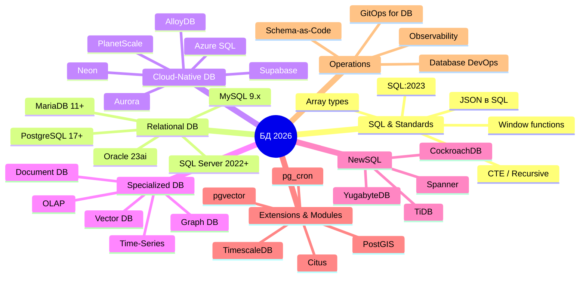
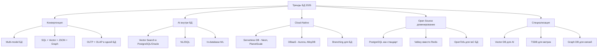

# 🗄️ Тренды баз данных 2026 года: Полная таблица

Ниже представлена структурированная таблица актуальных трендов по СУБД, их языкам запросов, расширениям и экосистеме.

---

## 🎯 Общая визуальная карта трендов БД

---

## 📊 Таблица 1: SQL стандарт и его эволюция

| Категория | Тренд 2026 | Что приходит на смену | Примеры / Реализация | Комментарий |
|-----------|------------|----------------------|---------------------|-------------|
| **SQL Стандарт** | SQL:2023 (JSON, Array, Property Graph Queries) | SQL:2016, SQL:2011 | `JSON_VALUE`, `JSON_TABLE`, `JSON_EXISTS` | Нативная работа с JSON как с типом первого класса |
| **SQL Стандарт** | SQL/PGQ (Property Graph Queries) | Cypher (Neo4j), Gremlin | `MATCH (a)-[e]->(b)` в SQL | Графовые запросы прямо в SQL:2023 |
| **SQL Стандарт** | `RETURNING` clause everywhere | `SELECT` после `INSERT` | `INSERT ... RETURNING *` | Во всех major-СУБД (Postgres, Oracle, SQL Server, MySQL 9+) |
| **SQL Стандарт** | `MERGE` statement | `INSERT/UPDATE` separately | `MERGE INTO target USING source` | Upsert как стандарт (SQL:2003, но сейчас везде) |
| **SQL Стандарт** | Common Table Expressions (CTE) | Subqueries | `WITH cte AS (...) SELECT` | Читаемые рекурсивные запросы |
| **SQL Стандарт** | Window Functions везде | GROUP BY + self-joins | `ROW_NUMBER()`, `LAG()`, `LEAD()` | Ранжирование, скользящие средние |
| **SQL Стандарт** | Lateral Joins | Correlated subqueries | `CROSS JOIN LATERAL` | JOIN с подзапросом, использующим внешние колонки |
| **SQL Стандарт** | Generated Columns | Триггеры | `price DECIMAL GENERATED ALWAYS AS (qty * unit)` | Вычисляемые колонки на уровне БД |
| **SQL Стандарт** | `DISTINCT ON` (Postgres-style) | `GROUP BY` + оконные функции | `SELECT DISTINCT ON (user_id) *` | Уникальные записи по ключу |
| **SQL Стандарт** | `FILTER` clause | `CASE` в агрегатах | `COUNT(*) FILTER (WHERE active)` | Чистая условная агрегация |

---

## 📊 Таблица 2: PostgreSQL — король open-source БД

| Категория | Тренд 2026 | Что приходит на смену | Инструменты / Расширения | Комментарий |
|-----------|------------|----------------------|-------------------------|-------------|
| **Версии** | PostgreSQL 17 (2024) / 18 (2025) | Старые версии (12, 13) | PostgreSQL 17, 18 | Incremental backup, улучшенный JIT, logical replication |
| **AI/Vector** | pgvector как стандарт | Отдельные vector-БД | pgvector, pgvectorscale, pg_embedding | Векторный поиск прямо в PostgreSQL |
| **AI/Vector** | pgvector HNSW индексы | IVFFlat индексы | `CREATE INDEX USING hnsw` | На порядок быстрее для больших датасетов |
| **AI/Vector** | pgai (от Timescale) | Отдельные ML-tools | pgai, pgai Vectorizer | AI-функции прямо в SQL |
| **AI/Vector** | Ollama + PostgreSQL | Отдельные inference-серверы | pgai + Ollama | Локальные LLM прямо из SQL |
| **Time-Series** | TimescaleDB | Отдельные TSDB | TimescaleDB, pg_timeseries | TimescaleDB как расширение Postgres |
| **Time-Series** | Гипертаблицы | Обычные таблицы | `create_hypertable()` | Автоматическое партиционирование по времени |
| **Time-Series** | Continuous Aggregates | Materialized views | `CREATE MATERIALIZED VIEW WITH (timescaledb.continuous)` | Автообновляемые агрегаты |
| **Geo** | PostGIS 3.x | Отдельные GIS-системы | PostGIS, pgRouting | ГИС-функции в PostgreSQL |
| **Geo** | Vector Tiles из PostGIS | Отдельные tile-серверы | `ST_AsMVT()`, Martin, pg_tileserv | Сервер тайлов прямо из БД |
| **Distributed** | Citus | Шардирование вручную | Citus (теперь часть Azure) | Горизонтальное масштабирование PostgreSQL |
| **Distributed** | Neon Serverless | Классический Postgres | Neon.tech, Supabase | Serverless Postgres с branching |
| **Distributed** | Postgres branching | Миграции на prod | `neon branch create` | Git-like ветки для БД |
| **JSON** | JSONB как стандарт | JSON-колонки | `JSONB`, `jsonb_path_query` | Двоичный JSON с индексами |
| **JSON** | JSONPath queries | Regex для JSON | `@.store.book[*].price` | SQL/JSON стандарт в PostgreSQL |
| **Performance** | JIT компиляция | Интерпретация запросов | `SET jit = on` | LLVM-компиляция сложных запросов |
| **Performance** | Parallel Query | Последовательное сканирование | `max_parallel_workers_per_gather` | Параллельное выполнение запросов |
| **Performance** | BRIN индексы | B-tree для больших таблиц | `CREATE INDEX USING brin` | Индексы для time-series данных |
| **Performance** | pg_stat_statements | `EXPLAIN ANALYZE` вручную | `pg_stat_statements` | Статистика по всем запросам |
| **Replication** | Logical Replication | Physical replication | `pgoutput`, logical decoding | Репликация на уровне строк/таблиц |
| **Replication** | Bi-directional replication | Master-slave | BDR, pglogical | Multi-master репликация |
| **Backup** | Incremental Backup (PG17+) | Полные бэкапы | `pg_basebackup --incremental` | Только изменённые блоки |
| **Backup** | WAL-G | pg_dump | WAL-G, pgBackRest | Point-in-time recovery |
| **Extensions** | pg_cron | Внешние планировщики | `pg_cron` | CRON-задачи внутри PostgreSQL |
| **Extensions** | pg_partman | Ручное партиционирование | `pg_partman` | Автоматическое управление партициями |
| **Extensions** | pg_repack | VACUUM FULL (блокирующий) | `pg_repack` | Дефрагментация без блокировок |
| **Extensions** | pg_audit | Логирование вручную | `pgaudit` | Аудит всех операций |
| **Extensions** | pg_stat_monitor | pg_stat_statements | `pg_stat_monitor` | Расширенная аналитика запросов |
| **Extensions** | PL/Rust | PL/Python, PL/Perl | `plrust` | Rust-функции в PostgreSQL |
| **Extensions** | PL/V8 | PL/Python | `plv8` | JavaScript в PostgreSQL |
| **Extensions** | DuckDB FDW | CSV FDW | `duckdb_fdw` | Аналитика DuckDB прямо из Postgres |
| **Languages** | PL/pgSQL | SQL только | `CREATE FUNCTION ... LANGUAGE plpgsql` | Процедурное расширение SQL |
| **Languages** | PL/Python (plpython3u) | Внешние сервисы | `plpython3u` | Python внутри PostgreSQL |
| **Languages** | PL/Rust | PL/Perl, PL/Tcl | `plrust` | Безопасные Rust-функции |
| **Languages** | SQL/PSM | PL/pgSQL | SQL Persistent Stored Modules | Стандарт для процедур |
| **Tooling** | pgAdmin 4 / DBeaver | psql только | pgAdmin, DBeaver, DataGrip | Современные GUI для PostgreSQL |
| **Tooling** | Supabase | Firebase | Supabase, PocketBase | BaaS на PostgreSQL |
| **Tooling** | Prisma / Drizzle | SQL-миграции | Prisma, Drizzle, Kysely | Type-safe доступ к PostgreSQL |
| **Cloud** | AlloyDB (Google) | Cloud SQL | AlloyDB for PostgreSQL | 4x быстрее, AI-интеграция |
| **Cloud** | Azure Database for PostgreSQL | Самостоятельный хостинг | Azure PostgreSQL Flexible Server | Managed PostgreSQL |
| **Cloud** | AWS Aurora PostgreSQL | RDS PostgreSQL | Aurora PostgreSQL | До 5x быстрее стандартного Postgres |
| **Cloud** | Tembo | Heroku PostgreSQL | Tembo.io | PostgreSQL с AI-оптимизацией |

---

## 📊 Таблица 3: Microsoft SQL Server

| Категория | Тренд 2026 | Что приходит на смену | Инструменты / Фичи | Комментарий |
|-----------|------------|----------------------|-------------------|-------------|
| **Версии** | SQL Server 2022 / 2025 | SQL Server 2019, 2017 | SQL Server 2022, Azure SQL | Ledger, Synapse Link, Intelligent Query Processing |
| **Язык** | T-SQL с расширениями | Чистый ANSI SQL | T-SQL, `TRY_CONVERT`, `STRING_AGG` | Процедурное расширение SQL от Microsoft |
| **Язык** | `STRING_AGG()` | `FOR XML PATH` | `STRING_AGG(col, ',')` | Нативная конкатенация строк |
| **Язык** | `JSON_*` функции | XML для полуструктурированных данных | `JSON_VALUE`, `JSON_QUERY`, `JSON_MODIFY` | JSON как тип первого класса |
| **Язык** | `APPROX_COUNT_DISTINCT()` | `COUNT(DISTINCT)` | `APPROX_COUNT_DISTINCT(col)` | Быстрый приближённый подсчёт |
| **Язык** | Temporal Tables | Ручное версионирование | `SYSTEM_VERSIONING = ON` | Автоматическое хранение истории |
| **Язык** | Graph Tables (SQL:2023) | Отдельные graph-БД | `NODE`, `EDGE`, `MATCH` | Графовые запросы в T-SQL |
| **Язык** | Window Functions | Self-joins | `LAG()`, `LEAD()`, `FIRST_VALUE()` | Стандартные оконные функции |
| **Язык** | `GENERATE_SERIES()` | Рекурсивные CTE | `GENERATE_SERIES(1, 100)` | Генерация последовательностей |
| **AI Integration** | Azure OpenAI в SQL Server | Внешние AI-сервисы | `sp_invoke_external_rest_endpoint` | Вызов GPT прямо из T-SQL |
| **AI Integration** | Vector Search (2025+) | Отдельные vector-БД | `VECTOR` data type (preview) | Нативный векторный поиск в SQL Server |
| **AI Integration** | ML.NET Integration | R Services | `sp_execute_external_script` | ML-модели внутри SQL Server |
| **AI Integration** | Copilot for Azure SQL | Ручная оптимизация | Microsoft Copilot | AI-помощник для администрирования |
| **Performance** | Intelligent Query Processing | Query hints | IQP, Batch Mode on Rowstore | Автоматическая оптимизация |
| **Performance** | Batch Mode Adaptive Joins | Hash/Nested Loop hints | Adaptive Join | Динамический выбор типа JOIN |
| **Performance** | Memory-Optimized Tables (Hekaton) | Обычные таблицы | In-Memory OLTP | OLTP в памяти, x10 производительность |
| **Performance** | Columnstore Indexes | Rowstore для аналитики | Clustered Columnstore | Сжатие и скорость для OLAP |
| **Performance** | Resumable Index Rebuild | Блокирующие операции | `ALTER INDEX ... RESUMABLE = ON` | Продолжаемое построение индекса |
| **Security** | Ledger (Blockchain) | Ручной аудит | Ledger tables | Неизменяемая история изменений |
| **Security** | Always Encrypted | Прозрачное шифрование | Always Encrypted with secure enclaves | Шифрование на уровне колонок |
| **Security** | Row-Level Security | Views для фильтрации | `CREATE SECURITY POLICY` | Безопасность на уровне строк |
| **Security** | Dynamic Data Masking | Views с маскированием | `MASKED WITH (FUNCTION = '...')` | Автоматическое маскирование |
| **Replication** | Availability Groups | Database Mirroring | Always On AG | Multi-replica, read-scale |
| **Replication** | Read Scale-Out | Только primary | Readable secondary replicas | Чтение с реплик |
| **Replication** | Distributed AGs | Linked Servers | Distributed Availability Groups | AG через дата-центры |
| **Cloud** | Azure SQL Database | On-premises SQL Server | Azure SQL DB, Managed Instance | Полностью управляемый SQL Server |
| **Cloud** | Azure SQL Hyperscale | Размер БД | Hyperscale tier | До 100TB, отдельное хранение |
| **Cloud** | Azure SQL Edge | IoT устройства | Azure SQL Edge | SQL Server для edge |
| **Cloud** | Serverless Azure SQL | Provisioned tier | Azure SQL Serverless | Авто-скейлинг, пауза при неактивности |
| **Integration** | PolyBase | Linked Servers | PolyBase, External Tables | Запросы к Hadoop, S3, Cosmos DB |
| **Integration** | Synapse Link | ETL pipelines | Azure Synapse Link | Аналитика без ETL |
| **Integration** | Data Virtualization | Data Warehouse | PolyBase external tables | Виртуализация данных |
| **Tooling** | SSMS / Azure Data Studio | Только SSMS | SSMS, Azure Data Studio, DBeaver | Современные IDE для SQL Server |
| **Tooling** | dbatools | Ручные скрипты | dbatools (PowerShell) | 600+ команд для автоматизации |
| **Tooling** | SQL Change Automation | Ручные миграции | Redgate SCA, SSDT | CI/CD для БД |
| **Languages** | T-SQL (Transact-SQL) | ANSI SQL | `BEGIN TRY`, `BEGIN CATCH` | Процедурное расширение Microsoft |
| **Languages** | SQLCLR | Extended Stored Procedures | CLR Integration | .NET код внутри SQL Server |
| **Languages** | R/Python via ML Services | Внешние вызовы | `sp_execute_external_script` | R и Python внутри SQL Server |
| **Languages** | KQL (Azure Data Explorer) | T-SQL для логов | Kusto Query Language | Язык для time-series аналитики |

---

## 📊 Таблица 4: Oracle Database

| Категория | Тренд 2026 | Что приходит на смену | Инструменты / Фичи | Комментарий |
|-----------|------------|----------------------|-------------------|-------------|
| **Версии** | Oracle 23ai (2024+) | Oracle 19c, 21c | Oracle 23ai | AI Vector Search, JSON Relational Duality |
| **AI Integration** | AI Vector Search | Отдельные vector-БД | `VECTOR` data type, `distance()` | Нативный векторный поиск |
| **AI Integration** | Select AI | Ручной SQL | `SELECT AI 'show top customers'` | Natural Language to SQL |
| **AI Integration** | Oracle AI | Внешние AI-сервисы | Oracle AI services | AI-сервисы внутри Oracle Cloud |
| **Язык** | PL/SQL (процедурное расширение) | Только SQL | PL/SQL packages, procedures | Зрелый процедурный язык |
| **Язык** | SQL Macros (21c+) | Динамический SQL | `SQL_MACRO` | Переиспользуемые SQL-фрагменты |
| **Язык** | Polymorphic Table Functions | Динамические views | `PTF` | Табличные функции с динамической схемой |
| **Язык** | JSON-Relational Duality Views | Views + JSON | Duality Views | Единый источник для JSON и SQL |
| **Язык** | `LISTAGG()` | Ручная конкатенация | `LISTAGG(col, ',') WITHIN GROUP` | Стандартная агрегация строк |
| **Язык** | `MATCH_RECOGNIZE` | Regex для данных | `MATCH_RECOGNIZE` | Поиск паттернов в последовательностях |
| **Язык** | Analytic Views | OLAP-кубы | Analytic Views | Аналитические измерения в SQL |
| **Performance** | In-Memory Column Store | Обычные таблицы | Oracle Database In-Memory | Колоночное хранение в памяти |
| **Performance** | Automatic Indexing | DBA создаёт индексы | Auto Index | AI создаёт и удаляет индексы |
| **Performance** | SQL Quarantine | Падающие запросы | Auto SQL Quarantine | Автоматическая изоляция проблемных SQL |
| **Performance** | Exadata | Обычное железо | Exadata X10M | Специализированное железо для Oracle |
| **Performance** | Real-Time Statistics | Stale statistics | Real-Time Statistics | Актуальная статистика без ANALYZE |
| **Multitenant** | CDB/PDB (Multitenant) | Отдельные instance | Container DB + Pluggable DB | Много БД в одном instance |
| **Multitenant** | Application Containers | Схемы | Application Root + PDBs | Общие объекты для нескольких PDB |
| **Sharding** | Oracle Sharding | Ручное шардирование | Sharding with GDS | Горизонтальное масштабирование |
| **Cloud** | Autonomous Database | DBA-managed | Autonomous Transaction Processing, Autonomous JSON | Полностью автономная БД |
| **Cloud** | OCI (Oracle Cloud) | AWS, Azure | Oracle Cloud Infrastructure | Облако Oracle |
| **Cloud** | Oracle Database@Azure | On-premises | Exadata в Azure | Oracle в Azure дата-центрах |
| **Cloud** | Oracle Database@Google Cloud | On-premises | Oracle в Google Cloud | Oracle в GCP |
| **Security** | Data Redaction | Views | Real-Time Redaction | Динамическое маскирование |
| **Security** | Virtual Private Database | Row-level security | VPD policies | Политики безопасности на уровне строк |
| **Security** | Oracle Label Security | Ручная классификация | OLS | Многоуровневая безопасность |
| **Replication** | GoldenGate | Data Guard | Oracle GoldenGate | Real-time репликация между СУБД |
| **Replication** | Active Data Guard | Standby только read | Active Data Guard | Read + apply одновременно |
| **Replication** | XStream | LogMiner | XStream API | Потоковая репликация |
| **Graph** | Property Graph (SQL:2023) | Отдельные graph-БД | `GRAPH_TABLE`, `MATCH` | Графовые запросы в SQL |
| **Graph** | PGX (Parallel Graph AnalytiX) | External tools | PGX | Графовая аналитика |
| **JSON** | JSON Duality Views | JSON + Relational отдельно | Duality Views | JSON и SQL над одними данными |
| **JSON** | JSON Data Type | VARCHAR2/CLOB | Native JSON type | Эффективное хранение JSON |
| **Tooling** | SQL Developer | Только SQL*Plus | SQL Developer, SQLcl, APEX | Современные инструменты Oracle |
| **Tooling** | APEX (Application Express) | Custom web apps | Oracle APEX | Low-code платформа поверх Oracle |
| **Tooling** | Liquibase / Flyway | Ручные скрипты | Liquibase, Flyway | Миграции для Oracle |
| **Languages** | PL/SQL | ANSI SQL | `DECLARE`, `BEGIN`, `END` | Процедурное расширение Oracle |
| **Languages** | PL/Java | Только PL/SQL | Java stored procedures | Java внутри Oracle |
| **Languages** | SQL*Plus scripts | Shell scripts | SQL*Plus, SQLcl | Автоматизация CLI |
| **Legacy** | Oracle Forms/Reports | Web apps | Forms, Reports (deprecated) | Устаревшие инструменты |

---

## 📊 Таблица 5: MySQL, MariaDB и другие реляционные БД

| Категория | Тренд 2026 | Что приходит на смену | Инструменты / Фичи | Комментарий |
|-----------|------------|----------------------|-------------------|-------------|
| **MySQL** | MySQL 9.x (Innovation Release) | MySQL 8.0 | MySQL 9.0, 9.1 | Быстрые релизы с новыми фичами |
| **MySQL** | HeatWave | OLTP only | MySQL HeatWave | In-database ML и аналитика |
| **MySQL** | JSON_TABLE | JSON в строки | `JSON_TABLE()` | Реляционизация JSON |
| **MySQL** | Window Functions | Subqueries | `ROW_NUMBER() OVER ()` | Полная поддержка SQL:2003 |
| **MySQL** | CTE (WITH clause) | Derived tables | `WITH ... AS` | Common Table Expressions |
| **MySQL** | Generated Columns | Триггеры | `AS (expr) STORED` | Вычисляемые колонки |
| **MariaDB** | MariaDB 11.x | MySQL | MariaDB 11.4+ | Форк MySQL с расширенными фичами |
| **MariaDB** | ColumnStore | InnoDB для аналитики | MariaDB ColumnStore | Колоночное хранилище |
| **MariaDB** | Spider Storage Engine | Шардирование | Spider engine | Распределённые таблицы |
| **MariaDB** | System Versioned Tables | Ручное версионирование | `WITH SYSTEM VERSIONING` | Temporal tables |
| **SQLite** | SQLite 3.45+ | "Игрушечная БД" | SQLite, libSQL | SQLite в production |
| **SQLite** | libSQL (Turso) | Классический SQLite | libSQL, Turso | Распределённый SQLite |
| **SQLite** | rqlite | Один SQLite | rqlite | Кластер SQLite с Raft-консенсусом |
| **SQLite** | DQLite | Один SQLite | dqlite | Embedded репликация SQLite |
| **SQLite** | SQLite Vector | Отдельные vector-БД | sqlite-vec | Векторный поиск в SQLite |
| **SQLite** | SQLite в Edge | Cloud-БД | Cloudflare D1, Turso | SQLite на edge |
| **Firebird** | Firebird 5.x | Устаревшие БД | Firebird 5.0 | Open-source реляционная БД |

---

## 📊 Таблица 6: NoSQL и специализированные БД

| Категория | Тренд 2026 | Что приходит на смену | Инструменты | Комментарий |
|-----------|------------|----------------------|-------------|-------------|
| **Document** | MongoDB 8.x | Реляционные БД для JSON | MongoDB, FerretDB | JSON-документы с транзакциями |
| **Document** | MongoDB Atlas Vector Search | Отдельные vector-БД | Atlas Vector Search | Векторный поиск в MongoDB |
| **Document** | FerretDB | MongoDB (проприетарный) | FerretDB | Open-source MongoDB на PostgreSQL |
| **Document** | Couchbase | Document DB | Couchbase, Capella | Document DB с SQL++ |
| **Key-Value** | Redis → Valkey (форк) | Redis (после смены лицензии) | Valkey, KeyDB, Dragonfly, Garnet | Open-source форк Redis |
| **Key-Value** | Dragonfly | Redis для high-load | Dragonfly | Многопоточный Redis, x25 быстрее |
| **Key-Value** | KeyDB (Snapchat) | Redis | KeyDB | Многопоточный Redis |
| **Key-Value** | Garnet (Microsoft) | Redis, Memcached | Garnet | .NET-based cache, очень быстрый |
| **Wide-Column** | ScyllaDB | Cassandra | ScyllaDB | Cassandra на C++, x10 быстрее |
| **Wide-Column** | Apache Cassandra 5.x | Relational DB | Cassandra, DataStax | Линейное масштабирование |
| **Graph** | Neo4j 5.x | Relational + JOIN | Neo4j, Amazon Neptune, TigerGraph | Нативные графовые БД |
| **Graph** | Cypher GQL (ISO standard) | Cypher как проприетарный | GQL (ISO/IEC 39075) | Первый ISO-стандарт для графов |
| **Graph** | Apache TinkerPop | Cypher | Gremlin, TinkerPop | API для обхода графов |
| **Search** | Elasticsearch 8.x | Полнотекстовый поиск в SQL | Elasticsearch, OpenSearch | Поиск + аналитика |
| **Search** | Vector Search в Elasticsearch | Отдельные vector-БД | kNN search в ES | Гибридный поиск |
| **Search** | Meilisearch | Elasticsearch для small data | Meilisearch, Typesense | Быстрый поиск с typo-tolerance |
| **Time-Series** | InfluxDB 3.x | Реляционные БД для логов | InfluxDB, TimescaleDB, QuestDB | Оптимизировано для time-series |
| **Time-Series** | QuestDB | InfluxDB | QuestDB | SQL-совместимый, очень быстрый |
| **Time-Series** | ClickHouse | OLAP для time-series | ClickHouse | Колоночная OLAP-БД |
| **OLAP** | ClickHouse | Vertica, Druid | ClickHouse, StarRocks | Аналитика реального времени |
| **OLAP** | DuckDB | Pandas + SQL | DuckDB, MotherDuck | "SQLite для аналитики" |
| **OLAP** | Apache Druid | Data Warehouse | Druid, Pinot | Real-time OLAP |
| **OLAP** | StarRocks | MySQL для OLAP | StarRocks | MySQL-совместимый OLAP |
| **Vector DB** | Milvus | Отдельные решения | Milvus, Zilliz | Open-source vector DB |
| **Vector DB** | Qdrant | Pinecone (проприетарный) | Qdrant, Weaviate | Rust-based vector DB |
| **Vector DB** | Chroma | Для AI-разработчиков | Chroma, Pinecone | Vector DB для LLM |
| **Vector DB** | pgvector | Отдельные vector-БД | pgvector | Vector search в PostgreSQL |
| **Embedded** | DuckDB | Pandas | DuckDB | In-process OLAP |
| **Embedded** | libSQL | SQLite | libSQL | SQLite-совместимая с extensions |
| **Embedded** | RocksDB | LevelDB | RocksDB | Key-value для storage engines |

---

## 📊 Таблица 7: NewSQL и распределённые БД

| Категория | Тренд 2026 | Что приходит на смену | Инструменты | Комментарий |
|-----------|------------|----------------------|-------------|-------------|
| **Distributed SQL** | CockroachDB | Шардированный PostgreSQL | CockroachDB | PostgreSQL-совместимый, global |
| **Distributed SQL** | TiDB | MySQL + шардирование | TiDB, PingCAP | MySQL-совместимый NewSQL |
| **Distributed SQL** | YugabyteDB | PostgreSQL + Cassandra | YugabyteDB | PostgreSQL API + Cassandra-подобная архитектура |
| **Distributed SQL** | Google Spanner | Oracle RAC | Cloud Spanner | Глобально распределённая, strong consistency |
| **Distributed SQL** | PlanetScale | MySQL replication | PlanetScale | MySQL-совместимый с Git-like branching |
| **Distributed SQL** | Vitess | MySQL шардирование | Vitess | MySQL-оркестрация от YouTube |
| **Distributed SQL** | Neon | PostgreSQL hosting | Neon.tech | Serverless PostgreSQL с branching |
| **Distributed SQL** | Supabase | Firebase | Supabase | PostgreSQL + Auth + Storage |

---

## 📊 Таблица 8: Облачные базы данных (DBaaS)

| Категория | Тренд 2026 | Что приходит на смену | Сервисы | Комментарий |
|-----------|------------|----------------------|---------|-------------|
| **AWS** | Amazon Aurora | RDS | Aurora PostgreSQL, Aurora MySQL | 5x быстрее обычного RDS |
| **AWS** | Amazon DynamoDB | Cassandra, MongoDB | DynamoDB | NoSQL key-value с глобальной репликацией |
| **AWS** | Amazon RDS | Самостоятельный хостинг | RDS PostgreSQL, MySQL, Oracle, SQL Server | Managed реляционные БД |
| **AWS** | Amazon Neptune | Neo4j | Neptune | Managed graph DB |
| **AWS** | Amazon Timestream | InfluxDB | Timestream | Managed time-series |
| **AWS** | Amazon DocumentDB | MongoDB | DocumentDB | MongoDB-совместимая |
| **Azure** | Azure SQL Database | SQL Server on VM | Azure SQL DB | Managed SQL Server |
| **Azure** | Azure Cosmos DB | MongoDB, Cassandra, Gremlin | Cosmos DB | Multi-model БД |
| **Azure** | Azure Database for PostgreSQL | PostgreSQL on VM | Flexible Server | Managed PostgreSQL |
| **Azure** | Azure SQL Managed Instance | SQL Server on VM | SQL MI | Near-100% совместимость с on-prem SQL Server |
| **Azure** | Azure Cache for Redis | Redis on VM | Managed Redis | Managed Redis |
| **GCP** | Cloud SQL | SQL on VM | Cloud SQL | Managed PostgreSQL, MySQL, SQL Server |
| **GCP** | AlloyDB | Cloud SQL | AlloyDB for PostgreSQL | 4x быстрее, AI-интеграция |
| **GCP** | Cloud Spanner | Oracle RAC | Spanner | Глобальный distributed SQL |
| **GCP** | BigQuery | Redshift | BigQuery | Serverless data warehouse |
| **GCP** | Firestore | MongoDB | Firestore | Document DB для mobile/web |
| **Multi-Cloud** | PlanetScale | MySQL hosting | PlanetScale | MySQL с branching |
| **Multi-Cloud** | Supabase | Firebase | Supabase | PostgreSQL BaaS |
| **Multi-Cloud** | Neon | PostgreSQL hosting | Neon.tech | Serverless Postgres |
| **Multi-Cloud** | Aiven | Отдельные сервисы | Aiven | Managed PostgreSQL, Kafka, Redis, etc |
| **Multi-Cloud** | Tembo | Heroku PostgreSQL | Tembo.io | PostgreSQL с AI-оптимизацией |

---

## 📊 Таблица 9: Языки запросов и процедурные расширения

| Категория | Язык | СУБД | Особенности | Тренд 2026 |
|-----------|------|------|-------------|------------|
| **Стандарт** | SQL:2023 | Все | `JSON`, `ARRAY`, `GRAPH`, `MATCH` | Универсальный стандарт |
| **T-SQL** | Transact-SQL | SQL Server, Sybase | `BEGIN TRY`, `GOTO`, `CURSOR` | Развитие с AI-интеграцией |
| **PL/SQL** | PL/SQL | Oracle | `PACKAGE`, `RECORD`, `%TYPE` | Зрелый, стабильный |
| **PL/pgSQL** | PL/pgSQL | PostgreSQL | `RAISE`, `EXCEPTION`, `PERFORM` | Расширение PostgreSQL |
| **PL/Java** | PL/Java | PostgreSQL, Oracle | Java stored procedures | Для enterprise интеграции |
| **PL/Python** | PL/Python (plpython3u) | PostgreSQL | Python внутри БД | Для ML/data science |
| **PL/Rust** | PL/Rust | PostgreSQL | Rust stored procedures | Безопасность + производительность |
| **PL/V8** | PL/V8 | PostgreSQL | JavaScript (V8 engine) | Для JSON-обработки |
| **PL/R** | PL/R | PostgreSQL | R для статистики | Для data science |
| **SQL/PSM** | SQL/PSM | Стандарт | ISO стандарт процедурного SQL | Теоретический стандарт |
| **SQL/JRT** | SQL/JRT | Стандарт | Java Routine в SQL | Стандарт для Java |
| **Cypher** | Cypher | Neo4j, openCypher | `MATCH (n)-[r]->(m)` | Стандарт для графов |
| **GQL** | GQL (ISO/IEC 39075) | Graph DB | ISO стандарт для графов | Заменяет Cypher как стандарт |
| **AQL** | AQL | ArangoDB | `FOR`, `FILTER`, `RETURN` | Для multi-model ArangoDB |
| **CQL** | CQL | Cassandra | `SELECT`, `INSERT` | Cassandra Query Language |
| **MQL** | MQL | MongoDB | Aggregation Pipeline | MongoDB Query Language |
| **KQL** | KQL | Azure Data Explorer | `where`, `summarize`, `render` | Для time-series и логов |
| **DQL** | DQL | Dgraph | GraphQL+- | Для Dgraph |
| **GraphQL** | GraphQL | Все (через слой) | `query`, `mutation` | API-язык поверх БД |
| **Prisma** | Prisma Schema | PostgreSQL, MySQL | Type-safe ORM | DSL для Prisma |
| **Kysely** | Kysely | TypeScript БД | Type-safe SQL builder | Альтернатива ORM |
| **Drizzle** | Drizzle | TypeScript БД | Lightweight SQL toolkit | Современный SQL builder |

---

## 📊 Таблица 10: Database DevOps и администрирование

| Категория | Тренд 2026 | Что приходит на смену | Инструменты | Комментарий |
|-----------|------------|----------------------|-------------|-------------|
| **Schema Management** | Schema-as-Code | Ручные ALTER TABLE | Atlas, Prisma Migrate, Bytebase | Декларативная схема БД |
| **Schema Management** | GitOps для БД | Ручные миграции | Atlas, Liquibase, Flyway | Схема БД в Git |
| **Migrations** | Declarative Migrations | Imperative скрипты | Atlas, Prisma | Описание желаемого состояния |
| **Migrations** | Zero-downtime migrations | Downtime для ALTER | gh-ost, pt-online-schema-change | Миграции без простоев |
| **Migrations** | Branching для БД | Миграции на dev | Neon, PlanetScale, Atlas | Git-like ветки для БД |
| **CI/CD** | Database CI/CD | Ручной деплой | Redgate, Liquibase, Flyway | Автоматический деплой схемы |
| **CI/CD** | Schema review automation | Ручной review | Bytebase, Atlas | Автоматическая проверка схемы |
| **Observability** | pganalyze | EXPLAIN вручную | pganalyze, pgHero | Анализ производительности |
| **Observability** | VividCortex / SolarWinds | Ручной мониторинг | VividCortex, SolarWinds DPA | Анализ запросов |
| **Observability** | Prometheus exporters | Ручной сбор метрик | postgres_exporter, mysqld_exporter | Метрики для Prometheus |
| **Observability** | Query Performance Insights | DBA tuning | AWS Performance Insights | AI-рекомендации по индексам |
| **Observability** | OpenTelemetry for DB | Vendor-specific | OpenTelemetry | Стандарт для телеметрии БД |
| **Backup** | Point-in-time Recovery | Ежедневные бэкапы | WAL-G, pgBackRest, pg_probackup | PITR до секунды |
| **Backup** | Continuous Archiving | Периодические бэкапы | WAL archiving, binlog | Непрерывное архивирование |
| **Backup** | Snapshot-based backup | pg_dump | Volume snapshots, Azure snapshots | Мгновенные снапшоты |
| **Replication** | Logical Replication | Physical replication | pglogical, Debezium | Репликация на уровне строк |
| **Replication** | CDC (Change Data Capture) | Batch ETL | Debezium, Striim | Потоковые изменения |
| **Replication** | Multi-master | Master-slave | BDR, Oracle GoldenGate | Запись в несколько узлов |
| **Security** | Vault integration | .env файлы | HashiCorp Vault, External Secrets | Секреты из Vault |
| **Security** | Row-Level Security | Views | RLS policies | Политика на уровне строк |
| **Security** | Encryption at rest | Plaintext | TDE, LUKS | Шифрование на диске |
| **Security** | Audit logging | Отключено | pgaudit, SQL Server Audit | Аудит всех операций |
| **Performance** | Auto-tuning | Ручная настройка | AWS Performance Insights, Oracle Auto | AI-оптимизация |
| **Performance** | Query plan management | Хинты | SQL Plan Management (Oracle) | Фиксация планов запросов |
| **Performance** | Index recommendations | Ручной анализ | Index Advisor (Azure, Oracle) | AI-рекомендации индексов |
| **Testing** | Testcontainers для БД | In-memory БД | Testcontainers, LocalStack | Реальные БД в тестах |
| **Testing** | Database snapshots для тестов | Ручная очистка | DbSnapshots, Respawn | Быстрый rollback между тестами |
| **Testing** | Data anonymization | Production данные | DMS, Synthetic data | Анонимизация для dev |

---

## 📊 Таблица 11: AI и Machine Learning в базах данных

| Категория | Тренд 2026 | Что приходит на смену | Инструменты / Фичи | Комментарий |
|-----------|------------|----------------------|-------------------|-------------|
| **Vector Search** | pgvector в PostgreSQL | Отдельные vector-БД | pgvector, pg_embedding | Векторный поиск прямо в Postgres |
| **Vector Search** | VECTOR data type | `bytea` или `float[]` | SQL Server, Oracle 23ai, BigQuery | Нативный векторный тип данных |
| **Vector Search** | HNSW индексы | IVFFlat | `CREATE INDEX USING hnsw` | Быстрый поиск для больших датасетов |
| **Vector Search** | Hybrid Search | Только keyword или vector | BM25 + vector, Elasticsearch | Комбинация поиска |
| **AI Functions** | AI SQL (Oracle 23ai) | Внешние API | `SELECT AI 'query'` | Natural language to SQL |
| **AI Functions** | Azure OpenAI в SQL Server | External calls | `sp_invoke_external_rest_endpoint` | GPT из T-SQL |
| **AI Functions** | BigQuery ML | Отдельные ML-tools | `CREATE MODEL` | ML прямо в SQL |
| **AI Functions** | PostgreSQL pgai | Отдельные ML-tools | pgai, pgai Vectorizer | AI в PostgreSQL |
| **ML in DB** | In-database ML | External ML-services | SQL Server ML Services, Oracle ML | ML-модели внутри БД |
| **ML in DB** | AutoML в БД | Ручная настройка моделей | Oracle AutoML, BigQuery AutoML | Автоматическое создание моделей |
| **Embeddings** | pgvector + Ollama | External embedding services | pgai, Ollama | Локальные embeddings |
| **Embeddings** | Azure OpenAI embeddings | External API | Azure OpenAI Service | Embeddings как сервис |
| **RAG in DB** | RAG прямо в БД | External RAG pipeline | pgvector + LLM | RAG без дополнительного слоя |
| **Graph + AI** | GraphRAG | Классический RAG | Neo4j + LLM, GraphRAG (Microsoft) | Графы знаний + LLM |
| **NL2SQL** | Text-to-SQL | Ручное написание запросов | Defog, Vanna, AI2SQL | Естественный язык в SQL |
| **Query Optimization** | AI-powered query optimizer | Ручной tuning | Oracle Auto Index, AWS Insights | AI создаёт индексы |
| **Anomaly Detection** | In-database anomaly detection | External ML | BigQuery ML, SQL Server | Обнаружение аномалий в SQL |
| **Forecasting** | Time-series forecasting | External ML | BigQuery ML, TimescaleDB | Прогнозирование в SQL |

---

## 📊 Таблица 12: Сравнение возможностей SQL-диалектов

| Возможность | PostgreSQL 17 | SQL Server 2022 | Oracle 23ai | MySQL 9.x | SQLite 3.45 |
|-------------|---------------|-----------------|-------------|-----------|-------------|
| **CTE (WITH)** | ✅ Полная поддержка | ✅ Полная | ✅ Полная | ✅ Полная | ✅ Базовая |
| **Recursive CTE** | ✅ `WITH RECURSIVE` | ✅ `WITH ... AS` | ✅ `WITH ... AS` | ✅ `WITH RECURSIVE` | ✅ Ограниченная |
| **Window Functions** | ✅ Полная | ✅ Полная | ✅ Полная | ✅ Полная | ✅ Базовая |
| **JSON Type** | ✅ JSONB (binary) | ✅ NVARCHAR + JSON | ✅ JSON | ✅ JSON | ✅ JSON1 extension |
| **JSON Path** | ✅ `jsonb_path_query` | ✅ `JSON_VALUE` | ✅ `JSON_VALUE` | ✅ `JSON_TABLE` | ⚠️ Ограниченная |
| **Generated Columns** | ✅ STORED/VIRTUAL | ✅ COMPUTED | ✅ VIRTUAL/STORED | ✅ STORED/VIRTUAL | ✅ STORED |
| **Temporal Tables** | ✅ (extension) | ✅ SYSTEM_VERSIONING | ✅ Flashback | ❌ | ❌ |
| **Graph Queries** | ✅ AGE extension | ✅ SQL:2023 GRAPH | ✅ SQL:2023 GRAPH | ❌ | ❌ |
| **Array Type** | ✅ `INTEGER[]` | ❌ (XML/JSON) | ✅ VARRAY/NESTED TABLE | ❌ (JSON) | ❌ |
| **RETURNING clause** | ✅ INSERT/UPDATE/DELETE | ✅ OUTPUT clause | ✅ RETURNING | ✅ (MySQL 9) | ✅ (RETURNING) |
| **MERGE** | ✅ (Postgres 15+) | ✅ MERGE | ✅ MERGE | ❌ (INSERT ON DUPLICATE) | ❌ |
| **UPSERT** | ✅ ON CONFLICT | ✅ MERGE | ✅ MERGE | ✅ ON DUPLICATE KEY | ✅ ON CONFLICT |
| **LATERAL JOIN** | ✅ CROSS JOIN LATERAL | ✅ CROSS APPLY | ✅ LATERAL | ✅ LATERAL | ❌ |
| **DISTINCT ON** | ✅ | ❌ | ❌ | ❌ | ❌ |
| **FILTER clause** | ✅ | ❌ (CASE workaround) | ❌ | ❌ | ❌ |
| **Materialized Views** | ✅ | ⚠️ Indexed Views | ✅ Materialized Views | ❌ | ❌ |
| **Full Text Search** | ✅ tsvector/tsquery | ✅ Full-Text | ✅ Oracle Text | ✅ FULLTEXT | ✅ FTS5 |
| **PostGIS** | ✅ PostGIS | ⚠️ Spatial types | ✅ Oracle Spatial | ⚠️ Spatial | ❌ |
| **Vector Search** | ✅ pgvector | ⚠️ (preview 2025) | ✅ AI Vector Search | ❌ | ⚠️ sqlite-vec |
| **Stored Procedures** | ✅ PL/pgSQL | ✅ T-SQL | ✅ PL/SQL | ✅ (MySQL 8+) | ❌ |
| **Triggers** | ✅ | ✅ | ✅ | ✅ | ✅ |
| **Foreign Data Wrappers** | ✅ postgres_fdw | ✅ PolyBase | ✅ Oracle Gateway | ❌ | ❌ |
| **Logical Replication** | ✅ | ✅ CDC | ✅ XStream | ✅ Binlog | ❌ |
| **Sharding** | ✅ Citus | ✅ Distributed AG | ✅ Sharding | ✅ MySQL Cluster | ❌ |
| **In-Memory OLTP** | ❌ | ✅ Hekaton | ✅ In-Memory | ✅ MEMORY engine | ❌ |
| **Columnstore** | ❌ | ✅ Columnstore | ✅ In-Memory Column | ❌ | ❌ |
| **Row-Level Security** | ✅ | ✅ | ✅ VPD | ❌ | ❌ |
| **Always Encrypted** | ⚠️ (pgcrypto) | ✅ Always Encrypted | ✅ TDE | ✅ TDE | ❌ |
| **Partitioning** | ✅ Declarative | ✅ | ✅ | ✅ | ❌ |
| **Parallel Query** | ✅ | ✅ | ✅ Parallel Execution | ❌ | ❌ |
| **JIT Compilation** | ✅ LLVM | ✅ | ✅ | ❌ | ❌ |

---

## 📊 Таблица 13: Сравнение облачных баз данных

| Провайдер | Реляционные | NoSQL | Аналитика | Векторные | Графовые |
|-----------|-------------|-------|-----------|-----------|----------|
| **AWS** | Aurora, RDS, Redshift | DynamoDB, DocumentDB | Redshift, Athena | Neptune (vector), OpenSearch | Neptune |
| **Azure** | Azure SQL, Cosmos DB (PostgreSQL) | Cosmos DB (MongoDB API), Table Storage | Synapse Analytics | Cosmos DB (vector), AI Search | Cosmos DB (Gremlin) |
| **GCP** | Cloud SQL, AlloyDB, Spanner | Firestore, Bigtable | BigQuery | Vertex AI Vector Search | Neo4j Aura on GCP |
| **Oracle Cloud** | Autonomous DB, MySQL HeatWave | NoSQL DB, MongoDB API | Autonomous DW | AI Vector Search | Spatial & Graph |
| **IBM Cloud** | Db2 | Cloudant | Db2 Warehouse | — | Db2 Graph |
| **Alibaba Cloud** | PolarDB, ApsaraDB RDS | Lindorm, TableStore | AnalyticDB | DashVector | GDB |

---

## 📊 Таблица 14: Сравнение специализированных БД

| Категория | Лучшая БД | Альтернативы | Язык запросов | Use case |
|-----------|-----------|--------------|---------------|----------|
| **Vector DB** | pgvector (PostgreSQL) | Milvus, Qdrant, Pinecone | SQL + `<->` | RAG, similarity search |
| **Time-Series** | TimescaleDB (PostgreSQL) | InfluxDB, QuestDB | SQL | IoT, метрики, логи |
| **OLAP** | ClickHouse | DuckDB, StarRocks, BigQuery | SQL | Аналитика, BI |
| **Graph** | Neo4j | Amazon Neptune, TigerGraph | Cypher / GQL | Социальные сети, fraud detection |
| **Document** | MongoDB | Couchbase, FerretDB | MQL | Гибкая схема, JSON |
| **Key-Value** | Redis / Valkey | Dragonfly, KeyDB, Memcached | Redis CLI | Кэш, очереди, pub/sub |
| **Search** | Elasticsearch | Meilisearch, Typesense, OpenSearch | Query DSL, REST | Полнотекстовый поиск |
| **Embedded** | SQLite | DuckDB, libSQL | SQL | Mobile, desktop, edge |
| **Wide-Column** | Cassandra | ScyllaDB, HBase | CQL | Большие данные, высокая запись |
| **Message Queue** | Kafka | RabbitMQ, Pulsar, NATS | Kafka API | Event streaming |

---

## 🎯 Ключевые выводы

### 🏆 Главные мегатренды баз данных 2026:

1. **PostgreSQL как де-факто стандарт** — расширяется модулями (pgvector, PostGIS, TimescaleDB, Citus), становится multi-model
2. **SQL:2023 — зрелый стандарт** — JSON, ARRAY, GRAPH queries, Window Functions во всех major-СУБД
3. **AI внутри БД** — векторный поиск, NL2SQL, in-database ML больше не требуют отдельных сервисов
4. **pgvector меняет рынок** — 80% use-case векторного поиска закрывается расширением PostgreSQL
5. **Cloud-Native БД** — serverless, auto-scaling, branching (Neon, PlanetScale, Aurora Serverless v2)
6. **Конвергенция OLTP/OLAP** — HTAP-БД (TiDB, ClickHouse, SingleStore) стирают границы
7. **Valkey и форки Redis** — после смены лицензии Redis, open-source сообщество создало альтернативы
8. **Schema-as-Code** — Atlas, Prisma Migrate, Bytebase делают управление схемой декларативным
9. **Database DevOps** — CI/CD для БД становится стандартом, как и для приложений
10. **Green Computing** — энергоэффективность запросов и хранения данных становится метрикой

### 📌 Рекомендации по выбору БД в 2026:

| Сценарий | Рекомендуемая БД | Альтернатива |
|----------|-----------------|--------------|
| Стартап / MVP | **PostgreSQL + Supabase** | MySQL + PlanetScale |
| Enterprise с AI | **Oracle 23ai** или **PostgreSQL + pgvector** | SQL Server 2025 |
| High-load OLTP | **CockroachDB** или **TiDB** | YugabyteDB |
| Аналитика | **ClickHouse** или **BigQuery** | DuckDB, StarRocks |
| AI/RAG | **PostgreSQL + pgvector** | Milvus, Pinecone |
| IoT / метрики | **TimescaleDB** (на PostgreSQL) | InfluxDB, QuestDB |
| Кэш | **Redis** или **Valkey** | Dragonfly, Garnet |
| Графы | **Neo4j** | PostgreSQL + Apache AGE |
| Edge/Mobile | **SQLite** / **libSQL** | DuckDB |

---

> 💡 **Главный вывод 2026:** PostgreSQL с расширениями закрывает 90% use-case. Выбирайте отдельную специализированную БД только если PostgreSQL действительно не справляется с нагрузкой или функциональностью. SQL живее всех живых — SQL:2023 превратил его в универсальный язык для работы с любыми данными.