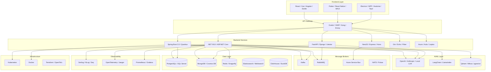

# 🚀 Tech Stack Encyclopedia: Полный справочник библиотек и фреймворков (Обновлено 2026)
## .NET, Java, Python, JavaScript, Go, Rust, C++ и общеплатформенные решения

---

## 📖 Введение

Этот справочник представляет собой **структурированную энциклопедию** популярных библиотек и фреймворков для современных языков программирования. Он охватывает **более 500 инструментов**, сгруппированных по:
- **Языковым экосистемам** (.NET, Java, Python, JS/TS, Go, Rust, C++)
- **Функциональному назначению** (Message Queue, ORM, Testing, Web Framework и т.д.)
- **Кросс-платформенным решениям** (инфраструктура, DevOps, мониторинг)
- **AI/ML стеку** (LLM, RAG, Vector DB, Agents)

### 🎯 Как использовать этот справочник
1. **Выберите экосистему** — начните с раздела, соответствующего вашему стеку
2. **Найдите категорию** — определите тип задачи (очереди сообщений, тестирование, ORM и т.д.)
3. **Сравните альтернативы** — обратите внимание на несколько библиотек в одной категории
4. **Изучите примеры** — в конце приведены примеры кода на C# для ключевых библиотек
5. **Примените паттерны** — раздел о шаблонах проектирования поможет правильно интегрировать инструменты
6. **Следите за трендами** — раздел трендов 2026 покажет направление развития

---

## 🗺️ Архитектура современных приложений: Визуальная схема



---

## 📊 Критерии выбора библиотек

При выборе библиотеки или фреймворка рекомендуется оценивать следующие критерии:

| Критерий | Описание | Вес (рекомендуемый) |
|----------|----------|---------------------|
| **Активность разработки** | Частота коммитов, releases, реакция на issues | ⭐⭐⭐⭐⭐ |
| **Сообщество и поддержка** | Размер сообщества, количество вопросов на StackOverflow | ⭐⭐⭐⭐ |
| **Производительность** | Benchmark-тесты, потребление памяти, latency | ⭐⭐⭐⭐ |
| **Документация** | Качество docs, примеры, tutorials | ⭐⭐⭐⭐⭐ |
| **Лицензия** | Совместимость с вашим проектом (MIT, Apache, GPL, коммерческая) | ⭐⭐⭐⭐⭐ |
| **Совместимость** | Поддержка версий языка, интеграция с другими инструментами | ⭐⭐⭐⭐ |
| **Безопасность** | История уязвимостей, скорость патчинга | ⭐⭐⭐⭐⭐ |
| **Кривая обучения** | Простота освоения, наличие learning resources | ⭐⭐⭐ |
| **AI-готовность** | Интеграция с LLM, поддержка AI-функций | ⭐⭐⭐⭐ |

---

## 🔧 .NET ЭКОСИСТЕМА (C#, F#, VB.NET)

### 📨 Message Queue & Event Bus

| Группа | Наименование | Сайт / Документация | Git-репозиторий |
|:--|:-------------|:--------------------|:----------------|
| **Message Queue** | MassTransit | [masstransit-project.com](https://masstransit-project.com/) | [github.com/MassTransit/MassTransit](https://github.com/MassTransit/MassTransit) |
| | RabbitMQ.Client (официальный клиент) | [rabbitmq.com/dotnet](https://rabbitmq.com/dotnet.html) | [github.com/rabbitmq/rabbitmq-dotnet-client](https://github.com/rabbitmq/rabbitmq-dotnet-client) |
| | Confluent.Kafka | [docs.confluent.io/kafka-clients/dotnet](https://docs.confluent.io/kafka-clients/dotnet/) | [github.com/confluentinc/confluent-kafka-dotnet](https://github.com/confluentinc/confluent-kafka-dotnet) |
| | Azure.Messaging.ServiceBus (.NET SDK) | [azure.microsoft.com/service-bus](https://azure.microsoft.com/en-us/products/service-bus/) | [github.com/Azure/azure-sdk-for-net](https://github.com/Azure/azure-sdk-for-net) |
| | AWSSDK.SQS | [aws.amazon.com/sqs](https://aws.amazon.com/sqs/) | [github.com/aws/aws-sdk-net](https://github.com/aws/aws-sdk-net) |
| | NetMQ (ZeroMQ for .NET) | [netmq.readthedocs.io](https://netmq.readthedocs.io/) | [github.com/zeromq/netmq](https://github.com/zeromq/netmq) |
| | EasyNetQ | [github.com/EasyNetQ/EasyNetQ](https://github.com/EasyNetQ/EasyNetQ) | [github.com/EasyNetQ/EasyNetQ](https://github.com/EasyNetQ/EasyNetQ) |
| | Rebus | [rebus.fm](https://rebus.fm/) | [github.com/rebus-org/Rebus](https://github.com/rebus-org/Rebus) |
| **Pub/Sub & Streaming** | StackExchange.Redis (Pub/Sub) | [stackexchange.github.io/StackExchange.Redis](https://stackexchange.github.io/StackExchange.Redis/) | [github.com/StackExchange/StackExchange.Redis](https://github.com/StackExchange/StackExchange.Redis) |
| | Nats.NET | [nats-io.github.io/nats.net](https://nats-io.github.io/nats.net/) | [github.com/nats-io/nats.net](https://github.com/nats-io/nats.net) |
| | Apache Pulsar Client | [pulsar.apache.org/docs/client-libraries-dotnet](https://pulsar.apache.org/docs/client-libraries-dotnet/) | [github.com/apache/pulsar-dotpulsar](https://github.com/apache/pulsar-dotpulsar) |

### 🎭 Actor Model & Mediator

| Группа | Наименование | Сайт / Документация | Git-репозиторий |
|:--|:-------------|:--------------------|:----------------|
| **Actor Model** | Akka.NET | [getakka.net](https://getakka.net/) | [github.com/akkadotnet/akka.net](https://github.com/akkadotnet/akka.net) |
| | Microsoft Orleans | [dotnet.github.io/orleans](https://dotnet.github.io/orleans/) | [github.com/dotnet/orleans](https://github.com/dotnet/orleans) |
| | Proto.Actor | [proto.actor](https://proto.actor/) | [github.com/asynkron/protoactor-dotnet](https://github.com/asynkron/protoactor-dotnet) |
| **Mediator / CQRS** | MediatR | [github.com/jbogard/MediatR/wiki](https://github.com/jbogard/MediatR/wiki) | [github.com/jbogard/MediatR](https://github.com/jbogard/MediatR) |
| | Wolverine | [wolverine.net](https://wolverine.net/) | [github.com/JasperFx/wolverine](https://github.com/JasperFx/wolverine) |
| | Brighter | [www.gobrighter.org](https://www.gobrighter.org/) | [github.com/BrighterCommand/Brighter](https://github.com/BrighterCommand/Brighter) |

### 📝 Profiling, Logging & Observability

| Группа | Наименование | Сайт / Документация | Git-репозиторий |
|:--|:-------------|:--------------------|:----------------|
| **Logging** | Serilog | [serilog.net](https://serilog.net/) | [github.com/serilog/serilog](https://github.com/serilog/serilog) |
| | NLog | [nlog-project.org](https://nlog-project.org/) | [github.com/NLog/NLog](https://github.com/NLog/NLog) |
| | log4net | [logging.apache.org/log4net](https://logging.apache.org/log4net/) | [github.com/apache/logging-log4net](https://github.com/apache/logging-log4net) |
| | Microsoft.Extensions.Logging | [learn.microsoft.com/logging](https://learn.microsoft.com/en-us/dotnet/core/extensions/logging) | [github.com/dotnet/runtime](https://github.com/dotnet/runtime) |
| **Tracing** | OpenTelemetry .NET | [opentelemetry.io/docs/instrumentation/net](https://opentelemetry.io/docs/instrumentation/net/) | [github.com/open-telemetry/opentelemetry-dotnet](https://github.com/open-telemetry/opentelemetry-dotnet) |
| | Application Insights | [azure.microsoft.com/app-insights](https://azure.microsoft.com/en-us/products/app-insights/) | [github.com/Microsoft/ApplicationInsights-dotnet](https://github.com/Microsoft/ApplicationInsights-dotnet) |
| | Jaeger Client | [jaegertracing.io](https://www.jaegertracing.io/) | [github.com/jaegertracing/jaeger-client-csharp](https://github.com/jaegertracing/jaeger-client-csharp) |
| **Profiling** | MiniProfiler | [miniprofiler.com](https://miniprofiler.com/) | [github.com/MiniProfiler/dotnet](https://github.com/MiniProfiler/dotnet) |
| | BenchmarkDotNet | [benchmarkdotnet.org](https://benchmarkdotnet.org/) | [github.com/dotnet/BenchmarkDotNet](https://github.com/dotnet/BenchmarkDotNet) |
| **Metrics** | Prometheus.NET | [github.com/prometheus-net/prometheus-net](https://github.com/prometheus-net/prometheus-net) | [github.com/prometheus-net/prometheus-net](https://github.com/prometheus-net/prometheus-net) |
| | App Metrics | [www.app-metrics.io](https://www.app-metrics.io/) | [github.com/AppMetrics/AppMetrics](https://github.com/AppMetrics/AppMetrics) |
| **Log Aggregation** | Seq | [datalust.co/seq](https://datalust.co/seq) | (коммерческий, есть free-лицензия) |
| | Elastic APM .NET | [elastic.co/apm](https://www.elastic.co/apm) | [github.com/elastic/apm-agent-dotnet](https://github.com/elastic/apm-agent-dotnet) |
| | Sentry .NET | [sentry.io/for/dotnet](https://sentry.io/for/dotnet/) | [github.com/getsentry/sentry-dotnet](https://github.com/getsentry/sentry-dotnet) |

### 🧪 Testing & Quality

| Группа | Наименование | Сайт / Документация | Git-репозиторий |
|:--|:-------------|:--------------------|:----------------|
| **Unit Testing** | xUnit.net | [xunit.net](https://xunit.net/) | [github.com/xunit/xunit](https://github.com/xunit/xunit) |
| | NUnit | [nunit.org](https://nunit.org/) | [github.com/nunit/nunit](https://github.com/nunit/nunit) |
| | MSTest | [learn.microsoft.com/mstest](https://learn.microsoft.com/en-us/dotnet/core/testing/unit-testing-with-mstest) | [github.com/microsoft/testfx](https://github.com/microsoft/testfx) |
| **Mocking** | Moq | [github.com/devlooped/moq](https://github.com/devlooped/moq) | [github.com/devlooped/moq](https://github.com/devlooped/moq) |
| | NSubstitute | [nsubstitute.github.io](https://nsubstitute.github.io/) | [github.com/nsubstitute/NSubstitute](https://github.com/nsubstitute/NSubstitute) |
| | FakeItEasy | [fakeiteasy.github.io](https://fakeiteasy.github.io/) | [github.com/FakeItEasy/FakeItEasy](https://github.com/FakeItEasy/FakeItEasy) |
| | AutoFixture | [github.com/AutoFixture/AutoFixture](https://github.com/AutoFixture/AutoFixture) | [github.com/AutoFixture/AutoFixture](https://github.com/AutoFixture/AutoFixture) |
| **Assertions** | FluentAssertions | [fluentassertions.com](https://fluentassertions.com/) | [github.com/fluentassertions/fluentassertions](https://github.com/fluentassertions/fluentassertions) |
| | Shouldly | [shouldly.readthedocs.io](https://shouldly.readthedocs.io/) | [github.com/shouldly/shouldly](https://github.com/shouldly/shouldly) |
| **UI Testing** | Selenium.WebDriver | [selenium.dev](https://www.selenium.dev/) | [github.com/SeleniumHQ/selenium](https://github.com/SeleniumHQ/selenium) |
| | Playwright .NET | [playwright.dev/dotnet](https://playwright.dev/dotnet/) | [github.com/microsoft/playwright-dotnet](https://github.com/microsoft/playwright-dotnet) |
| | PuppeteerSharp | [github.com/hardkoded/puppeteer-sharp](https://github.com/hardkoded/puppeteer-sharp) | [github.com/hardkoded/puppeteer-sharp](https://github.com/hardkoded/puppeteer-sharp) |
| **Integration Testing** | Testcontainers .NET | [testcontainers.com](https://testcontainers.com/) | [github.com/testcontainers/testcontainers-dotnet](https://github.com/testcontainers/testcontainers-dotnet) |
| | WireMock.Net | [github.com/WireMock-Net/WireMock.Net](https://github.com/WireMock-Net/WireMock.Net) | [github.com/WireMock-Net/WireMock.Net](https://github.com/WireMock-Net/WireMock.Net) |
| | Respawn | [github.com/jbogard/Respawn](https://github.com/jbogard/Respawn) | [github.com/jbogard/Respawn](https://github.com/jbogard/Respawn) |
| **BDD** | SpecFlow | [specflow.org](https://specflow.org/) | [github.com/SpecFlowOSS/SpecFlow](https://github.com/SpecFlowOSS/SpecFlow) |
| | BDDfy | [bddfy.teststack.net](https://bddfy.teststack.net/) | [github.com/TestStack/TestStack.BDDfy](https://github.com/TestStack/TestStack.BDDfy) |
| **Test Data** | Bogus | [github.com/bchavez/Bogus](https://github.com/bchavez/Bogus) | [github.com/bchavez/Bogus](https://github.com/bchavez/Bogus) |
| | Faker.Net | [github.com/Kuree/Faker.Net](https://github.com/Kuree/Faker.Net) | [github.com/Kuree/Faker.Net](https://github.com/Kuree/Faker.Net) |
| **Architecture Testing** | ArchUnitNET | [github.com/TNG/ArchUnitNET](https://github.com/TNG/ArchUnitNET) | [github.com/TNG/ArchUnitNET](https://github.com/TNG/ArchUnitNET) |
| **Performance Testing** | NBomber | [nbomber.com](https://nbomber.com/) | [github.com/PragmaticFlow/NBomber](https://github.com/PragmaticFlow/NBomber) |
| **Mutation Testing** | Stryker.NET | [stryker-mutator.io](https://stryker-mutator.io/) | [github.com/stryker-mutator/stryker-net](https://github.com/stryker-mutator/stryker-net) |

### 🛡️ Resilience & Retry

| Группа | Наименование | Сайт / Документация | Git-репозиторий |
|:--|:-------------|:--------------------|:----------------|
| **Resilience** | Polly | [thepollyproject.org](https://www.thepollyproject.org/) | [github.com/App-vNext/Polly](https://github.com/App-vNext/Polly) |
| | Microsoft.Extensions.Http.Polly | [learn.microsoft.com](https://learn.microsoft.com/en-us/dotnet/architecture/microservices/implement-resilient-applications/implement-http-call-retries-polly) | [github.com/dotnet/aspnetcore](https://github.com/dotnet/aspnetcore) |

### 💾 Object Storage & File Systems

| Группа | Наименование | Сайт / Документация | Git-репозиторий |
|:--|:-------------|:--------------------|:----------------|
| **Object Storage** | MinIO .NET SDK | [min.io/docs/minio/linux/developers/dotnet](https://min.io/docs/minio/linux/developers/dotnet) | [github.com/minio/minio-dotnet](https://github.com/minio/minio-dotnet) |
| | AWSSDK.S3 | [aws.amazon.com/sdk-for-net](https://aws.amazon.com/sdk-for-net/) | [github.com/aws/aws-sdk-net](https://github.com/aws/aws-sdk-net) |
| | Azure.Storage.Blobs | [azure.microsoft.com/storage/blobs](https://azure.microsoft.com/en-us/products/storage/blobs/) | [github.com/Azure/azure-sdk-for-net](https://github.com/Azure/azure-sdk-for-net) |
| | Google.Cloud.Storage.V1 | [cloud.google.com/dotnet](https://cloud.google.com/dotnet) | [github.com/googleapis/google-cloud-dotnet](https://github.com/googleapis/google-cloud-dotnet) |
| **File Systems** | System.IO.Abstractions | [github.com/TestableIO/System.IO.Abstractions](https://github.com/TestableIO/System.IO.Abstractions) | [github.com/TestableIO/System.IO.Abstractions](https://github.com/TestableIO/System.IO.Abstractions) |

### 📄 Office & Document Processing

| Группа | Наименование | Сайт / Документация | Git-репозиторий |
|:--|:-------------|:--------------------|:----------------|
| **Excel** | MiniExcel | [github.com/shps951023/MiniExcel](https://github.com/shps951023/MiniExcel) | [github.com/shps951023/MiniExcel](https://github.com/shps951023/MiniExcel) |
| | ClosedXML | [closedxml.github.io/ClosedXML](https://closedxml.github.io/ClosedXML/) | [github.com/closedxml/closedxml](https://github.com/closedxml/closedxml) |
| | EPPlus | [epplussoftware.com](https://www.epplussoftware.com/) | [github.com/EPPlusSoftware/EPPlus](https://github.com/EPPlusSoftware/EPPlus) |
| | ExcelDataReader | [github.com/ExcelDataReader/ExcelDataReader](https://github.com/ExcelDataReader/ExcelDataReader) | [github.com/ExcelDataReader/ExcelDataReader](https://github.com/ExcelDataReader/ExcelDataReader) |
| **Word** | MiniWord | [github.com/shps951023/MiniWord](https://github.com/shps951023/MiniWord) | [github.com/shps951023/MiniWord](https://github.com/shps951023/MiniWord) |
| | DocumentFormat.OpenXml | [github.com/OfficeDev/Open-XML-SDK](https://github.com/OfficeDev/Open-XML-SDK) | [github.com/OfficeDev/Open-XML-SDK](https://github.com/OfficeDev/Open-XML-SDK) |
| **PDF** | QuestPDF | [questpdf.com](https://www.questpdf.com/) | [github.com/QuestPDF/QuestPDF](https://github.com/QuestPDF/QuestPDF) |
| | iText7 (для .NET) | [itextpdf.com](https://itextpdf.com/) | [github.com/itext/itext7-dotnet](https://github.com/itext/itext7-dotnet) |
| | PdfPig | [github.com/UglyToad/PdfPig](https://github.com/UglyToad/PdfPig) | [github.com/UglyToad/PdfPig](https://github.com/UglyToad/PdfPig) |
| | MiniPDF | [github.com/shps951023/MiniPDF](https://github.com/shps951023/MiniPDF) | [github.com/shps951023/MiniPDF](https://github.com/shps951023/MiniPDF) |
| **CSV** | CsvHelper | [joshclose.github.io/CsvHelper](https://joshclose.github.io/CsvHelper/) | [github.com/JoshClose/CsvHelper](https://github.com/JoshClose/CsvHelper) |
| **Commercial** | Aspose.Words | [aspose.com/words/net](https://products.aspose.com/words/net/) | (коммерческий) |
| | Aspose.Cells | [aspose.com/cells/net](https://products.aspose.com/cells/net/) | (коммерческий) |
| | Aspose.PDF | [aspose.com/pdf/net](https://products.aspose.com/pdf/net/) | (коммерческий) |

### 🎨 UI Components & Frontend

| Группа | Наименование | Сайт / Документация | Git-репозиторий |
|:--|:-------------|:--------------------|:----------------|
| **Blazor Components** | MudBlazor | [mudblazor.com](https://mudblazor.com/) | [github.com/MudBlazor/MudBlazor](https://github.com/MudBlazor/MudBlazor) |
| | Radzen Blazor | [radzen.com](https://www.radzen.com/) | [github.com/radzenhq/radzen-blazor](https://github.com/radzenhq/radzen-blazor) |
| | Blazorise | [blazorise.com](https://blazorise.com/) | [github.com/stsrki/Blazorise](https://github.com/stsrki/Blazorise) |
| | Ant Design Blazor | [antblazor.com](https://antblazor.com/) | [github.com/ant-design-blazor/ant-design-blazor](https://github.com/ant-design-blazor/ant-design-blazor) |
| | QuickGrid (MS) | [learn.microsoft.com](https://learn.microsoft.com/en-us/aspnet/core/blazor/components/quickgrid) | [github.com/dotnet/aspnetcore](https://github.com/dotnet/aspnetcore) |
| **WPF / WinUI** | Material Design In XAML | [github.com/MaterialDesignInXAML/MaterialDesignInXamlToolkit](https://github.com/MaterialDesignInXAML/MaterialDesignInXamlToolkit) | [github.com/MaterialDesignInXAML/MaterialDesignInXamlToolkit](https://github.com/MaterialDesignInXAML/MaterialDesignInXamlToolkit) |
| | MahApps.Metro | [mahapps.com](https://mahapps.com/) | [github.com/MahApps/MahApps.Metro](https://github.com/MahApps/MahApps.Metro) |
| | Avalonia | [avaloniaui.net](https://avaloniaui.net/) | [github.com/AvaloniaUI/Avalonia](https://github.com/AvaloniaUI/Avalonia) |
| | CommunityToolkit.Maui | [learn.microsoft.com/dotnet/maui](https://learn.microsoft.com/en-us/dotnet/maui/) | [github.com/CommunityToolkit/Maui](https://github.com/CommunityToolkit/Maui) |
| **Commercial Suites** | DevExpress | [devexpress.com](https://www.devexpress.com/) | (коммерческая) |
| | Telerik (Progress) | [telerik.com](https://www.telerik.com/) | (коммерческая) |
| | Syncfusion | [syncfusion.com](https://www.syncfusion.com/) | (коммерческая, есть Community-лицензия) |
| | Infragistics | [infragistics.com](https://www.infragistics.com/) | (коммерческая) |

### 🌐 Web Frameworks & API

| Группа | Наименование | Сайт / Документация | Git-репозиторий |
|:--|:-------------|:--------------------|:----------------|
| **Web Framework** | ASP.NET Core | [dotnet.microsoft.com/aspnet](https://dotnet.microsoft.com/en-us/apps/aspnet) | [github.com/dotnet/aspnetcore](https://github.com/dotnet/aspnetcore) |
| | Minimal APIs (встроен) | [learn.microsoft.com/minimal-apis](https://learn.microsoft.com/en-us/aspnet/core/fundamentals/minimal-apis) | [github.com/dotnet/aspnetcore](https://github.com/dotnet/aspnetcore) |
| | Carter | [github.com/CarterCommunity/Carter](https://github.com/CarterCommunity/Carter) | [github.com/CarterCommunity/Carter](https://github.com/CarterCommunity/Carter) |
| | FastEndpoints | [fast-endpoints.com](https://fast-endpoints.com/) | [github.com/FastEndpoints/FastEndpoints](https://github.com/FastEndpoints/FastEndpoints) |
| | NancyFX (legacy) | [nancyfx.org](https://nancyfx.org/) | [github.com/NancyFx/Nancy](https://github.com/NancyFx/Nancy) |
| **API Gateway** | Ocelot | [ocelot.readthedocs.io](https://ocelot.readthedocs.io/) | [github.com/ThreeMammals/Ocelot](https://github.com/ThreeMammals/Ocelot) |
| | YARP | [microsoft.github.io/reverse-proxy](https://microsoft.github.io/reverse-proxy/) | [github.com/microsoft/reverse-proxy](https://github.com/microsoft/reverse-proxy) |
| **API Documentation** | Swashbuckle (Swagger) | [github.com/domaindrivendev/Swashbuckle](https://github.com/domaindrivendev/Swashbuckle) | [github.com/domaindrivendev/Swashbuckle.AspNetCore](https://github.com/domaindrivendev/Swashbuckle.AspNetCore) |
| | NSwag | [github.com/RicoSuter/NSwag](https://github.com/RicoSuter/NSwag) | [github.com/RicoSuter/NSwag](https://github.com/RicoSuter/NSwag) |
| | Scalar | [scalar.com](https://scalar.com/) | [github.com/scalar/scalar](https://github.com/scalar/scalar) |
| **GraphQL** | Hot Chocolate | [chillicream.com/docs/hotchocolate](https://chillicream.com/docs/hotchocolate) | [github.com/ChilliCream/hotchocolate](https://github.com/ChilliCream/hotchocolate) |
| | GraphQL.NET | [graphql-dotnet.github.io](https://graphql-dotnet.github.io/) | [github.com/graphql-dotnet/graphql-dotnet](https://github.com/graphql-dotnet/graphql-dotnet) |
| **gRPC** | gRPC for .NET | [grpc.io/docs/languages/dotnet](https://grpc.io/docs/languages/dotnet/) | [github.com/grpc/grpc-dotnet](https://github.com/grpc/grpc-dotnet) |
| **HTTP Clients** | RestSharp | [restsharp.dev](https://restsharp.dev/) | [github.com/restsharp/RestSharp](https://github.com/restsharp/RestSharp) |
| | Refit | [github.com/reactiveui/refit](https://github.com/reactiveui/refit) | [github.com/reactiveui/refit](https://github.com/reactiveui/refit) |
| | Flurl | [flurl.dev](https://flurl.dev/) | [github.com/tmenier/Flurl](https://github.com/tmenier/Flurl) |
| | HttpClient (встроенный) | [learn.microsoft.com/httpclient](https://learn.microsoft.com/en-us/dotnet/api/system.net.http.httpclient) | (встроен в .NET) |

### 🗄️ ORM & Data Access

| Группа | Наименование | Сайт / Документация | Git-репозиторий |
|:--|:-------------|:--------------------|:----------------|
| **Full ORM** | Entity Framework Core | [learn.microsoft.com/ef](https://learn.microsoft.com/en-us/ef/) | [github.com/dotnet/efcore](https://github.com/dotnet/efcore) |
| | NHibernate | [nhibernate.info](https://nhibernate.info/) | [github.com/nhibernate/nhibernate-core](https://github.com/nhibernate/nhibernate-core) |
| | Linq2DB | [linq2db.com](https://linq2db.com/) | [github.com/linq2db/linq2db](https://github.com/linq2db/linq2db) |
| | ServiceStack.OrmLite | [servicestack.net/ormlite](https://servicestack.net/ormlite) | [github.com/ServiceStack/ServiceStack](https://github.com/ServiceStack/ServiceStack) |
| **Micro ORM** | Dapper | [github.com/DapperLib/Dapper](https://github.com/DapperLib/Dapper) | [github.com/DapperLib/Dapper](https://github.com/DapperLib/Dapper) |
| | SqlKata | [sqlkata.com](https://sqlkata.com/) | [github.com/sqlkata/querybuilder](https://github.com/sqlkata/querybuilder) |
| | Dommel | [github.com/henkmollema/Dommel](https://github.com/henkmollema/Dommel) | [github.com/henkmollema/Dommel](https://github.com/henkmollema/Dommel) |
| **Document DB** | Marten (PostgreSQL) | [martendb.io](https://martendb.io/) | [github.com/JasperFx/marten](https://github.com/JasperFx/marten) |
| | MongoDB.Driver | [mongodb.com/docs/driver/csharp](https://www.mongodb.com/docs/driver/csharp/) | [github.com/mongodb/mongo-csharp-driver](https://github.com/mongodb/mongo-csharp-driver) |
| **Database Providers** | Npgsql (PostgreSQL) | [www.npgsql.org](https://www.npgsql.org/) | [github.com/npgsql/npgsql](https://github.com/npgsql/npgsql) |
| | MySqlConnector | [mysqlconnector.net](https://mysqlconnector.net/) | [github.com/mysql-net/MySqlConnector](https://github.com/mysql-net/MySqlConnector) |
| | Microsoft.Data.SqlClient | [github.com/dotnet/SqlClient](https://github.com/dotnet/SqlClient) | [github.com/dotnet/SqlClient](https://github.com/dotnet/SqlClient) |
| **Migrations** | EF Core Migrations (встроен) | [learn.microsoft.com/ef/managing-schemas](https://learn.microsoft.com/en-us/ef/core/managing-schemas/) | [github.com/dotnet/efcore](https://github.com/dotnet/efcore) |
| | FluentMigrator | [github.com/fluentmigrator/fluentmigrator](https://github.com/fluentmigrator/fluentmigrator) | [github.com/fluentmigrator/fluentmigrator](https://github.com/fluentmigrator/fluentmigrator) |
| | Roundhouse | [github.com/chucknorris/roundhouse](https://github.com/chucknorris/roundhouse) | [github.com/chucknorris/roundhouse](https://github.com/chucknorris/roundhouse) |

### 💉 Dependency Injection & IoC

| Группа | Наименование | Сайт / Документация | Git-репозиторий |
|:--|:-------------|:--------------------|:----------------|
| **DI Containers** | Microsoft.Extensions.DependencyInjection (встроен) | [learn.microsoft.com/di](https://learn.microsoft.com/en-us/dotnet/core/extensions/dependency-injection) | [github.com/dotnet/runtime](https://github.com/dotnet/runtime) |
| | Autofac | [autofac.org](https://autofac.org/) | [github.com/autofac/Autofac](https://github.com/autofac/Autofac) |
| | Simple Injector | [simpleinjector.org](https://simpleinjector.org/) | [github.com/simpleinjector/SimpleInjector](https://github.com/simpleinjector/SimpleInjector) |
| | DryIoc | [dryioc.com](https://www.dryioc.com/) | [github.com/dadhi/DryIoc](https://github.com/dadhi/DryIoc) |
| | LightInject | [lightinject.net](https://www.lightinject.net/) | [github.com/seesharper/LightInject](https://github.com/seesharper/LightInject) |
| | Lamar | [lamarproject.org](https://lamarproject.org/) | [github.com/JasperFx/lamar](https://github.com/JasperFx/lamar) |
| **Legacy** | Unity (Microsoft) | [github.com/unitycontainer/unity](https://github.com/unitycontainer/unity) | [github.com/unitycontainer/unity](https://github.com/unitycontainer/unity) |
| | Ninject | [ninject.org](https://ninject.org/) | [github.com/ninject/Ninject](https://github.com/ninject/Ninject) |
| | Castle Windsor | [castleproject.org](https://www.castleproject.org/) | [github.com/castleproject/Windsor](https://github.com/castleproject/Windsor) |

### 🗂️ Caching & Distributed Cache

| Группа | Наименование | Сайт / Документация | Git-репозиторий |
|:--|:-------------|:--------------------|:----------------|
| **In-Memory** | Microsoft.Extensions.Caching.Memory | [learn.microsoft.com/caching](https://learn.microsoft.com/en-us/aspnet/core/performance/caching/) | [github.com/dotnet/aspnetcore](https://github.com/dotnet/aspnetcore) |
| | FusionCache | [github.com/jodydonetti/ZiggyCreatures.FusionCache](https://github.com/jodydonetti/ZiggyCreatures.FusionCache) | [github.com/jodydonetti/ZiggyCreatures.FusionCache](https://github.com/jodydonetti/ZiggyCreatures.FusionCache) |
| | CacheManager | [cachemanager.net](https://cachemanager.net/) | [github.com/MichaCo/CacheManager](https://github.com/MichaCo/CacheManager) |
| | Garnet | [github.com/microsoft/garnet](https://github.com/microsoft/garnet) | [github.com/microsoft/garnet](https://github.com/microsoft/garnet) |
| **Distributed** | StackExchange.Redis | [stackexchange.github.io/StackExchange.Redis](https://stackexchange.github.io/StackExchange.Redis/) | [github.com/StackExchange/StackExchange.Redis](https://github.com/StackExchange/StackExchange.Redis) |
| | NCache | [www.alachisoft.com/ncache](https://www.alachisoft.com/ncache/) | (коммерческий, есть OSS-версия) |
| | Hazelcast .NET Client | [hazelcast.com](https://hazelcast.com/) | [github.com/hazelcast/hazelcast-csharp-client](https://github.com/hazelcast/hazelcast-csharp-client) |

### 🔐 Authentication & Authorization

| Группа | Наименование | Сайт / Документация | Git-репозиторий |
|:--|:-------------|:--------------------|:----------------|
| **Identity Providers** | Duende IdentityServer | [duendesoftware.com/products/identityserver](https://duendesoftware.com/products/identityserver) | (коммерческий) |
| | OpenIddict | [openiddict.com](https://openiddict.com/) | [github.com/openiddict/openiddict-core](https://github.com/openiddict/openiddict-core) |
| | IdentityServer4 (legacy, EOL) | [github.com/IdentityServer/IdentityServer4](https://github.com/IdentityServer/IdentityServer4) | [github.com/IdentityServer/IdentityServer4](https://github.com/IdentityServer/IdentityServer4) |
| **Built-in** | ASP.NET Core Identity | [learn.microsoft.com/aspnet/identity](https://learn.microsoft.com/en-us/aspnet/core/security/authentication/identity) | [github.com/dotnet/aspnetcore](https://github.com/dotnet/aspnetcore) |
| | JWT Bearer Auth | [learn.microsoft.com/jwt](https://learn.microsoft.com/en-us/aspnet/core/security/authentication/jwt) | [github.com/dotnet/aspnetcore](https://github.com/dotnet/aspnetcore) |
| **SaaS Integration** | Auth0 .NET SDK | [auth0.com/docs/quickstart/backend/dotnet](https://auth0.com/docs/quickstart/backend/dotnet) | [github.com/auth0/auth0-dotnet](https://github.com/auth0/auth0-dotnet) |
| | Okta .NET SDK | [developer.okta.com/docs/guides/sign-into-web-app-redirect/dotnet-aspnetcore-main](https://developer.okta.com/docs/guides/sign-into-web-app-redirect/dotnet-aspnetcore-main/) | [github.com/okta/okta-dotnet](https://github.com/okta/okta-dotnet) |
| | AWS Cognito | [docs.aws.amazon.com/cognito](https://docs.aws.amazon.com/cognito/) | [github.com/aws/aws-sdk-net](https://github.com/aws/aws-sdk-net) |
| **Libraries** | Jose JWT | [github.com/dvsekhvalnov/jose-jwt](https://github.com/dvsekhvalnov/jose-jwt) | [github.com/dvsekhvalnov/jose-jwt](https://github.com/dvsekhvalnov/jose-jwt) |
| | BCrypt.Net-Next | [github.com/BcryptNet/bcrypt.net](https://github.com/BcryptNet/bcrypt.net) | [github.com/BcryptNet/bcrypt.net](https://github.com/BcryptNet/bcrypt.net) |

### 🤖 Machine Learning & AI

| Группа | Наименование | Сайт / Документация | Git-репозиторий |
|:--|:-------------|:--------------------|:----------------|
| **ML Frameworks** | ML.NET | [dotnet.microsoft.com/ml-dotnet](https://dotnet.microsoft.com/en-us/apps/ai/ml-dotnet) | [github.com/dotnet/machinelearning](https://github.com/dotnet/machinelearning) |
| | TensorFlow.NET | [github.com/SciSharp/TensorFlow.NET](https://github.com/SciSharp/TensorFlow.NET) | [github.com/SciSharp/TensorFlow.NET](https://github.com/SciSharp/TensorFlow.NET) |
| | TorchSharp | [github.com/dotnet/TorchSharp](https://github.com/dotnet/TorchSharp) | [github.com/dotnet/TorchSharp](https://github.com/dotnet/TorchSharp) |
| **Inference** | ONNX Runtime .NET | [onnxruntime.ai](https://onnxruntime.ai/) | [github.com/microsoft/onnxruntime](https://github.com/microsoft/onnxruntime) |
| | OpenCvSharp | [github.com/shimat/opencvsharp](https://github.com/shimat/opencvsharp) | [github.com/shimat/opencvsharp](https://github.com/shimat/opencvsharp) |
| **LLM Integration** | LangChain .NET | [github.com/tryAGI/LangChain](https://github.com/tryAGI/LangChain) | [github.com/tryAGI/LangChain](https://github.com/tryAGI/LangChain) |
| | Betalgo.OpenAI | [github.com/betalgo/openai](https://github.com/betalgo/openai) | [github.com/betalgo/openai](https://github.com/betalgo/openai) |
| | Azure.AI.OpenAI | [learn.microsoft.com/azure/ai-services/openai](https://learn.microsoft.com/en-us/azure/ai-services/openai/) | [github.com/Azure/azure-sdk-for-net](https://github.com/Azure/azure-sdk-for-net) |
| | Microsoft.Extensions.AI | [learn.microsoft.com/dotnet/ai](https://learn.microsoft.com/en-us/dotnet/ai/) | [github.com/dotnet/extensions](https://github.com/dotnet/extensions) |
| | Semantic Kernel | [learn.microsoft.com/semantic-kernel](https://learn.microsoft.com/en-us/semantic-kernel/) | [github.com/microsoft/semantic-kernel](https://github.com/microsoft/semantic-kernel) |
| **Vector DB** | Qdrant .NET Client | [qdrant.tech](https://qdrant.tech/) | [github.com/qdrant/qdrant-dotnet](https://github.com/qdrant/qdrant-dotnet) |
| | Pgvector.NET | [github.com/pgvector/pgvector-dotnet](https://github.com/pgvector/pgvector-dotnet) | [github.com/pgvector/pgvector-dotnet](https://github.com/pgvector/pgvector-dotnet) |

### 🔗 Serialization & Data Formats

| Группа | Наименование | Сайт / Документация | Git-репозиторий |
|:--|:-------------|:--------------------|:----------------|
| **JSON** | System.Text.Json | [learn.microsoft.com/system.text.json](https://learn.microsoft.com/en-us/dotnet/standard/serialization/system-text-json) | [github.com/dotnet/runtime](https://github.com/dotnet/runtime) |
| | Newtonsoft.Json (Json.NET) | [newtonsoft.com/json](https://www.newtonsoft.com/json) | [github.com/JamesNK/Newtonsoft.Json](https://github.com/JamesNK/Newtonsoft.Json) |
| **Binary** | MessagePack for C# | [msgpack.org](https://msgpack.org/) | [github.com/neuecc/MessagePack-CSharp](https://github.com/neuecc/MessagePack-CSharp) |
| | Protobuf-net | [protobuf-net.github.io](https://protobuf-net.github.io/) | [github.com/protobuf-net/protobuf-net](https://github.com/protobuf-net/protobuf-net) |
| | Google.Protobuf | [github.com/protocolbuffers/protobuf](https://github.com/protocolbuffers/protobuf) | [github.com/protocolbuffers/protobuf](https://github.com/protocolbuffers/protobuf) |
| **YAML/XML** | YamlDotNet | [github.com/aaubry/YamlDotNet](https://github.com/aaubry/YamlDotNet) | [github.com/aaubry/YamlDotNet](https://github.com/aaubry/YamlDotNet) |
| | SharpYaml | [github.com/xoofx/SharpYaml](https://github.com/xoofx/SharpYaml) | [github.com/xoofx/SharpYaml](https://github.com/xoofx/SharpYaml) |
| **Other** | Tomlyn | [github.com/scriban/tomlyn](https://github.com/scriban/tomlyn) | [github.com/scriban/tomlyn](https://github.com/scriban/tomlyn) |

### ✅ Validation

| Группа | Наименование | Сайт / Документация | Git-репозиторий |
|:--|:-------------|:--------------------|:----------------|
| **Validation** | FluentValidation | [fluentvalidation.net](https://fluentvalidation.net/) | [github.com/FluentValidation/FluentValidation](https://github.com/FluentValidation/FluentValidation) |
| | DataAnnotations (встроенный) | [learn.microsoft.com/dataannotations](https://learn.microsoft.com/en-us/dotnet/api/system.componentmodel.dataannotations) | [github.com/dotnet/runtime](https://github.com/dotnet/runtime) |
| | MiniValidation | [github.com/DamianEdwards/MiniValidation](https://github.com/DamianEdwards/MiniValidation) | [github.com/DamianEdwards/MiniValidation](https://github.com/DamianEdwards/MiniValidation) |

### 🔄 Reactive & Async Patterns

| Группа | Наименование | Сайт / Документация | Git-репозиторий |
|:--|:-------------|:--------------------|:----------------|
| **Reactive Extensions** | Reactive Extensions (Rx.NET) | [reactivex.io](https://reactivex.io/) | [github.com/dotnet/reactive](https://github.com/dotnet/reactive) |
| | Dynamic Data | [github.com/reactivemarbles/DynamicData](https://github.com/reactivemarbles/DynamicData) | [github.com/reactivemarbles/DynamicData](https://github.com/reactivemarbles/DynamicData) |
| **Task Parallelism** | System.Threading.Tasks.Dataflow | [learn.microsoft.com/tpl-dataflow](https://learn.microsoft.com/en-us/dotnet/standard/parallel-programming/dataflow-task-parallel-library) | [github.com/dotnet/runtime](https://github.com/dotnet/runtime) |
| | System.Threading.Channels | [learn.microsoft.com/channels](https://learn.microsoft.com/en-us/dotnet/api/system.threading.channels) | [github.com/dotnet/runtime](https://github.com/dotnet/runtime) |
| **Background Jobs** | Hangfire | [www.hangfire.io](https://www.hangfire.io/) | [github.com/HangfireIO/Hangfire](https://github.com/HangfireIO/Hangfire) |
| | Quartz.NET | [www.quartz-scheduler.net](https://www.quartz-scheduler.net/) | [github.com/quartznet/quartznet](https://github.com/quartznet/quartznet) |
| | Coravel | [docs.coravel.net](https://docs.coravel.net/) | [github.com/jamesmh/coravel](https://github.com/jamesmh/coravel) |

### 🛠️ Utility Libraries

| Группа | Наименование | Сайт / Документация | Git-репозиторий |
|:--|:-------------|:--------------------|:----------------|
| **Mapping** | AutoMapper | [automapper.org](https://automapper.org/) | [github.com/AutoMapper/AutoMapper](https://github.com/AutoMapper/AutoMapper) |
| | Mapster | [github.com/MapsterMapper/Mapster](https://github.com/MapsterMapper/Mapster) | [github.com/MapsterMapper/Mapster](https://github.com/MapsterMapper/Mapster) |
| **Date/Time** | NodaTime | [nodatime.org](https://nodatime.org/) | [github.com/nodatime/nodatime](https://github.com/nodatime/nodatime) |
| | Humanizer | [humanizr.github.io](https://humanizr.github.io/) | [github.com/Humanizr/Humanizer](https://github.com/Humanizr/Humanizer) |
| **Collections** | MoreLINQ | [morelinq.github.io](https://morelinq.github.io/) | [github.com/morelinq/MoreLINQ](https://github.com/morelinq/MoreLINQ) |
| | System.Collections.Immutable | [learn.microsoft.com](https://learn.microsoft.com/en-us/dotnet/api/system.collections.immutable) | [github.com/dotnet/runtime](https://github.com/dotnet/runtime) |
| **Functional** | LanguageExt | [github.com/louthy/language-ext](https://github.com/louthy/language-ext) | [github.com/louthy/language-ext](https://github.com/louthy/language-ext) |
| | Optional | [github.com/nlkl/Optional](https://github.com/nlkl/Optional) | [github.com/nlkl/Optional](https://github.com/nlkl/Optional) |
| **CLI** | Spectre.Console | [spectreconsole.net](https://spectreconsole.net/) | [github.com/spectreconsole/spectre.console](https://github.com/spectreconsole/spectre.console) |
| | System.CommandLine | [github.com/dotnet/command-line-api](https://github.com/dotnet/command-line-api) | [github.com/dotnet/command-line-api](https://github.com/dotnet/command-line-api) |
| | CommandLineParser | [github.com/commandlineparser/commandline](https://github.com/commandlineparser/commandline) | [github.com/commandlineparser/commandline](https://github.com/commandlineparser/commandline) |
| **HTML Parsing** | AngleSharp | [anglesharp.github.io](https://anglesharp.github.io/) | [github.com/AngleSharp/AngleSharp](https://github.com/AngleSharp/AngleSharp) |
| | HtmlAgilityPack | [html-agility-pack.net](https://html-agility-pack.net/) | [github.com/zzzprojects/HtmlAgilityPack](https://github.com/zzzprojects/HtmlAgilityPack) |
| **Image Processing** | SixLabors.ImageSharp | [sixlabors.com/imagesharp](https://sixlabors.com/imagesharp/) | [github.com/SixLabors/ImageSharp](https://github.com/SixLabors/ImageSharp) |
| | SkiaSharp | [github.com/mono/SkiaSharp](https://github.com/mono/SkiaSharp) | [github.com/mono/SkiaSharp](https://github.com/mono/SkiaSharp) |
| | Magick.NET | [github.com/dlemstra/Magick.NET](https://github.com/dlemstra/Magick.NET) | [github.com/dlemstra/Magick.NET](https://github.com/dlemstra/Magick.NET) |
| **Compression** | SharpZipLib | [github.com/icsharpcode/SharpZipLib](https://github.com/icsharpcode/SharpZipLib) | [github.com/icsharpcode/SharpZipLib](https://github.com/icsharpcode/SharpZipLib) |
| | K4os.Compression.LZ4 | [github.com/KrzysztofCwalina/K4os.Compression.LZ4](https://github.com/KrzysztofCwalina/K4os.Compression.LZ4) | [github.com/KrzysztofCwalina/K4os.Compression.LZ4](https://github.com/KrzysztofCwalina/K4os.Compression.LZ4) |
| **Cryptography** | BouncyCastle | [www.bouncycastle.org/csharp](https://www.bouncycastle.org/csharp/) | [github.com/bcgit/bc-csharp](https://github.com/bcgit/bc-csharp) |
| | System.Security.Cryptography (встроен) | [learn.microsoft.com](https://learn.microsoft.com/en-us/dotnet/api/system.security.cryptography) | (встроен в .NET) |
| **Geo / Spatial** | NetTopologySuite | [github.com/NetTopologySuite/NetTopologySuite](https://github.com/NetTopologySuite/NetTopologySuite) | [github.com/NetTopologySuite/NetTopologySuite](https://github.com/NetTopologySuite/NetTopologySuite) |
| | GeoAPI | [github.com/NetTopologySuite/GeoAPI](https://github.com/NetTopologySuite/GeoAPI) | [github.com/NetTopologySuite/GeoAPI](https://github.com/NetTopologySuite/GeoAPI) |

---

# ☕ JAVA ЭКОСИСТЕМА (Обновлено 2026)

### 📨 Message Queue & Streaming

| Группа | Наименование | Сайт / Документация | Git-репозиторий |
|:-------|:-------------|:--------------------|:----------------|
| **Message Queue** | Apache Kafka (Java client) | [kafka.apache.org](https://kafka.apache.org/) | [github.com/apache/kafka](https://github.com/apache/kafka) |
| | RabbitMQ Java Client | [rabbitmq.com/java](https://rabbitmq.com/java.html) | [github.com/rabbitmq/rabbitmq-java-client](https://github.com/rabbitmq/rabbitmq-java-client) |
| | ActiveMQ Artemis | [activemq.apache.org](https://activemq.apache.org/) | [github.com/apache/activemq-artemis](https://github.com/apache/activemq-artemis) |
| | JMS (Jakarta Message Service) | [jakarta.ee/specifications/jms](https://jakarta.ee/specifications/jms/) | [github.com/eclipse-ee4j/jms-api](https://github.com/eclipse-ee4j/jms-api) |
| | Spring Kafka | [spring.io/projects/spring-kafka](https://spring.io/projects/spring-kafka) | [github.com/spring-projects/spring-kafka](https://github.com/spring-projects/spring-kafka) |
| | Spring AMQP | [spring.io/projects/spring-amqp](https://spring.io/projects/spring-amqp) | [github.com/spring-projects/spring-amqp](https://github.com/spring-projects/spring-amqp) |
| | SmallRye Reactive Messaging | [smallrye.io/smallrye-reactive-messaging](https://smallrye.io/smallrye-reactive-messaging/) | [github.com/smallrye/smallrye-reactive-messaging](https://github.com/smallrye/smallrye-reactive-messaging) |

### 🎭 Actor Model & Concurrency

| Группа | Наименование | Сайт / Документация | Git-репозиторий |
|:-------|:-------------|:--------------------|:----------------|
| **Actor Model** | Akka (Java/Scala) | [akka.io](https://akka.io/) | [github.com/akka/akka](https://github.com/akka/akka) |
| | Quasar (fibers) | [docs.paralleluniverse.co/quasar](https://docs.paralleluniverse.co/quasar/) | [github.com/puniverse/quasar](https://github.com/puniverse/quasar) |
| **Virtual Threads** | Java 21+ Virtual Threads (Project Loom) | [openjdk.org/projects/loom](https://openjdk.org/projects/loom/) | (встроен в JDK 21+) |
| | Structured Concurrency (Java 21+) | [openjdk.org/projects/loom](https://openjdk.org/projects/loom/) | (встроен в JDK 21+) |
| | Scoped Values (Java 21+ preview) | [openjdk.org/projects/loom](https://openjdk.org/projects/loom/) | (preview в JDK 21+) |

### 🧪 Testing

| Группа | Наименование | Сайт / Документация | Git-репозиторий |
|:-------|:-------------|:--------------------|:----------------|
| **Unit Testing** | JUnit 5 | [junit.org](https://junit.org/) | [github.com/junit-team/junit5](https://github.com/junit-team/junit5) |
| | TestNG | [testng.org](https://testng.org/) | [github.com/testng-team/testng](https://github.com/testng-team/testng) |
| | Kotest | [kotest.io](https://kotest.io/) | [github.com/kotest/kotest](https://github.com/kotest/kotest) |
| **Mocking** | Mockito | [site.mockito.org](https://site.mockito.org/) | [github.com/mockito/mockito](https://github.com/mockito/mockito) |
| | WireMock | [wiremock.org](https://wiremock.org/) | [github.com/wiremock/wiremock](https://github.com/wiremock/wiremock) |
| | MockServer | [mock-server.com](https://www.mock-server.com/) | [github.com/mock-server/mockserver](https://github.com/mock-server/mockserver) |
| **Assertions** | AssertJ | [assertj.github.io](https://assertj.github.io/doc/) | [github.com/assertj/assertj](https://github.com/assertj/assertj) |
| | Hamcrest | [hamcrest.org](http://hamcrest.org/) | [github.com/hamcrest/JavaHamcrest](https://github.com/hamcrest/JavaHamcrest) |
| | Truth (Google) | [truth.dev](https://truth.dev/) | [github.com/google/truth](https://github.com/google/truth) |
| **BDD** | Cucumber-JVM | [cucumber.io](https://cucumber.io/) | [github.com/cucumber/cucumber-jvm](https://github.com/cucumber/cucumber-jvm) |
| | JBehave | [jbehave.org](https://jbehave.org/) | [github.com/jbehave/jbehave](https://github.com/jbehave/jbehave) |
| **UI Testing** | Selenium Java | [selenium.dev](https://www.selenium.dev/) | [github.com/SeleniumHQ/selenium](https://github.com/SeleniumHQ/selenium) |
| | Selenide | [selenide.org](https://selenide.org/) | [github.com/selenide/selenide](https://github.com/selenide/selenide) |
| | Playwright Java | [playwright.dev/java](https://playwright.dev/java/) | [github.com/microsoft/playwright-java](https://github.com/microsoft/playwright-java) |
| **Integration** | Testcontainers Java | [testcontainers.com](https://testcontainers.com/) | [github.com/testcontainers/testcontainers-java](https://github.com/testcontainers/testcontainers-java) |
| | Awaitility | [github.com/awaitility/awaitility](https://github.com/awaitility/awaitility) | [github.com/awaitility/awaitility](https://github.com/awaitility/awaitility) |
| **Performance** | JMH (Java Microbenchmark Harness) | [openjdk.org/projects/code-tools/jmh](https://openjdk.org/projects/code-tools/jmh/) | [github.com/openjdk/jmh](https://github.com/openjdk/jmh) |
| | Gatling | [gatling.io](https://gatling.io/) | [github.com/gatling/gatling](https://github.com/gatling/gatling) |
| | k6 (Java SDK) | [k6.io](https://k6.io/) | [github.com/grafana/k6](https://github.com/grafana/k6) |

### 🛡️ Resilience & Retry

| Группа | Наименование | Сайт / Документация | Git-репозиторий |
|:-------|:-------------|:--------------------|:----------------|
| **Resilience** | Resilience4j | [resilience4j.readme.io](https://resilience4j.readme.io/) | [github.com/resilience4j/resilience4j](https://github.com/resilience4j/resilience4j) |
| | Failsafe | [failsafe.dev](https://failsafe.dev/) | [github.com/failsafe-lib/failsafe](https://github.com/failsafe-lib/failsafe) |
| | Spring Retry | [github.com/spring-projects/spring-retry](https://github.com/spring-projects/spring-retry) | [github.com/spring-projects/spring-retry](https://github.com/spring-projects/spring-retry) |
| | Fault Tolerance (MicroProfile) | [microprofile.io](https://microprofile.io/) | [github.com/eclipse/microprofile-fault-tolerance](https://github.com/eclipse/microprofile-fault-tolerance) |

### 💾 Object Storage

| Группа | Наименование | Сайт / Документация | Git-репозиторий |
|:-------|:-------------|:--------------------|:----------------|
| **Object Storage** | AWS S3 SDK (v2) | [aws.amazon.com/sdk-for-java](https://aws.amazon.com/sdk-for-java/) | [github.com/aws/aws-sdk-java-v2](https://github.com/aws/aws-sdk-java-v2) |
| | MinIO Java SDK | [min.io/docs/minio/linux/developers/java](https://min.io/docs/minio/linux/developers/java) | [github.com/minio/minio-java](https://github.com/minio/minio-java) |
| | Google Cloud Java SDK | [cloud.google.com/java](https://cloud.google.com/java) | [github.com/googleapis/google-cloud-java](https://github.com/googleapis/google-cloud-java) |
| | Azure SDK for Java | [azure.github.io/azure-sdk-for-java](https://azure.github.io/azure-sdk-for-java/) | [github.com/Azure/azure-sdk-for-java](https://github.com/Azure/azure-sdk-for-java) |

### 📄 Office & Document Processing

| Группа | Наименование | Сайт / Документация | Git-репозиторий |
|:-------|:-------------|:--------------------|:----------------|
| **Office** | Apache POI | [poi.apache.org](https://poi.apache.org/) | [github.com/apache/poi](https://github.com/apache/poi) |
| | docx4j | [github.com/plutext/docx4j](https://github.com/plutext/docx4j) | [github.com/plutext/docx4j](https://github.com/plutext/docx4j) |
| **PDF** | iText | [itextpdf.com](https://itextpdf.com/) | [github.com/itext/itext7](https://github.com/itext/itext7) |
| | Apache PDFBox | [pdfbox.apache.org](https://pdfbox.apache.org/) | [github.com/apache/pdfbox](https://github.com/apache/pdfbox) |
| | OpenPDF | [github.com/LibrePDF/OpenPDF](https://github.com/LibrePDF/OpenPDF) | [github.com/LibrePDF/OpenPDF](https://github.com/LibrePDF/OpenPDF) |
| **Commercial** | Aspose.Words | [aspose.com/words/java](https://products.aspose.com/words/java/) | (коммерческий) |

### 🎨 UI Frameworks

| Группа | Наименование | Сайт / Документация | Git-репозиторий |
|:-------|:-------------|:--------------------|:----------------|
| **Desktop** | JavaFX | [openjfx.io](https://openjfx.io/) | [github.com/openjdk/jfx](https://github.com/openjdk/jfx) |
| | Compose Multiplatform Desktop | [jetbrains.com/lp/compose](https://www.jetbrains.com/lp/compose-multiplatform/) | [github.com/JetBrains/compose-multiplatform](https://github.com/JetBrains/compose-multiplatform) |
| | Swing (встроенный) | [docs.oracle.com/javase/swing](https://docs.oracle.com/javase/tutorial/uiswing/) | (встроен в JDK) |
| **Web** | Vaadin | [vaadin.com](https://vaadin.com/) | [github.com/vaadin](https://github.com/vaadin) |

### 🌐 Web Frameworks

| Группа | Наименование | Сайт / Документация | Git-репозиторий |
|:-------|:-------------|:--------------------|:----------------|
| **Web Framework** | Spring Boot 3.3+ | [spring.io/projects/spring-boot](https://spring.io/projects/spring-boot) | [github.com/spring-projects/spring-boot](https://github.com/spring-projects/spring-boot) |
| | Quarkus | [quarkus.io](https://quarkus.io/) | [github.com/quarkusio/quarkus](https://github.com/quarkusio/quarkus) |
| | Micronaut | [micronaut.io](https://micronaut.io/) | [github.com/micronaut-projects/micronaut-core](https://github.com/micronaut-projects/micronaut-core) |
| | Helidon (Oracle) | [helidon.io](https://helidon.io/) | [github.com/helidon-io/helidon](https://github.com/helidon-io/helidon) |
| | Jakarta EE | [jakarta.ee](https://jakarta.ee/) | [github.com/eclipse-ee4j](https://github.com/eclipse-ee4j) |
| | Play Framework | [playframework.com](https://www.playframework.com/) | [github.com/playframework/playframework](https://github.com/playframework/playframework) |
| | Javalin | [javalin.io](https://javalin.io/) | [github.com/javalin/javalin](https://github.com/javalin/javalin) |
| | Spring WebFlux | [spring.io/projects/spring-framework](https://spring.io/projects/spring-framework) | [github.com/spring-projects/spring-framework](https://github.com/spring-projects/spring-framework) |

### 🗄️ ORM & Data Access

| Группа | Наименование | Сайт / Документация | Git-репозиторий |
|:-------|:-------------|:--------------------|:----------------|
| **Full ORM** | Hibernate ORM 6+ | [hibernate.org](https://hibernate.org/) | [github.com/hibernate/hibernate-orm](https://github.com/hibernate/hibernate-orm) |
| | EclipseLink | [eclipse.dev/eclipselink](https://eclipse.dev/eclipselink/) | [github.com/eclipse-ee4j/eclipselink](https://github.com/eclipse-ee4j/eclipselink) |
| | JPA (Jakarta Persistence) | [jakarta.ee/specifications/persistence](https://jakarta.ee/specifications/persistence/) | [github.com/eclipse-ee4j/jpa-api](https://github.com/eclipse-ee4j/jpa-api) |
| **Data Mapper** | MyBatis | [mybatis.org](https://mybatis.org/) | [github.com/mybatis/mybatis-3](https://github.com/mybatis/mybatis-3) |
| | jOOQ | [www.jooq.org](https://www.jooq.org/) | [github.com/jOOQ/jOOQ](https://github.com/jOOQ/jOOQ) |
| | Querydsl | [querydsl.com](https://querydsl.com/) | [github.com/querydsl/querydsl](https://github.com/querydsl/querydsl) |
| | Exposed (Kotlin) | [github.com/JetBrains/Exposed](https://github.com/JetBrains/Exposed) | [github.com/JetBrains/Exposed](https://github.com/JetBrains/Exposed) |
| **Spring Data** | Spring Data JPA | [spring.io/projects/spring-data-jpa](https://spring.io/projects/spring-data-jpa) | [github.com/spring-projects/spring-data-jpa](https://github.com/spring-projects/spring-data-jpa) |
| | Spring Data MongoDB | [spring.io/projects/spring-data-mongodb](https://spring.io/projects/spring-data-mongodb) | [github.com/spring-projects/spring-data-mongodb](https://github.com/spring-projects/spring-data-mongodb) |
| | Spring Data Redis | [spring.io/projects/spring-data-redis](https://spring.io/projects/spring-data-redis) | [github.com/spring-projects/spring-data-redis](https://github.com/spring-projects/spring-data-redis) |
| | Spring Data R2DBC | [spring.io/projects/spring-data-r2dbc](https://spring.io/projects/spring-data-r2dbc) | [github.com/spring-projects/spring-data-r2dbc](https://github.com/spring-projects/spring-data-r2dbc) |
| **Migrations** | Flyway | [flywaydb.org](https://flywaydb.org/) | [github.com/flyway/flyway](https://github.com/flyway/flyway) |
| | Liquibase | [liquibase.org](https://www.liquibase.org/) | [github.com/liquibase/liquibase](https://github.com/liquibase/liquibase) |

### 💉 Dependency Injection

| Группа | Наименование | Сайт / Документация | Git-репозиторий |
|:-------|:-------------|:--------------------|:----------------|
| **DI Containers** | Spring DI (Spring Framework) | [spring.io](https://spring.io/) | [github.com/spring-projects/spring-framework](https://github.com/spring-projects/spring-framework) |
| | Dagger | [dagger.dev](https://dagger.dev/) | [github.com/google/dagger](https://github.com/google/dagger) |
| | Guice | [github.com/google/guice](https://github.com/google/guice) | [github.com/google/guice](https://github.com/google/guice) |
| | CDI (Jakarta) | [jakarta.ee/specifications/cdi](https://jakarta.ee/specifications/cdi/) | [github.com/eclipse-ee4j/cdi](https://github.com/eclipse-ee4j/cdi) |
| | Micronaut DI | [micronaut.io](https://micronaut.io/) | [github.com/micronaut-projects/micronaut-core](https://github.com/micronaut-projects/micronaut-core) |

### 🗂️ Caching

| Группа | Наименование | Сайт / Документация | Git-репозиторий |
|:-------|:-------------|:--------------------|:----------------|
| **In-Memory** | Caffeine | [github.com/ben-manes/caffeine](https://github.com/ben-manes/caffeine) | [github.com/ben-manes/caffeine](https://github.com/ben-manes/caffeine) |
| | Ehcache | [ehcache.org](https://www.ehcache.org/) | [github.com/ehcache/ehcache3](https://github.com/ehcache/ehcache3) |
| | Hazelcast | [hazelcast.com](https://hazelcast.com/) | [github.com/hazelcast/hazelcast](https://github.com/hazelcast/hazelcast) |
| | Ignite | [ignite.apache.org](https://ignite.apache.org/) | [github.com/apache/ignite](https://github.com/apache/ignite) |
| **Distributed** | Jedis | [redis.io/clients](https://redis.io/clients) | [github.com/redis/jedis](https://github.com/redis/jedis) |
| | Lettuce | [github.com/lettuce-io/lettuce-core](https://github.com/lettuce-io/lettuce-core) | [github.com/lettuce-io/lettuce-core](https://github.com/lettuce-io/lettuce-core) |
| | Redisson | [redisson.org](https://redisson.org/) | [github.com/redisson/redisson](https://github.com/redisson/redisson) |

### 🔐 Authentication & Security

| Группа | Наименование | Сайт / Документация | Git-репозиторий |
|:-------|:-------------|:--------------------|:----------------|
| **Security Frameworks** | Spring Security | [spring.io/projects/spring-security](https://spring.io/projects/spring-security) | [github.com/spring-projects/spring-security](https://github.com/spring-projects/spring-security) |
| | Keycloak (Java Adapter) | [keycloak.org](https://www.keycloak.org/) | [github.com/keycloak/keycloak](https://github.com/keycloak/keycloak) |
| **JWT** | JJWT | [github.com/jwtk/jjwt](https://github.com/jwtk/jjwt) | [github.com/jwtk/jjwt](https://github.com/jwtk/jjwt) |
| | Nimbus JOSE+JWT | [connect2id.com/products/nimbus-jose-jwt](https://connect2id.com/products/nimbus-jose-jwt) | [github.com/okta/okta-jwt-verifier-java](https://github.com/okta/okta-jwt-verifier-java) |
| **OAuth2** | Spring Authorization Server | [spring.io/projects/spring-authorization-server](https://spring.io/projects/spring-authorization-server) | [github.com/spring-projects/spring-authorization-server](https://github.com/spring-projects/spring-authorization-server) |

### 🤖 Machine Learning & AI

| Группа | Наименование | Сайт / Документация | Git-репозиторий |
|:-------|:-------------|:--------------------|:----------------|
| **ML Frameworks** | DJL (Deep Java Library) | [djl.ai](https://djl.ai/) | [github.com/deepjavalibrary/djl](https://github.com/deepjavalibrary/djl) |
| | Deeplearning4j | [deeplearning4j.org](https://deeplearning4j.org/) | [github.com/eclipse/deeplearning4j](https://github.com/eclipse/deeplearning4j) |
| | Tribuo (Oracle) | [tribuo.org](https://tribuo.org/) | [github.com/oracle/tribuo](https://github.com/oracle/tribuo) |
| **LLM Integration** | LangChain4j | [docs.langchain4j.dev](https://docs.langchain4j.dev/) | [github.com/langchain4j/langchain4j](https://github.com/langchain4j/langchain4j) |
| | Spring AI | [spring.io/projects/spring-ai](https://spring.io/projects/spring-ai) | [github.com/spring-projects/spring-ai](https://github.com/spring-projects/spring-ai) |
| | Semantic Kernel (Java) | [learn.microsoft.com/semantic-kernel](https://learn.microsoft.com/en-us/semantic-kernel/) | [github.com/microsoft/semantic-kernel-java](https://github.com/microsoft/semantic-kernel-java) |
| | Ollama4j | [github.com/ollama4j/ollama4j](https://github.com/ollama4j/ollama4j) | [github.com/ollama4j/ollama4j](https://github.com/ollama4j/ollama4j) |

### 🛠️ Utility Libraries

| Группа | Наименование | Сайт / Документация | Git-репозиторий |
|:-------|:-------------|:--------------------|:----------------|
| **Core Utilities** | Apache Commons Lang | [commons.apache.org/lang](https://commons.apache.org/proper/commons-lang/) | [github.com/apache/commons-lang](https://github.com/apache/commons-lang) |
| | Google Guava | [github.com/google/guava](https://github.com/google/guava) | [github.com/google/guava](https://github.com/google/guava) |
| | Vavr (functional) | [www.vavr.io](https://www.vavr.io/) | [github.com/vavr-io/vavr](https://github.com/vavr-io/vavr) |
| | Apache Commons Collections | [commons.apache.org/collections](https://commons.apache.org/proper/commons-collections/) | [github.com/apache/commons-collections](https://github.com/apache/commons-collections) |
| **Code Generation** | Lombok | [projectlombok.org](https://projectlombok.org/) | [github.com/projectlombok/lombok](https://github.com/projectlombok/lombok) |
| | MapStruct | [mapstruct.org](https://mapstruct.org/) | [github.com/mapstruct/mapstruct](https://github.com/mapstruct/mapstruct) |
| | Immutables | [immutables.github.io](https://immutables.github.io/) | [github.com/immutables/immutables](https://github.com/immutables/immutables) |
| **JSON** | Jackson | [github.com/FasterXML/jackson](https://github.com/FasterXML/jackson) | [github.com/FasterXML/jackson](https://github.com/FasterXML/jackson) |
| | Gson | [github.com/google/gson](https://github.com/google/gson) | [github.com/google/gson](https://github.com/google/gson) |
| | Moshi | [github.com/square/moshi](https://github.com/square/moshi) | [github.com/square/moshi](https://github.com/square/moshi) |
| **Logging** | Logback | [logback.qos.ch](https://logback.qos.ch/) | [github.com/qos-ch/logback](https://github.com/qos-ch/logback) |
| | Log4j2 | [logging.apache.org/log4j/2.x](https://logging.apache.org/log4j/2.x/) | [github.com/apache/logging-log4j2](https://github.com/apache/logging-log4j2) |
| | SLF4J | [slf4j.org](https://www.slf4j.org/) | [github.com/qos-ch/slf4j](https://github.com/qos-ch/slf4j) |
| | Logstash Logback Encoder | [github.com/logfellow/logstash-logback-encoder](https://github.com/logfellow/logstash-logback-encoder) | [github.com/logfellow/logstash-logback-encoder](https://github.com/logfellow/logstash-logback-encoder) |

---

# 🐍 PYTHON ЭКОСИСТЕМА (Обновлено 2026)

### 🌐 Web Frameworks

| Группа | Наименование | Сайт / Документация | Git-репозиторий |
|:-------|:-------------|:--------------------|:----------------|
| **Full-Stack** | Django 5.x | [djangoproject.com](https://www.djangoproject.com/) | [github.com/django/django](https://github.com/django/django) |
| **Microframeworks** | Flask | [flask.palletsprojects.com](https://flask.palletsprojects.com/) | [github.com/pallets/flask](https://github.com/pallets/flask) |
| | FastAPI | [fastapi.tiangolo.com](https://fastapi.tiangolo.com/) | [github.com/tiangolo/fastapi](https://github.com/tiangolo/fastapi) |
| | Litestar | [litestar.dev](https://litestar.dev/) | [github.com/litestar-org/litestar](https://github.com/litestar-org/litestar) |
| | Sanic | [sanic.dev](https://sanic.dev/) | [github.com/sanic-org/sanic](https://github.com/sanic-org/sanic) |
| | Tornado | [tornadoweb.org](https://www.tornadoweb.org/) | [github.com/tornadoweb/tornado](https://github.com/tornadoweb/tornado) |
| | BlackSheep | [blackshep.rocks](https://blackshep.rocks/) | [github.com/Neoteroi/BlackSheep](https://github.com/Neoteroi/BlackSheep) |
| **ASGI** | Starlette | [starlette.io](https://www.starlette.io/) | [github.com/encode/starlette](https://github.com/encode/starlette) |
| | Uvicorn | [uvicorn.org](https://www.uvicorn.org/) | [github.com/encode/uvicorn](https://github.com/encode/uvicorn) |
| | Hypercorn | [github.com/pgjones/hypercorn](https://github.com/pgjones/hypercorn) | [github.com/pgjones/hypercorn](https://github.com/pgjones/hypercorn) |
| | Granian | [github.com/emmett-framework/granian](https://github.com/emmett-framework/granian) | [github.com/emmett-framework/granian](https://github.com/emmett-framework/granian) |

### 🧪 Testing

| Группа | Наименование | Сайт / Документация | Git-репозиторий |
|:-------|:-------------|:--------------------|:----------------|
| **Test Frameworks** | pytest | [pytest.org](https://docs.pytest.org/) | [github.com/pytest-dev/pytest](https://github.com/pytest-dev/pytest) |
| | unittest (встроенный) | [docs.python.org/unittest](https://docs.python.org/3/library/unittest.html) | (встроен в Python) |
| | nose2 | [nose2.readthedocs.io](https://nose2.readthedocs.io/) | [github.com/nose-devs/nose2](https://github.com/nose-devs/nose2) |
| **Mocking** | mock (unittest.mock) | [docs.python.org/mock](https://docs.python.org/3/library/unittest.mock.html) | (встроен в Python) |
| | pytest-mock | [github.com/pytest-dev/pytest-mock](https://github.com/pytest-dev/pytest-mock) | [github.com/pytest-dev/pytest-mock](https://github.com/pytest-dev/pytest-mock) |
| | responses | [github.com/getsentry/responses](https://github.com/getsentry/responses) | [github.com/getsentry/responses](https://github.com/getsentry/responses) |
| | VCR.py | [github.com/kevin1024/vcrpy](https://github.com/kevin1024/vcrpy) | [github.com/kevin1024/vcrpy](https://github.com/kevin1024/vcrpy) |
| **UI Testing** | Selenium | [selenium-python.readthedocs.io](https://selenium-python.readthedocs.io/) | [github.com/SeleniumHQ/selenium](https://github.com/SeleniumHQ/selenium) |
| | Playwright | [playwright.dev/python](https://playwright.dev/python/) | [github.com/microsoft/playwright-python](https://github.com/microsoft/playwright-python) |
| **BDD** | behave | [behave.readthedocs.io](https://behave.readthedocs.io/) | [github.com/behave/behave](https://github.com/behave/behave) |
| | robotframework | [robotframework.org](https://robotframework.org/) | [github.com/robotframework/robotframework](https://github.com/robotframework/robotframework) |
| **Property-Based** | Hypothesis | [hypothesis.readthedocs.io](https://hypothesis.readthedocs.io/) | [github.com/HypothesisWorks/hypothesis](https://github.com/HypothesisWorks/hypothesis) |
| **Fixtures** | factory_boy | [factoryboy.readthedocs.io](https://factoryboy.readthedocs.io/) | [github.com/FactoryBoy/factory_boy](https://github.com/FactoryBoy/factory_boy) |
| | mixer | [github.com/klen/mixer](https://github.com/klen/mixer) | [github.com/klen/mixer](https://github.com/klen/mixer) |
| | polyfactory | [github.com/litestar-org/polyfactory](https://github.com/litestar-org/polyfactory) | [github.com/litestar-org/polyfactory](https://github.com/litestar-org/polyfactory) |

### 🛡️ Resilience & Retry

| Группа | Наименование | Сайт / Документация | Git-репозиторий |
|:-------|:-------------|:--------------------|:----------------|
| **Resilience** | Tenacity | [tenacity.readthedocs.io](https://tenacity.readthedocs.io/) | [github.com/jd/tenacity](https://github.com/jd/tenacity) |
| | backoff | [github.com/litl/backoff](https://github.com/litl/backoff) | [github.com/litl/backoff](https://github.com/litl/backoff) |
| | pybreaker | [github.com/danielfm/pybreaker](https://github.com/danielfm/pybreaker) | [github.com/danielfm/pybreaker](https://github.com/danielfm/pybreaker) |
| | circuitbreaker | [github.com/fabianbuehler/circuitbreaker](https://github.com/fabianbuehler/circuitbreaker) | [github.com/fabianbuehler/circuitbreaker](https://github.com/fabianbuehler/circuitbreaker) |

### 💾 Object Storage

| Группа | Наименование | Сайт / Документация | Git-репозиторий |
|:-------|:-------------|:--------------------|:----------------|
| **Cloud Storage** | Boto3 (AWS S3) | [boto3.amazonaws.com](https://boto3.amazonaws.com/) | [github.com/boto/boto3](https://github.com/boto/boto3) |
| | MinIO Python SDK | [min.io/docs/minio/linux/developers/python](https://min.io/docs/minio/linux/developers/python) | [github.com/minio/minio-py](https://github.com/minio/minio-py) |
| | google-cloud-storage | [cloud.google.com/python/docs/reference/storage](https://cloud.google.com/python/docs/reference/storage/latest) | [github.com/googleapis/python-storage](https://github.com/googleapis/python-storage) |
| | azure-storage-blob | [learn.microsoft.com/azure/storage/blobs](https://learn.microsoft.com/en-us/azure/storage/blobs/storage-quickstart-blobs-python) | [github.com/Azure/azure-sdk-for-python](https://github.com/Azure/azure-sdk-for-python) |

### 📄 Office & Document Processing

| Группа | Наименование | Сайт / Документация | Git-репозиторий |
|:-------|:-------------|:--------------------|:----------------|
| **Excel** | OpenPyXL | [openpyxl.readthedocs.io](https://openpyxl.readthedocs.io/) | [github.com/theorchard/openpyxl](https://github.com/theorchard/openpyxl) |
| | XlsxWriter | [xlsxwriter.readthedocs.io](https://xlsxwriter.readthedocs.io/) | [github.com/jmcnamara/XlsxWriter](https://github.com/jmcnamara/XlsxWriter) |
| | pandas (Excel IO) | [pandas.pydata.org](https://pandas.pydata.org/) | [github.com/pandas-dev/pandas](https://github.com/pandas-dev/pandas) |
| | python-calamine | [github.com/affinistha/catalog-calamine](https://github.com/affinistha/catalog-calamine) | [github.com/affinistha/catalog-calamine](https://github.com/affinistha/catalog-calamine) |
| **Word** | python-docx | [python-docx.readthedocs.io](https://python-docx.readthedocs.io/) | [github.com/python-openxml/python-docx](https://github.com/python-openxml/python-docx) |
| **PDF** | ReportLab | [reportlab.com](https://www.reportlab.com/) | [github.com/MrBitBucket/reportlab](https://github.com/MrBitBucket/reportlab) |
| | PyPDF (pypdf) | [pypdf.readthedocs.io](https://pypdf.readthedocs.io/) | [github.com/py-pdf/pypdf](https://github.com/py-pdf/pypdf) |
| | pdfplumber | [github.com/jsvine/pdfplumber](https://github.com/jsvine/pdfplumber) | [github.com/jsvine/pdfplumber](https://github.com/jsvine/pdfplumber) |
| | WeasyPrint | [weasyprint.org](https://weasyprint.org/) | [github.com/Kozea/WeasyPrint](https://github.com/Kozea/WeasyPrint) |
| | PyMuPDF (fitz) | [pymupdf.readthedocs.io](https://pymupdf.readthedocs.io/) | [github.com/pymupdf/PyMuPDF](https://github.com/pymupdf/PyMuPDF) |
| **CSV** | csv (встроенный) | [docs.python.org/csv](https://docs.python.org/3/library/csv.html) | (встроен в Python) |
| | polars | [pola.rs](https://pola.rs/) | [github.com/pola-rs/polars](https://github.com/pola-rs/polars) |

### 🗄️ ORM & Data Access

| Группа | Наименование | Сайт / Документация | Git-репозиторий |
|:-------|:-------------|:--------------------|:----------------|
| **Full ORM** | SQLAlchemy 2.x | [sqlalchemy.org](https://www.sqlalchemy.org/) | [github.com/sqlalchemy/sqlalchemy](https://github.com/sqlalchemy/sqlalchemy) |
| | Django ORM | [docs.djangoproject.com/topics/db](https://docs.djangoproject.com/en/stable/topics/db/) | [github.com/django/django](https://github.com/django/django) |
| | Peewee | [docs.peewee-orm.com](https://docs.peewee-orm.com/) | [github.com/coleifer/peewee](https://github.com/coleifer/peewee) |
| | PonyORM | [ponyorm.com](https://ponyorm.com/) | [github.com/ponyorm/pony](https://github.com/ponyorm/pony) |
| | SQLModel | [sqlmodel.tiangolo.com](https://sqlmodel.tiangolo.com/) | [github.com/tiangolo/sqlmodel](https://github.com/tiangolo/sqlmodel) |
| | Piccolo | [piccolo-orm.com](https://piccolo-orm.com/) | [github.com/piccolo-orm/piccolo](https://github.com/piccolo-orm/piccolo) |
| **Query Builders** | SQLBuilder | [github.com/kayak/pypika](https://github.com/kayak/pypika) | [github.com/kayak/pypika](https://github.com/kayak/pypika) |
| | SQLAlchemy Core | [docs.sqlalchemy.org](https://docs.sqlalchemy.org/) | [github.com/sqlalchemy/sqlalchemy](https://github.com/sqlalchemy/sqlalchemy) |
| **Migrations** | Alembic | [alembic.sqlalchemy.org](https://alembic.sqlalchemy.org/) | [github.com/sqlalchemy/alembic](https://github.com/sqlalchemy/alembic) |
| | Django Migrations | [docs.djangoproject.com/topics/migrations](https://docs.djangoproject.com/en/stable/topics/migrations/) | [github.com/django/django](https://github.com/django/django) |
| **NoSQL** | pymongo | [pymongo.readthedocs.io](https://pymongo.readthedocs.io/) | [github.com/mongodb/mongo-python-driver](https://github.com/mongodb/mongo-python-driver) |
| | motor (async MongoDB) | [motor.readthedocs.io](https://motor.readthedocs.io/) | [github.com/mongodb/motor](https://github.com/mongodb/motor) |
| | redis-py | [redis-py.readthedocs.io](https://redis-py.readthedocs.io/) | [github.com/redis/redis-py](https://github.com/redis/redis-py) |
| | elasticsearch-py | [elasticsearch-py.readthedocs.io](https://elasticsearch-py.readthedocs.io/) | [github.com/elastic/elasticsearch-py](https://github.com/elastic/elasticsearch-py) |
| | beanie (MongoDB ODM) | [beanieodm.com](https://beanieodm.com/) | [github.com/roman-right/beanie](https://github.com/roman-right/beanie) |

### 🤖 ML/AI & Data Science

| Группа | Наименование | Сайт / Документация | Git-репозиторий |
|:-------|:-------------|:--------------------|:----------------|
| **Deep Learning** | PyTorch | [pytorch.org](https://pytorch.org/) | [github.com/pytorch/pytorch](https://github.com/pytorch/pytorch) |
| | TensorFlow | [tensorflow.org](https://www.tensorflow.org/) | [github.com/tensorflow/tensorflow](https://github.com/tensorflow/tensorflow) |
| | JAX | [jax.readthedocs.io](https://jax.readthedocs.io/) | [github.com/google/jax](https://github.com/google/jax) |
| | Keras 3 | [keras.io](https://keras.io/) | [github.com/keras-team/keras](https://github.com/keras-team/keras) |
| | Lightning | [lightning.ai](https://lightning.ai/) | [github.com/Lightning-AI/pytorch-lightning](https://github.com/Lightning-AI/pytorch-lightning) |
| **Classical ML** | Scikit-learn | [scikit-learn.org](https://scikit-learn.org/) | [github.com/scikit-learn/scikit-learn](https://github.com/scikit-learn/scikit-learn) |
| | XGBoost | [xgboost.ai](https://xgboost.ai/) | [github.com/dmlc/xgboost](https://github.com/dmlc/xgboost) |
| | LightGBM | [lightgbm.readthedocs.io](https://lightgbm.readthedocs.io/) | [github.com/microsoft/LightGBM](https://github.com/microsoft/LightGBM) |
| | CatBoost | [catboost.ai](https://catboost.ai/) | [github.com/catboost/catboost](https://github.com/catboost/catboost) |
| **NLP / LLM** | Hugging Face Transformers | [huggingface.co/transformers](https://huggingface.co/transformers/) | [github.com/huggingface/transformers](https://github.com/huggingface/transformers) |
| | LangChain | [langchain.com](https://www.langchain.com/) | [github.com/langchain-ai/langchain](https://github.com/langchain-ai/langchain) |
| | LlamaIndex | [llamaindex.ai](https://www.llamaindex.ai/) | [github.com/run-llama/llama_index](https://github.com/run-llama/llama_index) |
| | Haystack | [haystack.deepset.ai](https://haystack.deepset.ai/) | [github.com/deepset-ai/haystack](https://github.com/deepset-ai/haystack) |
| | Semantic Kernel (Python) | [learn.microsoft.com/semantic-kernel](https://learn.microsoft.com/en-us/semantic-kernel/) | [github.com/microsoft/semantic-kernel-python](https://github.com/microsoft/semantic-kernel-python) |
| | LiteLLM | [docs.litellm.ai](https://docs.litellm.ai/) | [github.com/BerriAI/litellm](https://github.com/BerriAI/litellm) |
| | spaCy | [spacy.io](https://spacy.io/) | [github.com/explosion/spaCy](https://github.com/explosion/spaCy) |
| | NLTK | [nltk.org](https://www.nltk.org/) | [github.com/nltk/nltk](https://github.com/nltk/nltk) |
| **Agents** | AutoGen | [autogen.ai](https://autogen.ai/) | [github.com/microsoft/autogen](https://github.com/microsoft/autogen) |
| | CrewAI | [crewai.com](https://www.crewai.com/) | [github.com/crewAIInc/crewAI](https://github.com/crewAIInc/crewAI) |
| | LangGraph | [langchain-ai.github.io/langgraph](https://langchain-ai.github.io/langgraph/) | [github.com/langchain-ai/langgraph](https://github.com/langchain-ai/langgraph) |
| **Data Analysis** | pandas | [pandas.pydata.org](https://pandas.pydata.org/) | [github.com/pandas-dev/pandas](https://github.com/pandas-dev/pandas) |
| | NumPy | [numpy.org](https://numpy.org/) | [github.com/numpy/numpy](https://github.com/numpy/numpy) |
| | Polars | [pola.rs](https://pola.rs/) | [github.com/pola-rs/polars](https://github.com/pola-rs/polars) |
| | DuckDB | [duckdb.org](https://duckdb.org/) | [github.com/duckdb/duckdb](https://github.com/duckdb/duckdb) |
| **Visualization** | Matplotlib | [matplotlib.org](https://matplotlib.org/) | [github.com/matplotlib/matplotlib](https://github.com/matplotlib/matplotlib) |
| | Seaborn | [seaborn.pydata.org](https://seaborn.pydata.org/) | [github.com/mwaskom/seaborn](https://github.com/mwaskom/seaborn) |
| | Plotly | [plotly.com/python](https://plotly.com/python/) | [github.com/plotly/plotly.py](https://github.com/plotly/plotly.py) |
| | Altair | [altair-viz.github.io](https://altair-viz.github.io/) | [github.com/vega/altair](https://github.com/vega/altair) |
| **Computer Vision** | OpenCV | [opencv.org](https://opencv.org/) | [github.com/opencv/opencv](https://github.com/opencv/opencv) |
| | Pillow | [python-pillow.org](https://python-pillow.org/) | [github.com/python-pillow/Pillow](https://github.com/python-pillow/Pillow) |
| | scikit-image | [scikit-image.org](https://scikit-image.org/) | [github.com/scikit-image/scikit-image](https://github.com/scikit-image/scikit-image) |
| | Ultralytics (YOLO) | [ultralytics.com](https://ultralytics.com/) | [github.com/ultralytics/ultralytics](https://github.com/ultralytics/ultralytics) |

### 📨 Message Queue & Task Queues

| Группа | Наименование | Сайт / Документация | Git-репозиторий |
|:-------|:-------------|:--------------------|:----------------|
| **Task Queues** | Celery | [docs.celeryq.dev](https://docs.celeryq.dev/) | [github.com/celery/celery](https://github.com/celery/celery) |
| | RQ (Redis Queue) | [python-rq.org](https://python-rq.org/) | [github.com/rq/rq](https://github.com/rq/rq) |
| | Dramatiq | [dramatiq.io](https://dramatiq.io/) | [github.com/Bogdanp/dramatiq](https://github.com/Bogdanp/dramatiq) |
| | Huey | [huey.readthedocs.io](https://huey.readthedocs.io/) | [github.com/coleifer/huey](https://github.com/coleifer/huey) |
| | ARQ (async Redis) | [arq-docs.helpmanual.io](https://arq-docs.helpmanual.io/) | [github.com/samuelcolvin/arq](https://github.com/samuelcolvin/arq) |
| | Taskiq | [taskiq-python.github.io](https://taskiq-python.github.io/) | [github.com/taskiq-python/taskiq](https://github.com/taskiq-python/taskiq) |
| **Message Brokers** | confluent-kafka-python | [docs.confluent.io/kafka-clients/python](https://docs.confluent.io/kafka-clients/python/) | [github.com/confluentinc/confluent-kafka-python](https://github.com/confluentinc/confluent-kafka-python) |
| | pika (RabbitMQ) | [pika.readthedocs.io](https://pika.readthedocs.io/) | [github.com/pika/pika](https://github.com/pika/pika) |
| | aio-pika (async RabbitMQ) | [aio-pika.readthedocs.io](https://aio-pika.readthedocs.io/) | [github.com/mosquito/aio-pika](https://github.com/mosquito/aio-pika) |
| | nats-py | [github.com/nats-io/nats.py](https://github.com/nats-io/nats.py) | [github.com/nats-io/nats.py](https://github.com/nats-io/nats.py) |

### 🛠️ Utility & Tooling

| Группа | Наименование | Сайт / Документация | Git-репозиторий |
|:-------|:-------------|:--------------------|:----------------|
| **HTTP Clients** | requests | [requests.readthedocs.io](https://requests.readthedocs.io/) | [github.com/psf/requests](https://github.com/psf/requests) |
| | httpx (async) | [python-httpx.org](https://www.python-httpx.org/) | [github.com/encode/httpx](https://github.com/encode/httpx) |
| | aiohttp | [docs.aiohttp.org](https://docs.aiohttp.org/) | [github.com/aio-libs/aiohttp](https://github.com/aio-libs/aiohttp) |
| | curl-cffi | [github.com/yifeikong/curl-cffi](https://github.com/yifeikong/curl-cffi) | [github.com/yifeikong/curl-cffi](https://github.com/yifeikong/curl-cffi) |
| **Web Scraping** | BeautifulSoup4 | [www.crummy.com/software/BeautifulSoup](https://www.crummy.com/software/BeautifulSoup/) | [github.com/getanewsletter/BeautifulSoup4](https://github.com/getanewsletter/BeautifulSoup4) |
| | Scrapy | [scrapy.org](https://scrapy.org/) | [github.com/scrapy/scrapy](https://github.com/scrapy/scrapy) |
| | parsel | [parsel.readthedocs.io](https://parsel.readthedocs.io/) | [github.com/scrapy/parsel](https://github.com/scrapy/parsel) |
| | Crawlee | [crawlee.dev](https://crawlee.dev/) | [github.com/apify/crawlee-python](https://github.com/apify/crawlee-python) |
| **Validation** | Pydantic v2 | [docs.pydantic.dev](https://docs.pydantic.dev/) | [github.com/pydantic/pydantic](https://github.com/pydantic/pydantic) |
| | msgspec | [jcristharif.com/msgspec](https://jcristharif.com/msgspec/) | [github.com/jcrist/msgspec](https://github.com/jcrist/msgspec) |
| | marshmallow | [marshmallow.readthedocs.io](https://marshmallow.readthedocs.io/) | [github.com/marshmallow-code/marshmallow](https://github.com/marshmallow-code/marshmallow) |
| | attrs | [attrs.readthedocs.io](https://www.attrs.org/) | [github.com/python-attrs/attrs](https://github.com/python-attrs/attrs) |
| | cattrs | [catt.rs](https://catt.rs/) | [github.com/python-attrs/cattrs](https://github.com/python-attrs/cattrs) |
| **CLI** | Typer | [typer.tiangolo.com](https://typer.tiangolo.com/) | [github.com/tiangolo/typer](https://github.com/tiangolo/typer) |
| | Click | [click.palletsprojects.com](https://click.palletsprojects.com/) | [github.com/pallets/click](https://github.com/pallets/click) |
| | argparse (встроенный) | [docs.python.org/argparse](https://docs.python.org/3/library/argparse.html) | (встроен в Python) |
| | textual (TUI) | [textual.textualize.io](https://textual.textualize.io/) | [github.com/Textualize/textual](https://github.com/Textualize/textual) |
| | rich | [rich.readthedocs.io](https://rich.readthedocs.io/) | [github.com/Textualize/rich](https://github.com/Textualize/rich) |
| **Type Checking** | mypy | [mypy-lang.org](https://mypy-lang.org/) | [github.com/python/mypy](https://github.com/python/mypy) |
| | pyright | [github.com/microsoft/pyright](https://github.com/microsoft/pyright) | [github.com/microsoft/pyright](https://github.com/microsoft/pyright) |
| | pytype | [github.com/google/pytype](https://github.com/google/pytype) | [github.com/google/pytype](https://github.com/google/pytype) |
| **Code Quality** | Ruff | [docs.astral.sh/ruff](https://docs.astral.sh/ruff/) | [github.com/astral-sh/ruff](https://github.com/astral-sh/ruff) |
| | Black | [black.readthedocs.io](https://black.readthedocs.io/) | [github.com/psf/black](https://github.com/psf/black) |
| | isort | [pycqa.github.io/isort](https://pycqa.github.io/isort/) | [github.com/PyCQA/isort](https://github.com/PyCQA/isort) |
| | flake8 | [flake8.pycqa.org](https://flake8.pycqa.org/) | [github.com/PyCQA/flake8](https://github.com/PyCQA/flake8) |
| **Package Management** | uv | [docs.astral.sh/uv](https://docs.astral.sh/uv/) | [github.com/astral-sh/uv](https://github.com/astral-sh/uv) |
| | Poetry | [python-poetry.org](https://python-poetry.org/) | [github.com/python-poetry/poetry](https://github.com/python-poetry/poetry) |
| | pipenv | [pipenv.pypa.io](https://pipenv.pypa.io/) | [github.com/pypa/pipenv](https://github.com/pypa/pipenv) |
| | hatch | [hatch.pypa.io](https://hatch.pypa.io/) | [github.com/pypa/hatch](https://github.com/pypa/hatch) |
| | pixi | [pixi.sh](https://pixi.sh/) | [github.com/prefix-dev/pixi](https://github.com/prefix-dev/pixi) |
| **Date/Time** | pendulum | [pendulum.eustace.io](https://pendulum.eustace.io/) | [github.com/sdispater/pendulum](https://github.com/sdispater/pendulum) |
| | arrow | [arrow.readthedocs.io](https://arrow.readthedocs.io/) | [github.com/arrow-py/arrow](https://github.com/arrow-py/arrow) |
| **Environment** | python-dotenv | [saurabh-kumar.com/python-dotenv](https://saurabh-kumar.com/python-dotenv/) | [github.com/theskumar/python-dotenv](https://github.com/theskumar/python-dotenv) |
| | dynaconf | [dynaconf.com](https://dynaconf.com/) | [github.com/dynaconf/dynaconf](https://github.com/dynaconf/dynaconf) |
| | pydantic-settings | [docs.pydantic.dev/latest/concepts/pydantic_settings](https://docs.pydantic.dev/latest/concepts/pydantic_settings/) | [github.com/pydantic/pydantic-settings](https://github.com/pydantic/pydantic-settings) |

---

# 🟨 JAVASCRIPT / TYPESCRIPT ЭКОСИСТЕМА (Обновлено 2026)

### 📨 Message Queue (Node.js)

| Группа | Наименование | Сайт / Документация | Git-репозиторий |
|:-------|:-------------|:--------------------|:----------------|
| **Message Brokers** | amqplib (RabbitMQ) | [github.com/amqp-node/amqplib](https://github.com/amqp-node/amqplib) | [github.com/amqp-node/amqplib](https://github.com/amqp-node/amqplib) |
| | kafkajs (Kafka) | [kafkajs.github.io](https://kafkajs.github.io/) | [github.com/tulios/kafkajs](https://github.com/tulios/kafkajs) |
| | ioredis | [github.com/redis/ioredis](https://github.com/redis/ioredis) | [github.com/redis/ioredis](https://github.com/redis/ioredis) |
| | nats.js | [github.com/nats-io/nats.js](https://github.com/nats-io/nats.js) | [github.com/nats-io/nats.js](https://github.com/nats-io/nats.js) |
| **Task Queues** | BullMQ | [bullmq.io](https://bullmq.io/) | [github.com/taskforcesh/bullmq](https://github.com/taskforcesh/bullmq) |
| | Bull (legacy) | [github.com/OptimalBits/bull](https://github.com/OptimalBits/bull) | [github.com/OptimalBits/bull](https://github.com/OptimalBits/bull) |
| | Bee-Queue | [github.com/bee-queue/bee-queue](https://github.com/bee-queue/bee-queue) | [github.com/bee-queue/bee-queue](https://github.com/bee-queue/bee-queue) |
| | MQe | [github.com/mq-engine/mqe](https://github.com/mq-engine/mqe) | [github.com/mq-engine/mqe](https://github.com/mq-engine/mqe) |
| **Cloud** | AWS SQS (Node.js SDK) | [aws.amazon.com/sdk-for-javascript](https://aws.amazon.com/sdk-for-javascript/) | [github.com/aws/aws-sdk-js-v3](https://github.com/aws/aws-sdk-js-v3) |

### 🌐 Web Frameworks (Node.js)

| Группа | Наименование | Сайт / Документация | Git-репозиторий |
|:-------|:-------------|:--------------------|:----------------|
| **Full-Stack** | NestJS | [nestjs.com](https://nestjs.com/) | [github.com/nestjs/nest](https://github.com/nestjs/nest) |
| | AdonisJS | [adonisjs.com](https://adonisjs.com/) | [github.com/adonisjs/core](https://github.com/adonisjs/core) |
| | SolidStart | [start.solidjs.com](https://start.solidjs.com/) | [github.com/solidjs/solid-start](https://github.com/solidjs/solid-start) |
| **Microframeworks** | Express.js | [expressjs.com](https://expressjs.com/) | [github.com/expressjs/express](https://github.com/expressjs/express) |
| | Fastify | [fastify.io](https://fastify.io/) | [github.com/fastify/fastify](https://github.com/fastify/fastify) |
| | Koa | [koajs.com](https://koajs.com/) | [github.com/koajs/koa](https://github.com/koajs/koa) |
| | Hono | [hono.dev](https://hono.dev/) | [github.com/honojs/hono](https://github.com/honojs/hono) |
| | Elysia (Bun) | [elysiajs.com](https://elysiajs.com/) | [github.com/elysiajs/elysia](https://github.com/elysiajs/elysia) |
| **Serverless** | Serverless Framework | [serverless.com](https://www.serverless.com/) | [github.com/serverless/serverless](https://github.com/serverless/serverless) |
| | AWS CDK | [docs.aws.amazon.com/cdk](https://docs.aws.amazon.com/cdk/v2/guide/home.html) | [github.com/aws/aws-cdk](https://github.com/aws/aws-cdk) |
| | SST | [sst.dev](https://sst.dev/) | [github.com/sst/sst](https://github.com/sst/sst) |

### 🎨 Frontend Frameworks

| Группа | Наименование | Сайт / Документация | Git-репозиторий |
|:-------|:-------------|:--------------------|:----------------|
| **UI Libraries** | React 19 | [react.dev](https://react.dev/) | [github.com/facebook/react](https://github.com/facebook/react) |
| | Angular 19+ | [angular.dev](https://angular.dev/) | [github.com/angular/angular](https://github.com/angular/angular) |
| | Vue.js 3 | [vuejs.org](https://vuejs.org/) | [github.com/vuejs/core](https://github.com/vuejs/core) |
| | Svelte 5 / SvelteKit | [svelte.dev](https://svelte.dev/) | [github.com/sveltejs/svelte](https://github.com/sveltejs/svelte) |
| | Solid.js | [solidjs.com](https://www.solidjs.com/) | [github.com/solidjs/solid](https://github.com/solidjs/solid) |
| | Qwik | [qwik.dev](https://qwik.dev/) | [github.com/QwikDev/qwik](https://github.com/QwikDev/qwik) |
| | Marko | [markojs.com](https://markojs.com/) | [github.com/marko-js/marko](https://github.com/marko-js/marko) |
| **Meta-Frameworks** | Next.js 15 | [nextjs.org](https://nextjs.org/) | [github.com/vercel/next.js](https://github.com/vercel/next.js) |
| | Nuxt 3 | [nuxt.com](https://nuxt.com/) | [github.com/nuxt/nuxt](https://github.com/nuxt/nuxt) |
| | Remix | [remix.run](https://remix.run/) | [github.com/remix-run/remix](https://github.com/remix-run/remix) |
| | Astro | [astro.build](https://astro.build/) | [github.com/withastro/astro](https://github.com/withastro/astro) |
| | SvelteKit | [kit.svelte.dev](https://kit.svelte.dev/) | [github.com/sveltejs/kit](https://github.com/sveltejs/kit) |
| | Analog (Angular) | [analogjs.org](https://analogjs.org/) | [github.com/analogjs/analog](https://github.com/analogjs/analog) |
| **Lightweight** | Alpine.js | [alpinejs.dev](https://alpinejs.dev/) | [github.com/alpinejs/alpine](https://github.com/alpinejs/alpine) |
| | HTMX | [htmx.org](https://htmx.org/) | [github.com/bigskysoftware/htmx](https://github.com/bigskysoftware/htmx) |
| | Preact | [preactjs.com](https://preactjs.com/) | [github.com/preactjs/preact](https://github.com/preactjs/preact) |
| | Lit | [lit.dev](https://lit.dev/) | [github.com/lit/lit](https://github.com/lit/lit) |
| | Petite-Vue | [github.com/vuejs/petite-vue](https://github.com/vuejs/petite-vue) | [github.com/vuejs/petite-vue](https://github.com/vuejs/petite-vue) |
| **UI Component Libraries** | shadcn/ui | [ui.shadcn.com](https://ui.shadcn.com/) | [github.com/shadcn-ui/ui](https://github.com/shadcn-ui/ui) |
| | Material UI (MUI) | [mui.com](https://mui.com/) | [github.com/mui/material-ui](https://github.com/mui/material-ui) |
| | Ant Design | [ant.design](https://ant.design/) | [github.com/ant-design/ant-design](https://github.com/ant-design/ant-design) |
| | Chakra UI | [chakra-ui.com](https://chakra-ui.com/) | [github.com/chakra-ui/chakra-ui](https://github.com/chakra-ui/chakra-ui) |
| | Radix UI | [radix-ui.com](https://www.radix-ui.com/) | [github.com/radix-ui/primitives](https://github.com/radix-ui/primitives) |
| | Ark UI | [ark-ui.com](https://ark-ui.com/) | [github.com/chakra-ui/ark](https://github.com/chakra-ui/ark) |
| | Tailwind CSS v4 | [tailwindcss.com](https://tailwindcss.com/) | [github.com/tailwindlabs/tailwindcss](https://github.com/tailwindlabs/tailwindcss) |
| | Bootstrap | [getbootstrap.com](https://getbootstrap.com/) | [github.com/twbs/bootstrap](https://github.com/twbs/bootstrap) |

### 🗂️ State Management (JS)

| Группа | Наименование | Сайт / Документация | Git-репозиторий |
|:-------|:-------------|:--------------------|:----------------|
| **React** | Redux Toolkit | [redux-toolkit.ts.org](https://redux-toolkit.ts.org/) | [github.com/reduxjs/redux-toolkit](https://github.com/reduxjs/redux-toolkit) |
| | Zustand | [github.com/pmndrs/zustand](https://github.com/pmndrs/zustand) | [github.com/pmndrs/zustand](https://github.com/pmndrs/zustand) |
| | Jotai | [jotai.org](https://jotai.org/) | [github.com/pmndrs/jotai](https://github.com/pmndrs/jotai) |
| | MobX | [mobx.js.org](https://mobx.js.org/) | [github.com/mobxjs/mobx](https://github.com/mobxjs/mobx) |
| | TanStack Query | [tanstack.com/query](https://tanstack.com/query) | [github.com/TanStack/query](https://github.com/TanStack/query) |
| | Valtio | [github.com/pmndrs/valtio](https://github.com/pmndrs/valtio) | [github.com/pmndrs/valtio](https://github.com/pmndrs/valtio) |
| **Vue** | Pinia | [pinia.vuejs.org](https://pinia.vuejs.org/) | [github.com/vuejs/pinia](https://github.com/vuejs/pinia) |
| **Angular** | NgRx | [ngrx.io](https://ngrx.io/) | [github.com/ngrx/platform](https://github.com/ngrx/platform) |
| | Angular Signals | [angular.dev](https://angular.dev/) | (встроен в Angular 16+) |
| **Cross-Framework** | XState | [stately.ai/docs](https://stately.ai/docs) | [github.com/statelyai/xstate](https://github.com/statelyai/xstate) |
| | Nanostores | [github.com/nanostores/nanostores](https://github.com/nanostores/nanostores) | [github.com/nanostores/nanostores](https://github.com/nanostores/nanostores) |

### 🧪 Testing (JS)

| Группа | Наименование | Сайт / Документация | Git-репозиторий |
|:-------|:-------------|:--------------------|:----------------|
| **Test Runners** | Vitest | [vitest.dev](https://vitest.dev/) | [github.com/vitest-dev/vitest](https://github.com/vitest-dev/vitest) |
| | Jest | [jestjs.io](https://jestjs.io/) | [github.com/jestjs/jest](https://github.com/jestjs/jest) |
| | Mocha | [mochajs.org](https://mochajs.org/) | [github.com/mochajs/mocha](https://github.com/mochajs/mocha) |
| | Bun test | [bun.sh/docs/cli/bun-test](https://bun.sh/docs/cli/bun-test) | (встроен в Bun) |
| **E2E Testing** | Playwright | [playwright.dev](https://playwright.dev/) | [github.com/microsoft/playwright](https://github.com/microsoft/playwright) |
| | Cypress | [cypress.io](https://www.cypress.io/) | [github.com/cypress-io/cypress](https://github.com/cypress-io/cypress) |
| | WebdriverIO | [webdriver.io](https://webdriver.io/) | [github.com/webdriverio/webdriverio](https://github.com/webdriverio/webdriverio) |
| **Mocking** | MSW (Mock Service Worker) | [mswjs.io](https://mswjs.io/) | [github.com/mswjs/msw](https://github.com/mswjs/msw) |
| | Sinon.js | [sinonjs.org](https://sinonjs.org/) | [github.com/sinonjs/sinon](https://github.com/sinonjs/sinon) |
| | Vitest Mocking | [vitest.dev/guide/mocking](https://vitest.dev/guide/mocking.html) | (встроен в Vitest) |
| **Assertions** | Chai | [chaijs.com](https://www.chaijs.com/) | [github.com/chaijs/chai](https://github.com/chaijs/chai) |
| | expect (Jest/Vitest) | [jestjs.io/docs/expect](https://jestjs.io/docs/expect) | (часть Jest/Vitest) |
| **React Testing** | React Testing Library | [testing-library.com/docs/react-testing-library](https://testing-library.com/docs/react-testing-library/intro/) | [github.com/testing-library/react-testing-library](https://github.com/testing-library/react-testing-library) |
| **Coverage** | c8 | [github.com/bcoe/c8](https://github.com/bcoe/c8) | [github.com/bcoe/c8](https://github.com/bcoe/c8) |
| | Istanbul / nyc | [istanbul.js.org](https://istanbul.js.org/) | [github.com/istanbuljs/nyc](https://github.com/istanbuljs/nyc) |
| | @vitest/coverage-v8 | [vitest.dev/guide/coverage](https://vitest.dev/guide/coverage.html) | (плагин Vitest) |

### 🗄️ ORM & Data Access (Node.js)

| Группа | Наименование | Сайт / Документация | Git-репозиторий |
|:-------|:-------------|:--------------------|:----------------|
| **Full ORM** | Prisma | [prisma.io](https://www.prisma.io/) | [github.com/prisma/prisma](https://github.com/prisma/prisma) |
| | TypeORM | [typeorm.io](https://typeorm.io/) | [github.com/typeorm/typeorm](https://github.com/typeorm/typeorm) |
| | Sequelize | [sequelize.org](https://sequelize.org/) | [github.com/sequelize/sequelize](https://github.com/sequelize/sequelize) |
| | MikroORM | [mikro-orm.io](https://mikro-orm.io/) | [github.com/mikro-orm/mikro-orm](https://github.com/mikro-orm/mikro-orm) |
| | Mongoose (MongoDB) | [mongoosejs.com](https://mongoosejs.com/) | [github.com/Automattic/mongoose](https://github.com/Automattic/mongoose) |
| | Drizzle ORM | [orm.drizzle.team](https://orm.drizzle.team/) | [github.com/drizzle-team/drizzle-orm](https://github.com/drizzle-team/drizzle-orm) |
| **Query Builders** | Knex.js | [knexjs.org](https://knexjs.org/) | [github.com/knex/knex](https://github.com/knex/knex) |
| | Kysely | [kysely.dev](https://kysely.dev/) | [github.com/kysely-org/kysely](https://github.com/kysely-org/kysely) |
| | Prisma (query builder mode) | [prisma.io](https://www.prisma.io/) | [github.com/prisma/prisma](https://github.com/prisma/prisma) |
| **NoSQL Clients** | mongodb (official) | [mongodb.com/docs/drivers/node](https://www.mongodb.com/docs/drivers/node/current/) | [github.com/mongodb/node-mongodb-native](https://github.com/mongodb/node-mongodb-native) |
| | @elastic/elasticsearch | [elastic.co/guide/en/elasticsearch/client/javascript-api](https://www.elastic.co/guide/en/elasticsearch/client/javascript-api/current/index.html) | [github.com/elastic/elasticsearch-js](https://github.com/elastic/elasticsearch-js) |

### 🔌 API & HTTP Clients (Node.js)

| Группа | Наименование | Сайт / Документация | Git-репозиторий |
|:-------|:-------------|:--------------------|:----------------|
| **HTTP Clients** | Fetch API (встроенный) | [developer.mozilla.org/fetch](https://developer.mozilla.org/en-US/docs/Web/API/Fetch_API) | (встроен в Node.js 18+) |
| | Axios | [axios-http.com](https://axios-http.com/) | [github.com/axios/axios](https://github.com/axios/axios) |
| | undici | [github.com/nodejs/undici](https://github.com/nodejs/undici) | [github.com/nodejs/undici](https://github.com/nodejs/undici) |
| | got | [github.com/sindresorhus/got](https://github.com/sindresorhus/got) | [github.com/sindresorhus/got](https://github.com/sindresorhus/got) |
| | ky | [github.com/sindresorhus/ky](https://github.com/sindresorhus/ky) | [github.com/sindresorhus/ky](https://github.com/sindresorhus/ky) |
| | ofetch / nitropack | [github.com/unjs/ofetch](https://github.com/unjs/ofetch) | [github.com/unjs/ofetch](https://github.com/unjs/ofetch) |
| **GraphQL** | Apollo Client | [apollographql.com/docs/react](https://www.apollographql.com/docs/react/) | [github.com/apollographql/apollo-client](https://github.com/apollographql/apollo-client) |
| | urql | [commerce.nearform.com/open-source/urql](https://commerce.nearform.com/open-source/urql/) | [github.com/urql-graphql/urql](https://github.com/urql-graphql/urql) |
| | Relay | [relay.dev](https://relay.dev/) | [github.com/facebook/relay](https://github.com/facebook/relay) |
| | graphql-request | [github.com/prisma-labs/graphql-request](https://github.com/prisma-labs/graphql-request) | [github.com/prisma-labs/graphql-request](https://github.com/prisma-labs/graphql-request) |
| | tRPC | [trpc.io](https://trpc.io/) | [github.com/trpc/trpc](https://github.com/trpc/trpc) |
| **Realtime** | Socket.IO | [socket.io](https://socket.io/) | [github.com/socketio/socket.io](https://github.com/socketio/socket.io) |
| | ws | [github.com/websockets/ws](https://github.com/websockets/ws) | [github.com/websockets/ws](https://github.com/websockets/ws) |

### 🛠️ Utility Libraries

| Группа | Наименование | Сайт / Документация | Git-репозиторий |
|:-------|:-------------|:--------------------|:----------------|
| **Validation** | Zod | [zod.dev](https://zod.dev/) | [github.com/colinhacks/zod](https://github.com/colinhacks/zod) |
| | Valibot | [valibot.dev](https://valibot.dev/) | [github.com/fabian-hiller/valibot](https://github.com/fabian-hiller/valibot) |
| | Yup | [github.com/jquense/yup](https://github.com/jquense/yup) | [github.com/jquense/yup](https://github.com/jquense/yup) |
| | Joi | [joi.dev](https://joi.dev/) | [github.com/hapijs/joi](https://github.com/hapijs/joi) |
| | ArkType | [arktype.io](https://arktype.io/) | [github.com/arktypeio/arktype](https://github.com/arktypeio/arktype) |
| | Ajv (JSON Schema) | [ajv.js.org](https://ajv.js.org/) | [github.com/ajv-validator/ajv](https://github.com/ajv-validator/ajv) |
| **Functional** | Lodash | [lodash.com](https://lodash.com/) | [github.com/lodash/lodash](https://github.com/lodash/lodash) |
| | Ramda | [ramdajs.com](https://ramdajs.com/) | [github.com/ramda/ramda](https://github.com/ramda/ramda) |
| | Effect | [effect.website](https://effect.website/) | [github.com/Effect-TS/effect](https://github.com/Effect-TS/effect) |
| **Date/Time** | date-fns | [date-fns.org](https://date-fns.org/) | [github.com/date-fns/date-fns](https://github.com/date-fns/date-fns) |
| | dayjs | [day.js.org](https://day.js.org/) | [github.com/iamkun/dayjs](https://github.com/iamkun/dayjs) |
| | Luxon | [moment.github.io/luxon](https://moment.github.io/luxon/) | [github.com/moment/luxon](https://github.com/moment/luxon) |
| | Temporal (встроенный) | [github.com/tc39/proposal-temporal](https://github.com/tc39/proposal-temporal) | (proposal для JS) |
| **Logging** | pino | [getpino.io](https://getpino.io/) | [github.com/pinojs/pino](https://github.com/pinojs/pino) |
| | winston | [github.com/winstonjs/winston](https://github.com/winstonjs/winston) | [github.com/winstonjs/winston](https://github.com/winstonjs/winston) |
| | debug | [github.com/debug-js/debug](https://github.com/debug-js/debug) | [github.com/debug-js/debug](https://github.com/debug-js/debug) |
| **CLI** | commander | [github.com/tj/commander.js](https://github.com/tj/commander.js) | [github.com/tj/commander.js](https://github.com/tj/commander.js) |
| | yargs | [yargs.dev](https://yargs.dev/) | [github.com/yargs/yargs](https://github.com/yargs/yargs) |
| | inquirer | [github.com/SBoudrias/Inquirer.js](https://github.com/SBoudrias/Inquirer.js) | [github.com/SBoudrias/Inquirer.js](https://github.com/SBoudrias/Inquirer.js) |
| | chalk | [github.com/chalk/chalk](https://github.com/chalk/chalk) | [github.com/chalk/chalk](https://github.com/chalk/chalk) |
| | clack | [github.com/natemoo-re/clack](https://github.com/natemoo-re/clack) | [github.com/natemoo-re/clack](https://github.com/natemoo-re/clack) |
| **Config** | dotenv | [github.com/motdotla/dotenv](https://github.com/motdotla/dotenv) | [github.com/motdotla/dotenv](https://github.com/motdotla/dotenv) |
| | envalid | [github.com/af/envalid](https://github.com/af/envalid) | [github.com/af/envalid](https://github.com/af/envalid) |
| **Auth** | Passport.js | [passportjs.org](https://www.passportjs.org/) | [github.com/jaredhanson/passport](https://github.com/jaredhanson/passport) |
| | Better Auth | [better-auth.com](https://better-auth.com/) | [github.com/better-auth/better-auth](https://github.com/better-auth/better-auth) |
| | Lucia | [lucia-auth.com](https://lucia-auth.com/) | [github.com/lucia-auth/lucia](https://github.com/lucia-auth/lucia) |
| | jsonwebtoken | [github.com/auth0/node-jsonwebtoken](https://github.com/auth0/node-jsonwebtoken) | [github.com/auth0/node-jsonwebtoken](https://github.com/auth0/node-jsonwebtoken) |
| **File Upload** | multer | [github.com/expressjs/multer](https://github.com/expressjs/multer) | [github.com/expressjs/multer](https://github.com/expressjs/multer) |
| | busboy | [github.com/mscdex/busboy](https://github.com/mscdex/busboy) | [github.com/mscdex/busboy](https://github.com/mscdex/busboy) |
| **Image Processing** | sharp | [sharp.pixelplumbing.com](https://sharp.pixelplumbing.com/) | [github.com/lovell/sharp](https://github.com/lovell/sharp) |
| | jimp | [github.com/jimp-dev/jimp](https://github.com/jimp-dev/jimp) | [github.com/jimp-dev/jimp](https://github.com/jimp-dev/jimp) |
| **PDF** | pdf-lib | [pdf-lib.js.org](https://pdf-lib.js.org/) | [github.com/Hopding/pdf-lib](https://github.com/Hopding/pdf-lib) |
| | pdfkit | [pdfkit.org](https://pdfkit.org/) | [github.com/foliojs/pdfkit](https://github.com/foliojs/pdfkit) |
| | react-pdf | [github.com/diegomura/react-pdf](https://github.com/diegomura/react-pdf) | [github.com/diegomura/react-pdf](https://github.com/diegomura/react-pdf) |
| **Excel** | ExcelJS | [github.com/exceljs/exceljs](https://github.com/exceljs/exceljs) | [github.com/exceljs/exceljs](https://github.com/exceljs/exceljs) |
| | xlsx (SheetJS) | [sheetjs.com](https://sheetjs.com/) | [github.com/SheetJS/sheetjs](https://github.com/SheetJS/sheetjs) |

### 📦 Build Tools & Bundlers

| Группа | Наименование | Сайт / Документация | Git-репозиторий |
|:-------|:-------------|:--------------------|:----------------|
| **Bundlers** | Vite | [vitejs.dev](https://vitejs.dev/) | [github.com/vitejs/vite](https://github.com/vitejs/vite) |
| | Rolldown | [rolldown.rs](https://rolldown.rs/) | [github.com/rolldown/rolldown](https://github.com/rolldown/rolldown) |
| | Turbopack | [turbo.build/pack](https://turbo.build/pack) | (от создателей Next.js) |
| | Webpack | [webpack.js.org](https://webpack.js.org/) | [github.com/webpack/webpack](https://github.com/webpack/webpack) |
| | Rollup | [rollupjs.org](https://rollupjs.org/) | [github.com/rollup/rollup](https://github.com/rollup/rollup) |
| | esbuild | [esbuild.github.io](https://esbuild.github.io/) | [github.com/evanw/esbuild](https://github.com/evanw/esbuild) |
| | Rspack | [rspack.dev](https://rspack.dev/) | [github.com/web-infra-dev/rspack](https://github.com/web-infra-dev/rspack) |
| | Bun bundler | [bun.sh/docs/bundler](https://bun.sh/docs/bundler) | (встроен в Bun) |
| **Transpilers** | Babel | [babeljs.io](https://babeljs.io/) | [github.com/babel/babel](https://github.com/babel/babel) |
| | SWC | [swc.rs](https://swc.rs/) | [github.com/swc-project/swc](https://github.com/swc-project/swc) |
| | TypeScript | [typescriptlang.org](https://www.typescriptlang.org/) | [github.com/microsoft/TypeScript](https://github.com/microsoft/TypeScript) |
| | oxc (oxidation compiler) | [oxc.rs](https://oxc.rs/) | [github.com/oxc-project/oxc](https://github.com/oxc-project/oxc) |
| **Task Runners** | Turborepo | [turbo.build/repo](https://turbo.build/repo) | [github.com/vercel/turborepo](https://github.com/vercel/turborepo) |
| | Nx | [nx.dev](https://nx.dev/) | [github.com/nrwl/nx](https://github.com/nrwl/nx) |
| | pnpm | [pnpm.io](https://pnpm.io/) | [github.com/pnpm/pnpm](https://github.com/pnpm/pnpm) |
| | yarn | [yarnpkg.com](https://yarnpkg.com/) | [github.com/yarnpkg/berry](https://github.com/yarnpkg/berry) |
| | bun | [bun.sh](https://bun.sh/) | [github.com/oven-sh/bun](https://github.com/oven-sh/bun) |
| | deno | [deno.com](https://deno.com/) | [github.com/denoland/deno](https://github.com/denoland/deno) |

---

# 🐹 GO ЭКОСИСТЕМА (Обновлено 2026)

### 🌐 Web Frameworks

| Группа | Наименование | Сайт / Документация | Git-репозиторий |
|:-------|:-------------|:--------------------|:----------------|
| **Web Frameworks** | Gin | [gin-gonic.com](https://gin-gonic.com/) | [github.com/gin-gonic/gin](https://github.com/gin-gonic/gin) |
| | Echo | [echo.labstack.com](https://echo.labstack.com/) | [github.com/labstack/echo](https://github.com/labstack/echo) |
| | Fiber | [gofiber.io](https://gofiber.io/) | [github.com/gofiber/fiber](https://github.com/gofiber/fiber) |
| | Chi | [github.com/go-chi/chi](https://github.com/go-chi/chi) | [github.com/go-chi/chi](https://github.com/go-chi/chi) |
| | net/http (встроенный) | [pkg.go.dev/net/http](https://pkg.go.dev/net/http) | (встроен в Go) |
| | Hertz (ByteDance) | [github.com/cloudwego/hertz](https://github.com/cloudwego/hertz) | [github.com/cloudwego/hertz](https://github.com/cloudwego/hertz) |
| **Full-Stack** | Buffalo | [gobuffalo.io](https://gobuffalo.io/) | [github.com/gobuffalo/buffalo](https://github.com/gobuffalo/buffalo) |
| | Beego | [beego.me](https://beego.me/) | [github.com/beego/beego](https://github.com/beego/beego) |
| **Microservices** | go-micro | [github.com/go-micro/plugins](https://github.com/go-micro/plugins) | [github.com/go-micro/go-micro](https://github.com/go-micro/go-micro) |
| | Kratos | [go-kratos.dev](https://go-kratos.dev/) | [github.com/go-kratos/kratos](https://github.com/go-kratos/kratos) |
| | Kit (Go kit) | [gokit.io](https://gokit.io/) | [github.com/go-kit/kit](https://github.com/go-kit/kit) |

### 🧪 Testing

| Группа | Наименование | Сайт / Документация | Git-репозиторий |
|:-------|:-------------|:--------------------|:----------------|
| **Testing** | testing (встроенный) | [pkg.go.dev/testing](https://pkg.go.dev/testing) | (встроен) |
| | testify | [github.com/stretchr/testify](https://github.com/stretchr/testify) | [github.com/stretchr/testify](https://github.com/stretchr/testify) |
| | Ginkgo / Gomega | [onsi.github.io/ginkgo](https://onsi.github.io/ginkgo/) | [github.com/onsi/ginkgo](https://github.com/onsi/ginkgo) |
| | go-cmp | [pkg.go.dev/github.com/google/go-cmp](https://pkg.go.dev/github.com/google/go-cmp/cmp) | [github.com/google/go-cmp](https://github.com/google/go-cmp) |
| **Mocking** | GoMock (uber-go) | [github.com/uber-go/mock](https://github.com/uber-go/mock) | [github.com/uber-go/mock](https://github.com/uber-go/mock) |
| | mockery | [github.com/vektra/mockery](https://github.com/vektra/mockery) | [github.com/vektra/mockery](https://github.com/vektra/mockery) |
| | gomock | [github.com/golang/mock](https://github.com/golang/mock) | [github.com/golang/mock](https://github.com/golang/mock) |
| **BDD** | GoConvey | [github.com/smartystreets/goconvey](https://github.com/smartystreets/goconvey) | [github.com/smartystreets/goconvey](https://github.com/smartystreets/goconvey) |
| **Benchmark** | testing.B (встроенный) | [pkg.go.dev/testing](https://pkg.go.dev/testing#hdr-Benchmarks) | (встроен) |
| | benchstat | [pkg.go.dev/golang.org/x/perf/benchstat](https://pkg.go.dev/golang.org/x/perf/benchstat) | [github.com/golang/perf](https://github.com/golang/perf) |
| **Fuzzing** | testing.F (встроенный, Go 1.18+) | [go.dev/doc/fuzz](https://go.dev/doc/fuzz/) | (встроен в Go 1.18+) |

### 🛡️ Resilience & Retry

| Группа | Наименование | Сайт / Документация | Git-репозиторий |
|:-------|:-------------|:--------------------|:----------------|
| **Resilience** | retry-go | [github.com/avast/retry-go](https://github.com/avast/retry-go) | [github.com/avast/retry-go](https://github.com/avast/retry-go) |
| | gobreaker | [github.com/sony/gobreaker](https://github.com/sony/gobreaker) | [github.com/sony/gobreaker](https://github.com/sony/gobreaker) |
| | go-resilience | [github.com/mattheath/go-resilience](https://github.com/mattheath/go-resilience) | [github.com/mattheath/go-resilience](https://github.com/mattheath/go-resilience) |

### 💾 Object Storage

| Группа | Наименование | Сайт / Документация | Git-репозиторий |
|:-------|:-------------|:--------------------|:----------------|
| **Cloud SDKs** | AWS SDK for Go v2 | [aws.amazon.com/sdk-for-go](https://aws.amazon.com/sdk-for-go/) | [github.com/aws/aws-sdk-go-v2](https://github.com/aws/aws-sdk-go-v2) |
| | MinIO Go SDK | [min.io/docs/minio/linux/developers/go](https://min.io/docs/minio/linux/developers/go) | [github.com/minio/minio-go](https://github.com/minio/minio-go) |
| | Google Cloud Go | [pkg.go.dev/cloud.google.com/go](https://pkg.go.dev/cloud.google.com/go) | [github.com/googleapis/google-cloud-go](https://github.com/googleapis/google-cloud-go) |
| | Azure SDK for Go | [learn.microsoft.com/azure/developer/go](https://learn.microsoft.com/en-us/azure/developer/go/) | [github.com/Azure/azure-sdk-for-go](https://github.com/Azure/azure-sdk-for-go) |

### 🗄️ ORM & Data Access

| Группа | Наименование | Сайт / Документация | Git-репозиторий |
|:-------|:-------------|:--------------------|:----------------|
| **Full ORM** | GORM | [gorm.io](https://gorm.io/) | [github.com/go-gorm/gorm](https://github.com/go-gorm/gorm) |
| | Ent (Facebook) | [entgo.io](https://entgo.io/) | [github.com/ent/ent](https://github.com/ent/ent) |
| | Bun | [bun.uptrace.dev](https://bun.uptrace.dev/) | [github.com/uptrace/bun](https://github.com/uptrace/bun) |
| **Query Builders** | sqlx | [github.com/jmoiron/sqlx](https://github.com/jmoiron/sqlx) | [github.com/jmoiron/sqlx](https://github.com/jmoiron/sqlx) |
| | sqlc | [sqlc.dev](https://sqlc.dev/) | [github.com/sqlc-dev/sqlc](https://github.com/sqlc-dev/sqlc) |
| | squirrel | [github.com/Masterminds/squirrel](https://github.com/Masterminds/squirrel) | [github.com/Masterminds/squirrel](https://github.com/Masterminds/squirrel) |
| | goqu | [github.com/doug-martin/goqu](https://github.com/doug-martin/goqu) | [github.com/doug-martin/goqu](https://github.com/doug-martin/goqu) |
| | bob | [github.com/stephenafamo/bob](https://github.com/stephenafamo/bob) | [github.com/stephenafamo/bob](https://github.com/stephenafamo/bob) |
| **Database Drivers** | pgx (PostgreSQL) | [github.com/jackc/pgx](https://github.com/jackc/pgx) | [github.com/jackc/pgx](https://github.com/jackc/pgx) |
| | pq (PostgreSQL) | [pkg.go.dev/github.com/lib/pq](https://pkg.go.dev/github.com/lib/pq) | [github.com/lib/pq](https://github.com/lib/pq) |
| | go-sql-driver/mysql | [github.com/go-sql-driver/mysql](https://github.com/go-sql-driver/mysql) | [github.com/go-sql-driver/mysql](https://github.com/go-sql-driver/mysql) |
| **Migrations** | golang-migrate | [github.com/golang-migrate/migrate](https://github.com/golang-migrate/migrate) | [github.com/golang-migrate/migrate](https://github.com/golang-migrate/migrate) |
| | goose | [github.com/pressly/goose](https://github.com/pressly/goose) | [github.com/pressly/goose](https://github.com/pressly/goose) |
| | atlas | [atlasgo.io](https://atlasgo.io/) | [github.com/ariga/atlas](https://github.com/ariga/atlas) |
| | atlas-go-sdk | [github.com/ariga/atlas-go-sdk](https://github.com/ariga/atlas-go-sdk) | [github.com/ariga/atlas-go-sdk](https://github.com/ariga/atlas-go-sdk) |

### 📨 Message Queue

| Группа | Наименование | Сайт / Документация | Git-репозиторий |
|:-------|:-------------|:--------------------|:----------------|
| **Message Brokers** | confluent-kafka-go | [github.com/confluentinc/confluent-kafka-go](https://github.com/confluentinc/confluent-kafka-go) | [github.com/confluentinc/confluent-kafka-go](https://github.com/confluentinc/confluent-kafka-go) |
| | sarama (Kafka) | [github.com/IBM/sarama](https://github.com/IBM/sarama) | [github.com/IBM/sarama](https://github.com/IBM/sarama) |
| | franz-go (Kafka) | [github.com/twmb/franz-go](https://github.com/twmb/franz-go) | [github.com/twmb/franz-go](https://github.com/twmb/franz-go) |
| | amqp091-go (RabbitMQ) | [github.com/rabbitmq/amqp091-go](https://github.com/rabbitmq/amqp091-go) | [github.com/rabbitmq/amqp091-go](https://github.com/rabbitmq/amqp091-go) |
| | nats.go | [github.com/nats-io/nats.go](https://github.com/nats-io/nats.go) | [github.com/nats-io/nats.go](https://github.com/nats-io/nats.go) |
| **Task Queues** | Asynq | [github.com/hibiken/asynq](https://github.com/hibiken/asynq) | [github.com/hibiken/asynq](https://github.com/hibiken/asynq) |
| | Machinery | [github.com/RichardKnop/machinery](https://github.com/RichardKnop/machinery) | [github.com/RichardKnop/machinery](https://github.com/RichardKnop/machinery) |
| | River | [github.com/riverqueue/river](https://github.com/riverqueue/river) | [github.com/riverqueue/river](https://github.com/riverqueue/river) |

### 🛠️ Utility Libraries

| Группа | Наименование | Сайт / Документация | Git-репозиторий |
|:-------|:-------------|:--------------------|:----------------|
| **Logging** | slog (встроенный, Go 1.21+) | [pkg.go.dev/log/slog](https://pkg.go.dev/log/slog) | (встроен в Go 1.21+) |
| | zap | [pkg.go.dev/go.uber.org/zap](https://pkg.go.dev/go.uber.org/zap) | [github.com/uber-go/zap](https://github.com/uber-go/zap) |
| | zerolog | [github.com/rs/zerolog](https://github.com/rs/zerolog) | [github.com/rs/zerolog](https://github.com/rs/zerolog) |
| | logrus | [github.com/sirupsen/logrus](https://github.com/sirupsen/logrus) | [github.com/sirupsen/logrus](https://github.com/sirupsen/logrus) |
| **CLI** | cobra | [github.com/spf13/cobra](https://github.com/spf13/cobra) | [github.com/spf13/cobra](https://github.com/spf13/cobra) |
| | urfave/cli | [cli.urfave.org](https://cli.urfave.org/) | [github.com/urfave/cli](https://github.com/urfave/cli) |
| | kong | [github.com/alecthomas/kong](https://github.com/alecthomas/kong) | [github.com/alecthomas/kong](https://github.com/alecthomas/kong) |
| **Config** | viper | [github.com/spf13/viper](https://github.com/spf13/viper) | [github.com/spf13/viper](https://github.com/spf13/viper) |
| | envconfig | [github.com/kelseyhightower/envconfig](https://github.com/kelseyhightower/envconfig) | [github.com/kelseyhightower/envconfig](https://github.com/kelseyhightower/envconfig) |
| | koanf | [github.com/knadh/koanf](https://github.com/knadh/koanf) | [github.com/knadh/koanf](https://github.com/knadh/koanf) |
| **HTTP Clients** | resty | [github.com/go-resty/resty](https://github.com/go-resty/resty) | [github.com/go-resty/resty](https://github.com/go-resty/resty) |
| | net/http (встроенный) | [pkg.go.dev/net/http](https://pkg.go.dev/net/http) | (встроен в Go) |
| | gentoo | [github.com/gentleman-go/gentleman](https://github.com/gentleman-go/gentleman) | [github.com/gentleman-go/gentleman](https://github.com/gentleman-go/gentleman) |
| **Validation** | go-playground/validator | [github.com/go-playground/validator](https://github.com/go-playground/validator) | [github.com/go-playground/validator](https://github.com/go-playground/validator) |
| | ozzo-validation | [github.com/go-ozzo/ozzo-validation](https://github.com/go-ozzo/ozzo-validation) | [github.com/go-ozzo/ozzo-validation](https://github.com/go-ozzo/ozzo-validation) |
| **JSON** | encoding/json (встроенный) | [pkg.go.dev/encoding/json](https://pkg.go.dev/encoding/json) | (встроен в Go) |
| | sonic (ByteDance) | [github.com/bytedance/sonic](https://github.com/bytedance/sonic) | [github.com/bytedance/sonic](https://github.com/bytedance/sonic) |
| | jsoniter | [jsoniter.com](http://jsoniter.com/) | [github.com/json-iterator/go](https://github.com/json-iterator/go) |
| | gjson / sjon | [github.com/tidwall/gjson](https://github.com/tidwall/gjson) | [github.com/tidwall/gjson](https://github.com/tidwall/gjson) |
| **gRPC** | grpc-go | [grpc.io/docs/languages/go](https://grpc.io/docs/languages/go/) | [github.com/grpc/grpc-go](https://github.com/grpc/grpc-go) |
| | connect-go | [connectrpc.com](https://connectrpc.com/) | [github.com/connectrpc/connect-go](https://github.com/connectrpc/connect-go) |
| **GraphQL** | gqlgen | [gqlgen.com](https://gqlgen.com/) | [github.com/99designs/gqlgen](https://github.com/99designs/gqlgen) |
| | graphql-go | [github.com/graphql-go/graphql](https://github.com/graphql-go/graphql) | [github.com/graphql-go/graphql](https://github.com/graphql-go/graphql) |
| **Auth** | jwt-go (golang-jwt) | [github.com/golang-jwt/jwt](https://github.com/golang-jwt/jwt) | [github.com/golang-jwt/jwt](https://github.com/golang-jwt/jwt) |
| | casbin | [casbin.org](https://casbin.org/) | [github.com/casbin/casbin](https://github.com/casbin/casbin) |
| **Caching** | go-cache | [github.com/patrickmn/go-cache](https://github.com/patrickmn/go-cache) | [github.com/patrickmn/go-cache](https://github.com/patrickmn/go-cache) |
| | go-redis | [github.com/redis/go-redis](https://github.com/redis/go-redis) | [github.com/redis/go-redis](https://github.com/redis/go-redis) |
| | bigcache | [github.com/allegro/bigcache](https://github.com/allegro/bigcache) | [github.com/allegro/bigcache](https://github.com/allegro/bigcache) |
| **Date/Time** | now | [github.com/jinzhu/now](https://github.com/jinzhu/now) | [github.com/jinzhu/now](https://github.com/jinzhu/now) |
| | carbon | [github.com/uniplaces/carbon](https://github.com/uniplaces/carbon) | [github.com/uniplaces/carbon](https://github.com/uniplaces/carbon) |

---

# 🦀 RUST ЭКОСИСТЕМА (Обновлено 2026)

### 🌐 Web Frameworks

| Группа | Наименование | Сайт / Документация | Git-репозиторий |
|:-------|:-------------|:--------------------|:----------------|
| **Web Frameworks** | Axum | [docs.rs/axum](https://docs.rs/axum/) | [github.com/tokio-rs/axum](https://github.com/tokio-rs/axum) |
| | Actix Web | [actix.rs](https://actix.rs/) | [github.com/actix/actix-web](https://github.com/actix/actix-web) |
| | Rocket | [rocket.rs](https://rocket.rs/) | [github.com/rwf2/Rocket](https://github.com/rwf2/Rocket) |
| | Poem | [github.com/poem-web/poem](https://github.com/poem-web/poem) | [github.com/poem-web/poem](https://github.com/poem-web/poem) |
| | Salvo | [salvo.rs](https://salvo.rs/) | [github.com/salvo-rs/salvo](https://github.com/salvo-rs/salvo) |
| | Loco (Rails-like) | [loco.rs](https://loco.rs/) | [github.com/loco-rs/loco](https://github.com/loco-rs/loco) |
| **Full-Stack** | Leptos | [leptos.dev](https://leptos.dev/) | [github.com/leptos-rs/leptos](https://github.com/leptos-rs/leptos) |
| | Dioxus | [dioxuslabs.com](https://dioxuslabs.com/) | [github.com/DioxusLabs/dioxus](https://github.com/DioxusLabs/dioxus) |
| | Yew | [yew.rs](https://yew.rs/) | [github.com/yewstack/yew](https://github.com/yewstack/yew) |
| | Sycamore | [sycamore-rs.netlify.app](https://sycamore-rs.netlify.app/) | [github.com/sycamore-rs/sycamore](https://github.com/sycamore-rs/sycamore) |

### 🧪 Testing

| Группа | Наименование | Сайт / Документация | Git-репозиторий |
|:-------|:-------------|:--------------------|:----------------|
| **Testing** | cargo test (встроенный) | [doc.rust-lang.org/cargo/commands/cargo-test.html](https://doc.rust-lang.org/cargo/commands/cargo-test.html) | (встроен) |
| | rstest | [github.com/la10736/rstest](https://github.com/la10736/rstest) | [github.com/la10736/rstest](https://github.com/la10736/rstest) |
| | Criterion (Benchmark) | [bheisler.github.io/criterion.rs](https://bheisler.github.io/criterion.rs/) | [github.com/bheisler/criterion.rs](https://github.com/bheisler/criterion.rs) |
| | proptest (Property-based) | [docs.rs/proptest](https://docs.rs/proptest/) | [github.com/proptest-rs/proptest](https://github.com/proptest-rs/proptest) |
| | mockall | [docs.rs/mockall](https://docs.rs/mockall/) | [github.com/asomers/mockall](https://github.com/asomers/mockall) |
| | wiremock | [docs.rs/wiremock](https://docs.rs/wiremock/) | [github.com/LukeMathWalker/wiremock-rs](https://github.com/LukeMathWalker/wiremock-rs) |

### 🗄️ ORM & Data Access

| Группа | Наименование | Сайт / Документация | Git-репозиторий |
|:-------|:-------------|:--------------------|:----------------|
| **ORM** | SeaORM | [www.sea-ql.org/SeaORM](https://www.sea-ql.org/SeaORM/) | [github.com/SeaQL/sea-orm](https://github.com/SeaQL/sea-orm) |
| | Diesel | [diesel.rs](https://diesel.rs/) | [github.com/diesel-rs/diesel](https://github.com/diesel-rs/diesel) |
| | SQLx | [github.com/launchbadge/sqlx](https://github.com/launchbadge/sqlx) | [github.com/launchbadge/sqlx](https://github.com/launchbadge/sqlx) |
| | rustorm | [github.com/ivanceras/rustorm](https://github.com/ivanceras/rustorm) | [github.com/ivanceras/rustorm](https://github.com/ivanceras/rustorm) |
| | Prisma Client Rust | [prisma.brendonovich.dev](https://prisma.brendonovich.dev/) | [github.com/Brendonovich/prisma-client-rust](https://github.com/Brendonovich/prisma-client-rust) |
| **Database Drivers** | tokio-postgres | [docs.rs/tokio-postgres](https://docs.rs/tokio-postgres/) | [github.com/sfackler/rust-postgres](https://github.com/sfackler/rust-postgres) |
| | mysql_async | [docs.rs/mysql_async](https://docs.rs/mysql_async/) | [github.com/blackbeam/rust-mysql-simple](https://github.com/blackbeam/rust-mysql-simple) |
| | redis-rs | [github.com/redis-rs/redis-rs](https://github.com/redis-rs/redis-rs) | [github.com/redis-rs/redis-rs](https://github.com/redis-rs/redis-rs) |

### 🛠️ Utility Libraries

| Группа | Наименование | Сайт / Документация | Git-репозиторий |
|:-------|:-------------|:--------------------|:----------------|
| **Async Runtime** | tokio | [tokio.rs](https://tokio.rs/) | [github.com/tokio-rs/tokio](https://github.com/tokio-rs/tokio) |
| | async-std | [async-std.rs](https://async-std.rs/) | [github.com/async-rs/async-std](https://github.com/async-rs/async-std) |
| | smol | [github.com/smol-rs/smol](https://github.com/smol-rs/smol) | [github.com/smol-rs/smol](https://github.com/smol-rs/smol) |
| **Serialization** | serde | [serde.rs](https://serde.rs/) | [github.com/serde-rs/serde](https://github.com/serde-rs/serde) |
| | serde_json | [docs.rs/serde_json](https://docs.rs/serde_json/) | [github.com/serde-rs/json](https://github.com/serde-rs/json) |
| | bincode | [docs.rs/bincode](https://docs.rs/bincode/) | [github.com/bincode-org/bincode](https://github.com/bincode-org/bincode) |
| | toml | [docs.rs/toml](https://docs.rs/toml/) | [github.com/toml-rs/toml](https://github.com/toml-rs/toml) |
| | prost (protobuf) | [docs.rs/prost](https://docs.rs/prost/) | [github.com/tokio-rs/prost](https://github.com/tokio-rs/prost) |
| **HTTP Clients** | reqwest | [docs.rs/reqwest](https://docs.rs/reqwest/) | [github.com/seanmonstar/reqwest](https://github.com/seanmonstar/reqwest) |
| | hyper | [hyper.rs](https://hyper.rs/) | [github.com/hyperium/hyper](https://github.com/hyperium/hyper) |
| | ureq | [github.com/algesten/ureq](https://github.com/algesten/ureq) | [github.com/algesten/ureq](https://github.com/algesten/ureq) |
| **CLI** | clap | [clap.rs](https://clap.rs/) | [github.com/clap-rs/clap](https://github.com/clap-rs/clap) |
| | argh | [github.com/google/argh](https://github.com/google/argh) | [github.com/google/argh](https://github.com/google/argh) |
| **Logging** | tracing | [tokio-rs.github.io/tracing](https://tokio-rs.github.io/tracing/) | [github.com/tokio-rs/tracing](https://github.com/tokio-rs/tracing) |
| | log + env_logger | [docs.rs/log](https://docs.rs/log/) | [github.com/rust-lang/log](https://github.com/rust-lang/log) |
| | slog | [github.com/slog-rs/slog](https://github.com/slog-rs/slog) | [github.com/slog-rs/slog](https://github.com/slog-rs/slog) |
| **Error Handling** | anyhow | [docs.rs/anyhow](https://docs.rs/anyhow/) | [github.com/dtolnay/anyhow](https://github.com/dtolnay/anyhow) |
| | thiserror | [docs.rs/thiserror](https://docs.rs/thiserror/) | [github.com/dtolnay/thiserror](https://github.com/dtolnay/thiserror) |
| **Regex** | regex | [docs.rs/regex](https://docs.rs/regex/) | [github.com/rust-lang/regex](https://github.com/rust-lang/regex) |
| | fancy-regex | [docs.rs/fancy-regex](https://docs.rs/fancy-regex/) | [github.com/fancy-regex/fancy-regex](https://github.com/fancy-regex/fancy-regex) |
| **Date/Time** | chrono | [docs.rs/chrono](https://docs.rs/chrono/) | [github.com/chronotope/chrono](https://github.com/chronotope/chrono) |
| | time | [time-rs.github.io](https://time-rs.github.io/) | [github.com/time-rs/time](https://github.com/time-rs/time) |
| **Random** | rand | [docs.rs/rand](https://docs.rs/rand/) | [github.com/rust-random/rand](https://github.com/rust-random/rand) |
| **Cryptography** | rustls (TLS) | [github.com/rustls/rustls](https://github.com/rustls/rustls) | [github.com/rustls/rustls](https://github.com/rustls/rustls) |
| | ring | [github.com/briansmith/ring](https://github.com/briansmith/ring) | [github.com/briansmith/ring](https://github.com/briansmith/ring) |
| | rust-crypto | [github.com/DaGenix/rust-crypto](https://github.com/DaGenix/rust-crypto) | [github.com/DaGenix/rust-crypto](https://github.com/DaGenix/rust-crypto) |
| **Concurrency** | rayon (data parallelism) | [docs.rs/rayon](https://docs.rs/rayon/) | [github.com/rayon-rs/rayon](https://github.com/rayon-rs/rayon) |
| | crossbeam | [docs.rs/crossbeam](https://docs.rs/crossbeam/) | [github.com/crossbeam-rs/crossbeam](https://github.com/crossbeam-rs/crossbeam) |
| | parking_lot | [docs.rs/parking_lot](https://docs.rs/parking_lot/) | [github.com/Amanieu/parking_lot](https://github.com/Amanieu/parking_lot) |
| **Memory Safety** | once_cell | [docs.rs/once_cell](https://docs.rs/once_cell/) | [github.com/matklad/once_cell](https://github.com/matklad/once_cell) |
| | lazy_static | [docs.rs/lazy_static](https://docs.rs/lazy_static/) | [github.com/rust-lang-nursery/lazy-static.rs](https://github.com/rust-lang-nursery/lazy-static.rs) |
| | arc-swap | [docs.rs/arc-swap](https://docs.rs/arc-swap/) | [github.com/vorner/arc-swap](https://github.com/vorner/arc-swap) |

---

# ⚙️ C++ ЭКОСИСТЕМА (Обновлено 2026)

### 🧪 Testing & Benchmarking

| Группа | Наименование | Сайт / Документация | Git-репозиторий |
|:-------|:-------------|:--------------------|:----------------|
| **Testing** | Google Test | [github.com/google/googletest](https://github.com/google/googletest) | [github.com/google/googletest](https://github.com/google/googletest) |
| | Catch2 | [github.com/catchorg/Catch2](https://github.com/catchorg/Catch2) | [github.com/catchorg/Catch2](https://github.com/catchorg/Catch2) |
| | doctest | [github.com/doctest/doctest](https://github.com/doctest/doctest) | [github.com/doctest/doctest](https://github.com/doctest/doctest) |
| | Boost.Test | [boost.org/doc/libs/release/libs/test](https://www.boost.org/doc/libs/release/libs/test/doc/html/index.html) | [github.com/boostorg/test](https://github.com/boostorg/test) |
| **Mocking** | Google Mock | [github.com/google/googletest](https://github.com/google/googletest) | [github.com/google/googletest](https://github.com/google/googletest) |
| | FakeIt | [github.com/eranpeer/FakeIt](https://github.com/eranpeer/FakeIt) | [github.com/eranpeer/FakeIt](https://github.com/eranpeer/FakeIt) |
| | trompeloeil | [github.com/rollbear/trompeloeil](https://github.com/rollbear/trompeloeil) | [github.com/rollbear/trompeloeil](https://github.com/rollbear/trompeloeil) |
| **Benchmarking** | Google Benchmark | [github.com/google/benchmark](https://github.com/google/benchmark) | [github.com/google/benchmark](https://github.com/google/benchmark) |
| | Nonius | [github.com/libnonius/nonius](https://github.com/libnonius/nonius) | [github.com/libnonius/nonius](https://github.com/libnonius/nonius) |

### 🌐 Web Frameworks

| Группа | Наименование | Сайт / Документация | Git-репозиторий |
|:-------|:-------------|:--------------------|:----------------|
| **Web Frameworks** | Drogon | [drogon.org](https://drogon.org/) | [github.com/drogonframework/drogon](https://github.com/drogonframework/drogon) |
| | Crow | [crowcpp.org](https://crowcpp.org/) | [github.com/CrowCpp/Crow](https://github.com/CrowCpp/Crow) |
| | Oat++ | [oatpp.io](https://oatpp.io/) | [github.com/oatpp/oatpp](https://github.com/oatpp/oatpp) |
| | Pistache | [pistacheio.github.io](https://pistacheio.github.io/) | [github.com/pistacheio/pistache](https://github.com/pistacheio/pistache) |
| | cpp-httplib | [github.com/yhirose/cpp-httplib](https://github.com/yhirose/cpp-httplib) | [github.com/yhirose/cpp-httplib](https://github.com/yhirose/cpp-httplib) |
| | Silicon | [github.com/matt-42/silicon](https://github.com/matt-42/silicon) | [github.com/matt-42/silicon](https://github.com/matt-42/silicon) |
| **gRPC** | gRPC C++ | [grpc.io/docs/languages/cpp](https://grpc.io/docs/languages/cpp/) | [github.com/grpc/grpc](https://github.com/grpc/grpc) |

### 🛠️ Utility Libraries

| Группа | Наименование | Сайт / Документация | Git-репозиторий |
|:-------|:-------------|:--------------------|:----------------|
| **Core Libraries** | Boost | [boost.org](https://www.boost.org/) | [github.com/boostorg](https://github.com/boostorg) |
| | Abseil (Google) | [abseil.io](https://abseil.io/) | [github.com/abseil/abseil-cpp](https://github.com/abseil/abseil-cpp) |
| | Folly (Facebook) | [github.com/facebook/folly](https://github.com/facebook/folly) | [github.com/facebook/folly](https://github.com/facebook/folly) |
| **Logging** | spdlog | [github.com/gabime/spdlog](https://github.com/gabime/spdlog) | [github.com/gabime/spdlog](https://github.com/gabime/spdlog) |
| | glog (Google) | [github.com/google/glog](https://github.com/google/glog) | [github.com/google/glog](https://github.com/google/glog) |
| | Boost.Log | [boost.org/doc/libs/release/libs/log](https://www.boost.org/doc/libs/release/libs/log/doc/html/index.html) | [github.com/boostorg/log](https://github.com/boostorg/log) |
| **JSON** | nlohmann/json | [github.com/nlohmann/json](https://github.com/nlohmann/json) | [github.com/nlohmann/json](https://github.com/nlohmann/json) |
| | RapidJSON | [rapidjson.org](https://rapidjson.org/) | [github.com/Tencent/rapidjson](https://github.com/Tencent/rapidjson) |
| | jsoncpp | [github.com/open-source-parsers/jsoncpp](https://github.com/open-source-parsers/jsoncpp) | [github.com/open-source-parsers/jsoncpp](https://github.com/open-source-parsers/jsoncpp) |
| | simdjson | [simdjson.org](https://simdjson.org/) | [github.com/simdjson/simdjson](https://github.com/simdjson/simdjson) |
| **String Formatting** | fmt | [fmt.dev](https://fmt.dev/) | [github.com/fmtlib/fmt](https://github.com/fmtlib/fmt) |
| | std::format (C++20) | [en.cppreference.com/w/cpp/utility/format](https://en.cppreference.com/w/cpp/utility/format) | (стандарт C++20) |
| **Networking** | Asio / Boost.Asio | [think-async.com/Asio](https://think-async.com/Asio/) | [github.com/chriskohlhoff/asio](https://github.com/chriskohlhoff/asio) |
| | libcurl | [curl.se/libcurl](https://curl.se/libcurl/) | [github.com/curl/curl](https://github.com/curl/curl) |
| | cpp-httplib | [github.com/yhirose/cpp-httplib](https://github.com/yhirose/cpp-httplib) | [github.com/yhirose/cpp-httplib](https://github.com/yhirose/cpp-httplib) |
| | Crow | [crowcpp.org](https://crowcpp.org/) | [github.com/CrowCpp/Crow](https://github.com/CrowCpp/Crow) |
| **Concurrency** | Thread Building Blocks (oneTBB) | [oneapi-src.github.io/oneTBB](https://oneapi-src.github.io/oneTBB/) | [github.com/oneapi-src/oneTBB](https://github.com/oneapi-src/oneTBB) |
| | OpenMP | [openmp.org](https://www.openmp.org/) | (стандарт, реализация в компиляторах) |
| | std::execution (C++17) | [en.cppreference.com/w/cpp/algorithm/execution_policy_tag_t](https://en.cppreference.com/w/cpp/algorithm/execution_policy_tag_t) | (стандарт C++17) |
| **Cryptography** | OpenSSL | [openssl.org](https://www.openssl.org/) | [github.com/openssl/openssl](https://github.com/openssl/openssl) |
| | Botan | [botan.randombit.net](https://botan.randombit.net/) | [github.com/randombit/botan](https://github.com/randombit/botan) |
| | Crypto++ | [cryptopp.com](https://www.cryptopp.com/) | [github.com/weidai11/cryptopp](https://github.com/weidai11/cryptopp) |
| **Image Processing** | OpenCV | [opencv.org](https://opencv.org/) | [github.com/opencv/opencv](https://github.com/opencv/opencv) |
| | CImg | [cimg.eu.org](http://cimg.eu.org/) | [github.com/GreyCat/CImg](https://github.com/GreyCat/CImg) |
| **Math** | Eigen | [eigen.tuxfamily.org](http://eigen.tuxfamily.org/) | [gitlab.com/libeigen/eigen](https://gitlab.com/libeigen/eigen) |
| | Armadillo | [arma.sourceforge.net](http://arma.sourceforge.net/) | [gitlab.com/conradsnicta/armadillo-code](https://gitlab.com/conradsnicta/armadillo-code) |
| **Serialization** | cereal | [uscilab.github.io/cereal](https://uscilab.github.io/cereal/) | [github.com/USCiLab/cereal](https://github.com/USCiLab/cereal) |
| | protobuf (C++) | [protobuf.dev](https://protobuf.dev/) | [github.com/protocolbuffers/protobuf](https://github.com/protocolbuffers/protobuf) |
| | FlatBuffers | [flatbuffers.dev](https://flatbuffers.dev/) | [github.com/google/flatbuffers](https://github.com/google/flatbuffers) |
| **Package Management** | Conan 2.0 | [conan.io](https://conan.io/) | [github.com/conan-io/conan](https://github.com/conan-io/conan) |
| | vcpkg (Microsoft) | [vcpkg.io](https://vcpkg.io/) | [github.com/microsoft/vcpkg](https://github.com/microsoft/vcpkg) |
| **Build Systems** | CMake | [cmake.org](https://cmake.org/) | [gitlab.kitware.com/cmake/cmake](https://gitlab.kitware.com/cmake/cmake) |
| | Meson | [mesonbuild.com](https://mesonbuild.com/) | [github.com/mesonbuild/meson](https://github.com/mesonbuild/meson) |
| | Bazel | [bazel.build](https://bazel.build/) | [github.com/bazelbuild/bazel](https://github.com/bazelbuild/bazel) |
| | xmake | [xmake.io](https://xmake.io/) | [github.com/xmake-io/xmake](https://github.com/xmake-io/xmake) |

---

# 🌍 ОБЩЕПЛАТФОРМЕННЫЕ / ИНФРАСТРУКТУРНЫЕ (Обновлено 2026)

### 📨 Message Brokers & Event Streaming

| Группа | Наименование | Сайт / Документация | Git-репозиторий |
|:-------|:-------------|:--------------------|:----------------|
| **Message Brokers** | Apache Kafka | [kafka.apache.org](https://kafka.apache.org/) | [github.com/apache/kafka](https://github.com/apache/kafka) |
| | RabbitMQ Server | [rabbitmq.com](https://rabbitmq.com/) | [github.com/rabbitmq/rabbitmq-server](https://github.com/rabbitmq/rabbitmq-server) |
| | Apache Pulsar | [pulsar.apache.org](https://pulsar.apache.org/) | [github.com/apache/pulsar](https://github.com/apache/pulsar) |
| | NATS Server | [nats.io](https://nats.io/) | [github.com/nats-io/nats-server](https://github.com/nats-io/nats-server) |
| | NSQ | [nsq.io](https://nsq.io/) | [github.com/nsqio/nsq](https://github.com/nsqio/nsq) |
| | Redis (Pub/Sub, Streams) | [redis.io](https://redis.io/) | [github.com/redis/redis](https://github.com/redis/redis) |
| | ZeroMQ (libzmq) | [zeromq.org](https://zeromq.org/) | [github.com/zeromq/libzmq](https://github.com/zeromq/libzmq) |
| | ActiveMQ Artemis | [activemq.apache.org/components/artemis/](https://activemq.apache.org/components/artemis/) | [github.com/apache/activemq-artemis](https://github.com/apache/activemq-artemis) |
| | Apache RocketMQ | [rocketmq.apache.org](https://rocketmq.apache.org/) | [github.com/apache/rocketmq](https://github.com/apache/rocketmq) |
| | EMQX (MQTT) | [emqx.io](https://www.emqx.io/) | [github.com/emqx/emqx](https://github.com/emqx/emqx) |
| | Mosquitto (MQTT) | [mosquitto.org](https://mosquitto.org/) | [github.com/eclipse-mosquitto/mosquitto](https://github.com/eclipse-mosquitto/mosquitto) |
| | Redpanda | [redpanda.com](https://redpanda.com/) | [github.com/redpanda-data/redpanda](https://github.com/redpanda-data/redpanda) |
| | AutoMQ | [automq.com](https://automq.com/) | [github.com/AutoMQ/automq](https://github.com/AutoMQ/automq) |

### 💾 Object Storage & Databases

| Группа | Наименование | Сайт / Документация | Git-репозиторий |
|:-------|:-------------|:--------------------|:----------------|
| **Object Storage** | MinIO Server | [min.io](https://min.io/) | [github.com/minio/minio](https://github.com/minio/minio) |
| | Ceph (S3-compatible) | [ceph.io](https://ceph.io/) | [github.com/ceph/ceph](https://github.com/ceph/ceph) |
| | SeaweedFS | [github.com/seaweedfs/seaweedfs](https://github.com/seaweedfs/seaweedfs) | [github.com/seaweedfs/seaweedfs](https://github.com/seaweedfs/seaweedfs) |
| **Relational DB** | PostgreSQL 17 | [postgresql.org](https://www.postgresql.org/) | [github.com/postgres/postgres](https://github.com/postgres/postgres) |
| | MySQL 9 | [mysql.com](https://www.mysql.com/) | [github.com/mysql/mysql-server](https://github.com/mysql/mysql-server) |
| | MariaDB | [mariadb.org](https://mariadb.org/) | [github.com/MariaDB/server](https://github.com/MariaDB/server) |
| | CockroachDB | [cockroachlabs.com](https://www.cockroachlabs.com/) | [github.com/cockroachdb/cockroach](https://github.com/cockroachdb/cockroach) |
| | TiDB | [pingcap.com](https://www.pingcap.com/) | [github.com/pingcap/tidb](https://github.com/pingcap/tidb) |
| | YugabyteDB | [yugabyte.com](https://www.yugabyte.com/) | [github.com/yugabyte/yugabyte-db](https://github.com/yugabyte/yugabyte-db) |
| | Neon (Serverless PG) | [neon.tech](https://neon.tech/) | [github.com/neondatabase/neon](https://github.com/neondatabase/neon) |
| **NoSQL DB** | MongoDB | [mongodb.com](https://www.mongodb.com/) | [github.com/mongodb/mongo](https://github.com/mongodb/mongo) |
| | Cassandra | [cassandra.apache.org](https://cassandra.apache.org/) | [github.com/apache/cassandra](https://github.com/apache/cassandra) |
| | ScyllaDB | [scylladb.com](https://www.scylladb.com/) | [github.com/scylladb/scylladb](https://github.com/scylladb/scylladb) |
| | DynamoDB (AWS) | [aws.amazon.com/dynamodb](https://aws.amazon.com/dynamodb/) | (проприетарный) |
| **Search** | Elasticsearch | [elastic.co/elasticsearch](https://www.elastic.co/elasticsearch/) | [github.com/elastic/elasticsearch](https://github.com/elastic/elasticsearch) |
| | OpenSearch | [opensearch.org](https://opensearch.org/) | [github.com/opensearch-project/OpenSearch](https://github.com/opensearch-project/OpenSearch) |
| | Meilisearch | [meilisearch.com](https://www.meilisearch.com/) | [github.com/meilisearch/meilisearch](https://github.com/meilisearch/meilisearch) |
| | Typesense | [typesense.org](https://typesense.org/) | [github.com/typesense/typesense](https://github.com/typesense/typesense) |
| | Apache Solr | [solr.apache.org](https://solr.apache.org/) | [github.com/apache/solr](https://github.com/apache/solr) |
| **Graph DB** | Neo4j | [neo4j.com](https://neo4j.com/) | [github.com/neo4j/neo4j](https://github.com/neo4j/neo4j) |
| | ArangoDB | [arangodb.com](https://arangodb.com/) | [github.com/arangodb/arangodb](https://github.com/arangodb/arangodb) |
| | Kuzu | [kuzudb.com](https://kuzudb.com/) | [github.com/kuzudb/kuzu](https://github.com/kuzudb/kuzu) |
| **Time-Series** | InfluxDB | [influxdata.com](https://www.influxdata.com/) | [github.com/influxdata/influxdb](https://github.com/influxdata/influxdb) |
| | TimescaleDB | [timescale.com](https://www.timescale.com/) | [github.com/timescale/timescaledb](https://github.com/timescale/timescaledb) |
| | QuestDB | [questdb.io](https://questdb.io/) | [github.com/questdb/questdb](https://github.com/questdb/questdb) |
| | Prometheus | [prometheus.io](https://prometheus.io/) | [github.com/prometheus/prometheus](https://github.com/prometheus/prometheus) |
| **Cache** | Redis | [redis.io](https://redis.io/) | [github.com/redis/redis](https://github.com/redis/redis) |
| | Dragonfly | [dragonflydb.io](https://www.dragonflydb.io/) | [github.com/dragonflydb/dragonfly](https://github.com/dragonflydb/dragonfly) |
| | KeyDB | [docs.keydb.dev](https://docs.keydb.dev/) | [github.com/Snapchat/KeyDB](https://github.com/Snapchat/KeyDB) |
| | Garnet (Microsoft) | [github.com/microsoft/garnet](https://github.com/microsoft/garnet) | [github.com/microsoft/garnet](https://github.com/microsoft/garnet) |
| | Memcached | [memcached.org](https://memcached.org/) | [github.com/memcached/memcached](https://github.com/memcached/memcached) |
| **Vector DB** | Qdrant | [qdrant.tech](https://qdrant.tech/) | [github.com/qdrant/qdrant](https://github.com/qdrant/qdrant) |
| | Milvus | [milvus.io](https://milvus.io/) | [github.com/milvus-io/milvus](https://github.com/milvus-io/milvus) |
| | Weaviate | [weaviate.io](https://weaviate.io/) | [github.com/weaviate/weaviate](https://github.com/weaviate/weaviate) |
| | Chroma | [trychroma.com](https://www.trychroma.com/) | [github.com/chroma-core/chroma](https://github.com/chroma-core/chroma) |
| | Pinecone | [pinecone.io](https://www.pinecone.io/) | (проприетарный SaaS) |
| | pgvector | [github.com/pgvector/pgvector](https://github.com/pgvector/pgvector) | [github.com/pgvector/pgvector](https://github.com/pgvector/pgvector) |
| **OLAP** | ClickHouse | [clickhouse.com](https://clickhouse.com/) | [github.com/ClickHouse/ClickHouse](https://github.com/ClickHouse/ClickHouse) |
| | DuckDB | [duckdb.org](https://duckdb.org/) | [github.com/duckdb/duckdb](https://github.com/duckdb/duckdb) |
| | Apache Druid | [druid.apache.org](https://druid.apache.org/) | [github.com/apache/druid](https://github.com/apache/druid) |
| | StarRocks | [starrocks.io](https://starrocks.io/) | [github.com/StarRocks/starrocks](https://github.com/StarRocks/starrocks) |

### 🎨 UI Frameworks (Cross-Platform Desktop/Mobile)

| Группа | Наименование | Сайт / Документация | Git-репозиторий |
|:-------|:-------------|:--------------------|:----------------|
| **Desktop** | Tauri 2.0 | [tauri.app](https://tauri.app/) | [github.com/tauri-apps/tauri](https://github.com/tauri-apps/tauri) |
| | Electron | [electronjs.org](https://www.electronjs.org/) | [github.com/electron/electron](https://github.com/electron/electron) |
| | Qt (C++) | [qt.io](https://www.qt.io/) | [github.com/qt](https://github.com/qt) |
| | .NET MAUI | [learn.microsoft.com/dotnet/maui](https://learn.microsoft.com/en-us/dotnet/maui/) | [github.com/dotnet/maui](https://github.com/dotnet/maui) |
| | Avalonia (.NET) | [avaloniaui.net](https://avaloniaui.net/) | [github.com/AvaloniaUI/Avalonia](https://github.com/AvaloniaUI/Avalonia) |
| | Compose Multiplatform | [jetbrains.com/lp/compose](https://www.jetbrains.com/lp/compose-multiplatform/) | [github.com/JetBrains/compose-multiplatform](https://github.com/JetBrains/compose-multiplatform) |
| | Slint | [slint.dev](https://slint.dev/) | [github.com/slint-ui/slint](https://github.com/slint-ui/slint) |
| **Mobile** | Flutter | [flutter.dev](https://flutter.dev/) | [github.com/flutter/flutter](https://github.com/flutter/flutter) |
| | React Native | [reactnative.dev](https://reactnative.dev/) | [github.com/facebook/react-native](https://github.com/facebook/react-native) |
| | Kotlin Multiplatform | [kotlinlang.org/lp/multiplatform](https://kotlinlang.org/lp/multiplatform/) | [github.com/JetBrains/kotlin](https://github.com/JetBrains/kotlin) |
| | Expo | [expo.dev](https://expo.dev/) | [github.com/expo/expo](https://github.com/expo/expo) |
| | Ionic | [ionicframework.com](https://ionicframework.com/) | [github.com/ionic-team/ionic-framework](https://github.com/ionic-team/ionic-framework) |
| **Game Engines** | Godot 4 | [godotengine.org](https://godotengine.org/) | [github.com/godotengine/godot](https://github.com/godotengine/godot) |
| | Unity | [unity.com](https://unity.com/) | (проприетарный) |
| | Unreal Engine | [unrealengine.com](https://www.unrealengine.com/) | [github.com/EpicGames/UnrealEngine](https://github.com/EpicGames/UnrealEngine) |
| | Bevy (Rust) | [bevyengine.org](https://bevyengine.org/) | [github.com/bevyengine/bevy](https://github.com/bevyengine/bevy) |

### 🤖 ML/AI & Data Science (Cross-Platform)

| Группа | Наименование | Сайт / Документация | Git-репозиторий |
|:-------|:-------------|:--------------------|:----------------|
| **Inference Runtimes** | Ollama | [ollama.com](https://ollama.com/) | [github.com/ollama/ollama](https://github.com/ollama/ollama) |
| | llama.cpp | [github.com/ggerganov/llama.cpp](https://github.com/ggerganov/llama.cpp) | [github.com/ggerganov/llama.cpp](https://github.com/ggerganov/llama.cpp) |
| | vLLM | [vllm.readthedocs.io](https://vllm.readthedocs.io/) | [github.com/vllm-project/vllm](https://github.com/vllm-project/vllm) |
| | ONNX Runtime | [onnxruntime.ai](https://onnxruntime.ai/) | [github.com/microsoft/onnxruntime](https://github.com/microsoft/onnxruntime) |
| | OpenVINO | [docs.openvino.ai](https://docs.openvino.ai/) | [github.com/openvinotoolkit/openvino](https://github.com/openvinotoolkit/openvino) |
| | TensorRT (NVIDIA) | [developer.nvidia.com/tensorrt](https://developer.nvidia.com/tensorrt) | [github.com/NVIDIA/TensorRT](https://github.com/NVIDIA/TensorRT) |
| | LocalAI | [localai.io](https://localai.io/) | [github.com/mudler/LocalAI](https://github.com/mudler/LocalAI) |
| **Computer Vision** | OpenCV | [opencv.org](https://opencv.org/) | [github.com/opencv/opencv](https://github.com/opencv/opencv) |
| | YOLO (Ultralytics) | [ultralytics.com](https://ultralytics.com/) | [github.com/ultralytics/ultralytics](https://github.com/ultralytics/ultralytics) |
| | MediaPipe | [developers.google.com/mediapipe](https://developers.google.com/mediapipe) | [github.com/google/mediapipe](https://github.com/google/mediapipe) |
| **MLOps** | MLflow | [mlflow.org](https://mlflow.org/) | [github.com/mlflow/mlflow](https://github.com/mlflow/mlflow) |
| | Kubeflow | [kubeflow.org](https://www.kubeflow.org/) | [github.com/kubeflow/kubeflow](https://github.com/kubeflow/kubeflow) |
| | DVC | [dvc.org](https://dvc.org/) | [github.com/iterative/dvc](https://github.com/iterative/dvc) |
| | Weights & Biases | [wandb.ai](https://wandb.ai/) | [github.com/wandb/wandb](https://github.com/wandb/wandb) |
| **Data Processing** | Apache Spark | [spark.apache.org](https://spark.apache.org/) | [github.com/apache/spark](https://github.com/apache/spark) |
| | Apache Flink | [flink.apache.org](https://flink.apache.org/) | [github.com/apache/flink](https://github.com/apache/flink) |
| | Apache Beam | [beam.apache.org](https://beam.apache.org/) | [github.com/apache/beam](https://github.com/apache/beam) |
| | Delta Lake | [delta.io](https://delta.io/) | [github.com/delta-io/delta](https://github.com/delta-io/delta) |
| | Apache Iceberg | [iceberg.apache.org](https://iceberg.apache.org/) | [github.com/apache/iceberg](https://github.com/apache/iceberg) |
| | Apache Hudi | [hudi.apache.org](https://hudi.apache.org/) | [github.com/apache/hudi](https://github.com/apache/hudi) |

### 🔐 Authentication & Identity (Cross-Platform)

| Группа | Наименование | Сайт / Документация | Git-репозиторий |
|:-------|:-------------|:--------------------|:----------------|
| **Identity Providers** | Keycloak | [keycloak.org](https://www.keycloak.org/) | [github.com/keycloak/keycloak](https://github.com/keycloak/keycloak) |
| | Ory Hydra | [ory.sh/hydra](https://www.ory.sh/hydra/) | [github.com/ory/hydra](https://github.com/ory/hydra) |
| | Ory Kratos | [ory.sh/kratos](https://www.ory.sh/kratos/) | [github.com/ory/kratos](https://github.com/ory/kratos) |
| | Authentik | [goauthentik.io](https://goauthentik.io/) | [github.com/goauthentik/authentik](https://github.com/goauthentik/authentik) |
| | Zitadel | [zitadel.com](https://zitadel.com/) | [github.com/zitadel/zitadel](https://github.com/zitadel/zitadel) |
| | SuperTokens | [supertokens.com](https://supertokens.com/) | [github.com/supertokens/supertokens-core](https://github.com/supertokens/supertokens-core) |
| | Kanidm | [kanidm.com](https://kanidm.com/) | [github.com/kanidm/kanidm](https://github.com/kanidm/kanidm) |
| **SaaS** | Auth0 | [auth0.com](https://auth0.com/) | [github.com/auth0](https://github.com/auth0) |
| | Okta | [okta.com](https://www.okta.com/) | [github.com/okta](https://github.com/okta) |
| | Firebase Authentication | [firebase.google.com/products/auth](https://firebase.google.com/products/auth) | (Google) |
| | AWS Cognito | [aws.amazon.com/cognito](https://aws.amazon.com/cognito/) | (AWS) |
| | Azure AD B2C | [azure.microsoft.com/products/active-directory-external](https://azure.microsoft.com/en-us/products/active-directory-external/) | (Microsoft) |
| | Clerk | [clerk.com](https://clerk.com/) | [github.com/clerk](https://github.com/clerk) |

### 🐳 Containerization & Orchestration

| Группа | Наименование | Сайт / Документация | Git-репозиторий |
|:-------|:-------------|:--------------------|:----------------|
| **Containers** | Docker | [docker.com](https://www.docker.com/) | [github.com/moby/moby](https://github.com/moby/moby) |
| | Podman | [podman.io](https://podman.io/) | [github.com/containers/podman](https://github.com/containers/podman) |
| | containerd | [containerd.io](https://containerd.io/) | [github.com/containerd/containerd](https://github.com/containerd/containerd) |
| | CRI-O | [cri-o.io](https://cri-o.io/) | [github.com/cri-o/cri-o](https://github.com/cri-o/cri-o) |
| | Nerdctl | [github.com/containerd/nerdctl](https://github.com/containerd/nerdctl) | [github.com/containerd/nerdctl](https://github.com/containerd/nerdctl) |
| **Orchestration** | Kubernetes (K8s) | [kubernetes.io](https://kubernetes.io/) | [github.com/kubernetes/kubernetes](https://github.com/kubernetes/kubernetes) |
| | K3s (lightweight) | [k3s.io](https://k3s.io/) | [github.com/k3s-io/k3s](https://github.com/k3s-io/k3s) |
| | K0s | [k0sproject.io](https://k0sproject.io/) | [github.com/k0sproject/k0s](https://github.com/k0sproject/k0s) |
| | Nomad | [nomadproject.io](https://www.nomadproject.io/) | [github.com/hashicorp/nomad](https://github.com/hashicorp/nomad) |
| | Docker Swarm | [docs.docker.com/engine/swarm](https://docs.docker.com/engine/swarm/) | (часть Docker) |
| **Service Mesh** | Istio | [istio.io](https://istio.io/) | [github.com/istio/istio](https://github.com/istio/istio) |
| | Linkerd | [linkerd.io](https://linkerd.io/) | [github.com/linkerd/linkerd2](https://github.com/linkerd/linkerd2) |
| | Consul Connect | [developer.hashicorp.com/consul](https://developer.hashicorp.com/consul) | [github.com/hashicorp/consul](https://github.com/hashicorp/consul) |
| | Envoy Proxy | [envoyproxy.io](https://www.envoyproxy.io/) | [github.com/envoyproxy/envoy](https://github.com/envoyproxy/envoy) |
| **API Gateway** | Kong | [konghq.com](https://konghq.com/) | [github.com/Kong/kong](https://github.com/Kong/kong) |
| | Apache APISIX | [apisix.apache.org](https://apisix.apache.org/) | [github.com/apache/apisix](https://github.com/apache/apisix) |
| | Traefik | [traefik.io](https://traefik.io/) | [github.com/traefik/traefik](https://github.com/traefik/traefik) |
| | NGINX / NGINX Plus | [nginx.org](https://nginx.org/) | [github.com/nginx/nginx](https://github.com/nginx/nginx) |
| | Envoy Gateway | [gateway.envoyproxy.io](https://gateway.envoyproxy.io/) | [github.com/envoyproxy/gateway](https://github.com/envoyproxy/gateway) |
| **Helm** | Helm | [helm.sh](https://helm.sh/) | [github.com/helm/helm](https://github.com/helm/helm) |

### 📊 Observability: Monitoring, Logging, Tracing

| Группа | Наименование | Сайт / Документация | Git-репозиторий |
|:-------|:-------------|:--------------------|:----------------|
| **Metrics** | Prometheus | [prometheus.io](https://prometheus.io/) | [github.com/prometheus/prometheus](https://github.com/prometheus/prometheus) |
| | Grafana | [grafana.com](https://grafana.com/) | [github.com/grafana/grafana](https://github.com/grafana/grafana) |
| | VictoriaMetrics | [victoriametrics.com](https://victoriametrics.com/) | [github.com/VictoriaMetrics/VictoriaMetrics](https://github.com/VictoriaMetrics/VictoriaMetrics) |
| | Thanos | [thanos.io](https://thanos.io/) | [github.com/thanos-io/thanos](https://github.com/thanos-io/thanos) |
| | Cortex | [cortexmetrics.io](https://cortexmetrics.io/) | [github.com/cortexproject/cortex](https://github.com/cortexproject/cortex) |
| | Mimir | [grafana.com/oss/mimir](https://grafana.com/oss/mimir/) | [github.com/grafana/mimir](https://github.com/grafana/mimir) |
| **Logging** | ELK Stack | [elastic.co/elastic-stack](https://www.elastic.co/elastic-stack/) | [github.com/elastic](https://github.com/elastic) |
| | Loki | [grafana.com/loki](https://grafana.com/oss/loki/) | [github.com/grafana/loki](https://github.com/grafana/loki) |
| | Fluentd | [fluentd.org](https://www.fluentd.org/) | [github.com/fluent/fluentd](https://github.com/fluent/fluentd) |
| | Fluent Bit | [fluentbit.io](https://fluentbit.io/) | [github.com/fluent/fluent-bit](https://github.com/fluent/fluent-bit) |
| | Vector | [vector.dev](https://vector.dev/) | [github.com/vectordotdev/vector](https://github.com/vectordotdev/vector) |
| | Graylog | [graylog.org](https://www.graylog.org/) | [github.com/Graylog2/graylog2-server](https://github.com/Graylog2/graylog2-server) |
| | Seq | [datalust.co/seq](https://datalust.co/seq) | (коммерческий) |
| **Tracing** | OpenTelemetry | [opentelemetry.io](https://opentelemetry.io/) | [github.com/open-telemetry](https://github.com/open-telemetry) |
| | Jaeger | [jaegertracing.io](https://www.jaegertracing.io/) | [github.com/jaegertracing/jaeger](https://github.com/jaegertracing/jaeger) |
| | Zipkin | [zipkin.io](https://zipkin.io/) | [github.com/openzipkin/zipkin](https://github.com/openzipkin/zipkin) |
| | Tempo | [grafana.com/oss/tempo](https://grafana.com/oss/tempo/) | [github.com/grafana/tempo](https://github.com/grafana/tempo) |
| **Profiling** | Parca | [parca.dev](https://parca.dev/) | [github.com/parca-dev/parca](https://github.com/parca-dev/parca) |
| | Pyroscope | [grafana.com/pyroscope](https://grafana.com/pyroscope/) | [github.com/grafana/pyroscope](https://github.com/grafana/pyroscope) |
| **Alerting** | Alertmanager | [prometheus.io/docs/alerting](https://prometheus.io/docs/alerting/latest/alertmanager/) | [github.com/prometheus/alertmanager](https://github.com/prometheus/alertmanager) |
| | Grafana OnCall | [grafana.com/oss/oncall](https://grafana.com/oss/oncall/) | [github.com/grafana/oncall](https://github.com/grafana/oncall) |
| **APM** | Datadog | [datadoghq.com](https://www.datadoghq.com/) | (проприетарный SaaS) |
| | New Relic | [newrelic.com](https://newrelic.com/) | (проприетарный SaaS) |
| | Dynatrace | [dynatrace.com](https://www.dynatrace.com/) | (проприетарный SaaS) |
| | SigNoz | [signoz.io](https://signoz.io/) | [github.com/SigNoz/signoz](https://github.com/SigNoz/signoz) |

### 🔧 Infrastructure as Code & Configuration Management

| Группа | Наименование | Сайт / Документация | Git-репозиторий |
|:-------|:-------------|:--------------------|:----------------|
| **IaC** | Terraform | [terraform.io](https://www.terraform.io/) | [github.com/hashicorp/terraform](https://github.com/hashicorp/terraform) |
| | OpenTofu | [opentofu.org](https://opentofu.org/) | [github.com/opentofu/opentofu](https://github.com/opentofu/opentofu) |
| | Pulumi | [pulumi.com](https://www.pulumi.com/) | [github.com/pulumi/pulumi](https://github.com/pulumi/pulumi) |
| | AWS CDK | [docs.aws.amazon.com/cdk](https://docs.aws.amazon.com/cdk/v2/guide/home.html) | [github.com/aws/aws-cdk](https://github.com/aws/aws-cdk) |
| | Azure Bicep | [learn.microsoft.com/azure/azure-resource-manager/bicep](https://learn.microsoft.com/en-us/azure/azure-resource-manager/bicep/) | [github.com/Azure/bicep](https://github.com/Azure/bicep) |
| | Crossplane | [crossplane.io](https://www.crossplane.io/) | [github.com/crossplane/crossplane](https://github.com/crossplane/crossplane) |
| | CDKTF | [developer.hashicorp.com/terraform/cdktf](https://developer.hashicorp.com/terraform/cdktf) | [github.com/hashicorp/terraform-cdk](https://github.com/hashicorp/terraform-cdk) |
| **Configuration Management** | Ansible | [ansible.com](https://www.ansible.com/) | [github.com/ansible/ansible](https://github.com/ansible/ansible) |
| | Chef | [chef.io](https://www.chef.io/) | [github.com/chef/chef](https://github.com/chef/chef) |
| | Puppet | [puppet.com](https://www.puppet.com/) | [github.com/puppetlabs/puppet](https://github.com/puppetlabs/puppet) |
| | SaltStack | [saltproject.io](https://saltproject.io/) | [github.com/saltstack/salt](https://github.com/saltstack/salt) |
| **Secret Management** | HashiCorp Vault | [vaultproject.io](https://www.vaultproject.io/) | [github.com/hashicorp/vault](https://github.com/hashicorp/vault) |
| | AWS Secrets Manager | [aws.amazon.com/secrets-manager](https://aws.amazon.com/secrets-manager/) | (AWS) |
| | SOPS | [github.com/getsops/sops](https://github.com/getsops/sops) | [github.com/getsops/sops](https://github.com/getsops/sops) |
| | External Secrets | [external-secrets.io](https://external-secrets.io/) | [github.com/external-secrets/external-secrets](https://github.com/external-secrets/external-secrets) |
| **Service Discovery** | Consul | [developer.hashicorp.com/consul](https://developer.hashicorp.com/consul) | [github.com/hashicorp/consul](https://github.com/hashicorp/consul) |
| | etcd | [etcd.io](https://etcd.io/) | [github.com/etcd-io/etcd](https://github.com/etcd-io/etcd) |
| | ZooKeeper | [zookeeper.apache.org](https://zookeeper.apache.org/) | [github.com/apache/zookeeper](https://github.com/apache/zookeeper) |

### 🔄 CI/CD & DevOps

| Группа | Наименование | Сайт / Документация | Git-репозиторий |
|:-------|:-------------|:--------------------|:----------------|
| **CI/CD Platforms** | GitHub Actions | [docs.github.com/actions](https://docs.github.com/en/actions) | (GitHub) |
| | GitLab CI/CD | [docs.gitlab.com/ee/ci](https://docs.gitlab.com/ee/ci/) | (GitLab) |
| | Jenkins | [jenkins.io](https://www.jenkins.io/) | [github.com/jenkinsci/jenkins](https://github.com/jenkinsci/jenkins) |
| | CircleCI | [circleci.com](https://circleci.com/) | (проприетарный SaaS) |
| | Azure DevOps | [azure.microsoft.com/products/devops](https://azure.microsoft.com/en-us/products/devops/) | (Microsoft) |
| | Bitbucket Pipelines | [bitbucket.org/product/features/pipelines](https://bitbucket.org/product/features/pipelines) | (Atlassian) |
| **CI/CD Tools** | Argo CD | [argoproj.github.io/cd](https://argoproj.github.io/cd/) | [github.com/argoproj/argo-cd](https://github.com/argoproj/argo-cd) |
| | Flux | [fluxcd.io](https://fluxcd.io/) | [github.com/fluxcd/flux2](https://github.com/fluxcd/flux2) |
| | Tekton | [tekton.dev](https://tekton.dev/) | [github.com/tektoncd/pipeline](https://github.com/tektoncd/pipeline) |
| | Spinnaker | [spinnaker.io](https://spinnaker.io/) | [github.com/spinnaker](https://github.com/spinnaker) |
| | Dagger | [dagger.io](https://dagger.io/) | [github.com/dagger/dagger](https://github.com/dagger/dagger) |
| | Earthly | [earthly.dev](https://earthly.dev/) | [github.com/earthly/earthly](https://github.com/earthly/earthly) |
| **Artifact Repositories** | Nexus (Sonatype) | [sonatype.com/products/nexus-repository](https://www.sonatype.com/products/nexus-repository) | (Sonatype) |
| | Artifactory (JFrog) | [jfrog.com/artifactory](https://jfrog.com/artifactory/) | (JFrog) |
| | Harbor | [goharbor.io](https://goharbor.io/) | [github.com/goharbor/harbor](https://github.com/goharbor/harbor) |
| **Source Control** | Git | [git-scm.com](https://git-scm.com/) | [github.com/git/git](https://github.com/git/git) |
| | Gitea | [gitea.io](https://gitea.io/) | [github.com/go-gitea/gitea](https://github.com/go-gitea/gitea) |
| | Forgejo | [forgejo.org](https://forgejo.org/) | [github.com/go-gitea/gitea](https://github.com/go-gitea/gitea) |
| | GitLab | [gitlab.com](https://gitlab.com/) | [gitlab.com/gitlab-org/gitlab](https://gitlab.com/gitlab-org/gitlab) |

---

# 📈 Тренды разработки 2026 года (Обновлено)

## 🎯 Общая визуальная карта трендов

```mermaid
mindmap
root((Тренды 2026))
AI & ML
LLM-интеграция
AI Agents
Vector DB
RAG / GraphRAG
MCP Protocol
AI-Assisted Dev
Backend
.NET 9/10 Native AOT
Java 21+ Virtual Threads
Rust в production
Go в cloud-native
Python 3.13 no-GIL
Frontend
React Server Components
Signals
HTMX Renaissance
WebAssembly
AI-powered UI
Architecture
Platform Engineering
FinOps
Green Software
Edge Computing
Modular Monolith
Data
Lakehouse
Real-time Analytics
Vector Search
Data Contracts
DevOps
GitOps everywhere
Internal Developer Platform
eBPF Observability
Policy as Code
```

## 📊 Таблица 1: Языковые экосистемы и фреймворки

| Категория | Тренд 2026 | Что приходит на смену | Примеры инструментов | Комментарий |
|-----------|------------|----------------------|---------------------|-------------|
| **.NET** | .NET 9 / .NET 10 с Native AOT | .NET Framework, классический JIT | `dotnet publish -r linux-x64 -c Release /p:PublishAot=true` | Запуск .NET без CLR, холодный старт <10мс |
| **.NET** | Minimal APIs + Hybrid APIs | Controllers-heavy MVC | `app.MapGet()`, Carter, FastEndpoints | Меньше boilerplate |
| **.NET** | Hybrid Blazor (SSR + WebAssembly) | Чистый SPA на Blazor WASM | `@rendermode InteractiveAuto` | Умное переключение |
| **.NET** | Microsoft.Extensions.AI | Прямые SDK от OpenAI/Anthropic | `Microsoft.Extensions.AI`, `Semantic Kernel` | Единый API для LLM |
| **.NET** | Garnet (Redis-совместимый кэш) | Memcached, Redis | Garnet | Высокопроизводительный кэш от Microsoft |
| **Java** | Java 21+ Virtual Threads (Project Loom) | Reactive (Reactor, RxJava) | `Thread.ofVirtual().start()` | Миллионы потоков без callback-hell |
| **Java** | Quarkus / Micronaut на production | Spring Boot (где важен startup time) | Quarkus, Micronaut, Helidon | Sub-second startup, GraalVM |
| **Java** | Spring Boot 3.3+ с Virtual Threads | Spring WebFlux для реактивности | `spring.threads.virtual.enabled=true` | Блокирующий код + масштабируемость |
| **Java** | Kotlin Multiplatform в production | Отдельный код для iOS/Android | KMP, Compose Multiplatform | Один код для всех платформ |
| **Java** | LangChain4j / Spring AI | Прямые SDK | LangChain4j, Spring AI | LLM-интеграция в Java |
| **Python** | Python 3.13+ free-threaded (no-GIL) | asyncio, multiprocessing | `python3.13 -X gil=0` | Настоящий параллелизм |
| **Python** | FastAPI + Litestar | Flask, Django REST | FastAPI, Litestar | Async-first, OpenAPI |
| **Python** | SQLModel, Pydantic v2 | SQLAlchemy + Marshmallow | SQLModel, Pydantic v2, msgspec | Валидация + ORM |
| **Python** | RAG-фреймворки | Классический ML pipeline | LangChain, LlamaIndex, Haystack | Интеграция LLM с данными |
| **Python** | uv как пакетный менеджер | pip, poetry | uv (от Astral) | В 10-100 раз быстрее pip |
| **Python** | Ruff как линтер | flake8, isort, black | Ruff | Все в одном, на Rust |
| **JS/TS** | React Server Components | Классический CSR React | Next.js 15, Remix | Рендеринг на сервере |
| **JS/TS** | Signals (React, Angular, Solid, Vue) | Virtual DOM, Redux | Angular Signals, Preact Signals | Fine-grained реактивность |
| **JS/TS** | HTMX + серверный рендеринг | SPA на React/Vue/Angular | HTMX, Alpine.js | Возврат к серверному вебу |
| **JS/TS** | Bun как runtime | Node.js (в некоторых сценариях) | Bun, Deno 2.0 | Встроенный bundler |
| **JS/TS** | shadcn/ui-подход | npm-пакеты компонентов | shadcn/ui, park-ui | Копирование кода, а не зависимость |
| **JS/TS** | Drizzle / Kysely как ORM | TypeORM, Sequelize | Drizzle, Kysely | Type-safe SQL |
| **JS/TS** | Vite + Rolldown | Webpack | Vite, Rolldown, Turbopack | Мгновенный HMR |
| **JS/TS** | Effect для типобезопасности | Promise, fp-ts | Effect | Алгебраические эффекты |
| **Go** | Go 1.22+ с range over func | Классические итераторы | `for v := range seq { }` | Генераторы и ленивые вычисления |
| **Go** | slog как стандартный логгер | logrus, zap (в некоторых случаях) | `log/slog` (встроен) | Структурированное логирование |
| **Go** | Go в AI/ML inference | Python для serving | Ollama, llama.cpp bindings | Высокая производительность |
| **Go** | connect-go для RPC | gRPC | connect-go | gRPC-совместимый, HTTP-friendly |
| **Rust** | Rust в cloud-native инфраструктуре | C/C++ для системного ПО | Firecracker, Linkerd, Qdrant | Безопасность памяти |
| **Rust** | Leptos / Dioxus для full-stack | Actix + отдельный frontend | Leptos, Dioxus, Yew | Rust от сервера до браузера |
| **Rust** | Axum как стандартный web-фреймворк | Actix Web | Axum | От создателей tokio |
| **Rust** | Loco (Rails-like) | Ручная настройка | Loco | Полноценный фреймворк |
| **C++** | C++23/26 в production | C++17/20 | std::expected, std::print, modules | Современный C++ |
| **C++** | vcpkg + Conan 2.0 | Ручная сборка зависимостей | vcpkg, Conan 2 | Пакетные менеджеры |
| **C++** | simdjson для парсинга | nlohmann/json | simdjson | В разы быстрее |

## 📊 Таблица 2: Архитектура и паттерны

| Категория | Тренд 2026 | Что приходит на смену | Примеры инструментов | Комментарий |
|-----------|------------|----------------------|---------------------|-------------|
| **Архитектура** | Modular Monolith | Микросервисы "на старте" | .NET Aspire, Spring Modulith | Микросервисы только где нужны |
| **Архитектура** | Composable Architecture | Жёстко связанные монолиты | Backstage, Port, Cortex | Сборка из компонентов |
| **Архитектура** | Event-Driven Architecture | REST-синхронные вызовы | Kafka, NATS, MassTransit | Асинхронная связь |
| **Архитектура** | Cell-based Architecture | Монолит, микросервисы | Cell-based pattern | Изолированные "ячейки" |
| **Архитектура** | Serverless 2.0 | Классические serverless | AWS Lambda SnapStart, Azure Container Apps | Холодный старт <100мс |
| **Архитектура** | Edge Computing | Только центральные ДЦ | Cloudflare Workers, Fastly Compute | Код ближе к пользователю |
| **Архитектура** | Wasm на сервере | Контейнеры (частично) | WASI, Wasmtime, Spin | Мгновенный старт |
| **Паттерны** | AI-Augmented Architecture | Классические паттерны | Semantic Kernel, LangChain | Паттерны с LLM |
| **Паттерны** | Vertical Slice Architecture | Layered Architecture | MediatR, Ardalis templates | Организация по фичам |
| **Паттерны** | Outbox Pattern | Двухфазный коммит (2PC) | MassTransit Outbox, Debezium | Гарантированная доставка |
| **Паттерны** | Saga Pattern (оркестрация) | Distributed transactions | MassTransit Sagas, Temporal | Распределённые транзакции |
| **Паттерны** | CQRS + Event Sourcing | Классический CRUD | EventStoreDB, Marten, Axon | Полный аудит |
| **Паттерны** | Strangler Fig Pattern | Big Bang переписывание | YARP, Ocelot, Kong | Постепенная миграция |

## 📊 Таблица 3: Базы данных и работа с данными

| Категория | Тренд 2026 | Что приходит на смену | Примеры инструментов | Комментарий |
|-----------|------------|----------------------|---------------------|-------------|
| **Vector DB** | Векторные БД для RAG | Классический поиск | Qdrant, Milvus, pgvector | Поиск по эмбеддингам |
| **Vector DB** | pgvector в PostgreSQL | Отдельные vector-хранилища | pgvector, pgvectorscale | Векторный поиск в PG |
| **Lakehouse** | Lakehouse-архитектура | Классические DWH | Delta Lake, Apache Iceberg, Hudi | Единое хранилище |
| **OLAP** | ClickHouse, DuckDB | Классические OLAP | ClickHouse, DuckDB, StarRocks | Аналитика в реальном времени |
| **OLAP** | DuckDB как "SQLite для аналитики" | Pandas + SQL-БД | DuckDB, Polars | In-process OLAP |
| **Real-time** | Real-time аналитика | Batch-обработка (ETL) | Apache Flink, Materialize, RisingWave | Мгновенная аналитика |
| **NewSQL** | Distributed SQL | Шардированный MySQL/PG | CockroachDB, TiDB, YugabyteDB | Глобальная консистентность |
| **Cache** | Dragonfly, Garnet | Классический Redis | Dragonfly, Garnet, KeyDB | Многопоточные Redis-совместимые |
| **Time-Series** | Специализированные TSDB | PostgreSQL для TS | TimescaleDB, InfluxDB, QuestDB | Оптимизированы для TS |
| **Embedded** | SQLite Renaissance | File-based хранилища | SQLite, libSQL, rqlite | SQLite в production |
| **Serverless DB** | Neon, PlanetScale | Классические managed DB | Neon, PlanetScale, Supabase | Serverless-БД |
| **Migrations** | Schema-as-code | Ручные SQL-миграции | Atlas, Prisma Migrate, Alembic | Декларативное описание |
| **Query Builder** | Type-safe query builders | ORM с runtime-ошибками | Kysely, Drizzle, sqlc | SQL-подобный API с типами |

## 📊 Таблица 4: AI/ML и LLM-интеграция

| Категория | Тренд 2026 | Что приходит на смену | Примеры инструментов | Комментарий |
|-----------|------------|----------------------|---------------------|-------------|
| **LLM Serving** | Локальные LLM на железе | Только облачные API | Ollama, llama.cpp, vLLM | Приватность, без затрат |
| **LLM Serving** | Специализированные inference-серверы | Универсальные ML-фреймворки | vLLM, TensorRT-LLM, SGLang | Оптимизация под LLM |
| **RAG** | RAG (Retrieval-Augmented Generation) | Fine-tuning для каждой задачи | LangChain, LlamaIndex, Haystack | Актуальные знания |
| **RAG** | GraphRAG | Классический RAG | Microsoft GraphRAG, Neo4j + LLM | Связь сущностей через графы |
| **Agents** | AI Agents / Agentic workflows | Статичные LLM-промпты | LangGraph, AutoGen, CrewAI | Автономные AI-агенты |
| **Agents** | Function Calling / Tool Use | Простые промпты | OpenAI Function Calling, Anthropic Tool Use | LLM вызывает функции |
| **MCP** | Model Context Protocol (MCP) | Кастомные интеграции | MCP от Anthropic | Стандартизированный протокол |
| **Small LLM** | Small Language Models (SLM) | Только большие модели | Phi-3, Llama 3.2 1B/3B, Gemma 2 | Маленькие модели на edge |
| **Multimodal** | Мультимодальные модели | Только текст | GPT-4V, Claude 3.5, Gemini 1.5 | Текст + изображения + аудио |
| **Evaluation** | LLM-as-a-Judge | Ручная оценка | Ragas, DeepEval, PromptFlow | Автоматическая оценка |
| **Observability** | LLM Observability | Логи + метрики | LangSmith, Arize Phoenix | Трассировка LLM-вызовов |
| **On-device** | On-device AI | Облачные вызовы | ONNX Runtime, Core ML, MediaPipe | AI на устройстве |
| **Fine-tuning** | LoRA / QLoRA fine-tuning | Full fine-tuning | Hugging Face PEFT, Unsloth | Эффективное дообучение |
| **Vector Search** | Hybrid Search | Только keyword или vector | BM25 + vector, Elasticsearch 8.x | Комбинация поиска |

## 📊 Таблица 5: DevOps, Cloud и инфраструктура

| Категория | Тренд 2026 | Что приходит на смену | Примеры инструментов | Комментарий |
|-----------|------------|----------------------|---------------------|-------------|
| **Platform Engineering** | Internal Developer Platform (IDP) | Ручная настройка инфраструктуры | Backstage, Port, Cortex | Самообслуживание |
| **Platform Engineering** | .NET Aspire | Docker Compose + ручная настройка | .NET Aspire, Spring Boot Dev Services | Оркестрация cloud-ready |
| **GitOps** | GitOps everywhere | Ручной CI/CD | Argo CD, Flux, Crossplane | Инфраструктура как git |
| **IaC** | OpenTofu как Terraform-альтернатива | Terraform (после смены лицензии) | OpenTofu, Pulumi, CDKTF | Open-source форк |
| **IaC** | Pulumi на родных языках | HCL (Terraform) | Pulumi (TypeScript, Python, Go, .NET) | Инфраструктура на знакомом языке |
| **Observability** | OpenTelemetry как стандарт | Проприетарные агенты | OpenTelemetry Collector, Jaeger, Tempo | Единый стандарт |
| **Observability** | eBPF для observability | Агенты в user-space | Cilium, Pixie, Parca | Наблюдение без изменения кода |
| **Observability** | Continuous Profiling | Периодический profiling | Parca, Pyroscope | Постоянный profiling |
| **FinOps** | FinOps-практики | Оптимизация "post-factum" | Kubecost, Infracost | Контроль затрат |
| **Green Software** | Green Software Engineering | Игнорирование энергопотребления | Carbon Aware SDK, Green Metrics Tool | Углеродный след |
| **Security** | Policy as Code | Ручные security review | OPA, Kyverno, Cedar | Политики как код |
| **Security** | Supply Chain Security | Security в конце pipeline | Sigstore, SLSA, SBOM, Cosign | Безопасность цепочки |
| **Security** | Zero Trust Architecture | Perimeter-based security | SPIFFE, SPIRE, OPA | "Никому не доверяй" |
| **Containers** | WASI / WebAssembly контейнеры | Docker-контейнеры (частично) | Spin, Wasmtime, wasmCloud | Мгновенный старт |
| **Containers** | Distroless-контейнеры | Полноценные Linux-образы | gcr.io/distroless, Chainguard Images | Минимальная поверхность атаки |
| **Kubernetes** | Kubernetes для всех | Только для крупных команд | K3s, K0s, MicroK8s | K8s на edge |
| **Kubernetes** | Kubernetes Operators | Кастомные контроллеры | Operator SDK, Kubebuilder | Автоматизация сложных приложений |
| **CI/CD** | Dagger / Earthly | Классические CI-скрипты | Dagger, Earthly | Воспроизводимые pipelines |

## 📊 Таблица 6: Frontend и пользовательский опыт

| Категория | Тренд 2026 | Что приходит на смену | Примеры инструментов | Комментарий |
|-----------|------------|----------------------|---------------------|-------------|
| **Rendering** | Server-First / Resumability | Классический CSR | Qwik, Astro, Next.js App Router | Минимум JS на клиенте |
| **Rendering** | Partial Hydration | Full hydration | Astro Islands, Next.js | Гидратация только интерактивных частей |
| **Rendering** | Streaming SSR | Blocking SSR | React Suspense, Astro streaming | Постепенная отправка HTML |
| **State** | Signals | Redux, MobX, Vuex | Angular Signals, Preact Signals, Solid | Fine-grained реактивность |
| **State** | Server State libraries | Global state для всего | TanStack Query, SWR, Apollo | Разделение server/client state |
| **Styling** | Tailwind CSS v4 | CSS-in-JS, обычный CSS | Tailwind CSS, UnoCSS | Utility-first как стандарт |
| **Styling** | CSS Layers, Nesting | CSS-препроцессоры | Нативный CSS | Современные CSS-возможности |
| **Styling** | Zero-runtime CSS-in-JS | Runtime CSS-in-JS | Panda CSS, Stylex, Linaria | Стилизация без runtime |
| **Components** | Headless UI + Design System | Готовые UI-киты | Radix UI, Headless UI, shadcn/ui | Контроль над стилем |
| **Components** | shadcn/ui-подход | npm-пакеты компонентов | shadcn/ui, park-ui | Копирование кода |
| **Forms** | React Hook Form + Zod | Formik, Redux Form | React Hook Form, Formik + Zod | Type-safe валидация |
| **Forms** | HTML-first forms | JS-heavy формы | HTMX, Alpine.js, Web Components | Возврат к нативным HTML-формам |
| **Animations** | View Transitions API | JS-библиотеки анимаций | View Transitions API, Motion One | Нативные переходы |
| **Accessibility** | Accessibility-first | Accessibility "в конце" | axe-core, WAVE, ARIA patterns | Доступность с самого начала |
| **Mobile** | React Native New Architecture | Старая архитектура RN | React Native 0.76+, Fabric | Новый рендерер, JSI |
| **Mobile** | Expo как стандарт | "Ejected" React Native | Expo SDK 52+, EAS | Expo для production |
| **Desktop** | Tauri 2.0 | Electron | Tauri, Neutralinojs | Меньше размер, Rust backend |
| **Performance** | Core Web Vitals focus | "Работает и ладно" | Lighthouse, WebPageTest | SEO и UX |
| **Testing** | Playwright как стандарт | Cypress, Selenium | Playwright, WebdriverIO | Кросс-браузерное E2E |

## 📊 Таблица 7: Безопасность и аутентификация

| Категория | Тренд 2026 | Что приходит на смену | Примеры инструментов | Комментарий |
|-----------|------------|----------------------|---------------------|-------------|
| **Identity** | Passkeys / WebAuthn | Пароли, SMS-коды | WebAuthn, Passkey, FIDO2 | Беспарольная аутентификация |
| **Identity** | OIDC / OAuth 2.1 | OAuth 2.0 с grants | Keycloak, Authentik, Ory | Строгая спецификация |
| **Identity** | Self-hosted Identity | SaaS (Auth0, Okta) | Keycloak, Authentik, Zitadel | Контроль над данными |
| **AuthZ** | ReBAC / Fine-grained authorization | RBAC | Oso, SpiceDB, OpenFGA, Cedar | Авторизация на уровне отношений |
| **AuthZ** | Policy-as-Code | Код в приложении | OPA, Cedar, Casbin | Политики как отдельный артефакт |
| **Secrets** | External Secrets Operator | .env-файлы в репозитории | External Secrets, Sealed Secrets | Секреты из Vault |
| **Secrets** | Short-lived credentials | Долгоживущие токены | SPIFFE, Vault dynamic secrets | Временные учётные данные |
| **Supply Chain** | SBOM (Software Bill of Materials) | Игнорирование зависимостей | Syft, Grype, Trivy | Список всех зависимостей |
| **Supply Chain** | SLSA / Sigstore | Подпись релизов вручную | cosign, sigstore, SLSA framework | Проверка целостности |
| **API Security** | API Security Posture | Ручной аудит | Noname Security, Salt Security | Обнаружение уязвимостей API |
| **Zero Trust** | mTLS везде | Только TLS на edge | Istio, Linkerd, SPIFFE | Шифрование между сервисами |
| **AI Security** | AI/LLM Security | Игнорирование рисков AI | Guardrails AI, NeMo Guardrails | Защита от prompt injection |

## 📊 Таблица 8: Тестирование и качество кода

| Категория | Тренд 2026 | Что приходит на смену | Примеры инструментов | Комментарий |
|-----------|------------|----------------------|---------------------|-------------|
| **Testing** | AI-assisted test generation | Ручное написание тестов | Diffblue, CodiumAI, GitHub Copilot | AI генерирует unit-тесты |
| **Testing** | Contract Testing | Интеграционные тесты | Pact, Spring Cloud Contract | Контракты между consumer и provider |
| **Testing** | Testcontainers как стандарт | In-memory базы, mocks | Testcontainers, LocalStack | Реальные зависимости в тестах |
| **Testing** | Property-based testing | Пример-based тесты | Hypothesis (Py), fscheck (C#), QuickCheck | Тестирование свойств |
| **Testing** | Mutation Testing | Только coverage | Stryker, PIT, mutmut | Измерение качества тестов |
| **Quality** | AI Code Review | Только ручной review | CodeRabbit, Qodana, SonarQube AI | AI как первый ревьюер |
| **Quality** | Trunk-based development | GitFlow, long-lived branches | GitHub Flow, GitLab Flow | Короткоживущие ветки |
| **Quality** | Feature Flags | Ветвление в коде | LaunchDarkly, Unleash, Flagsmith | Релиз без веток |
| **Static Analysis** | AI-powered static analysis | Классические линтеры | Qodana, SonarQube, CodeQL | AI находит сложные баги |
| **Performance** | Continuous Benchmarking | Ручное тестирование | BenchmarkDotNet, JMH, Criterion | Автоматическое обнаружение регрессий |

## 📊 Таблица 9: Организационные и процессные тренды

| Категория | Тренд 2026 | Что приходит на смену | Примеры / Подходы | Комментарий |
|-----------|------------|----------------------|-------------------|-------------|
| **Команды** | Team Topologies | Классические команды | Stream-aligned, Platform, Enabling teams | Организация по потокам ценности |
| **Команды** | Developer Experience (DevEx) | "Терпи и работай" | Backstage, Port, Internal platforms | Фокус на удобстве разработчиков |
| **Процессы** | AI-augmented development | Ручное программирование | GitHub Copilot, Cursor, Qodo | AI как напарник |
| **Процессы** | Vibe Coding | Классическое программирование | Cursor, Replit Agent, v0.dev | Описание на естественном языке |
| **Процессы** | Continuous Deployment | Релизы раз в месяц/квартал | GitHub Actions, Argo CD | Несколько релизов в день |
| **Процессы** | Trunk-Based Development | GitFlow | GitHub Flow | Короткоживущие ветки |
| **Документация** | Docs-as-Code | Wiki, Confluence | Markdown + Git, Docusaurus, MkDocs | Документация в репозитории |
| **Документация** | AI-generated docs | Ручное написание | Swashbuckle, TypeDoc, JSDoc | Автогенерация из кода |
| **Метрики** | DORA Metrics | "Чувствуем, что быстро" | Deployment Frequency, Lead Time, MTTR, CFR | Измерение эффективности |
| **Метрики** | SPACE Framework | Только производительность | Satisfaction, Performance, Activity, Communication, Efficiency | Многомерная оценка |

---

## 🔑 Ключевые выводы

```mermaid
graph TB
A[Тренды 2026] --> B[AI-First]
A --> C[Server-First]
A --> D[Platform Engineering]
A --> E[Type Safety]
A --> F[Observability]
A --> G[Supply Chain Security]
B --> B1[LLM интеграция в каждое приложение]
B --> B2[AI-агенты и RAG]
B --> B3[MCP Protocol]
B --> B4[AI-assisted разработка]
C --> C1[RSC, HTMX, Astro]
C --> C2[Edge computing]
C --> C3[Serverless 2.0]
D --> D1[IDP / Backstage]
D --> D2[Self-service для разработчиков]
D --> D3[.NET Aspire, Spring Dev Services]
E --> E1[TypeScript everywhere]
E --> E2[Rust в инфраструктуре]
E --> E3[Type-safe query builders]
F --> F1[OpenTelemetry]
F --> F2[eBPF]
F --> F3[LLM Observability]
G --> G1[SBOM]
G --> G2[Sigstore]
G --> G3[Zero Trust]
```



### 🎯 Главные мегатренды 2026:

1. **AI как новый стек** — LLM, RAG, агенты, MCP становятся такой же частью стека, как база данных или очередь сообщений
2. **Возврат к серверу** — после доминирования SPA, серверный рендеринг снова в моде (RSC, HTMX, Astro)
3. **Platform Engineering** — внутренние платформы для разработчиков заменяют ручную настройку
4. **Type Safety everywhere** — TypeScript, Rust, type-safe ORM и query builders
5. **Observability как стандарт** — OpenTelemetry заменяет проприетарные решения
6. **FinOps и Green Software** — экономика и экология становятся инженерными дисциплинами
7. **Supply Chain Security** — безопасность цепочки поставок ПО критична
8. **Маленькие модели на edge** — не всегда нужен GPT-4, SLM работают локально
9. **Virtual Threads в Java** — конец Reactive-эпохи, возвращение к блокирующему коду
10. **Python без GIL** — настоящий параллелизм в Python 3.13+

---

*📅 Дата обновления: Август 2026*
*📊 Всего инструментов в справочнике: 600+*
*🌐 Охвачено экосистем: 7 (.NET, Java, Python, JS/TS, Go, Rust, C++) + Cross-Platform*