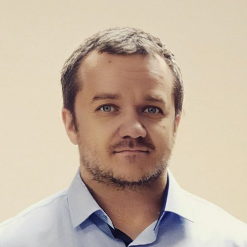

**Middle C# Developer**

  

**Морозов Дмитрий Анатольевич**

**Hard skills**

**Language:** C#

**Frameworks:** .NET, ASP.NET Core

**DB:** MS SQL, PostgreSQL, Oracle

**CI/CD:** Team Foundation Server (TFS), GitLab, СФЕРА(Т1), Jenkins

**Containers:** Docker, Kubernetes (Helm)

**Message brokers:** Kaffka, RabbitMQ

**Testing:** xUnit, MSTest, Moq, Selenium

**API documentation:** Swagger/OpenAPI, 

**ORM & Data Access:** Entity Framework, Dapper, linq2db

**Other technologies:** JavaScript, TypeScript, HTML, VB, ANTLR, Grafana, Telegraf, Serilog, Kibana, ElasticSearch, Redis, IOT

**Version Control & Task Tracking:** Git, TFS, Jira, GitLab

**Soft skills**

- **Лидерство и менторинг:** Проведение код-ревью, обучение и поддержка коллег, улучшение архитектуры и процессов разработки.
- **Командная работа:** Эффективное взаимодействие в рамках Agile-подходов (Scrum, канбан), регулярное участие в планировании и статус-встречах.
- **Коммуникабельность:** Четкое донесение информации, проведение ревью, взаимодействие с командами и стейкхолдерами.
- **Проактивность и инициатива:** Предложение и внедрение улучшений, оптимизация процессов, миграция и модернизация legacy-систем.
- **Адаптивность и гибкость:** Быстрое освоение новых технологий, переход между бизнес-доменами (энергетика, IT, госсектор, банковское дело, системы обзвона).

**Ключевые проекты**

---

**Проект:** ВТБ - система отчетности и интеграций для корпоративных клиентов  
**Роль:** .NET-разработчик  
**Задачи:**
- Разработка сервисов отчетности и интеграций.
- Миграция с Oracle на PostgreSQL.
- Обновление .NET-решений исправление багов, оптимизация производительности.
- Настройка CI/CD на HELM, автоматизация сборки, тестирования и деплоя.
- Работа с Docker, Kubernetes.
- Разработка и оптимизация SQL-запросов.

**Достижения:**  
Универсальный сервис отчетности для корпоративных клиентов ВТБ, позволяющий формировать отчеты по различным продуктам банка.
Исправление ошибок в ключевых сервисах работы с БД.

**Команда:**  
5 Dev, 2 DevOps, 3 Testers, 2 Analicts, 1 TeamLead, 1 Product Owner

**Инструменты и технологии:** C#, .NET 6+, PostgreSQL, Oracle, Docker, Kubernetes, Helm, СФЕРА(Jenkins), GitLab, TypeScript, JavaScript, Dapper, EF, ELK Stack  
**Период и длительность:** Октябрь 2023 — Июнь 2025

---

**Проект:** CTI - колл-центр  
**Роль:** Инженер-программист  
**Задачи:**
- Разработка многопоточного сервера для системы обзвона (колл-центр).
- Написание тестов (NUnit), ревью кода.
- Оптимизация БД, исправление deadlock, доработка отчетов.
- Работа с Grafana, Telegraf.

**Достижения:**  
Улучшение UI, внедрение отслеживания выполнения SQL(Extended Events). Внедрение новых версий MSSQL.
Исправление в Grafana модуля работы с MSSQl Server для корректного сбора метрик.

**Команда:**  
3 Dev, 2 Tester, 1 Product Owner

**Инструменты и технологии:** C#, NUnit, Git, Jira, Grafana, Telegraf  
**Период и длительность:** Октябрь 2021 — Октябрь 2023  

---

**Проект:** IT-Energy - система мониторинга и управления энергосетями 
**Роль:** Инженер-программист  
**Задачи:**
- Разработка и модернизация системы учёта электроэнергии: проектирование архитектуры, реализация нового функционала и доработка существующих модулей.
- Проектирование и развитие структуры базы данных, оптимизация запросов и процессов хранения данных.
- Разработка и интеграция модуля работы с формулами с использованием ANTLR для парсинга и вычислений.
- Разработка веб-интерфейсов и бэкенд-логики на ASP.NET и JavaScript.  

**Достижения:**  
Исправление в редакторе формул на ANTRL ошибок парсинга и вычислений, добавление новых функций.

**Команда:**  
4 Dev, 2 Testers, 2 Analitics.  

**Инструменты и технологии:** C#, ASP.NET, JavaScript, ANTLR, MS SQL, Git, GitLab, Jira  
**Период и длительность:** Октябрь 2021 — Март 2023

---

**Проект:** Тюменьэнерго  
**Роль:** Программист  
**Задачи:**
- Разработка платформы для системы учёта электроэнергии с полным циклом функциональности: топология сети, приборы АСКУЭ, сбор показаний, построение балансов, учёт контрагентов и договоров.
- Создание сервисов на WCF для загрузки и обработки данных.
- Разработка модуля синхронизации с системой "Пирамида-Сети".
- Проектирование и реализация структуры базы данных.
- Использование платформы для быстрого развёртывания дополнительных проектов для службы информационной безопасности и диспетчеров.  

**Достижения:**  
Созданная с нуля система учета Э/Э, успешно эксплуатируемая в течение более 10 лет.
Проект для службы информационной безопасности Тюменьэнерго.
Реверсинжениринг стороннего API "Пирамида-Сети", разработка на основе него своего API для интеграции.  

**Команда:**  
4 Dev

**Инструменты и технологии:** C#, WinForms, WPF, MS SQL, WCF, DevExpress  
**Период и длительность:** Август 2009 — Октябрь 2021

---

**Проект:** Энергобаланс  
**Роль:** Программист  
**Задачи:**
- Участие в разработке комплексной системы учёта электроэнергии.
- Реализация бизнес-логики и функциональных модулей системы.  

**Достижения:**  
Внедрение системы учета, настройка MSSql Server  

**Команда:**  
5 Dev, 2 DevOps  

**Инструменты и технологии:** C#, MS SQL  
**Период и длительность:** Март 2008 — Август 2009

---

**Проект:** Контур  
**Роль:** Программист  
**Задачи:**
- Разработка системы учёта жилищно-коммунальных услуг.
- Создание интерфейсов и бизнес-логики приложения.
- Проектирование и реализация структуры базы данных.

**Достижения:**  
Модуль расчета субсидий  

**Команда:**  
4 Dev

**Инструменты и технологии:** VB, MS SQL  
**Период и длительность:** [Март 2007 — Март 2008

---

**Проект:** Инфо-Город  
**Роль:** Программист  
**Задачи:**
- Разработка и генерация отчётов различной сложности.
- Сопровождение и поддержка существующих разработок.
- Устранение ошибок и доработка функциональности.

**Достижения:**  
Автоматизация процесса приема оплаты  

**Команда:**  
5 Dev,1 DevOps  

**Инструменты и технологии:** Pearl, VB, С++, C# MS SQL, Oracle, Access  
**Период и длительность:** Март 2005 — Март 2007

---

**Образование**

- Московский технологический институт, Прикладная математика и информатика (неоконченное, 2022)
- Уральский федеральный университет, Прикладная математика и информатика (2008)

**Владение языками**

Русский, Английский

### Для связи
- e-mail
  - mordman@mail.ru
  - mordmanisone@gmain.com
- Messengers
  - Telegram
    - https://t.me/TheBear_md
