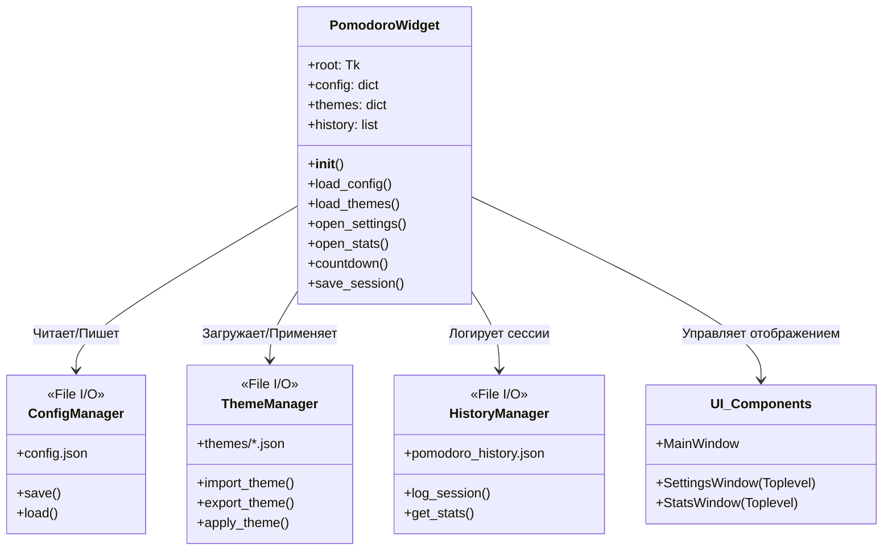

# Pomodoro Timer
    Сделать помодоро таймер с пмощью скриптового языка с запуском из 'коробки'.


# Документация приложения Pomodoro Widget

## 1. Общее описание приложения

**Pomodoro Widget** — это легковесное, настраиваемое приложение-таймер для работы по методике Pomodoro. Оно разработано на Python с использованием библиотеки `tkinter`.

**Ключевая особенность:** Приложение работает как виджет поверх всех окон (Always on Top), не имеет рамок и занимает минимум места на экране, позволяя пользователю сосредоточиться на работе, не теряя из виду таймер.

**Основные возможности:**
*   ⏱ **Таймер:** Циклы работы и отдыха с настраиваемым временем.
*   🎨 **Темы:** Полная кастомизация внешнего вида через JSON-файлы.
*   📊 **Статистика:** Ведение истории сессий с сохранением в файл.
*   ⚙️ **Настройки:** Изменение размера окна, текстов режимов, уведомлений.
*   💾 **Сохранение:** Автоматическое сохранение позиции окна и настроек.

---

## 2. Структура файлов

Приложение использует модульную структуру данных. Все настройки и темы хранятся в отдельных файлах, что позволяет легко редактировать их без изменения кода.

```text
pomodoro/
├── pomodoro.py              # Основной исполняемый скрипт
├── config.json              # Основные настройки приложения
├── pomodoro_history.json    # История завершенных сессий
└── themes/                  # Папка с файлами тем оформления
    ├── dark.json            # Тёмная тема (по умолчанию)
    ├── light.json           # Светлая тема
    ├── blue.json            # Синяя тема
    └── ...                  # Пользовательские темы
```

---

## 3. Архитектурная схема

Ниже представлена схема взаимодействия компонентов приложения.



### Поток данных:
1.  **Запуск:** `pomodoroPy.py` считывает `config.json` и файлы из папки `themes/`.
2.  **Работа:** Таймер отсчитывает время. При переключении режимов данные сохраняются в `pomodoro_history.json`.
3.  **Настройки:** При изменении настроек обновляется `config.json` и применяется тема.
4.  **Закрытие:** Позиция окна и текущее состояние сохраняются автоматически.

---

## 4. Описание кода (Класс `PomodoroWidget`)

Основная логика инкапсулирована в классе `PomodoroWidget`. Вот разбор ключевых методов:

### Инициализация и Конфигурация
*   `__init__(self)`: Создает главное окно, убирает рамки (`overrideredirect`), ставит режим "поверх всех" (`-topmost`). Загружает конфиг и темы.
*   `load_config()`: Читает `config.json`. Если файла нет, создает с настройками по умолчанию.
*   `load_themes()`: Сканирует папку `themes/`, загружает все `.json` файлы в словарь `self.themes`.
*   `apply_theme(theme_key)`: Динамически меняет цвета и шрифты всех виджетов на основе выбранной темы.

### Логика Таймера
*   `countdown()`: Рекурсивный метод, уменьшающий `self.current_time` каждую секунду.
*   `switch_mode()`: Переключает между режимом работы и отдыха. Сохраняет завершенную сессию в историю. Издает звук (если включено).
*   `start_pause()`: Обработчик клика по таймеру (Старт / Пауза).
*   `reset_timer()`: Сброс таймера в начальное состояние (Правый клик мыши).

### Интерфейс и Окна
*   `open_settings()`: Создает всплывающее окно (`Toplevel`) с настройками.
    *   *Особенность:* Не имеет прокрутки, размер подстраивается автоматически.
    *   Позволяет менять время, размер окна, тексты режимов, выбирать тему.
*   `open_stats()`: Создает всплывающее окно со статистикой.
    *   *Особенность:* Использует текстовое поле (`Text`) с прокруткой для отображения истории.
*   `move_window()`: Реализует перетаскивание окна за любую свободную область.

### Работа с данными
*   `save_session()`: Записывает дату, тип сессии и длительность в `self.history`.
*   `save_history()`: Сериализует историю в `pomodoro_history.json`.
*   `save_position()`: Сохраняет координаты и размер главного окна в конфиг при перемещении или закрытии.
*   `import_theme()` / `export_theme()`: Функции для обмена файлами тем.

---

## 5. Функциональные возможности

### 1. Управление таймером
| Действие | Управление |
|----------|------------|
| Старт / Пауза | Левый клик по таймеру |
| Сброс | Правый клик мыши |
| Перемещение окна | Зажать левую кнопку и тянуть |
| Закрытие | Двойной клик или кнопка ✕ |

### 2. Настройки (Окно ⚙️)
*   **Время:** Установка минут для работы и отдыха.
*   **Размер окна:** Ширина и высота главного виджета (пиксели).
*   **Тексты:** Возможность переименовать "WORK" и "BREAK" (например, "ФОКУС" / "ОТДЫХ").
*   **Темы:** Выпадающий список со всеми доступными темами.
*   **Управление темами:** Кнопки Импорт 📥, Экспорт 📤, Удаление 🗑️.
*   **Опции:** Звуковые уведомления, Автозапуск перерыва.

### 3. Статистика (Окно 📊)
*   Общая сводка (всего сессий, всего времени работы/отдыха).
*   Список последних 10 сессий с датой и временем.
*   Кнопка полной очистки истории.
*   Текстовое поле с прокруткой (удобно для длинных списков).

### 4. Система тем
Темы хранятся в формате JSON. Пример структуры `themes/custom.json`:
```json
{
    "name": "Моя Тема",
    "bg_primary": "#121212",      // Фон главного окна
    "bg_secondary": "#1e1e1e",    // Фон окон настроек
    "fg_accent": "#00ff88",       // Цвет таймера (работа)
    "fg_break": "#00ccff",        // Цвет таймера (отдых)
    "font_time": ["Consolas", 32, "bold"] // Шрифт таймера
    // ... остальные цвета
}
```

---

## 6. Конфигурационный файл (`config.json`)

Файл автоматически создается при первом запуске. Основные параметры:

| Параметр | Тип | Описание |
|----------|-----|----------|
| `work_time_minutes` | int | Длительность работы в минутах |
| `break_time_minutes` | int | Длительность отдыха в минутах |
| `window_width` | int | Ширина виджета |
| `window_height` | int | Высота виджета |
| `window_position_x` | int | Координата X на экране |
| `window_position_y` | int | Координата Y на экране |
| `theme` | str | Ключ активной темы (имя файла без .json) |
| `work_text` | str | Надпись в режиме работы |
| `break_text` | str | Надпись в режиме отдыха |
| `show_notifications` | bool | Включить ли звуковой сигнал |
| `auto_start_break` | bool | Автоматически запускать ли таймер после переключения |

---

## 7. Инструкция по запуску

### Требования
*   Python 3.6 или выше.
*   Установленные стандартные библиотеки (`tkinter`, `json`, `os`, `datetime` — входят в поставку Python).

### Запуск
1.  Создайте папку для проекта.
2.  Сохраните код в файл `pomodoroPy.py`.
3.  Откройте терминал в этой папке.
4.  Запустите команду:
    ```bash
    python pomodoroPy.py
    ```
5.  При первом запуске автоматически создадутся файлы `config.json` и папка `themes/` с базовыми темами.

### Добавление своей темы
1.  Скопируйте любой файл из папки `themes/` (например, `dark.json`).
2.  Переименуйте его (например, `my_cyberpunk.json`).
3.  Откройте его в текстовом редакторе и измените HEX-коды цветов.
4.  Перезапустите приложение или откройте Настройки — новая тема появится в списке.

---

## 8. Преимущества решения

1.  **Портативность:** Не требует установки, работает с флешки.
2.  **Независимость:** Не использует сторонних библиотек (только стандартный Python).
3.  **Гибкость:** Полная смена внешнего вида без перекомпиляции.
4.  **Приватность:** Вся история хранится локально в текстовых файлах.
5.  **Эргономика:** Окно не мешает работе, но всегда на виду. Нет лишней анимации, нагружающей систему.

Это приложение является готовым инструментом для повышения продуктивности, который можно легко адаптировать под любые визуальные предпочтения.