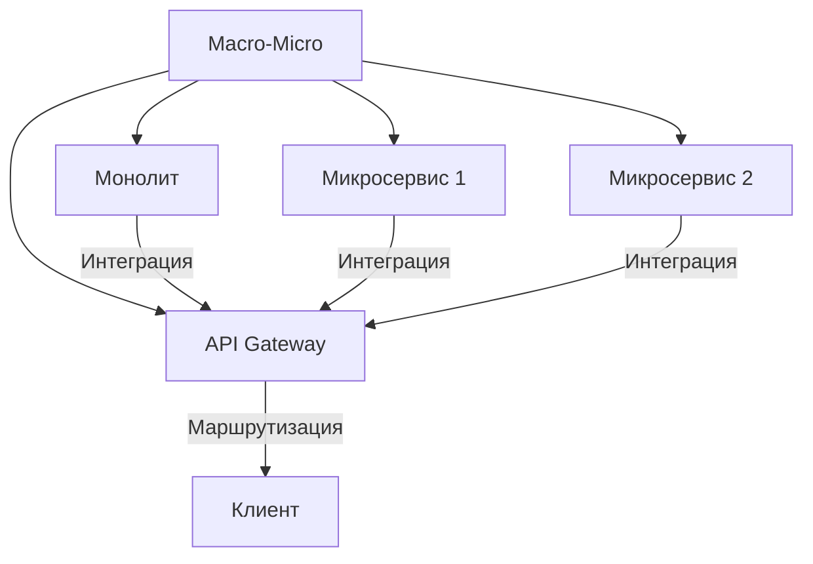
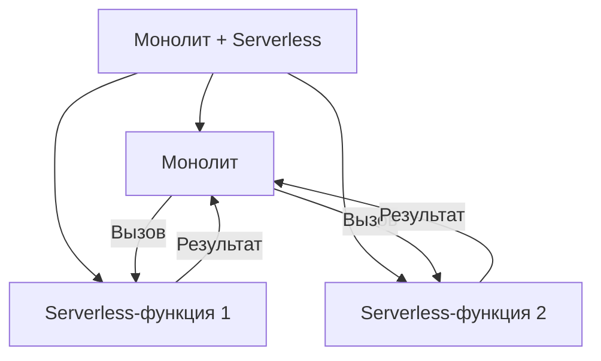
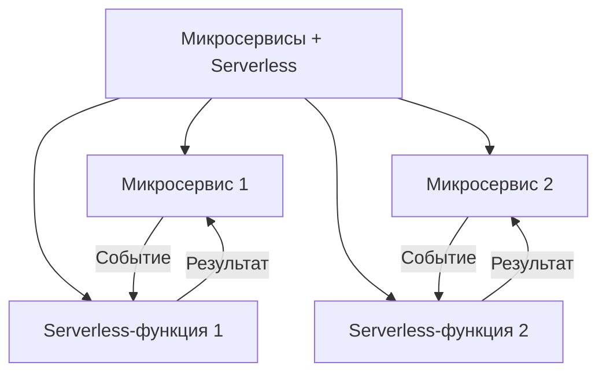
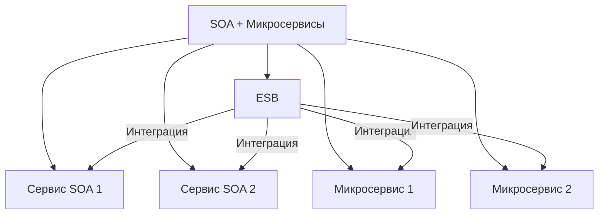
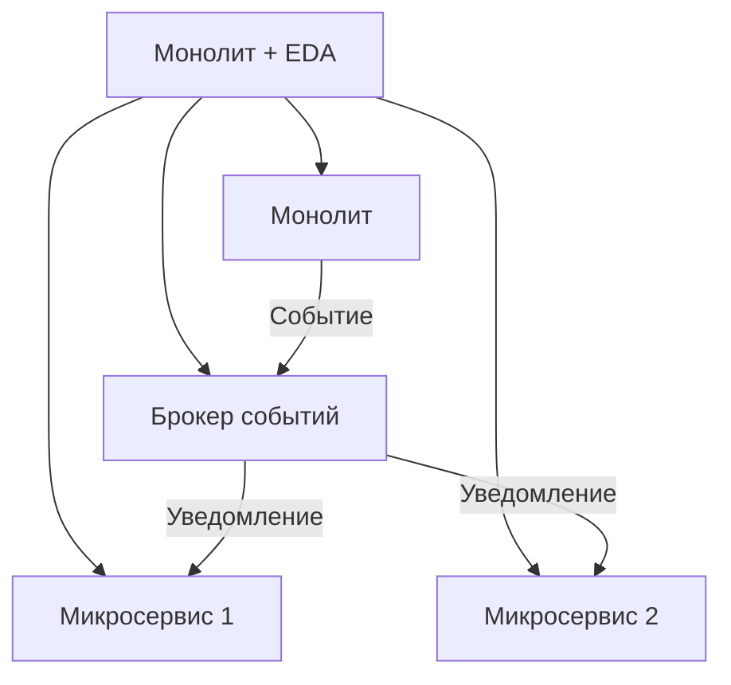

## **10. Гибридные архитектуры**

### **Описание**
Гибридные архитектуры объединяют **различные архитектурные стили** в одной системе. Например, часть системы может быть монолитной, а новая функциональность — реализована в виде микросервисов или serverless-функций. Это позволяет постепенно модернизировать систему, не отказываясь от существующей инфраструктуры.

---

## **Подстили и шаблоны гибридных архитектур**

---

### **10.1. Macro-Micro (Монолит + Микросервисы)**
#### **Описание**
Часть системы остаётся **монолитной**, а новая функциональность реализуется в виде **микросервисов**. Это позволяет постепенно переходить к микросервисной архитектуре, не переписывая всю систему.



#### **Преимущества**
- Постепенный переход к микросервисам.
- Возможность использовать существующую инфраструктуру.

#### **Недостатки**
- Сложность интеграции между монолитом и микросервисами.
- Потенциальные проблемы с согласованностью данных.

#### **Пример**
- Старая ERP-система (монолит) + новые микросервисы для мобильного приложения.

---

### **10.2. Монолит с Serverless-функциями**
#### **Описание**
Основная часть системы остаётся монолитной, но для обработки **пиковых нагрузок** или **специфических задач** используются **serverless-функции**.



#### **Преимущества**
- Возможность масштабировать только нужные части системы.
- Снижение нагрузки на монолит.

#### **Недостатки**
- Сложность интеграции между монолитом и serverless-функциями.
- Потенциальные задержки при вызове функций.

#### **Пример**
- Монолитное приложение вызывает **AWS Lambda** для обработки больших файлов или генерации отчётов.

---

### **10.3. Микросервисы с Serverless-функциями**
#### **Описание**
Микросервисы используют **serverless-функции** для выполнения специфических задач, таких как обработка событий, фоновые задачи или интеграция с внешними сервисами.



#### **Преимущества**
- Гибкость и масштабируемость.
- Возможность использовать serverless-функции для специфических задач.

#### **Недостатки**
- Сложность управления и мониторинга.
- Потенциальные задержки при вызове функций.

#### **Пример**
- Микросервис "Заказы" вызывает **AWS Lambda** для отправки уведомлений по email.

---

### **10.4. SOA + Микросервисы**
#### **Описание**
Часть системы реализована в стиле **SOA** (с использованием ESB), а новая функциональность — в виде **микросервисов**. Это позволяет постепенно переходить от SOA к микросервисам.



#### **Преимущества**
- Постепенный переход от SOA к микросервисам.
- Возможность использовать существующую инфраструктуру.

#### **Недостатки**
- Сложность интеграции между SOA и микросервисами.
- Потенциальные проблемы с согласованностью данных.

#### **Пример**
- Корпоративная система на базе **SOA** с новыми микросервисами для мобильных приложений.

---

### **10.5. Монолит с Event-Driven Architecture**
#### **Описание**
Монолитное приложение интегрируется с **Event-Driven Architecture**, где события используются для асинхронного взаимодействия с другими системами или микросервисами.



#### **Преимущества**
- Возможность асинхронного взаимодействия.
- Улучшение масштабируемости и отказоустойчивости.

#### **Недостатки**
- Сложность интеграции между монолитом и брокером событий.
- Потенциальные проблемы с согласованностью данных.

#### **Пример**
- Монолитное приложение отправляет события в **Kafka**, на которые реагируют микросервисы.

---

## **Пример реализации на C# (Macro-Micro)**
```csharp
// Пример интеграции монолита с микросервисом через API Gateway

// Монолитный сервис
public class MonolithOrderService
{
    private readonly HttpClient _httpClient;

    public MonolithOrderService(HttpClient httpClient)
    {
        _httpClient = httpClient;
        _httpClient.BaseAddress = new Uri("https://api-gateway.example.com");
    }

    public async Task<Order> GetOrderAsync(int orderId)
    {
        // Если заказ новый, запрашиваем его из микросервиса
        if (orderId > 10000)
        {
            var response = await _httpClient.GetAsync($"/microservice/orders/{orderId}");
            response.EnsureSuccessStatusCode();
            return await response.Content.ReadAsAsync<Order>();
        }
        // Иначе используем монолитную логику
        else
        {
            return GetOrderFromMonolith(orderId);
        }
    }

    private Order GetOrderFromMonolith(int orderId)
    {
        // Логика монолита
        return new Order { Id = orderId, Status = "Completed" };
    }
}
```

---

## **Когда использовать гибридные архитектуры?**
- Для **постепенной модернизации** существующих систем.
- Если нужно **интегрировать новые технологии** (микросервисы, serverless) в существующую инфраструктуру.
- Для **оптимизации затрат** и **масштабируемости** отдельных частей системы.