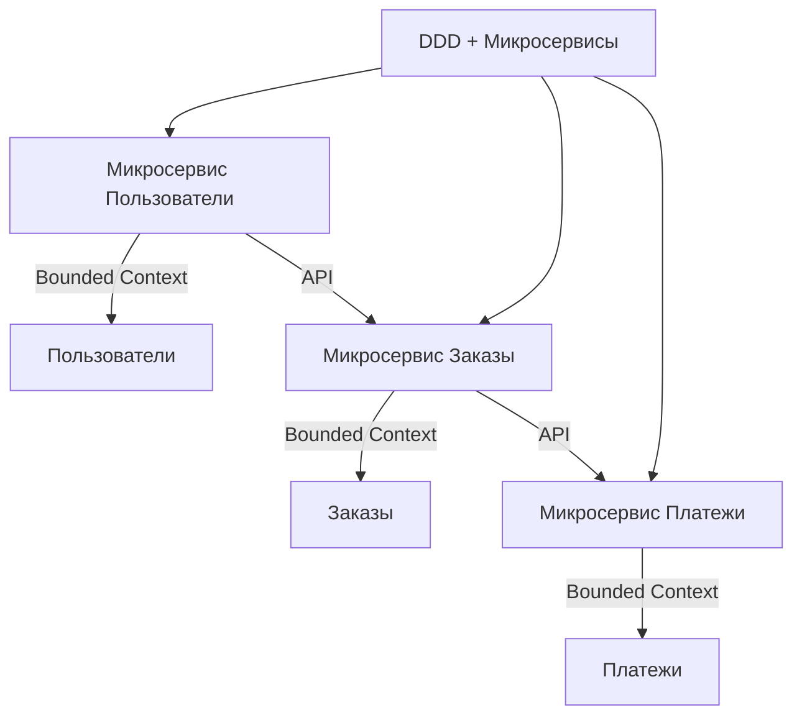
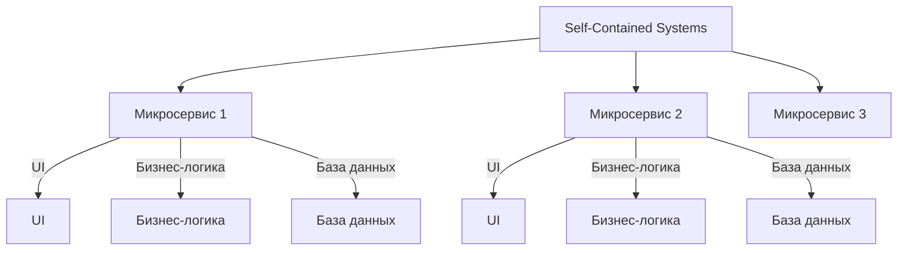
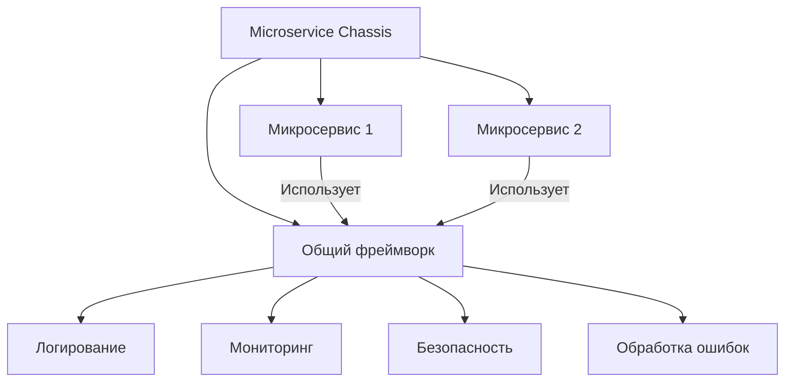
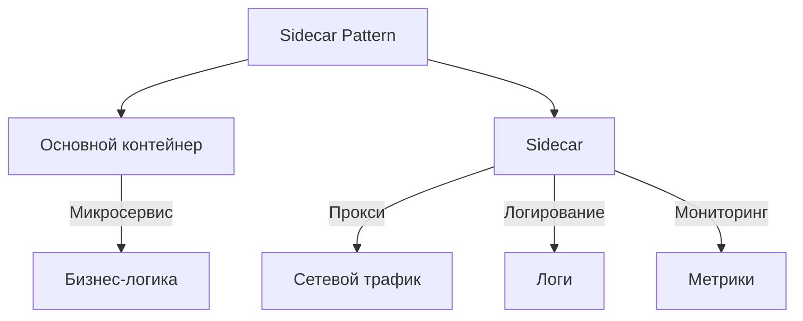
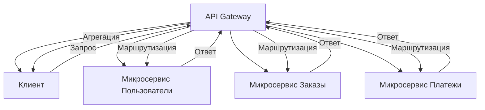
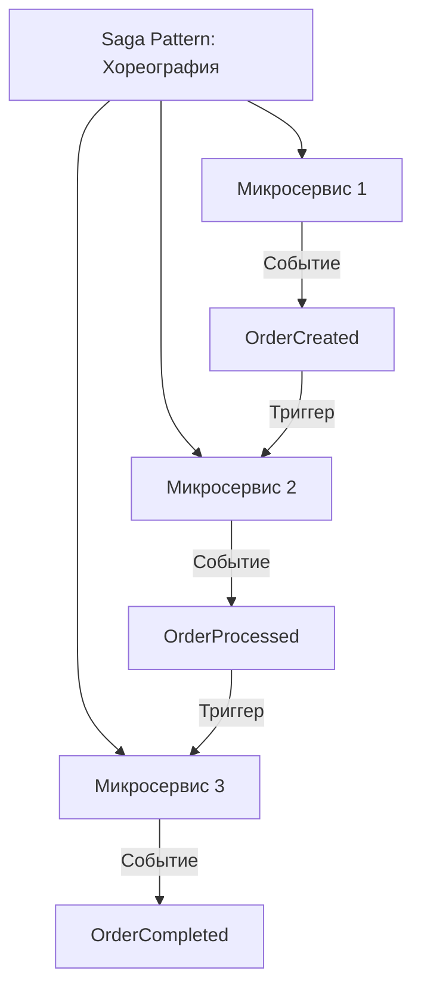
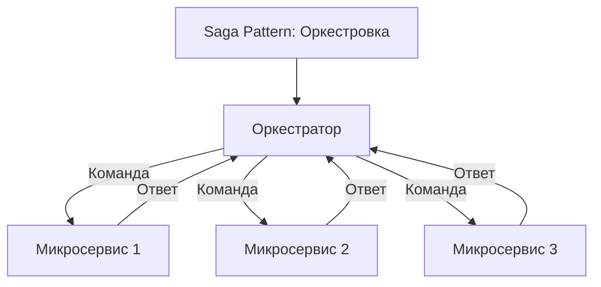
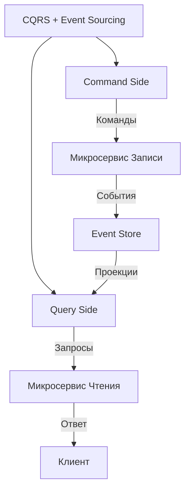

## **2. Микросервисная архитектура (Microservices Architecture)**

### **Описание**
Микросервисная архитектура предполагает разбиение приложения на **небольшие независимые сервисы**, каждый из которых отвечает за свою бизнес-функцию. Сервисы взаимодействуют между собой через **API** (например, REST, gRPC) или **сообщения** (например, Kafka, RabbitMQ). Каждый сервис может быть развёрнут, масштабирован и обновлён независимо от других.

---

## **Подстили и шаблоны**

---

### **2.1. Domain-Driven Design (DDD) + Микросервисы**
#### **Описание**
Микросервисы выстраиваются вокруг **ограниченных контекстов** (Bounded Contexts) из Domain-Driven Design. Каждый микросервис соответствует одному ограниченному контексту и отвечает за свою часть бизнес-логики.



#### **Преимущества**
- Чёткое разделение ответственности между сервисами.
- Легче поддерживать и развивать каждый сервис независимо.

#### **Пример**
- **Микросервис "Пользователи"**: Управляет регистрацией, аутентификацией и профилями пользователей.
- **Микросервис "Заказы"**: Управляет созданием, обработкой и статусами заказов.

---

### **2.2. Self-Contained Systems (SCS)**
#### **Описание**
Каждый микросервис — это **полностью автономная система** с собственным UI, бизнес-логикой и базой данных. Такой подход позволяет разрабатывать и развёртывать сервисы независимо, но может приводить к дублированию кода (например, UI для каждого сервиса).



#### **Преимущества**
- Полная автономность каждого сервиса.
- Возможность использовать разные технологии для каждого сервиса.

#### **Недостатки**
- Дублирование кода (например, UI, общие библиотеки).
- Сложность поддержки нескольких UI.

---

### **2.3. Microservice Chassis**
#### **Описание**
Шаблон для стандартизации **инфраструктурных задач** (логирование, мониторинг, безопасность, обработка ошибок) во всех микросервисах. Позволяет избежать дублирования кода и упрощает поддержку.



#### **Пример**
- Использование **Spring Cloud** для Java-микросервисов.
- Использование **Istio** для управления сетевым трафиком и безопасности.

---

### **2.4. Sidecar Pattern**
#### **Описание**
Дополнительный контейнер (**sidecar**) развёртывается рядом с основным контейнером микросервиса для выполнения вспомогательных задач (например, проксирование запросов, логирование, мониторинг).



#### **Преимущества**
- Разделение ответственности между основным контейнером и sidecar.
- Возможность добавлять функциональность без изменения основного сервиса.

#### **Пример**
- **Envoy** как sidecar для управления сетевым трафиком.
- **Fluentd** для сбора и обработки логов.

---

### **2.5. API Gateway**
#### **Описание**
Единая точка входа для клиентов, которая **маршрутизирует запросы** к разным микросервисам, агрегирует ответы и обрабатывает кросс-катинговые задачи (аутентификация, кеширование, балансировка нагрузки).



#### **Преимущества**
- Централизованное управление запросами.
- Возможность агрегировать данные из нескольких сервисов.

#### **Пример**
- **Kong**, **Apigee**, **AWS API Gateway**.

---

### **2.6. Saga Pattern**
#### **Описание**
Управление **распределёнными транзакциями** между микросервисами через цепочку локальных транзакций и компенсирующих операций. Используется, когда необходимо обеспечить согласованность данных в распределённой системе.

#### **Типы саг**
1. **Хореография**: Сервисы общаются через события (например, Kafka).
2. **Оркестровка**: Центральный оркестратор управляет процессом.

#### **(Хореография)**


#### **(Оркестровка)**


#### **Преимущества**
- Обеспечивает согласованность данных в распределённой системе.
- Позволяет откатывать транзакции при ошибках.

#### **Пример**
- Оформление заказа, где необходимо обновить данные в сервисах "Заказы", "Склад" и "Платежи".

---

### **2.7. CQRS + Event Sourcing**
#### **Описание**
- **CQRS** (Command Query Responsibility Segregation): Разделение операций чтения (Query) и записи (Command).
- **Event Sourcing**: Хранение всех изменений состояния как последовательности событий.



#### **Преимущества**
- Оптимизация производительности для чтения и записи.
- Возможность восстановить состояние системы на любой момент времени.

#### **Пример**
- Хранение истории заказов как событий (`OrderCreated`, `OrderPaid`, `OrderShipped`).

---

## **Пример реализации на C# (API Gateway + Microservices)**
```csharp
// Пример клиента, взаимодействующего с API Gateway
public class OrderClient
{
    private readonly HttpClient _httpClient;

    public OrderClient(HttpClient httpClient)
    {
        _httpClient = httpClient;
        _httpClient.BaseAddress = new Uri("https://api-gateway.example.com");
    }

    public async Task<Order> GetOrderAsync(int orderId)
    {
        var response = await _httpClient.GetAsync($"/orders/{orderId}");
        response.EnsureSuccessStatusCode();
        return await response.Content.ReadAsAsync<Order>();
    }
}
```

---

## **Когда использовать микросервисы?**
- Для **крупных распределённых систем** с независимыми командами.
- Когда требуется **гибкость** в разработке, развёртывании и масштабировании.
- Если бизнес-функции **чётко разделены** и могут развиваться независимо.