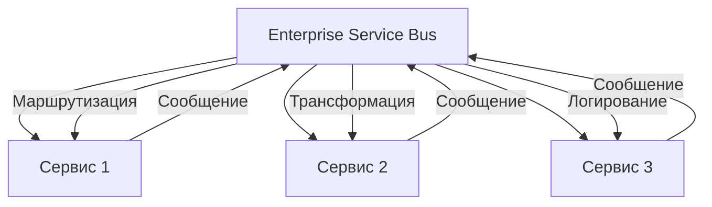
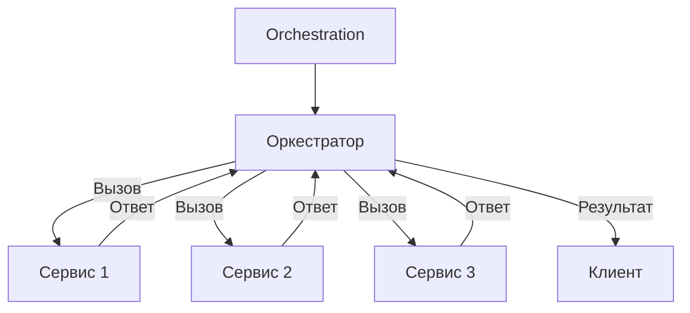
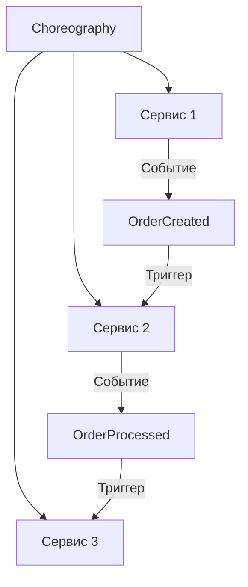
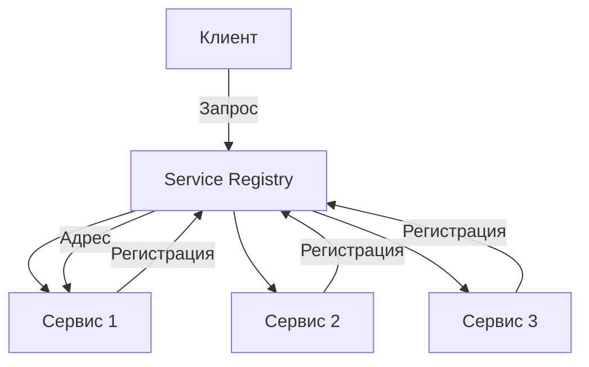
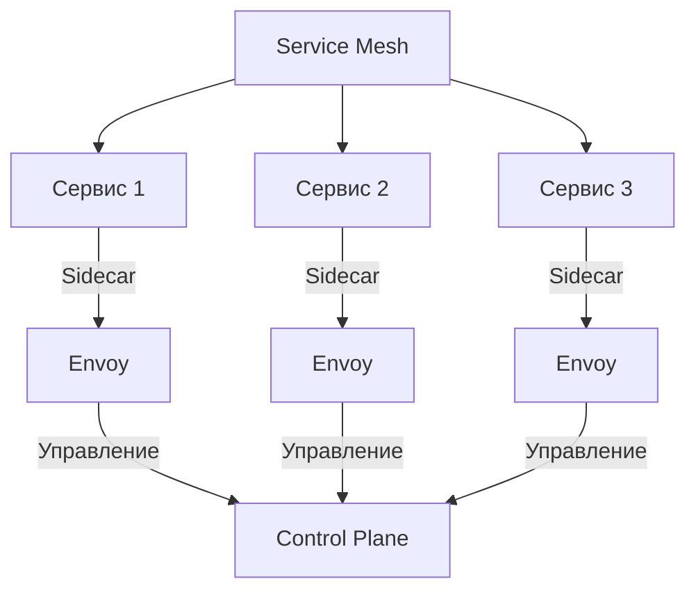

## **3. Сервис-ориентированная архитектура (SOA, Service-Oriented Architecture)**

### **Описание**
SOA — это архитектурный стиль, при котором приложение состоит из **сервисов**, взаимодействующих друг с другом через **стандартизированные интерфейсы** (обычно с использованием протоколов, таких как SOAP, REST или очередей сообщений). SOA фокусируется на **повторном использовании сервисов** и их интеграции через **шину сервисов (ESB, Enterprise Service Bus)**.

---

## **Подстили и шаблоны**

---

### **3.1. Enterprise Service Bus (ESB)**
#### **Описание**
**ESB** — это центральная шина, которая обеспечивает **интеграцию, маршрутизацию, трансформацию и управление сообщениями** между сервисами. ESB позволяет сервисам взаимодействовать друг с другом без прямой зависимости.



#### **Преимущества**
- Централизованное управление интеграцией сервисов.
- Возможность трансформации сообщений между разными протоколами и форматами.
- Поддержка **асинхронного взаимодействия** и обработки ошибок.

#### **Недостатки**
- Высокая сложность настройки и поддержки ESB.
- Возможное "узкое место" (bottleneck) при высокой нагрузке.

#### **Пример**
- **Mule ESB**, **Apache Camel**, **WSO2 ESB**.

---

### **3.2. Orchestration (Оркестрация)**
#### **Описание**
В оркестрации **центральный оркестратор** управляет потоком выполнения бизнес-процессов, вызывая сервисы в нужной последовательности и обрабатывая результаты.



#### **Преимущества**
- Централизованное управление бизнес-процессами.
- Возможность сложной логики взаимодействия сервисов.

#### **Недостатки**
- Оркестратор может стать "узким местом".
- Сложность поддержки и масштабирования оркестратора.

#### **Пример**
- **BPMN (Business Process Model and Notation)** для описания бизнес-процессов.
- **Apache ODE**, **Camunda**.

---

### **3.3. Choreography (Хореография)**
#### **Описание**
В хореографии сервисы **взаимодействуют напрямую** через события, без центрального оркестратора. Каждый сервис знает, какие события он должен отправлять и на какие события реагировать.



#### **Преимущества**
- Нет центрального "узкого места".
- Гибкость и масштабируемость.

#### **Недостатки**
- Сложность отладки и обеспечения согласованности.
- Сервисы должны знать о событиях, на которые они реагируют.

#### **Пример**
- **Kafka**, **RabbitMQ** для обмена событиями между сервисами.

---

### **3.4. Service Registry and Discovery**
#### **Описание**
**Реестр сервисов** позволяет сервисам **регистрироваться** и **обнаруживать** друг друга динамически. Клиенты могут находить сервисы по имени или типу без жёстко закодированных адресов.



#### **Преимущества**
- Динамическое обнаружение сервисов.
- Упрощение масштабирования и развёртывания.

#### **Недостатки**
- Дополнительная сложность из-за необходимости поддерживать реестр.
- Возможные проблемы с согласованностью при изменении адресов сервисов.

#### **Пример**
- **Consul**, **Eureka**, **Zookeeper**.

---

### **3.5. Service Mesh**
#### **Описание**
**Service Mesh** — это инфраструктурный слой, который управляет **сетевым взаимодействием** между сервисами (например, балансировка нагрузки, шифрование, мониторинг). Обычно реализуется с помощью **sidecar-прокси** (например, Envoy).



#### **Преимущества**
- Централизованное управление сетевым трафиком.
- Возможность мониторинга, логирования и обеспечения безопасности без изменения кода сервисов.

#### **Недостатки**
- Дополнительные накладные расходы на проксирование.
- Сложность настройки и поддержки.

#### **Пример**
- **Istio**, **Linkerd**, **Consul Connect**.

---

## **Пример реализации на C# (SOAP-сервис)**
```csharp
// Пример SOAP-сервиса на C#
[ServiceContract]
public interface IOrderService
{
    [OperationContract]
    Order GetOrder(int orderId);

    [OperationContract]
    void CreateOrder(Order order);
}

// Реализация сервиса
public class OrderService : IOrderService
{
    public Order GetOrder(int orderId)
    {
        // Логика получения заказа
        return new Order { Id = orderId, Status = "Completed" };
    }

    public void CreateOrder(Order order)
    {
        // Логика создания заказа
    }
}
```

---

## **Когда использовать SOA?**
- Для **крупных корпоративных систем**, где важна интеграция и повторное использование сервисов.
- Когда требуется **централизованное управление бизнес-процессами** (оркестрация).
- Если необходимо **интегрировать унаследованные системы** с новыми сервисами.