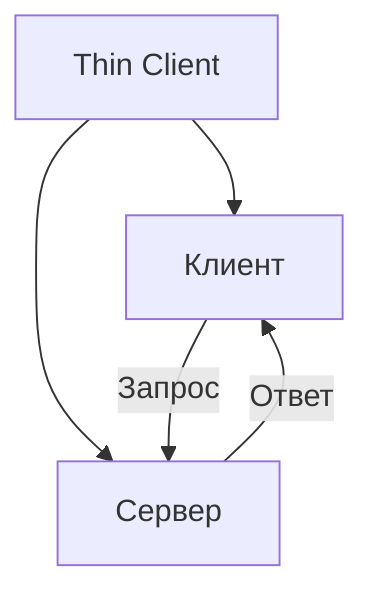
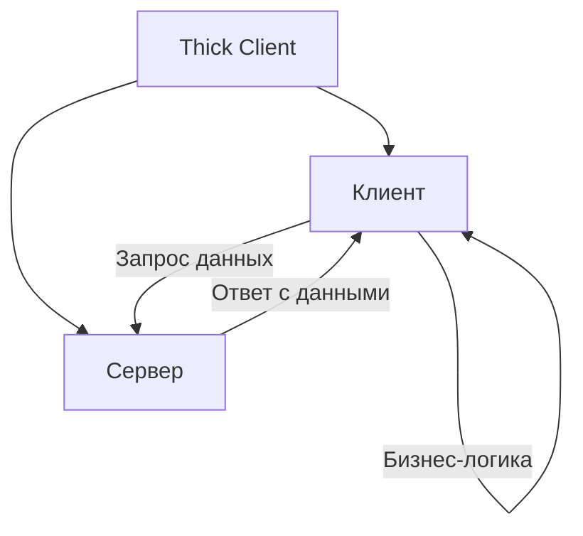
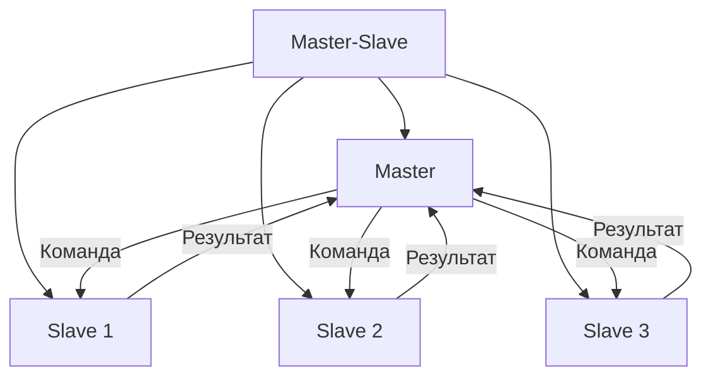
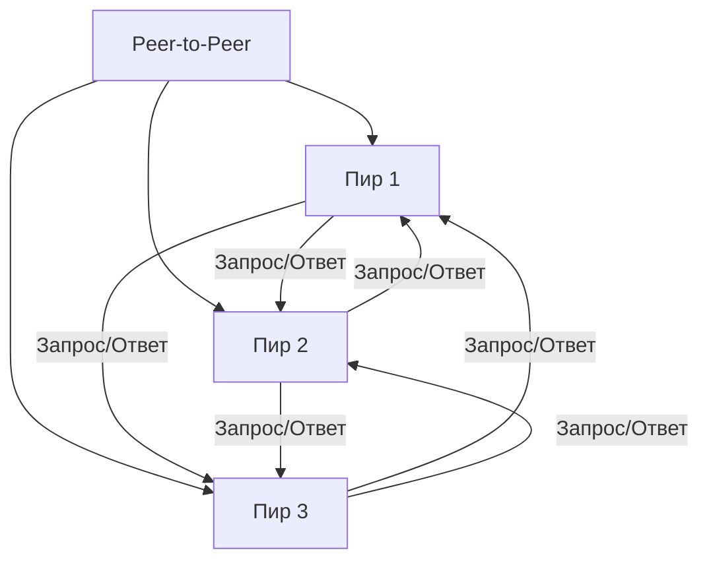
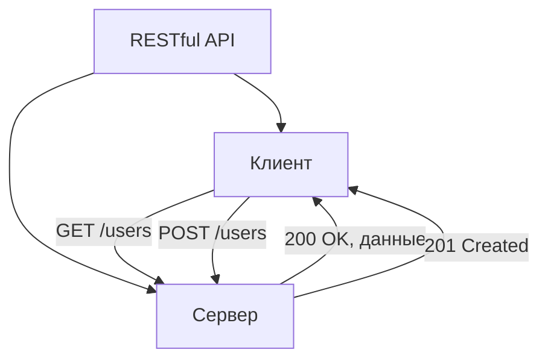
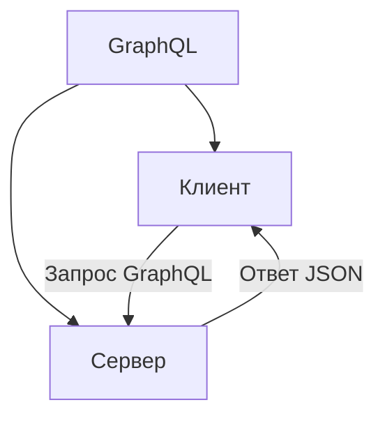

## **6. Клиент-серверная архитектура (Client-Server Architecture)**

### **Описание**
Клиент-серверная архитектура предполагает разделение системы на два основных компонента:
- **Клиент** — отвечает за взаимодействие с пользователем (например, браузер, мобильное приложение, десктопное приложение).
- **Сервер** — обрабатывает запросы от клиентов, выполняет бизнес-логику и возвращает результаты.

---

## **Подстили и шаблоны**

---

### **6.1. Thin Client (Тонкий клиент)**
#### **Описание**
Клиент выполняет **минимум логики** (например, только отображение интерфейса), а основная нагрузка ложится на сервер. Такой подход упрощает обновление и поддержку клиентской части.



#### **Преимущества**
- Простота клиентской части.
- Централизованное управление логикой на сервере.
- Легкость обновления серверной части без изменения клиентов.

#### **Недостатки**
- Высокая нагрузка на сервер.
- Зависимость клиентов от доступности сервера.

#### **Пример**
- Веб-приложения на **React** или **Angular**, где логика реализована на сервере (например, **ASP.NET Core**, **Node.js**).

---

### **6.2. Thick Client (Толстый клиент)**
#### **Описание**
Клиент выполняет **значительную часть бизнес-логики**, а сервер используется в основном для хранения данных или выполнения сложных операций.



#### **Преимущества**
- Снижение нагрузки на сервер.
- Возможность работы клиента в офлайн-режиме (с последующей синхронизацией).

#### **Недостатки**
- Сложность обновления клиентской части.
- Потенциальные проблемы с согласованностью данных между клиентами.

#### **Пример**
- Десктопные приложения (например, **1С:Предприятие**, **Microsoft Office**).
- Мобильные приложения с локальной бизнес-логикой.

---

### **6.3. Master-Slave**
#### **Описание**
Один сервер (**master**) управляет несколькими подчинёнными серверами (**slave**), которые выполняют задачи. Slave-серверы могут быть ответственны за обработку данных, хранение или выполнение специфических операций.



#### **Преимущества**
- Возможность распределения нагрузки между slave-серверами.
- Централизованное управление задачами.

#### **Недостатки**
- Master-сервер может стать "узким местом".
- Сложность обеспечения согласованности данных между slave-серверами.

#### **Пример**
- Репликация баз данных (например, **master-slave репликация в MySQL**).
- Распределённые системы обработки данных (например, **Hadoop**).

---

### **6.4. Peer-to-Peer (P2P)**
#### **Описание**
В P2P-архитектуре все узлы (**пиры**) равноправны и могут выступать как в роли клиента, так и в роли сервера. Узлы взаимодействуют напрямую друг с другом без центрального сервера.



#### **Преимущества**
- Отсутствие центрального "узкого места".
- Высокая отказоустойчивость (система продолжает работать даже при отказе части узлов).

#### **Недостатки**
- Сложность управления и обеспечения безопасности.
- Потенциальные проблемы с согласованностью данных.

#### **Пример**
- Файлообменные сети (**BitTorrent**).
- Блокчейн-системы (**Bitcoin**, **Ethereum**).

---

### **6.5. RESTful API**
#### **Описание**
Клиенты взаимодействуют с сервером через **RESTful API** — стандартный способ обмена данными по протоколу HTTP. Сервер предоставляет ресурсы, а клиенты отправляют запросы (GET, POST, PUT, DELETE) для работы с этими ресурсами.



#### **Преимущества**
- Стандартизированный подход к взаимодействию.
- Простота интеграции с различными клиентами (веб, мобильные, IoT).

#### **Недостатки**
- Ограниченные возможности для сложных бизнес-процессов.
- Потенциальные проблемы с производительностью при большом количестве запросов.

#### **Пример**
- API для социальных сетей (**Twitter API**, **Facebook Graph API**).
- Облачные сервисы (**AWS API**, **Google Cloud API**).

---

### **6.6. GraphQL**
#### **Описание**
Клиенты отправляют **запросы в формате GraphQL**, который позволяет получать только необходимые данные в одном запросе. Сервер обрабатывает запрос и возвращает структурированный ответ.



#### **Преимущества**
- Возможность получать только необходимые данные.
- Уменьшение количества запросов к серверу.

#### **Недостатки**
- Сложность настройки и поддержки сервера GraphQL.
- Потенциальные проблемы с производительностью при сложных запросах.

#### **Пример**
- API для мобильных приложений (**GitHub API**, **Shopify API**).

---

## **Пример реализации на C# (RESTful API)**
```csharp
// Пример контроллера RESTful API на ASP.NET Core
[ApiController]
[Route("api/[controller]")]
public class UsersController : ControllerBase
{
    private readonly IUserService _userService;

    public UsersController(IUserService userService)
    {
        _userService = userService;
    }

    // GET /api/users/{id}
    [HttpGet("{id}")]
    public IActionResult GetUser(int id)
    {
        var user = _userService.GetUser(id);
        if (user == null)
        {
            return NotFound();
        }
        return Ok(user);
    }

    // POST /api/users
    [HttpPost]
    public IActionResult CreateUser([FromBody] User user)
    {
        _userService.CreateUser(user);
        return CreatedAtAction(nameof(GetUser), new { id = user.Id }, user);
    }
}

// Пример сервиса
public class UserService : IUserService
{
    private readonly IUserRepository _userRepository;

    public UserService(IUserRepository userRepository)
    {
        _userRepository = userRepository;
    }

    public User GetUser(int id)
    {
        return _userRepository.GetById(id);
    }

    public void CreateUser(User user)
    {
        _userRepository.Add(user);
    }
}
```

---

## **Когда использовать клиент-серверную архитектуру?**
- Для **веб-приложений**, где клиентская часть реализована в браузере (например, **React**, **Angular**).
- В **мобильных приложениях**, где логика обработки данных находится на сервере.
- Для **корпоративных систем**, где важна централизация управления данными и логикой.