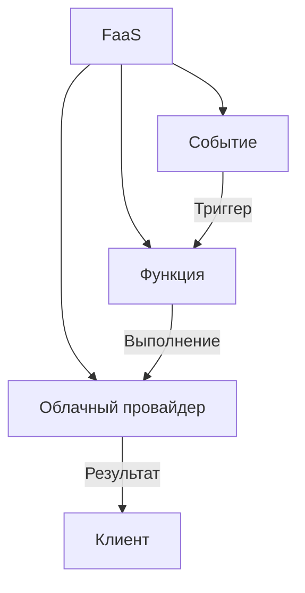
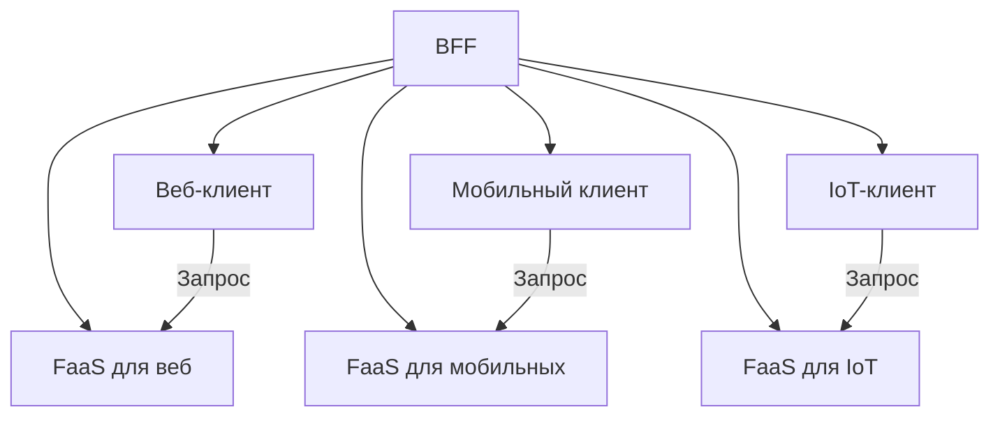
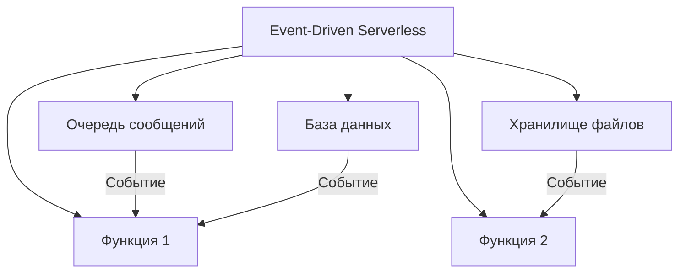
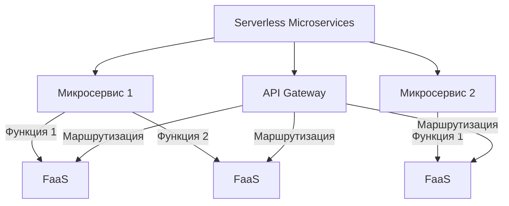
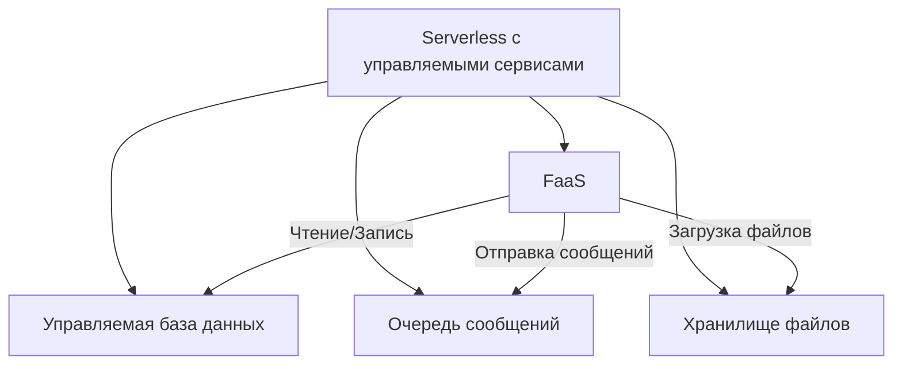

## **9. Serverless-архитектура**

### **Описание**
Serverless-архитектура предполагает, что разработчик **не управляет серверами**. Вместо этого код выполняется в **облачной инфраструктуре** в ответ на события (например, HTTP-запросы, изменения в базе данных, загрузка файлов). Основные компоненты:
- **Функции как сервис (FaaS)**: Небольшие функции, которые выполняются по запросу.
- **Управляемые сервисы**: Базы данных, очереди сообщений, хранилища файлов, предоставляемые облачным провайдером.

---

## **Подстили и шаблоны Serverless-архитектуры**

---

### **9.1. Function as a Service (FaaS)**
#### **Описание**
Основной строительный блок Serverless-архитектуры. **Функции** выполняются в ответ на события и автоматически масштабируются. Оплата происходит только за время выполнения функции.



#### **Преимущества**
- Автоматическое масштабирование.
- Оплата только за время выполнения.
- Нет необходимости управлять серверами.

#### **Недостатки**
- Ограничения по времени выполнения (обычно до нескольких минут).
- Сложность отладки и мониторинга.

#### **Пример**
- **AWS Lambda**, **Azure Functions**, **Google Cloud Functions**.

---

### **9.2. Backend for Frontend (BFF)**
#### **Описание**
Для каждого типа клиента (веб, мобильное приложение, IoT) создаётся **отдельный набор функций**, оптимизированный под его нужды. Это позволяет предоставлять клиентам только необходимые данные и логику.



#### **Преимущества**
- Оптимизация API под конкретного клиента.
- Упрощение клиентской логики.

#### **Пример**
- Отдельные функции для веб-приложения и мобильного приложения, которые возвращают разные наборы данных.

---

### **9.3. Event-Driven Serverless**
#### **Описание**
Функции выполняются в ответ на **события** из очередей, хранилищ или баз данных. Это позволяет создавать **асинхронные и масштабируемые** системы.



#### **Преимущества**
- Асинхронная обработка событий.
- Автоматическое масштабирование в зависимости от нагрузки.

#### **Пример**
- Обработка загруженных файлов в **S3** с помощью **AWS Lambda**.
- Обработка сообщений из **Kafka** или **RabbitMQ**.

---

### **9.4. Serverless Microservices**
#### **Описание**
Каждый микросервис реализуется как **набор функций**, которые взаимодействуют через события или API. Это сочетает преимущества микросервисов и serverless-подхода.



#### **Преимущества**
- Гибкость и независимость микросервисов.
- Автоматическое масштабирование функций.

#### **Пример**
- Микросервис "Пользователи" реализован как набор функций для регистрации, аутентификации и управления профилем.

---

### **9.5. Serverless с управляемыми сервисами**
#### **Описание**
Использование **управляемых сервисов** (базы данных, очереди, хранилища) вместе с функциями. Это позволяет создавать полноценные приложения без управления инфраструктурой.



#### **Преимущества**
- Нет необходимости управлять инфраструктурой.
- Лёгкость интеграции с другими сервисами.

#### **Пример**
- Приложение для обработки заказов, использующее:
  - **AWS Lambda** для бизнес-логики.
  - **DynamoDB** для хранения данных.
  - **SQS** для очередей сообщений.
  - **S3** для хранения файлов.

---

## **Пример реализации на C# (AWS Lambda)**
```csharp
// Пример функции AWS Lambda на C#
public class Function
{
    public async Task<APIGatewayProxyResponse> FunctionHandler(APIGatewayProxyRequest request, ILambdaContext context)
    {
        var userId = request.QueryStringParameters["userId"];
        var user = await GetUserFromDatabase(userId);

        return new APIGatewayProxyResponse
        {
            StatusCode = 200,
            Body = JsonSerializer.Serialize(user)
        };
    }

    private async Task<User> GetUserFromDatabase(string userId)
    {
        // Логика получения пользователя из базы данных
        return new User { Id = userId, Name = "Dima" };
    }
}

public class User
{
    public string Id { get; set; }
    public string Name { get; set; }
}
```

---

## **Когда использовать Serverless-архитектуру?**
- Для **проектов с переменной нагрузкой**, где важно автоматическое масштабирование.
- Если нужно **снизить операционные затраты** (нет необходимости управлять серверами).
- Для **микросервисов**, где функции могут выполняться независимо.
- В **прототипах и MVP**, где важна скорость разработки.