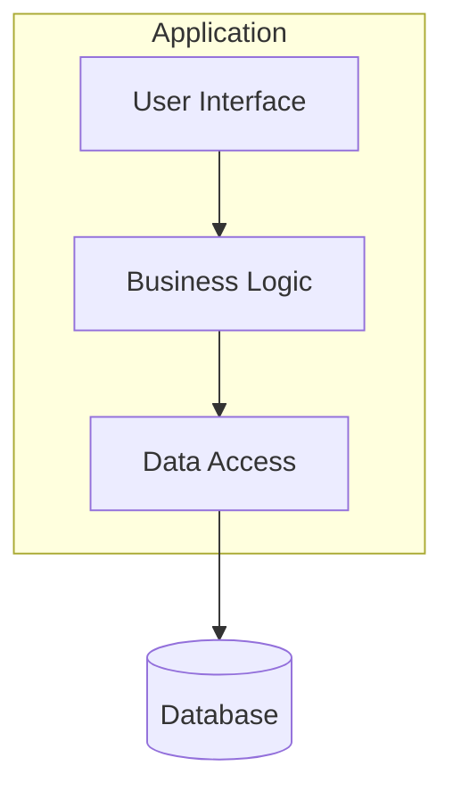
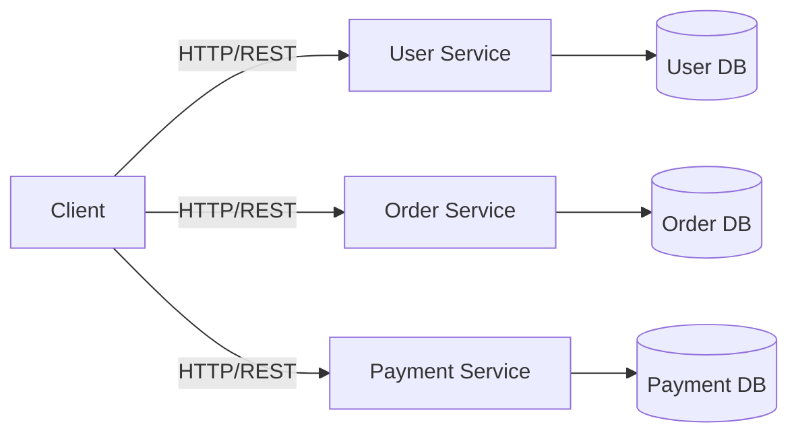
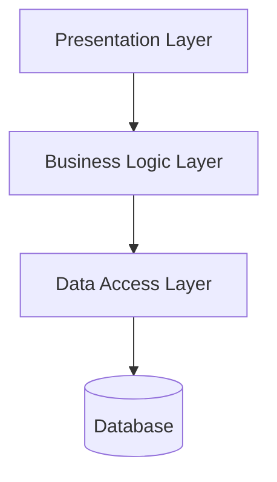
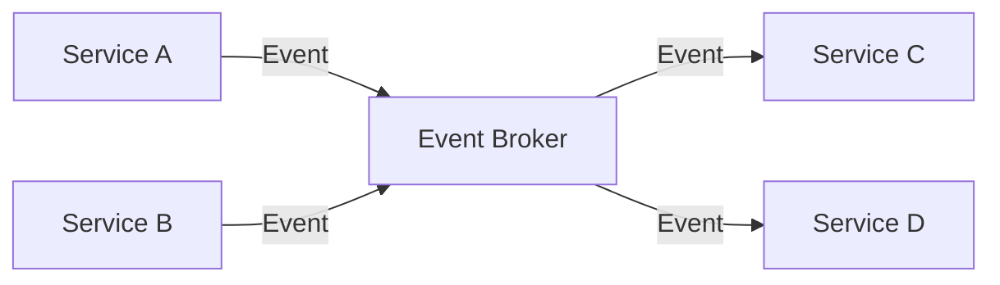
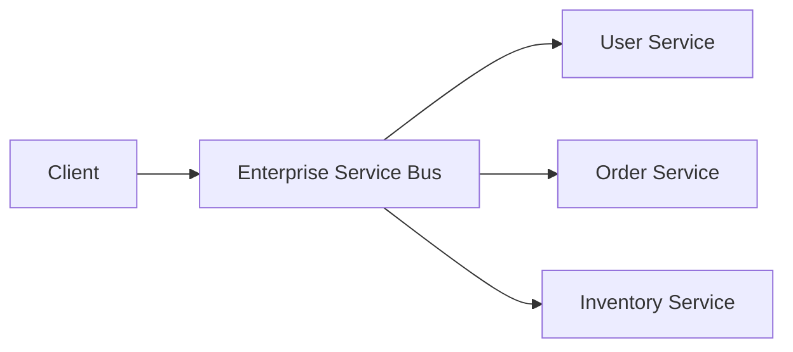
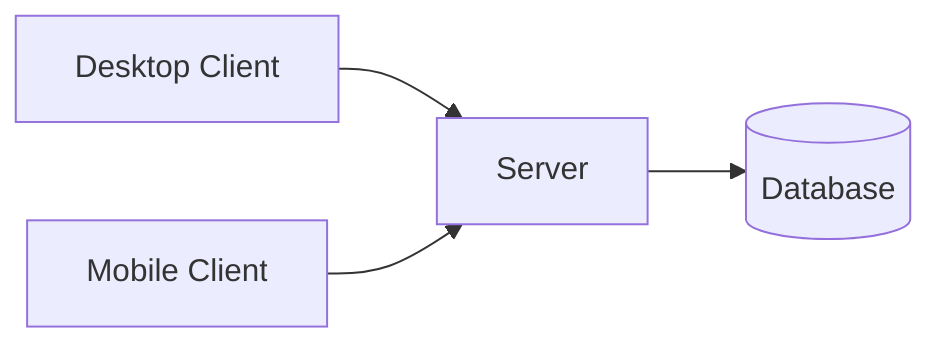
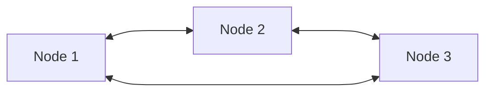
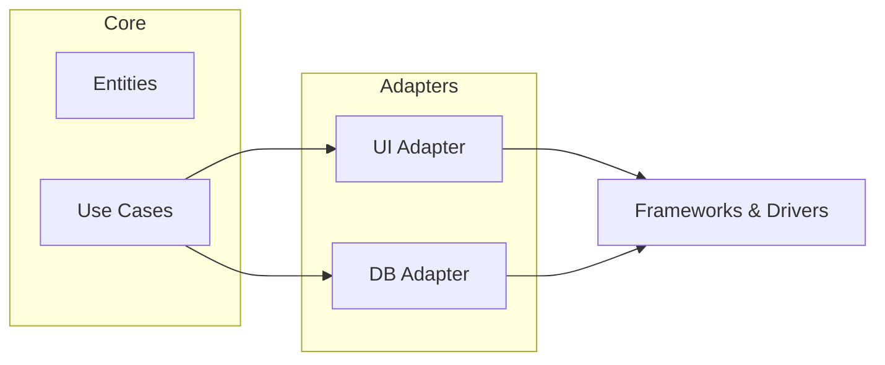
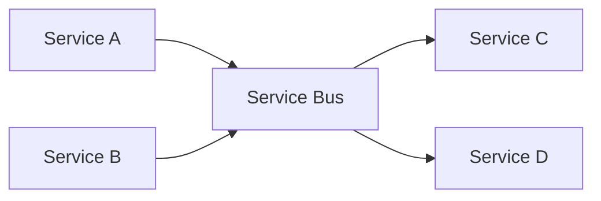
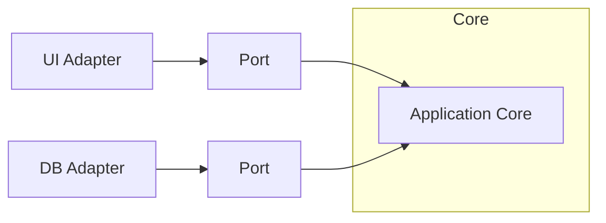

### 1. Монолитная архитектура (Monolithic Architecture)
- **Описание**: Все компоненты приложения (интерфейс, бизнес-логика, доступ к данным) объединены в один модуль.
- **Плюсы**: Простота разработки, развертывания и тестирования.
- **Минусы**: Сложность масштабирования, высокая связанность компонентов.

---

### 2. Микросервисная архитектура (Microservices Architecture)
- **Описание**: Приложение разбито на небольшие независимые сервисы, каждый из которых отвечает за свою функциональность.
- **Плюсы**: Гибкость, масштабируемость, независимое развертывание.
- **Минусы**: Сложность управления, необходимость оркестрации и мониторинга.

---

### 3. Многослойная архитектура (Layered Architecture)
- **Описание**: Приложение делится на слои (например, презентационный, бизнес-логика, доступ к данным).
- **Плюсы**: Четкое разделение ответственности, простота поддержки.
- **Минусы**: Может быть избыточной для простых приложений.

---

### 4. Архитектура на основе событий (Event-Driven Architecture)
- **Описание**: Компоненты взаимодействуют через события (например, с использованием брокеров сообщений).
- **Плюсы**: Асинхронность, гибкость, масштабируемость.
- **Минусы**: Сложность отладки и управления потоками данных.

---

### 5. Сервис-ориентированная архитектура (SOA)
- **Описание**: Приложение состоит из сервисов, которые взаимодействуют через стандартные протоколы (например, SOAP, REST) и часто используют Enterprise Service Bus (ESB).
- **Плюсы**: Повторное использование сервисов, интеграция с другими системами.
- **Минусы**: Высокая сложность, необходимость управления контрактами сервисов.

---

### 6. Архитектура "Клиент-Сервер" (Client-Server Architecture)
- **Описание**: Клиент отправляет запросы к серверу, который обрабатывает их и возвращает результат.
- **Плюсы**: Централизованное управление, простота обновления серверной части.
- **Минусы**: Зависимость от сервера, возможные проблемы с масштабируемостью.

---

### 7. Архитектура "Пиринговая сеть" (Peer-to-Peer Architecture)
- **Описание**: Все узлы равноправны и могут взаимодействовать напрямую.
- **Плюсы**: Отсутствие единой точки отказа, масштабируемость.
- **Минусы**: Сложность управления, проблемы с безопасностью.

---

### 8. Чистая архитектура (Clean Architecture)
- **Описание**: Приложение делится на концентрические слои с четким разделением ответственности и зависимостей. Приложение делится на концентрические слои: Entities, Use Cases, Interface Adapters, Frameworks & Drivers.
- **Плюсы**: Гибкость, тестируемость, независимость от фреймворков.
- **Минусы**: Сложность реализации, избыточность для небольших проектов.

---

### 9. Архитектура "Шина сервисов" (Service Bus Architecture)
- **Описание**: Сервисы взаимодействуют через центральную шину, которая управляет маршрутизацией сообщений.
- **Плюсы**: Гибкость, масштабируемость, слабая связанность.
- **Минусы**: Сложность настройки и управления шиной.

---

### 10. Шестиугольная архитектура (Hexagonal Architecture, Ports and Adapters)
- **Описание**: Приложение изолировано от внешних зависимостей (например, базы данных, UI) с помощью адаптеров.
- **Плюсы**: Гибкость, тестируемость, простота замены внешних компонентов.
- **Минусы**: Сложность реализации для небольших проектов.

---