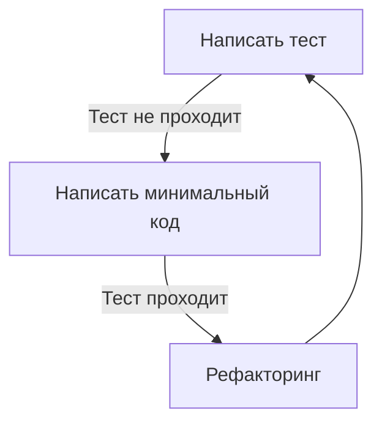
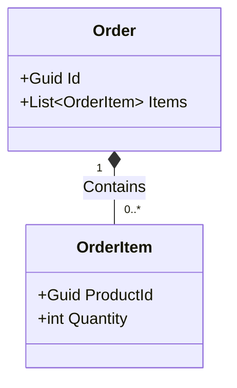
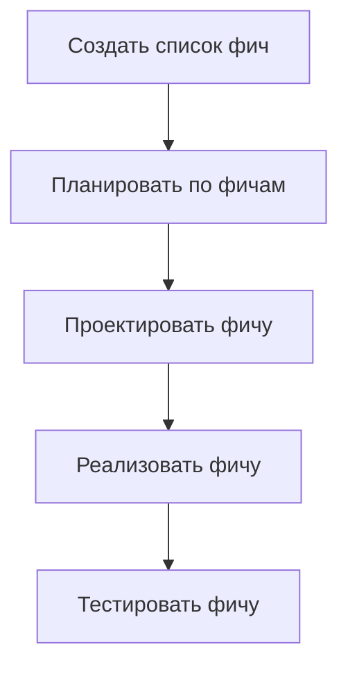
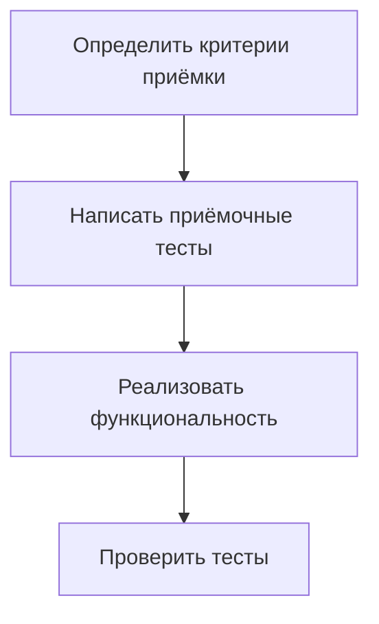

## **1. TDD (Test-Driven Development)**

### **Концепция**
**Test-Driven Development (TDD)** — подход, при котором тесты пишутся **до** реализации функциональности. Основной цикл: **Красный → Зелёный → Рефакторинг**.
- **Красный**: Пишется тест, который не проходит (ещё нет кода).
- **Зелёный**: Пишется минимальный код, чтобы тест прошёл.
- **Рефакторинг**: Код улучшается без изменения поведения.

### **Применение**
- Разработка ПО с высокими требованиями к качеству.
- Проекты, где важно избежать регрессий.
- Команды, практикующие Agile/Scrum.

### **Сценарии**
- Разработка новых фич.
- Рефакторинг legacy-кода.
- Интеграция новых модулей.

### **Пример**
```python
# 1. Тест (не проходит)
def test_add():
    assert add(2, 3) == 5

# 2. Минимальный код (тест проходит)
def add(a, b):
    return a + b

# 3. Рефакторинг (если нужно)
```

### **Building Blocks**
- **Unit-тесты** (модульные тесты).
- **Тестовые фреймворки** (JUnit, pytest, NUnit).
- **Mock-объекты** (для изоляции тестов).

### **Схема**


---

## **2. BDD (Behavior-Driven Development)**

### **Концепция**
**Behavior-Driven Development (BDD)** — расширение TDD, фокусирующееся на **поведении системы** с точки зрения пользователя. Использует **язык Gherkin** для описания сценариев:
```gherkin
Given [контекст]
When [действие]
Then [результат]
```

### **Применение**
- Проекты с активным участием бизнес-заказчиков.
- Разработка пользовательских интерфейсов.
- Интеграционное тестирование.

### **Сценарии**
- Описание бизнес-процессов.
- Автоматизация приёмочных тестов.
- Коллаборация между разработчиками, тестировщиками и бизнес-аналитиками.

### **Пример**
```gherkin
Feature: Авторизация
  Scenario: Успешный вход
    Given Пользователь на странице входа
    When Пользователь вводит валидные логин и пароль
    Then Пользователь перенаправляется на главную страницу
```

### **Building Blocks**
- **Gherkin-сценарии**.
- **Инструменты**: Cucumber, SpecFlow, Behave.
- **Step Definitions** (связь сценариев с кодом).

### **Схема**
```mermaid
flowchart TD
    A[Описать сценарий\n(Gherkin)] --> B[Написать тесты\nна основе сценария]
    B --> C[Реализовать функциональность]
    C --> D[Проверить соответствие\nожиданиям пользователя]
```

---

## **3. DDD (Domain-Driven Design)**

### **Концепция**
**Domain-Driven Design (DDD)** — подход к проектированию ПО, фокусирующийся на **моделировании бизнес-домена**. Использует **Ubiquitous Language** (единый язык для команды и бизнес-экспертов).

### **Применение**
- Сложные бизнес-системы (ERP, CRM, финансовые платформы).
- Проекты с долгим жизненным циклом.
- Команды, где важна глубокая интеграция бизнес-логики в код.

### **Сценарии**
- Разработка ядра бизнес-системы.
- Интеграция микросервисов.
- Рефакторинг монолитных приложений.

### **Пример**
```csharp
// Сущность (Entity)
public class Order {
    public Guid Id { get; set; }
    public List<OrderItem> Items { get; set; }
}

// Объект-значение (Value Object)
public class Money {
    public decimal Amount { get; }
    public string Currency { get; }
}
```

### **Building Blocks**
- **Сущности (Entities)**.
- **Объекты-значения (Value Objects)**.
- **Агрегаты (Aggregates)**.
- **Репозитории (Repositories)**.
- **Сервисы домена (Domain Services)**.
- **Ограниченные контексты (Bounded Contexts)**.

### **Схема**


---

## **4. FDD (Feature-Driven Development)**

### **Концепция**
**Feature-Driven Development (FDD)** — итеративный подход, фокусирующийся на **разработке по функциональным возможностям (фичам)**. Состоит из 5 шагов:
1. Разработка общей модели.
2. Составление списка фич.
3. Планирование по фичам.
4. Проектирование фичи.
5. Реализация фичи.

### **Применение**
- Проекты с чёткими требованиями.
- Команды, работающие по Agile.
- Разработка корпоративных систем.

### **Сценарии**
- Постепенное добавление функциональности.
- Работа с большими командами.
- Управление приоритетами фич.

### **Пример**
```
Фича: "Добавление товара в корзину"
- Разработка API для корзины.
- Интеграция с базой данных.
- Тестирование.
```

### **Building Blocks**
- **Список фич**.
- **Диаграммы классов/модулей**.
- **План итераций**.

### **Схема**


---

## **5. ATDD (Acceptance Test-Driven Development)**

### **Концепция**
**Acceptance Test-Driven Development (ATDD)** — подход, при котором **тесты пишутся на основе критериев приёмки** до реализации функциональности. Фокус на **коллаборации между заказчиком, разработчиками и тестировщиками**.

### **Применение**
- Проекты с жёсткими требованиями к качеству.
- Разработка пользовательских историй (User Stories).
- Автоматизация приёмочных тестов.

### **Сценарии**
- Определение критериев приёмки.
- Автоматизация тестирования UI/API.
- Интеграционное тестирование.

### **Пример**
```gherkin
Scenario: Успешная оплата заказа
  Given Заказ оформлен
  When Пользователь оплачивает заказ картой
  Then Статус заказа меняется на "Оплачен"
```

### **Building Blocks**
- **Критерии приёмки**.
- **Приёмочные тесты**.
- **Инструменты**: FitNesse, Robot Framework.

### **Схема**


---

## **6. MDD (Model-Driven Development)**

### **Концепция**
**Model-Driven Development (MDD)** — подход, при котором **модели (UML, Domain Models) используются для генерации кода**. Фокус на **автоматизации разработки** и уменьшении рутинного кода.

### **Применение**
- Проекты с повторяющейся архитектурой.
- Генерация кода для enterprise-систем.
- Интеграция с CASE-инструментами.

### **Сценарии**
- Быстрое прототипирование.
- Генерация CRUD-операций.
- Поддержка legacy-систем.

### **Пример**
```
Модель: "Класс User с полями Name, Email"
→ Генерация: Код класса, миграции БД, API-эндпоинты.
```

### **Building Blocks**
- **UML-диаграммы**.
- **Генераторы кода** (AndroMDA, Eclipse Modeling Tools).
- **Методологии**: MDA (Model-Driven Architecture).

### **Схема**
```mermaid
flowchart TD
    A[Создать модель\n(UML, Domain Model)] --> B[Сгенерировать код]
    B --> C[Тестировать и дорабатывать]
```

---

## **Сравнительная таблица**


Сравнение методологий разработки


| Методология | Концепция                          | Применение                                  | Building Blocks                          | Преимущества                                  | Недостатки                                  |
|-------------|------------------------------------|---------------------------------------------|-------------------------------------------|-----------------------------------------------|---------------------------------------------|
| **TDD**     | Тесты → Код                         | Высокое качество кода, Agile-проекты        | Unit-тесты, Mock-объекты                  | Меньше багов, лучшая архитектура              | Требует дисциплины                          |
| **BDD**     | Поведение системы                  | Коллаборация с бизнес-заказчиками           | Gherkin, Cucumber, SpecFlow               | Понятно нетехническим специалистам            | Дополнительные инструменты                  |
| **DDD**     | Моделирование бизнес-домена        | Сложные бизнес-системы                      | Сущности, агрегаты, ограниченные контексты| Точное отражение бизнес-логики               | Сложность для простых проектов              |
| **FDD**     | Разработка по фичам                | Agile, корпоративные системы                | Список фич, диаграммы классов             | Быстрая доставка ценности                    | Требует планирования                        |
| **ATDD**    | Тесты на основе критериев приёмки  | Проекты с жёсткими требованиями            | Приёмочные тесты, FitNesse                 | Уверенность в соответствии требованиям      | Дополнительные затраты на тесты             |
| **MDD**     | Модели → Код                       | Генерация кода, enterprise-системы         | UML, генераторы кода                      | Быстрая разработка, меньше рутинного кода   | Сложность поддержки моделей                |