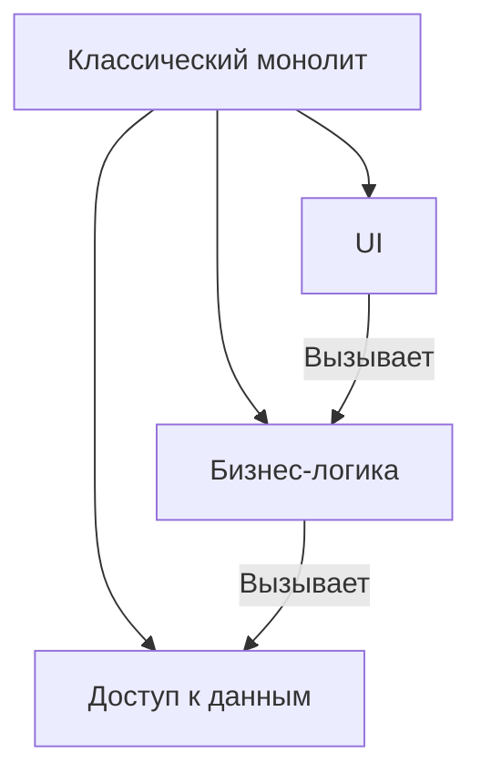
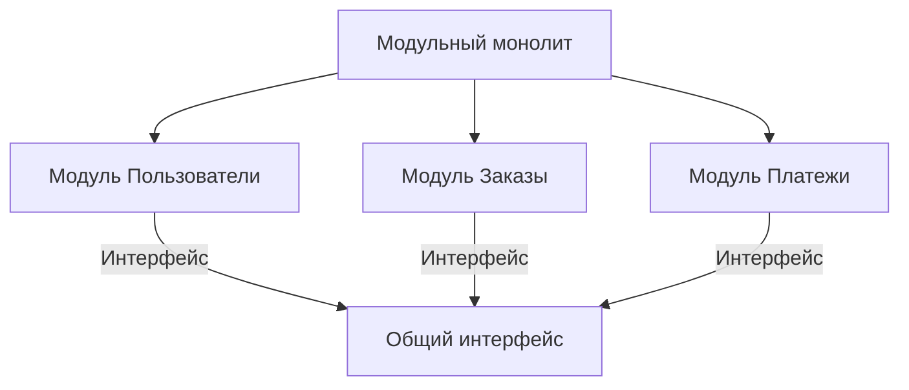
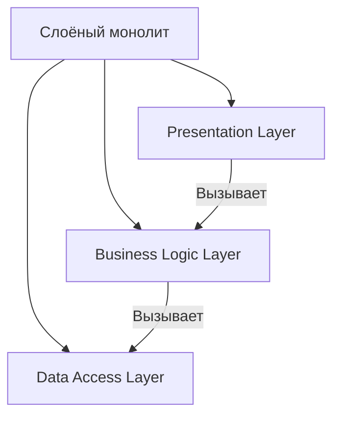
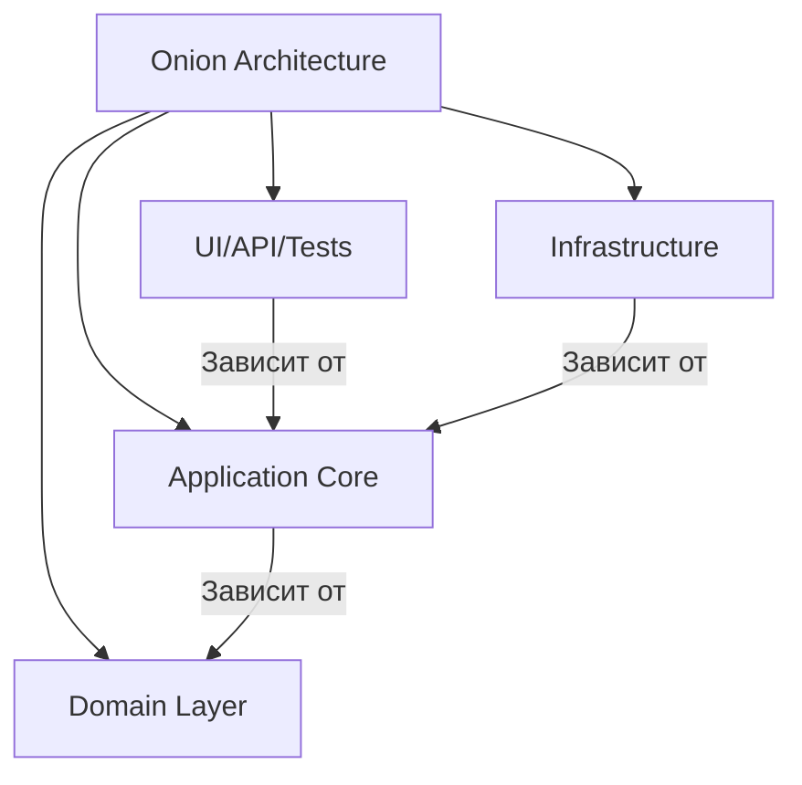
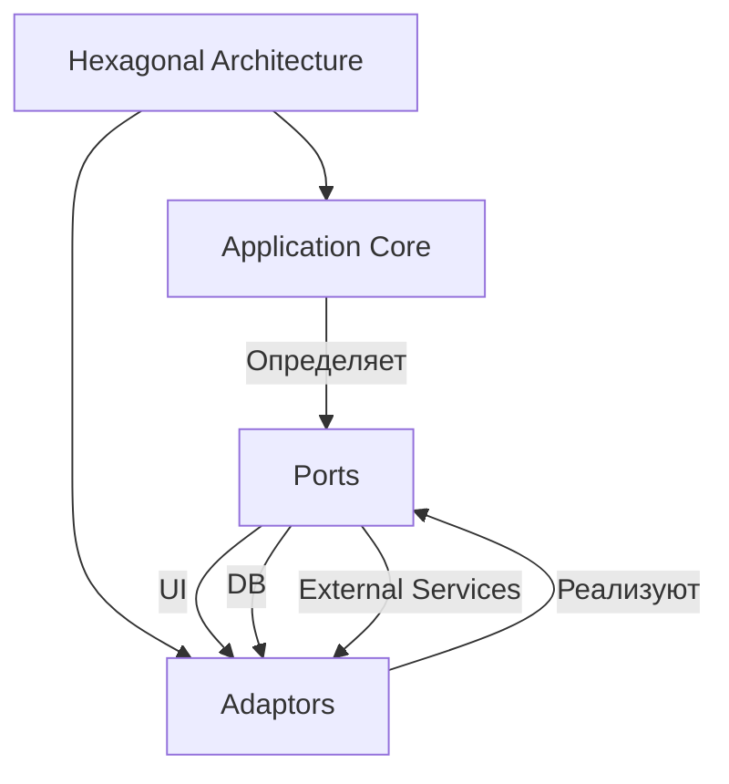

## **1. Монолитная архитектура (Monolithic Architecture)**

### **Описание**
Монолитная архитектура — это подход, при котором всё приложение (интерфейс, бизнес-логика, доступ к данным) объединено в **единый блок** и развёртывается как одно целое. Такой стиль часто используется на ранних этапах разработки из-за простоты развёртывания и тестирования.

---

## **Подстили и шаблоны**

---

### **1.1. Классический монолит (Classic Monolith)**
#### **Описание**
Все компоненты приложения (UI, бизнес-логика, доступ к данным) тесно связаны и развёртываются вместе.



#### **Проблемы**
- Сложность масштабирования (масштабируется всё приложение целиком).
- Высокая связанность компонентов, что усложняет поддержку и тестирование.

---

### **1.2. Модульный монолит (Modular Monolith)**
#### **Описание**
Приложение разбито на **логические модули** (например, "Пользователи", "Заказы", "Платежи"), но развёртывается как единое целое. Модули взаимодействуют через интерфейсы.



#### **Преимущества**
- Проще поддерживать, чем классический монолит.
- Легче тестировать и вносить изменения в отдельные модули.

---

### **1.3. Слоёный монолит (Layered Monolith)**
#### **Описание**
Приложение разбито на **слои** (UI, бизнес-логика, доступ к данным), но все слои развёртываются вместе.



#### **Слои**
1. **Presentation Layer** (UI, API)
2. **Business Logic Layer** (бизнес-правила)
3. **Data Access Layer** (работа с базой данных)

#### **Проблемы**
- Может превратиться в "большой комок грязи" (Big Ball of Mud), если слои сильно связаны.
- Сложно масштабировать отдельные слои.

---

### **1.4. Onion Architecture (Луковая архитектура)**
#### **Описание**
Приложение организовано в **концентрические слои**, где внутренние слои не зависят от внешних. Бизнес-логика находится в центре, а инфраструктура (базы данных, фреймворки) — на внешнем слое.



#### **Слои**
- **UI/API/Tests** (внешний слой)
- **Infrastructure** (базы данных, фреймворки)
- **Application Core** (юзкейсы, интерфейсы)
- **Domain Layer** (бизнес-логика, сущности)

#### **Преимущества**
- Высокая тестируемость и гибкость.
- Лёгкость замены внешних компонентов (например, базы данных).

---

### **1.5. Ports and Adapters (Hexagonal Architecture)**
#### **Описание**
Приложение разделено на **ядро** (бизнес-логика) и **адаптеры** (интерфейсы для взаимодействия с внешним миром). Позволяет легко заменять адаптеры (например, базу данных или UI).



#### **Компоненты**
- **Application Core** (бизнес-логика, доменные модели)
- **Ports** (интерфейсы для взаимодействия с внешним миром)
- **Adaptors** (реализации портов: UI, базы данных, внешние сервисы)

#### **Преимущества**
- Низкая связанность.
- Легкость тестирования и замены компонентов.

---

## **Пример реализации на C# (Modular Monolith)**
```csharp
// Пример модуля "Пользователи" в модульном монолите
namespace UserModule
{
    public interface IUserRepository
    {
        User GetById(int id);
        void Save(User user);
    }

    public class UserService
    {
        private readonly IUserRepository _userRepository;

        public UserService(IUserRepository userRepository)
        {
            _userRepository = userRepository;
        }

        public void RegisterUser(string name, string email)
        {
            var user = new User(name, email);
            _userRepository.Save(user);
        }
    }
}
```

---

## **Когда использовать монолит?**
- Для **небольших проектов** или MVP.
- Когда команда **небольшая** и не требуется масштабирование отдельных компонентов.
- Если **инфраструктура простая** и не требуется высокая гибкость.