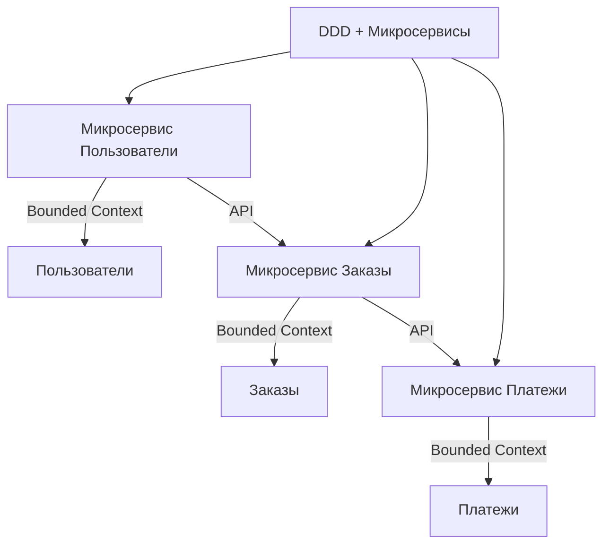
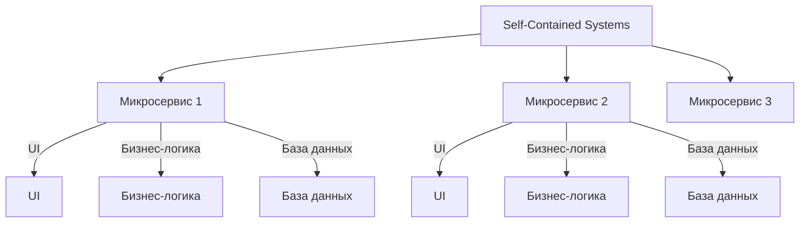
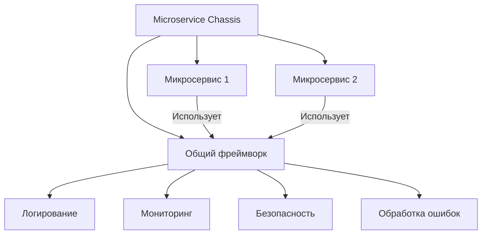
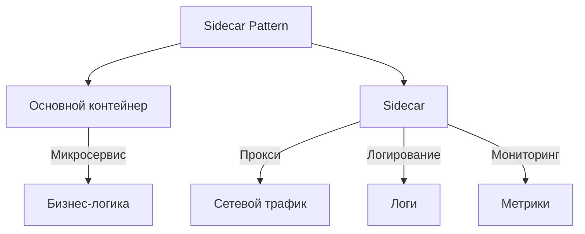
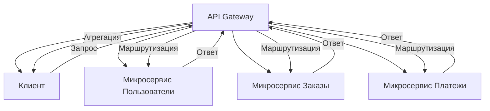
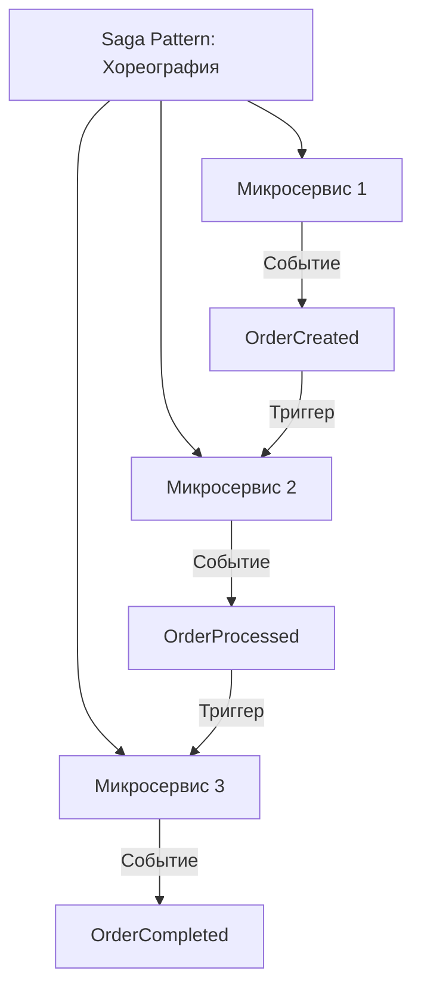
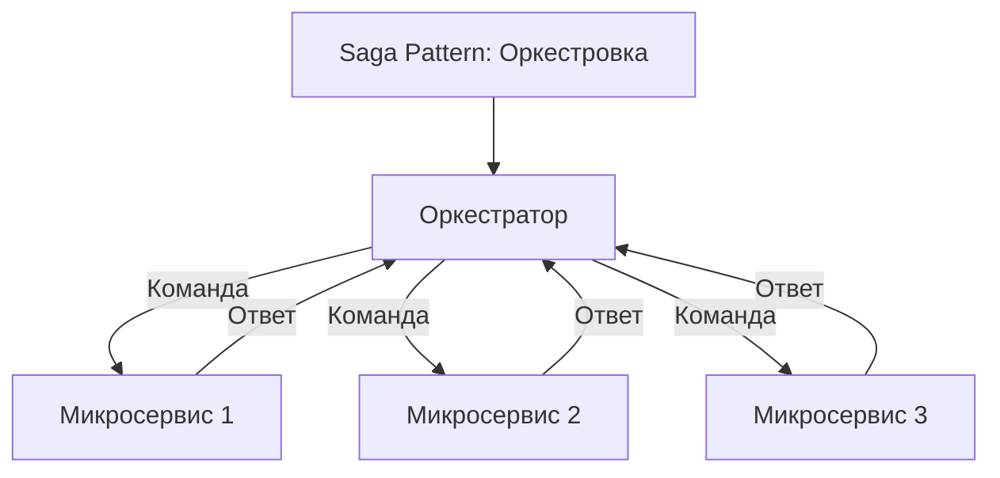
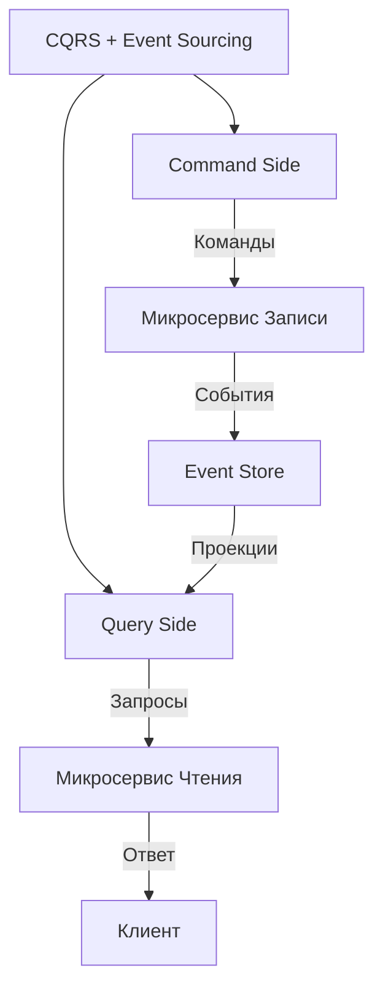

## **2. Микросервисная архитектура (Microservices Architecture)**


## Оглавление
- [**2. Микросервисная архитектура (Microservices Architecture)**](#2-микросервисная-архитектура-microservices-architecture)
  - [**Описание**](#описание)
- [**Подстили и шаблоны**](#подстили-и-шаблоны)
  - [**2.1. Domain-Driven Design (DDD) + Микросервисы**](#21-domain-driven-design-ddd-микросервисы)
    - [**Описание**](#описание)
    - [**Преимущества**](#преимущества)
    - [**Пример**](#пример)
  - [**2.2. Self-Contained Systems (SCS)**](#22-self-contained-systems-scs)
    - [**Описание**](#описание)
    - [**Преимущества**](#преимущества)
    - [**Недостатки**](#недостатки)
  - [**2.3. Microservice Chassis**](#23-microservice-chassis)
    - [**Описание**](#описание)
    - [**Пример**](#пример)
  - [**2.4. Sidecar Pattern**](#24-sidecar-pattern)
    - [**Описание**](#описание)
    - [**Преимущества**](#преимущества)
    - [**Пример**](#пример)
  - [**2.5. API Gateway**](#25-api-gateway)
    - [**Описание**](#описание)
    - [**Преимущества**](#преимущества)
    - [**Пример**](#пример)
  - [**2.6. Saga Pattern**](#26-saga-pattern)
    - [**Описание**](#описание)
    - [**Типы саг**](#типы-саг)
    - [**(Хореография)**](#хореография)
    - [**(Оркестровка)**](#оркестровка)
    - [**Преимущества**](#преимущества)
    - [**Пример**](#пример)
  - [**2.7. CQRS + Event Sourcing**](#27-cqrs-event-sourcing)
    - [**Описание**](#описание)
    - [**Преимущества**](#преимущества)
    - [**Пример**](#пример)
- [**Пример реализации на C# (API Gateway + Microservices)**](#пример-реализации-на-c-api-gateway-microservices)
  - [**1. Транзакции с компенсацией (Compensating Transactions)**](#1-транзакции-с-компенсацией-compensating-transactions)
  - [Пример на C#](#пример-на-c)
    - [OrderService (создание заказа)](#orderservice-создание-заказа)
    - [PaymentService (оплата)](#paymentservice-оплата)
    - [Оркестратор (координация)](#оркестратор-координация)
  - [**2. Паттерн "2PC" (Two-Phase Commit)**](#2-паттерн-2pc-two-phase-commit)
  - [Пример на C#](#пример-на-c)
    - [Координатор](#координатор)
    - [Участник транзакции](#участник-транзакции)
  - [**3. Идempотентные операции (Idempotency)**](#3-идempотентные-операции-idempotency)
  - [Пример на C#](#пример-на-c)
    - [Сервис оплаты](#сервис-оплаты)
  - [**4. Локальные транзакции с последующей синхронизацией**](#4-локальные-транзакции-с-последующей-синхронизацией)
  - [Пример на C#](#пример-на-c)
    - [Сервис заказов (публикует событие)](#сервис-заказов-публикует-событие)
    - [Сервис складского учёта (подписан на событие)](#сервис-складского-учёта-подписан-на-событие)
  - [**5. Паттерн "CQRS" (Command Query Responsibility Segregation)**](#5-паттерн-cqrs-command-query-responsibility-segregation)
  - [Пример на C#](#пример-на-c)
    - [Команда (запись)](#команда-запись)
    - [Запрос (чтение)](#запрос-чтение)
  - [**6. Паттерн "Outbox"**](#6-паттерн-outbox)
  - [Пример на C#](#пример-на-c)
    - [Сервис заказов](#сервис-заказов)
    - [Фоновый воркер (отправляет события из Outbox)](#фоновый-воркер-отправляет-события-из-outbox)
  - [**7. Паттерн "Transaction Log Tailing"**](#7-паттерн-transaction-log-tailing)
  - [Пример на C#](#пример-на-c)
    - [Подписчик на изменения](#подписчик-на-изменения)
  - [**8. Паттерн "Request-Collation"**](#8-паттерн-request-collation)
  - [Пример на C#](#пример-на-c)
    - [Сервис аналитики](#сервис-аналитики)
  - [**Сравнение подходов**](#сравнение-подходов)
  - [**Рекомендации по выбору**](#рекомендации-по-выбору)
- [**Когда использовать микросервисы?**](#когда-использовать-микросервисы)
- [**1. Хореография (Choreography)**](#1-хореография-choreography)
  - [**Как работает**](#как-работает)
  - [**Плюсы**](#плюсы)
  - [**Минусы**](#минусы)
  - [**Пример на C# (с использованием MassTransit и RabbitMQ)**](#пример-на-c-с-использованием-masstransit-и-rabbitmq)
- [**2. Оркестровка (Orchestration)**](#2-оркестровка-orchestration)
  - [**Как работает**](#как-работает)
  - [**Плюсы**](#плюсы)
  - [**Минусы**](#минусы)
  - [**Пример на C# (с использованием Azure Durable Functions)**](#пример-на-c-с-использованием-azure-durable-functions)
- [**Сравнение Хореографии и Оркестровки**](#сравнение-хореографии-и-оркестровки)
- [**Когда что использовать?**](#когда-что-использовать)

  - [**Описание**](#описание)
  - [**2.1. Domain-Driven Design (DDD) + Микросервисы**](#21-domain-driven-design-ddd-микросервисы)
    - [**Описание**](#описание)
    - [**Преимущества**](#преимущества)
    - [**Пример**](#пример)
  - [**2.2. Self-Contained Systems (SCS)**](#22-self-contained-systems-scs)
    - [**Описание**](#описание)
    - [**Преимущества**](#преимущества)
    - [**Недостатки**](#недостатки)
  - [**2.3. Microservice Chassis**](#23-microservice-chassis)
    - [**Описание**](#описание)
    - [**Пример**](#пример)
  - [**2.4. Sidecar Pattern**](#24-sidecar-pattern)
    - [**Описание**](#описание)
    - [**Преимущества**](#преимущества)
    - [**Пример**](#пример)
  - [**2.5. API Gateway**](#25-api-gateway)
    - [**Описание**](#описание)
    - [**Преимущества**](#преимущества)
    - [**Пример**](#пример)
  - [**2.6. Saga Pattern**](#26-saga-pattern)
    - [**Описание**](#описание)
    - [**Типы саг**](#типы-саг)
    - [**(Хореография)**](#хореография)
    - [**(Оркестровка)**](#оркестровка)
    - [**Преимущества**](#преимущества)
    - [**Пример**](#пример)
  - [**2.7. CQRS + Event Sourcing**](#27-cqrs-event-sourcing)
    - [**Описание**](#описание)
    - [**Преимущества**](#преимущества)
    - [**Пример**](#пример)
  - [**1. Транзакции с компенсацией (Compensating Transactions)**](#1-транзакции-с-компенсацией-compensating-transactions)
  - [Пример на C#](#пример-на-c)
    - [OrderService (создание заказа)](#orderservice-создание-заказа)
    - [PaymentService (оплата)](#paymentservice-оплата)
    - [Оркестратор (координация)](#оркестратор-координация)
  - [**2. Паттерн "2PC" (Two-Phase Commit)**](#2-паттерн-2pc-two-phase-commit)
  - [Пример на C#](#пример-на-c)
    - [Координатор](#координатор)
    - [Участник транзакции](#участник-транзакции)
  - [**3. Идempотентные операции (Idempotency)**](#3-идempотентные-операции-idempotency)
  - [Пример на C#](#пример-на-c)
    - [Сервис оплаты](#сервис-оплаты)
  - [**4. Локальные транзакции с последующей синхронизацией**](#4-локальные-транзакции-с-последующей-синхронизацией)
  - [Пример на C#](#пример-на-c)
    - [Сервис заказов (публикует событие)](#сервис-заказов-публикует-событие)
    - [Сервис складского учёта (подписан на событие)](#сервис-складского-учёта-подписан-на-событие)
  - [**5. Паттерн "CQRS" (Command Query Responsibility Segregation)**](#5-паттерн-cqrs-command-query-responsibility-segregation)
  - [Пример на C#](#пример-на-c)
    - [Команда (запись)](#команда-запись)
    - [Запрос (чтение)](#запрос-чтение)
  - [**6. Паттерн "Outbox"**](#6-паттерн-outbox)
  - [Пример на C#](#пример-на-c)
    - [Сервис заказов](#сервис-заказов)
    - [Фоновый воркер (отправляет события из Outbox)](#фоновый-воркер-отправляет-события-из-outbox)
  - [**7. Паттерн "Transaction Log Tailing"**](#7-паттерн-transaction-log-tailing)
  - [Пример на C#](#пример-на-c)
    - [Подписчик на изменения](#подписчик-на-изменения)
  - [**8. Паттерн "Request-Collation"**](#8-паттерн-request-collation)
  - [Пример на C#](#пример-на-c)
    - [Сервис аналитики](#сервис-аналитики)
  - [**Сравнение подходов**](#сравнение-подходов)
  - [**Рекомендации по выбору**](#рекомендации-по-выбору)
  - [**Как работает**](#как-работает)
  - [**Плюсы**](#плюсы)
  - [**Минусы**](#минусы)
  - [**Пример на C# (с использованием MassTransit и RabbitMQ)**](#пример-на-c-с-использованием-masstransit-и-rabbitmq)
  - [**Как работает**](#как-работает)
  - [**Плюсы**](#плюсы)
  - [**Минусы**](#минусы)
  - [**Пример на C# (с использованием Azure Durable Functions)**](#пример-на-c-с-использованием-azure-durable-functions)
### **Описание**
Микросервисная архитектура предполагает разбиение приложения на **небольшие независимые сервисы**, каждый из которых отвечает за свою бизнес-функцию. Сервисы взаимодействуют между собой через **API** (например, REST, gRPC) или **сообщения** (например, Kafka, RabbitMQ). Каждый сервис может быть развёрнут, масштабирован и обновлён независимо от других.

---

## **Подстили и шаблоны**

---

### **2.1. Domain-Driven Design (DDD) + Микросервисы**
#### **Описание**
Микросервисы выстраиваются вокруг **ограниченных контекстов** (Bounded Contexts) из Domain-Driven Design. Каждый микросервис соответствует одному ограниченному контексту и отвечает за свою часть бизнес-логики.



#### **Преимущества**
- Чёткое разделение ответственности между сервисами.
- Легче поддерживать и развивать каждый сервис независимо.

#### **Пример**
- **Микросервис "Пользователи"**: Управляет регистрацией, аутентификацией и профилями пользователей.
- **Микросервис "Заказы"**: Управляет созданием, обработкой и статусами заказов.

---

### **2.2. Self-Contained Systems (SCS)**
#### **Описание**
Каждый микросервис — это **полностью автономная система** с собственным UI, бизнес-логикой и базой данных. Такой подход позволяет разрабатывать и развёртывать сервисы независимо, но может приводить к дублированию кода (например, UI для каждого сервиса).



#### **Преимущества**
- Полная автономность каждого сервиса.
- Возможность использовать разные технологии для каждого сервиса.

#### **Недостатки**
- Дублирование кода (например, UI, общие библиотеки).
- Сложность поддержки нескольких UI.

---

### **2.3. Microservice Chassis**
#### **Описание**
Шаблон для стандартизации **инфраструктурных задач** (логирование, мониторинг, безопасность, обработка ошибок) во всех микросервисах. Позволяет избежать дублирования кода и упрощает поддержку.



#### **Пример**
- Использование **Spring Cloud** для Java-микросервисов.
- Использование **Istio** для управления сетевым трафиком и безопасности.

---

### **2.4. Sidecar Pattern**
#### **Описание**
Дополнительный контейнер (**sidecar**) развёртывается рядом с основным контейнером микросервиса для выполнения вспомогательных задач (например, проксирование запросов, логирование, мониторинг).



#### **Преимущества**
- Разделение ответственности между основным контейнером и sidecar.
- Возможность добавлять функциональность без изменения основного сервиса.

#### **Пример**
- **Envoy** как sidecar для управления сетевым трафиком.
- **Fluentd** для сбора и обработки логов.

---

### **2.5. API Gateway**
#### **Описание**
Единая точка входа для клиентов, которая **маршрутизирует запросы** к разным микросервисам, агрегирует ответы и обрабатывает кросс-катинговые задачи (аутентификация, кеширование, балансировка нагрузки).



#### **Преимущества**
- Централизованное управление запросами.
- Возможность агрегировать данные из нескольких сервисов.

#### **Пример**
- **Kong**, **Apigee**, **AWS API Gateway**.

---

### **2.6. Saga Pattern**
#### **Описание**
Управление **распределёнными транзакциями** между микросервисами через цепочку локальных транзакций и компенсирующих операций. Используется, когда необходимо обеспечить согласованность данных в распределённой системе.

#### **Типы саг**
1. **Хореография**: Сервисы общаются через события (например, Kafka).
2. **Оркестровка**: Центральный оркестратор управляет процессом.

#### **(Хореография)**


#### **(Оркестровка)**


#### **Преимущества**
- Обеспечивает согласованность данных в распределённой системе.
- Позволяет откатывать транзакции при ошибках.

#### **Пример**
- Оформление заказа, где необходимо обновить данные в сервисах "Заказы", "Склад" и "Платежи".

---

### **2.7. CQRS + Event Sourcing**
#### **Описание**
- **CQRS** (Command Query Responsibility Segregation): Разделение операций чтения (Query) и записи (Command).
- **Event Sourcing**: Хранение всех изменений состояния как последовательности событий.



#### **Преимущества**
- Оптимизация производительности для чтения и записи.
- Возможность восстановить состояние системы на любой момент времени.

#### **Пример**
- Хранение истории заказов как событий (`OrderCreated`, `OrderPaid`, `OrderShipped`).

---

## **Пример реализации на C# (API Gateway + Microservices)**
```csharp
// Пример клиента, взаимодействующего с API Gateway
public class OrderClient
{
    private readonly HttpClient _httpClient;

    public OrderClient(HttpClient httpClient)
    {
        _httpClient = httpClient;
        _httpClient.BaseAddress = new Uri("https://api-gateway.example.com");
    }

    public async Task<Order> GetOrderAsync(int orderId)
    {
        var response = await _httpClient.GetAsync($"/orders/{orderId}");
        response.EnsureSuccessStatusCode();
        return await response.Content.ReadAsAsync<Order>();
    }
}
```
---

>В микросервисной архитектуре (MSA) поддержание согласованности данных между сервисами — одна из ключевых задач. Помимо **Saga** и **Event Sourcing**, существуют и другие подходы. Вот основные из них:

---

### **1. Транзакции с компенсацией (Compensating Transactions)**
- **Суть**: Если одна из операций в цепочке завершается неудачно, выполняются "компенсирующие" действия для отката изменений.
- **Пример**: При бронировании билета и оплате, если оплата не прошла, бронирование автоматически отменяется.
- **Плюсы**: Проще реализовать, чем Saga, для коротких цепочек операций.
- **Минусы**: Требует явной логики отката для каждого сервиса.

### Пример на C#
Предположим, у нас есть два микросервиса: `OrderService` и `PaymentService`. Если оплата не прошла, нужно отменить заказ.

#### OrderService (создание заказа)
```csharp
public class OrderService
{
    public async Task CreateOrder(Order order)
    {
        // Сохраняем заказ в базе
        await _orderRepository.Add(order);
    }

    public async Task CompensateOrder(int orderId)
    {
        // Отменяем заказ
        var order = await _orderRepository.Get(orderId);
        order.Status = "Cancelled";
        await _orderRepository.Update(order);
    }
}
```

#### PaymentService (оплата)
```csharp
public class PaymentService
{
    public async Task<bool> ProcessPayment(Payment payment)
    {
        // Логика оплаты
        if (!IsPaymentSuccessful(payment))
        {
            return false;
        }
        return true;
    }
}
```

#### Оркестратор (координация)
```csharp
public class OrderOrchestrator
{
    private readonly OrderService _orderService;
    private readonly PaymentService _paymentService;

    public async Task ProcessOrder(Order order, Payment payment)
    {
        // Создаём заказ
        await _orderService.CreateOrder(order);

        // Пробуем оплатить
        if (!await _paymentService.ProcessPayment(payment))
        {
            // Компенсируем заказ
            await _orderService.CompensateOrder(order.Id);
            throw new Exception("Payment failed. Order cancelled.");
        }
    }
}
```

---

### **2. Паттерн "2PC" (Two-Phase Commit)**
- **Суть**: Двухфазный протокол фиксации транзакций (подготовка → фиксация/откат).
- **Пример**: Координатор спрашивает все сервисы, готовы ли они зафиксировать изменения. Если все отвечают "да" — фиксирует, если хотя бы один сказал "нет" — откатывает.
- **Плюсы**: Гарантирует строгую согласованность.
- **Минусы**: Блокирует ресурсы на время транзакции, не подходит для распределённых систем с высокой нагрузкой.

### Пример на C#
#### Координатор
```csharp
public class TwoPhaseCommitCoordinator
{
    private readonly List<ITransactionParticipant> _participants;

    public async Task<bool> CommitTransaction()
    {
        // Фаза 1: Подготовка
        foreach (var participant in _participants)
        {
            if (!await participant.Prepare())
                return false;
        }

        // Фаза 2: Фиксация
        foreach (var participant in _participants)
        {
            await participant.Commit();
        }
        return true;
    }
}
```

#### Участник транзакции
```csharp
public class OrderTransactionParticipant : ITransactionParticipant
{
    public async Task<bool> Prepare()
    {
        // Проверяем, можно ли зафиксировать заказ
        return await _orderRepository.CanCommitOrder();
    }

    public async Task Commit()
    {
        // Фиксируем заказ
        await _orderRepository.CommitOrder();
    }
}
```

---

### **3. Идempотентные операции (Idempotency)**
- **Суть**: Сервисы проектируются так, чтобы повторный вызов операции с теми же параметрами не приводил к дублированию или ошибкам.
- **Пример**: Повторный запрос на оплату с одним и тем же `order_id` не создаёт новую транзакцию.
- **Плюсы**: Упрощает обработку ошибок и повторные попытки.
- **Минусы**: Требует тщательного проектирования API.

### Пример на C#
#### Сервис оплаты
```csharp
public class PaymentService
{
    private readonly HashSet<string> _processedPayments = new();

    public async Task ProcessPayment(Payment payment)
    {
        if (_processedPayments.Contains(payment.Id))
            return; // Уже обработано

        // Логика оплаты
        await _paymentRepository.Process(payment);
        _processedPayments.Add(payment.Id);
    }
}
```

---

### **4. Локальные транзакции с последующей синхронизацией**
- **Суть**: Каждый сервис фиксирует изменения локально, а затем синхронизируется с другими сервисами через события или опрос.
- **Пример**: Сервис заказов фиксирует заказ, а сервис складского учёта периодически проверяет новые заказы и обновляет запасы.
- **Плюсы**: Минимальная блокировка, подходит для систем с eventual consistency.
- **Минусы**: Возможны временные несоответствия данных.

### Пример на C#
#### Сервис заказов (публикует событие)
```csharp
public class OrderService
{
    private readonly IEventBus _eventBus;

    public async Task CreateOrder(Order order)
    {
        await _orderRepository.Add(order);
        await _eventBus.Publish(new OrderCreatedEvent(order.Id));
    }
}
```

#### Сервис складского учёта (подписан на событие)
```csharp
public class InventoryService
{
    public async Task Handle(OrderCreatedEvent @event)
    {
        // Обновляем запасы
        await _inventoryRepository.ReserveItems(@event.OrderId);
    }
}
```

---

### **5. Паттерн "CQRS" (Command Query Responsibility Segregation)**
- **Суть**: Разделение операций записи (Command) и чтения (Query) на разные модели данных.
- **Пример**: При изменении данных сервис отправляет событие в шину, а сервисы-читатели обновляют свои представления асинхронно.
- **Плюсы**: Позволяет оптимизировать чтение и запись независимо.
- **Минусы**: Усложняет архитектуру, требует поддержки eventual consistency.

### Пример на C#
#### Команда (запись)
```csharp
public class CreateOrderCommandHandler
{
    public async Task Handle(CreateOrderCommand command)
    {
        var order = new Order(command.ProductId, command.Quantity);
        await _orderRepository.Add(order);
        await _eventBus.Publish(new OrderCreatedEvent(order.Id));
    }
}
```

#### Запрос (чтение)
```csharp
public class OrderQueryService
{
    public async Task<OrderViewModel> GetOrder(int orderId)
    {
        // Возвращаем данные для чтения (например, из отдельной базы)
        return await _orderViewRepository.Get(orderId);
    }
}
```

---

### **6. Паттерн "Outbox"**
- **Суть**: Сервис сохраняет события в локальную таблицу ("outbox"), а отдельный процесс отправляет их в шину событий.
- **Пример**: Сервис заказов сохраняет событие "Заказ создан" в outbox, а затем фоновый процесс публикует его в Kafka.
- **Плюсы**: Гарантирует доставку событий даже при сбоях.
- **Минусы**: Требует дополнительной инфраструктуры для обработки outbox.

### Пример на C#
#### Сервис заказов
```csharp
public class OrderService
{
    public async Task CreateOrder(Order order)
    {
        await _orderRepository.Add(order);
        await _outboxRepository.Add(new OutboxMessage(
            "OrderCreated",
            new { OrderId = order.Id }
        ));
    }
}
```

#### Фоновый воркер (отправляет события из Outbox)
```csharp
public class OutboxWorker : BackgroundService
{
    protected override async Task ExecuteAsync(CancellationToken stoppingToken)
    {
        while (!stoppingToken.IsCancellationRequested)
        {
            var messages = await _outboxRepository.GetUnsentMessages();
            foreach (var message in messages)
            {
                await _eventBus.Publish(message.EventType, message.Payload);
                await _outboxRepository.MarkAsSent(message.Id);
            }
            await Task.Delay(1000, stoppingToken);
        }
    }
}
```

---

### **7. Паттерн "Transaction Log Tailing"**
- **Суть**: Сервисы читают логи транзакций базы данных (например, через Debezium) и реагируют на изменения.
- **Пример**: Сервис уведомлений подписывается на изменения в базе данных сервиса заказов и отправляет email при создании нового заказа.
- **Плюсы**: Минимальная связность, данные всегда актуальны.
- **Минусы**: Требует поддержки CDC (Change Data Capture) в базе данных.

### Пример на C#
Используем библиотеку **Debezium** для чтения логов PostgreSQL.

#### Подписчик на изменения
```csharp
public class OrderEventSubscriber
{
    public async Task Subscribe()
    {
        var config = new Configuration
        {
            {"name", "order-subscriber"},
            {"connector.class", "io.debezium.connector.postgresql.PostgresConnector"},
            {"database.hostname", "localhost"},
            {"database.port", "5432"},
            {"database.user", "user"},
            {"database.password", "password"},
            {"database.dbname", "orders"},
            {"table.include.list", "public.orders"}
        };

        using var engine = new EmbeddedEngine(config);
        engine.Run();

        await foreach (var record in engine.ChangeDataCapture())
        {
            if (record.Source.Operation == "INSERT")
            {
                var order = JsonConvert.DeserializeObject<Order>(record.Value.ToString());
                await _eventBus.Publish(new OrderCreatedEvent(order.Id));
            }
        }
    }
}
```

---

### **8. Паттерн "Request-Collation"**
- **Суть**: Сервисы группируют запросы и выполняют их пачками, чтобы минимизировать задержки и конфликты.
- **Пример**: Сервис аналитики собирает данные из нескольких сервисов за один запрос.
- **Плюсы**: Уменьшает нагрузку на сеть.
- **Минусы**: Усложняет логику обработки запросов.

### Пример на C#
#### Сервис аналитики
```csharp
public class AnalyticsService
{
    public async Task ProcessBatch(List<Order> orders)
    {
        // Группируем запросы к нескольким сервисам
        var userTasks = orders.Select(o => _userService.GetUser(o.UserId));
        var productTasks = orders.Select(o => _productService.GetProduct(o.ProductId));

        var users = await Task.WhenAll(userTasks);
        var products = await Task.WhenAll(productTasks);

        // Анализируем данные
        foreach (var (order, user, product) in orders.Zip(users, products))
        {
            await _analyticsRepository.Save(new AnalyticsRecord(order, user, product));
        }
    }
}
```

---

### **Сравнение подходов**
| Подход                     | Согласованность | Сложность | Подходит для |
|----------------------------|------------------|-----------|--------------|
| **Saga**                   | Eventual         | Высокая   | Длинные цепочки операций |
| **Event Sourcing**         | Eventual         | Очень высокая | Аудит, откат изменений |
| **2PC**                    | Строгая          | Высокая   | Короткие транзакции |
| **Компенсирующие транзакции** | Eventual      | Средняя   | Простые цепочки |
| **CQRS**                   | Eventual         | Высокая   | Системы с высокой нагрузкой на чтение |
| **Outbox**                 | Eventual         | Средняя   | Надёжная доставка событий |


| Подход                     | Пример на C#                     | Когда использовать                     |
|----------------------------|----------------------------------|-----------------------------------------|
| **Компенсирующие транзакции** | Оркестратор + компенсация      | Простые цепочки операций                |
| **2PC**                    | Координатор + участники         | Короткие транзакции с строгой согласованностью |
| **Идempотентность**        | Хранение обработанных ID        | Повторяющиеся операции (например, платежи) |
| **Локальные транзакции**   | События + фоновая обработка     | Eventual consistency                    |
| **CQRS**                   | Команды + запросы               | Высокая нагрузка на чтение              |
| **Outbox**                 | Локальная таблица + воркер      | Надёжная доставка событий               |
| **CDC**                    | Debezium + обработка логов      | Синхронизация данных в реальном времени |

---

### **Рекомендации по выбору**
- **Для строгой согласованности**: 2PC (но осторожно — может блокировать систему).
- **Для eventual consistency**: Saga, Event Sourcing, CQRS.
- **Для надёжной доставки событий**: Outbox, Transaction Log Tailing.
- **Для простых сценариев**: Компенсирующие транзакции, идempотентность.

---

## **Когда использовать микросервисы?**
- Для **крупных распределённых систем** с независимыми командами.
- Когда требуется **гибкость** в разработке, развёртывании и масштабировании.
- Если бизнес-функции **чётко разделены** и могут развиваться независимо.

--- 

В контексте микросервисной архитектуры (MSA) **хореография** и **оркестровка** — это два основных подхода к управлению взаимодействием между сервисами. Они решают задачу координации бизнес-процессов, распределённых между несколькими микросервисами.

---

## **1. Хореография (Choreography)**
**Суть**: Каждый сервис самостоятельно реагирует на события, опубликованные другими сервисами. Нет центрального координатора — логика распределена между участниками.

### **Как работает**
- Сервисы обмениваются **событиями** (например, через брокер сообщений: Kafka, RabbitMQ, Azure Service Bus).
- Каждый сервис "знает", на какие события он должен реагировать и какие события публиковать дальше.
- **Пример**: При создании заказа сервис `OrderService` публикует событие `OrderCreated`. Сервис `PaymentService` подписывается на это событие, обрабатывает платеж и публикует `PaymentProcessed`. Сервис `ShippingService` реагирует на `PaymentProcessed` и начинает доставку.

### **Плюсы**
- **Децентрализация**: Нет единой точки отказа.
- **Гибкость**: Легко добавлять новые сервисы или изменять логику.
- **Масштабируемость**: Сервисы могут обрабатывать события параллельно.

### **Минусы**
- **Сложность отладки**: Трудно отследить цепочку событий при сбое.
- **Eventual Consistency**: Данные могут быть временно не согласованы.
- **Циклические зависимости**: Риск зацикливания, если сервисы неправильно реагируют на события.

### **Пример на C# (с использованием MassTransit и RabbitMQ)**
```csharp
// Сервис заказов (публикует событие)
public class OrderService
{
    private readonly IBus _bus;

    public async Task CreateOrder(Order order)
    {
        await _orderRepository.Add(order);
        await _bus.Publish(new OrderCreatedEvent(order.Id, order.UserId));
    }
}

// Сервис платежей (подписывается на событие)
public class PaymentConsumer : IConsumer<OrderCreatedEvent>
{
    public async Task Consume(ConsumeContext<OrderCreatedEvent> context)
    {
        var payment = new Payment(context.Message.OrderId, context.Message.UserId);
        await _paymentRepository.Process(payment);
        await context.Publish(new PaymentProcessedEvent(payment.Id));
    }
}

// Сервис доставки (подписывается на событие)
public class ShippingConsumer : IConsumer<PaymentProcessedEvent>
{
    public async Task Consume(ConsumeContext<PaymentProcessedEvent> context)
    {
        await _shippingService.ScheduleDelivery(context.Message.OrderId);
    }
}
```

---

## **2. Оркестровка (Orchestration)**
**Суть**: Централизованный **оркестратор** управляет выполнением бизнес-процесса, вызывая сервисы в нужном порядке и обрабатывая ошибки.

### **Как работает**
- Оркестратор (например, отдельный микросервис или workflow-движок: Camunda, Azure Durable Functions, Temporal) координирует выполнение шагов.
- Оркестратор вызывает сервисы по API или отправляет команды, ждёт ответов и принимает решения.
- **Пример**: Оркестратор получает запрос на создание заказа, вызывает `OrderService` → `PaymentService` → `ShippingService`, и если что-то идёт не так, запускает компенсирующие действия.

### **Плюсы**
- **Централизованный контроль**: Легче отлаживать и мониторить процесс.
- **Строгая согласованность**: Оркестратор может гарантировать выполнение всех шагов или откат.
- **Проще управлять сложными процессами**: Например, с множеством условий или ветвлений.

### **Минусы**
- **Единая точка отказа**: Если оркестратор упал, весь процесс может остановиться.
- **Сложность масштабирования**: Оркестратор может стать бутылочным горлышком.
- **Жёсткая связность**: Сервисы зависят от логики оркестратора.

### **Пример на C# (с использованием Azure Durable Functions)**
```csharp
// Оркестратор (определяет порядок вызовов)
[FunctionName("OrderOrchestrator")]
public static async Task RunOrchestrator(
    [OrchestrationTrigger] IDurableOrchestrationContext context)
{
    var order = context.GetInput<Order>();
    await context.CallActivityAsync("CreateOrder", order);

    try
    {
        await context.CallActivityAsync("ProcessPayment", order.Id);
        await context.CallActivityAsync("ScheduleShipping", order.Id);
    }
    catch
    {
        await context.CallActivityAsync("CancelOrder", order.Id);
        throw;
    }
}

// Функции-активности (вызываются оркестратором)
[FunctionName("CreateOrder")]
public static Task CreateOrder([ActivityTrigger] Order order, ILogger log)
{
    return _orderRepository.Add(order);
}

[FunctionName("ProcessPayment")]
public static Task ProcessPayment([ActivityTrigger] int orderId, ILogger log)
{
    return _paymentService.Process(orderId);
}
```

---

## **Сравнение Хореографии и Оркестровки**

| Критерий               | Хореография                          | Оркестровка                          |
|------------------------|--------------------------------------|--------------------------------------|
| **Контроль**           | Децентрализованный                   | Централизованный                     |
| **Связность**          | Слабая (сервисы независимы)          | Сильная (зависимость от оркестратора)|
| **Согласованность**    | Eventual Consistency                 | Строгая согласованность              |
| **Отладка**            | Сложно (распределённая логика)       | Проще (логика в одном месте)         |
| **Масштабируемость**   | Высокая (параллельная обработка)     | Ограничена оркестратором            |
| **Гибкость**           | Легко добавлять новые сервисы        | Требует изменений в оркестраторе     |
| **Примеры инструментов** | Kafka, RabbitMQ, MassTransit      | Camunda, Azure Durable Functions, Temporal |

---

## **Когда что использовать?**
- **Хореография**:
  - Если процесс простой и линейный (например, "создать заказ → оплатить → доставить").
  - Если важна масштабируемость и независимость сервисов.
  - Если можно мириться с eventual consistency.

- **Оркестровка**:
  - Если процесс сложный (много условий, ветвлений, компенсирующих действий).
  - Если нужна строгая согласованность и контроль за выполнением.
  - Если важно централизованное логирование и мониторинг.

---
**Пример из реального мира**:
- **Хореография**: Netflix использует хореографию для обработки потокового видео — сервисы независимо реагируют на события (например, изменение профиля пользователя).
- **Оркестровка**: Банковские системы часто используют оркестровку для обработки транзакций, где важна строгая согласованность.