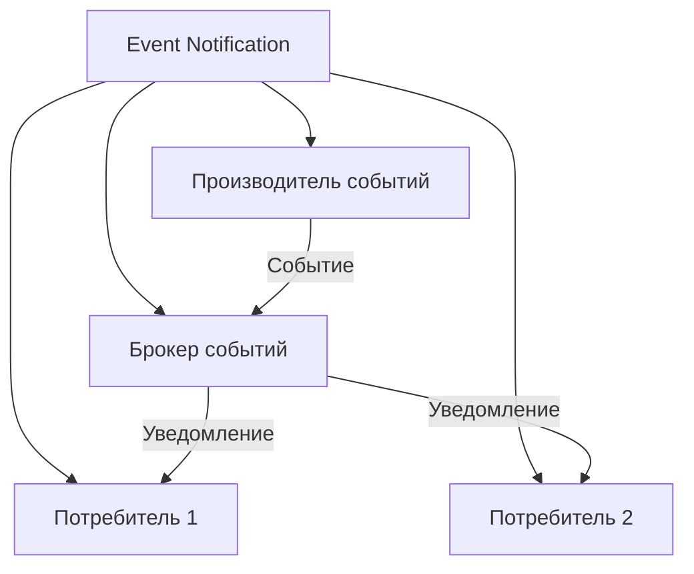
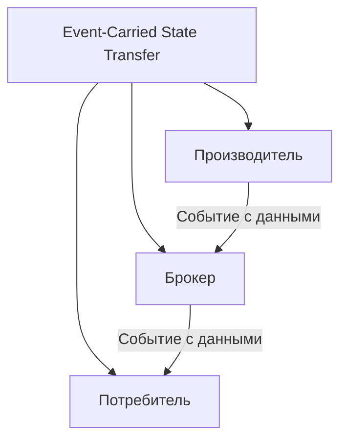
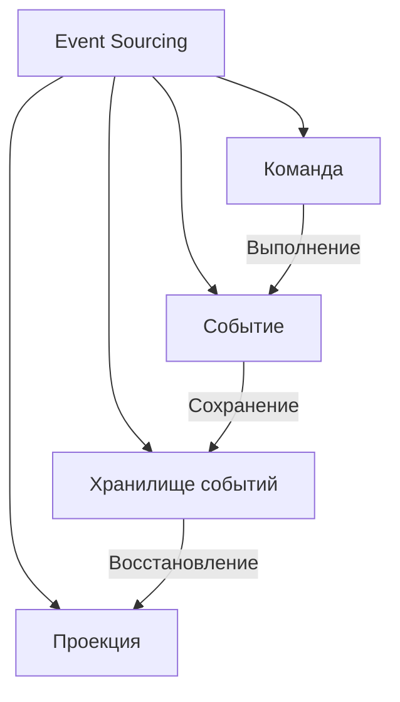
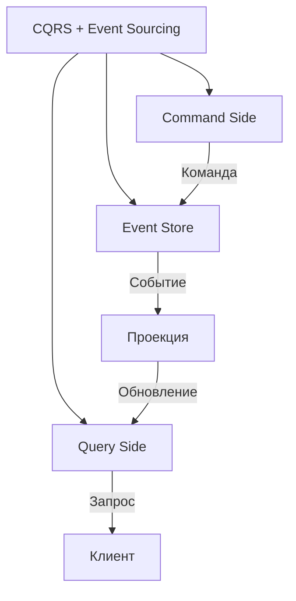
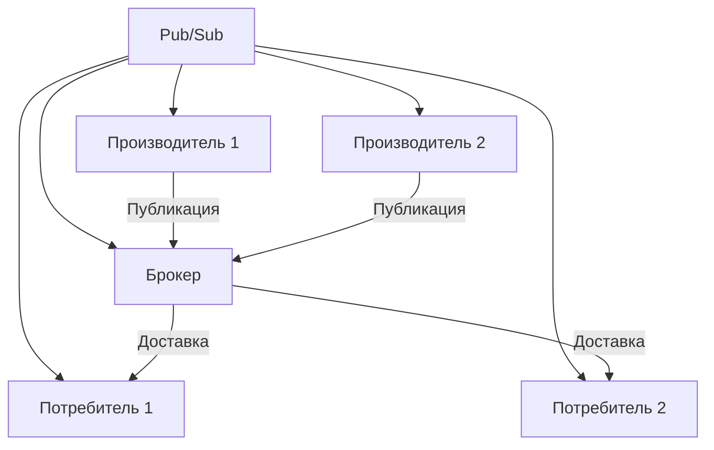
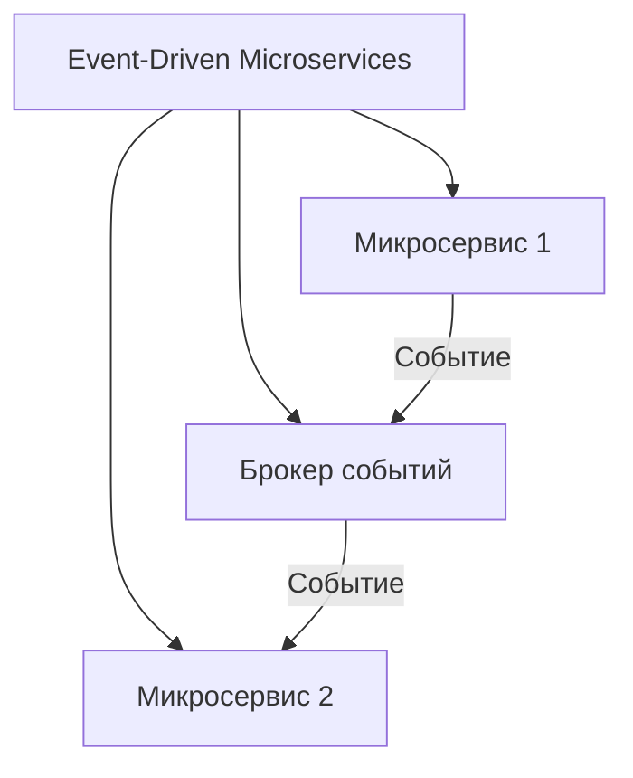

## **4. Архитектура на основе событий (Event-Driven Architecture, EDA)**


## Оглавление
- [**4. Архитектура на основе событий (Event-Driven Architecture, EDA)**](#4-архитектура-на-основе-событий-event-driven-architecture-eda)
  - [**Описание**](#описание)
- [**Подстили и шаблоны**](#подстили-и-шаблоны)
  - [**4.1. Event Notification**](#41-event-notification)
    - [**Описание**](#описание)
    - [**Преимущества**](#преимущества)
    - [**Пример**](#пример)
  - [**4.2. Event-Carried State Transfer**](#42-event-carried-state-transfer)
    - [**Описание**](#описание)
    - [**Преимущества**](#преимущества)
    - [**Пример**](#пример)
  - [**4.3. Event Sourcing**](#43-event-sourcing)
    - [**Описание**](#описание)
    - [**Преимущества**](#преимущества)
    - [**Недостатки**](#недостатки)
    - [**Пример**](#пример)
  - [**4.4. CQRS + Event Sourcing**](#44-cqrs-event-sourcing)
    - [**Описание**](#описание)
    - [**Преимущества**](#преимущества)
    - [**Пример**](#пример)
  - [**4.5. Pub/Sub (Publish-Subscribe)**](#45-pubsub-publish-subscribe)
    - [**Описание**](#описание)
    - [**Преимущества**](#преимущества)
    - [**Пример**](#пример)
  - [**4.6. Event-Driven Microservices**](#46-event-driven-microservices)
    - [**Описание**](#описание)
    - [**Преимущества**](#преимущества)
    - [**Пример**](#пример)
- [**Пример реализации на C# (Pub/Sub с RabbitMQ)**](#пример-реализации-на-c-pubsub-с-rabbitmq)
- [**Когда использовать EDA?**](#когда-использовать-eda)

  - [**Описание**](#описание)
  - [**4.1. Event Notification**](#41-event-notification)
    - [**Описание**](#описание)
    - [**Преимущества**](#преимущества)
    - [**Пример**](#пример)
  - [**4.2. Event-Carried State Transfer**](#42-event-carried-state-transfer)
    - [**Описание**](#описание)
    - [**Преимущества**](#преимущества)
    - [**Пример**](#пример)
  - [**4.3. Event Sourcing**](#43-event-sourcing)
    - [**Описание**](#описание)
    - [**Преимущества**](#преимущества)
    - [**Недостатки**](#недостатки)
    - [**Пример**](#пример)
  - [**4.4. CQRS + Event Sourcing**](#44-cqrs-event-sourcing)
    - [**Описание**](#описание)
    - [**Преимущества**](#преимущества)
    - [**Пример**](#пример)
  - [**4.5. Pub/Sub (Publish-Subscribe)**](#45-pubsub-publish-subscribe)
    - [**Описание**](#описание)
    - [**Преимущества**](#преимущества)
    - [**Пример**](#пример)
  - [**4.6. Event-Driven Microservices**](#46-event-driven-microservices)
    - [**Описание**](#описание)
    - [**Преимущества**](#преимущества)
    - [**Пример**](#пример)
### **Описание**
В EDA компоненты системы взаимодействуют через **события** — изменения состояния или действия, которые происходят в системе. Компоненты могут быть **производителями событий** (publishers) или **потребителями событий** (subscribers). События передаются через **брокеры сообщений** (например, Kafka, RabbitMQ) или **шины событий**.

---

## **Подстили и шаблоны**

---

### **4.1. Event Notification**
#### **Описание**
Сервисы **уведомляют** друг друга о событиях, но не ожидают ответа. Потребители реагируют на события асинхронно.



#### **Преимущества**
- Низкая связанность между компонентами.
- Гибкость и масштабируемость.

#### **Пример**
- Отправка email-уведомления после создания заказа.

---

### **4.2. Event-Carried State Transfer**
#### **Описание**
События содержат **достаточно данных** для обновления состояния потребителя. Это позволяет избежать дополнительных запросов к производителю.



#### **Преимущества**
- Уменьшение количества запросов между сервисами.
- Повышение производительности за счёт передачи всех необходимых данных в событии.

#### **Пример**
- Событие `OrderCreated` содержит полную информацию о заказе (ID, товары, сумма, адрес доставки).

---

### **4.3. Event Sourcing**
#### **Описание**
Все изменения состояния системы **хранятся как последовательность событий**. Текущее состояние можно восстановить, **переиграв все прошлые события**.



#### **Преимущества**
- Возможность восстановить состояние системы на любой момент времени.
- Полная история изменений для аудита и анализа.

#### **Недостатки**
- Сложность реализации и поддержки.
- Потенциальные проблемы с производительностью при восстановлении состояния из большого количества событий.

#### **Пример**
- Хранение истории изменений профиля пользователя (события: `UserCreated`, `UserUpdated`, `UserDeleted`).

---

### **4.4. CQRS + Event Sourcing**
#### **Описание**
**CQRS** (Command Query Responsibility Segregation) разделяет операции чтения и записи, а **Event Sourcing** хранит все изменения как события. Состояние для чтения обновляется через **проекции** (materialized views).



#### **Преимущества**
- Оптимизация производительности для чтения и записи.
- Возможность масштабировать чтение и запись независимо.

#### **Пример**
- Система заказов, где изменения записываются как события, а для чтения используются оптимизированные проекции.

---

### **4.5. Pub/Sub (Publish-Subscribe)**
#### **Описание**
Производители **публикуют события** в каналы (topics), а потребители **подписываются** на эти каналы. Брокер событий обеспечивает доставку сообщений всем подписчикам.



#### **Преимущества**
- Низкая связанность между производителями и потребителями.
- Возможность динамического добавления новых потребителей.

#### **Пример**
- **Kafka**, **RabbitMQ**, **AWS SNS/SQS**.

---

### **4.6. Event-Driven Microservices**
#### **Описание**
Микросервисы взаимодействуют друг с другом через **события**, а не через прямые вызовы API. Это позволяет достичь **асинхронности** и **масштабируемости**.



#### **Преимущества**
- Асинхронное взаимодействие между сервисами.
- Устойчивость к сбоям (если один сервис недоступен, события могут быть обработаны позже).

#### **Пример**
- Микросервис "Заказы" отправляет событие `OrderCreated`, а микросервис "Уведомления" реагирует на это событие и отправляет email пользователю.

---

## **Пример реализации на C# (Pub/Sub с RabbitMQ)**
```csharp
// Пример производителя событий
public class OrderProducer
{
    private readonly IConnection _connection;
    private readonly IModel _channel;

    public OrderProducer()
    {
        var factory = new ConnectionFactory() { HostName = "localhost" };
        _connection = factory.CreateConnection();
        _channel = _connection.CreateModel();
        _channel.QueueDeclare(queue: "orders", durable: false, exclusive: false, autoDelete: false, arguments: null);
    }

    public void SendOrderCreated(Order order)
    {
        var body = Encoding.UTF8.GetBytes(JsonSerializer.Serialize(order));
        _channel.BasicPublish(exchange: "", routingKey: "orders", basicProperties: null, body: body);
    }
}

// Пример потребителя событий
public class OrderConsumer
{
    private readonly IConnection _connection;
    private readonly IModel _channel;

    public OrderConsumer()
    {
        var factory = new ConnectionFactory() { HostName = "localhost" };
        _connection = factory.CreateConnection();
        _channel = _connection.CreateModel();
        _channel.QueueDeclare(queue: "orders", durable: false, exclusive: false, autoDelete: false, arguments: null);
    }

    public void StartConsuming()
    {
        var consumer = new EventingBasicConsumer(_channel);
        consumer.Received += (model, ea) =>
        {
            var body = ea.Body.ToArray();
            var order = JsonSerializer.Deserialize<Order>(body);
            Console.WriteLine($"Получен заказ: {order.Id}");
        };
        _channel.BasicConsume(queue: "orders", autoAck: true, consumer: consumer);
    }
}
```

---

## **Когда использовать EDA?**
- Когда требуется **асинхронное взаимодействие** между компонентами.
- Если важна **масштабируемость** и **устойчивость к сбоям**.
- Для систем, где важна **гибкость** и **низкая связанность** (например, IoT, аналитика в реальном времени).