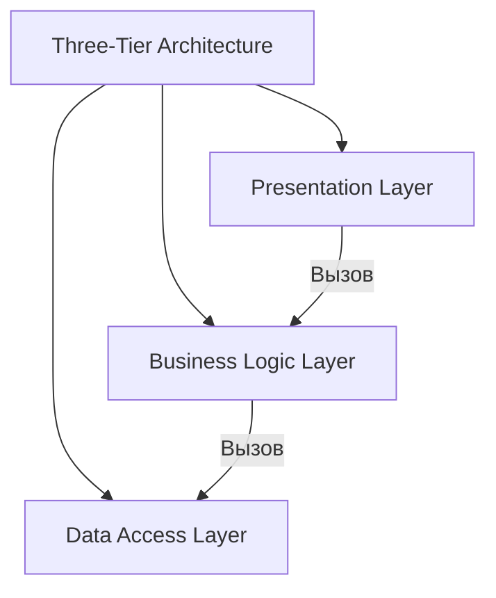
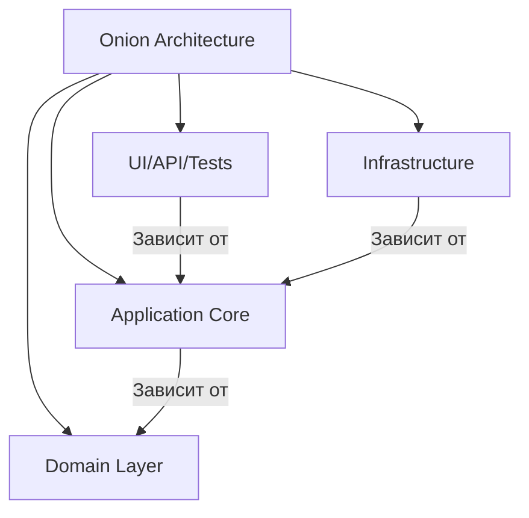
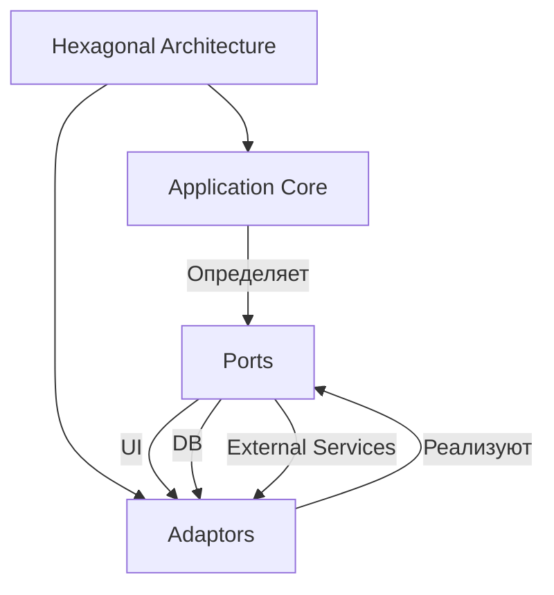
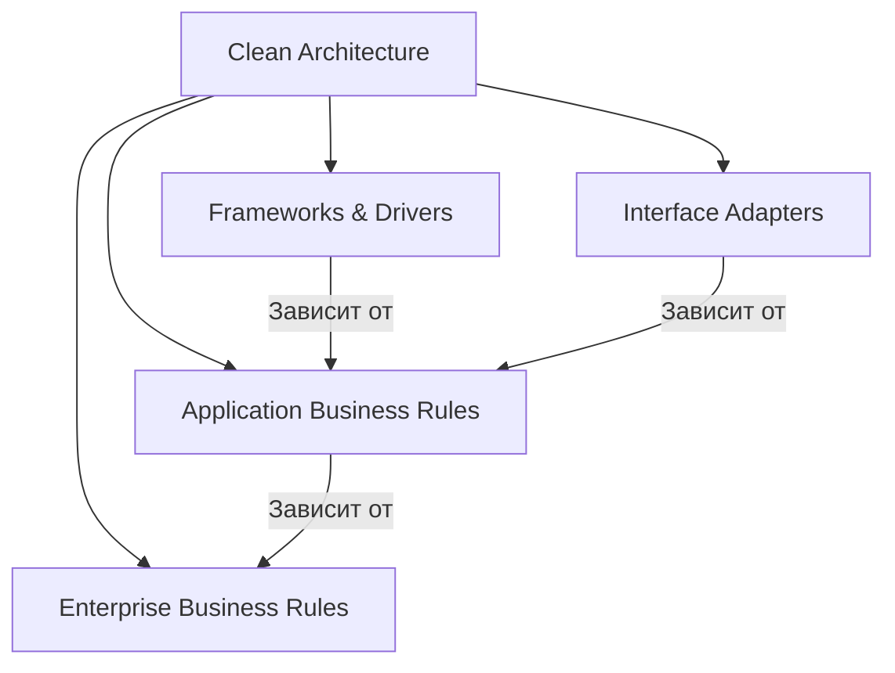
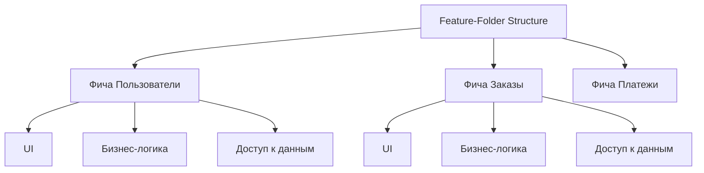

## **5. Многослойная архитектура (Layered Architecture, N-Tier)**


## Оглавление
- [**5. Многослойная архитектура (Layered Architecture, N-Tier)**](#5-многослойная-архитектура-layered-architecture-n-tier)
  - [**Описание**](#описание)
- [**Подстили и шаблоны**](#подстили-и-шаблоны)
  - [**5.1. Three-Tier Architecture (Трёхслойная архитектура)**](#51-three-tier-architecture-трёхслойная-архитектура)
    - [**Описание**](#описание)
    - [**Преимущества**](#преимущества)
    - [**Недостатки**](#недостатки)
    - [**Пример**](#пример)
  - [**5.2. Onion Architecture (Луковая архитектура)**](#52-onion-architecture-луковая-архитектура)
    - [**Описание**](#описание)
    - [**Слои**](#слои)
    - [**Преимущества**](#преимущества)
    - [**Пример**](#пример)
  - [**5.3. Ports and Adapters (Hexagonal Architecture)**](#53-ports-and-adapters-hexagonal-architecture)
    - [**Описание**](#описание)
    - [**Компоненты**](#компоненты)
    - [**Преимущества**](#преимущества)
    - [**Пример**](#пример)
  - [**5.4. Clean Architecture**](#54-clean-architecture)
    - [**Описание**](#описание)
    - [**Слои**](#слои)
    - [**Преимущества**](#преимущества)
    - [**Пример**](#пример)
  - [**5.5. Feature-Folder Structure**](#55-feature-folder-structure)
    - [**Описание**](#описание)
    - [**Преимущества**](#преимущества)
    - [**Пример**](#пример)
- [**Пример реализации на C# (Onion Architecture)**](#пример-реализации-на-c-onion-architecture)
- [**Когда использовать многослойную архитектуру?**](#когда-использовать-многослойную-архитектуру)

  - [**Описание**](#описание)
  - [**5.1. Three-Tier Architecture (Трёхслойная архитектура)**](#51-three-tier-architecture-трёхслойная-архитектура)
    - [**Описание**](#описание)
    - [**Преимущества**](#преимущества)
    - [**Недостатки**](#недостатки)
    - [**Пример**](#пример)
  - [**5.2. Onion Architecture (Луковая архитектура)**](#52-onion-architecture-луковая-архитектура)
    - [**Описание**](#описание)
    - [**Слои**](#слои)
    - [**Преимущества**](#преимущества)
    - [**Пример**](#пример)
  - [**5.3. Ports and Adapters (Hexagonal Architecture)**](#53-ports-and-adapters-hexagonal-architecture)
    - [**Описание**](#описание)
    - [**Компоненты**](#компоненты)
    - [**Преимущества**](#преимущества)
    - [**Пример**](#пример)
  - [**5.4. Clean Architecture**](#54-clean-architecture)
    - [**Описание**](#описание)
    - [**Слои**](#слои)
    - [**Преимущества**](#преимущества)
    - [**Пример**](#пример)
  - [**5.5. Feature-Folder Structure**](#55-feature-folder-structure)
    - [**Описание**](#описание)
    - [**Преимущества**](#преимущества)
    - [**Пример**](#пример)
### **Описание**
Многослойная архитектура предполагает разделение приложения на **несколько слоёв**, каждый из которых выполняет определённую роль. Основная идея — **разделение ответственности** между слоями, что упрощает поддержку, тестирование и развитие системы.

---

## **Подстили и шаблоны**

---

### **5.1. Three-Tier Architecture (Трёхслойная архитектура)**
#### **Описание**
Классическое разделение на **три слоя**:
1. **Presentation Layer** (UI, API) — взаимодействие с пользователем.
2. **Business Logic Layer** — бизнес-правила и логика приложения.
3. **Data Access Layer** — работа с базой данных или другими источниками данных.



#### **Преимущества**
- Чёткое разделение ответственности.
- Простота тестирования и поддержки.

#### **Недостатки**
- Может превратиться в "большой комок грязи" (Big Ball of Mud), если слои сильно связаны.
- Сложно масштабировать отдельные слои.

#### **Пример**
- Веб-приложение на **ASP.NET Core** с фронтендом на **React**, бэкендом на **C#** и базой данных **SQL Server**.

---

### **5.2. Onion Architecture (Луковая архитектура)**
#### **Описание**
Приложение организовано в **концентрические слои**, где **внутренние слои не зависят от внешних**. Бизнес-логика находится в центре, а инфраструктура (базы данных, фреймворки) — на внешнем слое.



#### **Слои**
- **UI/API/Tests** — внешний слой.
- **Infrastructure** — базы данных, фреймворки, внешние сервисы.
- **Application Core** — юзкейсы, интерфейсы.
- **Domain Layer** — бизнес-логика, сущности.

#### **Преимущества**
- Высокая тестируемость и гибкость.
- Лёгкость замены внешних компонентов (например, базы данных).

#### **Пример**
- Приложения, где важна долговременная поддержка и независимость от технологий.

---

### **5.3. Ports and Adapters (Hexagonal Architecture)**
#### **Описание**
Приложение разделено на **ядро** (бизнес-логика) и **адаптеры** (интерфейсы для взаимодействия с внешним миром). Позволяет легко заменять адаптеры (например, базу данных или UI).



#### **Компоненты**
- **Application Core** — бизнес-логика, доменные модели.
- **Ports** — интерфейсы для взаимодействия с внешним миром.
- **Adaptors** — реализации портов (UI, базы данных, внешние сервисы).

#### **Преимущества**
- Низкая связанность.
- Легкость тестирования и замены компонентов.

#### **Пример**
- Замена **SQL-базы** на **MongoDB** без изменений в бизнес-логике.

---

### **5.4. Clean Architecture**
#### **Описание**
Разработана **Робертом Мартином** (Uncle Bob). Приложение организовано в **концентрические слои**, где **внутренние слои не зависят от внешних**. Бизнес-логика изолирована от фреймворков и интерфейсов.



#### **Слои**
- **Frameworks & Drivers** — UI, базы данных, фреймворки.
- **Interface Adapters** — адаптеры для взаимодействия с внешним миром.
- **Application Business Rules** — юзкейсы, бизнес-правила приложения.
- **Enterprise Business Rules** — бизнес-логика, сущности.

#### **Преимущества**
- Высокая тестируемость и гибкость.
- Лёгкость замены внешних компонентов.

#### **Пример**
- Проекты с долгим жизненным циклом, где важна поддержка.

---

### **5.5. Feature-Folder Structure**
#### **Описание**
Код организован **по функциональным возможностям** (фичам), а не по слоям. Каждая фича содержит все необходимые слои (UI, бизнес-логика, доступ к данным) в одной папке.



#### **Преимущества**
- Упрощает навигацию по коду для конкретной фичи.
- Легче поддерживать и развивать отдельные функциональные возможности.

#### **Пример**
- Проекты на **ASP.NET Core**, где код организован по фичам (например, `Users`, `Orders`, `Payments`).

---

## **Пример реализации на C# (Onion Architecture)**
```csharp
// Пример структуры проекта в Onion Architecture

// 1. Domain Layer (внутренний слой)
namespace Domain
{
    public class User
    {
        public int Id { get; set; }
        public string Name { get; set; }
    }

    public interface IUserRepository
    {
        User GetById(int id);
        void Add(User user);
    }
}

// 2. Application Core (юзкейсы)
namespace Application
{
    public class UserService
    {
        private readonly IUserRepository _userRepository;

        public UserService(IUserRepository userRepository)
        {
            _userRepository = userRepository;
        }

        public User GetUser(int id)
        {
            return _userRepository.GetById(id);
        }
    }
}

// 3. Infrastructure (внешний слой)
namespace Infrastructure
{
    public class UserRepository : IUserRepository
    {
        public User GetById(int id)
        {
            // Логика доступа к базе данных
            return new User { Id = id, Name = "Dima" };
        }

        public void Add(User user)
        {
            // Логика сохранения пользователя
        }
    }
}

// 4. Presentation Layer (UI/API)
namespace Presentation
{
    public class UserController
    {
        private readonly UserService _userService;

        public UserController(UserService userService)
        {
            _userService = userService;
        }

        public User GetUser(int id)
        {
            return _userService.GetUser(id);
        }
    }
}
```

---

## **Когда использовать многослойную архитектуру?**
- Для **корпоративных приложений**, где важна структура и разделение ответственности.
- Когда требуется **чёткое разделение** между UI, бизнес-логикой и доступом к данным.
- Если проект **сложный** и требует долговременной поддержки.