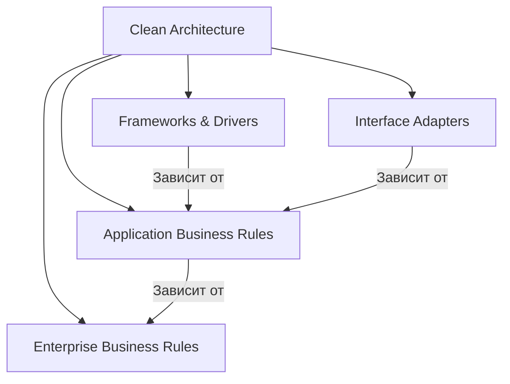
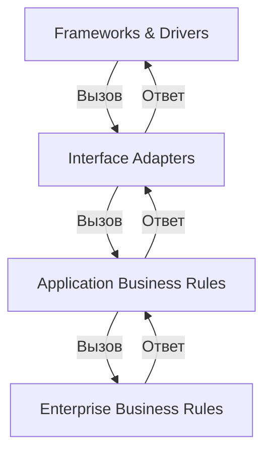

## **7. Чистая архитектура (Clean Architecture)**

### **Описание**
Clean Architecture организует приложение в **концентрические слои**, где **внутренние слои не зависят от внешних**. Основная идея — **изолировать бизнес-логику** от деталей реализации (фреймворков, баз данных, UI). Это позволяет легко менять технологии и тестировать систему.

---

## **Основные принципы Clean Architecture**
1. **Независимость от фреймворков**: Бизнес-логика не зависит от внешних библиотек и фреймворков.
2. **Тестируемость**: Бизнес-логика легко тестируется без зависимости от UI, базы данных или внешних сервисов.
3. **Независимость от UI**: UI можно легко заменить (например, с веб на мобильное приложение).
4. **Независимость от базы данных**: Базу данных можно заменить без изменений в бизнес-логике.
5. **Независимость от внешних агентов**: Внешние сервисы (например, платежные системы) не влияют на бизнес-логику.

---

## **Слои Clean Architecture**



---

### **7.1. Enterprise Business Rules (внутренний слой)**
#### **Описание**
Содержит **бизнес-сущности** и **бизнес-правила**, которые являются **ядром** приложения. Этот слой **не зависит ни от чего** и содержит самую важную логику.

#### **Пример**
- Сущности: `User`, `Order`, `Product`.
- Бизнес-правила: "Пользователь не может создать заказ без адреса доставки".

```csharp
// Пример сущности User
public class User
{
    public int Id { get; private set; }
    public string Name { get; private set; }
    public string Email { get; private set; }

    public User(string name, string email)
    {
        if (string.IsNullOrEmpty(name))
            throw new ArgumentException("Имя пользователя не может быть пустым.");

        Name = name;
        Email = email;
    }
}
```

---

### **7.2. Application Business Rules**
#### **Описание**
Содержит **юзкейсы** (use cases) — сценарии использования системы. Этот слой зависит от **Enterprise Business Rules**, но не знает о деталях реализации (UI, базы данных).

#### **Пример**
- Юзкейсы: `CreateUser`, `GetUserById`, `PlaceOrder`.

```csharp
// Пример юзкейса CreateUser
public class CreateUserUseCase
{
    private readonly IUserRepository _userRepository;

    public CreateUserUseCase(IUserRepository userRepository)
    {
        _userRepository = userRepository;
    }

    public void Execute(string name, string email)
    {
        var user = new User(name, email);
        _userRepository.Save(user);
    }
}
```

---

### **7.3. Interface Adapters**
#### **Описание**
Содержит **адаптеры**, которые преобразуют данные из форматов, удобных для внешних слоёв (UI, базы данных), в формат, понятный бизнес-логике, и наоборот.

#### **Пример**
- **Контроллеры** (для веб-приложений).
- **Репозитории** (для работы с базой данных).
- **DTO (Data Transfer Objects)**.

```csharp
// Пример адаптера — контроллер для веб-приложения
[ApiController]
[Route("api/users")]
public class UsersController : ControllerBase
{
    private readonly CreateUserUseCase _createUserUseCase;

    public UsersController(CreateUserUseCase createUserUseCase)
    {
        _createUserUseCase = createUserUseCase;
    }

    [HttpPost]
    public IActionResult CreateUser([FromBody] CreateUserRequest request)
    {
        _createUserUseCase.Execute(request.Name, request.Email);
        return Ok();
    }
}
```

---

### **7.4. Frameworks & Drivers (внешний слой)**
#### **Описание**
Содержит **детали реализации**: фреймворки, UI, базы данных, внешние сервисы. Этот слой зависит от **Interface Adapters** и **Application Business Rules**, но не влияет на бизнес-логику.

#### **Пример**
- **ASP.NET Core** (для веб-приложений).
- **Entity Framework Core** (для работы с базой данных).
- **External APIs** (платежные системы, email-сервисы).

```csharp
// Пример реализации репозитория с использованием Entity Framework
public class UserRepository : IUserRepository
{
    private readonly AppDbContext _context;

    public UserRepository(AppDbContext context)
    {
        _context = context;
    }

    public void Save(User user)
    {
        _context.Users.Add(user);
        _context.SaveChanges();
    }
}
```

---

## **Взаимодействие между слоями**



---

## **Преимущества Clean Architecture**
1. **Независимость от фреймворков**: Легко заменить фреймворк или технологию (например, перейти с ASP.NET на Node.js).
2. **Тестируемость**: Бизнес-логика легко тестируется без зависимости от UI или базы данных.
3. **Гибкость**: Можно легко менять UI или базу данных без изменений в бизнес-логике.
4. **Поддерживаемость**: Чёткое разделение ответственности упрощает поддержку и развитие системы.

---

## **Недостатки Clean Architecture**
1. **Сложность**: Требует строгой дисциплины и понимания принципов.
2. **Избыточность**: Может показаться избыточным для небольших проектов.
3. **Кривая обучения**: Разработчикам требуется время, чтобы освоить подход.

---

## **Пример структуры проекта на C#**
```
Project/
├── Domain/               # Enterprise Business Rules
│   ├── Entities/         # Сущности (User, Order)
│   └── Exceptions/       # Исключения
├── Application/          # Application Business Rules
│   ├── UseCases/         # Юзкейсы (CreateUser, GetUserById)
│   └── Interfaces/       # Интерфейсы репозиториев
├── Infrastructure/       # Interface Adapters
│   ├── Repositories/     # Реализации репозиториев
│   └── Services/         # Внешние сервисы
└── Presentation/         # Frameworks & Drivers
    ├── Controllers/      # Контроллеры API
    └── Models/           # Модели DTO
```

---

## **Когда использовать Clean Architecture?**
- Для **крупных проектов** с долгим жизненным циклом.
- Когда важна **гибкость** и **независимость от технологий**.
- Если требуется **высокая тестируемость** и **поддерживаемость**.