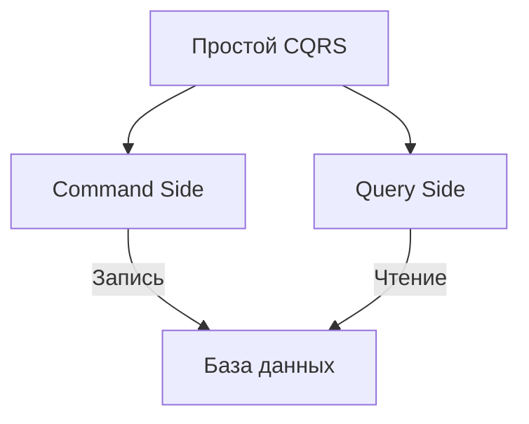
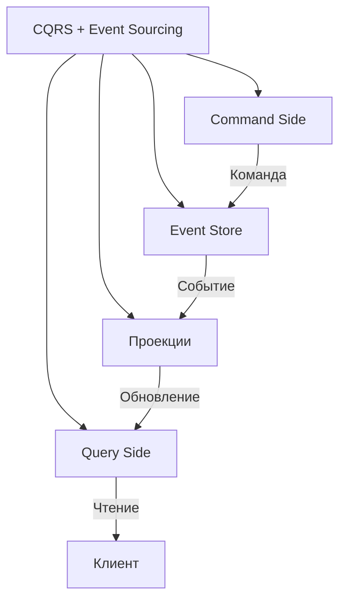
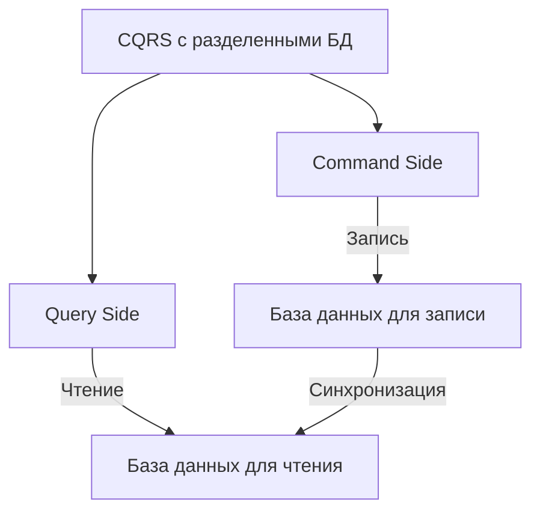
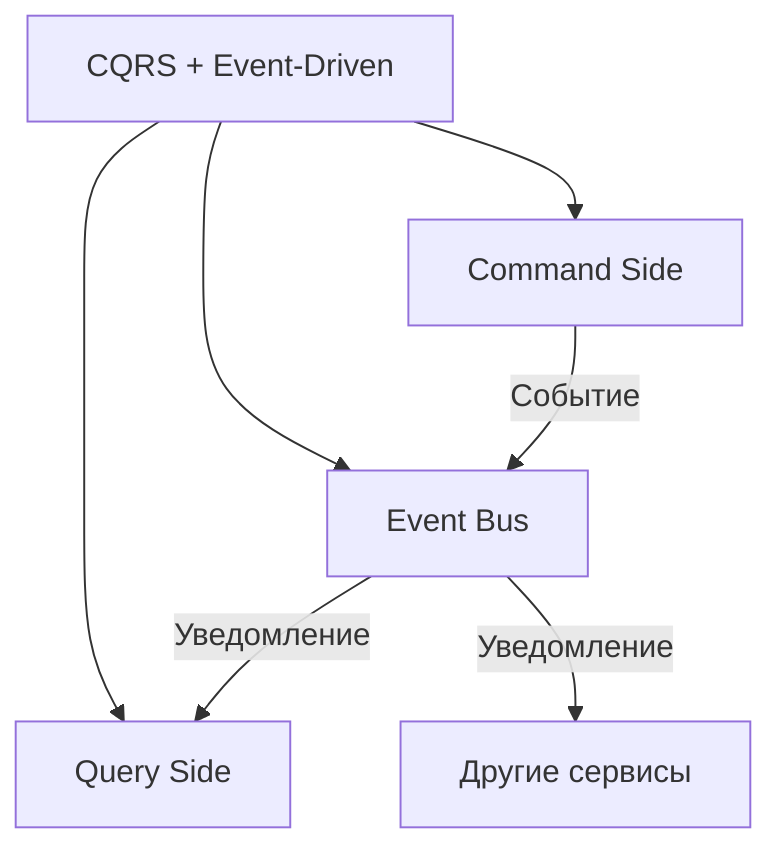

## **8. CQRS (Command Query Responsibility Segregation)**


## Оглавление
- [**8. CQRS (Command Query Responsibility Segregation)**](#8-cqrs-command-query-responsibility-segregation)
  - [**Описание**](#описание)
- [**Подстили и шаблоны CQRS**](#подстили-и-шаблоны-cqrs)
  - [**8.1. Простой CQRS (без Event Sourcing)**](#81-простой-cqrs-без-event-sourcing)
    - [**Описание**](#описание)
    - [**Преимущества**](#преимущества)
    - [**Пример**](#пример)
  - [**8.2. CQRS с Event Sourcing**](#82-cqrs-с-event-sourcing)
    - [**Описание**](#описание)
    - [**Преимущества**](#преимущества)
    - [**Недостатки**](#недостатки)
    - [**Пример**](#пример)
  - [**8.3. CQRS с разделенными базами данных**](#83-cqrs-с-разделенными-базами-данных)
    - [**Описание**](#описание)
    - [**Преимущества**](#преимущества)
    - [**Недостатки**](#недостатки)
    - [**Пример**](#пример)
  - [**8.4. CQRS с Event-Driven Architecture**](#84-cqrs-с-event-driven-architecture)
    - [**Описание**](#описание)
    - [**Преимущества**](#преимущества)
    - [**Пример**](#пример)
- [**Пример реализации CQRS на C#**](#пример-реализации-cqrs-на-c)
  - [**1. Command Side (запись)**](#1-command-side-запись)
  - [**2. Query Side (чтение)**](#2-query-side-чтение)
  - [**3. Проекция (обновление данных для чтения)**](#3-проекция-обновление-данных-для-чтения)
- [**Когда использовать CQRS?**](#когда-использовать-cqrs)

  - [**Описание**](#описание)
  - [**8.1. Простой CQRS (без Event Sourcing)**](#81-простой-cqrs-без-event-sourcing)
    - [**Описание**](#описание)
    - [**Преимущества**](#преимущества)
    - [**Пример**](#пример)
  - [**8.2. CQRS с Event Sourcing**](#82-cqrs-с-event-sourcing)
    - [**Описание**](#описание)
    - [**Преимущества**](#преимущества)
    - [**Недостатки**](#недостатки)
    - [**Пример**](#пример)
  - [**8.3. CQRS с разделенными базами данных**](#83-cqrs-с-разделенными-базами-данных)
    - [**Описание**](#описание)
    - [**Преимущества**](#преимущества)
    - [**Недостатки**](#недостатки)
    - [**Пример**](#пример)
  - [**8.4. CQRS с Event-Driven Architecture**](#84-cqrs-с-event-driven-architecture)
    - [**Описание**](#описание)
    - [**Преимущества**](#преимущества)
    - [**Пример**](#пример)
  - [**1. Command Side (запись)**](#1-command-side-запись)
  - [**2. Query Side (чтение)**](#2-query-side-чтение)
  - [**3. Проекция (обновление данных для чтения)**](#3-проекция-обновление-данных-для-чтения)
### **Описание**
CQRS предполагает **разделение операций чтения (Query)** и **записи (Command)** данных. Это позволяет оптимизировать каждую часть системы независимо:
- **Commands** — операции, которые изменяют состояние системы (например, создание, обновление, удаление).
- **Queries** — операции, которые только читают данные (например, получение списка пользователей, поиск заказа).

---

## **Подстили и шаблоны CQRS**

---

### **8.1. Простой CQRS (без Event Sourcing)**
#### **Описание**
Операции чтения и записи используют **разные модели данных**, но работают с одной базой данных. Это упрощает реализацию и поддерживает согласованность данных.



#### **Преимущества**
- Простота реализации.
- Возможность оптимизировать чтение и запись независимо.

#### **Пример**
- **Command Side**: Использует реляционную базу данных (например, **PostgreSQL**) для записи.
- **Query Side**: Использует ту же базу данных, но с оптимизированными запросами для чтения.

---

### **8.2. CQRS с Event Sourcing**
#### **Описание**
Все изменения состояния системы **хранятся как события** в **хранилище событий (Event Store)**. Текущее состояние восстанавливается путём **переигрывания всех событий**. Для чтения используются **проекции (materialized views)**, которые обновляются при добавлении новых событий.



#### **Преимущества**
- Полная история изменений для аудита и анализа.
- Возможность восстановить состояние системы на любой момент времени.
- Оптимизация чтения и записи независимо.

#### **Недостатки**
- Сложность реализации и поддержки.
- Потенциальные проблемы с производительностью при восстановлении состояния из большого количества событий.

#### **Пример**
- **Command Side**: Записывает события (например, `OrderCreated`, `OrderPaid`) в **Event Store**.
- **Query Side**: Использует проекции (например, **Elasticsearch** или **MongoDB**) для быстрого чтения данных.

---

### **8.3. CQRS с разделенными базами данных**
#### **Описание**
Операции чтения и записи используют **разные базы данных**, оптимизированные под свои задачи:
- **Command Side**: Использует базу данных, оптимизированную для записи (например, **PostgreSQL**).
- **Query Side**: Использует базу данных, оптимизированную для чтения (например, **Elasticsearch** или **MongoDB**).



#### **Преимущества**
- Оптимизация производительности для чтения и записи.
- Возможность масштабировать чтение и запись независимо.

#### **Недостатки**
- Сложность синхронизации данных между базами.
- Потенциальные проблемы с согласованностью данных.

#### **Пример**
- **Command Side**: Использует **PostgreSQL** для записи заказов.
- **Query Side**: Использует **Elasticsearch** для поиска и фильтрации заказов.

---

### **8.4. CQRS с Event-Driven Architecture**
#### **Описание**
CQRS интегрируется с **Event-Driven Architecture**, где изменения состояния распространяются через **события**. Это позволяет сервисам реагировать на изменения асинхронно.



#### **Преимущества**
- Асинхронное взаимодействие между компонентами.
- Возможность интеграции с другими сервисами через события.

#### **Пример**
- **Command Side**: Отправляет событие `OrderCreated` в **Kafka**.
- **Query Side**: Подписывается на событие `OrderCreated` и обновляет проекцию для чтения.

---

## **Пример реализации CQRS на C#**

### **1. Command Side (запись)**
```csharp
// Команда для создания заказа
public class CreateOrderCommand
{
    public int UserId { get; set; }
    public List<OrderItem> Items { get; set; }
}

// Обработчик команды
public class CreateOrderCommandHandler
{
    private readonly IEventStore _eventStore;

    public CreateOrderCommandHandler(IEventStore eventStore)
    {
        _eventStore = eventStore;
    }

    public void Handle(CreateOrderCommand command)
    {
        var orderCreatedEvent = new OrderCreatedEvent
        {
            OrderId = Guid.NewGuid(),
            UserId = command.UserId,
            Items = command.Items
        };

        _eventStore.Save(orderCreatedEvent);
    }
}
```

---

### **2. Query Side (чтение)**
```csharp
// Запрос для получения заказа
public class GetOrderQuery
{
    public Guid OrderId { get; set; }
}

// Обработчик запроса
public class GetOrderQueryHandler
{
    private readonly IOrderViewRepository _orderViewRepository;

    public GetOrderQueryHandler(IOrderViewRepository orderViewRepository)
    {
        _orderViewRepository = orderViewRepository;
    }

    public OrderView Handle(GetOrderQuery query)
    {
        return _orderViewRepository.GetById(query.OrderId);
    }
}
```

---

### **3. Проекция (обновление данных для чтения)**
```csharp
// Проекция для обновления данных для чтения
public class OrderProjection
{
    private readonly IOrderViewRepository _orderViewRepository;

    public OrderProjection(IOrderViewRepository orderViewRepository)
    {
        _orderViewRepository = orderViewRepository;
    }

    public void Project(OrderCreatedEvent @event)
    {
        var orderView = new OrderView
        {
            OrderId = @event.OrderId,
            UserId = @event.UserId,
            Items = @event.Items
        };

        _orderViewRepository.Save(orderView);
    }
}
```

---

## **Когда использовать CQRS?**
- Когда требуется **оптимизировать производительность** чтения и записи.
- Если система имеет **сложные бизнес-правила** и требует гибкости в обработке данных.
- Для систем, где важна **аудируемость** и **восстановление состояния** (например, финансовые системы, системы управления заказами).