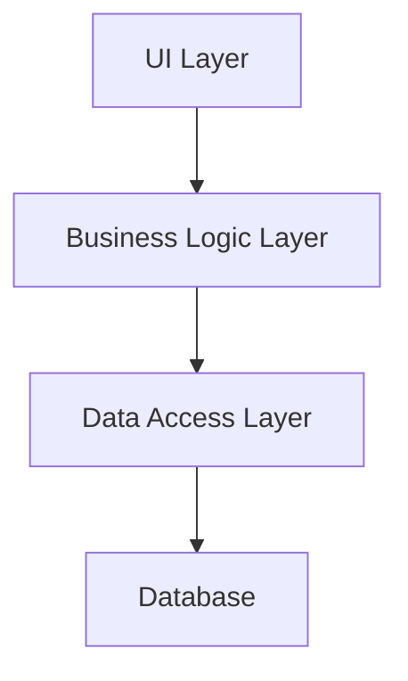
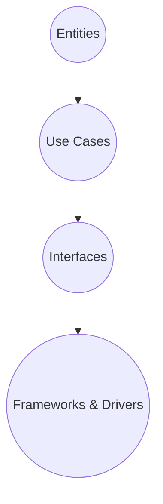
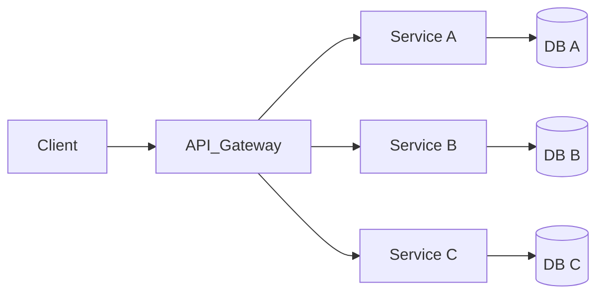
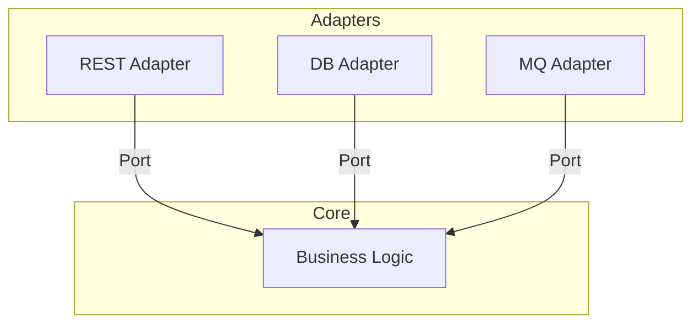
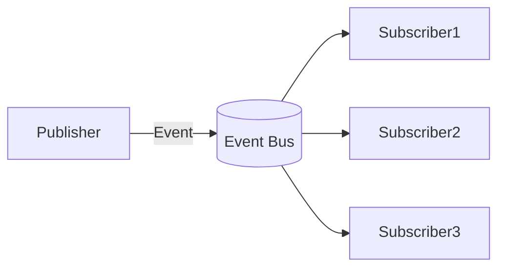
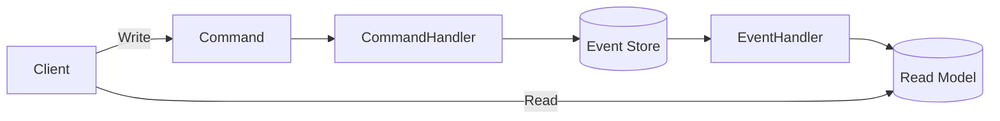
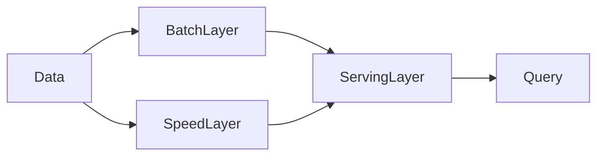
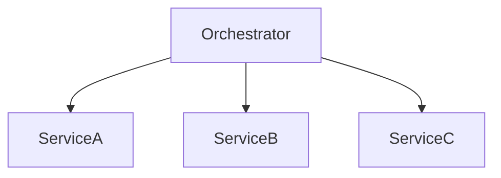
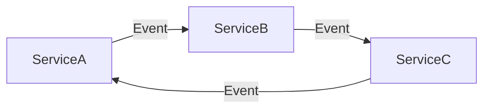

## 🔑 Основные архитектурные стили и паттерны

### 1. **Многослойный (n-tier) паттерн**
- Разделение приложения на слои: представление, бизнес-логика, данные.
- Часто используется в веб-приложениях.

### 2. **Чистая архитектура / Onion Architecture**
- Зависимости направлены внутрь: ядро не зависит от внешних слоёв.
- Обеспечивает тестируемость и независимость от фреймворков/БД.

### 3. **Объектно-ориентированный паттерн**
- Строится на принципах ООП: инкапсуляция, наследование, полиморфизм.

### 4. **Микроядро (Microkernel)**
- Минимальное ядро + плагины для расширения функциональности.
- Хорошо подходит для систем с изменяющимися требованиями.

### 5. **Плагин (Plugin)**
- Расширение функционала через подключаемые модули.
- Часто используется вместе с микроядром.

### 6. **Сервис-ориентированная архитектура (SOA)**
- Приложение состоит из слабосвязанных сервисов, взаимодействующих через интерфейсы.

### 7. **Брокер (Broker)**
- Посредник между компонентами, упрощает коммуникацию и маршрутизацию.

### 8. **Микросервисы**
- Каждый сервис — независимое приложение со своей БД и логикой.
- Высокая масштабируемость, но сложность в управлении.

### 9. **Бессерверный (Serverless / FaaS)**
- Логика выполняется в виде функций, запускаемых по событиям.
- Провайдер управляет инфраструктурой.

### 10. **Пространство данных (Space-Based)**
- Использует распределённое хранилище (tuple space) для обмена данными.
- Подходит для высоконагруженных систем.

### 11. **Одноранговая сеть (P2P)**
- Все узлы равноправны, нет центрального сервера.
- Пример: торрент-сети.

### 12. **Шестигранная архитектура (Hexagonal / Ports & Adapters)**
- Ядро приложения отделено от внешних систем через порты и адаптеры.
- Упрощает тестирование и замену внешних зависимостей.

### 13. **Предметно-ориентированное проектирование (DDD)**
- Фокус на предметной области, моделирование бизнес-логики.
- Часто комбинируется с CQRS, Event Sourcing.

### 14. **Событийно-ориентированная архитектура (Event-Driven)**
- Компоненты реагируют на события.
- Поддерживает асинхронность и децентрализацию.

### 15. **Издатель-подписчик (Pub-Sub)**
- Подмножество событийно-ориентированной архитектуры.
- Издатели отправляют сообщения, подписчики получают.

### 16. **MVP (Model-View-Presenter)**
- UI-паттерн для разделения логики и представления.

### 17. **Переводчик (Interpreter)**
- Паттерн для обработки языков/выражений (например, DSL).

### 18. **Оркестрация (Orchestration)**
- Централизованное управление взаимодействием сервисов.

### 19. **Хореография (Choreography)**
- Децентрализованное взаимодействие: каждый сервис реагирует на события.

### 20. **Primary-Secondary (Главный-Вспомогательный)**
- Репликация данных: один основной узел, остальные — резервные.

### 21. **CQRS (Command Query Responsibility Segregation)**
- Разделение операций записи (команд) и чтения (запросов).

### 22. **Event Sourcing (Летопись событий)**
- Состояние системы восстанавливается из последовательности событий.

### 23. **Kappa-архитектура**
- Обработка данных только через потоковую обработку (streaming).

### 24. **Lambda-архитектура**
- Гибрид потоковой и пакетной обработки данных.

---

## 📊 Схемы в формате Mermaid

### 1. **Многослойная архитектура (n-tier)**

---

### 2. **Чистая архитектура / Onion**

---

### 3. **Микросервисы**

---

### 4. **Шестигранная архитектура**

---

### 5. **Событийно-ориентированная архитектура (Pub-Sub)**

---

### 6. **CQRS + Event Sourcing**

---

### 7. **Lambda-архитектура**

---

### 8. **Kappa-архитектура**

---

### 9. **Оркестрация vs Хореография**

#### Оркестрация:

#### Хореография:

---