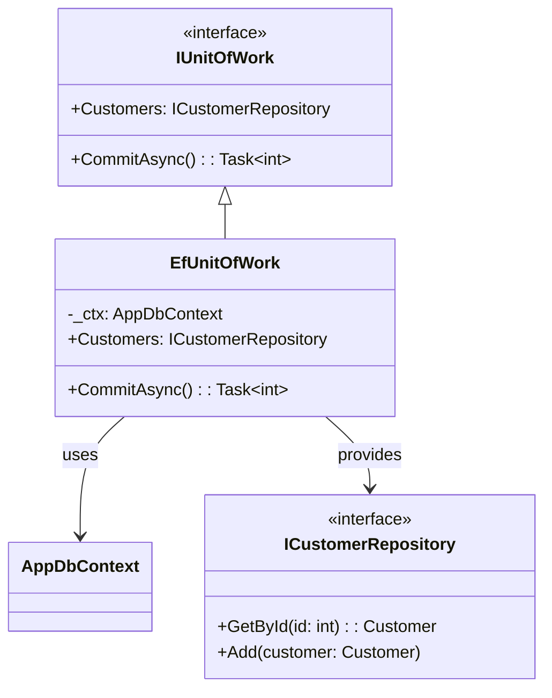
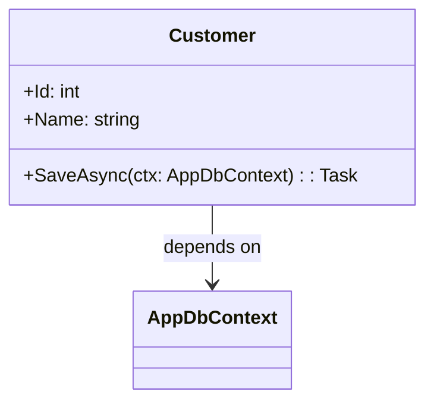
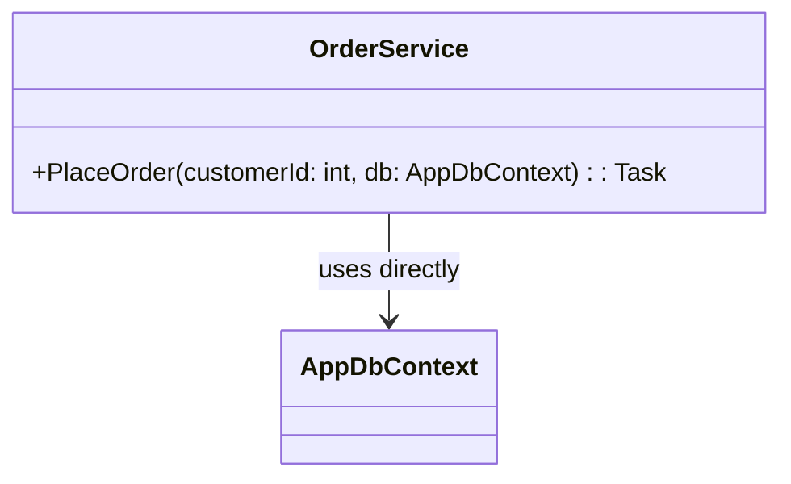
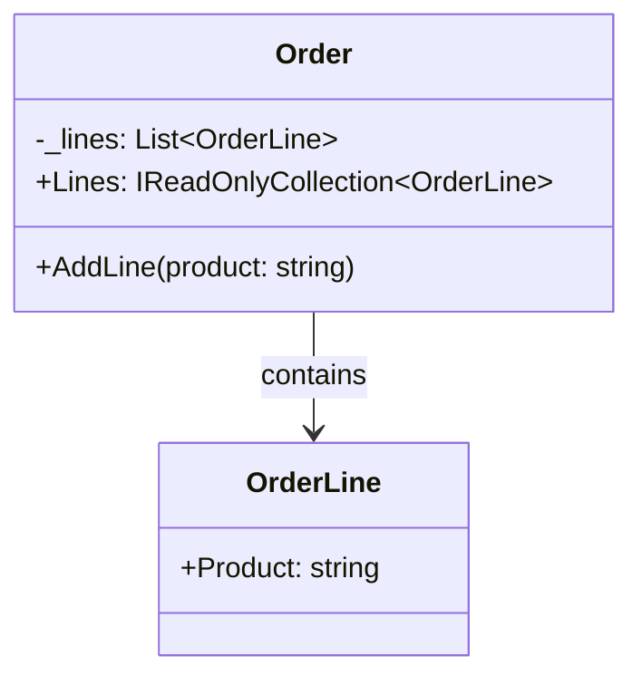
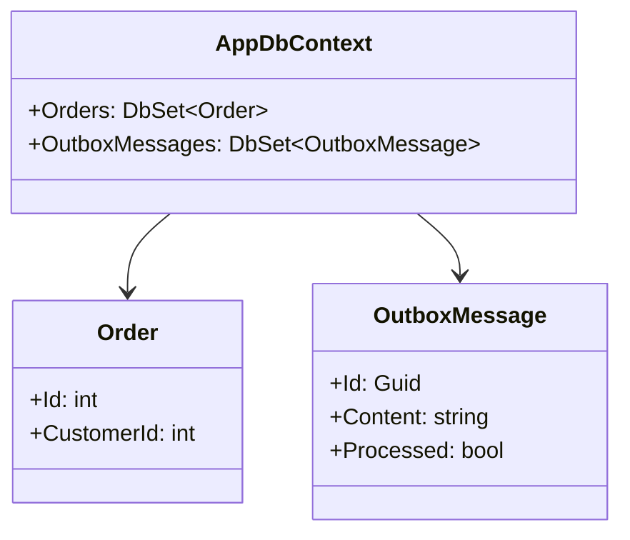
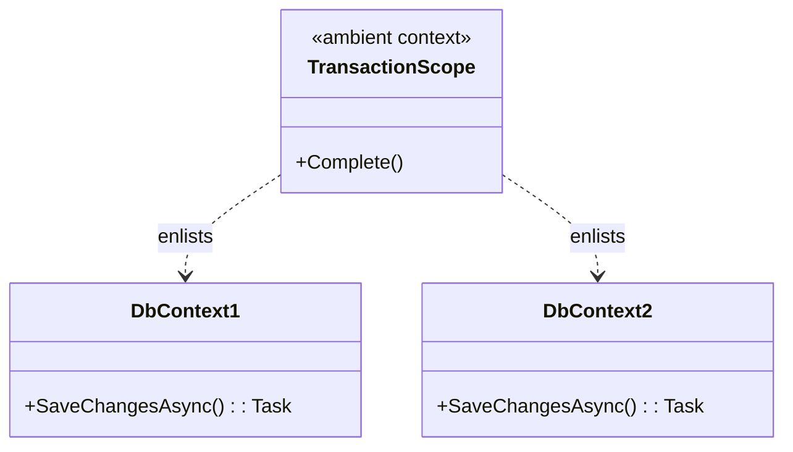

Конечно! Ниже приведены описания **шести ключевых шаблонов управления данными и транзакциями**, оформленные строго по вашему шаблону: **Цель**, **Пример (C#)**, **Антипаттерн**, **Схема (Mermaid)**.

---

### 1. **Unit of Work + Repository**

**Цель:**  
Обеспечить согласованное управление изменениями над несколькими сущностями в рамках одной транзакции, инкапсулируя логику сохранения и отслеживания изменений.

**Пример:**
```csharp
public interface IUnitOfWork : IDisposable
{
    ICustomerRepository Customers { get; }
    Task<int> CommitAsync();
}

public class EfUnitOfWork : IUnitOfWork
{
    private readonly AppDbContext _ctx;
    public EfUnitOfWork(AppDbContext ctx) => _ctx = ctx;
    public ICustomerRepository Customers { get; } = new CustomerRepository(_ctx);
    public Task<int> CommitAsync() => _ctx.SaveChangesAsync();
}
```

**Антипаттерн:**  
Сохранение каждого репозитория отдельно без общей транзакции → частичное обновление данных при ошибке.

**Схема:**


---

### 2. **Active Record**

**Цель:**  
Объединить данные и поведение сохранения в одном классе для упрощения CRUD-операций в небольших приложениях.

**Пример:**
```csharp
public class Customer
{
    public int Id { get; set; }
    public string Name { get; set; }

    public async Task SaveAsync(AppDbContext ctx)
    {
        if (Id == 0) ctx.Customers.Add(this);
        else ctx.Customers.Update(this);
        await ctx.SaveChangesAsync();
    }
}
```

**Антипаттерн:**  
Использование Active Record в сложной бизнес-логике → нарушение SRP, зависимость от инфраструктуры (DbContext) внутри домена.

**Схема:**


```
    note right of Customer::SaveAsync
        Нарушает разделение
        ответственности:
        домен знает о БД.
    end note
```

---

### 3. **Transaction Script**

**Цель:**  
Реализовать бизнес-транзакцию как одну процедуру, объединяющую все шаги (запросы, обновления, проверки) в линейном коде.

**Пример:**
```csharp
public async Task PlaceOrder(int customerId, AppDbContext db)
{
    using var tx = await db.Database.BeginTransactionAsync();
    try
    {
        var customer = await db.Customers.FindAsync(customerId);
        db.Orders.Add(new Order { CustomerId = customerId });
        await db.SaveChangesAsync();
        await tx.CommitAsync();
    }
    catch
    {
        await tx.RollbackAsync();
        throw;
    }
}
```

**Антипаттерн:**  
Дублирование логики транзакций в каждом сервисе, отсутствие повторного использования, трудности с тестированием.

**Схема:**


```
    note right of OrderService::PlaceOrder
        Вся логика — в одном методе.
        Нет абстракции над транзакцией.
    end note
```

---

### 4. **Domain Model (DDD-style)**

**Цель:**  
Инкапсулировать бизнес-логику внутри богатых агрегатов, где изменения происходят через поведенческие методы, а не прямое присваивание.

**Пример:**
```csharp
public class Order
{
    private List<OrderLine> _lines = new();
    public IReadOnlyCollection<OrderLine> Lines => _lines.AsReadOnly();

    public void AddLine(string product)
    {
        if (string.IsNullOrWhiteSpace(product))
            throw new ArgumentException("Invalid product");
        _lines.Add(new OrderLine(product));
    }
}
```

**Антипаттерн:**  
"Anemic Domain Model" — объекты с публичными свойствами и без поведения, логика вынесена в сервисы.

**Схема:**


```
    note right of Order::AddLine
        Бизнес-правило инкапсулировано.
        Состояние изменяется только
        через поведение.
    end note
```

---

### 5. **Outbox Pattern**

**Цель:**  
Гарантировать согласованность между записью в БД и отправкой сообщений во внешние системы, сохраняя события в ту же транзакцию.

**Пример:**
```csharp
public async Task CreateOrderWithOutbox(Order order, object evt, AppDbContext db)
{
    using var tx = await db.Database.BeginTransactionAsync();
    db.Orders.Add(order);
    db.OutboxMessages.Add(new OutboxMessage {
        Content = JsonSerializer.Serialize(evt),
        Processed = false
    });
    await db.SaveChangesAsync();
    await tx.CommitAsync();
}
```

**Антипаттерн:**  
Отправка сообщения до коммита транзакции → риск потери данных при сбое.

**Схема:**


```
    note right of OutboxMessage
        Сообщение хранится в БД
        и отправляется позже
        фоновым процессом.
    end note
```

---

### 6. **Ambient Transaction (`TransactionScope`)**

**Цель:**  
Объединить несколько операций (даже с разными источниками данных) в одну логическую транзакцию через императивный контекст.

**Пример:**
```csharp
using var scope = new TransactionScope(TransactionScopeAsyncFlowOption.Enabled);
await db1.SaveChangesAsync();
await db2.SaveChangesAsync();
scope.Complete(); // коммит
```

**Антипаттерн:**  
Неявные распределённые транзакции в облачных средах → ошибки, блокировки, отказ от поддержки (например, в Azure SQL без MSDTC).

**Схема:**


```
    note right of TransactionScope
        Все enlisted ресурсы
        участвуют в одной
        транзакции.
        Опасен в распределённых системах.
    end note
```

---