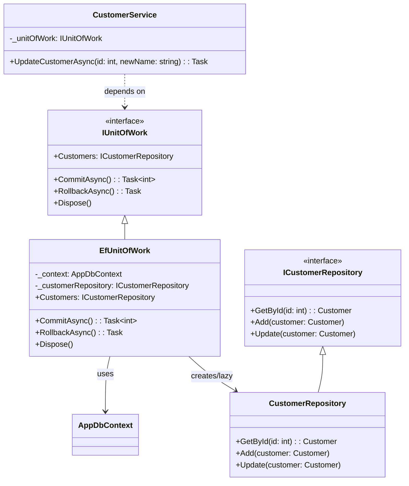

**Цель:**  
Unit of Work — это архитектурный паттерн, который **отслеживает все изменения, внесённые в бизнес-объекты в рамках одной транзакции**, и координирует их запись в базу данных как единое целое. Он гарантирует согласованность данных, избегает частичных обновлений и упрощает управление транзакциями.

> 💡 Часто используется вместе с Repository Pattern и ORM (например, Entity Framework, NHibernate).

---

**Пример (C#):**

```csharp
// Простой интерфейс репозитория
public interface ICustomerRepository
{
    Customer GetById(int id);
    void Add(Customer customer);
    void Update(Customer customer);
}

// Unit of Work
public interface IUnitOfWork : IDisposable
{
    ICustomerRepository Customers { get; }
    Task<int> CommitAsync();
    Task RollbackAsync();
}

// Реализация на основе Entity Framework (упрощённо)
public class AppDbContext : DbContext
{
    public DbSet<Customer> Customers => Set<Customer>();
}

public class EfUnitOfWork : IUnitOfWork
{
    private readonly AppDbContext _context;
    private ICustomerRepository? _customerRepository;

    public EfUnitOfWork(AppDbContext context)
    {
        _context = context;
    }

    public ICustomerRepository Customers =>
        _customerRepository ??= new CustomerRepository(_context);

    public async Task<int> CommitAsync()
    {
        // EF отслеживает изменения автоматически
        return await _context.SaveChangesAsync();
    }

    public async Task RollbackAsync()
    {
        // Сброс отслеживаемых изменений
        foreach (var entry in _context.ChangeTracker.Entries())
            entry.State = EntityState.Detached;
    }

    public void Dispose() => _context.Dispose();
}

// Использование в сервисе
public class CustomerService
{
    private readonly IUnitOfWork _unitOfWork;

    public CustomerService(IUnitOfWork unitOfWork)
    {
        _unitOfWork = unitOfWork;
    }

    public async Task UpdateCustomerAsync(int id, string newName)
    {
        var customer = _unitOfWork.Customers.GetById(id);
        customer.Name = newName;
        // Никаких явных вызовов Update — UoW отслеживает изменения
        await _unitOfWork.CommitAsync(); // Сохраняет всё или ничего
    }
}
```

> 💡 В Entity Framework `DbContext` сам по себе является реализацией Unit of Work, а `DbSet<T>` — Repository.

---

**Антипаттерн:**  
- **Сохранение каждого объекта по отдельности** без объединения в транзакцию:
  ```csharp
  repo1.Save(order);
  repo2.Save(invoice); // ← если упадёт здесь — данные несогласованы
  ```
- **Отсутствие отката при ошибке** → частичное обновление данных.
- **Ручное управление транзакциями в каждом методе** → дублирование, сложность, уязвимость к ошибкам.

---

**Схема (Mermaid):**



```
    note right of IUnitOfWork
        Координирует сохранение
        всех изменений как одну
        атомарную операцию.
    end note

    note left of EfUnitOfWork::CommitAsync
        Внутри вызывает
        SaveChangesAsync(),
        который применяет
        все изменения в БД
        в одной транзакции.
    end note
```


Отличный вопрос! **Unit of Work (UoW)** — это часть более широкой экосистемы паттернов, направленных на управление состоянием, транзакциями и согласованностью данных в приложениях, особенно в enterprise-разработке. Ниже приведены **сопутствующие и альтернативные шаблоны**, которые часто используются вместе с UoW или решают похожие задачи:

---

### 1. **Repository Pattern**  
**Связь с UoW:** Почти всегда используется **в паре**.  
- **Repository** абстрагирует доступ к данным (CRUD-операции).  
- **Unit of Work** отслеживает изменения, сделанные через репозитории, и координирует их сохранение.  

> 💡 В Entity Framework: `DbSet<T>` = Repository, `DbContext` = Unit of Work.

---

### 2. **Active Record**  
**Альтернатива UoW + Repository.**  
- Каждый объект домена **сам знает, как сохранять/удалять себя** (например, `customer.Save()`).  
- Просто для малых проектов, но нарушает SRP и затрудняет тестирование.  
- Используется в Ruby on Rails, Yii (PHP), иногда в простых C#-моделях.

> ❌ Не подходит для сложных транзакций с несколькими сущностями.

---

### 3. **Data Mapper**  
**Более общий паттерн, чем Repository.**  
- Полностью разделяет доменные объекты и логику сохранения.  
- **ORM (например, NHibernate, EF Core)** — реализация Data Mapper.  
- Unit of Work часто является частью Data Mapper’а.

> ✅ Подходит для сложных доменных моделей (DDD).

---

### 4. **Transaction Script**  
**Простая альтернатива для CRUD-приложений.**  
- Логика транзакции пишется **линейно в одном методе** (часто в сервисе).  
- Нет явного UoW — транзакция управляется напрямую (например, через `BeginTransaction()`).  
- Подходит для простых сценариев без богатой доменной модели.

> ⚠️ Масштабируется плохо: логика размазывается по сервисам.

---

### 5. **Domain Model + Domain Events**  
**Современный подход (часто в DDD).**  
- Вместо UoW изменения применяются через **методы агрегатов** (`order.AddLine(...)`)  
- **Domain Events** фиксируют факты изменений → обрабатываются в транзакции.  
- Сохранение может всё ещё использовать UoW, но логика инкапсулирована в домене.

> ✅ Высокая выразительность, но сложнее в реализации.

---

### 6. **Outbox Pattern** (расширенный UoW)  
**Для надёжной интеграции с внешними системами.**  
- Сообщения (например, события) сохраняются **в ту же транзакцию БД**, что и данные.  
- Отдельный процесс отправляет их после коммита.  
- Гарантирует **атомарность между данными и сообщениями**.

> 🔗 Часто комбинируется с UoW в микросервисах.

---

### 7. **Ambient Transaction / TransactionScope** (.NET)  
**Императивное управление транзакциями.**  
- Использует `System.Transactions.TransactionScope` для объединения операций в одну транзакцию.  
- Не требует явного UoW, но менее гибок и может эскалировать до MSDTC.

> ⚠️ Устаревший подход в облачных/асинхронных средах.

---

### Сравнительная таблица

| Паттерн                 | Управление транзакцией | Инкапсуляция логики | Подходит для DDD | Тестируемость |
|------------------------|------------------------|---------------------|------------------|---------------|
| **Unit of Work**       | Централизованное       | Через репозитории   | ✅               | ✅            |
| **Active Record**      | На уровне объекта      | В самом объекте     | ❌               | ❌            |
| **Transaction Script** | В сервисе              | В процедурном коде  | ❌               | ⚠️            |
| **Domain Model**       | Через агрегаты         | В домене            | ✅✅             | ✅            |
| **Outbox**             | Расширяет UoW          | Через события       | ✅               | ✅            |

---

### Рекомендации:
- Для **простых CRUD-приложений**: Repository + Unit of Work (или просто EF Core).
- Для **сложных доменов (DDD)**: Domain Model + Aggregates + Domain Events (UoW может быть скрыт внутри инфраструктуры).
- Для **микросервисов с надёжной доставкой**: Outbox + UoW.
- Избегайте **Active Record** в enterprise-коде.

---

### 1. **Unit of Work + Repository** (классический)

```csharp
// Единый интерфейс UoW
public interface IUnitOfWork : IDisposable
{
    ICustomerRepository Customers { get; }
    IOrderRepository Orders { get; }
    Task<int> CommitAsync();
}

// Реализация на основе EF Core
public class AppUnitOfWork : IUnitOfWork
{
    private readonly AppDbContext _context;
    private CustomerRepository? _customerRepo;
    private OrderRepository? _orderRepo;

    public AppUnitOfWork(AppDbContext context) => _context = context;

    public ICustomerRepository Customers => _customerRepo ??= new CustomerRepository(_context);
    public IOrderRepository Orders => _orderRepo ??= new OrderRepository(_context);

    public async Task<int> CommitAsync() => await _context.SaveChangesAsync();
    public void Dispose() => _context.Dispose();
}

// Использование
public class OrderService
{
    public async Task PlaceOrder(IUnitOfWork uow, int customerId, string product)
    {
        var customer = uow.Customers.GetById(customerId);
        var order = new Order { CustomerId = customerId, Product = product };
        uow.Orders.Add(order);
        await uow.CommitAsync(); // Сохраняет всё в одной транзакции
    }
}
```

> ✅ Гибко, тестируемо, подходит для большинства enterprise-приложений.

---

### 2. **Active Record** (простой, но ограниченный)

```csharp
public class Customer
{
    public int Id { get; set; }
    public string Name { get; set; }

    // Сам сохраняет себя
    public async Task SaveAsync(AppDbContext context)
    {
        if (Id == 0)
            context.Customers.Add(this);
        else
            context.Customers.Update(this);
        await context.SaveChangesAsync();
    }

    public static async Task<Customer?> GetByIdAsync(AppDbContext context, int id)
        => await context.Customers.FindAsync(id);
}

// Использование
var customer = new Customer { Name = "Alice" };
await customer.SaveAsync(db); // Прямой вызов
```

> ❌ Нарушает SRP, трудно тестировать без контекста БД.

---

### 3. **Transaction Script** (процедурный стиль)

```csharp
public class OrderService
{
    private readonly AppDbContext _db;

    public OrderService(AppDbContext db) => _db = db;

    public async Task PlaceOrder(int customerId, string product)
    {
        using var transaction = await _db.Database.BeginTransactionAsync();

        try
        {
            var customer = await _db.Customers.FindAsync(customerId);
            if (customer == null) throw new Exception("Not found");

            _db.Orders.Add(new Order { CustomerId = customerId, Product = product });
            await _db.SaveChangesAsync();

            await transaction.CommitAsync();
        }
        catch
        {
            await transaction.RollbackAsync();
            throw;
        }
    }
}
```

> ⚠️ Логика размазана по сервису, но проста для понимания в малых проектах.

---

### 4. **Domain Model + Domain Events** (DDD-стиль)

```csharp
// Агрегат
public class Order
{
    private readonly List<OrderEvent> _events = new();
    public IReadOnlyCollection<OrderEvent> Events => _events.AsReadOnly();

    public void AddLine(string product)
    {
        // Бизнес-логика внутри агрегата
        _events.Add(new OrderLineAdded(product));
    }

    public void ClearEvents() => _events.Clear();
}

// Событие
public record OrderLineAdded(string Product) : OrderEvent;

// Обработка в инфраструктуре
public class OrderService
{
    public async Task HandleOrder(AppDbContext db, Order order)
    {
        db.Orders.Add(order);
        await db.SaveChangesAsync(); // Сохраняет агрегат

        foreach (var ev in order.Events)
        {
            // Публикация события (например, в шину)
            await EventBus.Publish(ev);
        }

        order.ClearEvents();
    }
}
```

> ✅ Богатая модель, но требует дисциплины и инфраструктуры.

---

### 5. **Outbox Pattern** (надёжная доставка)

```csharp
// Таблица Outbox
public class OutboxMessage
{
    public Guid Id { get; set; }
    public string Type { get; set; } // например, "OrderCreated"
    public string Content { get; set; } // JSON
    public bool Processed { get; set; }
}

// В рамках той же транзакции
public async Task CreateOrderWithOutbox(AppDbContext db, Order order, object eventPayload)
{
    using var tx = await db.Database.BeginTransactionAsync();

    db.Orders.Add(order);
    db.OutboxMessages.Add(new OutboxMessage
    {
        Id = Guid.NewGuid(),
        Type = "OrderCreated",
        Content = JsonSerializer.Serialize(eventPayload),
        Processed = false
    });

    await db.SaveChangesAsync(); // Данные + сообщение — в одной транзакции
    await tx.CommitAsync();
}

// Отдельный фоновый процесс:
// while (true) {
//   var msg = db.OutboxMessages.FirstOrDefault(m => !m.Processed);
//   if (msg != null) await PublishAndMarkAsProcessed(msg);
// }
```

> ✅ Гарантирует согласованность между БД и внешними системами.

---

### 6. **Ambient Transaction (`TransactionScope`)**

```csharp
public async Task PlaceOrderWithAmbientTx()
{
    using var scope = new TransactionScope(TransactionScopeAsyncFlowOption.Enabled);

    // Может включать несколько DbContext или даже разные БД
    await _db1.Orders.AddAsync(new Order { ... });
    await _db1.SaveChangesAsync();

    await _db2.AuditLogs.AddAsync(new Log { ... });
    await _db2.SaveChangesAsync();

    scope.Complete(); // Коммит только если не было исключений
}
```

> ⚠️ Риск эскалации до распределённой транзакции (MSDTC), не работает везде (например, в Azure Functions).

---

### Когда что использовать?

| Сценарий                          | Рекомендуемый подход         |
|----------------------------------|------------------------------|
| Простое CRUD-приложение          | Repository + Unit of Work    |
| Микросервис с событиями          | Outbox + Domain Events       |
| Богатая бизнес-логика (банк)     | Domain Model + Aggregates    |
| Быстрый прототип                 | Active Record или Transaction Script |
| Интеграция с несколькими БД      | `TransactionScope` (осторожно!) |