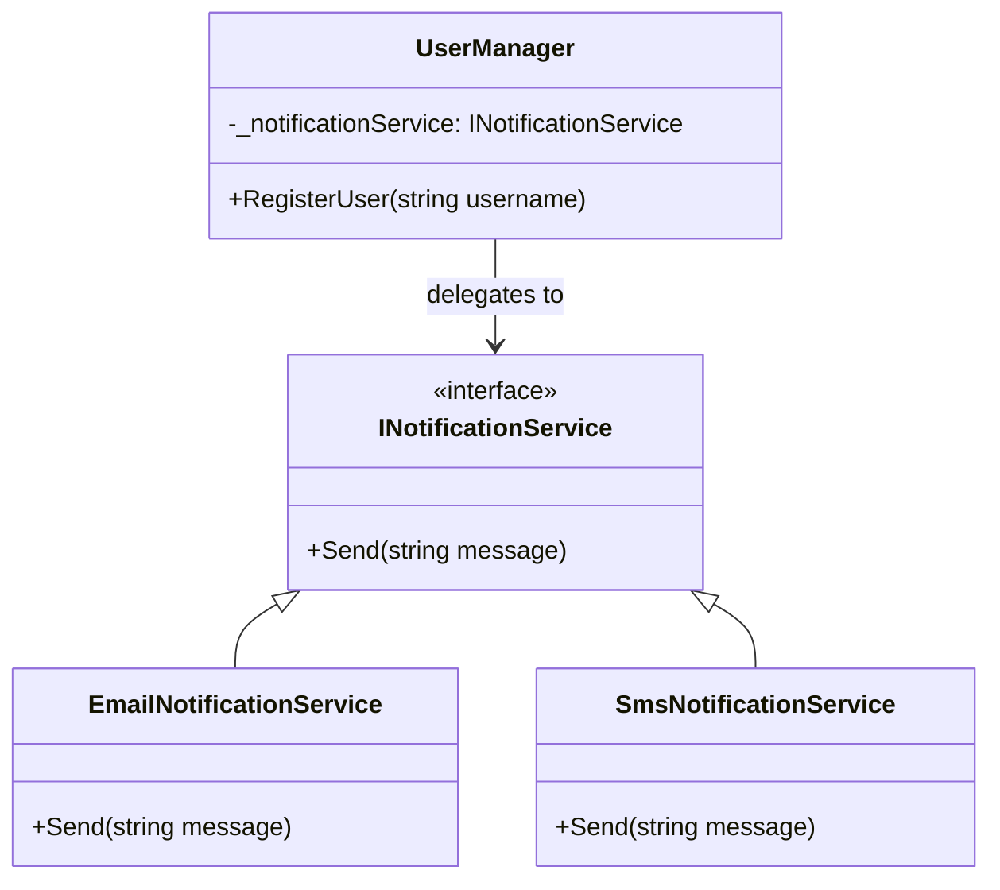

**Цель:**  
Delegation Pattern (Паттерн «Делегирование») — это поведенческий паттерн, при котором объект передаёт (делегирует) выполнение определённой задачи другому вспомогательному объекту. Это позволяет повторно использовать логику, избегать наследования и обеспечивать гибкость за счёт композиции.

**Пример (C#):**

```csharp
// Интерфейс делегата для обработки уведомлений
public interface INotificationService
{
    void Send(string message);
}

// Конкретные реализации
public class EmailNotificationService : INotificationService
{
    public void Send(string message) => Console.WriteLine($"Email: {message}");
}

public class SmsNotificationService : INotificationService
{
    public void Send(string message) => Console.WriteLine($"SMS: {message}");
}

// Класс, использующий делегирование
public class UserManager
{
    private readonly INotificationService _notificationService;

    public UserManager(INotificationService notificationService)
    {
        _notificationService = notificationService;
    }

    public void RegisterUser(string username)
    {
        Console.WriteLine($"User '{username}' registered.");
        _notificationService.Send($"Welcome, {username}!");
    }
}

// Использование
var emailService = new EmailNotificationService();
var userManager = new UserManager(emailService);
userManager.RegisterUser("Alice");
```

**Антипаттерн:**  
Жёсткая привязка логики внутри класса (например, вызов `Console.WriteLine` или реализация отправки email прямо в методе `RegisterUser`), что затрудняет изменение поведения без модификации самого класса и нарушает принцип единственной ответственности (SRP).

**Схема (Mermaid):**

