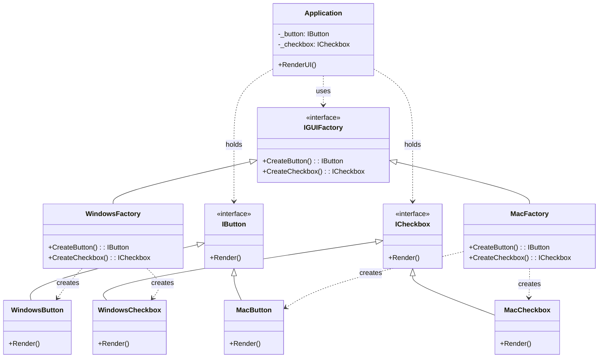

**Цель:**  
Abstract Factory — это порождающий паттерн проектирования, который предоставляет интерфейс для создания **семейств взаимосвязанных или взаимозависимых объектов**, не привязываясь к конкретным классам этих объектов. Он инкапсулирует логику создания связанных компонентов, обеспечивая согласованность и поддержку нескольких вариантов (тем, платформ, стилей).

---

**Пример (C#):**

```csharp
// Абстрактные продукты
public interface IButton
{
    void Render();
}

public interface ICheckbox
{
    void Render();
}

// Конкретные продукты — Windows стиль
public class WindowsButton : IButton
{
    public void Render() => Console.WriteLine("Rendering Windows Button");
}

public class WindowsCheckbox : ICheckbox
{
    public void Render() => Console.WriteLine("Rendering Windows Checkbox");
}

// Конкретные продукты — macOS стиль
public class MacButton : IButton
{
    public void Render() => Console.WriteLine("Rendering Mac Button");
}

public class MacCheckbox : ICheckbox
{
    public void Render() => Console.WriteLine("Rendering Mac Checkbox");
}

// Абстрактная фабрика
public interface IGUIFactory
{
    IButton CreateButton();
    ICheckbox CreateCheckbox();
}

// Конкретные фабрики
public class WindowsFactory : IGUIFactory
{
    public IButton CreateButton() => new WindowsButton();
    public ICheckbox CreateCheckbox() => new WindowsCheckbox();
}

public class MacFactory : IGUIFactory
{
    public IButton CreateButton() => new MacButton();
    public ICheckbox CreateCheckbox() => new MacCheckbox();
}

// Клиентский код
public class Application
{
    private readonly IButton _button;
    private readonly ICheckbox _checkbox;

    public Application(IGUIFactory factory)
    {
        _button = factory.CreateButton();
        _checkbox = factory.CreateCheckbox();
    }

    public void RenderUI()
    {
        _button.Render();
        _checkbox.Render();
    }
}

// Использование
var factory = Environment.OSVersion.Platform == PlatformID.Win32NT
    ? (IGUIFactory)new WindowsFactory()
    : new MacFactory();

var app = new Application(factory);
app.RenderUI(); // Выведет UI в стиле текущей ОС
```

---

**Антипаттерн:**  
Жёсткая привязка к конкретным классам в клиентском коде (например, `new WindowsButton()` напрямую в `Application`). Это нарушает принцип инверсии зависимостей (DIP), затрудняет замену темы/платформы и приводит к дублированию условной логики (`if/else` или `switch`) по всему коду.

---

**Схема (Mermaid):**

