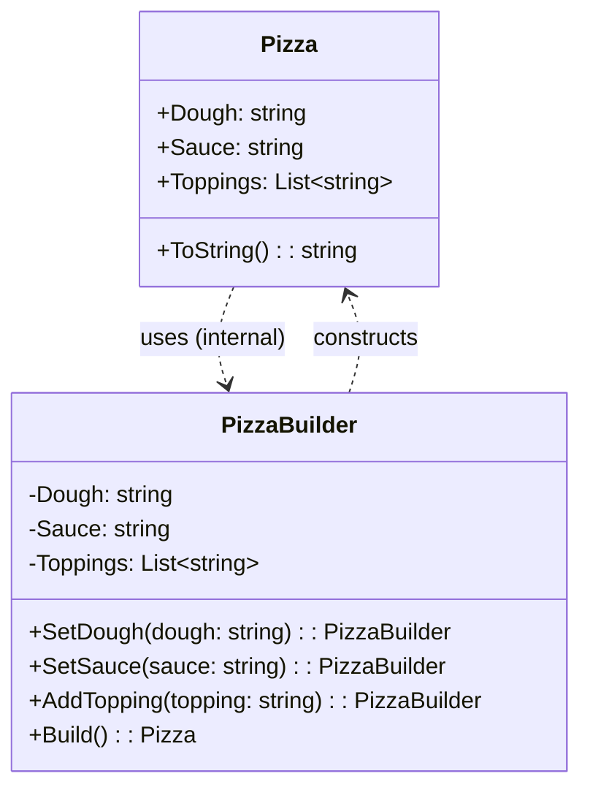

**Цель:**  
Builder — это порождающий паттерн проектирования, который позволяет **пошагово конструировать сложные объекты**, отделяя процесс построения от представления самого объекта. Это особенно полезно, когда объект имеет множество опциональных параметров, вложенные структуры или требует валидации на этапе создания.

---

**Пример (C#):**

```csharp
// Итоговый неизменяемый продукт
public class Pizza
{
    public string Dough { get; }
    public string Sauce { get; }
    public List<string> Toppings { get; }

    internal Pizza(PizzaBuilder builder)
    {
        Dough = builder.Dough;
        Sauce = builder.Sauce;
        Toppings = new List<string>(builder.Toppings);
    }

    public override string ToString() =>
        $"Pizza: dough={Dough}, sauce={Sauce}, toppings=[{string.Join(", ", Toppings)}]";
}

// Builder с fluent-интерфейсом
public class PizzaBuilder
{
    public string Dough { get; private set; } = "Thin";
    public string Sauce { get; private set; } = "Tomato";
    public List<string> Toppings { get; } = new();

    public PizzaBuilder SetDough(string dough) { Dough = dough; return this; }
    public PizzaBuilder SetSauce(string sauce) { Sauce = sauce; return this; }
    public PizzaBuilder AddTopping(string topping) { Toppings.Add(topping); return this; }

    public Pizza Build()
    {
        if (string.IsNullOrWhiteSpace(Dough))
            throw new InvalidOperationException("Dough is required.");
        return new Pizza(this);
    }
}

// Использование
var pizza = new PizzaBuilder()
    .SetDough("Thick")
    .SetSauce("Pesto")
    .AddTopping("Mushrooms")
    .AddTopping("Olives")
    .Build();

Console.WriteLine(pizza);
```

> 💡 В C# также часто используется **внутренний класс `Builder`** или **статический метод `Create()`**, возвращающий билдер.

---

**Антипаттерн:**  
«Телескопический конструктор» — конструктор с множеством перегрузок и необязательными параметрами:
```csharp
public Pizza(string dough, string sauce = "Tomato", string topping1 = null, string topping2 = null, ...)
```
Это приводит к плохой читаемости, ошибкам при вызове и невозможности валидировать состояние до создания объекта.

---

**Схема (Mermaid):**


```text
    note right of PizzaBuilder
        Fluent interface:
        каждый метод возвращает this,
        позволяя цепочку вызовов.
    end note

    note left of Pizza
        Обычно неизменяемый
        и создаётся только через Builder.
    end note
```