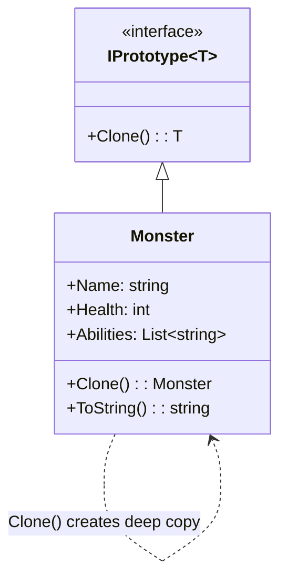

**Цель:**  
Prototype — это порождающий паттерн проектирования, который позволяет **создавать новые объекты путём копирования существующего экземпляра (прототипа)**, а не через конструктор. Это особенно полезно, когда создание объекта напрямую (через `new`) затратно, требует сложной настройки или когда тип объекта определяется динамически во время выполнения.

---

**Пример (C#):**

```csharp
// Интерфейс прототипа
public interface IPrototype<out T>
{
    T Clone();
}

// Конкретный прототип
public class Monster : IPrototype<Monster>
{
    public string Name { get; set; }
    public int Health { get; set; }
    public List<string> Abilities { get; set; }

    public Monster(string name, int health, List<string> abilities)
    {
        Name = name;
        Health = health;
        Abilities = new List<string>(abilities); // глубокое копирование списка
    }

    // Глубокое клонирование
    public Monster Clone()
    {
        return new Monster(Name, Health, Abilities);
    }

    public override string ToString() =>
        $"{Name} (HP: {Health}, Abilities: [{string.Join(", ", Abilities)}])";
}

// Использование
var original = new Monster("Dragon", 100, new List<string> { "Fire Breath", "Fly" });
var copy = original.Clone();

copy.Name = "Baby Dragon";
copy.Health = 40;
copy.Abilities.Add("Bite");

Console.WriteLine(original); // Dragon (HP: 100, Abilities: [Fire Breath, Fly])
Console.WriteLine(copy);     // Baby Dragon (HP: 40, Abilities: [Fire Breath, Fly, Bite])
```

> 💡 В C# также можно использовать:
> - `ICloneable` (устаревший, не типобезопасный),
> - сериализацию (например, через `System.Text.Json` или `BinaryFormatter` — **не рекомендуется**),
> - record-типы с `with`-выражениями для поверхностного копирования.

---

**Антипаттерн:**  
- **Поверхностное копирование (`MemberwiseClone`)** без учёта вложенных ссылочных типов → изменения в копии влияют на оригинал.
- **Создание объектов через `new` с дублированием логики инициализации**, особенно если структура сложная или параметры известны только через уже существующий экземпляр.

Пример ошибки:
```csharp
public Monster ShallowClone() => (Monster)MemberwiseClone(); // ← опасно!
```
Если `Abilities` — список, обе копии будут делить один и тот же экземпляр списка.

---

**Схема (Mermaid):**



```
    note right of Monster::Clone
        Выполняет глубокое
        копирование всех
        изменяемых полей,
        чтобы оригинал и копия
        были независимы.
    end note

    note left of IPrototype~T~
        Обобщённый интерфейс
        обеспечивает типобезопасность
        при клонировании.
    end note
```