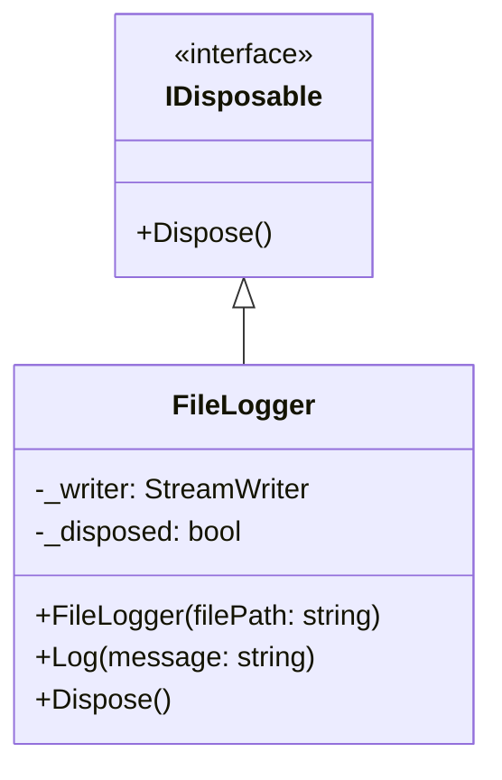

**Цель:**  
Resource Acquisition Is Initialization (RAII) — это идиома управления ресурсами, при которой **получение ресурса (например, памяти, файла, соединения) совпадает с инициализацией объекта**, а **освобождение ресурса происходит автоматически при уничтожении объекта**. В C# RAII реализуется через **`IDisposable` и `using`**, обеспечивая детерминированное освобождение ресурсов даже при исключениях.

> 💡 Хотя RAII родом из C++, в C# она адаптирована под модель сборки мусора через `IDisposable`.

---

**Пример (C#):**

```csharp
// Класс, управляющий ресурсом
public class FileLogger : IDisposable
{
    private StreamWriter? _writer;
    private bool _disposed = false;

    public FileLogger(string filePath)
    {
        _writer = new StreamWriter(filePath, append: true);
        Console.WriteLine($"[RAII] File opened: {filePath}");
    }

    public void Log(string message)
    {
        if (_disposed) throw new ObjectDisposedException(nameof(FileLogger));
        _writer?.WriteLine($"[{DateTime.Now:HH:mm:ss}] {message}");
    }

    // Реализация IDisposable
    public void Dispose()
    {
        if (!_disposed)
        {
            _writer?.Dispose();
            _disposed = true;
            Console.WriteLine("[RAII] File closed");
        }
    }
}

// Использование с using — гарантирует вызов Dispose()
public void ProcessData()
{
    using var logger = new FileLogger("app.log");
    logger.Log("Starting process");
    
    // Даже если здесь будет исключение — файл закроется!
    logger.Log("Process completed");
} // ← Dispose() вызывается автоматически здесь
```

> 💡 Начиная с C# 8.0 можно использовать **`using`-объявление** (`using var`) — более лаконичный синтаксис.

---

**Антипаттерн:**  
- **Ручное управление ресурсами без `using`**:
  ```csharp
  var logger = new FileLogger("log.txt");
  logger.Log("...");
  // Забыли вызвать logger.Dispose() → файл остаётся открытым!
  ```
- **Полагаться на финализатор (`~ClassName`)** для освобождения критических ресурсов — он вызывается недетерминированно (когда захочет GC).
- **Создавать disposable-объекты без присвоения**:
  ```csharp
  new FileLogger("log.txt").Log("..."); // Утечка ресурса!
  ```

---

**Схема (Mermaid):**



```
    note right of FileLogger::FileLogger
        Ресурс (файл) захватывается
        в конструкторе —
        Acquisition = Initialization.
    end note

    note right of FileLogger::Dispose
        Ресурс освобождается здесь.
        Вызывается автоматически
        через using или вручную.
    end note

    note left of IDisposable
        Контракт для RAII в C#.
        Обеспечивает детерминированное
        освобождение ресурсов.
    end note
```