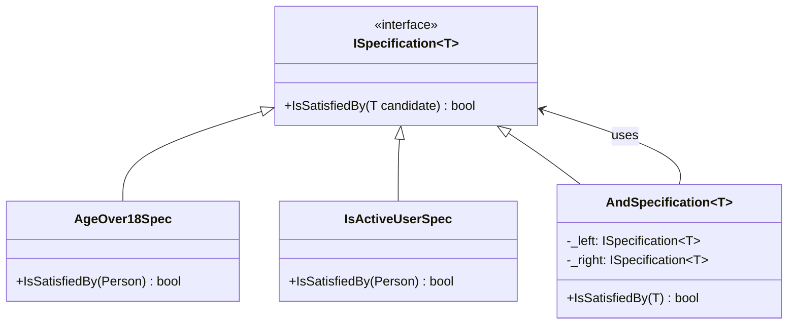

**Цель:**  
Specification Pattern (Паттерн «Спецификация») позволяет создавать повторно используемые, комбинируемые и читаемые бизнес-правила, инкапсулируя логику проверки в отдельные объекты. Он особенно полезен для фильтрации, валидации или выбора сущностей на основе динамических условий.

**Пример (C#):**

```csharp
// Базовый интерфейс спецификации
public interface ISpecification<T>
{
    bool IsSatisfiedBy(T candidate);
}

// Конкретная спецификация: возраст больше 18
public class AgeOver18Spec : ISpecification<Person>
{
    public bool IsSatisfiedBy(Person person) => person.Age > 18;
}

// Спецификация: активный пользователь
public class IsActiveUserSpec : ISpecification<Person>
{
    public bool IsSatisfiedBy(Person person) => person.IsActive;
}

// Композитная спецификация (логическое И)
public class AndSpecification<T> : ISpecification<T>
{
    private readonly ISpecification<T> _left;
    private readonly ISpecification<T> _right;

    public AndSpecification(ISpecification<T> left, ISpecification<T> right)
    {
        _left = left;
        _right = right;
    }

    public bool IsSatisfiedBy(T candidate) => 
        _left.IsSatisfiedBy(candidate) && _right.IsSatisfiedBy(candidate);
}

// Расширение для удобного комбинирования
public static class SpecificationExtensions
{
    public static ISpecification<T> And<T>(
        this ISpecification<T> left, ISpecification<T> right) =>
        new AndSpecification<T>(left, right);
}

// Использование
var spec = new AgeOver18Spec().And(new IsActiveUserSpec());
var validPeople = people.Where(p => spec.IsSatisfiedBy(p)).ToList();
```

**Антипаттерн:**  
Жёстко закодированные условия в бизнес-логике (например, `if (person.Age > 18 && person.IsActive)` прямо в сервисах или контроллерах), что приводит к дублированию кода, плохой тестируемости и невозможности динамической композиции правил.

**Схема (Mermaid):**

