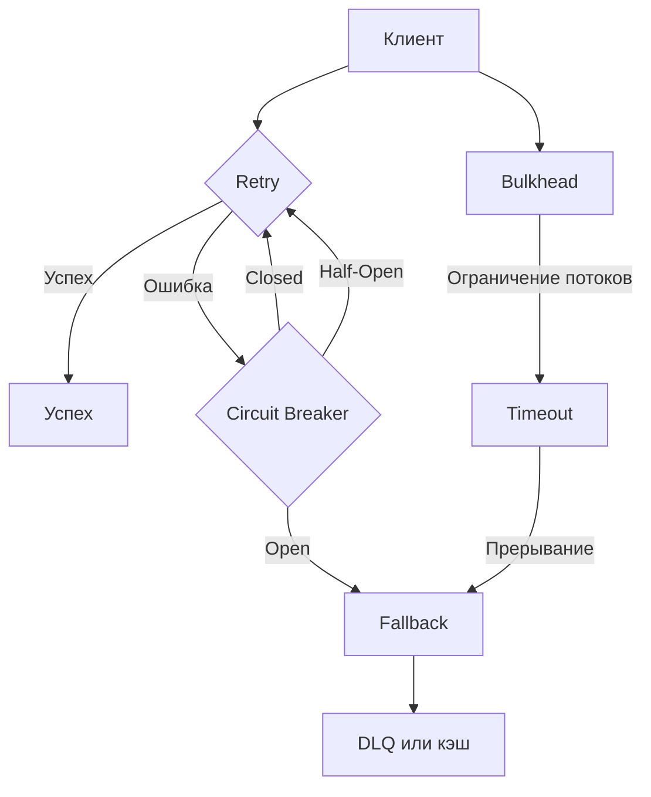

## **Паттерны проектирования для повышения отказоустойчивости систем**

## Оглавление
- [**Паттерны проектирования для повышения отказоустойчивости систем**](#паттерны-проектирования-для-повышения-отказоустойчивости-систем)
- [**Как комбинировать паттерны?**](#как-комбинировать-паттерны)
- [**Визуализация комбинаций (Mermaid)**](#визуализация-комбинаций-mermaid)
- [**Заключение**](#заключение)

Паттерны отказоустойчивости

| Паттерн               | Цель                                                                 | Когда использовать?                                                                 | Пример использования                                                                 | Проблемы                                                                 |
|-----------------------|----------------------------------------------------------------------|------------------------------------------------------------------------------------|--------------------------------------------------------------------------------------|--------------------------------------------------------------------------|
| **Circuit Breaker**   | Предотвращение каскадных сбоев при нестабильности внешних зависимостей. | Взаимодействие с внешними API, микросервисами, базами данных.                     | Защита от повторных запросов к упавшему API.                                         | Требует настройки порогов ошибок и времени восстановления.               |
| **Retry**             | Автоматическое повторение failed операций при временных сбоях.       | Временные сетевые сбои, таймауты, идемпотентные операции.                         | Повторный запрос к API при ошибке 500.                                               | Может усугубить нагрузку на нестабильный сервис.                        |
| **Bulkhead**          | Изоляция компонентов системы для предотвращения каскадных сбоев.     | Работа с несколькими внешними зависимостями, критически важные сервисы.           | Ограничение количества параллельных запросов к базе данных.                          | Требует балансировки ресурсов.                                          |
| **Fallback**          | Возврат резервного ответа или выполнение альтернативной логики.       | Некритичные операции, возможность использования кэша или дефолтных значений.      | Отображение кэшированных данных при недоступности API.                              | Может снизить точность данных.                                          |
| **Timeout**           | Ограничение времени ожидания ответа от внешней зависимости.           | Медленные или "зависающие" сервисы.                                               | Прерывание запроса к API через 5 секунд.                                             | Может привести к ложным срабатываниям при высокой нагрузке.              |
| **Rate Limiter**      | Ограничение количества запросов к сервису в единицу времени.          | Защита внешних API от перегрузки, предотвращение DDoS-атак.                       | Ограничение 10 запросов в секунду к API платёжной системы.                           | Может создать узкое место при неправильной настройке.                   |
| **Dead Letter Queue** | Сохранение сообщений, которые не удалось обработать, для последующего анализа. | Системы с очередями сообщений (Kafka, RabbitMQ), обработка ошибок в consumers.     | Перенаправление failed сообщений в отдельный топик Kafka для повторной обработки.    | Требует дополнительной логики для обработки "мёртвых" сообщений.         |
| **Saga**              | Управление распределёнными транзакциями через последовательность локальных транзакций. | Микросервисная архитектура, длинные бизнес-процессы.                              | Бронирование отеля и авиабилетов с компенсирующими действиями при ошибке.           | Сложность реализации и отладки.                                         |
| **Health Check**      | Мониторинг состояния сервисов и зависимостей.                        | Автоматическое обнаружение неисправных сервисов, оркестрация (Kubernetes).       | Проверка доступности базы данных и внешних API в ASP.NET Core.                      | Требует интеграции с системами мониторинга.                             |

---

## **Как комбинировать паттерны?**
Для достижения максимальной отказоустойчивости паттерны часто **комбинируют**. Вот несколько примеров:

1. **Retry + Circuit Breaker + Fallback**
   - Повторять запросы к нестабильному API, но размыкать цепь при частых ошибках и возвращать fallback-ответ.
   - Пример: Вызов платёжного шлюза с повторными попытками, Circuit Breaker и возвратом кэшированных данных при сбое.

2. **Bulkhead + Timeout**
   - Изолировать критически важные сервисы и ограничивать время ожидания их ответов.
   - Пример: Ограничение количества параллельных запросов к базе данных с таймаутом в 2 секунды.

3. **Dead Letter Queue + Retry**
   - Сохранять failed сообщения в отдельную очередь и пытаться обработать их повторно.
   - Пример: Обработка сообщений из Kafka с отправкой в DLQ-топик при ошибках и повторными попытками.

4. **Rate Limiter + Circuit Breaker**
   - Ограничивать количество запросов к внешнему API и размыкать цепь при его нестабильности.
   - Пример: Ограничение 100 запросов в минуту к API погоды и размыкание цепи при частых ошибках.

---

## **Визуализация комбинаций (Mermaid)**
Вот как паттерны могут взаимодействовать в системе:

---

## **Заключение**
Каждый паттерн решает конкретную проблему, но их **комбинация** позволяет создать по-настоящему отказоустойчивую систему. Выбор паттернов зависит от:
- Типа системы (монолит, микросервисы, распределённая).
- Критичности операций (например, платёжные системы требуют более строгих мер).
- Характера внешних зависимостей (API, базы данных, очереди сообщений).
Каждый паттерн решает **конкретную проблему** отказоустойчивости:
- **Circuit Breaker** → Защита от каскадных сбоев.
- **Retry** → Автоматическое повторение failed операций.
- **Bulkhead** → Изоляция компонентов.
- **Fallback** → Резервные ответы.
- **Timeout** → Ограничение времени ожидания.
- **Rate Limiter** → Защита от перегрузок.
- **Dead Letter Queue** → Обработка failed сообщений.
- **Saga** → Управление распределёнными транзакциями.
- **Health Check** → Мониторинг состояния сервисов.

