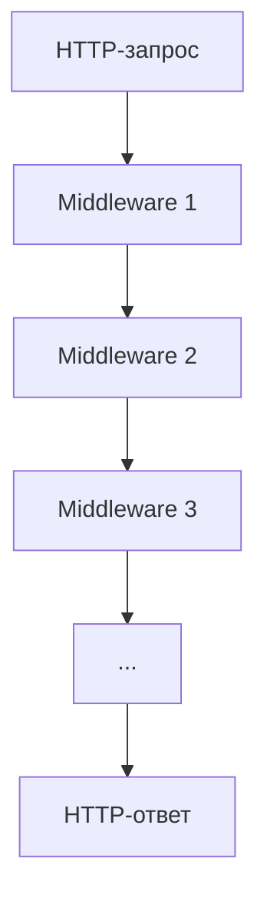
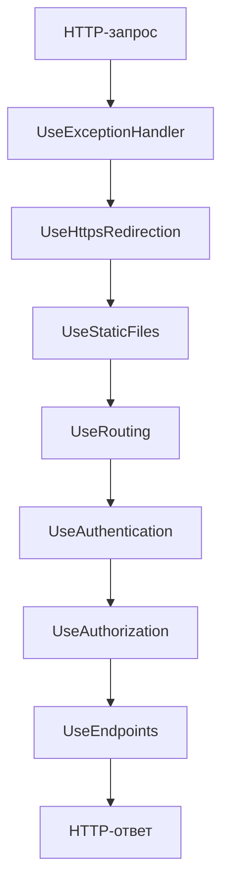

**Middleware** в ASP.NET Core — это программные компоненты, которые обрабатывают HTTP-запросы и ответы в конвейере приложения. Они позволяют добавлять функциональность, такую как аутентификация, авторизация, логирование, обработка ошибок и многое другое, в приложение.

---

## Как работает Middleware

Middleware в ASP.NET Core организованы в **конвейер**. Каждый запрос проходит через этот конвейер, последовательно обрабатываясь каждым middleware. Каждый middleware может:
- Обработать запрос и передать его следующему middleware.
- Обработать запрос и завершить его (например, вернуть ответ).
- Обработать ответ после того, как он пройдет через последующие middleware.

### Схема работы Middleware



Каждый middleware может:
- Выполнить действия до вызова следующего middleware (`next.Invoke()`).
- Выполнить действия после вызова следующего middleware.

---

## Пример Middleware

Простой пример пользовательского middleware:

```csharp
public class CustomMiddleware
{
    private readonly RequestDelegate _next;

    public CustomMiddleware(RequestDelegate next)
    {
        _next = next;
    }

    public async Task InvokeAsync(HttpContext context)
    {
        // Логика до вызова следующего middleware
        Console.WriteLine("CustomMiddleware: обработка запроса");

        await _next(context);

        // Логика после вызова следующего middleware
        Console.WriteLine("CustomMiddleware: обработка ответа");
    }
}
```

Регистрация в `Program.cs`:

```csharp
app.UseMiddleware<CustomMiddleware>();
```

---

## Базовые Middleware в ASP.NET Core

### 1. **UseAuthentication**
- Отвечает за **аутентификацию** пользователя.
- Проверяет, кто совершает запрос (например, через cookies, JWT-токены).
- **Пример:**
  ```csharp
  app.UseAuthentication();
  ```

### 2. **UseAuthorization**
- Отвечает за **авторизацию** — проверяет, имеет ли аутентифицированный пользователь доступ к ресурсу.
- **Пример:**
  ```csharp
  app.UseAuthorization();
  ```

### 3. **UseCors**
- Настраивает **CORS** (Cross-Origin Resource Sharing) — разрешает или запрещает запросы с других доменов.
- **Пример:**
  ```csharp
  app.UseCors(builder => builder.AllowAnyOrigin());
  ```

### 4. **UseRouting**
- Отвечает за **маршрутизацию** — сопоставляет URL-запросы с обработчиками (контроллерами, Razor Pages).
- **Пример:**
  ```csharp
  app.UseRouting();
  ```

### 5. **UseEndpoints**
- Определяет **конечные точки** (endpoints) для маршрутизации.
- **Пример:**
  ```csharp
  app.UseEndpoints(endpoints =>
  {
      endpoints.MapControllers();
  });
  ```

### 6. **UseStaticFiles**
- Позволяет обслуживать **статические файлы** (HTML, CSS, JS, изображения).
- **Пример:**
  ```csharp
  app.UseStaticFiles();
  ```

### 7. **UseExceptionHandler**
- Обрабатывает **исключения** и возвращает пользователю страницу с ошибкой.
- **Пример:**
  ```csharp
  app.UseExceptionHandler("/Home/Error");
  ```

### 8. **UseHttpsRedirection**
- Перенаправляет HTTP-запросы на HTTPS.
- **Пример:**
  ```csharp
  app.UseHttpsRedirection();
  ```

---

## Порядок регистрации Middleware

Порядок регистрации middleware **важен**. Например, `UseAuthentication` должен быть зарегистрирован **до** `UseAuthorization`, а `UseRouting` — до `UseEndpoints`.

### Пример типичного конвейера:

```csharp
app.UseExceptionHandler("/Home/Error");
app.UseHttpsRedirection();
app.UseStaticFiles();
app.UseRouting();
app.UseAuthentication();
app.UseAuthorization();
app.UseEndpoints(endpoints =>
{
    endpoints.MapControllers();
});
```

---

## Схема типичного конвейера Middleware



---

# Более детально

## 1. **UseAuthentication**
**Назначение:** Аутентификация пользователя (проверка, кто совершает запрос).

### Настройка
1. Установите пакет для аутентификации (например, для JWT):
   ```bash
   dotnet add package Microsoft.AspNetCore.Authentication.JwtBearer
   ```

2. Настройте сервисы аутентификации в `Program.cs`:
   ```csharp
   builder.Services.AddAuthentication(JwtBearerDefaults.AuthenticationScheme)
       .AddJwtBearer(options =>
       {
           options.TokenValidationParameters = new TokenValidationParameters
           {
               ValidateIssuer = true,
               ValidateAudience = true,
               ValidateLifetime = true,
               ValidateIssuerSigningKey = true,
               ValidIssuer = "your_issuer",
               ValidAudience = "your_audience",
               IssuerSigningKey = new SymmetricSecurityKey(Encoding.UTF8.GetBytes("your_secret_key"))
           };
       });
   ```

3. Добавьте middleware в конвейер:
   ```csharp
   app.UseAuthentication();
   ```

### Использование
- Аутентификация происходит автоматически при каждом запросе, если токен присутствует в заголовке `Authorization`.

---

## 2. **UseAuthorization**
**Назначение:** Авторизация (проверка прав доступа аутентифицированного пользователя).

### Настройка
1. Настройте политики авторизации (если нужно):
   ```csharp
   builder.Services.AddAuthorization(options =>
   {
       options.AddPolicy("AdminOnly", policy => policy.RequireRole("Admin"));
   });
   ```

2. Добавьте middleware в конвейер **после** `UseAuthentication`:
   ```csharp
   app.UseAuthorization();
   ```

### Использование
- Примените атрибут `[Authorize]` к контроллерам или действиям:
  ```csharp
  [Authorize(Policy = "AdminOnly")]
  public class AdminController : Controller
  {
      // ...
  }
  ```

---

## 3. **UseCors**
**Назначение:** Настройка CORS (разрешение кросс-доменных запросов).

### Настройка
1. Настройте политику CORS:
   ```csharp
   builder.Services.AddCors(options =>
   {
       options.AddPolicy("AllowAll", builder =>
       {
           builder.AllowAnyOrigin()
                  .AllowAnyMethod()
                  .AllowAnyHeader();
       });
   });
   ```

2. Добавьте middleware в конвейер:
   ```csharp
   app.UseCors("AllowAll");
   ```

### Использование
- Теперь ваше API будет принимать запросы с любых доменов.

---

## 4. **UseRouting**
**Назначение:** Маршрутизация запросов.

### Настройка
1. Добавьте middleware в конвейер:
   ```csharp
   app.UseRouting();
   ```

2. Настройте маршруты с помощью `UseEndpoints`:
   ```csharp
   app.UseEndpoints(endpoints =>
   {
       endpoints.MapControllers();
   });
   ```

### Использовение
- Маршруты определяются в контроллерах:
  ```csharp
  [Route("api/[controller]")]
  public class UsersController : Controller
  {
      [HttpGet("{id}")]
      public IActionResult GetUser(int id)
      {
          // ...
      }
  }
  ```

---

## 5. **UseStaticFiles**
**Назначение:** Обслуживание статических файлов (HTML, CSS, JS, изображения).

### Настройка
1. Добавьте middleware в конвейер:
   ```csharp
   app.UseStaticFiles();
   ```

### Использование
- Поместите статические файлы в папку `wwwroot`. Они будут доступны по URL, например: `https://yourdomain.com/images/logo.png`.

---

## 6. **UseExceptionHandler**
**Назначение:** Обработка исключений и возвращение пользователю страницы с ошибкой.

### Настройка
1. Добавьте middleware в конвейер:
   ```csharp
   app.UseExceptionHandler("/Home/Error");
   ```

2. Создайте контроллер или действие для обработки ошибок:
   ```csharp
   public class HomeController : Controller
   {
       [Route("/Home/Error")]
       public IActionResult Error()
       {
           return View("Error");
       }
   }
   ```

### Использование
- При возникновении исключения пользователь будет перенаправлен на страницу `/Home/Error`.

---

## 7. **UseHttpsRedirection**
**Назначение:** Перенаправление HTTP-запросов на HTTPS.

### Настройка
1. Добавьте middleware в конвейер:
   ```csharp
   app.UseHttpsRedirection();
   ```

### Использование
- Все HTTP-запросы будут автоматически перенаправляться на HTTPS.

---

## Пример полного конвейера в `Program.cs`

```csharp
var builder = WebApplication.CreateBuilder(args);

// Настройка сервисов
builder.Services.AddAuthentication(JwtBearerDefaults.AuthenticationScheme)
    .AddJwtBearer(options => { /* ... */ });

builder.Services.AddAuthorization(options =>
{
    options.AddPolicy("AdminOnly", policy => policy.RequireRole("Admin"));
});

builder.Services.AddCors(options =>
{
    options.AddPolicy("AllowAll", builder =>
    {
        builder.AllowAnyOrigin()
               .AllowAnyMethod()
               .AllowAnyHeader();
    });
});

var app = builder.Build();

// Настройка конвейера middleware
app.UseExceptionHandler("/Home/Error");
app.UseHttpsRedirection();
app.UseStaticFiles();
app.UseRouting();
app.UseCors("AllowAll");
app.UseAuthentication();
app.UseAuthorization();
app.UseEndpoints(endpoints =>
{
    endpoints.MapControllers();
});

app.Run();
```

---