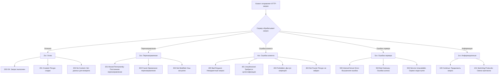

### **1xx: Информационные**

## Оглавление
- [**1xx: Информационные**](#1xx-информационные)
- [**2xx: Успешные**](#2xx-успешные)
- [**3xx: Перенаправление**](#3xx-перенаправление)
- [**4xx: Ошибки клиента**](#4xx-ошибки-клиента)
- [**5xx: Ошибки сервера**](#5xx-ошибки-сервера)
- [**Пример использования**](#пример-использования)

- **100 Continue** — сервер получил начальную часть запроса и ожидает продолжения.
- **101 Switching Protocols** — сервер согласен переключиться на другой протокол (например, с HTTP на WebSocket).

---

### **2xx: Успешные**
- **200 OK** — запрос успешно обработан.
- **201 Created** — ресурс успешно создан (например, после POST-запроса).
- **204 No Content** — запрос обработан, но сервер не возвращает контент (например, после успешного удаления).

---

### **3xx: Перенаправление**
- **301 Moved Permanently** — ресурс постоянно перемещён на новый URL.
- **302 Found** — временное перенаправление на другой URL.
- **304 Not Modified** — ресурс не изменился с последнего запроса (используется для кэширования).

---

### **4xx: Ошибки клиента**
- **400 Bad Request** — сервер не понимает запрос из-за синтаксической ошибки.
- **401 Unauthorized** — требуется аутентификация.
- **403 Forbidden** — доступ к ресурсу запрещён.
- **404 Not Found** — ресурс не найден.
- **405 Method Not Allowed** — метод (GET, POST и т.д.) не поддерживается для данного ресурса.

---

### **5xx: Ошибки сервера**
- **500 Internal Server Error** — внутренняя ошибка сервера.
- **502 Bad Gateway** — сервер, выступающий шлюзом, получил некорректный ответ от вышестоящего сервера.
- **503 Service Unavailable** — сервер временно недоступен (например, из-за перегрузки).

---

### **Пример использования**
Если вы отправляете POST-запрос для создания пользователя и получаете **201 Created**, это означает, что пользователь успешно создан. Если же вернётся **400 Bad Request**, значит в данных запроса есть ошибка.

---
