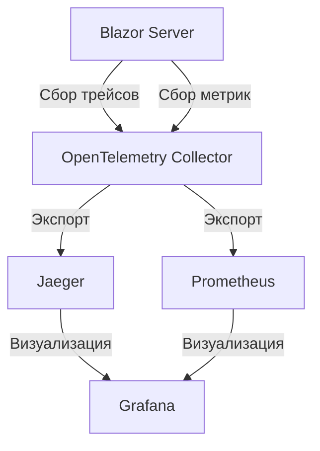
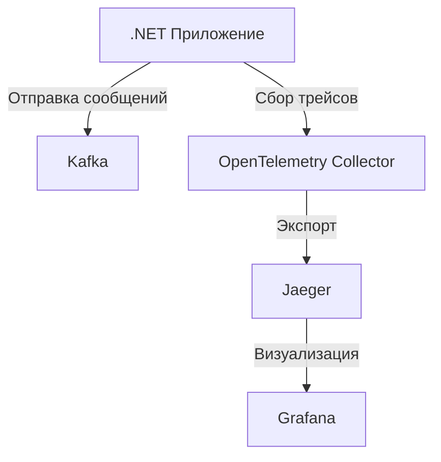
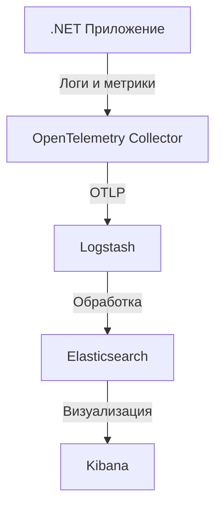
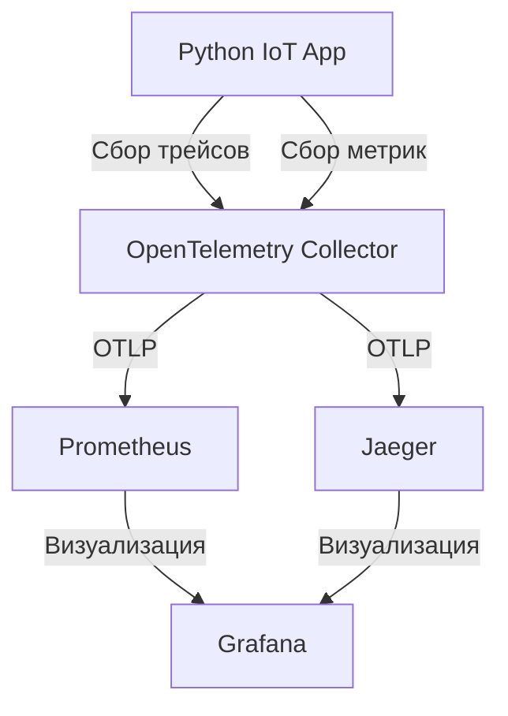
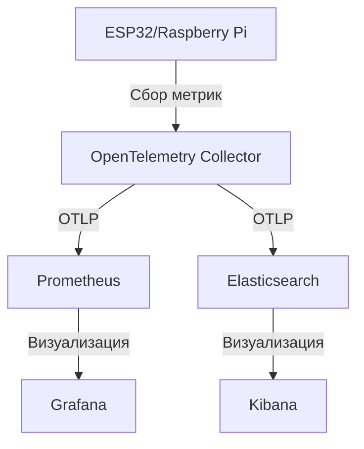

#### **Описание OpenTelemetry**

## Оглавление
      - [**Описание OpenTelemetry**](#описание-opentelemetry)
      - [**Сценарии использования**](#сценарии-использования)
      - [**Примеры кода**](#примеры-кода)
        - [**1. Установка OpenTelemetry в ASP.NET Core**](#1-установка-opentelemetry-в-aspnet-core)
        - [**2. Настройка OpenTelemetry в `Program.cs`**](#2-настройка-opentelemetry-в-programcs)
        - [**3. Сбор кастомных метрик**](#3-сбор-кастомных-метрик)
        - [**4. Сбор трейсов вручную**](#4-сбор-трейсов-вручную)
        - [**5. Интеграция с Prometheus**](#5-интеграция-с-prometheus)
      - [**Пример визуализации данных**](#пример-визуализации-данных)
      - [**Пример для IoT (ESP32/Raspberry Pi)**](#пример-для-iot-esp32raspberry-pi)
  - [**1. Интеграция OpenTelemetry с Blazor**](#1-интеграция-opentelemetry-с-blazor)
    - [**Описание**](#описание)
    - [**Пример кода для Blazor Server**](#пример-кода-для-blazor-server)
      - [**Установка NuGet-пакетов**](#установка-nuget-пакетов)
      - [**Настройка OpenTelemetry в `Program.cs`**](#настройка-opentelemetry-в-programcs)
      - [**Сбор кастомных метрик в Blazor**](#сбор-кастомных-метрик-в-blazor)
    - [**Схема Mermaid: Архитектура OpenTelemetry в Blazor**](#схема-mermaid-архитектура-opentelemetry-в-blazor)
  - [**2. Интеграция OpenTelemetry с Kafka**](#2-интеграция-opentelemetry-с-kafka)
    - [**Описание**](#описание)
    - [**Пример кода для Kafka**](#пример-кода-для-kafka)
      - [**Установка NuGet-пакетов**](#установка-nuget-пакетов)
      - [**Настройка OpenTelemetry для Kafka**](#настройка-opentelemetry-для-kafka)
      - [**Пример отправки сообщения с трейсингом**](#пример-отправки-сообщения-с-трейсингом)
    - [**Схема Mermaid: Архитектура OpenTelemetry с Kafka**](#схема-mermaid-архитектура-opentelemetry-с-kafka)
  - [**3. Интеграция OpenTelemetry с ELK Stack**](#3-интеграция-opentelemetry-с-elk-stack)
    - [**Описание**](#описание)
    - [**Пример кода для ELK Stack**](#пример-кода-для-elk-stack)
      - [**Установка NuGet-пакетов**](#установка-nuget-пакетов)
      - [**Настройка OpenTelemetry для ELK**](#настройка-opentelemetry-для-elk)
      - [**Настройка Logstash для приёма данных OpenTelemetry**](#настройка-logstash-для-приёма-данных-opentelemetry)
    - [**Схема Mermaid: Архитектура OpenTelemetry с ELK Stack**](#схема-mermaid-архитектура-opentelemetry-с-elk-stack)
  - [**Выводы**](#выводы)
    - [**OpenTelemetry: Интеграция с Python и IoT (ESP32/Raspberry Pi)**](#opentelemetry-интеграция-с-python-и-iot-esp32raspberry-pi)
      - [**1. Интеграция OpenTelemetry с Python**](#1-интеграция-opentelemetry-с-python)
        - [**Установка OpenTelemetry для Python**](#установка-opentelemetry-для-python)
        - [**Пример кода: Сбор метрик и трейсов**](#пример-кода-сбор-метрик-и-трейсов)
- [Настройка OpenTelemetry](#настройка-opentelemetry)
- [Автоматическая инструментация для HTTP-запросов](#автоматическая-инструментация-для-http-запросов)
- [Пример ручного трейсинга](#пример-ручного-трейсинга)
        - [**Схема Mermaid: Архитектура OpenTelemetry в Python**](#схема-mermaid-архитектура-opentelemetry-в-python)
      - [**2. Интеграция OpenTelemetry с IoT (ESP32/Raspberry Pi)**](#2-интеграция-opentelemetry-с-iot-esp32raspberry-pi)
        - [**Описание**](#описание)
        - [**Пример кода для Raspberry Pi (Python)**](#пример-кода-для-raspberry-pi-python)
- [Настройка OpenTelemetry для метрик](#настройка-opentelemetry-для-метрик)
        - [**Пример кода для ESP32 (MicroPython)**](#пример-кода-для-esp32-micropython)
- [Настройка Wi-Fi](#настройка-wi-fi)
- [Отправка метрик в OpenTelemetry Collector](#отправка-метрик-в-opentelemetry-collector)
- [Имитация чтения с датчика](#имитация-чтения-с-датчика)
        - [**Схема Mermaid: Архитектура OpenTelemetry с IoT**](#схема-mermaid-архитектура-opentelemetry-с-iot)
    - [**Выводы**](#выводы)

**OpenTelemetry** — это открытый стандарт для сбора, обработки и экспорта телеметрических данных (метрик, логов и трейсов) из приложений. Он предоставляет унифицированный подход к мониторингу и наблюдению за распределёнными системами, поддерживая интеграцию с различными инструментами анализа (например, **Prometheus**, **Jaeger**, **Zipkin**, **ELK Stack**).

**Основные компоненты OpenTelemetry:**
- **Трейсы (Traces):** Отслеживание пути запроса через распределённую систему.
- **Метрики (Metrics):** Сбор числовых данных о производительности (например, задержка, количество ошибок).
- **Логи (Logs):** Сбор и анализ логов приложений.

**Преимущества:**
- Кроссплатформенность (поддержка .NET, Java, Python, Go, Node.js и других языков).
- Интеграция с популярными системами мониторинга.
- Гибкость в настройке и расширении.

---

#### **Сценарии использования**
1. **Мониторинг микросервисов**
   OpenTelemetry помогает отслеживать взаимодействие между микросервисами, выявлять узкие места и оптимизировать производительность.

2. **Анализ производительности приложений**
   Сбор метрик и трейсов для выявления медленных операций, ошибок и аномалий.

3. **Интеграция с системами наблюдения**
   Экспорт данных в **Prometheus**, **Grafana**, **Jaeger** или **ELK Stack** для визуализации и анализа.

4. **Логирование и анализ логов**
   Централизованный сбор логов для упрощения отладки и мониторинга.

5. **IoT и встраиваемые системы**
   Мониторинг устройств на базе **ESP32** или **Raspberry Pi** (например, сбор метрик с датчиков).

---

#### **Примеры кода**

##### **1. Установка OpenTelemetry в ASP.NET Core**
Установите NuGet-пакеты:
```bash
dotnet add package OpenTelemetry
dotnet add package OpenTelemetry.Exporter.Jaeger
dotnet add package OpenTelemetry.Extensions.Hosting
dotnet add package OpenTelemetry.Instrumentation.AspNetCore
```

##### **2. Настройка OpenTelemetry в `Program.cs`**
```csharp
using OpenTelemetry;
using OpenTelemetry.Resources;
using OpenTelemetry.Trace;

var builder = WebApplication.CreateBuilder(args);

// Настройка OpenTelemetry
builder.Services.AddOpenTelemetry()
    .ConfigureResource(resource => resource
        .AddService(serviceName: "MyAspNetCoreApp"))
    .WithTracing(tracing => tracing
        .AddAspNetCoreInstrumentation()
        .AddJaegerExporter());

var app = builder.Build();
app.MapGet("/", () => "Hello, OpenTelemetry!");
app.Run();
```

##### **3. Сбор кастомных метрик**
```csharp
using OpenTelemetry.Metrics;
using System.Diagnostics.Metrics;

var meter = new Meter("MyApp.Metrics");
var counter = meter.CreateCounter<int>("myapp.requests.count");

app.MapGet("/metrics", () =>
{
    counter.Add(1, new KeyValuePair<string, object>("route", "/metrics"));
    return "Metrics collected!";
});
```

##### **4. Сбор трейсов вручную**
```csharp
using OpenTelemetry.Trace;
using System.Diagnostics;

var tracer = TracerProvider.Default.GetTracer("MyApp.Tracer");

app.MapGet("/trace", () =>
{
    using var span = tracer.StartActiveSpan("ProcessRequest");
    try
    {
        // Ваш код
        span.SetAttribute("user.id", 123);
        return "Request processed!";
    }
    finally
    {
        span.End();
    }
});
```

##### **5. Интеграция с Prometheus**
Установите NuGet-пакет:
```bash
dotnet add package OpenTelemetry.Exporter.Prometheus.AspNetCore
```

Настройте экспорт метрик:
```csharp
builder.Services.AddOpenTelemetry()
    .WithMetrics(metrics => metrics
        .AddAspNetCoreInstrumentation()
        .AddPrometheusExporter());
```

Добавьте middleware для Prometheus:
```csharp
app.UseOpenTelemetryPrometheusScrapingEndpoint();
```

---

#### **Пример визуализации данных**
Если вы используете **Grafana** или **Jaeger**, данные OpenTelemetry можно визуализировать в виде:
- **Графиков метрик** (например, количество запросов в секунду).
- **Диаграмм трейсов** (путь запроса через микросервисы).
- **Дашбордов** для анализа производительности.

---

#### **Пример для IoT (ESP32/Raspberry Pi)**
OpenTelemetry можно использовать и для встраиваемых систем. Например, сбор метрик с датчиков на **ESP32** и отправка их в **Prometheus**:
```python
from opentelemetry import metrics
from opentelemetry.sdk.metrics import MeterProvider
from opentelemetry.sdk.metrics.export import PrometheusMetricsExporter

meter = MeterProvider().get_meter("esp32.metrics")
counter = meter.create_counter("sensor.temperature")

def read_sensor():
    temp = sensor.read_temp()
    counter.add(temp, {"location": "room"})
```

---

## **1. Интеграция OpenTelemetry с Blazor**

### **Описание**
Blazor — это фреймворк для создания интерактивных веб-приложений на C#. OpenTelemetry позволяет собирать телеметрию (трейсы, метрики) из Blazor-приложений, что особенно полезно для мониторинга производительности клиентской и серверной частей.

---

### **Пример кода для Blazor Server**
#### **Установка NuGet-пакетов**
```bash
dotnet add package OpenTelemetry
dotnet add package OpenTelemetry.Exporter.Jaeger
dotnet add package OpenTelemetry.Instrumentation.AspNetCore
```

#### **Настройка OpenTelemetry в `Program.cs`**
```csharp
using OpenTelemetry;
using OpenTelemetry.Resources;
using OpenTelemetry.Trace;

var builder = WebApplication.CreateBuilder(args);

// Настройка OpenTelemetry
builder.Services.AddOpenTelemetry()
    .ConfigureResource(resource => resource
        .AddService(serviceName: "BlazorServerApp"))
    .WithTracing(tracing => tracing
        .AddAspNetCoreInstrumentation()
        .AddJaegerExporter());

var app = builder.Build();
app.MapBlazorHub();
app.MapFallbackToPage("/_Host");
app.Run();
```

#### **Сбор кастомных метрик в Blazor**
```csharp
@page "/counter"
@inject ILogger<Counter> Logger
@inject Meter Meter

<h1>Counter</h1>
<p>Current count: @currentCount</p>
<button @onclick="IncrementCount">Click me</button>

@code {
    private int currentCount = 0;
    private Counter<int> counter;

    protected override void OnInitialized()
    {
        counter = Meter.CreateCounter<int>("blazor.counter.clicks");
    }

    private void IncrementCount()
    {
        currentCount++;
        counter.Add(1);
        Logger.LogInformation("Counter incremented to {Count}", currentCount);
    }
}
```

---

### **Схема Mermaid: Архитектура OpenTelemetry в Blazor**


---

## **2. Интеграция OpenTelemetry с Kafka**

### **Описание**
OpenTelemetry позволяет отслеживать взаимодействие с **Apache Kafka** (например, время отправки и получения сообщений). Это полезно для мониторинга производительности брокера сообщений.

---

### **Пример кода для Kafka**
#### **Установка NuGet-пакетов**
```bash
dotnet add package OpenTelemetry.Instrumentation.ConfluentKafka
```

#### **Настройка OpenTelemetry для Kafka**
```csharp
using OpenTelemetry;
using OpenTelemetry.Instrumentation.ConfluentKafka;

var builder = WebApplication.CreateBuilder(args);

builder.Services.AddOpenTelemetry()
    .WithTracing(tracing => tracing
        .AddConfluentKafkaInstrumentation()
        .AddJaegerExporter());

var app = builder.Build();
app.Run();
```

#### **Пример отправки сообщения с трейсингом**
```csharp
using Confluent.Kafka;
using OpenTelemetry.Trace;

var tracer = TracerProvider.Default.GetTracer("KafkaProducer");

using var producer = new ProducerBuilder<Null, string>(new ProducerConfig { BootstrapServers = "localhost:9092" }).Build();

using (var span = tracer.StartActiveSpan("SendKafkaMessage"))
{
    try
    {
        var result = await producer.ProduceAsync("test-topic", new Message<Null, string> { Value = "Hello, Kafka!" });
        span.SetAttribute("kafka.topic", "test-topic");
        span.SetAttribute("kafka.offset", result.Offset);
    }
    catch (Exception ex)
    {
        span.RecordException(ex);
    }
}
```

---

### **Схема Mermaid: Архитектура OpenTelemetry с Kafka**


---

## **3. Интеграция OpenTelemetry с ELK Stack**

### **Описание**
**ELK Stack** (Elasticsearch, Logstash, Kibana) — популярное решение для сбора, обработки и визуализации логов. OpenTelemetry позволяет отправлять логи и метрики в **Elasticsearch** через **Logstash** или напрямую.

---

### **Пример кода для ELK Stack**
#### **Установка NuGet-пакетов**
```bash
dotnet add package OpenTelemetry.Exporter.OpenTelemetryProtocol
dotnet add package OpenTelemetry.Extensions.Hosting
```

#### **Настройка OpenTelemetry для ELK**
```csharp
using OpenTelemetry;
using OpenTelemetry.Logs;
using OpenTelemetry.Resources;

var builder = WebApplication.CreateBuilder(args);

builder.Services.AddOpenTelemetry()
    .ConfigureResource(resource => resource
        .AddService(serviceName: "ElkApp"))
    .WithTracing(tracing => tracing
        .AddAspNetCoreInstrumentation()
        .AddOtlpExporter(options => options.Endpoint = new Uri("http://logstash:4317")))
    .WithMetrics(metrics => metrics
        .AddAspNetCoreInstrumentation()
        .AddOtlpExporter(options => options.Endpoint = new Uri("http://logstash:4317")));

var app = builder.Build();
app.Run();
```

#### **Настройка Logstash для приёма данных OpenTelemetry**
```conf
input {
  otlp {
    port => 4317
  }
}

filter {
  # Обработка данных
}

output {
  elasticsearch {
    hosts => ["http://elasticsearch:9200"]
    index => "opentelemetry-logs-%{+YYYY.MM.dd}"
  }
}
```

---

### **Схема Mermaid: Архитектура OpenTelemetry с ELK Stack**


---

## **Выводы**
- **Blazor**: OpenTelemetry собирает метрики и трейсы как на клиенте, так и на сервере.
- **Kafka**: Отслеживание производительности отправки и получения сообщений.
- **ELK Stack**: Централизованный сбор и анализ логов и метрик.

---

### **OpenTelemetry: Интеграция с Python и IoT (ESP32/Raspberry Pi)**

---

#### **1. Интеграция OpenTelemetry с Python**
OpenTelemetry для Python позволяет собирать метрики, трейсы и логи из приложений на Python. Это полезно для мониторинга производительности скриптов, микросервисов и IoT-устройств.

---

##### **Установка OpenTelemetry для Python**
```bash
pip install opentelemetry-api
pip install opentelemetry-sdk
pip install opentelemetry-exporter-otlp
pip install opentelemetry-instrumentation-requests
```

---

##### **Пример кода: Сбор метрик и трейсов**
```python
from opentelemetry import trace
from opentelemetry.sdk.trace import TracerProvider
from opentelemetry.sdk.trace.export import BatchSpanProcessor
from opentelemetry.exporter.otlp.proto.grpc.trace_exporter import OTLPSpanExporter
from opentelemetry.sdk.resources import Resource
from opentelemetry.instrumentation.requests import RequestsInstrumentor

# Настройка OpenTelemetry

      - [**Описание OpenTelemetry**](#описание-opentelemetry)
      - [**Сценарии использования**](#сценарии-использования)
      - [**Примеры кода**](#примеры-кода)
        - [**1. Установка OpenTelemetry в ASP.NET Core**](#1-установка-opentelemetry-в-aspnet-core)
        - [**2. Настройка OpenTelemetry в `Program.cs`**](#2-настройка-opentelemetry-в-programcs)
        - [**3. Сбор кастомных метрик**](#3-сбор-кастомных-метрик)
        - [**4. Сбор трейсов вручную**](#4-сбор-трейсов-вручную)
        - [**5. Интеграция с Prometheus**](#5-интеграция-с-prometheus)
      - [**Пример визуализации данных**](#пример-визуализации-данных)
      - [**Пример для IoT (ESP32/Raspberry Pi)**](#пример-для-iot-esp32raspberry-pi)
  - [**1. Интеграция OpenTelemetry с Blazor**](#1-интеграция-opentelemetry-с-blazor)
    - [**Описание**](#описание)
    - [**Пример кода для Blazor Server**](#пример-кода-для-blazor-server)
      - [**Установка NuGet-пакетов**](#установка-nuget-пакетов)
      - [**Настройка OpenTelemetry в `Program.cs`**](#настройка-opentelemetry-в-programcs)
      - [**Сбор кастомных метрик в Blazor**](#сбор-кастомных-метрик-в-blazor)
    - [**Схема Mermaid: Архитектура OpenTelemetry в Blazor**](#схема-mermaid-архитектура-opentelemetry-в-blazor)
  - [**2. Интеграция OpenTelemetry с Kafka**](#2-интеграция-opentelemetry-с-kafka)
    - [**Описание**](#описание)
    - [**Пример кода для Kafka**](#пример-кода-для-kafka)
      - [**Установка NuGet-пакетов**](#установка-nuget-пакетов)
      - [**Настройка OpenTelemetry для Kafka**](#настройка-opentelemetry-для-kafka)
      - [**Пример отправки сообщения с трейсингом**](#пример-отправки-сообщения-с-трейсингом)
    - [**Схема Mermaid: Архитектура OpenTelemetry с Kafka**](#схема-mermaid-архитектура-opentelemetry-с-kafka)
  - [**3. Интеграция OpenTelemetry с ELK Stack**](#3-интеграция-opentelemetry-с-elk-stack)
    - [**Описание**](#описание)
    - [**Пример кода для ELK Stack**](#пример-кода-для-elk-stack)
      - [**Установка NuGet-пакетов**](#установка-nuget-пакетов)
      - [**Настройка OpenTelemetry для ELK**](#настройка-opentelemetry-для-elk)
      - [**Настройка Logstash для приёма данных OpenTelemetry**](#настройка-logstash-для-приёма-данных-opentelemetry)
    - [**Схема Mermaid: Архитектура OpenTelemetry с ELK Stack**](#схема-mermaid-архитектура-opentelemetry-с-elk-stack)
  - [**Выводы**](#выводы)
    - [**OpenTelemetry: Интеграция с Python и IoT (ESP32/Raspberry Pi)**](#opentelemetry-интеграция-с-python-и-iot-esp32raspberry-pi)
      - [**1. Интеграция OpenTelemetry с Python**](#1-интеграция-opentelemetry-с-python)
        - [**Установка OpenTelemetry для Python**](#установка-opentelemetry-для-python)
        - [**Пример кода: Сбор метрик и трейсов**](#пример-кода-сбор-метрик-и-трейсов)
        - [**Схема Mermaid: Архитектура OpenTelemetry в Python**](#схема-mermaid-архитектура-opentelemetry-в-python)
      - [**2. Интеграция OpenTelemetry с IoT (ESP32/Raspberry Pi)**](#2-интеграция-opentelemetry-с-iot-esp32raspberry-pi)
        - [**Описание**](#описание)
        - [**Пример кода для Raspberry Pi (Python)**](#пример-кода-для-raspberry-pi-python)
        - [**Пример кода для ESP32 (MicroPython)**](#пример-кода-для-esp32-micropython)
        - [**Схема Mermaid: Архитектура OpenTelemetry с IoT**](#схема-mermaid-архитектура-opentelemetry-с-iot)
    - [**Выводы**](#выводы)
resource = Resource(attributes={"service.name": "python-iot-app"})
trace_provider = TracerProvider(resource=resource)
trace_provider.add_span_processor(BatchSpanProcessor(OTLPSpanExporter()))
trace.set_tracer_provider(trace_provider)

# Автоматическая инструментация для HTTP-запросов
RequestsInstrumentor().instrument()

# Пример ручного трейсинга
tracer = trace.get_tracer("iot.tracer")

def read_sensor():
    with tracer.start_as_current_span("read_sensor") as span:
        try:
            # Имитация чтения с датчика
            temperature = 25.5
            span.set_attribute("sensor.temperature", temperature)
            return temperature
        except Exception as e:
            span.record_exception(e)
            raise

if __name__ == "__main__":
    print(f"Temperature: {read_sensor()}°C")
```

---

##### **Схема Mermaid: Архитектура OpenTelemetry в Python**


---

#### **2. Интеграция OpenTelemetry с IoT (ESP32/Raspberry Pi)**

##### **Описание**
OpenTelemetry можно использовать для сбора телеметрии с устройств на базе **ESP32** или **Raspberry Pi**. Например, вы можете отправлять метрики с датчиков температуры, влажности или других параметров в систему мониторинга.

---

##### **Пример кода для Raspberry Pi (Python)**
```python
from opentelemetry import metrics
from opentelemetry.sdk.metrics import MeterProvider
from opentelemetry.sdk.metrics.export import PeriodicExportingMetricReader
from opentelemetry.exporter.otlp.proto.grpc.metric_exporter import OTLPMetricExporter
import random
import time

# Настройка OpenTelemetry для метрик
metric_exporter = OTLPMetricExporter()
metric_reader = PeriodicExportingMetricReader(metric_exporter, export_interval_millis=5000)
meter_provider = MeterProvider(metric_readers=[metric_reader])
metrics.set_meter_provider(meter_provider)

meter = metrics.get_meter("raspberrypi.metrics")
temperature_counter = meter.create_counter("sensor.temperature")

def read_sensor():
    # Имитация чтения с датчика температуры
    temperature = random.uniform(20.0, 30.0)
    temperature_counter.add(temperature, {"location": "room"})
    return temperature

if __name__ == "__main__":
    while True:
        print(f"Temperature: {read_sensor():.2f}°C")
        time.sleep(5)
```

---

##### **Пример кода для ESP32 (MicroPython)**
```python
import network
import urequests
import time
import random
from machine import Pin

# Настройка Wi-Fi
sta_if = network.WLAN(network.STA_IF)
sta_if.active(True)
sta_if.connect("YOUR_WIFI_SSID", "YOUR_WIFI_PASSWORD")

while not sta_if.isconnected():
    time.sleep(1)

# Отправка метрик в OpenTelemetry Collector
def send_metrics(temperature):
    url = "http://<OPENTELEMETRY_COLLECTOR_IP>:4318/v1/metrics"
    data = {
        "resource_metrics": [
            {
                "resource": {"attributes": [{"key": "service.name", "value": {"string_value": "esp32-iot"}}]},
                "scope_metrics": [
                    {
                        "metrics": [
                            {
                                "name": "sensor.temperature",
                                "data": {
                                    "data_points": [{"value": temperature, "attributes": [{"key": "location", "value": {"string_value": "room"}}]}]
                                }
                            }
                        ]
                    }
                ]
            }
        ]
    }
    headers = {"Content-Type": "application/json"}
    response = urequests.post(url, json=data, headers=headers)
    print(f"Metrics sent: {response.status_code}")

# Имитация чтения с датчика
while True:
    temperature = random.uniform(20.0, 30.0)
    print(f"Temperature: {temperature:.2f}°C")
    send_metrics(temperature)
    time.sleep(5)
```

---

##### **Схема Mermaid: Архитектура OpenTelemetry с IoT**


---

### **Выводы**
- **Python**: OpenTelemetry позволяет собирать метрики и трейсы из приложений на Python, включая IoT-скрипты.
- **ESP32/Raspberry Pi**: Можно отправлять метрики с устройств в системы мониторинга (Prometheus, Elasticsearch).