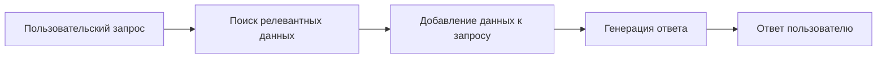

## Documentation

## Оглавление
  - [Documentation](#documentation)
  - [**1. Что такое RAG?**](#1-что-такое-rag)
    - [**Основная идея:**](#основная-идея)
  - [**2. Как работает RAG?**](#2-как-работает-rag)
    - [**Шаги работы RAG:**](#шаги-работы-rag)
    - [**Схема работы:**](#схема-работы)
  - [**3. Где используется RAG?**](#3-где-используется-rag)
    - [**Примеры применения:**](#примеры-применения)
  - [**4. Как использовать RAG на практике?**](#4-как-использовать-rag-на-практике)
    - [**Пример 1: Чат-бот для технической поддержки**](#пример-1-чат-бот-для-технической-поддержки)
- [Загружаем модель и токенайзер](#загружаем-модель-и-токенайзер)
- [Пользовательский запрос](#пользовательский-запрос)
- [Генерация ответа](#генерация-ответа)
    - [**Пример 2: Поиск по документации**](#пример-2-поиск-по-документации)
- [Загружаем модель для эмбеддингов](#загружаем-модель-для-эмбеддингов)
- [Документация (упрощённо)](#документация-упрощённо)
- [Кодируем документы и запрос](#кодируем-документы-и-запрос)
- [Ищем наиболее релевантный документ](#ищем-наиболее-релевантный-документ)
  - [**5. Популярные инструменты для RAG**](#5-популярные-инструменты-для-rag)
  - [**6. Плюсы и минусы RAG**](#6-плюсы-и-минусы-rag)

https://habr.com/ru/companies/T1Holding/articles/936134/
https://habr.com/ru/articles/985032/

**RAG (Retrieval-Augmented Generation)** — это современный подход в области обработки естественного языка (NLP), который сочетает в себе **поиск информации** (retrieval) и **генерацию текста** (generation). Давай разберём, что это такое, как работает, где применяется и как можно использовать на практике.

---

## **1. Что такое RAG?**
**RAG** — это архитектура, которая позволяет нейронным сетям (например, большим языковым моделям) **использовать внешние источники данных** для генерации более точных, актуальных и контекстуально релевантных ответов.

### **Основная идея:**
- **Retrieval (Поиск)**: Модель ищет релевантную информацию в большой базе данных (например, Википедия, документация, внутренние базы знаний).
- **Augmented Generation (Улучшенная генерация)**: Найденная информация добавляется к запросу пользователя, и модель генерирует ответ, опираясь на эти данные.

**Преимущества RAG:**
- Позволяет модели работать с **актуальной информацией** (даже если она не была в обучающей выборке).
- Уменьшает количество "галлюцинаций" (выдуманных фактов).
- Позволяет адаптировать модель под **специфические домены** (например, медицина, юриспруденция, техническая документация).

---

## **2. Как работает RAG?**
### **Шаги работы RAG:**
1. **Пользовательский запрос** (например, "Как работает блокчейн?").
2. **Поисковый модуль** ищет релевантные документы или фрагменты текста в базе данных.
3. **Модель генерации** (например, трансформер) получает **исходный запрос + найденные данные** и генерирует ответ.
4. **Ответ** возвращается пользователю с учётом найденной информации.

### **Схема работы:**


---

## **3. Где используется RAG?**
### **Примеры применения:**
- **Чат-боты с доступом к базе знаний** (например, поддержка клиентов, где бот отвечает на вопросы, опираясь на документацию компании).
- **Поисковые системы** (например, Google может использовать RAG для генерации кратких ответов на вопросы).
- **Аналитика данных** (например, генерация отчётов на основе больших массивов информации).
- **Образование** (например, виртуальный репетитор, который объясняет темы, опираясь на учебники и статьи).

---

## **4. Как использовать RAG на практике?**
### **Пример 1: Чат-бот для технической поддержки**
**Задача:** Создать бота, который отвечает на вопросы о продукте, используя внутреннюю документацию.

**Шаги:**
1. **Собрать базу знаний** (например, FAQ, мануалы, статьи).
2. **Индексировать данные** (например, с помощью Elasticsearch или FAISS).
3. **Настроить RAG-модель** (например, использовать Hugging Face Transformers + библиотеку для поиска).
4. **Интегрировать с чат-ботом** (например, через API).

**Пример кода (Python, упрощённо):**
```python
from transformers import RagTokenizer, RagRetriever, RagSequenceForGeneration

# Загружаем модель и токенайзер

  - [Documentation](#documentation)
  - [**1. Что такое RAG?**](#1-что-такое-rag)
    - [**Основная идея:**](#основная-идея)
  - [**2. Как работает RAG?**](#2-как-работает-rag)
    - [**Шаги работы RAG:**](#шаги-работы-rag)
    - [**Схема работы:**](#схема-работы)
  - [**3. Где используется RAG?**](#3-где-используется-rag)
    - [**Примеры применения:**](#примеры-применения)
  - [**4. Как использовать RAG на практике?**](#4-как-использовать-rag-на-практике)
    - [**Пример 1: Чат-бот для технической поддержки**](#пример-1-чат-бот-для-технической-поддержки)
    - [**Пример 2: Поиск по документации**](#пример-2-поиск-по-документации)
  - [**5. Популярные инструменты для RAG**](#5-популярные-инструменты-для-rag)
  - [**6. Плюсы и минусы RAG**](#6-плюсы-и-минусы-rag)
tokenizer = RagTokenizer.from_pretrained("facebook/rag-sequence-nq")
retriever = RagRetriever.from_pretrained("facebook/rag-sequence-nq", index_name="exact")
model = RagSequenceForGeneration.from_pretrained("facebook/rag-sequence-nq", retriever=retriever)

# Пользовательский запрос
question = "Как работает блокчейн?"
inputs = tokenizer(question, return_tensors="pt")

# Генерация ответа
outputs = model.generate(input_ids=inputs["input_ids"])
answer = tokenizer.decode(outputs[0], skip_special_tokens=True)
print(answer)
```

---

### **Пример 2: Поиск по документации**
**Задача:** Найти ответ на вопрос в большой документации (например, "Как настроить PostgreSQL для высоких нагрузок?").

**Шаги:**
1. **Загрузить документацию** в векторную базу данных (например, с помощью `sentence-transformers`).
2. **Найти наиболее релевантные фрагменты** к запросу.
3. **Сгенерировать ответ** на основе найденных фрагментов.

**Пример кода (Python, упрощённо):**
```python
from sentence_transformers import SentenceTransformer
from sklearn.metrics.pairwise import cosine_similarity

# Загружаем модель для эмбеддингов
model = SentenceTransformer('all-MiniLM-L6-v2')

# Документация (упрощённо)
docs = [
    "PostgreSQL поддерживает репликацию для распределения нагрузки.",
    "Для высоких нагрузок рекомендуется настраивать shared_buffers и effective_cache_size.",
    "Индексы ускоряют поиск, но требуют дополнительной памяти."
]

# Кодируем документы и запрос
query = "Как настроить PostgreSQL для высоких нагрузок?"
doc_embeddings = model.encode(docs)
query_embedding = model.encode([query])

# Ищем наиболее релевантный документ
similarities = cosine_similarity(query_embedding, doc_embeddings)
most_relevant_idx = similarities.argmax()
answer = docs[most_relevant_idx]

print(answer)  # "Для высоких нагрузок рекомендуется настраивать shared_buffers и effective_cache_size."
```

---

## **5. Популярные инструменты для RAG**
- **Библиотеки**:
  - `transformers` (Hugging Face) — для работы с RAG-моделями.
  - `sentence-transformers` — для генерации эмбеддингов.
  - `FAISS` (Facebook) — для быстрого поиска по векторам.
  - `Elasticsearch` — для полнотекстового поиска.
- **Модели**:
  - `facebook/rag-sequence-nq` (для вопросов и ответов).
  - `google/realm` (для работы с большими базами знаний).

---

## **6. Плюсы и минусы RAG**
| **Плюсы**                          | **Минусы**                          |
|-------------------------------------|-------------------------------------|
| Актуальные ответы                   | Требует большой базы данных         |
| Меньше "галлюцинаций"               | Зависит от качества поиска          |
| Легко адаптировать под домен        | Может быть медленнее чистой генерации |

---