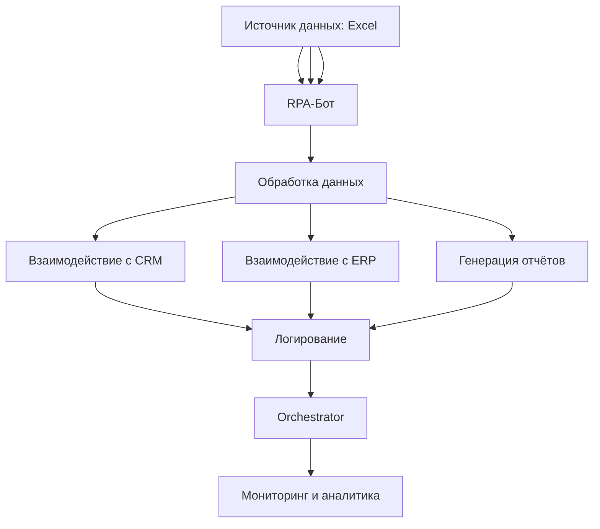

**Robotic Process Automation (RPA)** — это технология автоматизации бизнес-процессов, основанная на использовании программных роботов (ботов), которые имитируют действия человека при взаимодействии с цифровыми системами и приложениями. RPA позволяет автоматизировать рутинные, повторяющиеся задачи, выполняемые по заранее определённым правилам, без необходимости изменения существующей IT-инфраструктуры.

Основные характеристики RPA:
- **Неинвазивность:** RPA работает на уровне интерфейса пользователя, не требуя интеграции с внутренними системами через API.
- **Правила и структурированные данные:** RPA эффективен для задач, где данные структурированы, а правила выполнения чётко определены.
- **Масштабируемость:** Возможность развёртывания большого количества ботов для параллельного выполнения задач.
- **Универсальность:** Поддерживает работу с различными приложениями (ERP, CRM, Excel, веб-браузеры, электронная почта и др.).

---

#### Компоненты RPA
1. **Роботы (боты):**
   Программные агенты, выполняющие автоматизированные задачи. Бывают трёх типов:
   - **Attended Bots (интерактивные боты):** Работают под контролем человека, запускаются вручную для выполнения конкретных задач.
   - **Unattended Bots (фоновые боты):** Выполняют задачи полностью автономно, без участия человека.
   - **Hybrid Bots:** Комбинируют функции интерактивных и фоновых ботов.

2. **RPA-платформа:**
   Инструмент для разработки, управления и мониторинга ботов. Примеры платформ: UiPath, Blue Prism, Automation Anywhere.

3. **Оркестратор (Orchestrator):**
   Централизованная система для управления ботами, распределения задач и сбора аналитики.

---

#### Принцип Работы RPA
1. **Захват данных:** Бот извлекает данные из источников (например, электронные письма, Excel-файлы, веб-формы).
2. **Обработка данных:** Бот анализирует данные и принимает решения на основе заданных правил.
3. **Выполнение действий:** Бот взаимодействует с целевыми системами (например, ввод данных в CRM, отправка уведомлений, генерация отчётов).
4. **Логирование и отчётность:** Бот фиксирует результаты выполнения задач и генерирует отчёты для анализа.

---

#### Примеры Использования RPA

##### 1. **Обработка Заявок на Кредит в Банке**
**Сценарий:**
Клиент подаёт заявку на кредит через веб-портал банка. Процесс обработки включает проверку кредитной истории, оценку платёжеспособности и принятие решения.

**Автоматизация с RPA:**
- Бот извлекает данные из заявки (ФИО, паспортные данные, доход).
- Бот отправляет запрос в кредитное бюро для проверки кредитной истории.
- Бот анализирует полученные данные и сравнивает их с внутренними критериями банка.
- Бот принимает предварительное решение (одобрение/отказ) и отправляет уведомление клиенту и менеджеру.

**Преимущества:**
- Сокращение времени обработки с нескольких дней до нескольких минут.
- Исключение ошибок, связанных с ручным вводом данных.

---

##### 2. **Автоматизация Отчётности в Финансовом Департаменте**
**Сценарий:**
Ежемесячно финансовый отдел компании формирует отчёты для регуляторов, собирая данные из нескольких систем (1C, Excel, ERP).

**Автоматизация с RPA:**
- Бот собирает данные из 1C, Excel и ERP-системы.
- Бот консолидирует данные в единый отчёт согласно шаблону.
- Бот проверяет отчёт на соответствие требованиям регуляторов.
- Бот отправляет отчёт на утверждение руководителю и архивирует его.

**Преимущества:**
- Снижение трудоёмкости на 80%.
- Исключение ошибок при консолидации данных.

---

##### 3. **Обработка Заказов в Онлайн-Магазине**
**Сценарий:**
Клиент оформляет заказ на сайте. Данные о заказе необходимо перенести в систему управления складом (WMS) и систему доставки.

**Автоматизация с RPA:**
- Бот извлекает данные о заказе из веб-формы (товары, адрес доставки, контакты).
- Бот проверяет наличие товаров на складе через WMS.
- Бот создаёт задачу на сборку заказа и формирует этикетку для доставки.
- Бот отправляет уведомление клиенту и курьерской службе.

**Преимущества:**
- Ускорение обработки заказов в 5 раз.
- Снижение количества ошибок при оформлении заказов.

---

##### 4. **Мониторинг и Обновление Данных о Клиентах**
**Сценарий:**
Банк должен регулярно обновлять данные о клиентах (адреса, контакты) в CRM-системе на основе данных из внешних источников.

**Автоматизация с RPA:**
- Бот скачивает актуальные данные о клиентах из государственных реестров.
- Бот сравнивает данные с информацией в CRM.
- Бот обновляет записи в CRM при обнаружении расхождений.
- Бот отправляет отчёт об обновлениях менеджеру.

**Преимущества:**
- Актуальность данных о клиентах на уровне 99%.
- Снижение нагрузки на сотрудников отдела поддержки.

---

##### 5. **Автоматизация Технической Поддержки (Help Desk)**
**Сценарий:**
Сотрудники IT-отдела обрабатывают повторяющиеся запросы (например, сброс пароля, доступ к системам).

**Автоматизация с RPA:**
- Бот анализирует входящие запросы в системе Help Desk.
- Бот автоматически выполняет стандартные операции (сброс пароля, предоставление доступа).
- Бот уведомляет пользователя о статусе запроса.
- Бот эскалирует сложные запросы человеку.

**Преимущества:**
- Сокращение времени обработки запросов на 70%.
- Освобождение IT-специалистов для решения сложных задач.

---

#### Сравнение RPA с Другими Технологиями Автоматизации

| Технология               | RPA                          | BPM (Business Process Management) | AI/ML (Искусственный Интеллект) |
|---------------------------|------------------------------|------------------------------------|----------------------------------|
| **Уровень автоматизации** | Задачи                       | Процессы                          | Задачи и процессы               |
| **Интеграция**            | На уровне интерфейса        | На уровне API                     | На уровне данных и API          |
| **Гибкость**              | Низкая (правила фиксированы)| Высокая                           | Очень высокая                   |
| **Применение**            | Рутинные задачи              | Сложные процессы                  | Аналитика, прогнозирование      |

---

#### Преимущества RPA
1. **Быстрота внедрения:** Разработка и развёртывание ботов занимает недели, а не месяцы.
2. **Снижение затрат:** Уменьшение операционных расходов за счёт автоматизации рутинных задач.
3. **Повышение точности:** Исключение человеческих ошибок при выполнении повторяющихся операций.
4. **Масштабируемость:** Возможность быстро увеличивать количество ботов при росте нагрузки.
5. **Совместимость:** Работа с унаследованными системами без необходимости их модернизации.

---

#### Ограничения RPA
1. **Ограниченность правилами:** RPA не подходит для задач, требующих творческого подхода или работы с неструктурированными данными.
2. **Зависимость от интерфейса:** Изменения в интерфейсе приложений могут потребовать доработки ботов.
3. **Отсутствие обучения:** RPA не способен обучаться на новых данных (в отличие от ИИ).

---

#### Интеграция RPA с Другими Технологиями
Для преодоления ограничений RPA его часто интегрируют с другими технологиями:
- **Искусственный интеллект (AI):** Для обработки неструктурированных данных (например, распознавание текста, анализ тональности).
- **Машинное обучение (ML):** Для прогнозирования и принятия решений на основе исторических данных.
- **BPM-системы:** Для управления сложными бизнес-процессами, где RPA автоматизирует отдельные задачи.

---

#### Пример Архитектуры RPA-Решения

---

#### Популярные RPA-Платформы
1. **UiPath:**
   - Поддержка как attended, так и unattended ботов.
   - Интуитивный интерфейс для разработки ботов.
   - Облачный оркестратор для управления ботами.

2. **Blue Prism:**
   - Высокая надёжность и безопасность.
   - Поддержка сложных бизнес-процессов.
   - Интеграция с системами enterprise-уровня.

3. **Automation Anywhere:**
   - Облачная платформа с поддержкой ИИ.
   - Возможность автоматизации задач на мобильных устройствах.
   - Встроенные инструменты для анализа процессов.

---

#### Заключение
RPA является мощным инструментом для автоматизации рутинных и повторяющихся задач, что позволяет организациям повышать эффективность, снижать затраты и улучшать качество обслуживания. Однако для максимальной отдачи RPA следует интегрировать с другими технологиями, такими как ИИ и BPM, особенно в случаях, когда процессы требуют работы с неструктурированными данными или принятия сложных решений.