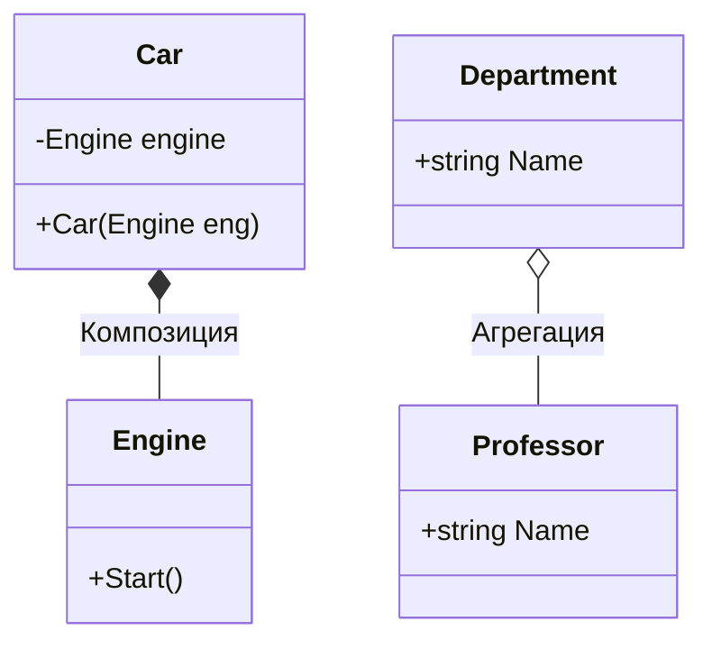
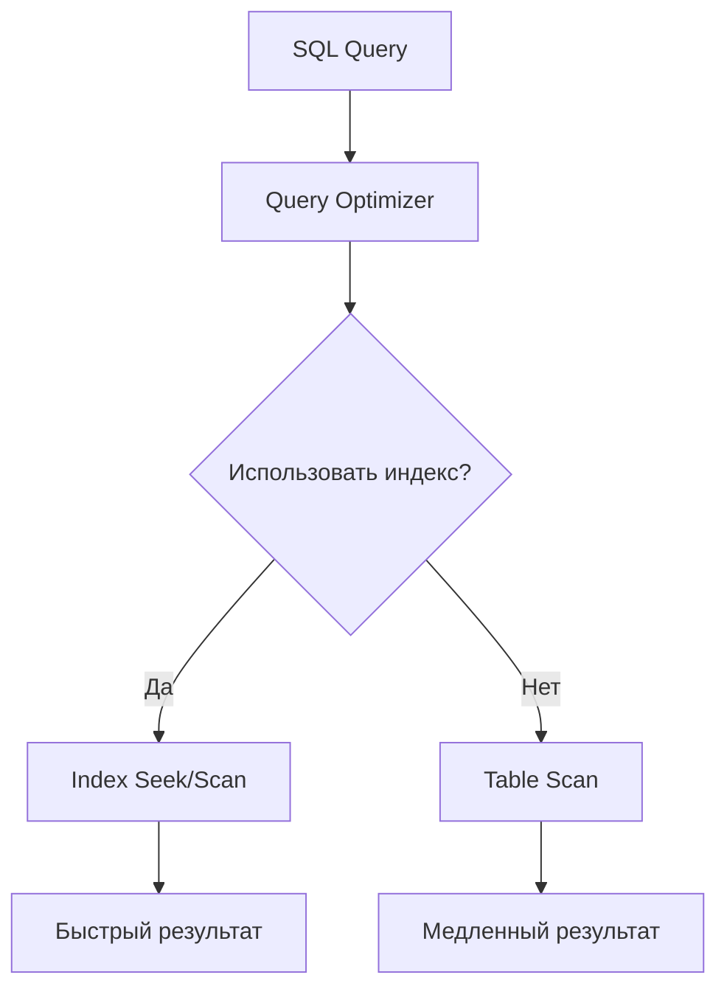
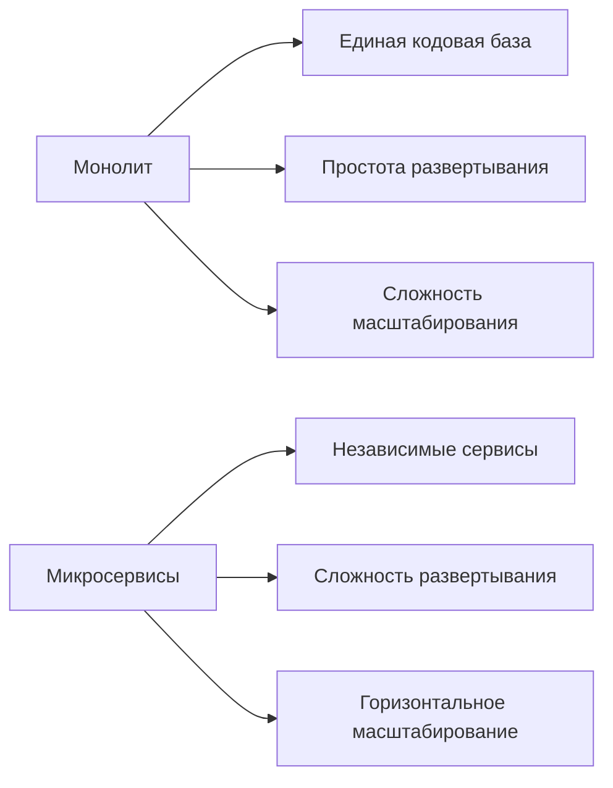
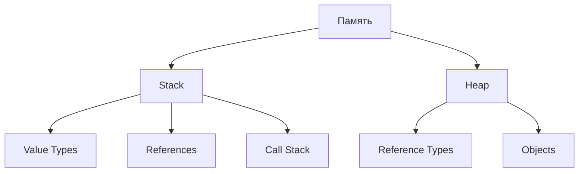

### 1. Теоретическая часть

#### ООП (Объектно-Ориентированное Программирование)

**1. Что такое инкапсуляция, наследование и полиморфизм?**
**Ответ:** 
- **Инкапсуляция** - сокрытие внутренней реализации и данных класса, доступ к которым осуществляется через публичные методы.
- **Наследование** - возможность создания нового класса на основе существующего с переносом его свойств и методов.
- **Полиморфизм** - возможность объектов с одинаковой спецификацией иметь различную реализацию (переопределение методов, интерфейсы).

**2. В чем разница между абстрактным классом и интерфейсом?**
**Ответ:**
- Абстрактный класс может содержать реализацию, поля, конструкторы; интерфейс - только сигнатуры методов, свойства, события.
- Класс может наследовать только один абстрактный класс, но множество интерфейсов.
- Абстрактный класс используется для создания иерархии "is-a" отношений, интерфейс - для определения контракта.

**3. Что такое композиция и агрегация?**
**Ответ:**

- **Композиция**: сильная связь, где объект-часть не может существовать без объекта-целого (Двигатель не существует без Автомобиля).
- **Агрегация**: слабая связь, где объект-часть может существовать независимо (Профессор может работать в разных Кафедрах).

**4. Что такое принципы SOLID?**
**Ответ:**
- **S**RP: Принцип единственной ответственности - класс должен иметь только одну причину для изменения.
- **O**CP: Принцип открытости/закрытости - классы должны быть открыты для расширения, но закрыты для модификации.
- **L**SP: Принцип подстановки Барбары Лисков - объекты должны быть заменяемыми на экземпляры их подтипов.
- **I**SP: Принцип разделения интерфейсов - много специализированных интерфейсов лучше одного универсального.
- **D**IP: Принцип инверсии зависимостей - зависимости должны быть от абстракций, а не от конкретных классов.

**5. Объясните принцип подстановки Лисков (LSP)**
**Ответ:** Объекты в программе должны быть заменяемыми на экземпляры их подтипов без изменения правильности программы. Нарушение LSP:
```csharp
class Rectangle { public virtual int Width { get; set; } public virtual int Height { get; set; } }
class Square : Rectangle 
{ 
    public override int Width { get => base.Width; set { base.Width = value; base.Height = value; } }
    // Нарушение LSP - изменение Width влияет на Height
}
```

**6. Что такое Dependency Injection?**
**Ответ:** Паттерн, при котором зависимости передаются объекту извне, а не создаются внутри него. Упрощает тестирование и соблюдение DIP.

**7. В чем разница между Value Type и Reference Type?**
**Ответ:**
- Value Type (int, struct, enum) хранятся в стеке, копируются по значению
- Reference Type (class, string, array) хранятся в куче, копируются по ссылке

**8. Что такое ковариантность и контравариантность?**
**Ответ:**
- Ковариантность: возможность использовать более производный тип (IEnumerable<Derived> → IEnumerable<Base>)
- Контравариантность: возможность использовать более базовый тип (Action<Base> → Action<Derived>)

**9. Что такое паттерн Repository?**
**Ответ:** Паттерн, который абстрагирует доступ к данным, инкапсулируя логику работы с хранилищем.

**10. Что такое CQRS?**
**Ответ:** Command Query Responsibility Segregation - разделение моделей для чтения (Query) и записи (Command) данных.

#### Базы данных

**11. Что такое индексы и как они работают?**
**Ответ:** Индексы - структуры данных, ускоряющие поиск в таблице. Работают подобно оглавлению в книге.


**12. Какие типы индексов вы знаете?**
**Ответ:**
- Clustered Index - определяет физическое расположение данных (только 1 на таблицу)
- Non-Clustered Index - отдельная структура, содержащая указатели на данные
- Unique Index - гарантирует уникальность значений
- Composite Index - индекс по нескольким столбцам

**13. Что такое нормализация базы данных?**
**Ответ:** Процесс организации данных для уменьшения избыточности и улучшения целостности. Основные нормальные формы: 1NF (атомарность), 2NF (нет частичных зависимостей), 3NF (нет транзитивных зависимостей).

**14. Что такое транзакция и свойства ACID?**
**Ответ:**
- **Atomicity** - атомарность: все или ничего
- **Consistency** - согласованность: данные переходят из одного валидного состояния в другое
- **Isolation** - изолированность: параллельные транзакции не влияют друг на друга
- **Durability** - долговечность: результаты завершенной транзакции сохраняются

**15. Какие уровни изоляции транзакций вы знаете?**
**Ответ:** Read Uncommitted, Read Committed, Repeatable Read, Serializable, Snapshot.

**16. В чем разница между INNER JOIN, LEFT JOIN, RIGHT JOIN?**
**Ответ:**
- INNER JOIN: только совпадающие строки из обеих таблиц
- LEFT JOIN: все строки из левой таблицы + совпадающие из правой
- RIGHT JOIN: все строки из правой таблицы + совпадающие из левой

**17. Что такое план выполнения запроса?**
**Ответ:** План, генерируемый оптимизатором SQL Server для выполнения запроса наиболее эффективным способом.

**18. Как оптимизировать медленные запросы?**
**Ответ:** Анализ плана выполнения, добавление индексов, переписывание запроса, нормализация/денормализация, статистика.

**19. В чем разница между реляционными и NoSQL базами данных?**
**Ответ:**
- Реляционные: табличная структура, схема, SQL, ACID
- NoSQL: документы, ключ-значение, графы, колоночные, гибкая схема, BASE

**20. Что такое блокировки в базах данных?**
**Ответ:** Механизм контроля доступа к данным при параллельных транзакциях для обеспечения изоляции.

#### Тестирование

**21. Что такое unit-тестирование?**
**Ответ:** Тестирование отдельных единиц кода (обычно методов) в изоляции.

**22. В чем разница между mock, stub и fake?**
**Ответ:**
- Stub: предоставляет заранее определенные ответы на вызовы
- Mock: объект, который проверяет, что определенные методы были вызваны
- Fake: рабочая реализация с упрощенной логикой (in-memory database)

**23. Что такое TDD?**
**Ответ:** Test-Driven Development - методика, при которой тесты пишутся до реализации функциональности (Red-Green-Refactor).

**24. Какие принципы хорошего unit-теста?**
**Ответ:** FAST (Fast, Autonomous, Stable, Small), изолированность, читаемость, покрытие важной логики.

**25. Что такое покрытие кода?**
**Ответ:** Метрика, показывающая процент кода, выполняемого тестами.

#### Архитектура

**26. Что такое микросервисная архитектура?**
**Ответ:** Подход к разработке приложения как набора небольших, независимо развертываемых сервисов.

**27. В чем разница между монолитом и микросервисами?**
**Ответ:**


**28. Что такое Domain-Driven Design?**
**Ответ:** Подход к разработке, ориентированный на предметную область, с использованием единого языка и паттернов (Entity, Value Object, Aggregate, Repository).

**29. Что такое Event Sourcing?**
**Ответ:** Паттерн, при котором состояние приложения определяется последовательностью событий.

**30. Что такое Message Queue и зачем она нужна?**
**Ответ:** Система асинхронного обмена сообщениями между компонентами (RabbitMQ, Azure Service Bus). Обеспечивает надежность, масштабируемость, отказоустойчивость.

---

### 2. Вопросы по языку C#

#### LINQ

**31. В чем разница между `IEnumerable` и `IQueryable`?**
**Ответ:**
- `IEnumerable`: выполнение в памяти (LINQ to Objects)
- `IQueryable`: построение выражений для выполнения на стороне провайдера (LINQ to SQL, Entity Framework)

**32. Что такое отложенное (deferred) выполнение в LINQ?**
**Ответ:** Запрос не выполняется до момента фактического перечисления результатов (foreach, ToList, etc.).

**33. В чем разница между `First()` и `FirstOrDefault()`?**
**Ответ:** `First()` выбрасывает исключение если нет элементов, `FirstOrDefault()` возвращает default(T).

**34. Что такое Expression Trees?**
**Ответ:** Представление кода в виде древовидной структуры данных, позволяет анализировать и трансформировать код во время выполнения.

**35. Как работает `SelectMany`?**
**Ответ:** Преобразует каждый элемент последовательности в `IEnumerable<T>` и объединяет результаты в одну последовательность.

#### Async/Await

**36. В чем разница между `async void` и `async Task`?**
**Ответ:** `async void` нельзя await, исключения сложно обрабатывать. Используется только для обработчиков событий.

**37. Что такое `ConfigureAwait(false)`?**
**Ответ:** Указывает, что продолжение не должно выполняться в исходном контексте синхронизации, предотвращает deadlock в некоторых сценариях.

**38. Как работает async/await на уровне компилятора?**
**Ответ:** Компилятор генерирует машину состояний, которая управляет выполнением асинхронной операции.

**39. В чем разница между `Task.Run()` и `Task.Factory.StartNew()`?**
**Ответ:** `Task.Run()` - упрощенная версия для CPU-bound операций, `Task.Factory.StartNew()` дает больше контроля.

**40. Что такое `ValueTask` и когда его использовать?**
**Ответ:** Структурная альтернатива `Task` для случаев, когда результат часто доступен синхронно, чтобы избежать аллокаций.

#### Память и производительность

**41. Что такое stack и heap?**
**Ответ:**


**42. Что такое Garbage Collection и как она работает?**
**Ответ:** Автоматическое управление памятью в .NET. Поколения (0, 1, 2), маркировка и compaction.

**43. Что такое boxing и unboxing?**
**Ответ:** Boxing - упаковка value type в reference type, unboxing - распаковка. Дорогие операции.

**44. Что такое `Span<T>` и `Memory<T>`?**
**Ответ:** Структуры для работы с памятью без лишних аллокаций, позволяют работать с различными типами памяти (stack, heap, unmanaged).

**45. Что такое `StringPool` в .NET?**
**Ответ:** Кэш строк для избежания создания дубликатов, особенно полезен при интернировании строк.

#### Многопоточность

**46. В чем разница между `Thread` и `Task`?**
**Ответ:** `Thread` - низкоуровневая абстракция потока ОС, `Task` -更高-level абстракция для асинхронных операций, использует thread pool.

**47. Что такое `lock` и как он работает?**
**Ответ:** Ключевое слово для синхронизации доступа к разделяемым ресурсам, основанное на `Monitor.Enter/Monitor.Exit`.

**48. Что такое deadlock и как его избежать?**
**Ответ:** Взаимная блокировка потоков. Способы избежания: фиксированный порядок блокировок, timeout, `Monitor.TryEnter`.

**49. Что такое `SemaphoreSlim` и когда его использовать?**
**Ответ:** Легковесный семафор для ограничения числа потоков, имеющих доступ к ресурсу.

**50. В чем разница между `ConcurrentBag` и `List`?**
**Ответ:** `ConcurrentBag` - потокобезопасная коллекция, оптимизированная для scenarios где один поток produces and consumes data.

#### Entity Framework

**51. В чем разница между Eager Loading и Lazy Loading?**
**Ответ:** Eager Loading (`Include()`) загружает связанные данные сразу, Lazy Loading - при первом обращении.

**52. Что такое N+1 проблема и как ее избежать?**
**Ответ:** Проблема когда для каждой основной сущности выполняется отдельный запрос для загрузки связанных данных. Решение: Eager Loading, Explicit Loading.

**53. Как работает Change Tracking в EF?**
**Ответ:** Механизм отслеживания изменений в объектах для генерации соответствующих SQL команд.

**54. В чем разница между `IQueryable` и `IEnumerable` в EF?**
**Ответ:** `IQueryable` строит SQL на стороне сервера, `IEnumerable` выполняет фильтрацию на клиенте.

**55. Что такое миграции в EF?**
**Ответ:** Система управления версиями схемы базы данных через код.

#### ASP.NET Core

**56. Что такое Middleware в ASP.NET Core?**
**Ответ:** Компоненты, образующие конвейер обработки HTTP запросов.

**57. В чем разница между Transient, Scoped и Singleton?**
**Ответ:**
- Transient: новый экземпляр для каждого запроса
- Scoped: один экземпляр в пределах запроса
- Singleton: один экземпляр на все время жизни приложения

**58. Как работает Dependency Injection в ASP.NET Core?**
**Ответ:** Встроенный контейнер, регистрация сервисов в `Startup.cs`, автоматическое разрешение зависимостей.

**59. Что такое Model Binding?**
**Ответ:** Процесс автоматического маппинга данных HTTP запроса на параметры методов контроллера.

**60. Как работает JWT Authentication?**
**Ответ:** Stateless аутентификация через токены, содержащие claims, подписанные цифровой подписью.

#### Продвинутые темы C#

**61. Что такое рефлексия и когда ее использовать?**
**Ответ:** Механизм исследования типов и их членов во время выполнения. Использовать осторожно из-за производительности.

**62. Что такое Source Generators?**
**Ответ:** Функция компилятора, позволяющая генерировать код во время компиляции на основе анализа существующего кода.

**63. Что такое `record` тип?**
**Ответ:** Референсный тип с автоматической реализацией value-based равенства и иммутабельностью.

**64. Как работают `ref`, `out` и `in` параметры?**
**Ответ:** 
- `ref` - передача по ссылке с возможностью чтения/записи
- `out` - передача по ссылке, только запись
- `in` - передача по ссылке, только чтение

**65. Что такое pattern matching?**
**Ответ:** Возможность проверки объекта на соответствие определенному шаблону (`is`, `switch` выражения).

#### SQL

**66. Что такое оконные функции в SQL?**
**Ответ:** Функции, выполняющие вычисления над набором строк, связанных с текущей строкой (ROW_NUMBER, RANK, LAG, LEAD).

**67. В чем разница между HAVING и WHERE?**
**Ответ:** WHERE фильтрует строки до группировки, HAVING - после группировки.

**68. Что такое CTE?**
**Ответ:** Common Table Expression - временный результат запроса, который можно использовать в основном запросе.

**69. Как работает транзакция в SQL Server?**
**Ответ:** 
```sql
BEGIN TRANSACTION
    -- SQL операции
COMMIT TRANSACTION
-- или ROLLBACK при ошибке
```

**70. Что такое триггеры и когда их использовать?**
**Ответ:** Код, выполняемый автоматически при определенных событиях (INSERT, UPDATE, DELETE). Использовать осторожно из-за скрытой логики.

---

### 3. Практическая часть

#### Алгоритмы и структуры данных

**71. Реализуйте бинарный поиск**
```csharp
public int BinarySearch(int[] arr, int target)
{
    int left = 0, right = arr.Length - 1;
    while (left <= right)
    {
        int mid = left + (right - left) / 2;
        if (arr[mid] == target) return mid;
        if (arr[mid] < target) left = mid + 1;
        else right = mid - 1;
    }
    return -1;
}
```

**72. Напишите реализацию односвязного списка**
```csharp
public class ListNode
{
    public int Value { get; set; }
    public ListNode Next { get; set; }
    
    public ListNode(int value) => Value = value;
}

public class LinkedList
{
    public ListNode Head { get; private set; }
    
    public void Add(int value)
    {
        if (Head == null)
        {
            Head = new ListNode(value);
            return;
        }
        
        var current = Head;
        while (current.Next != null)
            current = current.Next;
            
        current.Next = new ListNode(value);
    }
}
```

**73. Реализуйте проверку сбалансированности скобок**
```csharp
public bool IsBalanced(string input)
{
    var stack = new Stack<char>();
    var pairs = new Dictionary<char, char> { { '(', ')' }, { '[', ']' }, { '{', '}' } };
    
    foreach (char c in input)
    {
        if (pairs.ContainsKey(c))
            stack.Push(c);
        else if (pairs.ContainsValue(c))
        {
            if (stack.Count == 0 || pairs[stack.Pop()] != c)
                return false;
        }
    }
    
    return stack.Count == 0;
}
```

#### Паттерны проектирования

**74. Реализуйте Singleton с ленивой инициализацией**
```csharp
public sealed class Singleton
{
    private static readonly Lazy<Singleton> _instance = 
        new Lazy<Singleton>(() => new Singleton());
    
    public static Singleton Instance => _instance.Value;
    
    private Singleton() { }
}
```

**75. Реализуйте простую фабрику**
```csharp
public interface IProduct { }
public class ProductA : IProduct { }
public class ProductB : IProduct { }

public class ProductFactory
{
    public IProduct CreateProduct(string type) => type switch
    {
        "A" => new ProductA(),
        "B" => new ProductB(),
        _ => throw new ArgumentException("Invalid product type")
    };
}
```

**76. Реализуйте Observer pattern**
```csharp
public interface IObserver
{
    void Update(string message);
}

public class Subject
{
    private readonly List<IObserver> _observers = new();
    
    public void Subscribe(IObserver observer) => _observers.Add(observer);
    public void Unsubscribe(IObserver observer) => _observers.Remove(observer);
    
    public void Notify(string message)
    {
        foreach (var observer in _observers)
            observer.Update(message);
    }
}
```

#### Работа с данными

**77. Напишите LINQ запрос для группировки и агрегации**
```csharp
var salesByCategory = products
    .GroupBy(p => p.Category)
    .Select(g => new 
    {
        Category = g.Key,
        TotalSales = g.Sum(p => p.Price * p.Quantity),
        AveragePrice = g.Average(p => p.Price)
    })
    .OrderByDescending(x => x.TotalSales);
```

**78. Реализуйте репозиторий с Entity Framework**
```csharp
public interface IRepository<T> where T : class
{
    Task<T> GetByIdAsync(int id);
    Task<IEnumerable<T>> GetAllAsync();
    Task AddAsync(T entity);
    void Update(T entity);
    void Delete(T entity);
    Task SaveAsync();
}

public class Repository<T> : IRepository<T> where T : class
{
    private readonly DbContext _context;
    private readonly DbSet<T> _dbSet;
    
    public Repository(DbContext context)
    {
        _context = context;
        _dbSet = context.Set<T>();
    }
    
    public async Task<T> GetByIdAsync(int id) => await _dbSet.FindAsync(id);
    public async Task<IEnumerable<T>> GetAllAsync() => await _dbSet.ToListAsync();
    public async Task AddAsync(T entity) => await _dbSet.AddAsync(entity);
    public void Update(T entity) => _dbSet.Update(entity);
    public void Delete(T entity) => _dbSet.Remove(entity);
    public async Task SaveAsync() => await _context.SaveChangesAsync();
}
```

#### Асинхронное программирование

**79. Реализуйте retry logic для асинхронной операции**
```csharp
public async Task<T> RetryAsync<T>(Func<Task<T>> operation, int maxRetries = 3)
{
    for (int i = 0; i < maxRetries; i++)
    {
        try
        {
            return await operation();
        }
        catch (Exception ex) when (i < maxRetries - 1)
        {
            await Task.Delay(1000 * (int)Math.Pow(2, i)); // Exponential backoff
        }
    }
    throw new InvalidOperationException("Max retries exceeded");
}
```

**80. Реализуйте producer-consumer с помощью Channel**
```csharp
public class ProducerConsumer
{
    private readonly Channel<string> _channel = Channel.CreateUnbounded<string>();
    
    public async Task ProduceAsync(string message)
        => await _channel.Writer.WriteAsync(message);
    
    public async Task ConsumeAsync(CancellationToken cancellationToken)
    {
        await foreach (var message in _channel.Reader.ReadAllAsync(cancellationToken))
        {
            // Обработка сообщения
            Console.WriteLine($"Processing: {message}");
        }
    }
}
```

#### Оптимизация запросов

**81. Напишите оптимизированный SQL запрос**
```sql
-- Вместо:
SELECT * FROM Orders WHERE YEAR(OrderDate) = 2023

-- Используйте:
SELECT * FROM Orders 
WHERE OrderDate >= '2023-01-01' AND OrderDate < '2024-01-01'
-- Это позволяет использовать индекс по OrderDate
```

**82. Создайте индекс для улучшения производительности**
```sql
-- Для запроса:
SELECT CustomerId, OrderDate, Total 
FROM Orders 
WHERE CustomerId = 123 AND OrderDate BETWEEN '2023-01-01' AND '2023-12-31'

-- Создайте составной индекс:
CREATE INDEX IX_Orders_CustomerId_OrderDate 
ON Orders (CustomerId, OrderDate) 
INCLUDE (Total)
```

#### Тестирование

**83. Напишите unit test с Moq**
```csharp
[Test]
public void ProcessOrder_Should_CallPaymentService()
{
    // Arrange
    var mockPaymentService = new Mock<IPaymentService>();
    var orderProcessor = new OrderProcessor(mockPaymentService.Object);
    var order = new Order { Total = 100 };
    
    // Act
    orderProcessor.ProcessOrder(order);
    
    // Assert
    mockPaymentService.Verify(x => x.ProcessPayment(100), Times.Once);
}
```

**84. Напишите интеграционный тест с TestServer**
```csharp
public class ApiIntegrationTests : IClassFixture<WebApplicationFactory<Startup>>
{
    private readonly HttpClient _client;
    
    public ApiIntegrationTests(WebApplicationFactory<Startup> factory)
        => _client = factory.CreateClient();
    
    [Fact]
    public async Task GetProducts_ReturnsSuccess()
    {
        // Act
        var response = await _client.GetAsync("/api/products");
        
        // Assert
        response.EnsureSuccessStatusCode();
        var content = await response.Content.ReadAsStringAsync();
        var products = JsonSerializer.Deserialize<List<Product>>(content);
        Assert.NotNull(products);
    }
}
```

#### Безопасность

**85. Реализуйте хеширование паролей**
```csharp
public class PasswordHasher
{
    public string HashPassword(string password)
    {
        using var deriveBytes = new Rfc2898DeriveBytes(password, 16, 10000);
        byte[] salt = deriveBytes.Salt;
        byte[] hash = deriveBytes.GetBytes(20);
        
        byte[] hashBytes = new byte[36];
        Array.Copy(salt, 0, hashBytes, 0, 16);
        Array.Copy(hash, 0, hashBytes, 16, 20);
        
        return Convert.ToBase64String(hashBytes);
    }
    
    public bool VerifyPassword(string password, string hashedPassword)
    {
        byte[] hashBytes = Convert.FromBase64String(hashedPassword);
        byte[] salt = new byte[16];
        Array.Copy(hashBytes, 0, salt, 0, 16);
        
        using var deriveBytes = new Rfc2898DeriveBytes(password, salt, 10000);
        byte[] hash = deriveBytes.GetBytes(20);
        
        for (int i = 0; i < 20; i++)
            if (hashBytes[i + 16] != hash[i])
                return false;
                
        return true;
    }
}
```

#### Архитектурные задачи

**86. Спроектируйте систему кэширования**
```csharp
public interface ICacheService
{
    Task<T> GetOrCreateAsync<T>(string key, Func<Task<T>> factory, TimeSpan expiration);
    Task RemoveAsync(string key);
}

public class DistributedCacheService : ICacheService
{
    private readonly IDistributedCache _cache;
    
    public async Task<T> GetOrCreateAsync<T>(string key, Func<Task<T>> factory, TimeSpan expiration)
    {
        var cached = await _cache.GetStringAsync(key);
        if (cached != null)
            return JsonSerializer.Deserialize<T>(cached);
            
        var result = await factory();
        var options = new DistributedCacheEntryOptions { AbsoluteExpirationRelativeToNow = expiration };
        await _cache.SetStringAsync(key, JsonSerializer.Serialize(result), options);
        
        return result;
    }
}
```

**87. Реализуйте Circuit Breaker**
```csharp
public class CircuitBreaker
{
    private readonly TimeSpan _timeout;
    private DateTime _lastFailureTime;
    private int _failureCount;
    private readonly int _failureThreshold;
    private CircuitState _state = CircuitState.Closed;
    
    public async Task<T> ExecuteAsync<T>(Func<Task<T>> action)
    {
        if (_state == CircuitState.Open)
        {
            if (DateTime.UtcNow - _lastFailureTime > _timeout)
                _state = CircuitState.HalfOpen;
            else
                throw new CircuitBreakerOpenException();
        }
        
        try
        {
            var result = await action();
            _state = CircuitState.Closed;
            _failureCount = 0;
            return result;
        }
        catch
        {
            _failureCount++;
            _lastFailureTime = DateTime.UtcNow;
            
            if (_failureCount >= _failureThreshold)
                _state = CircuitState.Open;
                
            throw;
        }
    }
}
```

#### Производительность

**88. Оптимизируйте работу со строками**
```csharp
// Медленно:
string result = "";
for (int i = 0; i < 1000; i++)
    result += i.ToString(); // Множественные аллокации

// Быстро:
var builder = new StringBuilder();
for (int i = 0; i < 1000; i++)
    builder.Append(i);
string result = builder.ToString();
```

**89. Используйте ArrayPool для уменьшения аллокаций**
```csharp
public void ProcessData(byte[] data)
{
    var pool = ArrayPool<byte>.Shared;
    byte[] buffer = pool.Rent(1024);
    
    try
    {
        // Работа с buffer
        Array.Copy(data, buffer, Math.Min(data.Length, 1024));
        // Обработка данных
    }
    finally
    {
        pool.Return(buffer);
    }
}
```

#### Базы данных

**90. Напишите оптимизированный запрос с оконными функциями**
```sql
-- Получить заказы с ранжированием по клиентам
SELECT 
    CustomerId,
    OrderDate,
    Total,
    ROW_NUMBER() OVER (PARTITION BY CustomerId ORDER BY OrderDate DESC) as RecentOrderRank
FROM Orders
WHERE RecentOrderRank <= 5  -- Последние 5 заказов каждого клиента
```

**91. Реализуйте пагинацию в SQL**
```sql
-- Эффективная пагинация
SELECT * FROM Products
ORDER BY ProductId
OFFSET 20 ROWS
FETCH NEXT 10 ROWS ONLY;
```

#### Микросервисы

**92. Реализуйте простой HTTP клиент с retry policy**
```csharp
public class ResilientHttpClient
{
    private readonly HttpClient _httpClient;
    private readonly AsyncRetryPolicy<HttpResponseMessage> _retryPolicy;
    
    public ResilientHttpClient()
    {
        _httpClient = new HttpClient();
        _retryPolicy = Policy
            .HandleResult<HttpResponseMessage>(r => !r.IsSuccessStatusCode)
            .WaitAndRetryAsync(3, retryAttempt => 
                TimeSpan.FromSeconds(Math.Pow(2, retryAttempt)));
    }
    
    public async Task<string> GetAsync(string url)
    {
        var response = await _retryPolicy.ExecuteAsync(() => _httpClient.GetAsync(url));
        return await response.Content.ReadAsStringAsync();
    }
}
```

#### Docker и развертывание

**93. Напишите Dockerfile для ASP.NET Core приложения**
```dockerfile
FROM mcr.microsoft.com/dotnet/aspnet:8.0 AS base
WORKDIR /app
EXPOSE 80

FROM mcr.microsoft.com/dotnet/sdk:8.0 AS build
WORKDIR /src
COPY ["MyApp.csproj", "./"]
RUN dotnet restore "MyApp.csproj"
COPY . .
RUN dotnet build "MyApp.csproj" -c Release -o /app/build

FROM build AS publish
RUN dotnet publish "MyApp.csproj" -c Release -o /app/publish

FROM base AS final
WORKDIR /app
COPY --from=publish /app/publish .
ENTRYPOINT ["dotnet", "MyApp.dll"]
```

#### Мониторинг и логирование

**94. Реализуйте структурированное логирование**
```csharp
public class OrderService
{
    private readonly ILogger<OrderService> _logger;
    
    public OrderService(ILogger<OrderService> logger) => _logger = logger;
    
    public async Task ProcessOrderAsync(Order order)
    {
        using var scope = _logger.BeginScope("Order {OrderId}", order.Id);
        
        _logger.LogInformation("Processing order for customer {CustomerId}", order.CustomerId);
        
        try
        {
            // Логика обработки
            _logger.LogInformation("Order processed successfully");
        }
        catch (Exception ex)
        {
            _logger.LogError(ex, "Failed to process order");
            throw;
        }
    }
}
```

#### Рефакторинг

**95. Рефакторинг метода с множеством параметров**
```csharp
// До рефакторинга:
public void CreateUser(string firstName, string lastName, string email, 
    string phone, DateTime birthDate, string address, string city)
{
    // ...
}

// После рефакторинга:
public class UserCreationRequest
{
    public string FirstName { get; set; }
    public string LastName { get; set; }
    public string Email { get; set; }
    public string Phone { get; set; }
    public DateTime BirthDate { get; set; }
    public Address Address { get; set; }
}

public void CreateUser(UserCreationRequest request)
{
    // ...
}
```

#### Оптимизация Entity Framework

**96. Используйте AsNoTracking для read-only операций**
```csharp
// Медленно (с отслеживанием изменений):
var products = context.Products.Where(p => p.Price > 100).ToList();

// Быстро (без отслеживания):
var products = context.Products.AsNoTracking().Where(p => p.Price > 100).ToList();
```

**97. Используйте проекции для выбора только нужных полей**
```csharp
// Вместо:
var products = context.Products.ToList(); // Загружает все поля

// Используйте:
var productInfos = context.Products
    .Select(p => new { p.Id, p.Name, p.Price })
    .ToList();
```

#### Параллельное программирование

**98. Используйте Parallel.ForEach для CPU-bound операций**
```csharp
public void ProcessImages(List<Image> images)
{
    var options = new ParallelOptions { MaxDegreeOfParallelism = Environment.ProcessorCount };
    
    Parallel.ForEach(images, options, image =>
    {
        // CPU-intensive image processing
        image.Process();
    });
}
```

#### Кэширование

**99. Реализуйте двухуровневое кэширование**
```csharp
public class TwoLevelCache
{
    private readonly IMemoryCache _memoryCache;
    private readonly IDistributedCache _distributedCache;
    
    public async Task<T> GetOrCreateAsync<T>(string key, Func<Task<T>> factory)
    {
        if (_memoryCache.TryGetValue(key, out T memoryValue))
            return memoryValue;
            
        var distributedValue = await _distributedCache.GetStringAsync(key);
        if (distributedValue != null)
        {
            var value = JsonSerializer.Deserialize<T>(distributedValue);
            _memoryCache.Set(key, value, TimeSpan.FromMinutes(5));
            return value;
        }
        
        var result = await factory();
        await _distributedCache.SetStringAsync(key, JsonSerializer.Serialize(result));
        _memoryCache.Set(key, result, TimeSpan.FromMinutes(5));
        
        return result;
    }
}
```

#### Финализация

**100. Реализуйте правильный Dispose паттерн**
```csharp
public class ResourceManager : IDisposable
{
    private bool _disposed = false;
    private readonly SafeHandle _handle = new SafeFileHandle(IntPtr.Zero, true);
    
    public void Dispose()
    {
        Dispose(true);
        GC.SuppressFinalize(this);
    }
    
    protected virtual void Dispose(bool disposing)
    {
        if (_disposed) return;
        
        if (disposing)
        {
            _handle?.Dispose();
            // Освобождение других управляемых ресурсов
        }
        
        // Освобождение неуправляемых ресурсов
        _disposed = true;
    }
    
    ~ResourceManager() => Dispose(false);
}
```

Этот список охватывает ключевые аспекты работы Senior C# Developer и может быть адаптирован под конкретные требования вашей компании или проекта.