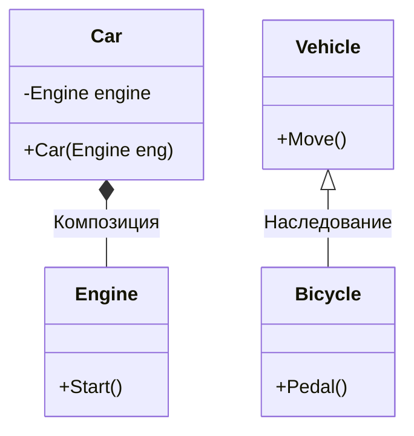
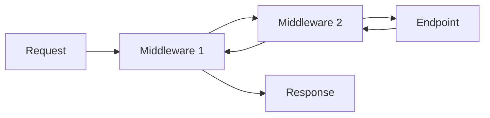

### 1. Теоретическая часть

#### ООП и архитектура

**1. Какие четыре столпа ООП и приведите примеры каждого?**
**Ответ:** 
- **Инкапсуляция**: сокрытие данных через `private` поля с публичными свойствами
- **Наследование**: класс `Car : Vehicle` наследует базовую функциональность
- **Полиморфизм**: переопределение методов через `virtual/override`
- **Абстракция**: использование интерфейсов для определения контрактов

**2. Объясните принцип единственной ответственности (SRP) с примером нарушения**
**Ответ:** Класс должен иметь только одну причину для изменения. Нарушение:
```csharp
class UserService // Нарушает SRP!
{
    public void AddUser(User user) { /*...*/ }
    public void SendEmail(string message) { /*...*/ } // Другая ответственность!
    public void LogError(string error) { /*...*/ } // И еще одна!
}
```

**3. Что такое Dependency Injection и как он связан с IoC?**
**Ответ:** DI - это передача зависимостей объекту извне. IoC (Inversion of Control) - принцип, при котором контроль инверсируется контейнеру, управляющему зависимостями.

**4. Объясните разницу между композицией и наследованием**
**Ответ:**


**5. Что такое Domain-Driven Design и его основные концепции?**
**Ответ:** DDD - подход к разработке сложных систем через глубокое понимание предметной области. Ключевые концепции: Entity, Value Object, Aggregate, Domain Event, Bounded Context.

**6. Объясните CQRS и Event Sourcing**
**Ответ:** CQRS - разделение моделей для команд (изменения) и запросов (чтения). Event Sourcing - хранение состояния как последовательности событий.

**7. Что такое микросервисная архитектура и ее преимущества над монолитом?**
**Ответ:** Разделение приложения на небольшие независимые сервисы. Преимущества: независимое развертывание, масштабируемость, технологическое разнообразие.

**8. Какие паттерны вы знаете для межсервисного взаимодействия?**
**Ответ:** REST API, Message Queue (RabbitMQ), gRPC, GraphQL, Event-Driven Architecture.

**9. Что такое Circuit Breaker паттерн и когда он применяется?**
**Ответ:** Паттерн для предотвращения каскадных сбоев при недоступности внешних сервисов. Автоматически разрывает цепь при частых ошибках.

**10. Объясните принцип подстановки Барбары Лисков (LSP)**
**Ответ:** Объекты должны быть заменяемыми экземплярами своих подтипов без изменения корректности программы. Нарушение: `Square : Rectangle` где сеттеры меняют оба измерения.

#### Базы данных

**11. Как работают индексы в реляционных базах данных?**
**Ответ:** Индексы - B-деревья, ускоряющие поиск. Clustered индекс определяет физическое расположение, Non-Clustered - отдельная структура.

**12. Что такое нормализация и денормализация?**
**Ответ:** Нормализация - устранение избыточности, денормализация - преднамеренное дублирование для производительности.

**13. Объястите транзакции и свойства ACID**
**Ответ:** 
- **Atomicity** - все или ничего
- **Consistency** - валидное состояние до и после
- **Isolation** - параллельные транзакции не мешают
- **Durability** - результаты сохраняются после commit

**14. Какие уровни изоляции транзакций в SQL Server?**
**Ответ:** Read Uncommitted, Read Committed, Repeatable Read, Serializable, Snapshot.

**15. Что такое блокировки и взаимоблокировки (deadlock)?**
**Ответ:** Блокировки - механизм контроля доступа. Deadlock - взаимная блокировка двух и более транзакций.

**16. Как работает план выполнения запроса?**
**Ответ:** SQL Server оптимизатор анализирует запрос и выбирает оптимальный план выполнения с использованием статистики.

**17. Что такое покрывающий индекс (covering index)?**
**Ответ:** Индекс, содержащий все поля для выполнения запроса, исключая обращение к таблице.

**18. Объясните разницу между SQL и NoSQL базами**
**Ответ:** SQL - реляционные, схема, ACID. NoSQL - документные, ключ-значение, графовые, гибкая схема, BASE.

**19. Что такое оконные функции в SQL?**
**Ответ:** Функции, выполняющие вычисления над набором строк, связанных с текущей строкой (ROW_NUMBER, SUM OVER PARTITION).

**20. Как оптимизировать запросы с большими объемами данных?**
**Ответ:** Пагинация, индексы, партиционирование, денормализация, материализованные представления.

#### Тестирование

**21. Что такое Test Pyramid?**
**Ответ:** 
```mermaid
graph TB
    A[Unit Tests] --> B[70%]
    C[Integration Tests] --> D[20%"]
    E[UI Tests] --> F[10%]
```

**22. В чем разница между unit, integration и end-to-end тестами?**
**Ответ:** Unit - изолированно, Integration - взаимодействие компонентов, E2E - полный сценарий пользователя.

**23. Что такое TDD и его цикл Red-Green-Refactor?**
**Ответ:** Test-Driven Development: написать падающий тест (Red), сделать его проходящим (Green), улучшить код (Refactor).

**24. Как тестировать приватные методы?**
**Ответ:** Через публичные методы, рефлексию, или сделать internal с `InternalsVisibleTo`. Лучше - тестировать публичный контракт.

**25. Что такое mocking и какие библиотеки вы используете?**
**Ответ:** Создание объектов-заглушек. Moq, NSubstitute, FakeItEasy.

---

### 2. Вопросы по языку C#

#### Продвинутые возможности C#

**26. Что такое generic-типы и constraints?**
**Ответ:** Обобщенные типы с ограничениями: `where T : class, new(), IComparable`.

**27. Объясните ковариантность и контравариантность в generics**
**Ответ:** Ковариантность (`out`) - производный тип как базовый, контравариантность (`in`) - базовый как производный.

**28. Как работают исключения и что такое Exception Filters?**
**Ответ:** Исключения всплывают по стеку. Filters: `catch when (ex.Message.Contains("specific"))`.

**29. Что такое pattern matching в C#?**
**Ответ:** Сопоставление с образцом: `is`, `switch` выражения, property patterns.

**30. Как работают records и в чем их преимущество?**
**Ответ:** Референсные типы с value-based равенством, иммутабельностью, `with` выражениями.

**31. Что такое source generators и для чего они используются?**
**Ответ:** Генерация кода во время компиляции для boilerplate кода, сериализаторов, мапперов.

**32. Объясните ref structs и ref returns**
**Ответ:** Структуры, живущие только в стеке. Ref returns - возврат по ссылке.

**33. Что такое nullable reference types?**
**Ответ:** Функция для предотвращения `NullReferenceException`, аннотации `string?` и `string`.

**34. Как работают required properties в C# 11?**
**Ответ:** Свойства, обязательные для инициализации: `public required string Name { get; set; }`.

**35. Что такое global using и file-scoped namespaces?**
**Ответ:** `global using` - глобальные импорты, `namespace MyNamespace;` - пространства имен в scope файла.

#### LINQ и коллекции

**36. В чем разница между IEnumerable, ICollection, IList?**
**Ответ:** 
- `IEnumerable` - только перечисление
- `ICollection` - добавление/удаление, Count
- `IList` - индексатор, вставка по индексу

**37. Как работает deferred execution в LINQ?**
**Ответ:** Запрос выполняется при перечислении, а не при определении.

**38. Что такое Expression Trees?**
**Ответ:** Древовидное представление кода для анализа и трансформации (используется в EF).

**39. В чем разница между Any() и Count() > 0?**
**Ответ:** `Any()` эффективнее - останавливается на первом элементе.

**40. Как работает GroupBy и ToLookup?**
**Ответ:** `GroupBy` - deferred execution, `ToLookup` - немедленное выполнение и кэширование.

#### Память и производительность

**41. Объясните работу Garbage Collector в .NET**
**Ответ:** Поколения (0,1,2), маркировка используемых объектов, compaction, finalization queue.

**42. Что такое boxing и unboxing?**
**Ответ:** Упаковка value type в reference type и обратно. Дорогая операция.

**43. Как работают Span<T> и Memory<T>?**
**Ответ:** Структуры для работы с памятью без аллокаций, поддержка stack, heap, unmanaged памяти.

**44. Что такое ArrayPool и когда его использовать?**
**Ответ:** Пул массивов для уменьшения аллокаций при частом создании временных массивов.

**45. Объясните pinned objects и GCHandle**
**Ответ:** Фиксация объектов в памяти для unsafe кода или interop.

#### Многопоточность и асинхронность

**46. В чем разница между Thread, Task и ValueTask?**
**Ответ:** Thread - поток ОС, Task - абстракция над асинхронной операцией, ValueTask - структура для избежания аллокаций.

**47. Как работает async/await на уровне компилятора?**
**Ответ:** Генерация машины состояний, преобразующей асинхронный код в цепочку продолжений.

**48. Что такое SynchronizationContext?**
**Ответ:** Контекст для маршалинга обратных вызовов в нужный поток (UI, ASP.NET).

**49. Объясните разницу между lock, Monitor, и Mutex**
**Ответ:** `lock` - синтаксический сахар для `Monitor`, Mutex - межпроцессная синхронизация.

**50. Что такое SemaphoreSlim и ReaderWriterLockSlim?**
**Ответ:** SemaphoreSlim - ограничение одновременного доступа, ReaderWriterLockSlim - множественное чтение/эксклюзивная запись.

**51. Как работают Concurrent коллекции?**
**Ответ:** Потокобезопасные реализации: `ConcurrentBag`, `ConcurrentDictionary`, `BlockingCollection`.

**52. Что такое ThreadLocal и AsyncLocal?**
**Ответ:** ThreadLocal - данные для каждого потока, AsyncLocal - данные для асинхронного контекста.

**53. Объясните volatile keyword и Memory Barriers**
**Ответ:** `volatile` - гарантия порядка чтения/записи, Memory Barriers - явные барьеры памяти.

**54. Что такое CancellationToken и как его использовать?**
**Ответ:** Механизм отмены асинхронных операций через `CancellationTokenSource`.

**55. Как работает Parallel.ForEach и PLINQ?**
**Ответ:** Parallel.ForEach - параллельное выполнение для CPU-bound операций, PLINQ - параллельные LINQ запросы.

#### ASP.NET Core

**56. Как работает middleware pipeline в ASP.NET Core?**
**Ответ:** 


**57. В чем разница между AddTransient, AddScoped, AddSingleton?**
**Ответ:** Transient - новый экземпляр каждый раз, Scoped - один на запрос, Singleton - один на все приложение.

**58. Как работает Model Binding и Validation?**
**Ответ:** Автоматическое маппинг данных запроса на параметры действий, валидация через DataAnnotations.

**59. Что такое Tag Helpers и чем они лучше HTML Helpers?**
**Ответ:** Подход на основе HTML-атрибутов, более интуитивный и типобезопасный.

**60. Как реализовать кастомную валидацию модели?**
**Ответ:** Через `IValidatableObject` или кастомные `ValidationAttribute`.

**61. Что такое Filters в ASP.NET Core?**
**Ответ:** Перехватчики для выполнения кода до/после этапов pipeline: Authorization, Action, Exception, Result.

**62. Как работает JWT аутентификация?**
**Ответ:** Stateless аутентификация через подписанные токены с claims.

**63. Что такое Health Checks и для чего они используются?**
**Ответ:** Эндпоинты для мониторинга состояния приложения и зависимостей.

**64. Как реализовать версионирование API?**
**Ответ:** Через query string, headers, или URL path, с использованием библиотек like Asp.Versioning.Mvc.

**65. Что такое Output Caching и Response Caching?**
**Ответ:** Кэширование ответов на уровне middleware или атрибутов действий.

#### Entity Framework

**66. В чем разница между Database First, Model First, Code First?**
**Ответ:** Database First - из БД в код, Model First - из дизайнера, Code First - из кода в БД.

**67. Как работает Change Tracking?**
**Ответ:** Отслеживание изменений в объектах для генерации соответствующих SQL команд.

**68. Что такое lazy loading и как его включить/выключить?**
**Ответ:** Автоматическая загрузка связанных данных при обращении. `UseLazyLoadingProxies()`.

**69. Как избежать N+1 проблемы в EF?**
**Ответ:** Использование `Include()` для eager loading или `Select()` с явной проекцией.

**70. Что такое миграции и как они работают?**
**Ответ:** Система управления версиями схемы БД через код. `Add-Migration`, `Update-Database`.

**71. Как выполнить сырой SQL в EF?**
**Ответ:** Через `FromSqlRaw`, `ExecuteSqlRaw`, или `DbSet<T>.SqlQuery()`.

**72. Что такое global query filters?**
**Ответ:** Автоматическое применение условий ко всем запросам (например, soft delete).

**73. Как работает batching в EF Core?**
**Ответ:** Группировка нескольких SQL команд в один вызов для повышения производительности.

**74. Что такое owned entities?**
**Ответ:** Сущности, не имеющие собственного идентификатора, встроенные в другую сущность.

**75. Как настроить отношения один-ко-многим и многие-ко-многим?**
**Ответ:** Через Fluent API: `HasOne().WithMany()`, `HasMany().WithMany()`.

---

### 3. Практическая часть

#### Алгоритмы и структуры данных

**76. Реализуйте кэш с TTL (time-to-live)**
```csharp
public class TtlCache<TKey, TValue> where TKey : notnull
{
    private readonly Dictionary<TKey, (TValue value, DateTime expiry)> _cache = new();
    private readonly TimeSpan _ttl;
    
    public TtlCache(TimeSpan ttl) => _ttl = ttl;
    
    public void Set(TKey key, TValue value) 
        => _cache[key] = (value, DateTime.UtcNow + _ttl);
    
    public bool TryGet(TKey key, out TValue value)
    {
        if (_cache.TryGetValue(key, out var item) && DateTime.UtcNow < item.expiry)
        {
            value = item.value;
            return true;
        }
        
        _cache.Remove(key);
        value = default!;
        return false;
    }
}
```

**77. Напишите алгоритм обхода графа в ширину (BFS)**
```csharp
public List<T> BreadthFirstSearch<T>(GraphNode<T> startNode) where T : IComparable
{
    var visited = new HashSet<T>();
    var result = new List<T>();
    var queue = new Queue<GraphNode<T>>();
    
    queue.Enqueue(startNode);
    visited.Add(startNode.Value);
    
    while (queue.Count > 0)
    {
        var current = queue.Dequeue();
        result.Add(current.Value);
        
        foreach (var neighbor in current.Neighbors)
        {
            if (!visited.Contains(neighbor.Value))
            {
                visited.Add(neighbor.Value);
                queue.Enqueue(neighbor);
            }
        }
    }
    
    return result;
}
```

**78. Реализуйте thread-safe очередь с приоритетом**
```csharp
public class ThreadSafePriorityQueue<T> where T : IComparable<T>
{
    private readonly PriorityQueue<T, T> _queue = new();
    private readonly SemaphoreSlim _semaphore = new(1);
    
    public async Task EnqueueAsync(T item)
    {
        await _semaphore.WaitAsync();
        try
        {
            _queue.Enqueue(item, item);
        }
        finally
        {
            _semaphore.Release();
        }
    }
    
    public async Task<T> DequeueAsync()
    {
        await _semaphore.WaitAsync();
        try
        {
            return _queue.Dequeue();
        }
        finally
        {
            _semaphore.Release();
        }
    }
}
```

#### Паттерны проектирования

**79. Реализуйте паттерн Strategy**
```csharp
public interface ISortStrategy<T>
{
    void Sort(List<T> collection);
}

public class QuickSortStrategy<T> : ISortStrategy<T> where T : IComparable<T>
{
    public void Sort(List<T> collection) => /* QuickSort implementation */;
}

public class Sorter<T>
{
    private ISortStrategy<T> _strategy;
    
    public Sorter(ISortStrategy<T> strategy) => _strategy = strategy;
    
    public void SetStrategy(ISortStrategy<T> strategy) => _strategy = strategy;
    public void Sort(List<T> collection) => _strategy.Sort(collection);
}
```

**80. Реализуйте паттерн Decorator**
```csharp
public interface IDataService
{
    string GetData();
}

public class DataService : IDataService
{
    public string GetData() => "Original Data";
}

public class LoggingDecorator : IDataService
{
    private readonly IDataService _decorated;
    private readonly ILogger _logger;
    
    public LoggingDecorator(IDataService decorated, ILogger logger)
    {
        _decorated = decorated;
        _logger = logger;
    }
    
    public string GetData()
    {
        _logger.LogInformation("Getting data...");
        var result = _decorated.GetData();
        _logger.LogInformation("Data retrieved");
        return result;
    }
}
```

**81. Реализуйте паттерн Factory Method**
```csharp
public abstract class Document
{
    public abstract void Open();
}

public class PdfDocument : Document
{
    public override void Open() => Console.WriteLine("Opening PDF document");
}

public abstract class DocumentCreator
{
    public abstract Document CreateDocument();
    
    public void OpenDocument()
    {
        var doc = CreateDocument();
        doc.Open();
    }
}

public class PdfDocumentCreator : DocumentCreator
{
    public override Document CreateDocument() => new PdfDocument();
}
```

#### Работа с данными

**82. Напишите LINQ запрос для поиска дубликатов**
```csharp
public IEnumerable<T> FindDuplicates<T>(IEnumerable<T> items)
{
    return items
        .GroupBy(x => x)
        .Where(g => g.Count() > 1)
        .Select(g => g.Key);
}
```

**83. Реализуйте репозиторий с Unit of Work**
```csharp
public interface IUnitOfWork : IDisposable
{
    IRepository<User> Users { get; }
    IRepository<Order> Orders { get; }
    Task<int> CommitAsync();
}

public class UnitOfWork : IUnitOfWork
{
    private readonly DbContext _context;
    
    public UnitOfWork(DbContext context)
    {
        _context = context;
        Users = new Repository<User>(context);
        Orders = new Repository<Order>(context);
    }
    
    public IRepository<User> Users { get; }
    public IRepository<Order> Orders { get; }
    
    public async Task<int> CommitAsync() => await _context.SaveChangesAsync();
    public void Dispose() => _context?.Dispose();
}
```

#### Асинхронное программирование

**84. Реализуйте throttling для асинхронных операций**
```csharp
public class AsyncThrottler
{
    private readonly SemaphoreSlim _semaphore;
    
    public AsyncThrottler(int maxConcurrent)
    {
        _semaphore = new SemaphoreSlim(maxConcurrent);
    }
    
    public async Task<T> ThrottleAsync<T>(Func<Task<T>> taskFactory)
    {
        await _semaphore.WaitAsync();
        try
        {
            return await taskFactory();
        }
        finally
        {
            _semaphore.Release();
        }
    }
}
```

**85. Реализуйте обработку сообщений с backpressure**
```csharp
public class MessageProcessor
{
    private readonly Channel<Message> _channel;
    private readonly CancellationTokenSource _cts = new();
    
    public MessageProcessor(int capacity)
    {
        _channel = Channel.CreateBounded<Message>(new BoundedChannelOptions(capacity)
        {
            FullMode = BoundedChannelFullMode.Wait
        });
    }
    
    public async Task ProduceAsync(Message message)
        => await _channel.Writer.WriteAsync(message, _cts.Token);
    
    public async Task StartProcessingAsync(Func<Message, Task> processor)
    {
        await foreach (var message in _channel.Reader.ReadAllAsync(_cts.Token))
        {
            await processor(message);
        }
    }
}
```

#### Оптимизация запросов

**86. Напишите оптимизированный запрос для пагинации**
```sql
-- Эффективная пагинация с ключом
SELECT * FROM Products
WHERE ProductId > @lastSeenId  -- Keyset pagination
ORDER BY ProductId
FETCH NEXT @pageSize ROWS ONLY;
```

**87. Создайте индекс для полнотекстового поиска**
```sql
CREATE FULLTEXT CATALOG ftCatalog AS DEFAULT;
CREATE FULLTEXT INDEX ON Products(ProductName, Description)
KEY INDEX PK_Products;
```

#### Тестирование

**88. Напишите тест с параметризацией данных**
```csharp
[Theory]
[InlineData(1, "One")]
[InlineData(2, "Two")]
[InlineData(3, "Three")]
public void NumberToWord_ShouldReturnCorrectWord(int number, string expectedWord)
{
    // Arrange & Act
    var result = NumberConverter.ToWord(number);
    
    // Assert
    Assert.Equal(expectedWord, result);
}
```

**89. Напишите интеграционный тест с Test Containers**
```csharp
public class DatabaseIntegrationTests : IAsyncLifetime
{
    private readonly TestContainer _postgresContainer = new PostgresBuilder().Build();
    
    public async Task InitializeAsync()
    {
        await _postgresContainer.StartAsync();
        // Инициализация БД
    }
    
    [Fact]
    public async Task GetUsers_ShouldReturnUsersFromRealDatabase()
    {
        // Тест с реальной БД в контейнере
    }
    
    public async Task DisposeAsync() => await _postgresContainer.DisposeAsync();
}
```

#### Безопасность

**90. Реализуйте защиту от SQL injection**
```csharp
// НЕПРАВИЛЬНО:
var query = $"SELECT * FROM Users WHERE Name = '{userInput}'";

// ПРАВИЛЬНО:
var query = "SELECT * FROM Users WHERE Name = @UserName";
using var command = new SqlCommand(query, connection);
command.Parameters.AddWithValue("@UserName", userInput);
```

**91. Реализуйте rate limiting middleware**
```csharp
public class RateLimitingMiddleware
{
    private readonly RequestDelegate _next;
    private readonly Dictionary<string, Queue<DateTime>> _requests = new();
    
    public RateLimitingMiddleware(RequestDelegate next) => _next = next;
    
    public async Task InvokeAsync(HttpContext context)
    {
        var clientIp = context.Connection.RemoteIpAddress?.ToString();
        
        if (!IsAllowed(clientIp))
        {
            context.Response.StatusCode = 429;
            return;
        }
        
        await _next(context);
    }
    
    private bool IsAllowed(string clientIp)
    {
        // Логика проверки лимита запросов
        return true;
    }
}
```

#### Мониторинг и диагностика

**92. Реализуйте метрики для мониторинга производительности**
```csharp
public class PerformanceMetrics
{
    private readonly Counter<int> _requestCounter;
    private readonly Histogram<double> _responseTimeHistogram;
    
    public PerformanceMetrics(IMeterFactory meterFactory)
    {
        var meter = meterFactory.Create("MyApp");
        _requestCounter = meter.CreateCounter<int>("requests_total");
        _responseTimeHistogram = meter.CreateHistogram<double>("response_time_seconds");
    }
    
    public void RecordRequest(double duration)
    {
        _requestCounter.Add(1);
        _responseTimeHistogram.Record(duration);
    }
}
```

#### Docker и инфраструктура

**93. Напишите docker-compose для многоконтейнерного приложения**
```yaml
version: '3.8'
services:
  webapi:
    build: .
    ports:
      - "8080:80"
    depends_on:
      - database
      - redis
  
  database:
    image: postgres:14
    environment:
      POSTGRES_DB: myapp
  
  redis:
    image: redis:alpine
```

#### Рефакторинг

**94. Рефакторинг метода с глубокой вложенностью условий**
```csharp
// ДО:
public string GetUserStatus(User user)
{
    if (user != null)
    {
        if (user.IsActive)
        {
            if (user.LastLoginDate > DateTime.Now.AddDays(-30))
            {
                return "Active";
            }
            else
            {
                return "Inactive";
            }
        }
        else
        {
            return "Disabled";
        }
    }
    return "Unknown";
}

// ПОСЛЕ:
public string GetUserStatus(User user)
{
    if (user == null) return "Unknown";
    if (!user.IsActive) return "Disabled";
    
    return user.LastLoginDate > DateTime.Now.AddDays(-30) 
        ? "Active" 
        : "Inactive";
}
```

#### Оптимизация Entity Framework

**95. Используйте bulk operations для массовых вставок**
```csharp
public async Task BulkInsertUsersAsync(List<User> users)
{
    // Вместо SaveChanges для каждой записи
    // Используем библиотеку like EFCore.BulkExtensions
    await _context.BulkInsertAsync(users);
}
```

**96. Реализуйте retry logic для транзиентных ошибок**
```csharp
public class ResilientDbContext : DbContext
{
    private readonly IRetryPolicy _retryPolicy;
    
    public override async Task<int> SaveChangesAsync(CancellationToken cancellationToken = default)
    {
        return await _retryPolicy.ExecuteAsync(async () => 
            await base.SaveChangesAsync(cancellationToken));
    }
}
```

#### Кэширование

**97. Реализуйте distributed cache с fallback**
```csharp
public class FallbackCacheService : ICacheService
{
    private readonly IDistributedCache _primaryCache;
    private readonly IMemoryCache _fallbackCache;
    
    public async Task<T> GetOrCreateAsync<T>(string key, Func<Task<T>> factory)
    {
        try
        {
            // Пытаемся получить из distributed cache
            return await _primaryCache.GetOrCreateAsync(key, factory);
        }
        catch (Exception ex)
        {
            // Fallback к in-memory cache
            return await _fallbackCache.GetOrCreateAsync(key, factory);
        }
    }
}
```

#### Message Queue

**98. Реализуйте обработку сообщений с подтверждением**
```csharp
public class MessageConsumer : BackgroundService
{
    private readonly IModel _channel;
    
    protected override async Task ExecuteAsync(CancellationToken stoppingToken)
    {
        _channel.BasicQos(0, 1, false); // Fair dispatch
        
        var consumer = new EventingBasicConsumer(_channel);
        consumer.Received += async (model, ea) =>
        {
            try
            {
                var body = ea.Body.ToArray();
                var message = JsonSerializer.Deserialize<Message>(body);
                
                // Обработка сообщения
                await ProcessMessageAsync(message);
                
                _channel.BasicAck(ea.DeliveryTag, false);
            }
            catch
            {
                _channel.BasicNack(ea.DeliveryTag, false, true);
            }
        };
        
        _channel.BasicConsume("queue", false, consumer);
    }
}
```

#### Финализация

**99. Реализуйте finalization с критическими обработчиками**
```csharp
public class CriticalResource : IDisposable
{
    private readonly SafeHandle _handle;
    private bool _disposed = false;
    
    public CriticalResource()
    {
        _handle = CreateCriticalResource();
        // Регистрация критического финализатора
        CriticalFinalizerObject.Register(this);
    }
    
    ~CriticalResource()
    {
        Dispose(false);
    }
    
    public void Dispose()
    {
        Dispose(true);
        GC.SuppressFinalize(this);
    }
    
    protected virtual void Dispose(bool disposing)
    {
        if (!_disposed)
        {
            if (disposing)
            {
                _handle?.Dispose();
            }
            _disposed = true;
        }
    }
}
```

#### Производительность

**100. Реализуйте pooling для часто создаваемых объектов**
```csharp
public class ObjectPool<T> where T : class, new()
{
    private readonly ConcurrentBag<T> _objects = new();
    private readonly Func<T> _objectGenerator;
    
    public ObjectPool(Func<T> objectGenerator) => _objectGenerator = objectGenerator;
    
    public T Get() => _objects.TryTake(out T item) ? item : _objectGenerator();
    
    public void Return(T item) => _objects.Add(item);
}

// Использование:
var pool = new ObjectPool<StringBuilder>(() => new StringBuilder());
using var builder = pool.Get();
// работа с builder
pool.Return(builder);
```