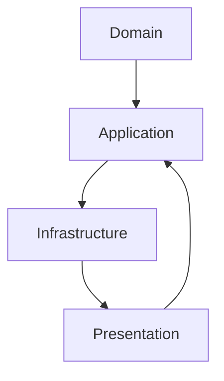

### 1. Теоретическая часть


## Оглавление
    - [1. Теоретическая часть](#1-теоретическая-часть)
      - [Архитектура и принципы](#архитектура-и-принципы)
      - [Базы данных и персистентность](#базы-данных-и-персистентность)
      - [Тестирование и качество кода](#тестирование-и-качество-кода)
    - [2. Вопросы по языку C#](#2-вопросы-по-языку-c)
      - [Современные возможности C#](#современные-возможности-c)
      - [Производительность и память](#производительность-и-память)
      - [Параллелизм и асинхронность](#параллелизм-и-асинхронность)
      - [ASP.NET Core и веб-разработка](#aspnet-core-и-веб-разработка)
      - [Entity Framework Core](#entity-framework-core)
    - [3. Практическая часть](#3-практическая-часть)
      - [Алгоритмы и структуры данных](#алгоритмы-и-структуры-данных)
      - [Системный дизайн](#системный-дизайн)
      - [Паттерны проектирования](#паттерны-проектирования)
      - [Оптимизация производительности](#оптимизация-производительности)
      - [Безопасность](#безопасность)
      - [Микросервисы и распределенные системы](#микросервисы-и-распределенные-системы)
      - [Тестирование](#тестирование)
      - [Docker и контейнеризация](#docker-и-контейнеризация)
- [Build stage](#build-stage)
- [Runtime stage](#runtime-stage)
      - [Мониторинг и метрики](#мониторинг-и-метрики)
      - [Оптимизация баз данных](#оптимизация-баз-данных)
      - [Рефакторинг legacy code](#рефакторинг-legacy-code)
      - [Работа с внешними API](#работа-с-внешними-api)
      - [Кэширование](#кэширование)
      - [Message Queue](#message-queue)
      - [Финализация](#финализация)
      - [Конфигурация](#конфигурация)
      - [Миграции данных](#миграции-данных)
      - [Производительность в продакшене](#производительность-в-продакшене)
      - [Security](#security)
      - [Финальный вопрос](#финальный-вопрос)

#### Архитектура и принципы

**1. Что такое Clean Architecture и какие слои она включает?**
**Ответ:** 

Слои: Domain (сущности), Application (use cases), Infrastructure (реализации), Presentation (UI/API). Зависимости направлены к центру.

**2. Объясните принцип инверсии зависимостей (DIP) с примером**
**Ответ:** Модули верхнего уровня не должны зависеть от модулей нижнего уровня. Оба должны зависеть от абстракций.
```csharp
// Нарушение DIP
class OrderService {
    private SqlRepository _repository; // Зависит от конкретной реализации
}

// Соблюдение DIP
class OrderService {
    private IRepository _repository; // Зависит от абстракции
}
```

**3. Что такое Event-Driven Architecture и ее преимущества?**
**Ответ:** Архитектура, основанная на генерации и потреблении событий. Преимущества: слабая связанность, масштабируемость, отказоустойчивость.

**4. Объясните разницу между монолитом, микросервисами и модульными монолитами**
**Ответ:** 
- Монолит: единое приложение
- Микросервисы: независимые сервисы
- Модульный монолит: монолит с четкими границами модулей

**5. Что такое CQRS и когда его следует использовать?**
**Ответ:** Разделение моделей для команд (запись) и запросов (чтение). Использовать при разных нагрузках на чтение/запись или разных требованиях к данным.

**6. Что такое Domain Events и как их реализовать?**
**Ответ:** События, которые происходят в домене. Реализация через отдельную коллекцию событий в агрегате.

**7. Объясните паттерн Mediator и его преимущества**
**Ответ:** Посредник для уменьшения связанности между компонентами. Преимущества: уменьшение зависимостей, централизация логики.

**8. Что такое Bounded Context в DDD?**
**Ответ:** Четкая граница, внутри которой определенная модель имеет точное значение. Разные контексты могут иметь разные модели для одних и тех же понятий.

**9. Как реализовать межсервисную аутентификацию в микросервисах?**
**Ответ:** JWT токены, API ключи, OAuth 2.0 Client Credentials, mutual TLS.

**10. Что такое API Gateway и его роль в микросервисах?**
**Ответ:** Единая точка входа, которая обрабатывает запросы и маршрутизирует их к соответствующим сервисам.

#### Базы данных и персистентность

**11. Что такое ORM и какие проблемы он решает?**
**Ответ:** Object-Relational Mapping - преобразование между объектами и реляционными данными. Решает: ручное маппирование, SQL инъекции, кроссплатформенность.

**12. Объясните концепцию Unit of Work в EF Core**
**Ответ:** Паттерн для группировки операций в одну транзакцию. В EF Core реализован через DbContext.

**13. Что такое lazy loading и его impact на производительность?**
**Ответ:** Отложенная загрузка связанных данных. Может вызывать N+1 проблему и снижать производительность.

**14. Как работает connection pooling в .NET?**
**Ответ:** Пул соединений для повторного использования подключений к БД, уменьшает overhead установки соединения.

**15. Что такое database sharding и когда его применять?**
**Ответ:** Горизонтальное разделение данных across multiple databases. Применять при очень больших объемах данных.

**16. Объясните CAP theorem и его implications для выбора БД**
**Ответ:** Consistency, Availability, Partition Tolerance - нельзя гарантировать все три одновременно. Выбор зависит от требований приложения.

**17. Что такое materialized views и их использование?**
**Ответ:** Предварительно вычисленные представления, хранящиеся как таблицы. Для сложных агрегаций и отчетности.

**18. Как работает database replication?**
**Ответ:** Копирование данных с master на slave серверы для чтения, отказоустойчивости.

**19. Что такое connection resiliency в EF Core?**
**Ответ:** Автоматические retry логики для транзиентных ошибок подключения к БД.

**20. Объясните difference между SQL и NoSQL транзакциями**
**Ответ:** SQL: ACID транзакции, NoSQL: eventual consistency, BASE transactions.

#### Тестирование и качество кода

**21. Что такое Behavior-Driven Development (BDD)?**
**Ответ:** Разработка через поведение, описываемое в виде сценариев на естественном языке (Given-When-Then).

**22. Как организовать тестирование legacy code?**
**Ответ:** Постепенное покрытие тестами, выделение зависимостей, использование seams для тестирования.

**23. Что такое mutation testing?**
**Ответ:** Тестирование тестов через внесение мутаций в код и проверку, что тесты их обнаруживают.

**24. Как измерять и улучшать maintainability кода?**
**Ответ:** Метрики: cyclomatic complexity, coupling, code coverage. Рефакторинг, код ревью, статический анализ.

**25. Что такое contract testing и когда его использовать?**
**Ответ:** Тестирование контрактов между сервисами. Использовать в микросервисной архитектуре.

---

### 2. Вопросы по языку C#

#### Современные возможности C#

**26. Что такое nullable reference types и как они помогают?**
**Ответ:** Аннотации ссылочных типов на nullability. Помогают предотвратить NullReferenceException.
```csharp
string? nullableString = null; // Может быть null
string nonNullableString = "hello"; // Не может быть null
```

**27. Объясните pattern matching enhancements в C# 11+**
**Ответ:** 
```csharp
// List patterns
if (list is [1, 2, 3]) { }

// Property patterns
if (obj is { Name: "John", Age: > 18 }) { }
```

**28. Что такое static abstract members в интерфейсах?**
**Ответ:** Возможность определять статические абстрактные члены в интерфейсах для generic математики.
```csharp
interface IAddable<T> where T : IAddable<T>
{
    static abstract T operator +(T left, T right);
}
```

**29. Как работают file-local types в C# 11?**
**Ответ:** Типы, видимые только в текущем файле.
```csharp
file class HiddenClass { } // Виден только в этом файле
```

**30. Что такое required members и их использование?**
**Ответ:** Обязательные члены для инициализации.
```csharp
public class Person
{
    public required string FirstName { get; set; }
    public required string LastName { get; set; }
}
```

**31. Объясните raw string literals в C# 11**
**Ответ:** Многострочные строки без экранирования.
```csharp
string json = """
    {
        "name": "John",
        "age": 30
    }
    """;
```

**32. Что такое generic attributes в C# 11?**
**Ответ:** Возможность создавать generic атрибуты.
```csharp
public sealed class ValidationAttribute<T> : Attribute
{
    public T ExpectedValue { get; }
}
```

#### Производительность и память

**33. Как работает stackalloc и когда его использовать?**
**Ответ:** Выделение памяти в стеке для массивов. Использовать для небольших временных массивов.

**34. Что такое ref fields в ref structs?**
**Ответ:** Поля по ссылке в ref struct для работы с памятью.
```csharp
ref struct Buffer
{
    public ref int FirstElement;
}
```

**35. Объясните difference между Memory<T> и Span<T>**
**Ответ:** Memory<T> может быть stored on heap, Span<T> - только stack. Memory<T> для асинхронных операций.

**36. Что такое frozen sets в .NET 8?**
**Ответ:** Неизменяемые множества с оптимизированным созданием.
```csharp
var frozenSet = new[] { 1, 2, 3 }.ToFrozenSet();
```

**37. Как работает TimeProvider в .NET 8?**
**Ответ:** Абстракция над временем для тестирования.
```csharp
var timeProvider = new TimeProvider();
var now = timeProvider.GetUtcNow();
```

**38. Что такое search values в .NET 8?**
**Ответ:** Оптимизированный поиск подстрок.
```csharp
var searchValues = SearchValues.Create("aeiou");
bool containsVowel = "hello".AsSpan().ContainsAny(searchValues);
```

#### Параллелизм и асинхронность

**39. Что такое Parallel LINQ (PLINQ) и его limitations?**
**Ответ:** Параллельное выполнение LINQ запросов. Ограничения: overhead, не для всех операций.

**40. Как работает Channel и когда его использовать?**
**Ответ:** Producer-consumer паттерн для асинхронной обработки сообщений.
```csharp
var channel = Channel.CreateUnbounded<string>();
```

**41. Что такое async streams (IAsyncEnumerable)?**
**Ответ:** Асинхронное перечисление элементов.
```csharp
async IAsyncEnumerable<int> GetNumbersAsync()
{
    for (int i = 0; i < 10; i++)
    {
        await Task.Delay(100);
        yield return i;
    }
}
```

**42. Объясните difference между Task и ValueTask**
**Ответ:** Task - класс, аллокации в куче. ValueTask - структура, избегает аллокаций для синхронного завершения.

**43. Что такое lock-free programming и его pitfalls?**
**Ответ:** Программирование без блокировок через атомарные операции. Подводные камни: сложность, memory barriers.

**44. Как работает CancellationTokenSource с timeout?**
**Ответ:** 
```csharp
using var cts = new CancellationTokenSource(TimeSpan.FromSeconds(5));
await SomeAsyncOperation(cts.Token);
```

**45. Что такое Barrier class и ее использование?**
**Ответ:** Синхронизация нескольких потоков в определенных точках.

#### ASP.NET Core и веб-разработка

**46. Как работает Minimal API в ASP.NET Core?**
**Ответ:** Упрощенный подход к созданию API.
```csharp
var app = WebApplication.Create();
app.MapGet("/hello", () => "Hello World!");
app.Run();
```

**47. Что такое SignalR и его use cases?**
**Ответ:** Библиотека для real-time web functionality. Использование: чаты, уведомления, дашборды.

**48. Объясните difference между gRPC и REST**
**Ответ:** gRPC: бинарный, HTTP/2, строгая типизация. REST: текстовый, HTTP/1.1, гибкость.

**49. Как реализовать rate limiting в ASP.NET Core 7+?**
**Ответ:** 
```csharp
builder.Services.AddRateLimiter(options =>
{
    options.AddFixedWindowLimiter("Fixed", opt =>
    {
        opt.PermitLimit = 10;
        opt.Window = TimeSpan.FromSeconds(10);
    });
});
```

**50. Что такое problem details в ASP.NET Core?**
**Ответ:** Стандартизированный формат ошибок API.
```csharp
app.MapGet("/error", () => Results.Problem("Something went wrong"));
```

**51. Как работает output caching в ASP.NET Core 7+?**
**Ответ:** Кэширование ответов на уровне middleware.
```csharp
app.MapGet("/cached", () => "Hello").CacheOutput();
```

**52. Что такое route groups в Minimal API?**
**Ответ:** Группировка эндпоинтов с общими настройками.
```csharp
var group = app.MapGroup("/api/v1");
group.MapGet("/users", () => "Users");
```

**53. Как реализовать custom model binding?**
**Ответ:** Через реализации `IModelBinder` или `IModelBinderProvider`.

**54. Что такое action filters и их использование?**
**Ответ:** Перехватчики для выполнения кода до/после выполнения действия.

**55. Как работает health checks в ASP.NET Core?**
**Ответ:** Мониторинг состояния приложения через специальные эндпоинты.

#### Entity Framework Core

**56. Что такое global query filters?**
**Ответ:** Автоматическое применение фильтров ко всем запросам.
```csharp
modelBuilder.Entity<Blog>().HasQueryFilter(b => !b.IsDeleted);
```

**57. Как выполнить bulk operations в EF Core?**
**Ответ:** Через сторонние библиотеки или `ExecuteUpdate`/`ExecuteDelete` в EF Core 7+.

**58. Что такое owned entities и когда их использовать?**
**Ответ:** Сущности без собственного ключа, встроенные в другую сущность. Для value objects.

**59. Как настроить many-to-many relationships в EF Core?**
**Ответ:** Через join entity или implicit join table в EF Core 5+.

**60. Что такое interceptors в EF Core?**
**Ответ:** Перехватчики для SQL команд, изменений и других событий.

**61. Как использовать EF Core с DDD approach?**
**Ответ:** Private constructors, factory methods, value objects, domain events.

**62. Что такое computed columns и их mapping?**
**Ответ:** Вычисляемые колонки в БД. Маппинг через `HasComputedColumnSql`.

**63. Как реализовать soft delete в EF Core?**
**Ответ:** Через global query filters и переопределение SaveChanges.

**64. Что такое database providers в EF Core?**
**Ответ:** Провайдеры для разных БД: SQL Server, PostgreSQL, SQLite, Cosmos DB.

**65. Как работает batching в EF Core 7+?**
**Ответ:** Группировка нескольких SQL команд в один вызов.

---

### 3. Практическая часть

#### Алгоритмы и структуры данных

**66. Реализуйте LRU cache**
```csharp
public class LRUCache<TKey, TValue> where TKey : notnull
{
    private readonly Dictionary<TKey, LinkedListNode<(TKey Key, TValue Value)>> _map;
    private readonly LinkedList<(TKey Key, TValue Value)> _list;
    private readonly int _capacity;
    
    public LRUCache(int capacity)
    {
        _capacity = capacity;
        _map = new Dictionary<TKey, LinkedListNode<(TKey, TValue)>>();
        _list = new LinkedList<(TKey, TValue)>();
    }
    
    public TValue Get(TKey key)
    {
        if (!_map.TryGetValue(key, out var node))
            throw new KeyNotFoundException();
            
        _list.Remove(node);
        _list.AddFirst(node);
        return node.Value.Value;
    }
    
    public void Put(TKey key, TValue value)
    {
        if (_map.TryGetValue(key, out var node))
        {
            node.Value = (key, value);
            _list.Remove(node);
            _list.AddFirst(node);
        }
        else
        {
            if (_map.Count >= _capacity)
            {
                var last = _list.Last;
                _map.Remove(last.Value.Key);
                _list.RemoveLast();
            }
            
            var newNode = _list.AddFirst((key, value));
            _map[key] = newNode;
        }
    }
}
```

**67. Реализуйте trie для autocomplete**
```csharp
public class TrieNode
{
    public Dictionary<char, TrieNode> Children { get; } = new();
    public bool IsWord { get; set; }
}

public class Trie
{
    private readonly TrieNode _root = new();
    
    public void Insert(string word)
    {
        var current = _root;
        foreach (char c in word)
        {
            if (!current.Children.ContainsKey(c))
                current.Children[c] = new TrieNode();
            current = current.Children[c];
        }
        current.IsWord = true;
    }
    
    public IEnumerable<string> Search(string prefix)
    {
        var current = _root;
        foreach (char c in prefix)
        {
            if (!current.Children.ContainsKey(c))
                return Enumerable.Empty<string>();
            current = current.Children[c];
        }
        
        return CollectWords(current, prefix);
    }
    
    private IEnumerable<string> CollectWords(TrieNode node, string prefix)
    {
        if (node.IsWord)
            yield return prefix;
            
        foreach (var (c, child) in node.Children)
        {
            foreach (var word in CollectWords(child, prefix + c))
                yield return word;
        }
    }
}
```

**68. Реализуйте thread-safe lazy initialization**
```csharp
public class ThreadSafeLazy<T>
{
    private readonly Func<T> _factory;
    private T _value;
    private bool _initialized;
    private readonly object _lock = new();
    
    public ThreadSafeLazy(Func<T> factory) => _factory = factory;
    
    public T Value
    {
        get
        {
            if (!_initialized)
            {
                lock (_lock)
                {
                    if (!_initialized)
                    {
                        _value = _factory();
                        _initialized = true;
                    }
                }
            }
            return _value;
        }
    }
}
```

#### Системный дизайн

**69. Спроектируйте систему распределенного кэширования**
```csharp
public interface IDistributedCache
{
    Task<T> GetOrSetAsync<T>(string key, Func<Task<T>> factory, TimeSpan expiration);
    Task RemoveAsync(string key);
    Task<bool> ExistsAsync(string key);
}

public class RedisDistributedCache : IDistributedCache
{
    private readonly IConnectionMultiplexer _redis;
    
    public async Task<T> GetOrSetAsync<T>(string key, Func<Task<T>> factory, TimeSpan expiration)
    {
        var db = _redis.GetDatabase();
        var cached = await db.StringGetAsync(key);
        
        if (!cached.IsNull)
            return JsonSerializer.Deserialize<T>(cached!);
            
        var value = await factory();
        await db.StringSetAsync(key, JsonSerializer.Serialize(value), expiration);
        return value;
    }
}
```

**70. Реализуйте idempotent message processing**
```csharp
public class IdempotentMessageProcessor
{
    private readonly IMessageStore _messageStore;
    
    public async Task ProcessMessageAsync(Message message)
    {
        if (await _messageStore.IsProcessedAsync(message.Id))
            return; // Уже обработано
            
        await ProcessBusinessLogicAsync(message);
        await _messageStore.MarkAsProcessedAsync(message.Id);
    }
}
```

#### Паттерны проектирования

**71. Реализуйте паттерн Specification**
```csharp
public interface ISpecification<T>
{
    bool IsSatisfiedBy(T entity);
    ISpecification<T> And(ISpecification<T> other);
    ISpecification<T> Or(ISpecification<T> other);
}

public abstract class Specification<T> : ISpecification<T>
{
    public abstract bool IsSatisfiedBy(T entity);
    
    public ISpecification<T> And(ISpecification<T> other)
        => new AndSpecification<T>(this, other);
        
    public ISpecification<T> Or(ISpecification<T> other)
        => new OrSpecification<T>(this, other);
}

public class AndSpecification<T> : Specification<T>
{
    private readonly ISpecification<T> _left;
    private readonly ISpecification<T> _right;
    
    public AndSpecification(ISpecification<T> left, ISpecification<T> right)
    {
        _left = left;
        _right = right;
    }
    
    public override bool IsSatisfiedBy(T entity)
        => _left.IsSatisfiedBy(entity) && _right.IsSatisfiedBy(entity);
}
```

**72. Реализуйте паттерн Chain of Responsibility**
```csharp
public abstract class Handler<T> where T : class
{
    private Handler<T>? _next;
    
    public Handler<T> SetNext(Handler<T> next)
    {
        _next = next;
        return next;
    }
    
    public virtual T? Handle(T request)
    {
        return _next?.Handle(request);
    }
}

public class ValidationHandler : Handler<Order>
{
    public override Order? Handle(Order order)
    {
        if (order.Total <= 0)
            throw new InvalidOperationException("Invalid order total");
            
        return base.Handle(order);
    }
}
```

#### Оптимизация производительности

**73. Реализуйте object pooling для expensive objects**
```csharp
public class ObjectPool<T> where T : class, new()
{
    private readonly ConcurrentBag<T> _objects;
    private readonly Func<T> _objectGenerator;
    private readonly Action<T> _resetAction;
    
    public ObjectPool(Func<T> objectGenerator, Action<T> resetAction = null)
    {
        _objectGenerator = objectGenerator ?? throw new ArgumentNullException(nameof(objectGenerator));
        _resetAction = resetAction;
        _objects = new ConcurrentBag<T>();
    }
    
    public T Get()
    {
        if (_objects.TryTake(out T item))
            return item;
            
        return _objectGenerator();
    }
    
    public void Return(T item)
    {
        _resetAction?.Invoke(item);
        _objects.Add(item);
    }
}
```

**74. Оптимизируйте string concatenation в hot path**
```csharp
// Медленно:
string result = "";
foreach (var item in items)
    result += item.ToString();

// Быстро:
var builder = new StringBuilder();
foreach (var item in items)
    builder.Append(item);
string result = builder.ToString();

// Еще быстрее для известного размера:
var builder = new StringBuilder(capacity: items.Count * 10);
```

**75. Реализуйте zero-allocation parsing**
```csharp
public static int ParseInt(ReadOnlySpan<char> span)
{
    int result = 0;
    foreach (char c in span)
    {
        if (c < '0' || c > '9')
            throw new FormatException();
        result = result * 10 + (c - '0');
    }
    return result;
}
```

#### Безопасность

**76. Реализуйте secure password hashing**
```csharp
public class SecurePasswordHasher
{
    private const int SaltSize = 16;
    private const int HashSize = 20;
    private const int Iterations = 10000;
    
    public string Hash(string password)
    {
        using var rng = RandomNumberGenerator.Create();
        byte[] salt = new byte[SaltSize];
        rng.GetBytes(salt);
        
        using var pbkdf2 = new Rfc2898DeriveBytes(password, salt, Iterations, HashAlgorithmName.SHA256);
        byte[] hash = pbkdf2.GetBytes(HashSize);
        
        byte[] hashBytes = new byte[SaltSize + HashSize];
        Array.Copy(salt, 0, hashBytes, 0, SaltSize);
        Array.Copy(hash, 0, hashBytes, SaltSize, HashSize);
        
        return Convert.ToBase64String(hashBytes);
    }
    
    public bool Verify(string password, string hashedPassword)
    {
        byte[] hashBytes = Convert.FromBase64String(hashedPassword);
        byte[] salt = new byte[SaltSize];
        Array.Copy(hashBytes, 0, salt, 0, SaltSize);
        
        using var pbkdf2 = new Rfc2898DeriveBytes(password, salt, Iterations, HashAlgorithmName.SHA256);
        byte[] hash = pbkdf2.GetBytes(HashSize);
        
        for (int i = 0; i < HashSize; i++)
        {
            if (hashBytes[i + SaltSize] != hash[i])
                return false;
        }
        
        return true;
    }
}
```

**77. Реализуйте protection от CSRF attacks**
```csharp
public class AntiforgeryMiddleware
{
    private readonly RequestDelegate _next;
    
    public AntiforgeryMiddleware(RequestDelegate next) => _next = next;
    
    public async Task InvokeAsync(HttpContext context)
    {
        if (context.Request.Method == "POST")
        {
            if (!await ValidateAntiforgeryTokenAsync(context))
            {
                context.Response.StatusCode = 400;
                return;
            }
        }
        
        await _next(context);
    }
    
    private async Task<bool> ValidateAntiforgeryTokenAsync(HttpContext context)
    {
        // Валидация CSRF токена
        return true;
    }
}
```

#### Микросервисы и распределенные системы

**78. Реализуйте service discovery client**
```csharp
public interface IServiceDiscovery
{
    Task<ServiceEndpoint> ResolveAsync(string serviceName);
}

public class ConsulServiceDiscovery : IServiceDiscovery
{
    private readonly IConsulClient _consulClient;
    
    public async Task<ServiceEndpoint> ResolveAsync(string serviceName)
    {
        var services = await _consulClient.Health.Service(serviceName, null, true);
        var service = services.Response.FirstOrDefault();
        
        if (service == null)
            throw new ServiceNotFoundException(serviceName);
            
        return new ServiceEndpoint(service.Service.Address, service.Service.Port);
    }
}
```

**79. Реализуйте distributed tracing**
```csharp
public class TracingDelegatingHandler : DelegatingHandler
{
    private readonly ILogger<TracingDelegatingHandler> _logger;
    
    protected override async Task<HttpResponseMessage> SendAsync(
        HttpRequestMessage request, CancellationToken cancellationToken)
    {
        var traceId = Guid.NewGuid().ToString();
        request.Headers.Add("X-Trace-Id", traceId);
        
        using var scope = _logger.BeginScope("TraceId: {TraceId}", traceId);
        _logger.LogInformation("Sending HTTP request to {Url}", request.RequestUri);
        
        return await base.SendAsync(request, cancellationToken);
    }
}
```

#### Тестирование

**80. Напишите тест для async exception handling**
```csharp
[Fact]
public async Task ProcessAsync_ShouldThrowException_WhenInputIsInvalid()
{
    // Arrange
    var processor = new DataProcessor();
    
    // Act & Assert
    await Assert.ThrowsAsync<InvalidDataException>(
        async () => await processor.ProcessAsync(null));
}
```

**81. Реализуйте custom equality comparer для тестов**
```csharp
public class ProductEqualityComparer : IEqualityComparer<Product>
{
    public bool Equals(Product x, Product y)
    {
        if (ReferenceEquals(x, y)) return true;
        if (x is null || y is null) return false;
        
        return x.Id == y.Id 
            && x.Name == y.Name
            && x.Price == y.Price;
    }
    
    public int GetHashCode(Product obj) => HashCode.Combine(obj.Id, obj.Name, obj.Price);
}

// Использование в тестах:
Assert.Equal(expectedProducts, actualProducts, new ProductEqualityComparer());
```

#### Docker и контейнеризация

**82. Напишите multi-stage Dockerfile для .NET приложения**
```dockerfile
# Build stage

    - [1. Теоретическая часть](#1-теоретическая-часть)
      - [Архитектура и принципы](#архитектура-и-принципы)
      - [Базы данных и персистентность](#базы-данных-и-персистентность)
      - [Тестирование и качество кода](#тестирование-и-качество-кода)
    - [2. Вопросы по языку C#](#2-вопросы-по-языку-c)
      - [Современные возможности C#](#современные-возможности-c)
      - [Производительность и память](#производительность-и-память)
      - [Параллелизм и асинхронность](#параллелизм-и-асинхронность)
      - [ASP.NET Core и веб-разработка](#aspnet-core-и-веб-разработка)
      - [Entity Framework Core](#entity-framework-core)
    - [3. Практическая часть](#3-практическая-часть)
      - [Алгоритмы и структуры данных](#алгоритмы-и-структуры-данных)
      - [Системный дизайн](#системный-дизайн)
      - [Паттерны проектирования](#паттерны-проектирования)
      - [Оптимизация производительности](#оптимизация-производительности)
      - [Безопасность](#безопасность)
      - [Микросервисы и распределенные системы](#микросервисы-и-распределенные-системы)
      - [Тестирование](#тестирование)
      - [Docker и контейнеризация](#docker-и-контейнеризация)
      - [Мониторинг и метрики](#мониторинг-и-метрики)
      - [Оптимизация баз данных](#оптимизация-баз-данных)
      - [Рефакторинг legacy code](#рефакторинг-legacy-code)
      - [Работа с внешними API](#работа-с-внешними-api)
      - [Кэширование](#кэширование)
      - [Message Queue](#message-queue)
      - [Финализация](#финализация)
      - [Конфигурация](#конфигурация)
      - [Миграции данных](#миграции-данных)
      - [Производительность в продакшене](#производительность-в-продакшене)
      - [Security](#security)
      - [Финальный вопрос](#финальный-вопрос)
FROM mcr.microsoft.com/dotnet/sdk:8.0 AS build
WORKDIR /src
COPY ["MyApp.csproj", "."]
RUN dotnet restore "MyApp.csproj"
COPY . .
RUN dotnet publish "MyApp.csproj" -c Release -o /app/publish

# Runtime stage
FROM mcr.microsoft.com/dotnet/aspnet:8.0 AS runtime
WORKDIR /app
COPY --from=build /app/publish .
EXPOSE 8080
ENTRYPOINT ["dotnet", "MyApp.dll"]
```

**83. Реализуйте health check для database dependency**
```csharp
public class DatabaseHealthCheck : IHealthCheck
{
    private readonly DbContext _dbContext;
    
    public DatabaseHealthCheck(DbContext dbContext) => _dbContext = dbContext;
    
    public async Task<HealthCheckResult> CheckHealthAsync(
        HealthCheckContext context, CancellationToken cancellationToken = default)
    {
        try
        {
            await _dbContext.Database.ExecuteSqlRawAsync("SELECT 1");
            return HealthCheckResult.Healthy();
        }
        catch (Exception ex)
        {
            return HealthCheckResult.Unhealthy("Database connection failed", ex);
        }
    }
}
```

#### Мониторинг и метрики

**84. Реализуйте custom metrics для бизнес-логики**
```csharp
public class OrderMetrics
{
    private readonly Counter<int> _ordersCreated;
    private readonly Histogram<double> _orderValueHistogram;
    
    public OrderMetrics(IMeterFactory meterFactory)
    {
        var meter = meterFactory.Create("Ecommerce.Orders");
        _ordersCreated = meter.CreateCounter<int>("orders.created");
        _orderValueHistogram = meter.CreateHistogram<double>("order.value");
    }
    
    public void RecordOrderCreated(Order order)
    {
        _ordersCreated.Add(1);
        _orderValueHistogram.Record(order.TotalAmount);
    }
}
```

**85. Реализуйте structured logging с enrichment**
```csharp
public static class LoggerExtensions
{
    public static ILogger WithOrderContext(this ILogger logger, Order order)
    {
        return logger.ForContext("OrderId", order.Id)
                     .ForContext("CustomerId", order.CustomerId)
                     .ForContext("OrderTotal", order.TotalAmount);
    }
}

// Использование:
_logger.WithOrderContext(order).Information("Order processed successfully");
```

#### Оптимизация баз данных

**86. Напишите оптимизированный запрос для поиска по диапазону дат**
```sql
-- Хорошо - использует индекс
SELECT * FROM Orders 
WHERE OrderDate >= @startDate 
  AND OrderDate < @endDate
  AND CustomerId = @customerId;

-- Плохо - не использует индекс эффективно
SELECT * FROM Orders 
WHERE YEAR(OrderDate) = 2023 
  AND MONTH(OrderDate) = 12;
```

**87. Создайте покрывающий индекс для частого запроса**
```sql
CREATE INDEX IX_Orders_Customer_Status_Date
ON Orders (CustomerId, Status, OrderDate)
INCLUDE (TotalAmount, Currency);
```

#### Рефакторинг legacy code

**88. Рефакторинг метода с длинным списком параметров**
```csharp
// До:
public void CreateUser(string firstName, string lastName, string email, 
    string phone, string address, string city, string country, DateTime birthDate)
{
    // ...
}

// После:
public class UserCreationRequest
{
    public string FirstName { get; init; }
    public string LastName { get; init; }
    public string Email { get; init; }
    public string Phone { get; init; }
    public Address Address { get; init; }
    public DateTime BirthDate { get; init; }
}

public void CreateUser(UserCreationRequest request)
{
    // ...
}
```

**89. Устраните primitive obsession в domain model**
```csharp
// До:
public class Order
{
    public decimal TotalAmount { get; set; }
    public string Currency { get; set; }
}

// После:
public record Money(decimal Amount, Currency Currency);
public class Order
{
    public Money Total { get; set; }
}
```

#### Работа с внешними API

**90. Реализуйте resilient HTTP client с политиками**
```csharp
public class ResilientHttpClient
{
    private readonly HttpClient _httpClient;
    private readonly AsyncPolicy<HttpResponseMessage> _resiliencePolicy;
    
    public ResilientHttpClient()
    {
        _resiliencePolicy = Policy<HttpResponseMessage>
            .Handle<HttpRequestException>()
            .OrResult(x => !x.IsSuccessStatusCode)
            .WaitAndRetryAsync(3, retryAttempt => 
                TimeSpan.FromSeconds(Math.Pow(2, retryAttempt)));
    }
    
    public async Task<T> GetAsync<T>(string url)
    {
        var response = await _resiliencePolicy.ExecuteAsync(() => _httpClient.GetAsync(url));
        response.EnsureSuccessStatusCode();
        return await response.Content.ReadAsAsync<T>();
    }
}
```

**91. Реализуйте batch processing для external API calls**
```csharp
public class BatchApiProcessor
{
    private readonly List<ApiRequest> _batch = new();
    private readonly Timer _timer;
    private readonly int _batchSize;
    
    public BatchApiProcessor(TimeSpan interval, int batchSize)
    {
        _batchSize = batchSize;
        _timer = new Timer(ProcessBatch, null, interval, interval);
    }
    
    public void AddRequest(ApiRequest request)
    {
        lock (_batch)
        {
            _batch.Add(request);
            if (_batch.Count >= _batchSize)
                ProcessBatch(null);
        }
    }
    
    private void ProcessBatch(object state)
    {
        List<ApiRequest> batchToProcess;
        lock (_batch)
        {
            batchToProcess = _batch.ToList();
            _batch.Clear();
        }
        
        if (batchToProcess.Any())
            ProcessBatchAsync(batchToProcess);
    }
}
```

#### Кэширование

**92. Реализуйте cache-aside pattern с distributed cache**
```csharp
public class CacheAsideService
{
    private readonly IDistributedCache _cache;
    private readonly IDataService _dataService;
    
    public async Task<T> GetOrSetAsync<T>(string key, Func<Task<T>> factory, TimeSpan expiration)
    {
        var cached = await _cache.GetStringAsync(key);
        if (cached != null)
            return JsonSerializer.Deserialize<T>(cached);
            
        var data = await factory();
        await _cache.SetStringAsync(key, JsonSerializer.Serialize(data), 
            new DistributedCacheEntryOptions { AbsoluteExpirationRelativeToNow = expiration });
            
        return data;
    }
}
```

**93. Реализуйте cache invalidation при данных изменениях**
```csharp
public class CacheInvalidationService
{
    private readonly IDistributedCache _cache;
    
    public async Task InvalidateRelatedCachesAsync(string entityType, string entityId)
    {
        // Инвалидация по паттерну
        var pattern = $"{entityType}:{entityId}:*";
        await _cache.RemoveByPatternAsync(pattern);
    }
}
```

#### Message Queue

**94. Реализуйте dead letter queue обработку**
```csharp
public class DeadLetterProcessor
{
    private readonly IModel _channel;
    
    public async Task ProcessDeadLetterMessagesAsync()
    {
        var deadLetterQueue = "dead-letter-queue";
        
        var consumer = new EventingBasicConsumer(_channel);
        consumer.Received += async (model, ea) =>
        {
            try
            {
                var message = JsonSerializer.Deserialize<DeadLetterMessage>(ea.Body.ToArray());
                await AnalyzeAndHandleDeadLetterAsync(message);
                _channel.BasicAck(ea.DeliveryTag, false);
            }
            catch
            {
                _channel.BasicNack(ea.DeliveryTag, false, false);
            }
        };
        
        _channel.BasicConsume(deadLetterQueue, false, consumer);
    }
}
```

#### Финализация

**95. Реализуйте proper resource cleanup с cancellation**
```csharp
public class ResourceManager : IAsyncDisposable
{
    private readonly CancellationTokenSource _cts = new();
    private readonly List<IAsyncDisposable> _resources = new();
    
    public async ValueTask DisposeAsync()
    {
        _cts.Cancel();
        
        foreach (var resource in _resources)
        {
            try
            {
                await resource.DisposeAsync();
            }
            catch (Exception ex)
            {
                // Log but continue cleanup
            }
        }
        
        _cts.Dispose();
    }
}
```

#### Конфигурация

**96. Реализуйте hierarchical configuration с validation**
```csharp
public class DatabaseSettings
{
    public const string SectionName = "Database";
    
    [Required]
    public string ConnectionString { get; init; }
    
    [Range(1, 100)]
    public int MaxRetries { get; init; } = 3;
}

// Регистрация:
services.AddOptions<DatabaseSettings>()
    .BindConfiguration(DatabaseSettings.SectionName)
    .ValidateDataAnnotations()
    .ValidateOnStart();
```

#### Миграции данных

**97. Реализуйте zero-downtime database migration**
```csharp
public class ZeroDowntimeMigration
{
    public async Task MigrateAsync()
    {
        // 1. Добавить новую колонку
        await AddNewColumnAsync();
        
        // 2. Backfill данные
        await BackfillDataAsync();
        
        // 3. Обновить приложение
        await DeployNewVersionAsync();
        
        // 4. Удалить старую колонку
        await RemoveOldColumnAsync();
    }
}
```

#### Производительность в продакшене

**98. Реализуйте performance counters для critical paths**
```csharp
public class PerformanceCounter
{
    private long _operationCount;
    private long _totalDuration;
    
    public void RecordOperation(TimeSpan duration)
    {
        Interlocked.Increment(ref _operationCount);
        Interlocked.Add(ref _totalDuration, duration.Ticks);
    }
    
    public PerformanceStats GetStats()
    {
        var count = Interlocked.Read(ref _operationCount);
        var totalTicks = Interlocked.Read(ref _totalDuration);
        
        return new PerformanceStats
        {
            OperationCount = count,
            AverageDuration = count > 0 ? TimeSpan.FromTicks(totalTicks / count) : TimeSpan.Zero
        };
    }
}
```

#### Security

**99. Реализуйте input sanitization для XSS protection**
```csharp
public class InputSanitizer
{
    private static readonly HtmlSanitizer _sanitizer = new();
    
    public string SanitizeHtml(string input)
    {
        if (string.IsNullOrEmpty(input))
            return input;
            
        return _sanitizer.Sanitize(input);
    }
    
    public string SanitizeForSql(string input)
    {
        // Удаление потенциально опасных SQL символов
        return input?.Replace("'", "''");
    }
}
```

#### Финальный вопрос

**100. Как вы проводите code review и на что обращаете внимание?**
**Ответ:** 
- Читаемость и ясность кода
- Соответствие принципам SOLID
- Наличие тестов
- Безопасность (SQL injection, XSS)
- Производительность
- Правильная обработка ошибок
- Соответствие code style
- Документация сложных участков