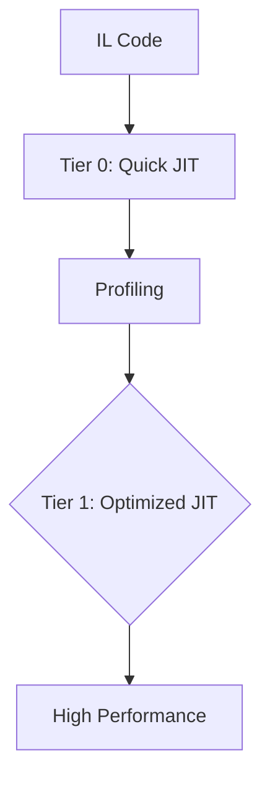

### 1. Теоретическая часть

#### Внутреннее устройство .NET и CLR

**1. Опишите процесс JIT-компиляции в .NET и различия между Tiered Compilation**
**Ответ:** 

Tier 0: быстрая компиляция без оптимизаций, Tier 1: агрессивные оптимизации на основе profiling данных.

**2. Как работает GC поколений и что такое LOH?**
**Ответ:** Gen 0/1/2 + LOH (Large Object Heap). LOH для объектов >85KB, не компактируется, что может приводить к фрагментации.

**3. Объясните работу String Interning и его impact на память**
**Ответ:** CLR хранит уникальные строки в intern pool. Экономит память, но может утечь если интернить много уникальных строк.

**4. Что такое Dependent Handle и как он используется в WeakReference?**
**Ответ:** DependentHandle сохраняет связь между первичным и вторичным объектом. Вторичный объект жив пока жив первичный.

**5. Как работает Array Covariance и почему она unsafe?**
**Ответ:** 
```csharp
string[] strings = new string[10];
object[] objects = strings; // Ковариантность
objects[0] = 5; // Runtime ArrayTypeMismatchException
```

**6. Опишите internal structure Dictionary<TKey, TValue>**
**Ответ:** Массив бакетов + entries. Коллизии через chaining. Load factor 1.0 при resize.

**7. Как устроены Span<T> и ReadOnlySpan<T> на уровне памяти?**
**Ответ:** ref struct с полями: reference (object), byte offset, length. Работает с stack, heap, unmanaged памятью.

**8. Что такое Method Table и как она используется CLR?**
**Ответ:** Каждый тип имеет Method Table содержащую: указатели на методы, информацию о наследовании, интерфейсы.

**9. Объясните работу CER (Constrained Execution Region)**
**Ответ:** Гарантирует что код в CER будет выполнен даже при асинхронных исключениях. Использует `RuntimeHelpers.PrepareConstrainedRegions()`.

**10. Как работает Memory Mapped Files в .NET?**
**Ответ:** Позволяет маппить файлы в виртуальную память. Эффективно для больших файлов и межпроцессного взаимодействия.

#### Алгоритмы и структуры данных

**11. Реализуйте красно-черное дерево и объясните его свойства**
**Ответ:** Самобалансирующееся BST. Свойства:
- Каждый узел красный/черный
- Корень черный
- Красные узлы имеют черных детей
- Все пути содержат одинаковое количество черных узлов

**12. Алгоритм A* для поиска пути - сложность и эвристики**
**Ответ:** O(b^d) где b - branching factor, d - глубина. Эвристики: Манхэттен, Евклидово расстояние.

**13. Реализуйте алгоритм Дейкстры с Fibonacci Heap**
**Ответ:** 
```csharp
public int[] Dijkstra(Graph graph, int source)
{
    var dist = new int[graph.V];
    var heap = new FibonacciHeap<int, int>();
    // Реализация с приоритетной очередью
}
```

**14. Объясните алгоритм Rabin-Karp для поиска подстрок**
**Ответ:** Использует хеширование. O(n+m) в среднем, O(nm) в худшем случае.

**15. Реализуйте B-tree и объясните его использование в БД**
**Ответ:** Сбалансированное дерево с множественными детьми. Используется в файловых системах и БД для эффективного disk I/O.

**16. Алгоритм Кнута-Морриса-Пратта - префикс-функция**
**Ответ:** O(n+m) без возвратов. Использует префикс-функцию для оптимизации сдвигов.

**17. Реализуйте алгоритм Флойда-Уоршелла для всех пар кратчайших путей**
**Ответ:** O(V^3) через динамическое программирование.

**18. Объясните алгоритм Ли для волнового поиска пути**
**Ответ:** Поиск в ширину на сетке с восстановлением пути.

**19. Реализуйте алгоритм Тарьяна для поиска компонент сильной связности**
**Ответ:** Использует DFS с lowlink значениями.

**20. Алгоритм Бойера-Мура для поиска подстрок - правила стоп-символа и суффикса**
**Ответ:** Сравнение с конца, правила позволяют делать большие сдвиги.

#### Архитектура и системный дизайн

**21. Реализуйте паттерн Event Sourcing с snapshotting**
**Ответ:** 
```csharp
public class EventSourcedAggregate
{
    private readonly List<IDomainEvent> _changes = new();
    private int _version;
    
    public void LoadFromHistory(IEnumerable<IDomainEvent> history)
    {
        foreach (var e in history)
            Apply(e, false);
    }
    
    protected void Apply(IDomainEvent @event, bool isNew = true)
    {
        When(@event);
        if (isNew) _changes.Add(@event);
    }
}
```

**22. Объясните CQRS с Event Sourcing - проблемы и решения**
**Ответ:** Проблемы: eventual consistency, обработка запросов. Решения: materialized views, read models.

**23. Реализуйте Saga Pattern для распределенных транзакций**
**Ответ:** 
```csharp
public class OrderSaga
{
    public async Task ProcessOrderAsync(Order order)
    {
        try
        {
            await _paymentService.ProcessPayment(order);
            await _inventoryService.ReserveItems(order);
            await _shippingService.ScheduleShipping(order);
        }
        catch
        {
            await CompensateAsync(order); // Компенсирующие действия
        }
    }
}
```

**24. Что такое Data Locality и как она влияет на производительность?**
**Ответ:** Размещение данных для оптимального использования кэша процессора. Cache-friendly структуры данных.

**25. Объясните принцип LMAX Disruptor Pattern**
**Ответ:** High-performance inter-thread messaging через ring buffer, избегая блокировок.

---

### 2. Вопросы по языку C#

#### Коллекции и массивы

**26. Опишите internal implementation List<T> и рост capacity**
**Ответ:** 
```csharp
// При добавлении элементов:
if (_size == _items.Length) 
    EnsureCapacity(_size + 1);

private void EnsureCapacity(int min)
{
    if (_items.Length < min)
    {
        int newCapacity = _items.Length == 0 ? 4 : _items.Length * 2;
        if ((uint)newCapacity > Array.MaxLength) newCapacity = Array.MaxLength;
        if (newCapacity < min) newCapacity = min;
        Capacity = newCapacity;
    }
}
```

**27. Как работает HashSet<T> и что такое collision resolution?**
**Ответ:** Использует chaining для коллизий. Load factor 0.75 при resize. Internal структура: array of slots.

**28. Реализуйте кастомную коллекцию с O(1) для Add, Remove, Contains**
**Ответ:** Комбинация Dictionary и LinkedList для сохранения порядка.

**29. Объясните работу SortedDictionary<TKey, TValue> vs SortedList<TKey, TValue>**
**Ответ:** SortedDictionary - красно-черное дерево (O(log n) для операций), SortedList - отсортированный массив (O(n) для вставки/удаления).

**30. Как устроен ConcurrentDictionary и его lock striping?**
**Ответ:** Разделяет dictionary на партиции с отдельными lock-ами для уменьшения contention.

**31. Реализуйте circular buffer с array pooling**
**Ответ:**
```csharp
public class CircularBuffer<T> : IDisposable
{
    private T[] _buffer;
    private int _head, _tail, _count;
    private readonly ArrayPool<T> _pool;
    
    public CircularBuffer(int capacity, ArrayPool<T> pool = null)
    {
        _pool = pool ?? ArrayPool<T>.Shared;
        _buffer = _pool.Rent(capacity);
    }
    
    public void Dispose() => _pool.Return(_buffer);
}
```

**32. Опишите internal structure Stack<T> и Queue<T>**
**Ответ:** Оба используют array. Stack: LIFO через индекс top. Queue: circular buffer с head и tail.

**33. Как работает Array.Sort() и какой алгоритм используется?**
**Ответ:** Использует IntroSort: комбинация QuickSort, HeapSort и InsertionSort в зависимости от глубины рекурсии.

**34. Реализуйте priority queue с heap**
**Ответ:**
```csharp
public class PriorityQueue<T> where T : IComparable<T>
{
    private readonly List<T> _heap = new();
    
    public void Enqueue(T item)
    {
        _heap.Add(item);
        HeapifyUp(_heap.Count - 1);
    }
    
    private void HeapifyUp(int index)
    {
        while (index > 0)
        {
            int parent = (index - 1) / 2;
            if (_heap[parent].CompareTo(_heap[index]) <= 0) break;
            Swap(parent, index);
            index = parent;
        }
    }
}
```

**35. Объясните работу Immutable Collections и structural sharing**
**Ответ:** Создают новые версии при изменениях, переиспользуя неизмененные части для экономии памяти.

#### Memory Management и производительность

**36. Что такое Pinned Object Heap и когда его использовать?**
**Ответ:** POH для объектов которые должны быть закреплены в памяти для unmanaged кода. Избегает фрагментации LOH.

**37. Реализуйте object pooling с generation awareness**
**Ответ:**
```csharp
public class GenerationAwarePool<T> where T : class
{
    private readonly ConcurrentBag<T>[] _generations;
    private long _genCounter;
    
    public GenerationAwarePool(int generations)
    {
        _generations = new ConcurrentBag<T>[generations];
        for (int i = 0; i < generations; i++)
            _generations[i] = new ConcurrentBag<T>();
    }
    
    public void Return(T item)
    {
        int gen = (int)(_genCounter % _generations.Length);
        _generations[gen].Add(item);
        Interlocked.Increment(ref _genCounter);
    }
}
```

**38. Как работает Memory<T> и IMemoryOwner<T>?**
**Ответ:** Memory<T> - read-write span-like тип, IMemoryOwner управляет временем жизни памяти.

**39. Объясните difference между stackalloc и NativeMemory.Alloc**
**Ответ:** stackalloc - стек, автоматическое освобождение. NativeMemory.Alloc - unmanaged heap, требует ручного освобождения.

**40. Реализуйте zero-copy serialization с MemoryMappedFile**
**Ответ:**
```csharp
public unsafe class ZeroCopySerializer
{
    public void Serialize<T>(T[] data, string filePath) where T : unmanaged
    {
        using var mmf = MemoryMappedFile.CreateFromFile(filePath, FileMode.Create, null, data.Length * sizeof(T));
        using var accessor = mmf.CreateViewAccessor();
        byte* pointer = null;
        accessor.SafeMemoryMappedViewHandle.AcquirePointer(ref pointer);
        var span = new Span<T>(pointer, data.Length);
        data.CopyTo(span);
    }
}
```

#### Многопоточность и параллелизм

**41. Реализуйте lock-free stack с Interlocked.CompareExchange**
**Ответ:**
```csharp
public class LockFreeStack<T>
{
    private class Node
    {
        public readonly T Value;
        public Node Next;
        public Node(T value) => Value = value;
    }
    
    private Node _head;
    
    public void Push(T value)
    {
        var newNode = new Node(value);
        Node oldHead;
        do
        {
            oldHead = _head;
            newNode.Next = oldHead;
        }
        while (Interlocked.CompareExchange(ref _head, newNode, oldHead) != oldHead);
    }
}
```

**42. Объясните memory model .NET и барьеры памяти**
**Ответ:** .NET имеет weak memory model. Барьеры: Volatile.Write (Store), Volatile.Read (Load), MemoryBarrier (Full Fence).

**43. Реализуйте scalable producer-consumer с Channels**
**Ответ:**
```csharp
public class ScalableProcessor<T>
{
    private readonly Channel<T> _channel;
    private readonly Task[] _workers;
    
    public ScalableProcessor(int workerCount, int capacity)
    {
        _channel = Channel.CreateBounded<T>(new BoundedChannelOptions(capacity)
        {
            SingleReader = false,
            SingleWriter = true,
            FullMode = BoundedChannelFullMode.Wait
        });
        
        _workers = new Task[workerCount];
        for (int i = 0; i < workerCount; i++)
            _workers[i] = Task.Run(ProcessItemsAsync);
    }
    
    private async Task ProcessItemsAsync()
    {
        await foreach (var item in _channel.Reader.ReadAllAsync())
        {
            // Обработка
        }
    }
}
```

**44. Что такое Thread Local Storage и как его использовать?**
**Ответ:** Хранение данных уникальных для каждого потока через `[ThreadStatic]` или `ThreadLocal<T>`.

**45. Реализуйте async synchronization primitives**
**Ответ:**
```csharp
public class AsyncLock
{
    private readonly SemaphoreSlim _semaphore = new(1, 1);
    private readonly Task<IDisposable> _releaser;
    
    public AsyncLock() => _releaser = Task.FromResult<IDisposable>(new Releaser(this));
    
    public Task<IDisposable> LockAsync()
    {
        var wait = _semaphore.WaitAsync();
        return wait.IsCompleted ? _releaser : wait.ContinueWith((_, state) => (IDisposable)state!, 
            _releaser.Result, CancellationToken.None, TaskContinuationOptions.ExecuteSynchronously, TaskScheduler.Default);
    }
    
    private class Releaser : IDisposable
    {
        private readonly AsyncLock _lock;
        public Releaser(AsyncLock @lock) => _lock = @lock;
        public void Dispose() => _lock._semaphore.Release();
    }
}
```

#### Современные возможности C#

**46. Реализуйте source generator для compile-time reflection**
**Ответ:**
```csharp
[Generator]
public class MySourceGenerator : ISourceGenerator
{
    public void Initialize(GeneratorInitializationContext context)
    {
        context.RegisterForSyntaxNotifications(() => new MySyntaxReceiver());
    }
    
    public void Execute(GeneratorExecutionContext context)
    {
        // Генерация кода на основе синтаксического анализа
    }
}
```

**47. Объясните ref returns и ref locals**
**Ответ:**
```csharp
public ref int Find(int[] array, int value)
{
    for (int i = 0; i < array.Length; i++)
    {
        if (array[i] == value)
            return ref array[i]; // Возврат по ссылке
    }
    throw new InvalidOperationException();
}
```

**48. Реализуйте pattern matching с recursive patterns**
**Ответ:**
```csharp
public static decimal CalculateTax(object entity) => entity switch
{
    Product { Price: > 1000 } p => p.Price * 0.2m,
    Order { Items: [] } => 0, // Пустой заказ
    Order { Items: [var first, ..] } o => o.Items.Sum(i => CalculateTax(i)),
    _ => throw new ArgumentException("Unknown entity type")
};
```

**49. Что такое function pointers и когда их использовать?**
**Ответ:** C# 9.0, для high-performance сценариев:
```csharp
unsafe delegate* managed<int, int, int> funcPtr = &Add;
static int Add(int a, int b) => a + b;
```

**50. Реализуйте custom collection initializer**
**Ответ:**
```csharp
public class CustomCollection<T> : IEnumerable<T>
{
    private readonly List<T> _items = new();
    
    public void Add(T item) => _items.Add(item);
    
    // Custom initializer
    public void Add(string key, T value) { /* special logic */ }
    
    public IEnumerator<T> GetEnumerator() => _items.GetEnumerator();
    IEnumerator IEnumerable.GetEnumerator() => GetEnumerator();
}
```

---

### 3. Практическая часть

#### Сложные алгоритмы

**51. Реализуйте алгоритм поиска максимального потока (Ford-Fulkerson)**
```csharp
public class MaxFlowFinder
{
    public int FindMaxFlow(int[,] capacity, int source, int sink)
    {
        int[,] residual = (int[,])capacity.Clone();
        int[] parent = new int[capacity.GetLength(0)];
        int maxFlow = 0;
        
        while (BFS(residual, source, sink, parent))
        {
            int pathFlow = int.MaxValue;
            for (int v = sink; v != source; v = parent[v])
            {
                int u = parent[v];
                pathFlow = Math.Min(pathFlow, residual[u, v]);
            }
            
            for (int v = sink; v != source; v = parent[v])
            {
                int u = parent[v];
                residual[u, v] -= pathFlow;
                residual[v, u] += pathFlow;
            }
            
            maxFlow += pathFlow;
        }
        return maxFlow;
    }
    
    private bool BFS(int[,] residual, int source, int sink, int[] parent)
    {
        // Реализация поиска в ширину
    }
}
```

**52. Реализуйте алгоритм k-means кластеризации**
```csharp
public class KMeans
{
    public int[] Cluster(double[,] data, int k, int maxIterations = 100)
    {
        int numPoints = data.GetLength(0);
        var centroids = InitializeCentroids(data, k);
        var clusters = new int[numPoints];
        
        for (int iter = 0; iter < maxIterations; iter++)
        {
            // Assign points to clusters
            bool changed = AssignClusters(data, centroids, clusters);
            if (!changed) break;
            
            // Update centroids
            centroids = UpdateCentroids(data, clusters, k);
        }
        
        return clusters;
    }
}
```

**53. Реализуйте алгоритм быстрой сортировки с оптимизацией медианы трех**
```csharp
public class OptimizedQuickSort
{
    public void Sort(int[] array) => QuickSort(array, 0, array.Length - 1);
    
    private void QuickSort(int[] array, int left, int right)
    {
        if (left >= right) return;
        
        // Медиана трех для выбора опорного элемента
        int pivotIndex = MedianOfThree(array, left, right);
        int pivot = array[pivotIndex];
        
        Swap(array, pivotIndex, right);
        
        int partitionIndex = Partition(array, left, right - 1, pivot);
        Swap(array, partitionIndex, right);
        
        QuickSort(array, left, partitionIndex - 1);
        QuickSort(array, partitionIndex + 1, right);
    }
    
    private int MedianOfThree(int[] array, int left, int right)
    {
        int mid = left + (right - left) / 2;
        // Возвращает индекс медианы
    }
}
```

**54. Реализуйте алгоритм LZ77 сжатия**
```csharp
public class LZ77Compressor
{
    public List<(int, int, char)> Compress(string input, int windowSize = 1024)
    {
        var result = new List<(int, int, char)>();
        int pos = 0;
        
        while (pos < input.Length)
        {
            int matchLength = 0;
            int matchDistance = 0;
            
            // Поиск наибольшего совпадения в скользящем окне
            int searchStart = Math.Max(0, pos - windowSize);
            for (int i = searchStart; i < pos; i++)
            {
                int len = LongestCommonLength(input, i, pos, windowSize);
                if (len > matchLength)
                {
                    matchLength = len;
                    matchDistance = pos - i;
                }
            }
            
            char nextChar = pos + matchLength < input.Length ? input[pos + matchLength] : '\0';
            result.Add((matchDistance, matchLength, nextChar));
            pos += matchLength + 1;
        }
        
        return result;
    }
}
```

#### High-performance кодирование

**55. Реализуйте SIMD-оптимизированную обработку массивов**
```csharp
public static class SimdOperations
{
    public static unsafe void VectorizedAdd(int[] left, int[] right, int[] result)
    {
        int i = 0;
        if (Vector.IsHardwareAccelerated)
        {
            int size = Vector<int>.Count;
            for (; i <= left.Length - size; i += size)
            {
                var v1 = new Vector<int>(left, i);
                var v2 = new Vector<int>(right, i);
                (v1 + v2).CopyTo(result, i);
            }
        }
        
        // Обработка оставшихся элементов
        for (; i < left.Length; i++)
            result[i] = left[i] + right[i];
    }
}
```

**56. Реализуйте zero-allocation string parsing**
```csharp
public static class StringParser
{
    public static int ParseInt(ReadOnlySpan<char> span)
    {
        int result = 0;
        bool negative = false;
        int i = 0;
        
        if (span.Length > 0 && span[0] == '-')
        {
            negative = true;
            i = 1;
        }
        
        for (; i < span.Length; i++)
        {
            char c = span[i];
            if (c < '0' || c > '9')
                throw new FormatException($"Invalid character: {c}");
                
            result = result * 10 + (c - '0');
        }
        
        return negative ? -result : result;
    }
}
```

**57. Реализуйте memory pool с slab allocation**
```csharp
public class SlabMemoryPool : MemoryPool<byte>
{
    private readonly Slab[] _slabs;
    private readonly int _slabSize;
    
    public SlabMemoryPool(int slabSize, int maxSlabs)
    {
        _slabSize = slabSize;
        _slabs = new Slab[maxSlabs];
    }
    
    protected override void Dispose(bool disposing)
    {
        foreach (var slab in _slabs)
            slab?.Dispose();
    }
    
    private class Slab : IDisposable
    {
        public readonly byte[] Buffer;
        public readonly BitArray Allocated;
        
        public Slab(int size)
        {
            Buffer = new byte[size];
            Allocated = new BitArray(size);
        }
        
        public void Dispose() { }
    }
}
```

#### Работа с памятью

**58. Реализуйте arena allocator для game development**
```csharp
public unsafe class ArenaAllocator : IDisposable
{
    private readonly byte* _memory;
    private readonly long _size;
    private long _offset;
    
    public ArenaAllocator(long size)
    {
        _memory = (byte*)NativeMemory.Alloc((nuint)size);
        _size = size;
        _offset = 0;
    }
    
    public void* Allocate(long size, int alignment = 8)
    {
        long alignedOffset = (_offset + alignment - 1) & ~(alignment - 1);
        if (alignedOffset + size > _size)
            throw new OutOfMemoryException("Arena exhausted");
            
        void* result = _memory + alignedOffset;
        _offset = alignedOffset + size;
        return result;
    }
    
    public void Reset() => _offset = 0;
    
    public void Dispose()
    {
        NativeMemory.Free(_memory);
        GC.SuppressFinalize(this);
    }
    
    ~ArenaAllocator() => Dispose();
}
```

**59. Реализуйте compacting garbage collector для managed heap**
```csharp
public class MarkCompactGC
{
    private readonly Dictionary<object, long> _objectAddresses = new();
    private long _heapSize;
    
    public void Collect()
    {
        // Mark phase
        var marked = MarkReachableObjects();
        
        // Compact phase
        CompactHeap(marked);
    }
    
    private HashSet<object> MarkReachableObjects()
    {
        var marked = new HashSet<object>();
        var roots = GetRoots();
        var stack = new Stack<object>(roots);
        
        while (stack.Count > 0)
        {
            var obj = stack.Pop();
            if (marked.Add(obj))
            {
                foreach (var reference in GetReferences(obj))
                    stack.Push(reference);
            }
        }
        
        return marked;
    }
    
    private void CompactHeap(HashSet<object> marked)
    {
        long newAddress = 0;
        foreach (var obj in marked.OrderBy(o => _objectAddresses[o]))
        {
            // Move object and update references
            _objectAddresses[obj] = newAddress;
            newAddress += GetObjectSize(obj);
        }
        
        _heapSize = newAddress;
    }
}
```

#### Параллельные алгоритмы

**60. Реализуйте parallel merge sort**
```csharp
public class ParallelMergeSort
{
    public static void Sort(int[] array)
    {
        if (array.Length <= 1000)
        {
            Array.Sort(array);
            return;
        }
        
        int mid = array.Length / 2;
        var left = new int[mid];
        var right = new int[array.Length - mid];
        
        Array.Copy(array, left, mid);
        Array.Copy(array, mid, right, 0, right.Length);
        
        Parallel.Invoke(
            () => Sort(left),
            () => Sort(right)
        );
        
        Merge(array, left, right);
    }
    
    private static void Merge(int[] result, int[] left, int[] right)
    {
        int i = 0, j = 0, k = 0;
        while (i < left.Length && j < right.Length)
            result[k++] = left[i] <= right[j] ? left[i++] : right[j++];
            
        while (i < left.Length) result[k++] = left[i++];
        while (j < right.Length) result[k++] = right[j++];
    }
}
```

**61. Реализуйте work-stealing scheduler**
```csharp
public class WorkStealingScheduler
{
    private readonly ConcurrentQueue<Action>[] _queues;
    private readonly Thread[] _workers;
    
    public WorkStealingScheduler(int numThreads)
    {
        _queues = new ConcurrentQueue<Action>[numThreads];
        for (int i = 0; i < numThreads; i++)
            _queues[i] = new ConcurrentQueue<Action>();
            
        _workers = new Thread[numThreads];
        for (int i = 0; i < numThreads; i++)
        {
            int threadId = i;
            _workers[i] = new Thread(() => WorkerLoop(threadId));
            _workers[i].Start();
        }
    }
    
    private void WorkerLoop(int threadId)
    {
        var random = new Random();
        while (true)
        {
            if (_queues[threadId].TryDequeue(out var work))
            {
                work();
            }
            else
            {
                // Work stealing
                int victim = random.Next(_queues.Length);
                if (_queues[victim].TryDequeue(out work))
                    work();
            }
        }
    }
}
```

#### Сетевые алгоритмы

**62. Реализуйте consistent hashing для распределенного кэша**
```csharp
public class ConsistentHash<T>
{
    private readonly SortedDictionary<int, T> _circle = new();
    private readonly int _replicas;
    private readonly HashAlgorithm _hash;
    
    public ConsistentHash(int replicas = 100)
    {
        _replicas = replicas;
        _hash = MD5.Create();
    }
    
    public void Add(T node)
    {
        for (int i = 0; i < _replicas; i++)
        {
            string key = $"{node}:{i}";
            int hash = GetHash(key);
            _circle[hash] = node;
        }
    }
    
    public T GetNode(string key)
    {
        if (_circle.Count == 0) throw new InvalidOperationException("No nodes available");
        
        int hash = GetHash(key);
        var entry = _circle.CeilingEntry(hash);
        return entry.Value ?? _circle.First().Value;
    }
    
    private int GetHash(string key)
    {
        var bytes = _hash.ComputeHash(Encoding.UTF8.GetBytes(key));
        return BitConverter.ToInt32(bytes, 0);
    }
}
```

**63. Реализуйте алгоритм сжатия Huffman coding**
```csharp
public class HuffmanCoding
{
    public (Dictionary<char, string>, byte[]) Encode(string text)
    {
        var freq = text.GroupBy(c => c).ToDictionary(g => g.Key, g => g.Count());
        var heap = new PriorityQueue<Node, int>();
        
        foreach (var kvp in freq)
            heap.Enqueue(new Node(kvp.Key, kvp.Value), kvp.Value);
            
        while (heap.Count > 1)
        {
            var left = heap.Dequeue();
            var right = heap.Dequeue();
            var parent = new Node('\0', left.Freq + right.Freq) { Left = left, Right = right };
            heap.Enqueue(parent, parent.Freq);
        }
        
        var root = heap.Dequeue();
        var codes = BuildCodes(root);
        var encoded = EncodeText(text, codes);
        
        return (codes, encoded);
    }
    
    private class Node
    {
        public char Char { get; }
        public int Freq { get; }
        public Node Left { get; set; }
        public Node Right { get; set; }
        
        public Node(char ch, int freq) => (Char, Freq) = (ch, freq);
    }
}
```

#### Машинное обучение

**64. Реализуйте алгоритм обратного распространения ошибки для нейронной сети**
```csharp
public class NeuralNetwork
{
    private readonly Layer[] _layers;
    
    public double[] Train(double[] input, double[] target, double learningRate)
    {
        // Forward pass
        var output = Forward(input);
        
        // Backward pass
        var errors = CalculateErrors(output, target);
        Backward(errors, learningRate);
        
        return output;
    }
    
    private double[] Forward(double[] input)
    {
        var current = input;
        foreach (var layer in _layers)
            current = layer.Forward(current);
        return current;
    }
    
    private void Backward(double[] errors, double learningRate)
    {
        for (int i = _layers.Length - 1; i >= 0; i--)
            errors = _layers[i].Backward(errors, learningRate);
    }
}
```

**65. Реализуйте алгоритм random forest для классификации**
```csharp
public class RandomForest
{
    private readonly DecisionTree[] _trees;
    
    public RandomForest(int numTrees, int maxDepth, int numFeatures)
    {
        _trees = new DecisionTree[numTrees];
        // Инициализация деревьев с разными подвыборками и признаками
    }
    
    public string Predict(double[] features)
    {
        var predictions = _trees.Select(t => t.Predict(features));
        return predictions.GroupBy(p => p).OrderByDescending(g => g.Count()).First().Key;
    }
}
```

#### Базы данных и индексы

**66. Реализуйте B+ tree индекс**
```csharp
public class BPlusTree<TKey, TValue> where TKey : IComparable<TKey>
{
    private class Node
    {
        public TKey[] Keys { get; }
        public object[] Children { get; }
        public bool IsLeaf { get; }
        public int KeyCount { get; set; }
    }
    
    private Node _root;
    private readonly int _order;
    
    public void Insert(TKey key, TValue value)
    {
        if (_root == null)
        {
            _root = new Node(_order, true);
            _root.Keys[0] = key;
            _root.KeyCount = 1;
        }
        else
        {
            if (_root.KeyCount == _order - 1)
            {
                var newRoot = new Node(_order, false);
                newRoot.Children[0] = _root;
                SplitChild(newRoot, 0, _root);
                _root = newRoot;
            }
            InsertNonFull(_root, key, value);
        }
    }
}
```

**67. Реализуйте алгоритм двухфазного коммита (2PC)**
```csharp
public class TwoPhaseCommit
{
    private readonly List<IParticipant> _participants;
    
    public async Task<bool> CommitAsync()
    {
        // Phase 1: Prepare
        var prepareTasks = _participants.Select(p => p.PrepareAsync());
        var prepareResults = await Task.WhenAll(prepareTasks);
        
        if (prepareResults.All(r => r))
        {
            // Phase 2: Commit
            var commitTasks = _participants.Select(p => p.CommitAsync());
            await Task.WhenAll(commitTasks);
            return true;
        }
        else
        {
            // Rollback
            var rollbackTasks = _participants.Select(p => p.RollbackAsync());
            await Task.WhenAll(rollbackTasks);
            return false;
        }
    }
}
```

#### Компиляторы и интерпретаторы

**68. Реализуйте recursive descent parser для арифметических выражений**
```csharp
public class ExpressionParser
{
    private readonly string _input;
    private int _position;
    
    public double Parse()
    {
        var result = ParseExpression();
        if (_position < _input.Length)
            throw new InvalidOperationException("Unexpected characters at end of input");
        return result;
    }
    
    private double ParseExpression()
    {
        double left = ParseTerm();
        while (_position < _input.Length)
        {
            char op = _input[_position];
            if (op != '+' && op != '-') break;
            _position++;
            double right = ParseTerm();
            left = op == '+' ? left + right : left - right;
        }
        return left;
    }
    
    private double ParseTerm() { /* Аналогично для */ }
    private double ParseFactor() { /* Аналогично для */ }
}
```

**69. Реализуйте JIT-компилятор для простого байткода**
```csharp
public class SimpleJitCompiler
{
    public Func<int, int, int> Compile(byte[] bytecode)
    {
        var method = new DynamicMethod("JITCompiled", typeof(int), new[] { typeof(int), typeof(int) });
        var il = method.GetILGenerator();
        
        foreach (byte op in bytecode)
        {
            switch (op)
            {
                case 0x01: // ADD
                    il.Emit(OpCodes.Add);
                    break;
                case 0x02: // MUL  
                    il.Emit(OpCodes.Mul);
                    break;
                // Другие операции
            }
        }
        
        il.Emit(OpCodes.Ret);
        return (Func<int, int, int>)method.CreateDelegate(typeof(Func<int, int, int>));
    }
}
```

#### Криптография

**70. Реализуйте алгоритм AES шифрования**
```csharp
public class AesImplementation
{
    private readonly byte[] _key;
    private readonly byte[] _expandedKey;
    
    public byte[] Encrypt(byte[] input)
    {
        var state = (byte[])input.Clone();
        
        AddRoundKey(state, 0);
        
        for (int round = 1; round < 10; round++)
        {
            SubBytes(state);
            ShiftRows(state);
            MixColumns(state);
            AddRoundKey(state, round);
        }
        
        SubBytes(state);
        ShiftRows(state);
        AddRoundKey(state, 10);
        
        return state;
    }
    
    private void SubBytes(byte[] state)
    {
        for (int i = 0; i < 16; i++)
            state[i] = SBox[state[i]];
    }
    
    private void ShiftRows(byte[] state) { /* Реализация */ }
    private void MixColumns(byte[] state) { /* Реализация */ }
    private void AddRoundKey(byte[] state, int round) { /* Реализация */ }
    
    private static readonly byte[] SBox = { /* Стандартная S-Box таблица */ };
}
```

**71. Реализуйте алгоритм RSA с паддингом**
```csharp
public class RsaWithPadding
{
    private readonly BigInteger _n, _e, _d;
    
    public byte[] Encrypt(byte[] data)
    {
        // PKCS#1 padding
        var padded = AddPadding(data);
        var number = new BigInteger(padded);
        var encrypted = BigInteger.ModPow(number, _e, _n);
        return encrypted.ToByteArray();
    }
    
    private byte[] AddPadding(byte[] data)
    {
        var padded = new byte[256]; // 2048-bit RSA
        padded[0] = 0x00;
        padded[1] = 0x02;
        
        // Random padding
        var rng = RandomNumberGenerator.Create();
        rng.GetBytes(padded, 2, padded.Length - data.Length - 3);
        
        // Zero separator
        padded[padded.Length - data.Length - 1] = 0x00;
        
        // Data
        Array.Copy(data, 0, padded, padded.Length - data.Length, data.Length);
        return padded;
    }
}
```

#### Оптимизация компилятора

**72. Реализуйте common subexpression elimination**
```csharp
public class CommonSubexpressionElimination
{
    public Expression Optimize(Expression expression)
    {
        var seen = new Dictionary<string, Expression>();
        return Visit(expression, seen);
    }
    
    private Expression Visit(Expression expr, Dictionary<string, Expression> seen)
    {
        switch (expr)
        {
            case BinaryExpression binary:
                var left = Visit(binary.Left, seen);
                var right = Visit(binary.Right, seen);
                var key = $"{left}_{binary.NodeType}_{right}";
                
                if (seen.TryGetValue(key, out var existing))
                    return existing;
                    
                seen[key] = binary;
                return binary;
                
            // Другие типы выражений
            default:
                return expr;
        }
    }
}
```

**73. Реализуйте dead code elimination**
```csharp
public class DeadCodeElimination
{
    public void Eliminate(MethodDefinition method)
    {
        var usedVariables = FindUsedVariables(method);
        var liveCode = FindLiveCode(method, usedVariables);
        
        // Удаление мертвого кода
        foreach (var instruction in method.Body.Instructions.ToArray())
        {
            if (!liveCode.Contains(instruction))
                method.Body.Instructions.Remove(instruction);
        }
    }
    
    private HashSet<VariableDefinition> FindUsedVariables(MethodDefinition method)
    {
        var used = new HashSet<VariableDefinition>();
        foreach (var instruction in method.Body.Instructions)
        {
            if (instruction.Operand is VariableDefinition variable)
                used.Add(variable);
        }
        return used;
    }
}
```

#### Распределенные системы

**74. Реализуйте алгоритм Paxos для консенсуса**
```csharp
public class PaxosNode
{
    private int _proposalNumber;
    private object _acceptedValue;
    private int _acceptedProposal = -1;
    
    public bool Propose(object value)
    {
        _proposalNumber++;
        
        // Phase 1: Prepare
        var promises = RequestPromises(_proposalNumber);
        if (promises.Count < QuorumSize) return false;
        
        // Phase 2: Accept
        var valueToPropose = ChooseValue(promises, value);
        var accepts = RequestAccepts(_proposalNumber, valueToPropose);
        
        return accepts.Count >= QuorumSize;
    }
    
    private List<Promise> RequestPromises(int proposalNumber)
    {
        // Отправка prepare запросов другим узлам
        return new List<Promise>();
    }
}
```

**75. Реализуйте gossip protocol для распространения состояния**
```csharp
public class GossipMember
{
    private readonly Dictionary<string, MemberState> _states = new();
    private readonly Random _random = new();
    private readonly List<GossipMember> _members;
    
    public void SpreadState()
    {
        // Выбор случайного члена для обмена состояниями
        var target = _members[_random.Next(_members.Count)];
        var statesToSend = SelectStatesToSend();
        
        target.ReceiveStates(statesToSend);
    }
    
    public void ReceiveStates(Dictionary<string, MemberState> receivedStates)
    {
        foreach (var (key, receivedState) in receivedStates)
        {
            if (!_states.TryGetValue(key, out var currentState) || 
                receivedState.Version > currentState.Version)
            {
                _states[key] = receivedState;
            }
        }
    }
}
```

#### Game Development

**76. Реализуйте spatial hash для collision detection**
```csharp
public class SpatialHash
{
    private readonly Dictionary<(int, int), List<GameObject>> _cells = new();
    private readonly float _cellSize;
    
    public void Insert(GameObject obj)
    {
        var cell = GetCell(obj.Position);
        if (!_cells.ContainsKey(cell))
            _cells[cell] = new List<GameObject>();
        _cells[cell].Add(obj);
    }
    
    public IEnumerable<GameObject> GetNearby(Vector3 position, float radius)
    {
        var centerCell = GetCell(position);
        int range = (int)Math.Ceiling(radius / _cellSize);
        
        for (int x = -range; x <= range; x++)
        {
            for (int y = -range; y <= range; y++)
            {
                var cell = (centerCell.X + x, centerCell.Y + y);
                if (_cells.TryGetValue(cell, out var objects))
                {
                    foreach (var obj in objects)
                        yield return obj;
                }
            }
        }
    }
    
    private (int X, int Y) GetCell(Vector3 position) => 
        ((int)(position.X / _cellSize), (int)(position.Y / _cellSize));
}
```

**77. Реализуйте ECS (Entity-Component-System) architecture**
```csharp
public class World
{
    private readonly List<Entity> _entities = new();
    private readonly Dictionary<Type, ISystem> _systems = new();
    
    public void Update(float deltaTime)
    {
        foreach (var system in _systems.Values)
            system.Update(deltaTime, _entities);
    }
}

public interface ISystem
{
    void Update(float deltaTime, List<Entity> entities);
}

public class MovementSystem : ISystem
{
    public void Update(float deltaTime, List<Entity> entities)
    {
        foreach (var entity in entities)
        {
            if (entity.HasComponent<Position>() && entity.HasComponent<Velocity>())
            {
                var position = entity.GetComponent<Position>();
                var velocity = entity.GetComponent<Velocity>();
                position.Value += velocity.Value * deltaTime;
            }
        }
    }
}
```

#### Web Assembly

**78. Реализуйте .NET to WebAssembly compiler**
```csharp
public class WasmCompiler
{
    public byte[] Compile(MethodDefinition method)
    {
        var writer = new BinaryWriter(new MemoryStream());
        
        // WASM header
        writer.Write(new byte[] { 0x00, 0x61, 0x73, 0x6D }); // Magic
        writer.Write(new byte[] { 0x01, 0x00, 0x00, 0x00 }); // Version
        
        // Type section
        WriteTypeSection(writer, method);
        
        // Function section
        WriteFunctionSection(writer, method);
        
        // Code section
        WriteCodeSection(writer, method);
        
        return ((MemoryStream)writer.BaseStream).ToArray();
    }
    
    private void WriteTypeSection(BinaryWriter writer, MethodDefinition method)
    {
        // Генерация сигнатур типов для WASM
    }
}
```

**79. Реализуйте WebAssembly interpreter на C#**
```csharp
public class WasmInterpreter
{
    private readonly Stack<object> _stack = new();
    private readonly Dictionary<int, object> _locals = new();
    
    public object Execute(byte[] wasm, object[] parameters)
    {
        var module = ParseModule(wasm);
        return ExecuteFunction(module, parameters);
    }
    
    private object ExecuteFunction(Module module, object[] parameters)
    {
        for (int i = 0; i < parameters.Length; i++)
            _locals[i] = parameters[i];
            
        foreach (var instruction in module.Instructions)
        {
            switch (instruction.OpCode)
            {
                case OpCode.I32Const:
                    _stack.Push(instruction.Operand);
                    break;
                case OpCode.I32Add:
                    var b = (int)_stack.Pop();
                    var a = (int)_stack.Pop();
                    _stack.Push(a + b);
                    break;
                // Другие инструкции
            }
        }
        
        return _stack.Pop();
    }
}
```

#### Quantum Computing

**80. Реализуйте quantum gate operations**
```csharp
public class QuantumSimulator
{
    private Complex[,] _state;
    
    public void ApplyHadamard(int qubit)
    {
        var gate = new Complex[,] 
        {
            { 1/Math.Sqrt(2), 1/Math.Sqrt(2) },
            { 1/Math.Sqrt(2), -1/Math.Sqrt(2) }
        };
        ApplyGate(qubit, gate);
    }
    
    public void ApplyCNOT(int control, int target)
    {
        // Реализация Controlled-NOT гейта
        var gate = new Complex[4, 4];
        // Матрица CNOT
        ApplyMultiQubitGate(new[] { control, target }, gate);
    }
    
    private void ApplyGate(int qubit, Complex[,] gate)
    {
        // Применение однокубитного гейта
    }
}
```