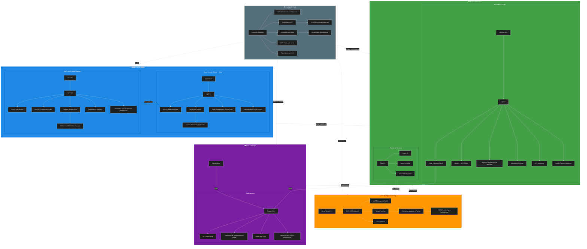

### **🔹 Полный стек Senior C# Developer (2025)**
*(с фокусом на ваши цели: MAUI, Blazor Hybrid, IoT+AI, ASP.NET)*

---
### **🔥 Ключевые моменты для Senior C# Developer (ваш стек)**
1. **MAUI + Blazor Hybrid**:
   - Глубокое знание **MVVM**, **DI**, и **платформенных API** (например, доступ к камере/геолокации).
   - Интеграция с **BlazorWebView** для гибридных мобильных приложений.
   - Оптимизация производительности (например, **AOT-компиляция** для MAUI).

2. **ASP.NET Core**:
   - **Minimal APIs** + **SignalR** для реального времени (например, дашборды IoT).
   - **Microservices** с **Dapr** или **Kubernetes** (если масштабируетесь).
   - **PostgreSQL** как основная БД + **TimescaleDB** для хранения данных с датчиков.

3. **IoT + AI (ESP32)**:
   - **TensorFlow Lite** для инференса на устройстве (например, распознавание лиц/объектов).
   - **MQTT** для передачи данных в бэкенд (например, через **EMQX** или **Mosquitto**).
   - **Python** для обучения моделей (например, **PyTorch**) и их конвертации в **TFLite/ONNX**.

4. **Python & AI**:
   - **FastAPI** для развёртывания ML-моделей как микросервисов.
   - Интеграция с **C#** через **gRPC** или **REST** (например, вызов Python-кода из Blazor).

5. **DevOps**:
   - **Docker** для контейнеризации (например, ASP.NET + PostgreSQL в одном `docker-compose`).
   - **Kubernetes** для оркестрации (если проект крупный).
   - **ELK Stack** для логов (особенно актуально для IoT, где много данных с устройств).

6. **Базы данных**:
   - **PostgreSQL** как основная реляционная БД + **TimescaleDB** для временных рядов (данные с датчиков).
   - **Redis** для кэширования (например, результатов распознавания образов).
   - **MongoDB** для неструктурированных данных (например, логов устройств).

---
### **📌 Что изучить в первую очередь?**
| **Цель**               | **Технологии**                          | **Ресурсы**                                                                 |
|-------------------------|-----------------------------------------|-----------------------------------------------------------------------------|
| **Blazor Hybrid**       | MAUI + BlazorWebView + JS Interop       | [Документация MAUI](https://learn.microsoft.com/ru-ru/dotnet/maui/)        |
| **IoT + AI на ESP32**   | TensorFlow Lite + MQTT + C++/MicroPython | [TF Lite для микроконтроллеров](https://www.tensorflow.org/lite/microcontrollers) |
| **PostgreSQL для IoT**  | TimescaleDB + EF Core                   | [TimescaleDB docs](https://docs.timescale.com/)                           |
| **MAUI Performance**    | AOT, SkiaSharp, Memory Profiling        | [MAUI Performance Guide](https://learn.microsoft.com/ru-ru/dotnet/maui/platform-integration/performance) |

---
### **💡 Совет для старта**
Начните с **прототипа**:
1. Создайте **MAUI-приложение** с встроенным **Blazor Hybrid** (например, дашборд для отображения данных с ESP32).
2. Настройте **ESP32** для отправки данных по **MQTT** в бэкенд на **ASP.NET Core**.
3. Сохраняйте данные в **PostgreSQL/TimescaleDB** и визуализируйте их в **Blazor** через **SignalR** (реальное время).
4. Добавьте **TensorFlow Lite** на ESP32 для распознавания образов (например, детекция движения) и отправляйте результаты в бэкенд.

---