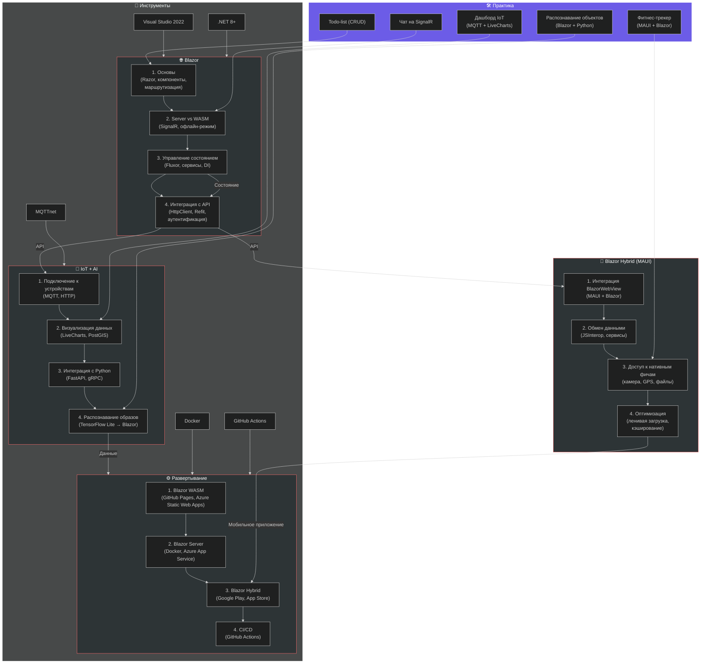
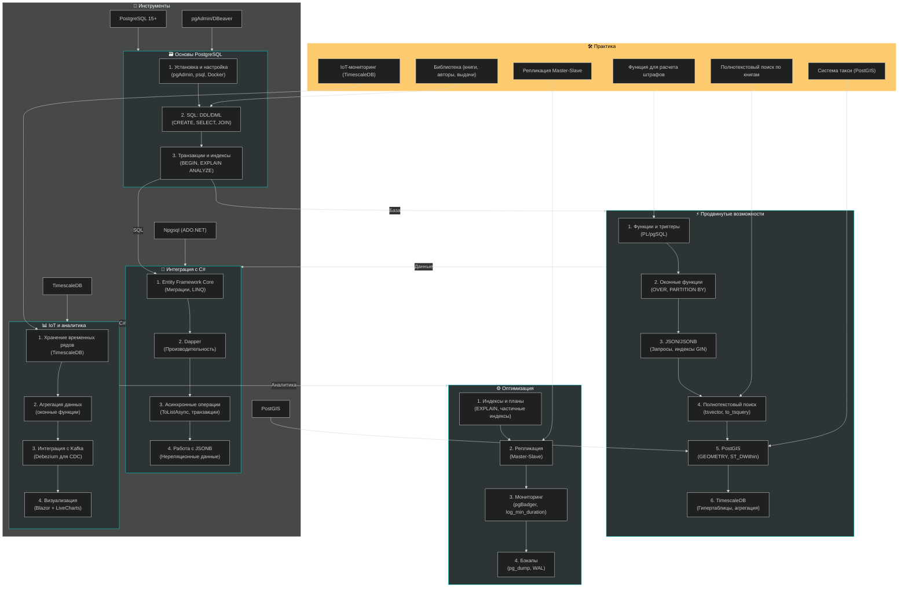
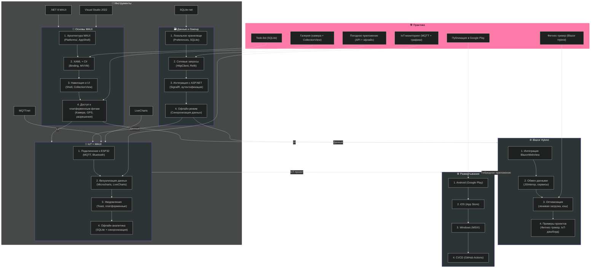

Вот **схемы в формате Mermaid** для трёх последних дорожных карт (**Blazor/Blazor Hybrid**, **PostgreSQL**, **C# MAUI**), визуализирующие ключевые этапы, технологии и связи между ними. Каждая схема включает **основные блоки**, **инструменты** и **практические задачи**.

---

## **1. Схема: Дорожная карта по Blazor & Blazor Hybrid**

---
### **Ключевые моменты схемы Blazor**:
1. **Поток обучения**:
   - От основ Razor → к интеграции с MAUI (Hybrid) → к IoT/AI.
   - Параллельно: развертывание и DevOps.
2. **Практические задачи** привязаны к каждому этапу (например, "Чат на SignalR" после изучения Blazor Server).
3. **Инструменты**: Visual Studio, .NET 8, MQTT, Docker.

---

## **2. Схема: Дорожная карта по PostgreSQL**

---
### **Ключевые моменты схемы PostgreSQL**:
1. **Поток обучения**:
   - От основ SQL → к продвинутым фичам (JSON, PostGIS) → к интеграции с C# → к IoT-аналитике.
2. **Практические задачи**:
   - Проекты нарастающей сложности: от библиотеки до IoT-мониторинга.
3. **Инструменты**:
   - **TimescaleDB** для временных рядов, **PostGIS** для геоданных, **Dapper** для высокой производительности.

---

## **3. Схема: Дорожная карта по C# MAUI**

---
### **Ключевые моменты схемы MAUI**:
1. **Поток обучения**:
   - От основ MAUI → к работе с данными → к Blazor Hybrid/IoT → к развертыванию.
2. **Практические задачи**:
   - Проекты от простого (Todo-list) к сложному (IoT-мониторинг с MQTT).
3. **Инструменты**:
   - **MQTTnet** для IoT, **LiveCharts** для визуализации, **SQLite-net** для локального хранилища.

---
## **🔹 Общая легенда для всех схем**:
| **Цвет**       | **Блок**                  | **Описание**                                  |
|----------------|---------------------------|-----------------------------------------------|
| 🟣 (Красный)   | Blazor                    | Веб-разработка и гибридные приложения.       |
| 🟢 (Зеленый)   | PostgreSQL                | Базы данных, SQL, аналитика.                  |
| 🟣 (Фиолетовый)| MAUI                      | Кроссплатформенные мобильные/десктопные приложения. |
| 🟡 (Желтый)    | Практические задачи       | Конкретные проекты для портфолио.             |
| ⚪ (Белый)     | Инструменты               | Технологии и библиотеки.                     |

---
## **📌 Как использовать схемы**:
1. **Blazor**:
   - Начните с блока **Основы Blazor** → переходите к **Hybrid** и **IoT/AI**.
   - Практикуйтесь с задачами (например, "Чат на SignalR").

2. **PostgreSQL**:
   - Освойте **основы SQL** → переходите к **продвинутым фичам** (JSON, PostGIS).
   - Интегрируйте с **C#** (EF Core/Dapper) и применяйте в **IoT-проектах**.

3. **MAUI**:
   - Изучите **основы XAML/MVVM** → добавьте **Blazor Hybrid** для гибридных приложений.
   - Практикуйтесь с **IoT** (MQTT, датчики) и **развертыванием** (Google Play/App Store).