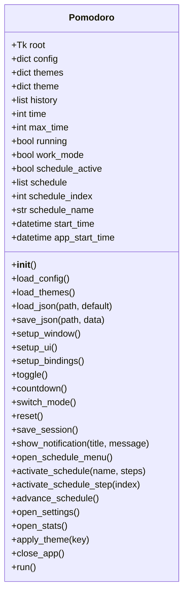
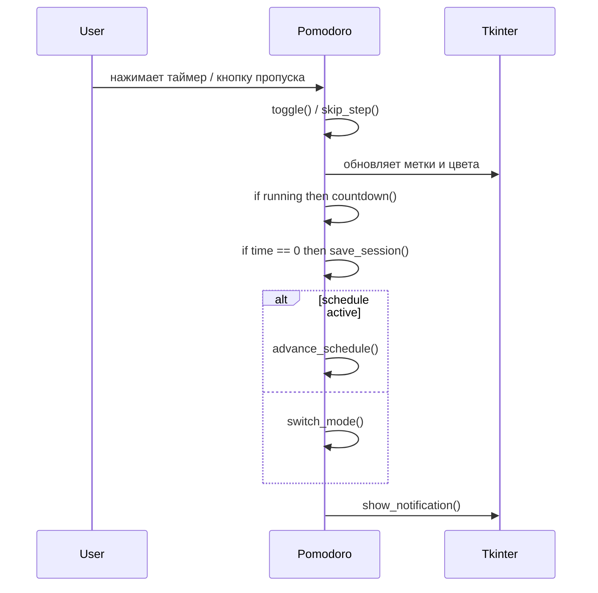
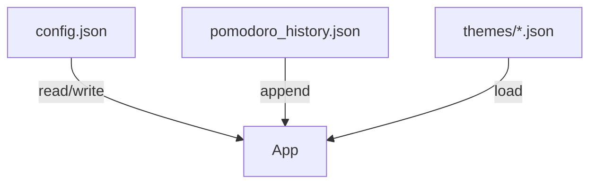

# Pomodoro Timer

## Обзор

**Pomodoro Widget** — это компактный настольный таймер, реализованный на Python с GUI на `tkinter`. Приложение работает в режиме "поверх всех окон", сохраняет настройки и историю работы в JSON, поддерживает темы, уведомления и расширенный режим расписания.

## Стек технологий

- Python 3.6+
- `tkinter` — графический интерфейс
- `json` — конфигурация и история
- `os`, `platform` — работа с файловой системой и платформо-зависимые проверки
- `datetime` — временные метки и длительность сессий
- `subprocess` — воспроизведение аудио на macOS/Linux

## Структура проекта

```text
Projects/Python/PomodoroTimerDescApp/
├── PomodoroPy.py
├── README.md
├── config.json
├── pomodoro_history.json
└── themes/
    ├── dark.json
    ├── light.json
    └── blue.json
```

## Основные возможности

- Работа и отдых с настраиваемыми интервалами
- Автозапуск следующего шага
- Сохранение позиции и размеров окна
- Поддержка зонального режима расписания
- Сохранение истории сессий в `pomodoro_history.json`
- Окно статистики с итогами и последними записями
- Всплывающие уведомления и звуковые сигналы
- Три встроенные темы и загрузка пользовательских тем

## Архитектура класса



## Поток выполнения приложения

```mermaid
flowchart TD
    Start[Start Application] --> Init[Pomodoro.__init__()]
    Init --> LoadConfig[load_config()]
    Init --> LoadThemes[load_themes()]
    Init --> LoadHistory[load_json(pomodoro_history.json)]
    Init --> SetupWindow[setup_window()]
    Init --> SetupUI[setup_ui()]
    Init --> SetupBindings[setup_bindings()]
    Init --> UpdateDisplay[update_display()]
    Init --> UpdateUptime[update_uptime()]
    UpdateUptime --> Mainloop[root.mainloop()]
```

## Основные сценарии вызовов



## Режимы работы

- Обычный режим Pomodoro: циклы `work_time` / `break_time`
- Расписание: шаги из JSON с каждой длительностью и меткой
- Пропуск шага: кнопка `⏭` или пробел
- Сброс: правый клик мыши
- Закрытие: двойной клик или кнопка `✕`

## Схема логики таймера

```mermaid
flowchart LR
    A[Пользователь запускает таймер] --> B{running?}
    B -- Да --> C[Остановить таймер]
    B -- Нет --> D[Начать отсчет]
    D --> E[countdown()]
    E --> F{time > 0}
    F -- Да --> E
    F -- Нет --> G[save_session()]
    G --> H{schedule_active?}
    H -- Да --> I[advance_schedule()]
    H -- Нет --> J[switch_mode()]
    I --> E
    J --> E
```

## Файловая схема данных



## Формат расписания

JSON-расписание поддерживает два формата:

- объект с ключом `steps`
- список шагов напрямую

Пример шага:

```json
{
  "duration": 1500,
  "label": "🍅 Помидор №1",
  "type": "work",
  "sound": ""
}
```

## Стек и зависимости

- Python 3.6+
- Стандартная библиотека:
  - `tkinter`
  - `json`
  - `os`
  - `platform`
  - `datetime`
  - `subprocess`
- Опционально:
  - `winsound` на Windows
  - `paplay`, `aplay`, `mpv`, `vlc`, `ffplay` или `xdg-open` на Linux/macOS

## Запуск

```bash
cd Projects/Python/PomodoroTimerDescApp
python PomodoroPy.py
```

> На Linux/macOS убедитесь, что установлен один из проигрывателей `paplay`, `aplay`, `mpv`, `vlc`, `ffplay` или доступна команда `xdg-open`.

## Как изменить тему

1. Скопируйте файл темы из `themes/`
2. Переименуйте его в `my_theme.json`
3. Отредактируйте цвета и шрифты
4. Перезапустите приложение

## Как добавить настройку

1. Добавьте новый ключ в `DEFAULTS`
2. Создайте поле ввода в `open_settings()`
3. Сохраните значение в `self.config`
4. Обновите `save_json()` и UI при необходимости

## Особенности реализации

- Окно всегда поверх всех остальных благодаря `-topmost`
- Позиция и размер окна сохраняются при выходе
- История сессий хранится в JSON
- Всплывающие уведомления рисуются собственным окном `Toplevel`
- Кроссплатформенный звук с несколькими fallback-вариантами
- Расписание может быть отключено в любой момент
