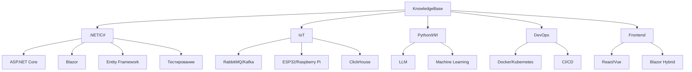

# Knowledge Base
>Полезные материалы для обучения: учебные ресурсы, ссылки, ответы на вопросы и другие вспомогательные инструменты.

---

### **1. Структура репозитория**
Репозиторий организован как **база знаний для FullStack-разработчика**, с акцентом на:
- **Документацию** (теория, гайды, чек-листы).
- **Практические материалы** (вопросы с собеседований, тестовые задания, вакансии).
- **Ссылки на ресурсы** (статьи, инструменты, курсы).

---

Основные папки и их назначение

| **Папка**                     | **Описание**                                                                                     | **Примеры содержимого**                                                                                     |
|-------------------------------|-------------------------------------------------------------------------------------------------|-------------------------------------------------------------------------------------------------------------|
| `/IT/Developer/FullStack/RU/` | Основная папка с материалами на русском языке.                                                 | `README.md`, `RoadMap.md`, `GuidLines.md`, `Links.md`                                                       |
| `/Docs/`                       | Техническая документация по технологиям.                                                       | Папки: `C#`, `Docker`, `Kubernetes`, `ELK`, `Git`, `DataBase`, `MessageQueue`, `OOP`, `Python`, `Tests`       |
| `/Code/`                       | Практические примеры кода (пока пустая).                                                        | —                                                                                                           |
| `/Promts/`                     | Запросы для LLM (например, для генерации кода или документов).                                   | —                                                                                                           |
| `/Questions/`                  | Вопросы с собеседований (технические и теоретические).                                           | —                                                                                                           |
| `/TestTasks/`                  | Тестовые задания для практики.                                                                  | —                                                                                                           |
| `/Vacancies/`                  | Анализ вакансий и требований к разработчикам.                                                   | —                                                                                                           |
| `/RoadMaps/`                   | Дорожные карты по изучению технологий.                                                          | —                                                                                                           |
| `/img/`                        | Изображения (схемы, скриншоты).                                                                 | —                                                                                                           |

---

### **2. Технологический стэк (по твоим интересам)**
#### **C# / .NET / ASP.NET Core**
- **Темы**:
  - Асинхронное программирование (`async/await`, `Task`, `ValueTask`).
  - Работа с потоками (`Thread`, `TPL`).
  - Коллекции, `Garbage Collection`, `Stack/Heap`, `Boxing/Unboxing`.
  - `CodeFirst/DBFirst/ModelFirst` (Entity Framework).
  - **ASP.NET Core**: Middleware, Dependency Injection (`Singleton/Scoped`).
  - **Blazor** (включая Blazor Hybrid).
  - **Тестирование**: xUnit, NUnit, Fixture, юнит-тесты.
  - **Паттерны**: SOLID, KISS, DRY, YAGNI, TDD, DDD, CQRS, Event Sourcing.
  - **Протоколы**: REST, gRPC, WebSocket (SignalR), SOAP (WSDL), GraphQL.

- **Инструменты**:
  - Devexpress, Telerik (UI-компоненты).
  - Postman (тестирование API).
  - SonarQube (линтинг).

#### **Базы данных**
- **Реляционные**: EF Core, Dapper, T-SQL, PL/SQL, PG/SQL.
- **NoSQL**: Redis, Elasticsearch, ClickHouse.
- **ETL**: Extract, Transform, Load.
- **Оптимизация**: Индексы, планы выполнения, оконные функции.

#### **DevOps / Инфраструктура**
- **CI/CD**: Базовые принципы, Kubernetes, Docker.
- **Очереди сообщений**: RabbitMQ, Kafka, NATS (особенно актуально для IoT).
- **Git**: Pull/Push, Merge/Rebase, Cherry-Pick.
- **Инструменты**: Nexus Repository, GitLab, GitHub Actions.

#### **Frontend**
- **JavaScript/TypeScript**: React, Vue, Angular.
- **C#**: Blazor (включая Blazor Hybrid для кросс-платформенных приложений).
- **HTML/CSS**: Стандарты и лучшие практики.

#### **IoT (твой интерес!)**
- **Протоколы**: gRPC, WebSocket (SignalR) — актуальны для обмена данными между устройствами (ESP32, Raspberry Pi).
- **Очереди сообщений**: RabbitMQ/Kafka — для обработки потоков данных с датчиков.
- **Базы данных**: ClickHouse (для хранения временных рядов), Elasticsearch (для логов и аналитики).
- **Docker/Kubernetes**: Развёртывание микросервисов для IoT-платформ.

#### **Python / ИИ**
- **Машинное обучение**: Упоминания в контексте Python и алгоритмов.
- **LLM**: MistralAI, QWEN, Giga.Chat, ElevenLabs (TTS).
- **Библиотеки**: Kiota (для работы с Microsoft Graph API).

#### **ELK Stack**
- **Elasticsearch**: Поиск и аналитика логов.
- **Logstash/Kibana**: Сбор и визуализация данных (актуально для мониторинга IoT-систем).

---

### **3. Документация и учебные материалы**
#### **Гайды и стандарты**
- **Code Style**: Правила для C#, Python, JS, TS, SQL ([пример](https://github.com/mordman/KnowledgeBase/blob/main/IT/Developer/FullStack/RU/Docs/CodeStyle/)).
- **Git**: Конвенции для коммитов (`Feat`, `Fix`, `Docs` etc.).
- **Архитектура**: Микросервисы, паттерны.

#### **Ссылки на ресурсы**
- **Roadmaps**: [roadmap.sh](https://roadmap.sh/) (ASP.NET, Backend).
- **Статьи**: Habr, Microsoft Docs, SberTech.
- **Практика**: LeetCode, HackerRank, CodeWars.
- **LLM**: Списки моделей, туториалы по агентам.

#### **Вопросы с собеседований**
- Технические вопросы по .NET, SQL, алгоритмам.
- Примеры: [150 вопросов для .NET-разработчика](https://itvdn.com/ru/blog/article/150-questions-net-developer).

---

### **4. Практические материалы (заготовки)**
- **Тестовые задания**: Папка `/TestTasks/` (пока пустая, но можно наполнить примерами для IoT или ASP.NET).
- **Вакансии**: Анализ требований рынка (`/Vacancies/`).
- **Prompts для LLM**: Папка `/Promts/` (можно использовать для генерации кода на C#/Python).

---
### **5. Визуализация связей (Mermaid)**

---