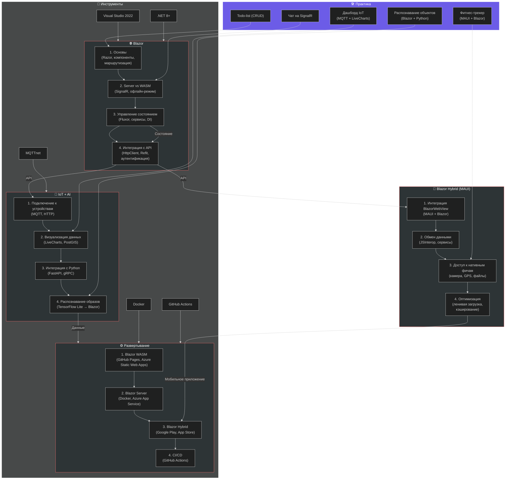
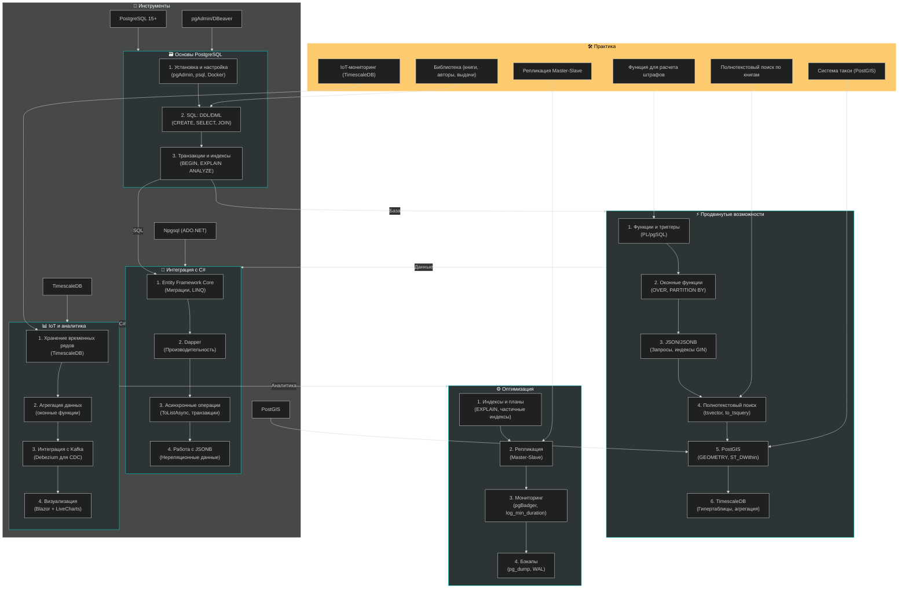
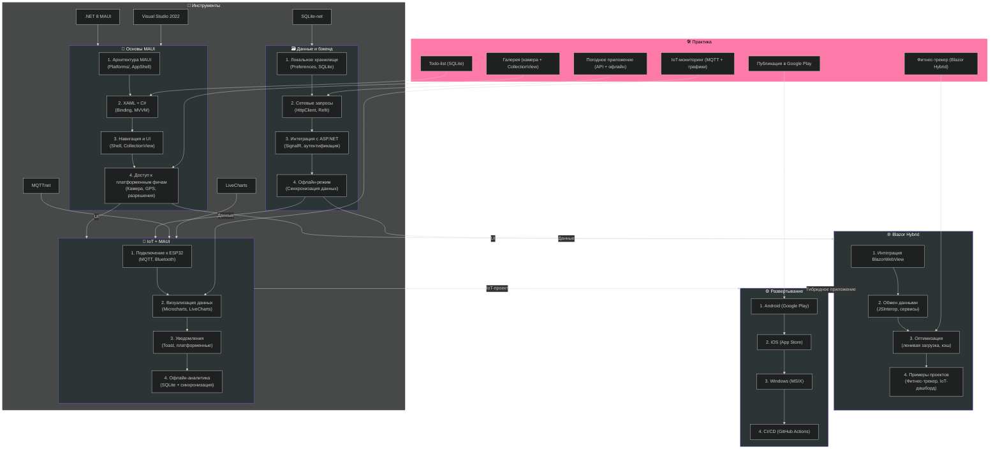
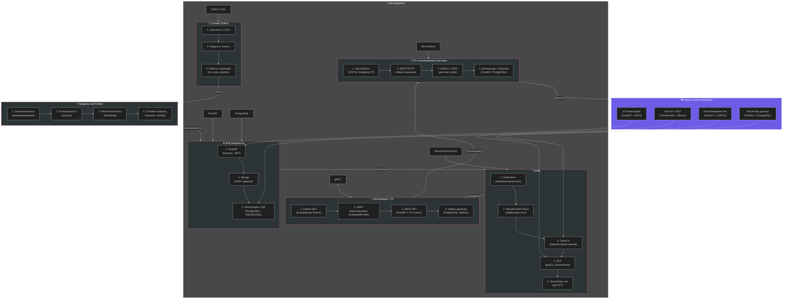
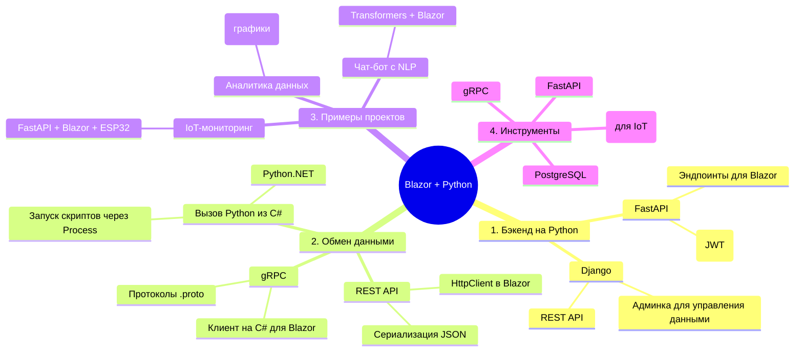
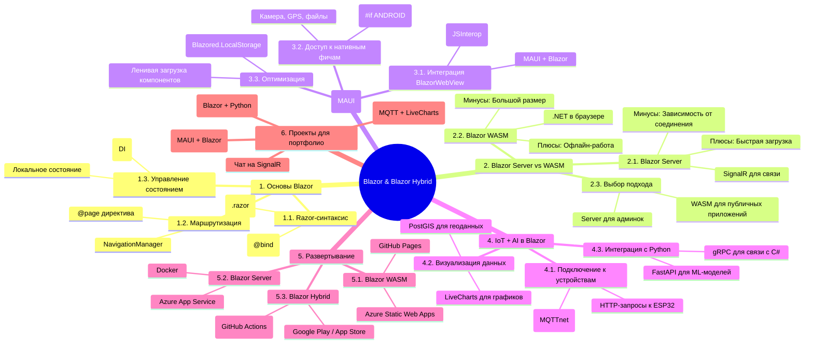
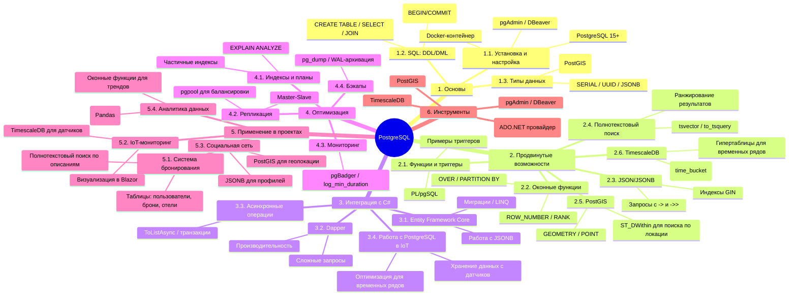
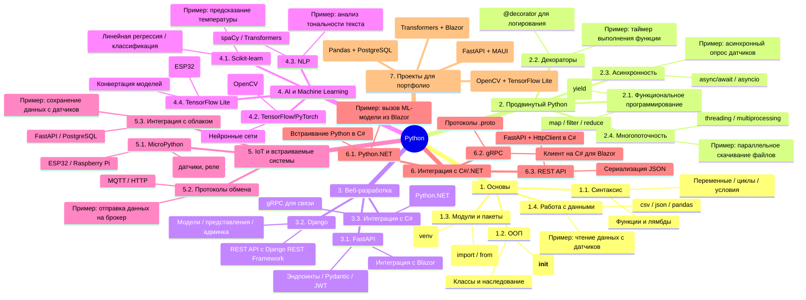
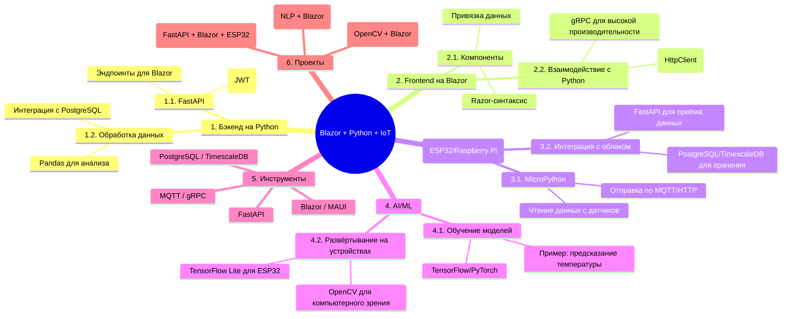

# **Дорожная карта по Blazor & Blazor Hybrid**

## Оглавление
    - [**Ключевые моменты схемы Blazor**:](#ключевые-моменты-схемы-blazor)
- [**Дорожная карта по PostgreSQL**](#дорожная-карта-по-postgresql)
    - [**Ключевые моменты схемы PostgreSQL**:](#ключевые-моменты-схемы-postgresql)
- [**Дорожная карта по C# MAUI**](#дорожная-карта-по-c-maui)
    - [**Ключевые моменты схемы MAUI**:](#ключевые-моменты-схемы-maui)
  - [**🔹 Общая легенда для всех схем**:](#общая-легенда-для-всех-схем)
  - [**📌 Как использовать схемы**:](#как-использовать-схемы)
  - [**🔹 Схема: Дорожная карта по Python**](#схема-дорожная-карта-по-python)
  - [**1. Mind Map: Blazor & Blazor Hybrid**](#1-mind-map-blazor-blazor-hybrid)
  - [**2. Mind Map: PostgreSQL**](#2-mind-map-postgresql)
  - [**3. Mind Map: Python**](#3-mind-map-python)
    - [**🎯 Пример для вашего стека (Blazor + Python + IoT)**](#пример-для-вашего-стека-blazor-python-iot)

    - [**Ключевые моменты схемы Blazor**:](#ключевые-моменты-схемы-blazor)
    - [**Ключевые моменты схемы PostgreSQL**:](#ключевые-моменты-схемы-postgresql)
    - [**Ключевые моменты схемы MAUI**:](#ключевые-моменты-схемы-maui)
  - [**🔹 Общая легенда для всех схем**:](#общая-легенда-для-всех-схем)
  - [**📌 Как использовать схемы**:](#как-использовать-схемы)
  - [**🔹 Схема: Дорожная карта по Python**](#схема-дорожная-карта-по-python)
  - [**1. Mind Map: Blazor & Blazor Hybrid**](#1-mind-map-blazor-blazor-hybrid)
  - [**2. Mind Map: PostgreSQL**](#2-mind-map-postgresql)
  - [**3. Mind Map: Python**](#3-mind-map-python)
    - [**🎯 Пример для вашего стека (Blazor + Python + IoT)**](#пример-для-вашего-стека-blazor-python-iot)

---
### **Ключевые моменты схемы Blazor**:
1. **Поток обучения**:
   - От основ Razor → к интеграции с MAUI (Hybrid) → к IoT/AI.
   - Параллельно: развертывание и DevOps.
2. **Практические задачи** привязаны к каждому этапу (например, "Чат на SignalR" после изучения Blazor Server).
3. **Инструменты**: Visual Studio, .NET 8, MQTT, Docker.

---

# **Дорожная карта по PostgreSQL**

---
### **Ключевые моменты схемы PostgreSQL**:
1. **Поток обучения**:
   - От основ SQL → к продвинутым фичам (JSON, PostGIS) → к интеграции с C# → к IoT-аналитике.
2. **Практические задачи**:
   - Проекты нарастающей сложности: от библиотеки до IoT-мониторинга.
3. **Инструменты**:
   - **TimescaleDB** для временных рядов, **PostGIS** для геоданных, **Dapper** для высокой производительности.

---

# **Дорожная карта по C# MAUI**

---
### **Ключевые моменты схемы MAUI**:
1. **Поток обучения**:
   - От основ MAUI → к работе с данными → к Blazor Hybrid/IoT → к развертыванию.
2. **Практические задачи**:
   - Проекты от простого (Todo-list) к сложному (IoT-мониторинг с MQTT).
3. **Инструменты**:
   - **MQTTnet** для IoT, **LiveCharts** для визуализации, **SQLite-net** для локального хранилища.

---
## **🔹 Общая легенда для всех схем**:
| **Цвет**       | **Блок**                  | **Описание**                                  |
|----------------|---------------------------|-----------------------------------------------|
| 🟣 (Красный)   | Blazor                    | Веб-разработка и гибридные приложения.       |
| 🟢 (Зеленый)   | PostgreSQL                | Базы данных, SQL, аналитика.                  |
| 🟣 (Фиолетовый)| MAUI                      | Кроссплатформенные мобильные/десктопные приложения. |
| 🟡 (Желтый)    | Практические задачи       | Конкретные проекты для портфолио.             |
| ⚪ (Белый)     | Инструменты               | Технологии и библиотеки.                     |

---
## **📌 Как использовать схемы**:
1. **Blazor**:
   - Начните с блока **Основы Blazor** → переходите к **Hybrid** и **IoT/AI**.
   - Практикуйтесь с задачами (например, "Чат на SignalR").

2. **PostgreSQL**:
   - Освойте **основы SQL** → переходите к **продвинутым фичам** (JSON, PostGIS).
   - Интегрируйте с **C#** (EF Core/Dapper) и применяйте в **IoT-проектах**.

3. **MAUI**:
   - Изучите **основы XAML/MVVM** → добавьте **Blazor Hybrid** для гибридных приложений.
   - Практикуйтесь с **IoT** (MQTT, датчики) и **развертыванием** (Google Play/App Store).

## **🔹 Схема: Дорожная карта по Python**

Вот **Mind Map** для трёх дорожных карт (**Blazor/Blazor Hybrid**, **PostgreSQL**, **Python**) в формате **Mermaid**, который можно визуализировать в [Mermaid Live Editor](https://mermaid.live/) или других поддерживаемых инструментах (VS Code, Obsidian, GitHub Markdown).

---

## **1. Mind Map: Blazor & Blazor Hybrid**

---

## **2. Mind Map: PostgreSQL**

---

## **3. Mind Map: Python**

### **🎯 Пример для вашего стека (Blazor + Python + IoT)**
Если вам нужна **комбинированная Mind Map** для интеграции этих технологий, вот её структура:

